# verl: Flexible and Efficient RL for LLMs

> Slides 링크: https://tongyx361.github.io/blogs/posts/verl-intro/#/title-slide , 대응하는 강연은 https://www.youtube.com/watch?v=fct7Jd8-bW8 참고

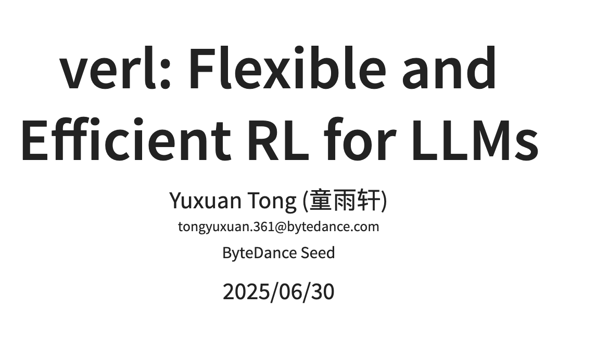

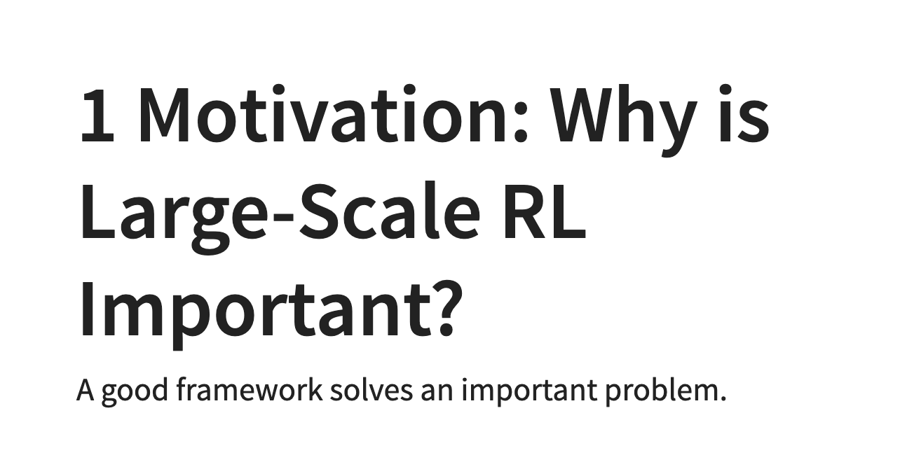

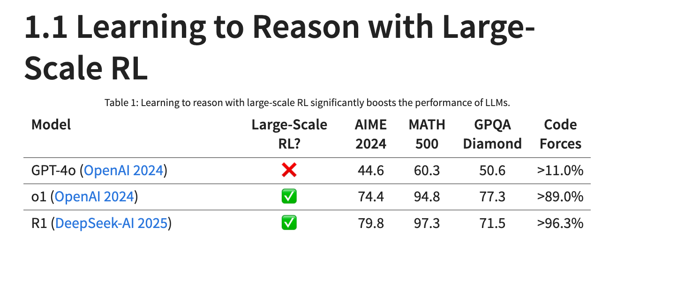

이 Slides의 제목은 "1.1 Learning to Reason with Large-Scale RL"이며, Table 1을 통해 대규모 강화학습(Large-Scale RL)이 대규모 언어 모델(LLM)의 추론 성능에 미치는 현저한 향상 효과를 상세히 보여준다. 표는 세 가지 대규모 언어 모델이 대규모 강화학습을 채택했는지 여부 및 여러 추론 벤치마크에서의 성능을 비교한다. GPT-4o(OpenAI 2024)는 대규모 강화학습을 채택하지 않았으며(❌), AIME 2024, MATH 500, GPQA Diamond, Code Forces에서의 점수는 각각 44.6, 60.3, 50.6, >11.0%이다. 이에 비해 o1(OpenAI 2024)과 R1(DeepSeek-AI 2025)은 모두 대규모 강화학습을 채택했으며(✅), 성능이 현저히 향상되었다. o1 모델은 각 벤치마크에서 점수가 각각 74.4(AIME), 94.8(MATH), 77.3(GPQA), >89.0%(Code Forces)이고, R1 모델(2025년 출시 예정)은 한 발 더 나아가 기록을 갱신하여 AIME와 MATH에서 각각 79.8과 97.3에 도달했으며, Code Forces는 >96.3%, GPQA Diamond는 71.5이다. 표는 대규모 강화학습이 LLM 추론 성능에 미치는 거대한 촉진 작용을 명확하게 보여주며, RL을 채택한 모델이 모든 평가 지표에서 RL을 채택하지 않은 GPT-4o를 크게 능가함을 나타낸다. 특히 수학 추론(MATH), 프로그래밍 경시대회(Code Forces), 과학 질의응답(GPQA) 등 복잡한 추론 작업에서 두드러진 성능을 보이며, 대규모 강화학습이 대규모 언어 모델의 추론 능력을 향상시키는 핵심 기술 경로임을 증명한다.

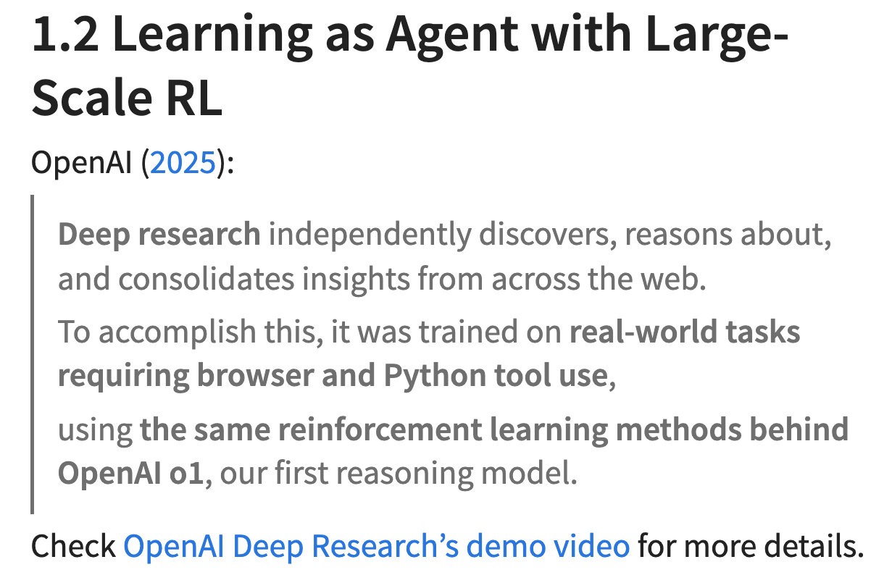

이 Slides의 제목은 "1.2 Learning as Agent with Large-Scale RL"이며, OpenAI가 2025년에 전망한 Deep Research 방향, 즉 대규모 강화학습(Large-Scale RL)을 통해 Agent 학습을 실현하여 웹에서 독자적으로 발견하고 추론하며 통찰을 통합할 수 있는 Agent 를 개발하는 것을 상세히 설명한다. 이 연구 목표는 자율 학습 및 추론 능력을 갖춘 Agent 시스템을 구축하는 데 초점을 맞추며, 이러한 Agent 는 웹 자원을 능동적으로 탐색하고 그로부터 가치 있는 정보를 추출하며 복잡한 추론 과정을 통해 이 정보들을 의미 있는 통찰로 통합할 수 있다. 이 목표를 실현하기 위해 이 Agent 는 브라우저와 Python 도구 사용이 필요한 실제 작업을 처리하도록 학습되며, 이는 Agent 가 텍스트 이해 및 생성 능력뿐만 아니라 웹 브라우징, 데이터 스크래핑, 코드 실행 등 복잡한 조작을 포함한 실제 도구 사용 기술도 갖추어야 함을 의미하며, 순수 텍스트 모델에서 멀티모달 도구 사용 Agent 로의 중요한 전환을 구현한다. 이 연구는 OpenAI o1(OpenAI의 첫 번째 추론 모델)과 동일한 강화학습 방법을 채택했으며, 이는 추론 능력 측면에서 o1의 기술적 우위를 이어받았음을 나타낸다. 대규모 강화학습 훈련을 통해 복잡한 작업에서 Agent 의 성능을 향상시킨다. Slides 마지막에는 OpenAI Deep Research의 데모 영상을 보면 더 많은 세부 사항을 얻을 수 있다고 언급하며, 이 연구가 범용 Agent 구축 측면에서 이룬 진전과 잠재력을 강조한다. 이는 인공지능이 수동적 응답에서 능동적 학습 및 탐색으로 나아가는 중요한 발전 방향을 대표하며, 미래에 진정으로 자율 학습 및 추론 능력을 갖춘 Agent 시스템을 구축하기 위한 중요한 기반을 마련한다.

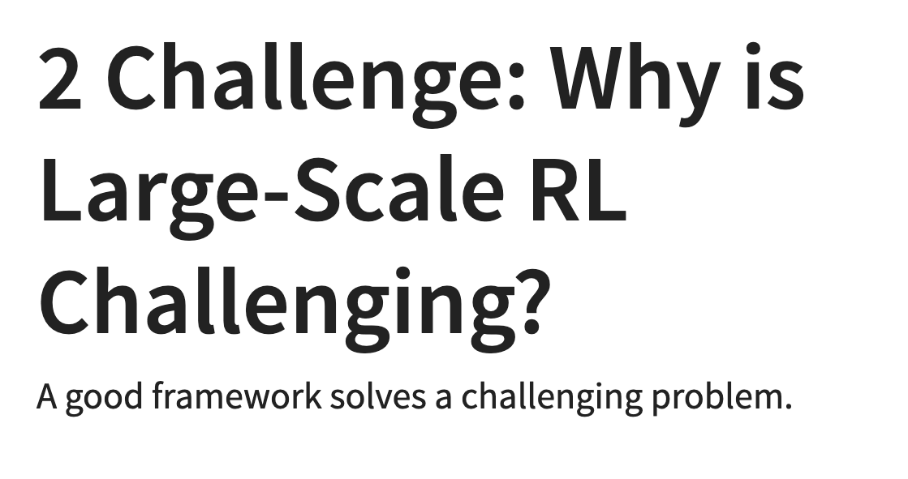

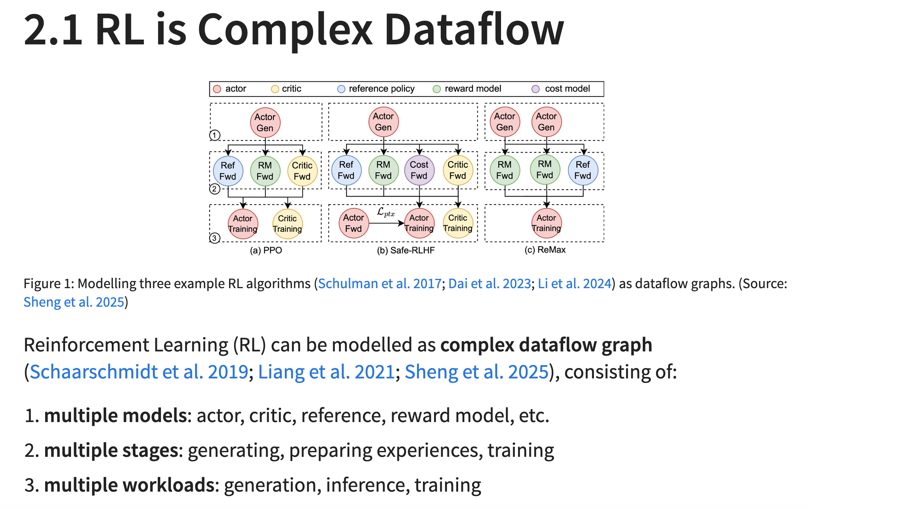

이 Slides의 제목은 "2.1 RL is Complex Dataflow"이며, 핵심 내용은 그림과 텍스트를 통해 강화학습(RL) 알고리즘을 복잡한 **데이터 흐름 그래프(dataflow graph)** 로 모델링할 수 있음을 설명한다. 그림 1은 세 가지 전형적인 RL 알고리즘(PPO, Safe-RLHF, ReMax)의 데이터 흐름 그래프 표현을 상세히 보여주며, 서로 다른 구성 요소를 구분하기 위한 범례를 제공한다. 빨간색 원은 "actor"(정책 네트워크), 노란색 원은 "critic"(가치 네트워크), 파란색 원은 "reference policy"(참조 정책), 초록색 원은 "reward model"(보상 모델), 보라색 원은 "cost model"(비용 모델)을 나타낸다. PPO (a) 알고리즘의 데이터 흐름 그래프는 세 단계로 나뉜다. 1. Actor Gen(정책 생성 단계, Actor 모델이 담당), 2. Forward Pass(데이터 순전파 단계로, "Ref Fwd" 참조 정책 순전파, "RM Fwd" 보상 모델 순전파, "Critic Fwd" critic 순전파 포함), 3. Training(훈련 단계로, "Actor Training" 정책 훈련과 "Critic Training" critic 훈련 포함). 전체 흐름은 Actor가 데이터를 생성하고, 참조 정책, 보상 모델, critic의 순방향 계산을 거쳐 최종적으로 Actor와 Critic의 훈련에 사용된다. Safe-RLHF (b) 알고리즘의 데이터 흐름 그래프는 더 복잡하며, 마찬가지로 세 단계로 나뉜다. 1. Actor Gen(정책 생성), 2. Forward Pass("Ref Fwd", "RM Fwd", "Cost Fwd" 비용 모델 순전파, "Critic Fwd" 포함), 3. Training("Actor Fwd" 정책 순전파, "Actor Training", "Critic Training" 포함). 주목할 점은 "Actor Fwd"와 "Actor Training" 사이에 Lptx(사전 훈련 손실)의 연결이 존재한다는 것으로, 이는 Actor를 훈련할 때 사전 훈련 목표를 결합했을 수 있음을 나타낸다. ReMax (c) 알고리즘의 데이터 흐름 그래프는 비교적 간결하며, 세 단계로 나뉜다. 1. Actor Gen, 2. Forward Pass("RM Fwd"와 "Ref Fwd" 포함), 3. Training("Actor Training"만 포함). 그림 아래의 텍스트 설명은 이러한 데이터 흐름 그래프의 모델링이 Schulman et al. 2017 (PPO), Dai et al. 2023, Li et al. 2024 (Safe-RLHF), 그리고 Sheng et al. 2025 (ReMax)를 참고했음을 나타낸다. 전체적으로 Slides는 강화학습 알고리즘의 복잡성을 강조하며, 이를 데이터 흐름 그래프로 추상화하는 것이 효과적인 분석 및 이해 방식이라고 제안한다. 이는 Schaarschmidt et al. 2019, Liang et al. 2021, Sheng et al. 2025 등의 연구 관점과 일치하며, 이후 유연한 RL 프레임워크를 구축하기 위한 이론적 기반을 제공한다.

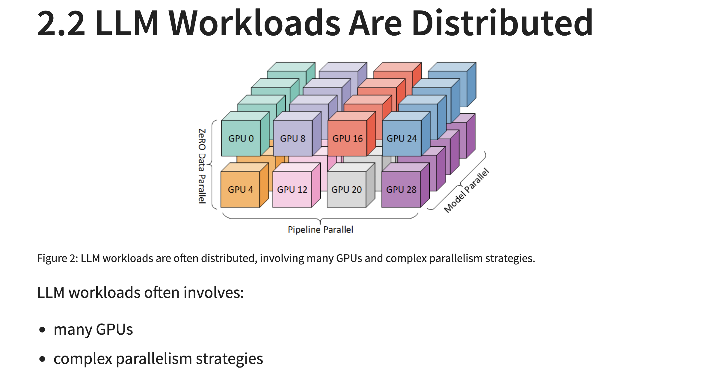

이 Slides의 제목은 "2.2 LLM Workloads Are Distributed"이며, 핵심 내용은 3차원 블록 그림을 통해 대규모 언어 모델(LLM) 워크로드가 멀티 GPU 환경에서 가지는 분산 병렬 전략을 상세히 보여준다. 그림은 4x2xN(N은 깊이 방향으로, 그림에서는 완전히 펼쳐지지 않았지만 "Model Parallel" 축으로 표시됨) GPU 그리드를 예로 들어, 세 가지 주요 병렬 방식을 명확하게 묘사한다. **ZERO Data Parallel**(제로 데이터 병렬), **Pipeline Parallel**(파이프라인 병렬), **Model Parallel**(모델 병렬)이다. 구체적으로, **ZERO Data Parallel** 축은 수직으로 배열되어 서로 다른 GPU가 서로 다른 데이터 샤드를 처리함을 나타낸다. 예를 들어 그림의 GPU 0과 GPU 4는 동일한 파이프라인 단계에 위치하지만 서로 다른 데이터 배치를 처리한다. **Pipeline Parallel** 축은 수평으로 배열되어 서로 다른 GPU가 모델 계산의 서로 다른 단계 또는 레이어를 담당함을 나타낸다. 예를 들어 GPU 0, GPU 8, GPU 16, GPU 24가 하나의 파이프라인을 구성하며, 각 GPU가 모델의 연속된 한 부분을 처리한다. **Model Parallel** 축은 그림 깊이 방향으로 들어가며, 단일 모델이 여러 부분으로 분할되어 서로 다른 GPU가 함께 처리함을 나타낸다. 이는 일반적으로 모델의 서로 다른 레이어 또는 레이어 내의 서로 다른 부분이 서로 다른 GPU에 할당됨을 의미한다. 그림의 블록은 각 GPU를 나타내며, 구체적인 GPU 번호(예: GPU 0, GPU 4, GPU 8, GPU 12, GPU 16, GPU 20, GPU 24, GPU 28)가 표시되어 있고, 서로 다른 색상으로 서로 다른 파이프라인 단계에 있는 GPU 그룹을 추가로 구분한다. Slides의 텍스트 부분은 LLM 워크로드의 두 가지 핵심 특징을 요약한다. **많은 GPU**가 관여하여 LLM 훈련과 추론이 계산 자원에 대한 막대한 요구를 강조하고, **복잡한 병렬 전략**을 채택하여 이러한 GPU 자원을 효율적으로 활용하기 위해 여러 병렬 기술(데이터 병렬, 파이프라인 병렬, 모델 병렬 등)을 결합하여 성능을 최적화해야 함을 지적한다. 이 그림은 LLM의 거대한 규모와 계산 요구에 대응하기 위해 분산 컴퓨팅과 다차원 병렬이 필수적인 전략임을 설명하는 것을 목적으로 한다. 정교한 병렬 설계를 통해 LLM의 훈련 및 추론 효율을 효과적으로 향상시킬 수 있으며, 이후 RL의 분산 환경에서의 구현을 논의하기 위한 중요한 배경 기반을 제공한다.

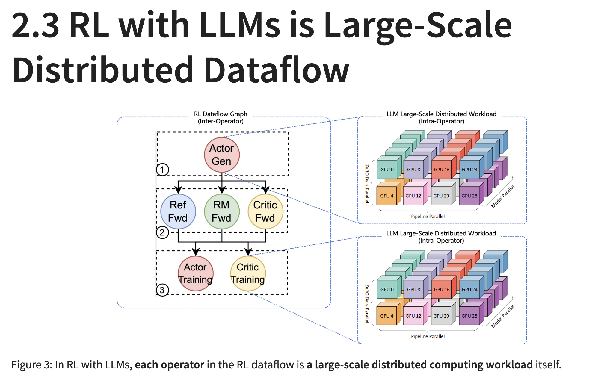

이 Slides의 제목은 "2.3 RL with LLMs is Large-Scale Distributed Dataflow"이며, 핵심 관점은 강화학습(RL)과 대규모 언어 모델(LLM)을 결합할 때 전체 시스템이 대규모 분산 데이터 흐름을 구성함을 설명한다. 왼쪽의 "RL Dataflow Graph (Inter-Operator)" 그림은 전형적인 RL 알고리즘(예: PPO)의 데이터 흐름을 보여주며, 여러 연산자(operator)로 구성되어 세 가지 주요 단계로 나뉜다. 1. **Actor Gen**(정책 생성, 빨간색 타원으로 표시), 2. **Forward Pass**(순전파, "Ref Fwd"(참조 정책 순전파, 파란색 타원), "RM Fwd"(보상 모델 순전파, 초록색 타원), "Critic Fwd"(critic 순전파, 노란색 타원) 포함), 3. **Training**(훈련 단계, "Actor Training"(정책 훈련, 빨간색 타원)과 "Critic Training"(critic 훈련, 노란색 타원) 포함). 이러한 연산자들은 화살표로 연결되어 명확한 계산 의존 그래프를 형성한다. 오른쪽의 두 "LLM Large-Scale Distributed Workload (Intra-Operator)" 그림은 각 RL 연산자 자체가 대규모 분산 컴퓨팅 워크로드임을 한층 더 드러낸다. 각 분산 워크로드는 3D GPU 그리드(예: 4x2xN 구성)로 표현되며, 세 가지 병렬 전략을 결합한다. **ZERO Data Parallel**(수직 방향, 서로 다른 GPU가 서로 다른 데이터 샤드 처리), **Pipeline Parallel**(수평 방향, 서로 다른 GPU가 모델의 서로 다른 단계 처리), **Model Parallel**(깊이 방향, 단일 모델을 여러 GPU로 분할). 그림에는 GPU 번호(예: GPU 0, GPU 4, GPU 8, GPU 12, GPU 16, GPU 20, GPU 24, GPU 28)가 명확히 표시되어 있으며, 점선으로 RL 데이터 흐름 그래프의 연산자를 이러한 분산 워크로드 그림에 연결하여, RL과 LLM이 결합된 시나리오에서 RL 알고리즘 자체가 데이터 흐름일 뿐만 아니라 데이터 흐름 내의 각 기본 연산(예: Actor Gen, Ref Fwd 등)이 복잡하고 다차원적으로 병렬화된 LLM 분산 컴퓨팅 작업임을 직관적으로 설명한다. 이는 RL과 LLM의 결합이 대규모 계산 요구를 지원하기 위해 고도로 복잡한 분산 시스템을 필요로 하며, 각 논리적 연산이 물리적으로 분산된 GPU 클러스터에 매핑되어 실행됨을 강조하고, 현대 AI 시스템에서 알고리즘 복잡성과 시스템 복잡성이 서로 얽혀 있는 특징을 구현한다.

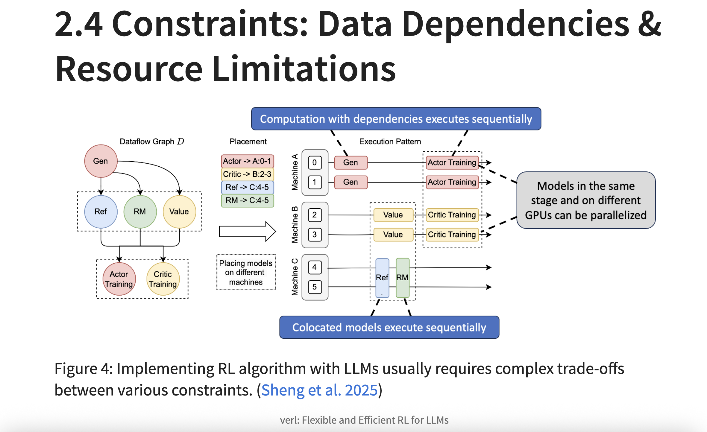

이 Slides의 제목은 "2.4 Constraints: Data Dependencies & Resource Limitations"이며, 핵심 내용은 대규모 언어 모델(LLM)에서 강화학습(RL) 알고리즘을 구현할 때 데이터 의존성과 자원 제약으로 인해 수행해야 하는 복잡한 트레이드오프를 상세히 설명한다. 그림 왼쪽은 단순화된 "Dataflow Graph D"를 보여주며, RL 알고리즘의 논리적 계산 흐름을 묘사한다. "Gen"(생성기, 빨간색)이 데이터를 생성하고, 이 데이터는 "Ref"(참조 정책, 파란색), "RM"(보상 모델, 초록색), "Value"(가치 네트워크, 노란색) 모델에 사용되며, 그 출력이 다시 "Actor Training"(정책 훈련, 빨간색)과 "Critic Training"(critic 훈련, 노란색)을 구동한다. 그림 중간 부분은 "Placement"와 "Execution Pattern"을 통해 이러한 논리적 구성 요소를 물리적 자원에 매핑하는 방법을 보여준다. "Placement"는 모델과 머신 및 GPU 간의 매핑 관계를 정의한다. 예를 들어 "Actor"는 Machine A의 GPU 0-1에, "Critic"은 Machine B의 GPU 2-3에 매핑되고, "Ref"와 "RM"은 함께 Machine C의 GPU 4-5에 매핑된다. "Execution Pattern"은 이러한 모델이 서로 다른 머신에서 실행되는 방식을 구체적으로 보여준다. 예를 들어 Machine A의 GPU 0과 GPU 1은 "Gen"과 "Actor Training"을 병렬로 실행하고, Machine B의 GPU 2와 GPU 3은 "Value"와 "Critic Training"을 병렬로 실행하며, Machine C의 GPU 4와 GPU 5는 "Ref"와 "RM"을 처리한다. Slides는 몇 가지 핵심 제약 및 최적화 원칙을 강조한다. "Computation with dependencies executes sequentially"(의존 관계가 있는 계산은 순차적으로 실행되어야 함), "Models in the same stage and on different GPUs can be parallelized"(동일 단계이지만 서로 다른 GPU에 있는 모델은 병렬화 가능), "Colocated models execute sequentially"(공존하는 모델은 순차적으로 실행됨). 이러한 원칙들은 분산 환경에서 RL 알고리즘을 최적화하는 과제, 즉 데이터 의존성을 충족하면서 합리적인 모델 배치와 실행 스케줄링을 통해 병렬성을 최대화하고 제한된 GPU 자원을 효과적으로 활용하는 방법을 공통적으로 드러낸다. 요약하면, RL 알고리즘과 LLM의 결합을 구현하려면 일반적으로 데이터 의존성, 자원 할당, 병렬 효율을 균형 있게 맞추기 위한 복잡한 트레이드오프가 필요하며, 이는 유연하고 효율적인 RL 시스템을 구축하는 데 매우 중요하다(Sheng et al. 2025).

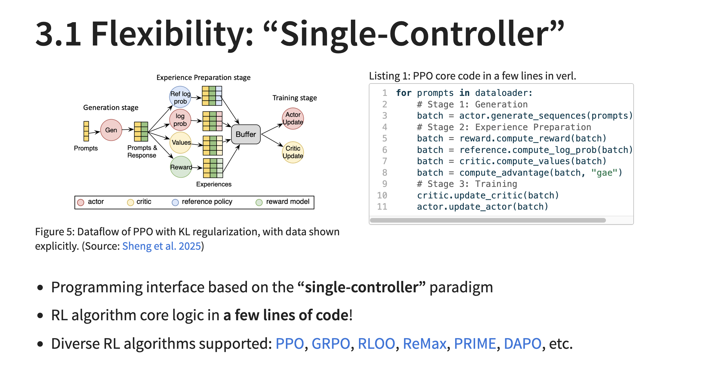

이 Slides의 제목은 "3.1 Flexibility: 'Single-Controller'"이며, 핵심 내용은 상세한 데이터 흐름 그래프(Figure 5)와 간결한 PPO 핵심 코드(Listing 1)를 통해 KL 정규화가 있는 PPO(Proximal Policy Optimization) 알고리즘의 실행 흐름을 공통적으로 설명하고, 그 "단일 컨트롤러"의 유연성을 강조한다. 데이터 흐름 그래프는 PPO 알고리즘의 세 가지 주요 단계를 명확하게 보여준다. 1. **Generation stage(생성 단계)**: "Prompts"(입력 프롬프트)에서 시작하여 "Gen"(빨간색 원, Actor 정책 네트워크를 나타냄)을 통해 "Prompts & Response"(프롬프트와 응답)를 생성한다. 2. **Experience Preparation stage(경험 준비 단계)**: 생성된 "Prompts & Response"는 여러 모델에 병렬로 전달되어 평가된다. "Ref log prob"(파란색 원, Reference Policy 참조 정책을 나타냄)는 참조 정책의 로그 확률을 계산하고, "log prob"(빨간색 원, Actor 정책 네트워크를 나타냄)는 현재 정책의 로그 확률을 계산하며, "Values"(노란색 원, Critic 가치 네트워크를 나타냄)는 현재 상태의 가치를 평가하고, "Reward"(초록색 원, Reward Model 보상 모델을 나타냄)는 보상을 계산한다. 이 모든 계산 결과가 "Experiences"(경험 데이터)로 모인 뒤 "Buffer"(버퍼)에 저장된다. 3. **Training stage(훈련 단계)**: "Buffer"에서 경험 데이터를 꺼내 "Actor Update"(빨간색 원, Actor 정책 네트워크를 나타냄)와 "Critic Update"(노란색 원, Critic 가치 네트워크를 나타냄)를 갱신하는 데 사용한다. 범례는 빨간색 원이 actor, 노란색이 critic, 파란색이 reference policy, 초록색이 reward model을 나타냄을 명확히 한다. Listing 1 "PPO core code in a few lines in verl"은 데이터 흐름 그래프의 세 단계에 직접 대응하는 간결한 Python 유사 구현을 제공한다. Stage 1 (Generation)은 `actor.generate_sequences(prompts)`로 완료되고, Stage 2 (Experience Preparation)는 `reward.compute_reward(batch)`, `reference.compute_log_prob(batch)`, `critic.compute_values(batch)`, `compute_advantage(batch, "gae")`를 순차적으로 호출하여 경험 데이터를 준비하며, Stage 3 (Training)은 `critic.update_critic(batch)`와 `actor.update_actor(batch)`를 통해 모델을 갱신한다. Slides 하단에서는 이 프레임워크의 세 가지 핵심 특성도 강조한다. 프로그래밍 인터페이스가 "single-controller" 패러다임에 기반하고, RL 알고리즘의 핵심 로직을 단 몇 줄의 코드로 구현할 수 있으며, PPO, GRPO, RLOO, ReMax, PRIME, DAPO 등 다양한 강화학습 알고리즘을 지원하여 RL 알고리즘 구현에서의 유연성, 간결성, 광범위한 적용성을 충분히 보여준다.

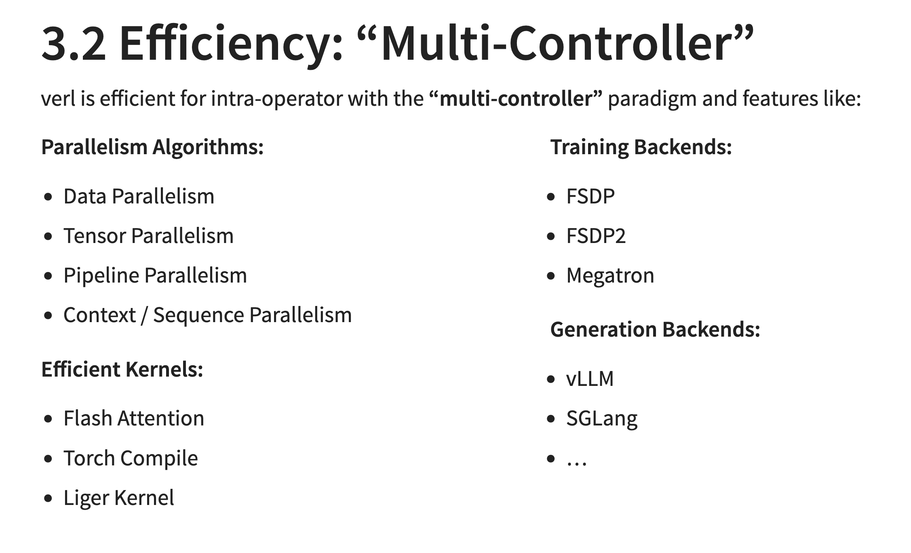

이 Slides의 제목은 "3.2 Efficiency: 'Multi-Controller'"이며, 핵심 내용은 `verl` 프레임워크가 "multi-controller" 패러다임과 일련의 특성을 통해 연산자 내부(intra-operator) 연산을 효율적으로 처리하는 방법을 설명한다. 이러한 특성은 네 가지 주요 범주로 세분화된다. 첫째는 **병렬 알고리즘(Parallelism Algorithms)** 으로, 데이터 병렬(Data Parallelism), 텐서 병렬(Tensor Parallelism), 파이프라인 병렬(Pipeline Parallelism), 컨텍스트/시퀀스 병렬(Context / Sequence Parallelism)을 포함하며, 이러한 알고리즘은 대규모 모델의 여러 디바이스에서의 계산 분배를 최적화하는 것을 목적으로 하고, 서로 다른 병렬 전략을 통해 계산 효율과 자원 이용률을 최대화한다. 둘째는 **고효율 커널(Efficient Kernels)** 로, Flash Attention(메모리 사용량과 계산 복잡도를 현저히 줄이는 고효율 attention 메커니즘), Torch Compile(PyTorch의 JIT 컴파일 최적화로, JIT 컴파일을 통해 실행 효율 향상), Liger Kernel(특정 계산 패턴에 대해 최적화한 커스텀 또는 최적화 커널)을 활용하여 저수준 계산을 가속한다. 셋째는 **훈련 백엔드(Training Backends)** 로, `verl`은 FSDP(Fully Sharded Data Parallel, 완전 샤딩 데이터 병렬), FSDP2(FSDP의 향상 버전으로, 더 나은 메모리 관리와 통신 최적화 제공), Megatron 등 주류 분산 훈련 프레임워크를 통합하여 대규모 모델의 훈련을 지원하며, 이러한 백엔드는 TB 수준의 모델 파라미터와 PB 수준의 훈련 데이터를 처리할 수 있다. 마지막은 **생성 백엔드(Generation Backends)** 로, vLLM(LLM용 고처리량 추론 엔진으로, 추론 성능에 특화하여 최적화), SGLang(구조화된 생성 작업을 위한 언어/런타임으로, 복잡한 생성 패턴 지원)을 지원하며, 향후 더 많은 백엔드를 지원할 것임을 예고한다. 이러한 포괄적인 효율 특성들은 `verl`이 대규모 언어 모델 및 강화학습 워크로드를 처리할 때 고성능과 확장성을 실현하는 기반을 공통적으로 구성하며, multi-controller 패러다임을 통해 연산자 수준의 정교한 제어와 최적화를 실현한다.

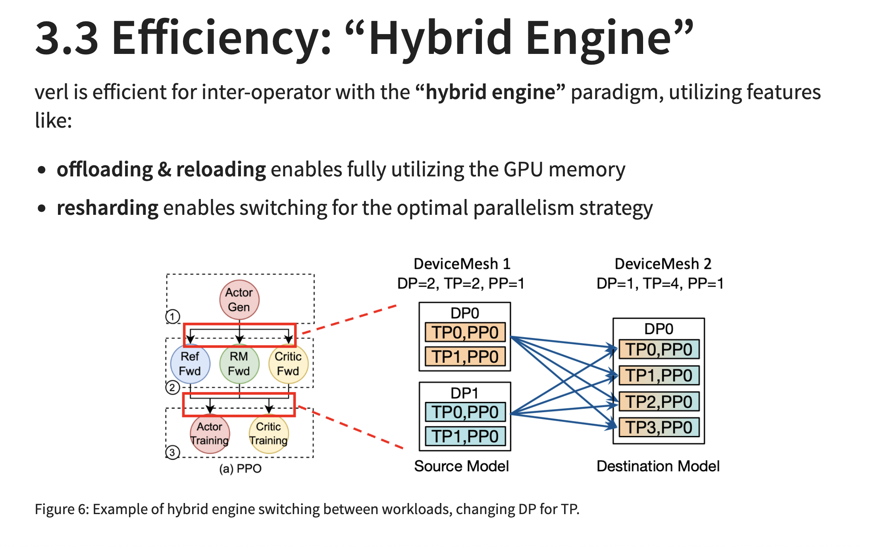

이 Slides의 제목은 "3.3 Efficiency: 'Hybrid Engine'"이며, 핵심 내용은 `verl` 프레임워크가 "하이브리드 엔진(hybrid engine)" 패러다임을 통해 연산자 간(inter-operator) 효율적 처리를 실현하는 방법을 설명하며, 주로 **offloading & reloading**(오프로딩과 재로딩)과 **resharding**(재샤딩) 두 가지 특성을 활용한다. offloading & reloading은 GPU 메모리를 충분히 활용할 수 있으며, resharding은 최적의 병렬 전략으로 전환하는 것을 지원한다. 그림 6은 "하이브리드 엔진이 서로 다른 워크로드 사이를 전환하며 DP를 변경하여 TP에 적응함"을 예로 들어 이 과정을 상세히 보여준다. 왼쪽의 PPO 데이터 흐름 그래프 (a)는 전형적인 강화학습 워크로드를 묘사하며, 세 단계로 나뉜다. 1. **Actor Gen**(정책 생성), 2. **Forward Pass**(순전파, Ref Fwd, RM Fwd, Critic Fwd 포함), 3. **Training**(훈련, Actor Training과 Critic Training 포함). 이러한 단계들은 빨간색 점선으로 "Source Model"(DeviceMesh 1)에 연결되며, 이 모델은 `DP=2, TP=2, PP=1`로 구성된다. 즉 데이터 병렬도가 2, 텐서 병렬도가 2, 파이프라인 병렬도가 1이며, DP0과 DP1 두 개의 디바이스 프로세서로 구성되고, 각 프로세서 내부에는 TP0과 TP1 두 개의 텐서 병렬 유닛이 포함된다. 하이브리드 엔진의 resharding 기능을 통해 시스템은 "Destination Model"(DeviceMesh 2)로 동적으로 전환할 수 있으며, 그 구성은 `DP=1, TP=4, PP=1`이다. 즉 데이터 병렬도가 1로, 텐서 병렬도가 4로 바뀌고, 파이프라인 병렬도는 여전히 1이며, 이때 하나의 디바이스 프로세서 DP0만 존재하지만 그 내부에는 TP0부터 TP3까지 네 개의 텐서 병렬 유닛이 포함된다. 그림의 파란색 선은 Source Model의 네 TP 유닛에서 Destination Model의 네 TP 유닛으로의 복잡한 연결을 보여주며, 서로 다른 워크로드 또는 단계 사이에서 시스템이 데이터 병렬(DP)과 텐서 병렬(TP) 등의 병렬 전략을 동적으로 조정하여 자원의 최적 구성과 계산 효율의 최대화를 실현함으로써, 강화학습의 복잡하고 가변적인 데이터 흐름 및 계산 요구에 대응하는 방식을 직관적으로 구현한다.

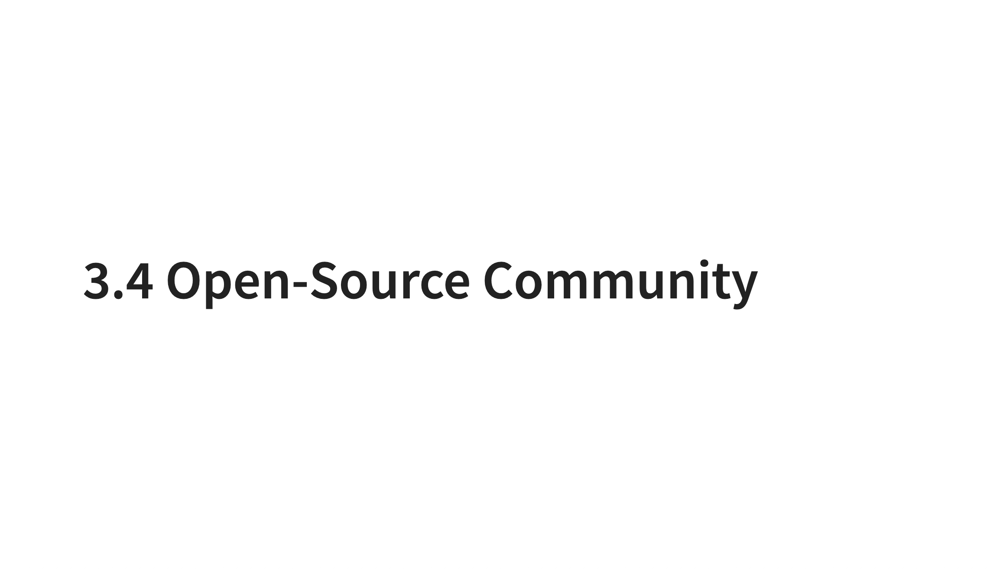

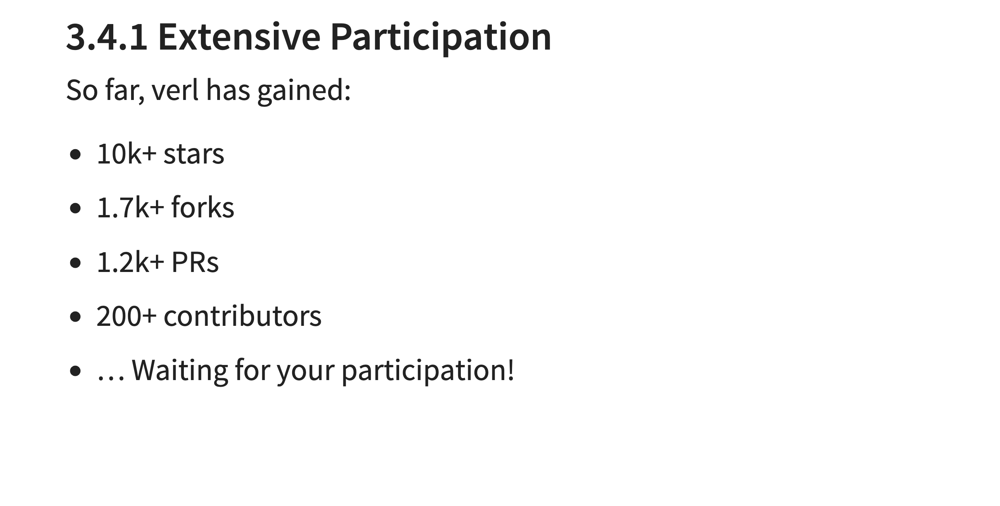

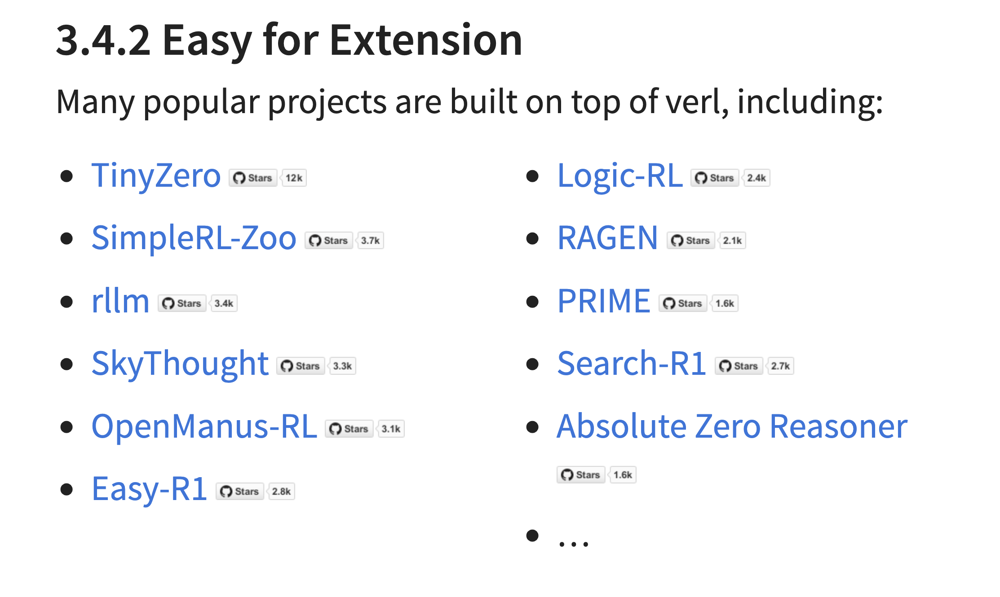

여기서는 오픈소스의 진행 상황을 소개한다.

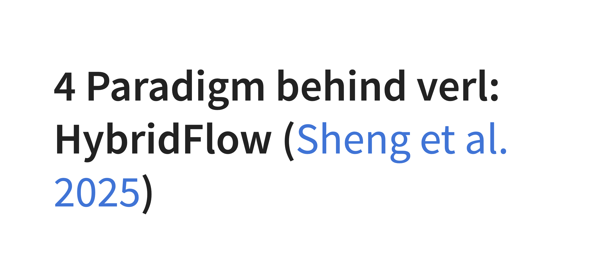

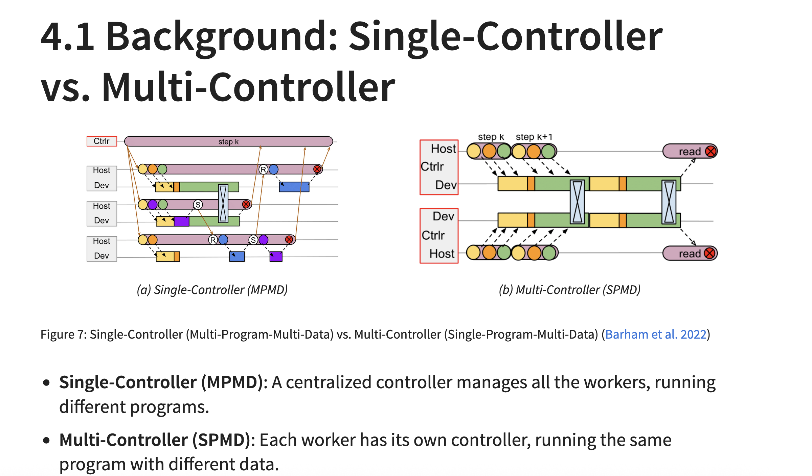

이 두 Slides는 각각 "4 Paradigm behind verl: HybridFlow (Sheng et al. 2025)"와 "4.1 Background: Single-Controller vs. Multi-Controller"를 소개하며, `verl` 프레임워크 배후의 핵심 패러다임인 HybridFlow와 두 가지 서로 다른 분산 컴퓨팅 아키텍처를 상세히 설명한다. 첫 번째 Slides 제목 "4 Paradigm behind verl: HybridFlow (Sheng et al. 2025)"는 `verl` 프레임워크의 이론적 기반, 즉 Sheng 등이 2025년에 제안한 혁신적인 프로그래밍 패러다임인 HybridFlow 패러다임을 간결하게 지적한다. 두 번째 Slides의 제목은 "4.1 Background: Single-Controller vs. Multi-Controller"이며, Figure 7을 통해 두 가지 분산 컴퓨팅 아키텍처를 상세히 비교한다. **Single-Controller (MPMD)** 와 **Multi-Controller (SPMD)** 이다. Single-Controller (MPMD) 아키텍처는 중앙집중식 제어 모드를 보여주며, 단일 "Ctrlr"(컨트롤러)가 여러 "Host"(호스트)와 "Dev"(디바이스) 쌍을 조정하는 것을 담당한다. 컨트롤러는 일련의 연산(보라색과 파란색 원)을 통해 세 개의 독립적인 Host-Dev 작업 유닛에 명령과 데이터를 전송하며, 각 Host-Dev 쌍은 자신의 작업 흐름을 실행한다. Host가 먼저 일부 연산(노란색 원)을 수행한 뒤 작업을 Dev에 분배하고, Dev가 계산(서로 다른 색의 직사각형 블록)을 실행하며 내부 동기화를 수행할 수 있다. Host와 Dev 사이에는 데이터 의존성과 통신이 존재하고, 서로 다른 Host-Dev 쌍 사이에도 의존 관계가 존재할 수 있다. 이 모드에서는 하나의 중앙 컨트롤러가 모든 작업 노드를 관리하며, 각 노드는 서로 다른 프로그램을 실행할 수 있다.

Multi-Controller (SPMD) 아키텍처는 분산 제어 모드를 보여주며, 두 개의 독립적인 컴퓨팅 유닛을 포함하고, 각 유닛은 하나의 "Host", 하나의 "Ctrlr"(컨트롤러), 하나의 "Dev"(디바이스)로 구성된다. 각 유닛 내부에서 Host, Ctrlr, Dev는 각자 일련의 연산(주황색 원, 노란색과 초록색 직사각형 블록)을 실행하고, 점선 화살표를 통해 통신과 데이터 전송을 수행한다. 연산 흐름은 "step k"에서 "step k+1"로 진행되며, 각 유닛의 계산 흐름은 유사하다. 모두 일련의 주황색 원 연산, 노란색과 초록색 직사각형 블록의 계산, 동기화 지점을 포함하며, 마지막에 "read" 연산으로 끝난다. 이 모드에서는 각 작업 노드가 자신의 컨트롤러를 가지며, 동일한 프로그램을 실행하되 서로 다른 데이터를 처리한다. 이 두 아키텍처는 병렬 컴퓨팅과 자원 관리 측면에서 각자의 특징을 가지며, 서로 다른 응용 시나리오에 적합하고, HybridFlow 패러다임의 설계에 중요한 이론적 기반을 제공한다.

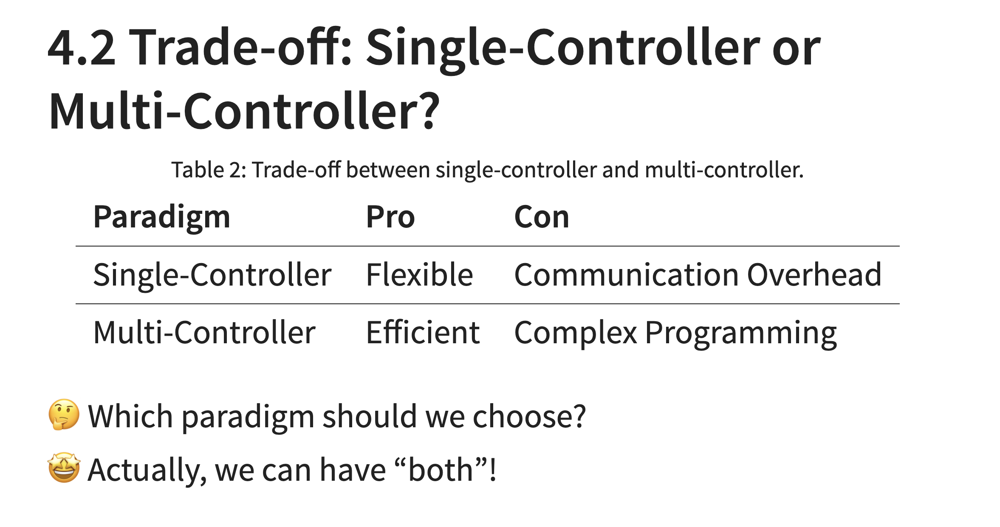

이 Slides의 제목은 "4.2 Trade-off: Single-Controller or Multi-Controller?"이며, 핵심 내용은 Table 2를 통해 단일 컨트롤러와 다중 컨트롤러 두 패러다임 사이의 트레이드오프를 상세히 논의한다. 표는 두 패러다임의 장단점을 명확하게 비교한다. **Single-Controller** 패러다임의 장점은 "Flexible"(유연함)로, 서로 다른 계산 요구에 적응하고 동적으로 조정할 수 있지만, 단점은 "Communication Overhead"(통신 오버헤드)로, 중앙 컨트롤러가 모든 작업 노드를 조정해야 하므로 막대한 통신 비용과 지연이 발생한다. **Multi-Controller** 패러다임의 장점은 "Efficient"(고효율)로, 각 작업 노드가 독립적인 컨트롤러를 가져 통신 오버헤드를 줄이고 병렬 효율을 높이지만, 단점은 "Complex Programming"(프로그래밍 복잡성)으로, 여러 컨트롤러 사이의 동기화와 조정 문제를 처리해야 하여 프로그래밍의 복잡성과 디버깅 난이도가 증가한다. Slides 하단에서는 두 개의 이모티콘과 질문을 통해 이러한 트레이드오프의 도전성을 한층 더 강조한다.

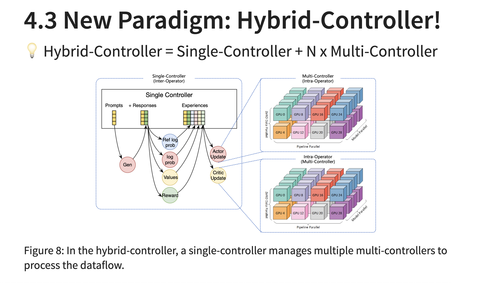

이 Slides의 제목은 "4.3 New Paradigm: Hybrid-Controller!"이며, 핵심 내용은 Hybrid-Controller(하이브리드 컨트롤러)라는 새로운 패러다임을 도입한다. 그 정의는 "Hybrid-Controller = Single-Controller + N x Multi-Controller"이며, 단일 컨트롤러와 다중 컨트롤러의 장점을 결합하여 데이터 흐름을 효율적으로 처리하는 것을 목적으로 한다. 그림(Figure 8)은 이 하이브리드 컨트롤러의 작동 메커니즘을 상세히 보여준다. 왼쪽은 "Single-Controller (Inter-Operator)" 부분으로, PPO와 유사한 전형적인 강화학습(RL) 알고리즘의 데이터 흐름을 묘사한다. "Prompts"(입력 프롬프트)에서 시작하여 "Gen"(생성기, 빨간색 원)을 통해 "Prompts + Responses"(프롬프트와 응답)를 생성하고, 이 응답들은 이후 여러 핵심 지표를 계산하는 데 사용된다. "Ref log prob"(참조 정책 로그 확률, 파란색 원), "log prob"(현재 정책 로그 확률, 빨간색 원), "Values"(가치, 노란색 원), "Reward"(보상, 초록색 원)를 통해 "Experiences"(경험 데이터)를 생성하고, 최종적으로 "Actor Update"(정책 네트워크 갱신, 빨간색 원)와 "Critic Update"(가치 네트워크 갱신, 노란색 원)를 구동한다. 이 단일 컨트롤러는 RL 알고리즘에서 서로 다른 연산자 사이의 고수준 데이터 흐름과 의존 관계를 조정하는 것을 담당하며, "Inter-Operator"(연산자 간) 관리 특성을 구현한다. 오른쪽은 두 개의 "Multi-Controller (Intra-Operator)" 부분으로, 각각 단일 RL 연산자를 실행하기 위한 대규모 분산 컴퓨팅 워크로드를 나타낸다. 3D GPU 그리드를 보여주며, GPU 0, GPU 4, GPU 8, GPU 12, GPU 16, GPU 20, GPU 24, GPU 28 등 여러 GPU를 포함하고, 세 가지 병렬 전략을 결합한다. ZERO Data Parallel(수직 방향, 서로 다른 GPU가 서로 다른 데이터 샤드 처리), Pipeline Parallel(수평 방향, 서로 다른 GPU가 모델 계산의 서로 다른 단계 담당), Model Parallel(깊이 방향, 단일 모델을 여러 GPU로 분할)이며, 서로 다른 색의 GPU 블록은 그것들이 파이프라인에서 가지는 서로 다른 단계를 나타낸다. 이러한 다중 컨트롤러는 단일 연산자 내부의 실행 효율을 최적화하는 것을 담당하며, 정교한 분산 병렬 전략을 통해 GPU 자원의 이용률을 최대화한다. 그림의 점선은 왼쪽 단일 컨트롤러의 "Actor Update"와 "Critic Update" 노드를 오른쪽의 두 다중 컨트롤러 그림에 연결하며, 하이브리드 컨트롤러가 고수준의 "Single-Controller"를 통해 전체 강화학습 알고리즘의 논리적 데이터 흐름(Inter-Operator)을 관리하는 동시에, 여러 "Multi-Controller"를 활용하여 데이터 흐름 내의 각 대규모 분산 연산자(Intra-Operator)를 효율적으로 실행함으로써, 유연성과 효율의 결합을 실현하여 대규모 언어 모델 강화학습의 복잡한 계산 요구에 대응함을 나타낸다.

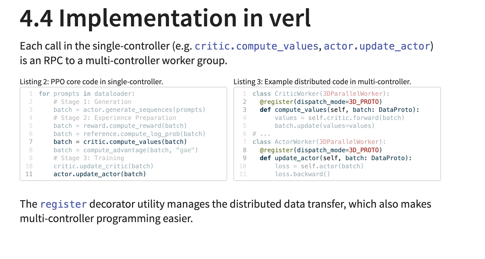

이 Slides의 제목은 "4.4 Implementation in verl"이며, 핵심 내용은 `verl` 프레임워크에서 단일 컨트롤러(single-controller)가 원격 프로시저 호출(RPC)을 통해 다중 컨트롤러(multi-controller) 작업 그룹과 상호작용하여 분산 강화학습 알고리즘의 유연하고 효율적인 실행을 실현하는 방법을 상세히 설명한다. 왼쪽의 "Listing 2: PPO core code in single-controller" 코드 조각은 PPO 알고리즘이 단일 컨트롤러 환경에서 가지는 핵심 로직을 보여주며, `for prompts in dataloader:`에서 시작하는 간결한 Python 스타일 루프로, 명확하게 세 단계로 나뉜다. 1. **Stage 1: Generation**(생성 단계), `batch = actor.generate_sequences(prompts)`를 통해 시퀀스 생성, 2. **Stage 2: Experience Preparation**(경험 준비 단계), 보상 `batch = reward.compute_reward(batch)`, 참조 정책 로그 확률 `batch = reference.compute_log_prob(batch)`, critic 가치 `batch = critic.compute_values(batch)`, 어드밴티지 함수 `batch = compute_advantage(batch, "gae")` 계산, 3. **Stage 3: Training**(훈련 단계), critic 갱신 `critic.update_critic(batch)`와 정책 네트워크 갱신 `actor.update_actor(batch)`. 이 코드는 순차 호출 방식으로 RL 알고리즘의 논리적 데이터 흐름을 명확하게 표현한다. 오른쪽의 "Listing 3: Example distributed code in multi-controller" 코드 조각은 다중 컨트롤러 환경에서의 분산 구현 세부 사항을 보여준다. 두 개의 작업 클래스를 정의한다. `class CriticWorker(3DParallelWorker):`와 `class ActorWorker(3DParallelWorker):`이며, 둘 다 `3DParallelWorker`를 상속하고 `@register(dispatch_mode=3D_PROTO)` 데코레이터로 등록된다. `CriticWorker` 클래스는 `def compute_values(self, batch: DataProto):` 메서드를 포함하며, critic 모델의 순전파 `values = self.critic.forward(batch)`를 실행하고 배치 데이터 `batch.update(values=values)`를 갱신하는 것을 담당한다. `ActorWorker` 클래스는 `def update_actor(self, batch: DataProto):` 메서드를 포함하며, 정책 네트워크의 순전파 `loss = self.actor(batch)`를 실행하고 역전파 `loss.backward()`를 수행하는 것을 담당한다. `@register`로 데코레이션된 이 메서드들은 실제로 단일 컨트롤러 내 대응 함수(예: `critic.compute_values`와 `actor.update_actor`)의 원격 구현이다. Slides 하단 텍스트는 한층 더 설명하기를, `register` 데코레이터 도구가 분산 데이터 전송을 관리하여 다중 컨트롤러 프로그래밍의 복잡성을 단순화한다고 한다. 이 설계 덕분에 개발자는 단일 컨트롤러에서 간결한 RL 알고리즘 로직을 작성할 수 있고, 저수준의 분산 실행과 데이터 전송은 `verl` 프레임워크가 RPC와 `@register` 메커니즘을 통해 투명하게 처리하여, 유연성과 효율의 결합을 실현한다.

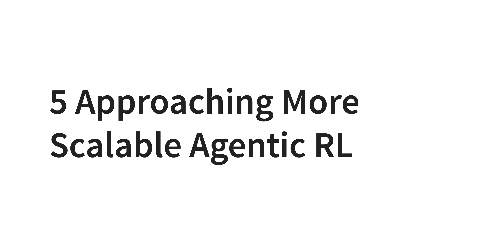

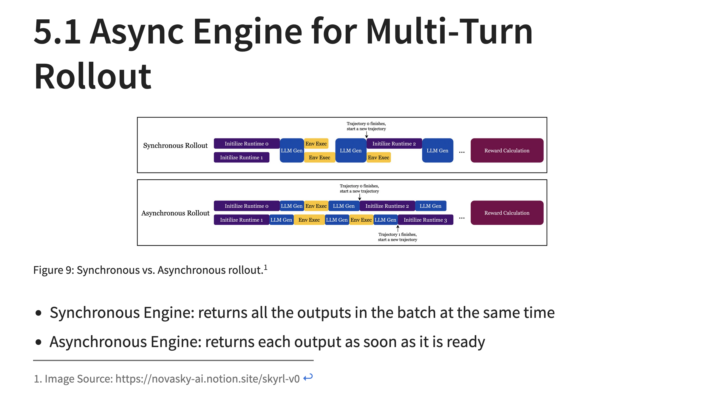

이 Slides의 제목은 "5.1 Async Engine for Multi-Turn Rollout"이며, 주로 Figure 9를 통해 동기(Synchronous)와 비동기(Asynchronous) 두 가지 엔진이 멀티 턴(Multi-Turn) Rollout에서 가지는 작동 방식을 상세히 비교한다. **Synchronous Rollout** 은 전통적인 배치 처리 모드를 보여준다. 시스템은 "Runtime 0"과 "Runtime 1"을 병렬로 초기화하고, 각 Runtime은 "LLM Gen"(대규모 언어 모델 생성) → "Env Exec"(환경 실행) → "LLM Gen"의 시퀀스를 실행한다. 핵심 특징은 "Trajectory 0 finishes, start a new trajectory"(궤적 0 완료, 새 궤적 시작)일 때, 현재 궤적이 동기화 지점에 도달할 때까지 기다려야 "Runtime 2"를 초기화할 수 있다는 것이다. 전체 흐름은 선형적이며, 병렬 초기화가 있더라도 이후 단계는 이전 배치 또는 궤적의 핵심 단계 완료를 기다리는 경향이 있고, 최종적으로 "Reward Calculation"(보상 계산)을 수행한다.

**Asynchronous Rollout** 은 더 효율적인 병렬 모드를 보여준다. 마찬가지로 "Runtime 0"과 "Runtime 1"을 병렬로 초기화하지만, 동기 모드와 달리 비동기 모드에서는 "LLM Gen"과 "Env Exec" 단계가 서로 다른 궤적 사이에서 고도로 교차되고 병렬화된다. 예를 들어 "Runtime 0"의 "LLM Gen Env Exec LLM Gen"과 "Runtime 1"의 "LLM Gen Env Exec LLM Gen"이 타임라인에서 현저히 겹친다. 핵심 장점은 "Trajectory 0 finishes"(궤적 0 완료) 즉시 "Runtime 2"의 초기화를 시작하며, "Runtime 1"의 완료를 기다릴 필요가 없다는 것이다. 마찬가지로 "Trajectory 1 finishes"(궤적 1 완료) 즉시 "Runtime 3"의 초기화를 시작한다. 이 설계는 자원을 더 유연하게 활용할 수 있게 하여, 하나의 궤적이 완료되면 즉시 새 궤적을 시작할 수 있어 전체 처리량을 높인다. Slides 하단에서는 텍스트를 통해 두 엔진의 핵심 차이를 한층 더 명확히 한다. **Synchronous Engine(동기 엔진)** 은 배치 처리에서 "returns all the outputs in the batch at the same time"(배치 내의 모든 출력을 동시에 반환)하는 반면, **Asynchronous Engine(비동기 엔진)** 은 "returns each output as soon as it is ready"(각 출력이 준비되는 즉시 반환)한다. 이러한 비동기 엔진의 설계는 `verl` 프레임워크가 멀티 턴 강화학습 작업에서 더 높은 병렬성과 응답 속도를 실현할 수 있게 하며, 새 작업을 동적으로 시작하고 완료된 작업을 즉시 처리함으로써 전체 시스템의 효율과 자원 이용률을 현저히 향상시킨다.

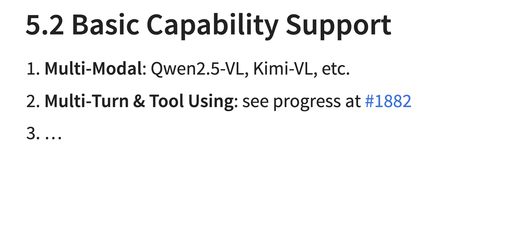

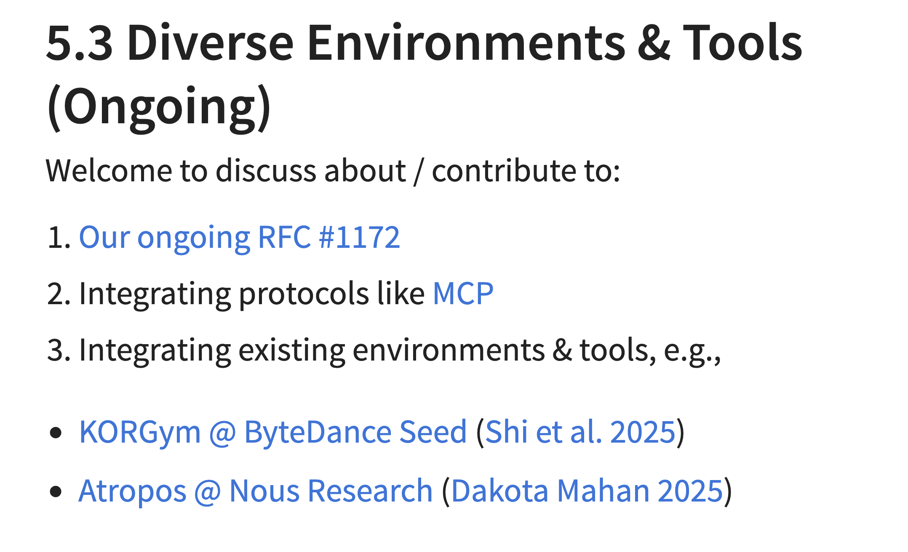

- https://github.com/volcengine/verl/issues/1882

이 두 Slides는 각각 "5.2 Basic Capability Support"와 "5.3 Diverse Environments & Tools (Ongoing)"를 소개하며, `verl` 프레임워크의 기본 능력 지원 및 다양한 환경 도구 통합 측면에서의 진전을 상세히 설명한다. 첫 번째 Slides의 제목은 "5.2 Basic Capability Support"이며, 프레임워크가 현재 지원하는 기본 능력을 나열한다. 1. **Multi-Modal**(멀티모달 지원), "Qwen2.5-VL, Kimi-VL, etc." 등의 비전 언어 모델을 포함하며, `verl` 프레임워크가 이미 텍스트와 이미지 등 다양한 모달리티의 입력을 처리할 수 있음을 나타낸다. 2. **Multi-Turn & Tool Using**(멀티 턴 대화 및 도구 사용), "see progress at #1882"라고 표시되어 있으며, 여기서 "#1882"는 파란색으로 강조 표시되어 클릭 가능한 링크 또는 참조 ID임을 나타내고, GitHub의 구체적인 진행 페이지를 가리키며, 프레임워크의 멀티 턴 대화 및 도구 호출 능력 측면의 개발 진척을 보여준다. 3. **...**(생략 부호)는 목록 내용에 더 많은 항목이 있거나 진행 중일 수 있음을 나타낸다. 두 번째 Slides의 제목은 "5.3 Diverse Environments & Tools (Ongoing)"이며, 이 작업이 진행 중임을 강조하고 시청자가 다음 몇 가지 측면에 대해 논의하거나 기여할 것을 초대한다. 첫째는 "Our ongoing RFC #1172"(진행 중인 RFC #1172)로, RFC(Request for Comments)는 기술 사양 문서이며, 팀이 관련 기술 표준 또는 프로토콜을 제정 중임을 나타낸다. 둘째는 "Integrating protocols like MCP"(MCP 같은 프로토콜 통합)로, MCP는 Model Context Protocol 또는 기타 관련 프로토콜을 가리킬 수 있으며, 프레임워크의 프로토콜 통합 측면의 노력을 보여준다. 마지막은 "Integrating existing environments & tools"(기존 환경 및 도구 통합)로, 두 가지 구체적인 예를 든다. 하나는 "KORGym @ ByteDance Seed (Shi et al. 2025)"로, ByteDance Seed 팀이 개발한 강화학습 환경이고, 다른 하나는 "Atropos @ Nous Research (Dakota Mahan 2025)"로, Nous Research 팀이 개발한 환경이다. 이 두 Slides는 `verl` 프레임워크가 기본 능력 구축 측면에서 가지는 포괄성과 다양한 환경 도구 통합 측면에서의 개방성을 공통적으로 보여주며, 프레임워크가 멀티모달, 멀티 턴 대화, 도구 사용 및 다양한 강화학습 환경을 지원하는 종합 플랫폼을 구축하는 데 전념하고 있음을 구현한다.

- https://github.com/volcengine/verl/issues/1172
- https://github.com/multimodal-art-projection/KORGym
- https://github.com/NousResearch/atropos

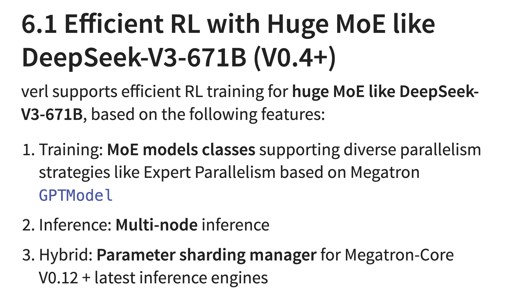

이 Slides는 "6.1 Efficient RL with Huge MoE like DeepSeek-V3-671B (V0.4+)"를 소개하며, `verl` 프레임워크가 대규모 혼합 전문가 모델(MoE)의 고효율 강화학습 훈련을 지원하는 능력을 상세히 설명한다. `verl`이 DeepSeek-V3-671B 같은 대규모 MoE 모델에 대해 고효율 강화학습 훈련을 지원함을 명확히 지적하며, 다음 특성에 기반한다. 1. **Training**(훈련): "MoE models classes supporting diverse parallelism strategies like Expert Parallelism based on Megatron GPTModel"(Megatron GPTModel 기반의 전문가 병렬 등 다양한 병렬 전략을 지원하는 MoE 모델 클래스), 이는 프레임워크가 MoE 모델 특유의 전문가 병렬 계산 패턴을 처리할 수 있음을 나타낸다. 2. **Inference**(추론): "Multi-node inference"(멀티 노드 추론), 여러 노드에 걸친 분산 추론을 지원한다. 3. **Hybrid**(하이브리드): "Parameter sharding manager for Megatron-Core V0.12 + latest inference engines"(Megatron-Core V0.12와 최신 추론 엔진을 위한 파라미터 샤딩 관리자 제공), 훈련과 추론 엔진 사이의 매끄러운 통합을 실현한다.

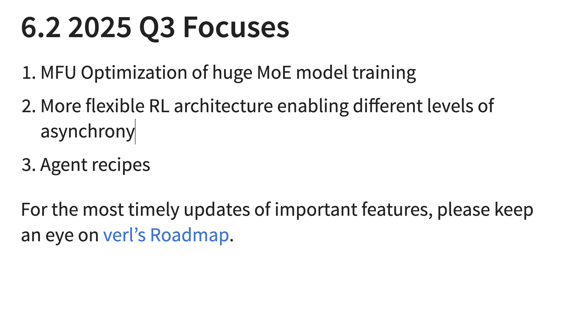

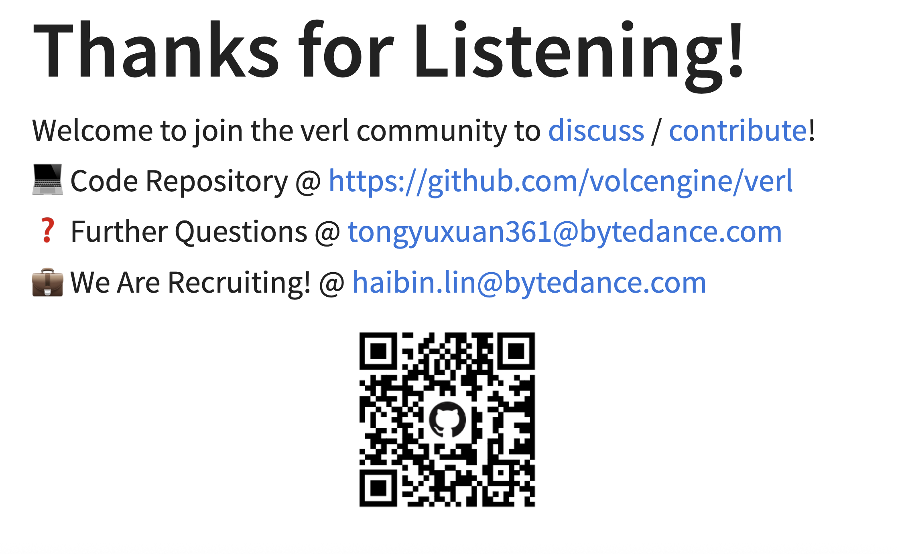

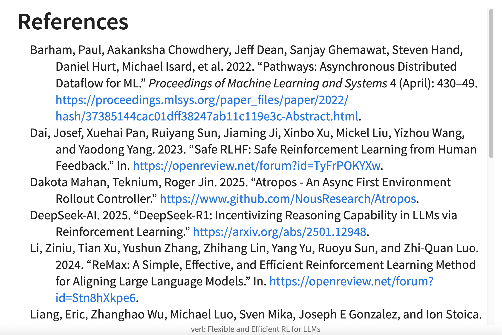

참고와 2025년 Q3 Roadmap.

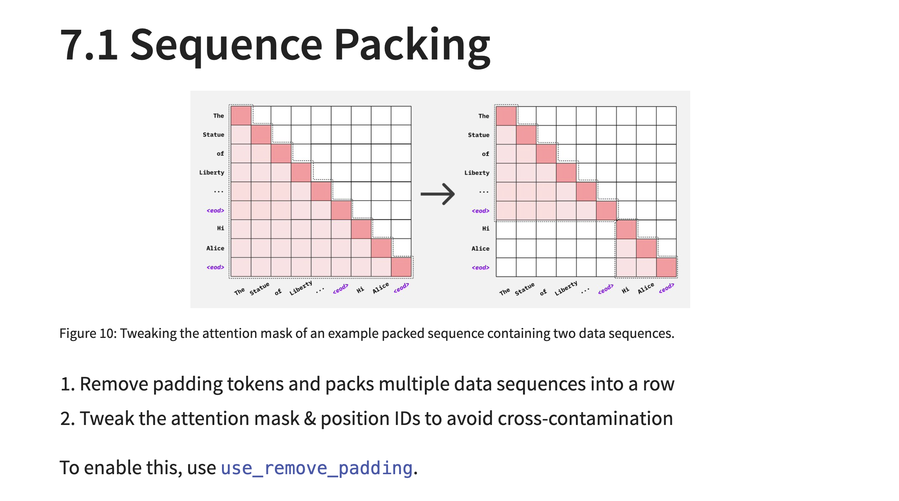

이 Slides의 제목은 "7.1 Sequence Packing"이며, 주로 시퀀스 패킹(Sequence Packing)을 통해 attention 메커니즘을 최적화하여 서로 다른 데이터 시퀀스 사이의 교차 오염을 방지하는 방법을 소개한다. Slides의 핵심 내용은 Figure 10의 두 attention 마스크(attention mask) 그림을 통해 대조하여 설명한다. 왼쪽 그림은 두 개의 데이터 시퀀스("The Statue of Liberty <eod>"와 "Hi Alice <eod>")를 포함하는 원래의 패킹된 시퀀스를 보여주며, 그 attention 마스크는 표준 인과(causal) 패턴을 나타낸다. 즉 각 토큰은 자기 자신과 그 이전의 모든 토큰에 attention할 수 있으며, 이 경우 두 번째 시퀀스의 토큰(예: "Hi")이 첫 번째 시퀀스의 토큰(예: "The Statue of Liberty")에 잘못 attention할 수 있는데, 이를 교차 오염이라 부른다. 오른쪽을 가리키는 화살표는 오른쪽 그림을 향하며, 이 그림은 "조정된(tweaked)" attention 마스크를 보여준다. 이 조정된 마스크에서는 각 데이터 시퀀스가 독립적인 인과 attention 범위를 가진다. 즉 "The Statue of Liberty <eod>"는 자기 시퀀스 내의 토큰에만 attention하고, "Hi Alice <eod>"도 자기 시퀀스 내의 토큰에만 attention하여, 서로 다른 시퀀스 간의 attention 흐름을 효과적으로 차단함으로써 교차 오염을 방지한다. Slides는 또한 이 최적화를 구현하는 두 가지 핵심 단계를 나열한다. 1. 패딩(padding) 토큰을 제거하고 여러 데이터 시퀀스를 한 행으로 패킹한다. 2. attention 마스크와 위치 ID(position IDs)를 조정하여 교차 오염을 방지한다. 마지막으로 Slides는 이 기능을 활성화하려면 `use_remove_padding` 파라미터를 사용해야 한다고 지적한다. 이러한 시퀀스 패킹 기술은 지능적인 attention 마스크 조정을 통해 계산 효율을 유지하면서 서로 다른 데이터 시퀀스 사이의 독립성을 보장하여, 모델이 여러 시퀀스를 처리할 때 발생할 수 있는 attention 누수 문제를 방지한다. 이는 강화학습에서의 배치 데이터 처리 및 모델 훈련에 중요한 의의를 가진다.

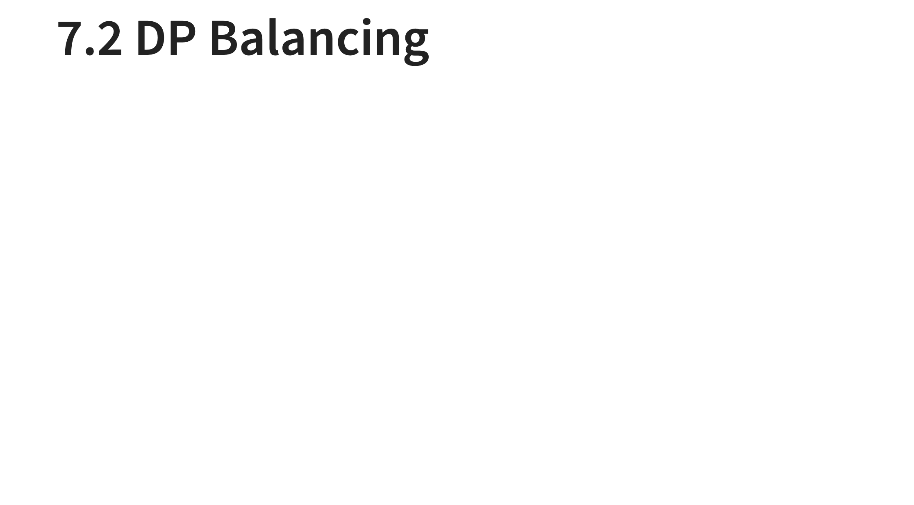

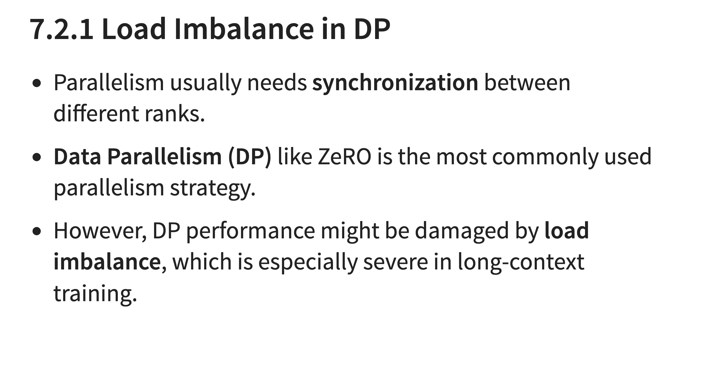

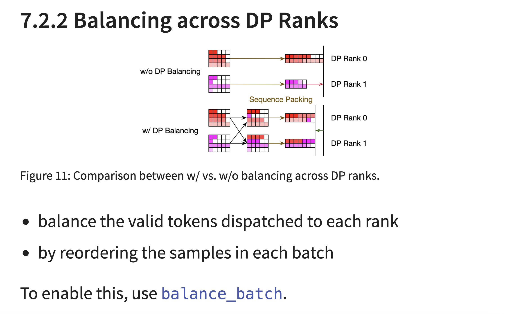

이 세 Slides는 각각 "7.2 DP Balancing", "7.2.1 Load Imbalance in DP", "7.2.2 Balancing across DP Ranks"를 소개하며, 데이터 병렬(Data Parallelism, DP)에서의 부하 균형 문제와 그 해결 방안을 상세히 설명한다. 첫 번째 Slides의 제목은 "7.2 DP Balancing"이며, 데이터 병렬 균형이라는 주제를 간결하게 지적한다. 두 번째 Slides의 제목은 "7.2.1 Load Imbalance in DP"이며, 세 가지 요점을 통해 데이터 병렬에서의 부하 불균형 문제를 상세히 분석한다. 1. **동기화 요구**: 병렬 컴퓨팅은 일반적으로 서로 다른 rank 사이에서 **동기화**(synchronization)를 수행해야 하며, 이는 분산 컴퓨팅의 기본 요구이다. 2. **DP의 광범위한 적용**: ZeRO 같은 **데이터 병렬(DP)** 은 가장 흔히 사용되는 병렬 전략으로, 대규모 언어 모델 훈련에서 널리 채택된다. 3. **부하 불균형 문제**: 그러나 DP 성능은 **부하 불균형**(load imbalance)에 의해 손상될 수 있으며, 이는 긴 컨텍스트 훈련에서 특히 심각하다. 서로 다른 샘플의 시퀀스 길이 차이가 크기 때문에 서로 다른 GPU가 처리하는 유효 token 수의 차이가 현저해지기 때문이다. 세 번째 Slides의 제목은 "7.2.2 Balancing across DP Ranks"이며, Figure 11을 통해 DP 균형이 있는 경우와 없는 경우를 상세히 비교한다. **DP 균형 없음**(w/o DP Balancing)은 전형적인 부하 불균형 시나리오를 보여주고, **DP 균형 있음**(w/ DP Balancing)은 샘플 재정렬을 통해 실현한 부하 균형을 보여주며, 교차 화살표로 샘플이 rank 사이에서 재분배됨을 나타낸다. 이로써 각 rank가 거의 동일한 수의 유효 token을 처리하게 되어 부하의 균등 분포를 실현한다. Slides 하단은 구현 메커니즘을 설명한다. "reordering the samples in each batch"(각 배치의 샘플을 재정렬)를 통해 "balance the valid tokens dispatched to each rank"(각 rank에 분배되는 유효 token을 균형 있게 맞춤)하며, 이 기능을 활성화하려면 `balance_batch` 파라미터를 사용해야 한다고 지적한다. 이러한 DP 균형 기술은 지능적인 샘플 재정렬을 통해 데이터 병렬에서의 부하 불균형 문제를 효과적으로 해결하며, 특히 긴 컨텍스트 훈련 시나리오에서 분산 훈련의 효율을 현저히 향상시켜, 모든 GPU 자원이 충분히 활용되도록 하고 부하 불균형으로 인한 성능 병목과 자원 낭비를 방지한다.

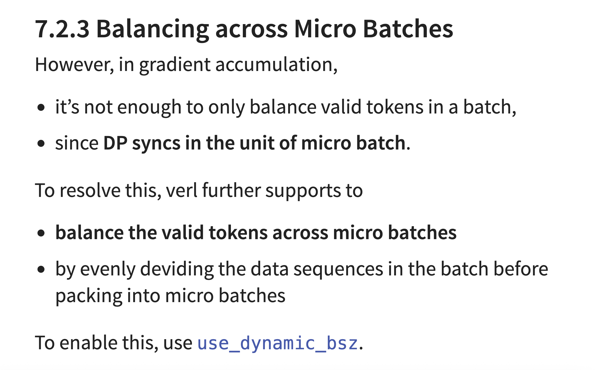

이 Slides의 제목은 "7.2.3 Balancing across Micro Batches"이며, 그래디언트 누적(gradient accumulation) 과정에서 배치 내의 유효 token만 균형 있게 맞추는 것으로는 충분하지 않음을 깊이 있게 설명한다. 데이터 병렬(DP)은 마이크로 배치(micro batch)를 단위로 동기화하므로, 더 세밀한 입도의 부하 불균형 문제를 초래하기 때문이다. Slides는 먼저 문제 소재를 명확히 한다. 그래디언트 누적에서 "not enough to only balance valid tokens in a batch"(배치 내의 유효 token만 균형 있게 맞추는 것으로는 충분하지 않음)이며, 근본 원인은 "since DP syncs in the unit of micro batch"(DP가 마이크로 배치를 단위로 동기화하기 때문)이다. 이는 전체 큰 배치가 거시적으로 균형 잡혀 있더라도, 동기화가 더 세밀한 입도의 마이크로 배치 수준에서 발생하면 이러한 마이크로 배치 내부의 부하 불균형이 여전히 효율 저하를 초래함을 의미한다. 이 문제를 해결하기 위해 `verl` 프레임워크는 "balance the valid tokens across micro batches"(마이크로 배치 간의 유효 token을 균형 있게 맞춤)를 통해 더 정교한 부하 균형을 실현하는 것을 "further supports to"(추가로 지원)한다. 구체적인 구현 메커니즘은 "by evenly dividing the data sequences in the batch before packing into micro batches"(마이크로 배치로 패킹하기 전에 배치 내의 데이터 시퀀스를 균등하게 분할)하는 것이며, 이는 프레임워크가 전처리 단계에서 입력 데이터 시퀀스를 각 마이크로 배치에 지능적으로 분배하여 각 마이크로 배치의 계산 부하가 더 균등해지도록 보장함을 나타낸다. 이 기능을 활성화하려면 `use_dynamic_bsz` 파라미터를 사용해야 한다. 이러한 마이크로 배치 간 균형 기술은 분산 훈련에서 그래디언트 누적 단계의 세밀한 입도 부하 불균형 문제를 해결하며, 지능적인 데이터 시퀀스 분할과 마이크로 배치 수준의 부하 균형을 통해 각 마이크로 배치의 계산 부하가 상대적으로 균등하도록 보장함으로써 동기화 대기 시간을 줄이고 전체 훈련 효율을 높인다. 특히 가변 길이 시퀀스 및 긴 컨텍스트 훈련 시나리오를 처리할 때 중요한 가치를 가진다.

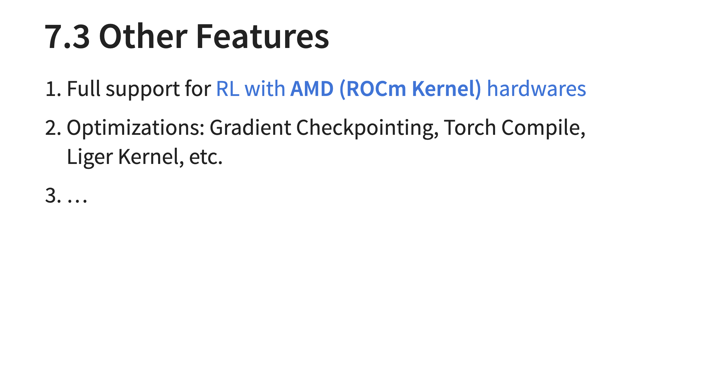

기타 몇 가지 feature.

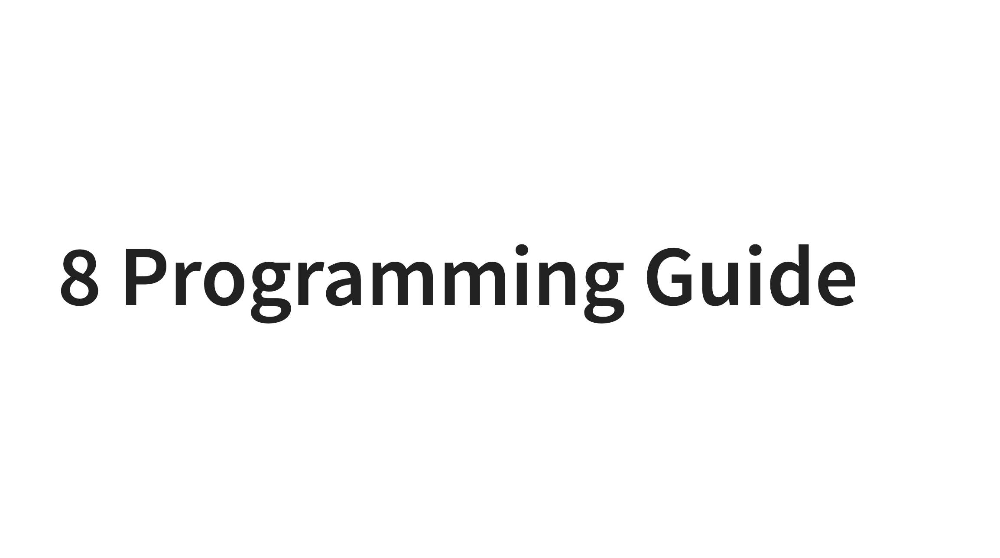

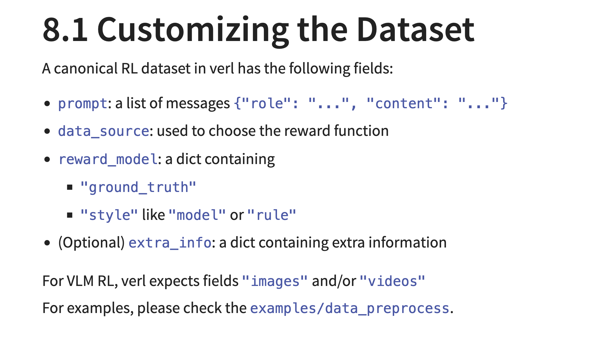

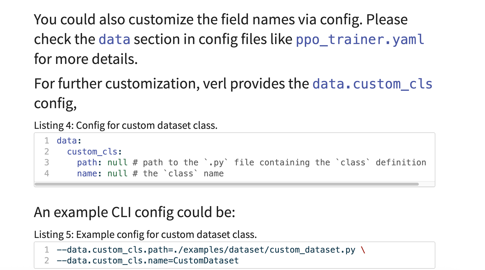

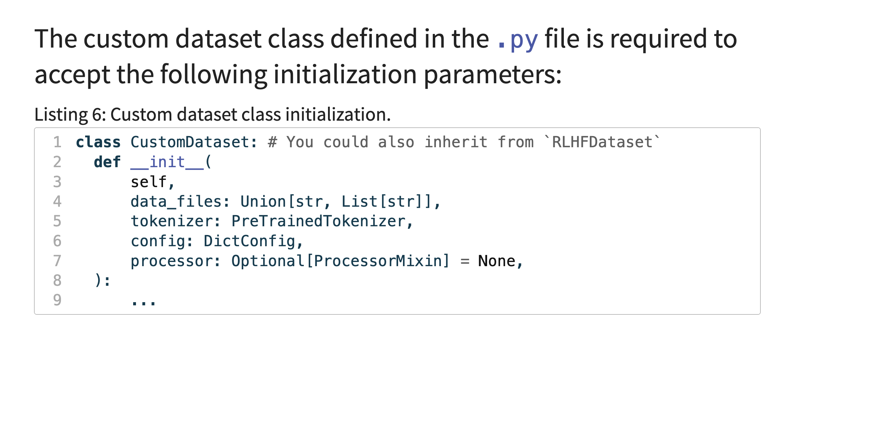

첫 번째 Slides의 제목은 "8 Programming Guide"이며, 프로그래밍 가이드라는 주제를 간결하게 지적한다.

두 번째 Slides의 제목은 "8.1 Customizing the Dataset"이며, `verl` 프레임워크에서 표준 강화학습(RL) 데이터셋의 구조와 필수 필드를 상세히 설명한다. **`prompt`** 필드는 "a list of messages"(메시지 목록)로 설명되며, `{"role": "...", "content": "..."}` 딕셔너리 구조를 가지고 대화 또는 상호작용 이력을 나타낸다. **`data_source`** 필드는 "used to choose the reward function"(보상 함수를 선택하는 데 사용)되며, 보상 계산 방식을 결정하는 데 역할을 한다. **`reward_model`** 필드는 두 하위 필드를 포함하는 딕셔너리이다. `"ground_truth"`(실제 또는 목표 보상 값)와 `"style"`("like 'model' or 'rule'"(예: "모델" 또는 "규칙")일 수 있으며, 보상 스타일을 정의하는 서로 다른 방법을 나타냄). **`extra_info`** 는 선택적 필드로, "a dict containing extra information"(추가 정보를 포함하는 딕셔너리)이며, 추가 데이터에 유연성을 제공한다. 비전 언어 모델(VLM) RL의 경우, `verl`은 필드 "images" 및/또는 "videos"를 기대하며, 이는 비전 모달리티가 이 특정 유형의 RL 데이터셋에 포함됨을 나타낸다. Slides는 또한 실제 구현의 참고 자료도 제공한다. "For examples, please check the `examples/data_preprocess`"(예제는 `examples/data_preprocess`를 확인하라).

세 번째, 네 번째 Slides는 사용자가 설정 파일을 통해 필드 이름을 커스터마이즈할 수 있음을 설명하며, `ppo_trainer.yaml` 등 파일의 `data` 섹션에서 더 많은 정보를 얻을 수 있음을 가리킨다. 고급 커스터마이징의 경우, `verl` 프레임워크는 `data.custom_cls` 설정을 제공한다.

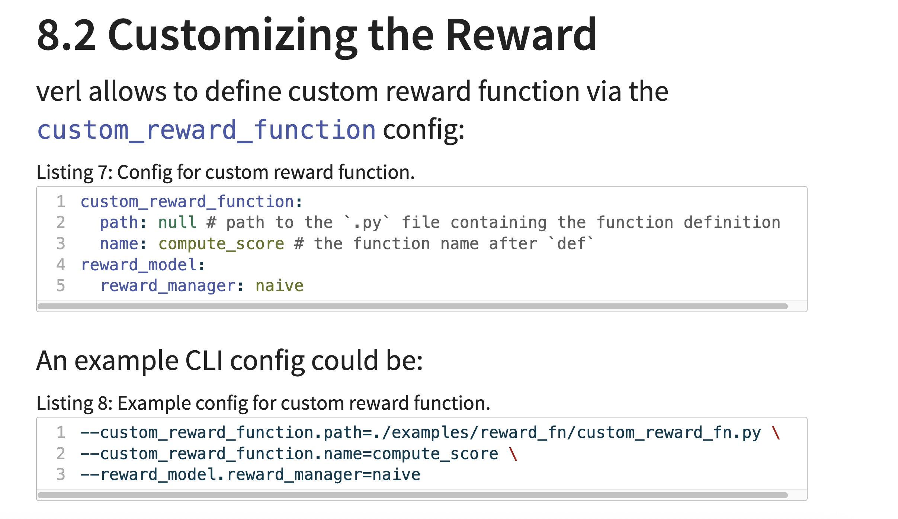

이 두 Slides는 `verl` 프레임워크에서 보상 함수를 커스터마이즈하는 설정 및 구현 방법을 설명한다. 첫 번째 Slides의 제목은 "8.2 Customizing the Reward"이며, 먼저 `verl`이 `custom_reward_function` 설정을 통해 커스텀 보상 함수를 정의할 수 있게 함을 설명한 뒤, Listing 7을 통해 커스텀 보상 함수의 YAML 설정 구조를 보여준다. `custom_reward_function`은 `path`(함수 정의를 포함하는 `.py` 파일의 경로를 가리키며 초기값은 null)와 `name`(함수 이름으로, "compute_score"로 설정되며 `def` 뒤에 정의된 함수 이름을 나타냄) 두 필드를 포함하고, 동시에 `reward_model`의 `reward_manager`를 "naive"로 설정한다.

Listing 8을 통해 CLI 설정 예제를 제공하며, 명령줄 파라미터로 커스텀 Reward 함수를 설정하는 방법을 보여준다. `--custom_reward_function.path=./examples/reward_fn/custom_reward_fn.py`(커스텀 보상 함수 파일 경로를 `./examples/reward_fn/custom_reward_fn.py`로 지정), `--custom_reward_function.name=compute_score`(커스텀 보상 함수 이름을 "compute_score"로 설정), `--reward_model.reward_manager=naive`(보상 관리자를 "naive"로 설정). 이 Slides들은 `verl` 프레임워크에서 커스텀 보상 함수를 통합하는 완전한 가이드를 개발자에게 공통적으로 제공하며, YAML 설정 파일부터 명령줄 파라미터 설정까지, Python 파일 경로와 함수 이름을 지정하여 커스텀 보상 함수를 정의하는 모든 필요한 단계를 다룬다. 동시에 기본 "naive" 보상 관리자 설정을 보여주어, 강화학습에서의 보상 함수 커스터마이징을 위한 유연하고 사용하기 쉬운 설정 메커니즘을 제공한다. 이 코드 조각과 위의 config 설정은 동등하다.

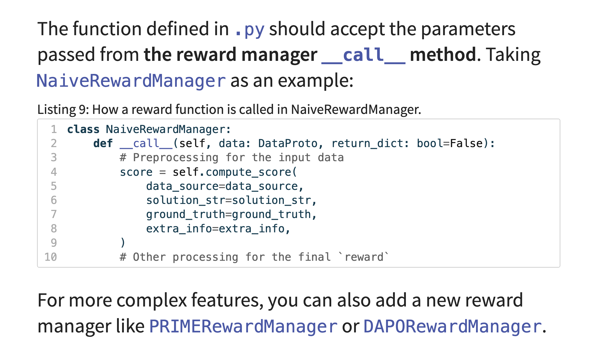

이 Slides는 reward 함수가 NaiveRewardManager 안에서 어떻게 호출되는지를 보여준다.

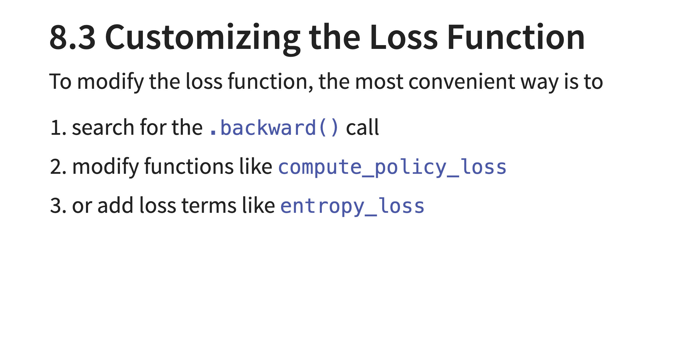

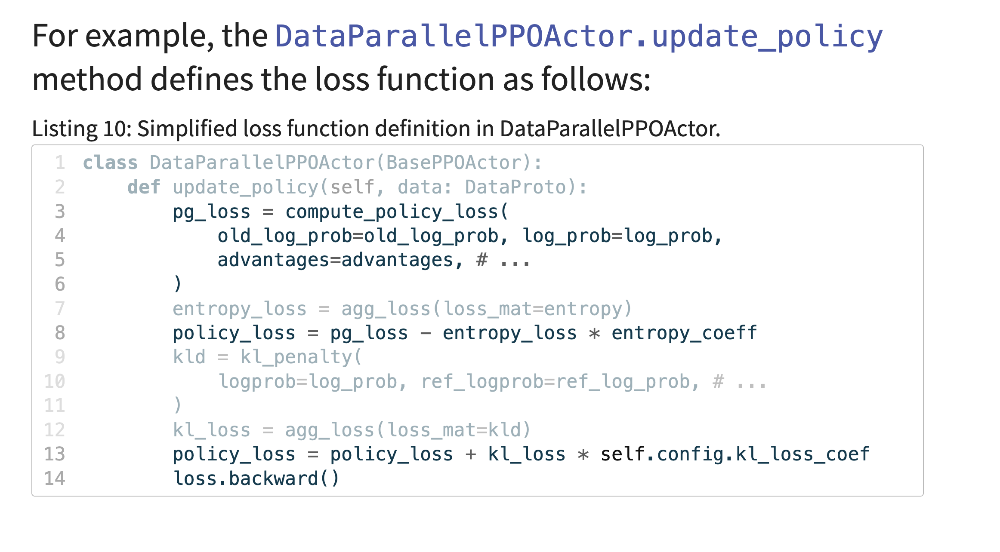

이 Slides의 제목은 "8.3 Customizing the Loss Function"이며, `verl` 프레임워크에서 손실 함수를 커스터마이즈하는 세 가지 주요 방법을 상세히 설명한다. 먼저 Slides는 손실 함수를 수정하는 가장 편리한 방식이 `.backward()` 호출을 찾는 것이라고 명확히 지적한다. 이는 PyTorch 등 딥러닝 프레임워크에서 역전파를 트리거하는 핵심 메서드로, 이 호출 지점을 찾아내면 손실 계산의 핵심 위치를 찾을 수 있다. 이어서 Slides는 손실 함수를 커스터마이즈하는 세 가지 구체적인 전략을 제공한다. 첫 번째는 `compute_policy_loss` 같은 함수를 수정하는 것으로, 이러한 함수는 일반적으로 정책 네트워크의 손실을 계산하는 것을 담당하며 강화학습 알고리즘의 핵심 구성 요소이다. 이러한 함수를 수정하면 정책 최적화의 목표와 방식을 바꿀 수 있다. 두 번째는 `entropy_loss`(엔트로피 손실) 같은 손실 항을 추가하는 것으로, 엔트로피 손실은 정책의 탐색성을 장려하여 정책이 너무 일찍 국소 최적해에 수렴하는 것을 방지하는 데 흔히 사용되며, 전체 손실에 엔트로피 항을 더하면 탐색과 활용의 관계를 균형 있게 맞출 수 있다. 세 번째 방법은 slides에 완전히 표시되지 않았지만, 번호 "3."으로부터 다른 커스텀 손실 방식이 더 있음을 추론할 수 있다. Slides는 또한 구체적인 코드 예제(Listing 10)를 통해 `DataParallelPPOActor.update_policy` 메서드에서의 단순화된 손실 함수 정의를 보여준다. 코드는 전형적인 PPO 손실 함수 계산 과정을 보여주며, `compute_policy_loss` 함수를 호출하여 정책 손실 `pg_loss`를 계산하고(`old_log_prob`, `log_prob`, `advantages` 등 파라미터 전달), 엔트로피 손실 `entropy_loss = agg_loss(loss_mat=entropy)`를 계산한 뒤, 정책 손실과 엔트로피 손실을 결합하여 최종 정책 손실 `policy_loss = pg_loss - entropy_loss * entropy_coeff`를 형성하고, 이어서 KL 발산 손실 `kld = kl_penalty`와 `kl_loss = agg_loss(loss_mat=kld)`를 계산하며, 최종적으로 모든 손실 항을 결합하여 전체 손실 `policy_loss = policy_loss + kl_loss * self.config.kl_loss_coef`를 만들고, `loss.backward()`를 호출하여 역전파를 수행한다. 이 예제는 PPO 알고리즘에서 여러 손실 항(정책 손실, 엔트로피 손실, KL 발산 손실)을 결합하고, 대응하는 계수(예: `entropy_coeff`, `kl_loss_coef`)를 통해 서로 다른 손실 항의 중요도를 균형 있게 맞추는 방법을 명확하게 보여주며, `verl` 프레임워크에서 손실 함수를 커스터마이즈하고 확장하기 위한 구체적인 참고 자료 및 구현 템플릿을 개발자에게 제공한다.

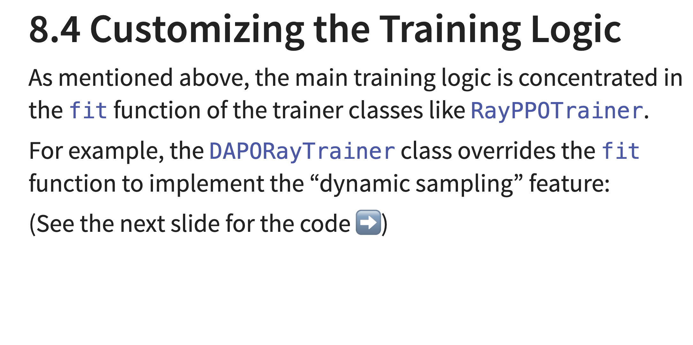

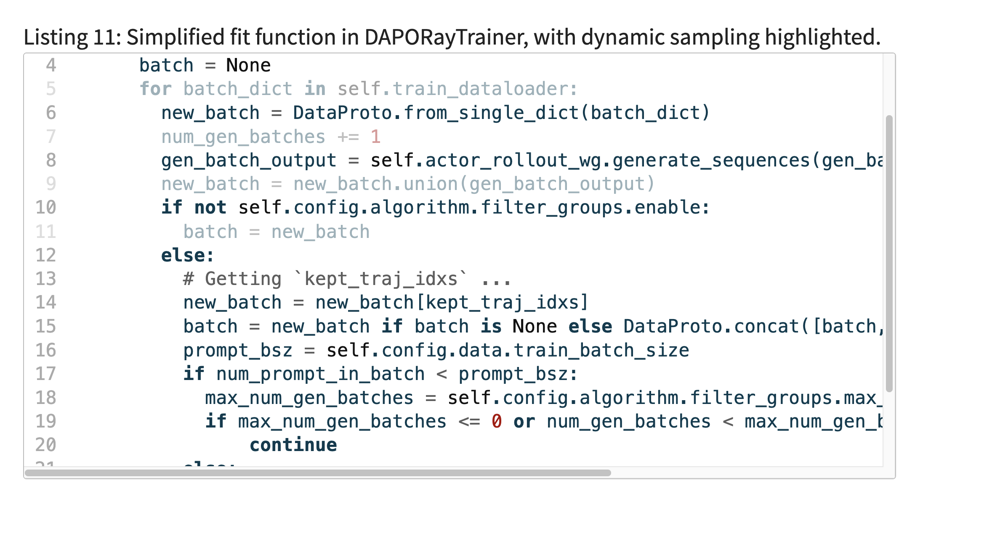

이 두 Slides는 각각 "8.4 Customizing the Training Logic"이라는 제목이며, `verl` 프레임워크에서 훈련 로직을 커스터마이즈하는 핵심 방법과 구체적인 구현을 상세히 설명한다. 첫 번째 Slides는 앞서 언급한 바와 같이 주요 훈련 로직이 트레이너 클래스(예: `RayPPOTrainer`)의 `fit` 함수에 집중되어 있으며, 이것이 전체 훈련 흐름의 핵심 제어 지점임을 명확히 지적한다. 구체적인 예로, Slides는 `DAPORayTrainer` 클래스가 "동적 샘플링(dynamic sampling)" 특성을 구현하기 위해 `fit` 함수를 오버라이드한다고 언급한다. 이는 고급 훈련 최적화 기술로, 훈련 과정에서의 피드백에 따라 데이터 샘플링 전략을 동적으로 조정하여 훈련 효율과 모델 성능을 높일 수 있다. 두 번째 Slides는 Listing 11을 통해 `DAPORayTrainer`에서의 단순화된 `fit` 함수 구현을 보여주며, 동적 샘플링 부분이 특별히 강조 표시되어 있다. 코드는 4번째 줄에서 시작하여 `batch = None`을 초기화한 뒤, 훈련 데이터 로더의 루프 `for batch_dict in self.train_dataloader:`에 진입하고, 6번째 줄에서 새 배치 `new_batch = DataProto.from_single_dict(batch_dict)`를 생성하며 생성 배치 카운터 `num_gen_batches += 1`을 증가시킨다. 8번째 줄에서 Actor rollout 작업 그룹의 시퀀스 생성 `gen_batch_output = self.actor_rollout_wg.generate_sequences(gen_batch)`를 실행하고, 9번째 줄에서 생성된 출력을 새 배치와 병합한다 `new_batch = new_batch.union(gen_batch_output)`. 핵심 동적 샘플링 로직은 10번째 줄에서 시작한다. 먼저 `if not self.config.algorithm.filter_groups.enable:`을 확인하여, 필터 그룹 기능이 활성화되지 않았으면 새 배치를 직접 사용하고 `batch = new_batch`(11번째 줄), 그렇지 않으면 `else` 분기로 진입한다(12번째 줄). 13번째 줄에서는 보존 궤적 인덱스를 얻는 과정을 나타내는 주석 "Getting `kept_traj_idxs` ..."를 추가하고, 14번째 줄에서 보존된 궤적 인덱스에 따라 새 배치를 필터링하며 `new_batch = new_batch[kept_traj_idxs]`, 15번째 줄에서 조건부 배치 누적 로직을 구현한다 `batch = new_batch if batch is None else DataProto.concat([batch, new_batch])`. 16번째 줄에서 프롬프트 배치 크기 `prompt_bsz = self.config.data.train_batch_size`를 얻고, 17-20번째 줄에서 동적 샘플링의 핵심 제어 로직을 구현한다. 배치 내의 프롬프트 수가 설정한 배치 크기보다 작을 때 `if num_prompt_in_batch < prompt_bsz:`, 최대 생성 배치 수 `max_num_gen_batches = self.config.algorithm.filter_groups.max_num_gen_batches`를 얻고, 최대 생성 배치 수에 도달했거나 기타 종료 조건 `if max_num_gen_batches <= 0 or num_gen_batches < max_num_gen_batches:`이면 루프를 계속하고 `continue`, 그렇지 않으면 루프를 빠져나와 현재 누적된 배치를 처리한다. 이 구현은 DAPO 알고리즘이 동적 샘플링 메커니즘을 통해 데이터 품질과 훈련 요구에 따라 배치 크기와 데이터 선택 전략을 지능적으로 조정하여, 훈련 효과를 보장하면서 계산 자원의 이용 효율을 높이는 방법을 보여주며, `verl` 프레임워크에서 복잡한 훈련 로직과 알고리즘 혁신을 구현하기 위한 구체적인 참고 템플릿을 개발자에게 제공한다.
