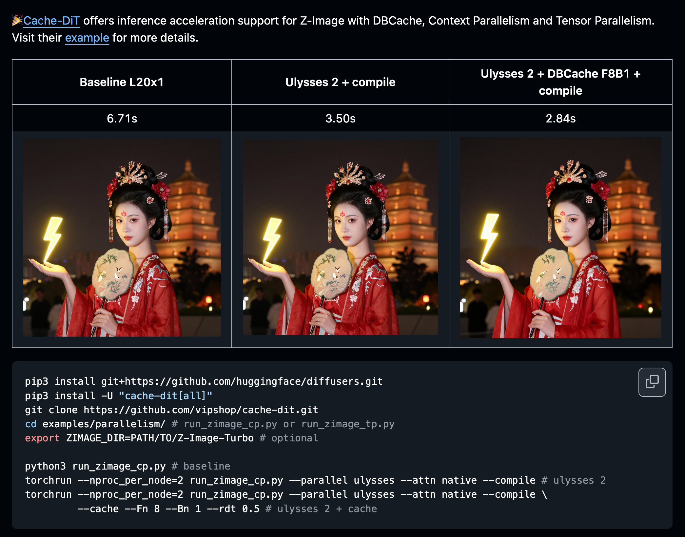

# [Diffusion 추론] CacheDiT의 Z-Image 분산 추론 및 캐시 가속 지원

> 원문: https://zhuanlan.zhihu.com/p/1978490962742374735

### 0x00 TLDR

CacheDiT가 Z-Image 분산 추론과 캐시 가속을 지원합니다. https://github.com/vipshop/cache-dit


Z-Image w/ CacheDiT

테스트 예제 스크립트:
```bash
pip3 install git+https://github.com/huggingface/diffusers.git
pip3 install -U "cache-dit[all]"
git clone https://github.com/vipshop/cache-dit.git
cd examples/parallelism/ # run_zimage_cp.py or run_zimage_tp.py
export ZIMAGE_DIR=PATH/TO/Z-Image-Turbo # optional 

python3 run_zimage_cp.py # baseline
torchrun --nproc_per_node=2 run_zimage_cp.py --parallel ulysses --attn native --compile # ulysses 2
torchrun --nproc_per_node=2 run_zimage_cp.py --parallel ulysses --attn native --compile \
         --cache --Fn 8 --Bn 1 --rdt 0.5 # ulysses 2 + cache
```

star 부탁드립니다~ https://github.com/vipshop/cache-dit
