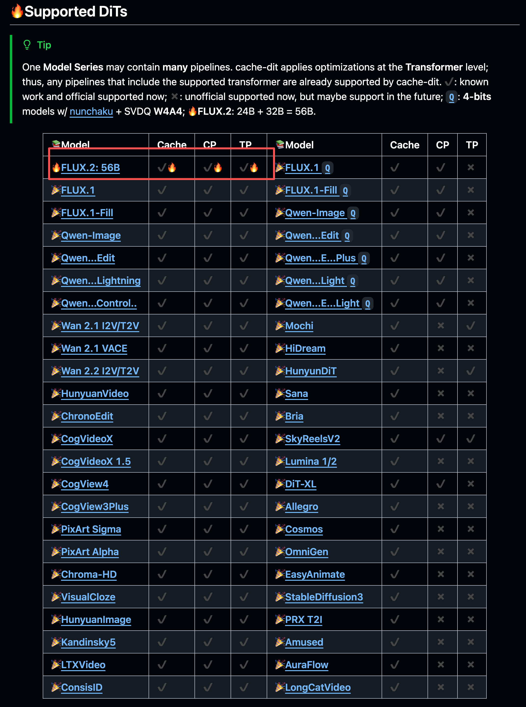

# [Diffusion 추론] cache-dit의 FLUX.2 분산 추론 및 Cache 지원

> 원문: https://zhuanlan.zhihu.com/p/1977698505834379041


FLUX.2 오픈소스

### 0x00 서문

> 맨 앞에 적자면, 가속 전 L20x1(seq cpu offload 필요, 따라서 매우 느림): 723s -> 가속 후 L20x4: 18.5s

FLUX.2가 며칠 전 오픈소스되었습니다. DiT 부분 모델 가중치 32B, Text Encoder 부분 모델 가중치 24B, 총 **56B**로 Diffusion 분야에서는 매우 큰 파라미터 규모의 모델입니다. FLUX.2를 더 효율적으로 실행하기 위해 cache-dit이 FLUX.2 모델에 대한 전면적인 지원을 빠르게 추가했습니다. **시퀀스 병렬, 텐서 병렬, 하이브리드 Cache 가속**을 포함하며, **torch.compile, torchao, bitsandbytes_4bit** 등의 방안과 원활하게 호환되어 함께 사용할 수 있습니다. 현재까지 cache-dit은 거의 모든 주류(및 비주류) DiT 아키텍처 모델을 지원합니다.


cache-dit 모델 지원 목록

본 글에서는 cache-dit을 사용하여 FLUX.2의 추론을 가속하는 방법을 간단히 소개합니다.

### 0x01 의존성 설치

FLUX.2를 사용하려면 최신 diffusers와 최신 cache-dit을 설치해야 합니다. 설치 명령:
```
pip3 install git+https://github.com/huggingface/diffusers.git
pip3 install -U "cache-dit[all]"
```

### 0x02 예제 코드

다음 명령으로 cache-dit의 FLUX.2 추론 가속 예제 코드를 가져올 수 있습니다:
```
git clone https://github.com/vipshop/cache-dit.git
cd examples/parallelism/ # run_flux2_cp.py 및 run_flux2_tp.py
```

Tensor Parallel(run_flux2_tp.py) 코드를 예로 들면 다음과 같습니다: (Text Encoder에 대해서도 텐서 병렬을 지원하여 GPU당 메모리 사용량을 줄입니다)
```python
import os
import sys

sys.path.append("..")

import time

import torch
from diffusers import Flux2Pipeline, Flux2Transformer2DModel
from utils import (
    MemoryTracker,
    GiB,
    cachify,
    get_args,
    maybe_destroy_distributed,
    maybe_init_distributed,
    strify,
)

import cache_dit

args = get_args()
print(args)

rank, device = maybe_init_distributed(args)

pipe: Flux2Pipeline = Flux2Pipeline.from_pretrained(
    (
        args.model_path
        if args.model_path is not None
        else os.environ.get(
            "FLUX_2_DIR",
            "black-forest-labs/FLUX.2-dev",
        )
    ),
    torch_dtype=torch.bfloat16,
)

if args.cache or args.parallel_type is not None:
    from cache_dit import DBCacheConfig, ParamsModifier

    cachify(
        args,
        pipe,
        extra_parallel_modules=(
            # 메인 transformer 외에 추가로 병렬화할 모듈 지정,
            # 예: FluxPipeline의 text_encoder_2, Flux2Pipeline의 text_encoder.
            # 현재 native pytorch 백엔드(즉, Tensor Parallelism)에서만 지원.
            [pipe.text_encoder]
            if args.parallel_type == "tp"
            else []
        ),
        params_modifiers=[
            ParamsModifier(
                # transformer_blocks 전용 수정 설정
                # DBCacheConfig의 `reset` 메서드를 반드시 호출해야 함.
                cache_config=DBCacheConfig().reset(
                    residual_diff_threshold=args.rdt,
                ),
            ),
            ParamsModifier(
                # single_transformer_blocks 전용 수정 설정
                # 참고: FLUX.2에서 single_transformer_blocks는 이전 transformer_blocks의
                # 정밀도 오차 누적으로 인해 `더 높은` residual_diff_threshold가 필요
                cache_config=DBCacheConfig().reset(
                    residual_diff_threshold=args.rdt * 3,
                ),
            ),
        ],
    )

torch.cuda.empty_cache()

world_size = torch.distributed.get_world_size() if torch.distributed.is_initialized() else 1

if world_size < 4 and GiB() <= 48:
    assert not args.compile, "Compilation requires more GPU memory. Please disable it."
    if world_size < 2:
        pipe.enable_sequential_cpu_offload(device=device)
        print("Enabled sequential CPU offload.")
    else:
        pipe.enable_model_cpu_offload(device=device)
        print("Enabled model CPU offload.")
else:
    pipe.to(device)

assert isinstance(pipe.transformer, Flux2Transformer2DModel)

pipe.set_progress_bar_config(disable=rank != 0)

prompt = (
    "Realistic macro photograph of a hermit crab using a soda can as its shell, "
    "partially emerging from the can, captured with sharp detail and natural colors, "
    "on a sunlit beach with soft shadows and a shallow depth of field, with blurred ocean "
    "waves in the background. The can has the text `BFL Diffusers` on it and it has a color "
    "gradient that start with #FF5733 at the top and transitions to #33FF57 at the bottom."
)

if args.prompt is not None:
    prompt = args.prompt


def run_pipe(warmup: bool = False):
    generator = torch.Generator("cpu").manual_seed(42)
    image = pipe(
        prompt=prompt,
        # 28 steps가 좋은 절충점이 될 수 있음
        num_inference_steps=5 if warmup else (50 if args.steps is None else args.steps),
        guidance_scale=4,
        generator=generator,
    ).images[0]
    return image


if args.compile:
    cache_dit.set_compile_configs()
    pipe.transformer = torch.compile(pipe.transformer)

# 워밍업
_ = run_pipe(warmup=True)

memory_tracker = MemoryTracker() if args.track_memory else None
if memory_tracker:
    memory_tracker.__enter__()

start = time.time()
image = run_pipe()
end = time.time()

if memory_tracker:
    memory_tracker.__exit__(None, None, None)
    memory_tracker.report()

if rank == 0:
    cache_dit.summary(pipe)

    time_cost = end - start
    save_path = f"flux2.{strify(args, pipe)}.png"
    print(f"Time cost: {time_cost:.2f}s")
    print(f"Saving image to {save_path}")
    image.save(save_path)

maybe_destroy_distributed()
```

### 0x03 바로 테스트

`FLUX_2_DIR` 환경 변수를 설정하여 이미 다운로드한 모델 디렉토리를 지정할 수 있습니다. 예:
```
export FLUX_2_DIR=/workspace/dev/deftruth/hf_models/FLUX.2-dev
```

그 후 바로 FLUX.2의 분산 + 캐시 가속을 실행할 수 있습니다. 텐서 병렬을 예로:
```
python3 run_flux2_tp.py # baseline, L20x1(48GiB만) w/ sequence cpu offload
torchrun --nproc_per_node=4 --master_port=8881 \
         run_flux2_tp.py --parallel tp --steps 50 \
         --cache --Fn 1 --compile # cache-dit: TP + cache + compile
```

결과: **가속 전 L20x1: 723s -> 가속 후 L20x4: 18.5s**


가속 전 L20x1: 723s -> 가속 후 L20x4: 18.5s

### 0x04 총결

본 글에서는 cache-dit의 FLUX.2 모델 추론 지원을 소개했습니다. **시퀀스 병렬, 텐서 병렬, 하이브리드 Cache 가속**을 포함하며, **torch.compile, torchao, bitsandbytes_4bit** 등의 방안과 원활하게 호환됩니다. 실측 결과, 텐서 병렬 + Cache 가속 방안에서의 가속 효과: 가속 전 L20x1: 723s -> 가속 후 L20x4: 18.5s. cache-dit 링크는 아래와 같으며, star 부탁드립니다!
