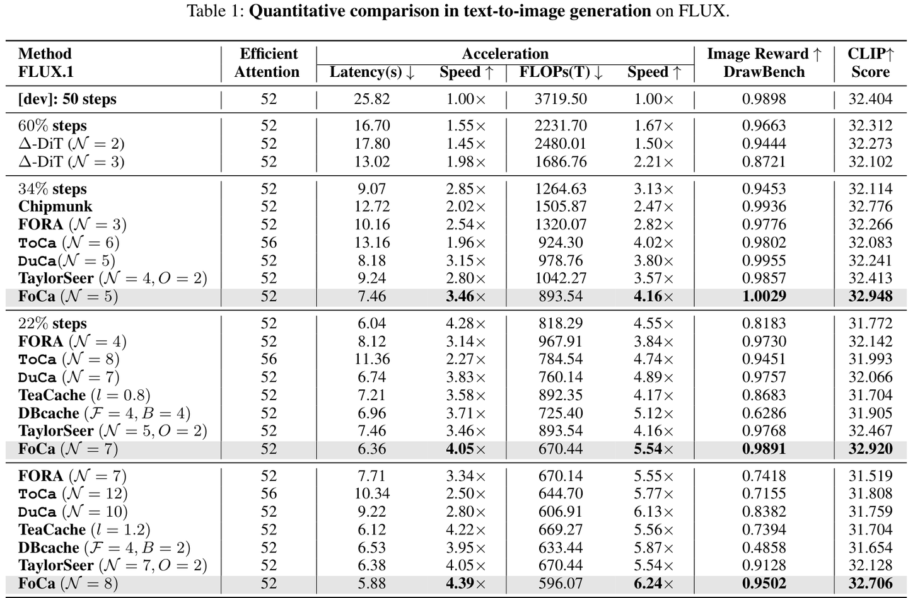
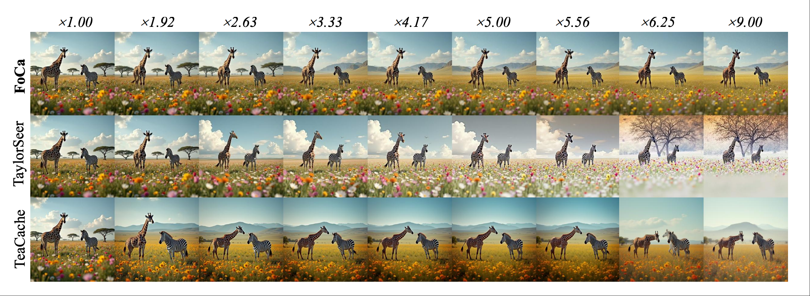
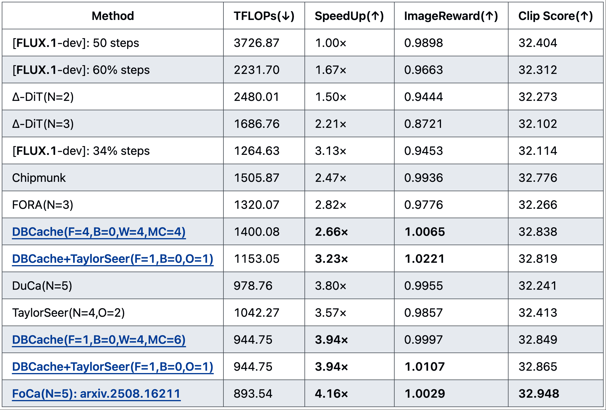
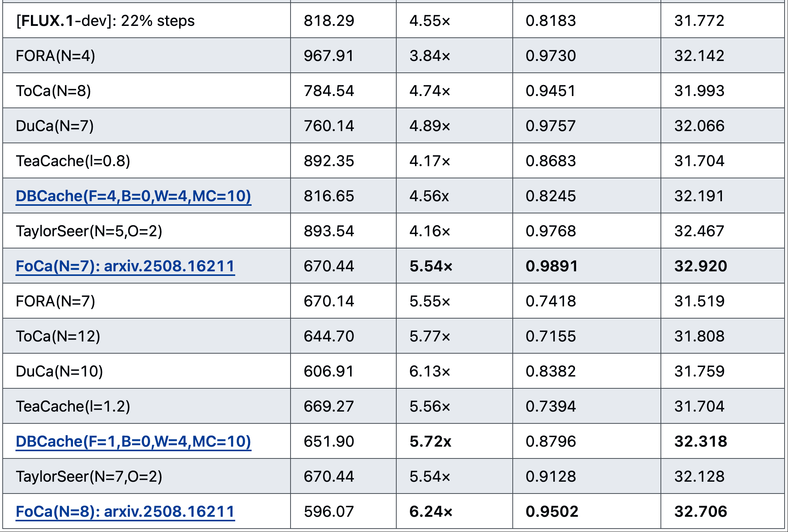
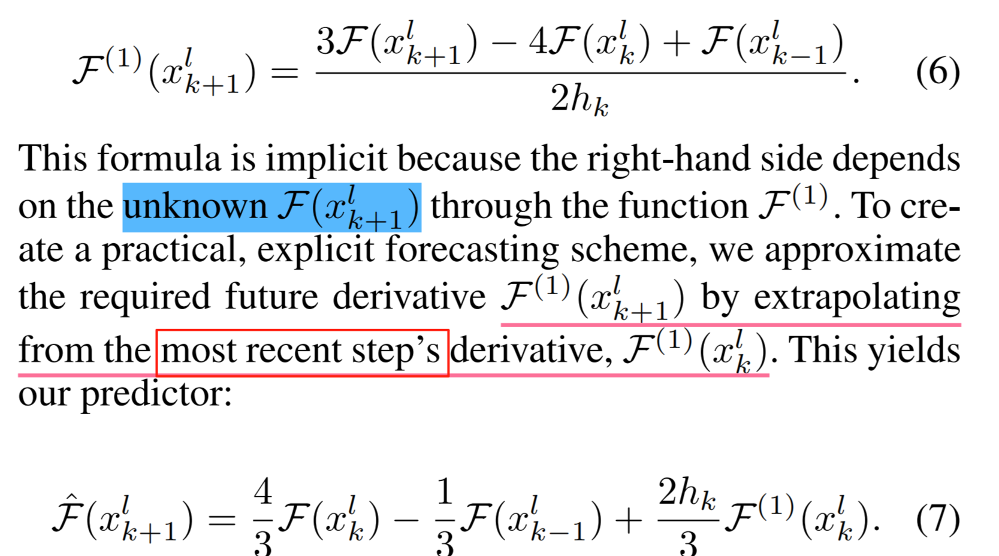
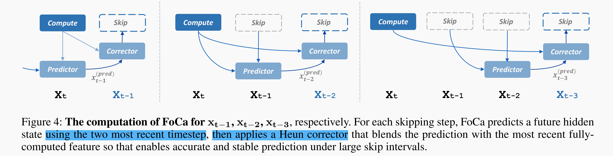
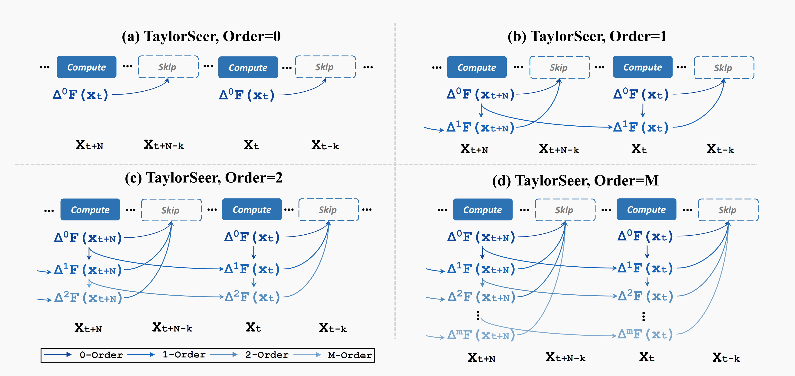
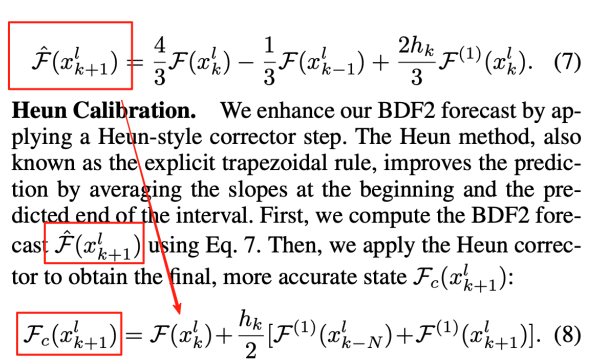
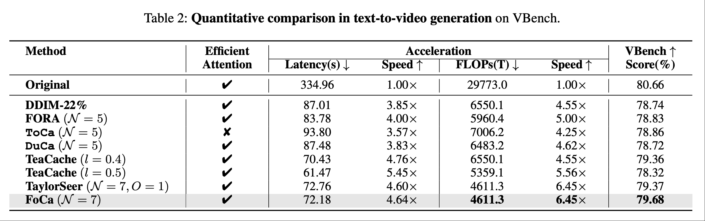
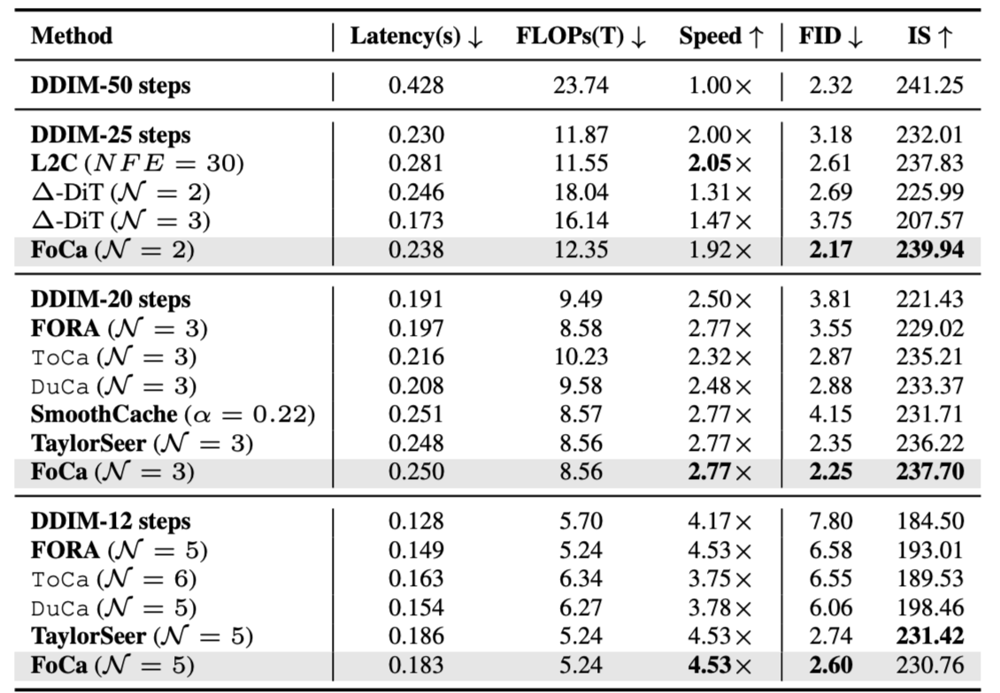

# [Diffusion 추론] Cache 가속 - FoCa 공식 이해 기록

> 원문: https://zhuanlan.zhihu.com/p/1952056591068144338

## 0x00 서문

업무 외 시간과 에너지가 한정되어 있어, 앞으로의 글은 단편적인 형태로, 핵심 내용을 기록하는 방향이 될 수 있습니다. 구체적인 세부 사항은 참고 논문을 확인해 주세요. 본 글은 FoCa의 수학 공식에 대한 이해를 간단히 기록하여, 이후 cache-dit에서 지원할 때 참고하기 위함입니다. cache-dit: https://github.com/vipshop/cache-dit

## 0x01 FoCa 소개: **Forecast then Calibrate**

- **핵심 기여**

FoCa의 핵심 기여는 확산 모델 추론을 위한 효율적이고 안정적인 **Forecast then Calibrate**("예측-보정") 프레임워크를 구축하여, 기존의 단일 스텝 재사용이나 고차 근사의 한계를 돌파한 것입니다. 혁신적으로 **BDF2** 2차 후향 차분 예측을 도입하여, 두 개의 과거 특성과 1차 도함수만으로 미래 스텝의 은닉 특성을 빠르게 예측하며, 효율성과 기본 정밀도를 동시에 달성합니다. 또한 **Heun** 보정을 결합하여 큰 시간 스텝 간격(hₖ)에서 TaylorSeer보다 더 안정적인 특성 추정을 실현합니다. FoCa **논문 주소:** https://arxiv.org/pdf/2508.16211, 코드는 아직 오픈소스되지 않았습니다.

- **Benchmark**

FoCa benchmark

9x 가속비!

전체적으로 FoCa의 성능은 매우 강력합니다. 6.24x 가속비에서도 Clip Score와 ImageReward가 여전히 거의 무손실이며, 심지어 9x 가속비의 예시도 제공했습니다. DBCache의 두 그룹 데이터도 포함되어 있지만, ImageReward 데이터가 약간 이상해 보입니다. 파라미터 튜닝이 잘못된 것 같습니다. 이 문제는 FoCa 관련 팀에게 연락하여 피드백했습니다. 동시에 cache-dit에서도 DBCache + TaylorSeer의 다양한 설정에서의 성능을 벤치마크에 추가하여 비교했습니다(벤치 코드 전부 오픈소스, 정확도와 성능 모두 재현 가능). cache-dit 벤치마크 주소: Text2Image DrawBench. 다만 cache-dit의 전략은 엔지니어링 중심으로, 합리적인 설정 조합을 통해 항상 정확도와 성능이 모두 좋은 데이터를 얻을 수 있습니다.

낮은 가속비: cache-dit DrawBench w/ FoCa

**전체적으로 비교하면 FoCa가 제시하는 지표가 여전히 최고입니다.** 특히 5x 이상의 가속비에서 cache-dit의 기존 가속 방안은 이미 정확도 하락이 나타나기 시작하지만, FoCa는 여전히 강력합니다.

높은 가속비: cache-dit DrawBench w/ FoCa

## 0x02 핵심 기호 이해

다음으로 FoCa 논문의 주요 수학 공식에 대한 이해를 기록합니다.

- **기본 수학 기호 이해:**

공식을 이해하기 전에 논문에서 **F 함수**, **F⁽¹⁾ 함수**, **hₖ**의 핵심 정의를 먼저 명확히 해야 합니다. 이것이 수학 원리 해독의 전제입니다.

**F 함수(은닉 특성 매핑)**: $\mathcal{F}(x_t^l)$, 여기서 $x_t^l = G_l(x_t)$, $G_l$은 l번째 레이어 네트워크 계산 함수, $x_t$는 시간 스텝 t의 입력 텐서;

**F⁽¹⁾ 함수(특성 시간 도함수):** $\mathcal{F}^{(1)}(x_t^l) = \frac{d}{dt}\mathcal{F}(x_t^l)$, 은닉 특성이 시간 스텝 t에 따라 변하는 속도를 설명; $\frac{d}{dt}\mathcal{F}(x_t^l) = g_\theta(\mathcal{F}(x_t^l), t)$에 따르면, F⁽¹⁾는 본질적으로 모델 파라미터 θ와 현재 특성에 의해 결정되는 "변화 속도 함수"이지만, $g_\theta$를 직접 구하기 어려워 과거 특성으로 근사해야 합니다.

**hₖ(시간 스텝 간격/보폭):** $h_k = t_k - t_{k+1}$, 현재 시간 스텝 tₖ와 예측 대상 시간 스텝 tₖ₊₁ 사이의 간격. 단위는 확산 모델 샘플링 스텝 수입니다. 예를 들어, t₅에서 t₃를 예측(t₄를 건너뜀)하면 $h_k = 5 - 3 = 2$; 인접 스텝 t₅→t₄를 직접 예측하면 $h_k = 1$. **핵심 역할**: hₖ는 "보폭 파라미터"로 예측 정밀도에 직접 영향을 미칩니다. 보폭이 클수록(건너뛰는 스텝이 많을수록) 기존 방법의 오차가 쉽게 누적되지만, FoCa의 장점은 큰 hₖ에서도 안정적으로 예측할 수 있다는 것입니다.

- **BDF2 Forecasting 공식 요약:**

**원래 음함수형 BDF2 공식,** 용도: 과거 특성으로 예측 대상 스텝의 특성 변화율을 근사, 미지 변수를 포함하여 음함수 형태:

$$\mathcal{F}^{(1)}(x_{k+1}^l) = \frac{3\mathcal{F}(x_{k+1}^l) - 4\mathcal{F}(x_k^l) + \mathcal{F}(x_{k-1}^l)}{2h_k}$$

**양함수형 BDF2 예측 공식(엔지니어링 버전),** 용도: tₖ₊₁ 스텝의 초기 예측 특성을 출력, 효율성과 기본 정밀도를 겸비:

$$\hat{\mathcal{F}}(x_{k+1}^l) = \frac{4}{3}\mathcal{F}(x_k^l) - \frac{1}{3}\mathcal{F}(x_{k-1}^l) + \frac{2h_k}{3}\mathcal{F}^{(1)}(x_k^l)$$

- **Heun Calibration 공식 요약:**

**Heun 보정 공식,** 용도: 완전 계산 스텝의 신뢰할 수 있는 변화율로 BDF2 예측 결과를 보정, 과외삽 오차를 억제하고 큰 hₖ 시나리오를 안정화:

$$\mathcal{F}_c(x_{k+1}^l) = \mathcal{F}(x_k^l) + \frac{h_k}{2}\left[\mathcal{F}^{(1)}(x_{k-N}^l) + \mathcal{F}^{(1)}(x_{k+1}^l)\right]$$

## 0x03 BDF2 Forecasting(2차 후향 차분 예측): 과거 특성 기반 초기 예측

BDF2(2차 후향 차분 공식)는 **선형 다단계법**으로, 핵심 아이디어는 "최근 두 시간 스텝의 특성과 그 변화율을 사용하여 다음 시간 스텝의 특성을 예측"하는 것으로, 기존 "단일 스텝 재사용"이나 "고차 테일러 전개"의 불안정성 문제를 해결합니다.

### 1. 원래 BDF2 공식(음함수 형태)

논문의 공식

논문에서 제시한 기본 BDF2 공식:

$$\mathcal{F}^{(1)}(x_{k+1}^l) = \frac{3\mathcal{F}(x_{k+1}^l) - 4\mathcal{F}(x_k^l) + \mathcal{F}(x_{k-1}^l)}{2h_k} \tag{6}$$

**공식 의미**: 좌변 $\mathcal{F}^{(1)}(x_{k+1}^l)$는 **예측 대상 스텝 tₖ₊₁의 특성 변화율**; 우변은 **이미 알려진 두 과거 특성**(tₖ의 $\mathcal{F}(x_k^l)$, tₖ₋₁의 $\mathcal{F}(x_{k-1}^l)$)과 **미지의 tₖ₊₁ 특성**($\mathcal{F}(x_{k+1}^l)$)으로 이 변화율을 근사합니다. **"음함수"의 문제**: 우변에 미지 변수 $\mathcal{F}(x_{k+1}^l)$가 포함되어 직접 계산할 수 없으므로, "양함수 형태"로 변환해야 실제 적용이 가능합니다.

### 2. 양함수형 BDF2 예측 공식(엔지니어링 버전)

음함수 문제를 해결하기 위해, 논문은 "**가장 최근에 알려진 변화율로 미래 변화율을 근사**"하는 방식으로 간소화합니다. 즉 $\mathcal{F}^{(1)}(x_k^l)$로 $\mathcal{F}^{(1)}(x_{k+1}^l)$를 근사하여 최종 예측 공식을 얻습니다:

$$\hat{\mathcal{F}}(x_{k+1}^l) = \frac{4}{3}\mathcal{F}(x_k^l) - \frac{1}{3}\mathcal{F}(x_{k-1}^l) + \frac{2h_k}{3}\mathcal{F}^{(1)}(x_k^l) \tag{7}$$

이 공식이 출력하는 $\hat{\mathcal{F}}(x_{k+1}^l)$는 **tₖ₊₁의 초기 예측 특성**으로, 세 부분으로 구성됩니다: (1) $\frac{4}{3}\mathcal{F}(x_k^l) - \frac{1}{3}\mathcal{F}(x_{k-1}^l)$: 최근 두 과거 특성 기반의 "기본 예측항", 가중 평균으로 특성의 전체 추세를 포착(최근 특성의 가중치가 더 높아 시간 연속성에 부합); (2) $\frac{2h_k}{3}\mathcal{F}^{(1)}(x_k^l)$: "변화율 보정항", 알려진 tₖ 스텝 변화율($\mathcal{F}^{(1)}(x_k^l)$)에 보폭 hₖ를 곱하여 "hₖ 스텝 건너뛰기"로 인한 특성 변화를 보상; (3) 계수 $\frac{2}{3}$: BDF2의 수치 적분 이론에서 도출되어 과거 특성과 변화율의 기여를 균형 있게 조절하여 예측 안정성을 보장. **핵심 장점**: 테일러 전개(고차 도함수에 의존, 노이즈에 영향 받기 쉬움)와 비교하여 BDF2는 **1차 도함수와 두 개의 과거 특성**만 사용하므로, 시간에 따른 특성 변화 규칙을 포착하면서 고차 근사의 불안정성을 방지합니다.

개인적 이해: BDF2는 가장 최근 두 시간 스텝의 특성을 사용합니다. Cache된 것이든 Full Compute된 것이든 관계없이 현재 스텝을 예측합니다. 반면 $\mathcal{F}^{(1)}(x_{k+1}^l)$는 가장 최근 1회 계산(Cache된 스텝 수 포함)에 해당하는 1차 도함수를 가리킵니다.

FoCa BDF2

이것이 제가 생각하는 **FoCa와 TaylorSeer의 가장 큰 차이점**입니다. TaylorSeer에서 Cache된 스텝의 특성을 예측하는 데 사용하는 것은 모두 Full Compute된 특성입니다. TaylorSeer의 계산 흐름도는 다음과 같습니다(Skip 표시된 특성은 차분 계산에 참여하지 않음):

TaylorSeer

FoCa의 이런 방식은 **현재 Cache된 스텝의 특성이 인접 시간 스텝의 특성과 매끄러운 변화 추세를 갖도록 더 잘 보장**할 수 있지만, 과도하게 매끄러워질 가능성도 있어서, Corrector를 통해 실제 Full Compute된 특성으로 변화 방향을 다시 끌어당깁니다.

## 0x04 Heun Calibration(Heun 보정): 예측 편차 수정, 큰 보폭 안정화

BDF2 예측이 기존 방법보다 안정적이지만, "보폭 hₖ가 너무 클 때" **과외삽**(예측 특성이 실제 궤적에서 이탈)이 발생할 수 있습니다. Heun 보정의 핵심은 "가장 최근의 완전 계산 특성을 참조하여 BDF2 예측 결과를 보정"하는 것으로, 본질적으로 "양함수 사다리꼴 적분법"입니다.

### Heun 보정 공식

논문의 Heun 보정 공식:

$$\mathcal{F}_c(x_{k+1}^l) = \mathcal{F}(x_k^l) + \frac{h_k}{2}\left[\mathcal{F}^{(1)}(x_{k-N}^l) + \mathcal{F}^{(1)}(x_{k+1}^l)\right] \tag{8}$$

이 공식이 출력하는 $\mathcal{F}_c(x_{k+1}^l)$는 **최종 보정된 특성**으로, 핵심 논리는 "변화율의 평균을 취하여 예측 궤적을 보정": $\mathcal{F}(x_k^l)$은 현재 알려진 tₖ 스텝 특성(예측의 시작점); $\frac{h_k}{2}$는 보폭의 절반으로 적분의 표준 계수; $\mathcal{F}^{(1)}(x_{k-N}^l)$는 **가장 최근 완전 계산의 특성 변화율**($x_{k-N}^l$은 "완전 계산 스텝", 즉 건너뛰지 않은 스텝으로 변화율이 더 신뢰할 수 있음); $\mathcal{F}^{(1)}(x_{k+1}^l)$는 BDF2가 예측한 tₖ₊₁ 스텝 변화율(초기 예측의 변화 추세); 괄호 안의 합: "신뢰할 수 있는 과거 변화율"과 "예측된 미래 변화율"의 평균을 취하여, BDF2 예측 변화율이 너무 크면(오버슈트 유발) 완전 계산 스텝의 변화율이 예측값을 끌어당겨 특성이 실제 궤적을 따라 진화하도록 보장합니다.

**왜 큰 hₖ를 안정화할 수 있나?** hₖ가 클 때(예: 5스텝 이상 건너뛸 때), BDF2의 초기 예측이 실제 궤적에서 벗어날 수 있지만, Heun 보정은 "완전 계산 스텝의 신뢰할 수 있는 특성"을 제약 조건으로 강제 도입하여 오차 누적을 방지합니다. 논문의 Proposition 1은 이런 보정이 예측 오차를 "건너뛴 스텝 수 k와 무관"하게 만들 수 있음을 증명하며, 테일러 전개 등의 방법은 k 증가에 따라 오차가 폭발합니다.

하지만 이 공식이 좀 문제가 있어 보여서 추가적인 이해가 필요합니다. 우선 수학 공식과 설명이 맞지 않는 느낌인데, Heun에서 BDF2 예측 결과를 직접 사용하지 않습니다.

논문의 설명

여기서 Heun 공식과 BDF2 예측값의 관계를 추가로 이해합니다.

1. 먼저 핵심 관계를 명확히: Heun 공식의 "암묵적 입력"은 BDF2 예측값

Heun 보정 공식은 겉보기에 BDF2의 예측 특성 $\hat{\mathcal{F}}(x_{k+1}^l)$를 직접 포함하지 않지만, 실제로 **공식의** $\mathcal{F}^{(1)}(x_{k+1}^l)$**는 완전히 BDF2의 예측 결과에 의존**합니다. 양자의 바인딩 관계는 두 가지 차원에서 드러납니다:

**특성과 변화율의 "일대일 대응": F⁽¹⁾(xₖ₊₁ˡ)는 BDF2 예측 특성에서 유래**

확산 모델에서 **특성** $\mathcal{F}(x_t^l)$과 **시간 도함수** $\mathcal{F}^{(1)}(x_t^l)$**는 일대일 대응**입니다(ODE 진화 관계 $\frac{d}{dt}\mathcal{F}(x_t^l) = g_\theta(\mathcal{F}(x_t^l), t)$에 의해 결정).

Heun 공식의 $\mathcal{F}^{(1)}(x_{k+1}^l)$는 정확히 **BDF2가 예측한** $\hat{\mathcal{F}}(x_{k+1}^l)$**를 통해 계산된 것**입니다:

$$\mathcal{F}^{(1)}(x_{k+1}^l) = g_\theta\left(\hat{\mathcal{F}}(x_{k+1}^l), t_{k+1}\right)$$

BDF2의 $\hat{\mathcal{F}}(x_{k+1}^l)$가 없으면 $\mathcal{F}^{(1)}(x_{k+1}^l)$는 얻을 수 없습니다 — 이것이 양자의 가장 핵심적인 "암묵적 관계"입니다.

2. 보정 논리의 "먼저 예측 후 보정": BDF2는 Heun의 선행 단계

FoCa의 "예측-보정" 흐름은 **직렬 실행**되며, "BDF2를 건너뛰고 직접 Heun을 사용"하는 경우는 없습니다. 구체적 순서:

① 과거 특성 $\mathcal{F}(x_k^l)$, $\mathcal{F}(x_{k-1}^l)$과 $\mathcal{F}^{(1)}(x_k^l)$로 BDF2 공식을 통해 **초기 예측 특성** $\hat{\mathcal{F}}(x_{k+1}^l)$ 획득;

② $\hat{\mathcal{F}}(x_{k+1}^l)$ 기반으로 $\mathcal{F}^{(1)}(x_{k+1}^l)$ 계산; 여기서 1차 도함수는 $\mathcal{F}^{(1)}(x_{k+1}^l) \approx \mathcal{F}(x_k^l) - \hat{\mathcal{F}}(x_{k+1}^l)$로 근사할 수 있다고 이해합니다.

③ $\mathcal{F}^{(1)}(x_{k+1}^l)$를 Heun 공식에 대입하고, 완전 계산 스텝의 $\mathcal{F}^{(1)}(x_{k-N}^l)$와 결합하여 **보정된 특성** $\mathcal{F}_c(x_{k+1}^l)$ 획득.

간단히 말해: Heun 공식의 입력 중 하나(미래 변화율)는 본질적으로 BDF2 예측 특성의 "파생량"이며, 양자는 "선행 예측→후행 보정"의 의존 관계입니다. BDF2 예측 공식을 Heun 공식에 강제로 대입하면 다음과 같은 중복 형태가 됩니다:

$$\mathcal{F}_c(x_{k+1}^l) = \mathcal{F}(x_k^l) + \frac{h_k}{2}\left[\mathcal{F}^{(1)}(x_{k-N}^l) + g_\theta\left(\frac{4}{3}\mathcal{F}(x_k^l) - \frac{1}{3}\mathcal{F}(x_{k-1}^l) + \frac{2h_k}{3}\mathcal{F}^{(1)}(x_k^l), t_{k+1}\right)\right]$$

## 0x05 기타 Benchmark

마지막으로 FoCa 논문의 다른 벤치마크를 첨부합니다:

vBench

DiT-XL FID

성능이 매우 강력합니다. cache-dit에서도 적용해 볼 예정입니다. cache-dit: https://github.com/vipshop/cache-dit
