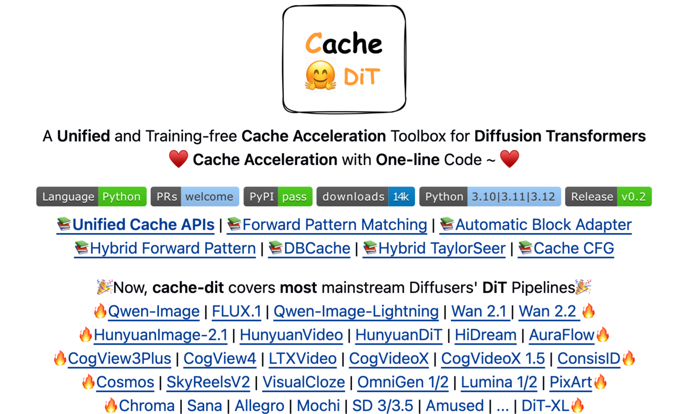
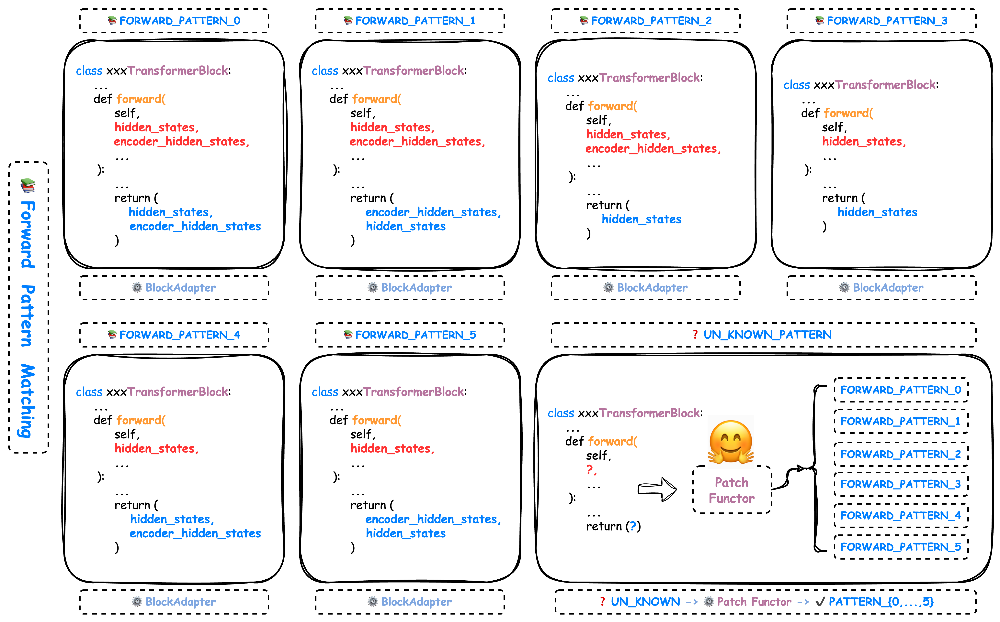
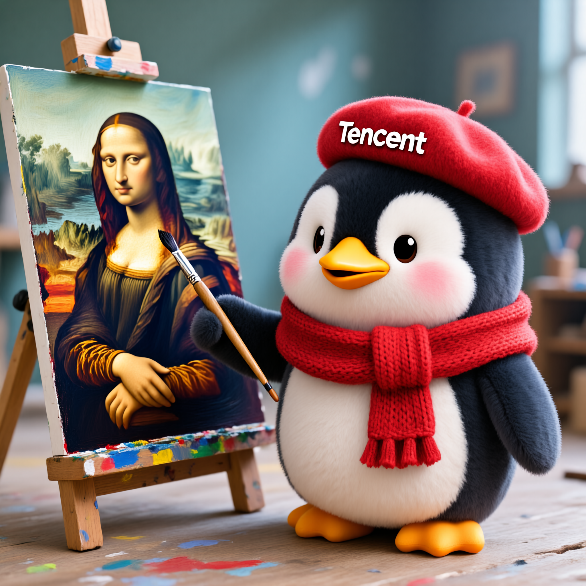

# [Diffusion 추론] cache-dit: BlockAdapter의 HunyuanImage-2.1 Cache 가속 지원!

> 원문: https://zhuanlan.zhihu.com/p/1950849526400263083

### 0x00 서문

본 글은 HunyuanImage-2.1을 예시로, cache-dit의 BlockAdapter를 사용하여 diffusers 외부의 확산 모델에 빠르게 Cache 추론 가속을 지원하는 방법을 보여줍니다. HunyuanImage-2.1은 현재(2025-09-15) diffusers 공식 라이브러리에서 아직 지원되지 않아, cache-dit의 유연성을 설명하는 예시로 적합합니다. HunyuanImage-2.1 출시 직후 cache-dit이 해당 모델의 가속 적용을 완료했으며, **1.7x 가속, 결과 기본적으로 무손실**입니다. 현재 HunyuanImage-2.1을 포함하여 cache-dit은 거의 모든 주류 모델을 지원하며, DiT-XL 같은 원조급 구 모델까지 원활하게 적용됩니다. cache-dit: https://github.com/vipshop/cache-dit


cache-dit for diffusers

### 0x01 의존성 설치

cache-dit과 dev 버전 diffusers를 설치합니다. 참고: **최신 cache-dit과 최신 diffusers를 설치해야 합니다.**
```
pip install git+https://github.com/huggingface/diffusers
pip install -U cache-dit # 최신 cache-dit 설치 필요
```

### 0x02 "모델"이 아닌 "패턴"에 적응

cache-dit에서는 "모델"이 아닌 "패턴"에 적응하는 방식으로 주류 모델의 빠른 지원을 구현하며, BlockAdapter는 이러한 적응 방식의 엔지니어링 구현입니다. 새로운 주류 모델, 예를 들어 HunyuanImage-2.1, Qwen-Image 등이 cache-dit에서 이미 적응된 "패턴(Pattern)"에 부합하기만 하면, 즉시 cache-dit으로 추론 가속을 수행할 수 있습니다. 관련 개념의 세부 사항은 cache-dit이 정식으로 첫 API 안정 버전을 출시한 후 별도의 글을 작성하여 상세히 설명할 예정입니다. 하는 일은 사실 많지 않으며, 적절한 추상화를 사용하여 cache 가속을 간단하게 만드는 것이 전부입니다.


Forward Pattern Matching

### 0x03 BlockAdapter로 HunyuanImage-2.1 지원

서론은 줄이고 바로 예제 코드를 첨부합니다. 사용해 보시기 바랍니다. cache-dit은 HunyuanImage-2.1에 DBCache, TaylorSeer 캐시 가속 지원을 제공합니다. HunyuanImage-2.1이 아직 diffusers에서 지원되지 않으므로, BlockAdapter를 통해 diffusers 라이브러리 외부의 모델을 지원합니다. 참고: 본 예제는 이 PR을 기반으로 합니다: https://github.com/Tencent-Hunyuan/HunyuanImage-2.1/pull/12

```python
import os
import sys
import gc

sys.path.append("..")
sys.path.append(os.environ.get("HYIMAGE_PKG_DIR", "."))

import time
import torch
from hyimage.diffusion.pipelines.hunyuanimage_pipeline import (
    HunyuanImagePipeline,
)
from hyimage.models.hunyuan.modules.hunyuanimage_dit import (
    HYImageDiffusionTransformer,
)
from utils import get_args, strify, GiB
import cache_dit

args = get_args()
print(args)

torch.set_grad_enabled(False)

# 지원 모델: hunyuanimage-v2.1, hunyuanimage-v2.1-distilled

# 참고: 이 예제는 다음 PR 기반:
# https://github.com/Tencent-Hunyuan/HunyuanImage-2.1/pull/12

# export HYIMAGE_PKG_DIR=/path/to/Tencent-Hunyuan/HunyuanImage-2.1
# export HUNYUANIMAGE_V2_1_MODEL_ROOT=/path/to/HunyuanImage-2.1
# cd $HUNYUANIMAGE_V2_1_MODEL_ROOT
# modelscope download --model AI-ModelScope/Glyph-SDXL-v2 --local_dir ./text_encoder/Glyph-SDXL-v2
# modelscope download Qwen/Qwen2.5-VL-7B-Instruct --local_dir ./text_encoder/llm
# modelscope download google/byt5-small --local_dir ./text_encoder/byt5-small
model_name = "hunyuanimage-v2.1"
pipe = HunyuanImagePipeline.from_pretrained(
    model_name=model_name,
    torch_dtype="bf16",
    # 참고: CPU에 먼저 로드, 이렇게 하면 낮은 GPU VRAM(<96 GiB)에서도
    # HunyuanImage 실행 가능:
    # CPU -> GPU VRAM < 96GiB ? -> FP8 weight only on CPU -> GPU
    device="cpu" if GiB() < 96 else "cuda",
    use_compile=False,
)

if GiB() < 96:
    assert args.quantize, "낮은 GPU 메모리 디바이스에서는 quantize를 활성화하세요."

# FP8 weight only
if args.quantize:
    # 최소 필요 VRAM: 38 GiB
    print("FP8 Weight Only Quantize 적용 중 ...")
    args.quantize_type = "fp8_w8a16_wo"  # 강제
    pipe.dit = cache_dit.quantize(
        pipe.dit,
        quant_type=args.quantize_type,
        exclude_layers=[
            "img_in",
            "txt_in",
            "time_in",
            "time_r_in",
            "guidance_in",
            "final_layer",
        ],
    )
    pipe.text_encoder = cache_dit.quantize(
        pipe.text_encoder,
        quant_type=args.quantize_type,
    )
    time.sleep(0.5)
    torch.cuda.empty_cache()
    gc.collect()


pipe.to("cuda")

if args.cache:
    from cache_dit import BlockAdapter, ForwardPattern, ParamsModifier

    assert isinstance(pipe.dit, HYImageDiffusionTransformer)

    cache_dit.enable_cache(
        BlockAdapter(
            pipe=pipe,
            transformer=pipe.dit,
            blocks=[
                pipe.dit.double_blocks,  # 20
                pipe.dit.single_blocks,  # 40
            ],
            forward_pattern=[
                ForwardPattern.Pattern_0,
                ForwardPattern.Pattern_3,
            ],
            params_modifiers=[
                ParamsModifier(Fn_compute_blocks=args.Fn),
                ParamsModifier(Fn_compute_blocks=1),
            ],
            # block forward에 'hidden_states'와 'encoder_hidden_states'가 아닌
            # 'img'과 'txt'가 변수명으로 사용됨
            check_forward_pattern=False,
            check_num_outputs=False,
        ),
        # Cache 컨텍스트 kwargs
        Fn_compute_blocks=args.Fn,
        Bn_compute_blocks=args.Bn,
        max_warmup_steps=args.max_warmup_steps,
        max_cached_steps=args.max_cached_steps,
        max_continuous_cached_steps=args.max_continuous_cached_steps,
        enable_taylorseer=args.taylorseer,
        enable_encoder_taylorseer=args.taylorseer,
        taylorseer_order=args.taylorseer_order,
        residual_diff_threshold=args.rdt,
    )

prompt = "A cute, cartoon-style anthropomorphic penguin plush toy with fluffy fur, standing in a painting studio, wearing a red knitted scarf and a red beret with the word \"Tencent\" on it, holding a paintbrush with a focused expression as it paints an oil painting of the Mona Lisa, rendered in a photorealistic photographic style."

# 1024, 1024는 낮은 GPU 메모리 디바이스용. 1K 해상도로 이미지를
# 생성하면 아티팩트가 발생할 수 있음.
height, width = 2048, 2048
if args.compile:
    cache_dit.set_compile_configs()
    if not getattr(pipe.config.dit_config, "use_compile", False):
        pipe.dit = torch.compile(pipe.dit)
    pipe.text_encoder = torch.compile(pipe.text_encoder)

    # 워밍업
    image = pipe(
        prompt=prompt,
        # HunyuanImage-2.1 지원 해상도 및 종횡비 예시:
        # 16:9  -> width=2560, height=1536
        # 4:3   -> width=2304, height=1792
        # 1:1   -> width=2048, height=2048
        # 3:4   -> width=1792, height=2304
        # 9:16  -> width=1536, height=2560
        # 최상의 결과를 위해 위 width/height 쌍 중 하나를 사용하세요.
        width=width,
        height=height,
        use_reprompt=False if GiB() < 96 else True,  # 프롬프트 향상 활성화
        use_refiner=False if GiB() < 96 else True,  # 리파이너 모델 활성화
        # 증류 모델은 8 스텝으로 빠른 추론.
        # 비증류 모델은 50 스텝으로 더 나은 품질.
        num_inference_steps=8 if "distilled" in model_name else 50,
        guidance_scale=3.5,
        shift=5,
        seed=649151,
    )

start = time.time()
image = pipe(
    prompt=prompt,
    width=width,
    height=height,
    use_reprompt=False if GiB() < 96 else True,
    use_refiner=False if GiB() < 96 else True,
    num_inference_steps=8 if "distilled" in model_name else 50,
    guidance_scale=3.5,
    shift=5,
    seed=649151,
)
end = time.time()

stats = cache_dit.summary(pipe.dit)

time_cost = end - start
save_path = f"hunyuan-image-2.1.{strify(args, stats)}.png"
print(f"Time cost: {time_cost:.2f}s")
print(f"Saving image to {save_path}")
image.save(save_path)
```

실행 예시:
```
python3 run_hunyuan_image_2.1.py # baseline
python3 run_hunyuan_image_2.1.py --cache --compile --taylorseer --rdt 0.12 --mcc 2
```

VRAM이 48GiB 미만인 GPU는 ***-q*** 옵션을 추가하여 FP8 Weight Only로 HunyuanImage-2.1을 실행할 수 있습니다.

### 0x04 가속 효과

- Baseline

HunyuanImage-2.1 Baseline

- cache-dit: 1.7x SpeedUp!

cache-dit: 1.7x SpeedUp!

cache-dit 가속 후 결과가 기본적으로 무손실임을 확인할 수 있습니다. 전체 코드 링크:

star와 버그 제보 환영합니다~
