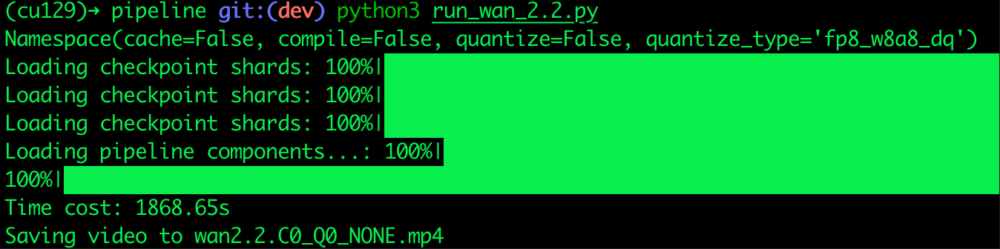
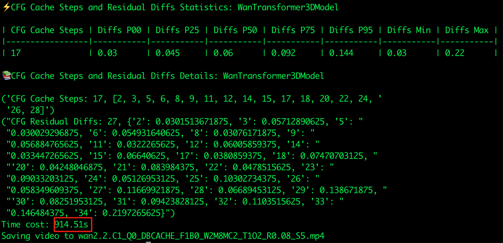
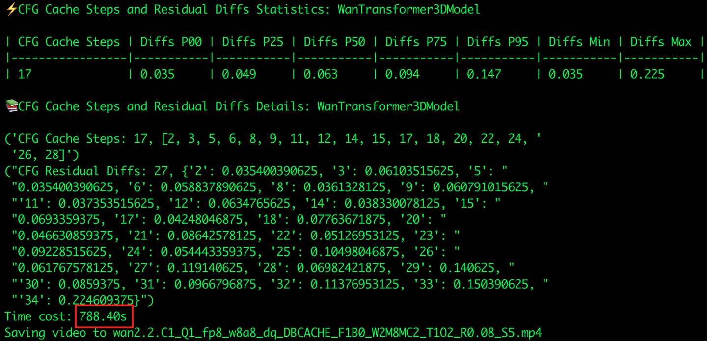

# cache-dit: Wan2.2-MoE 2.4x 추론 가속

> 원문: https://zhuanlan.zhihu.com/p/1943976514321380955

**목차**
- 0x00 머리말
- 0x01 Cache 가속
- 0x02 가속 효과
- 0x03 warmup의 영향
- 0x04 정리

## 0x00 머리말

본 글은 cache-dit으로 **Wan2.2-MoE**에 cache 가속을 적용하는 방법을 보여 준다. cache-dit의 DBCache + TaylorSeer + Cache CFG 조합에서 NVIDIA L20을 기준으로 약 **2x~2.4x** 가속을 얻으며, 정확도는 여전히 양호하다. 전체 코드 링크: run_wan_2.2.py. cache-dit 자세한 사용 문서는 다음을 참고: A Unified Cache Acceleration Toolbox for Diffusers — github.com/vipshop/cache-dit.

## 0x01 Cache 가속

cache-dit과 dev 버전 diffusers 설치:

```bash
pip install git+https://github.com/huggingface/diffusers
pip install -U cache-dit  # >= 0.2.28
```

말은 줄이고 바로 예제 코드를 붙인다. 직접 시도해 보길 권한다. cache-dit은 **Wan2.2-MoE**에 대해 DBCache, TaylorSeer, cache CFG 가속을 제공한다. 주의: **최신 cache-dit과 최신 diffusers가 필요하다.** cache-dit에서는 **BlockAdapter**를 통해 Wan2.2-MoE처럼 복잡한 구조의 DiT 모델도 cache 추론 가속을 빠르고 유연하게 적용할 수 있다.

```python
import os
import sys

sys.path.append("..")

import time
import torch
import diffusers
from diffusers import WanPipeline, AutoencoderKLWan, WanTransformer3DModel
from diffusers.utils import export_to_video
from diffusers.schedulers.scheduling_unipc_multistep import (
    UniPCMultistepScheduler,
)
from utils import get_args, GiB
import cache_dit


args = get_args()
print(args)


height, width = 480, 832
pipe = WanPipeline.from_pretrained(
    os.environ.get(
        "WAN_2_2_DIR",
        "Wan-AI/Wan2.2-T2V-A14B-Diffusers",
    ),
    torch_dtype=torch.bfloat16,
    # https://huggingface.co/docs/diffusers/main/en/tutorials/inference_with_big_models#device-placement
    device_map=(
        "balanced" if (torch.cuda.device_count() > 1 and GiB() <= 48) else None
    ),
)

# flow shift should be 3.0 for 480p images, 5.0 for 720p images
if hasattr(pipe, "scheduler") and pipe.scheduler is not None:
    flow_shift = 3.0 if height == 480 else 5.0
    pipe.scheduler = UniPCMultistepScheduler.from_config(
        pipe.scheduler.config,
        flow_shift=flow_shift,
    )


if args.cache:
    from cache_dit import ForwardPattern, BlockAdapter, ParamsModifier

    cache_dit.enable_cache(
        BlockAdapter(
            pipe=pipe,
            transformer=[
                pipe.transformer,
                pipe.transformer_2,
            ],
            blocks=[
                pipe.transformer.blocks,
                pipe.transformer_2.blocks,
            ],
            blocks_name=[
                "blocks",
                "blocks",
            ],
            forward_pattern=[
                ForwardPattern.Pattern_2,
                ForwardPattern.Pattern_2,
            ],
            params_modifiers=[
                # high-noise transformer only have 30% steps
                ParamsModifier(
                    max_cached_steps=8,
                ),
                ParamsModifier(
                    max_cached_steps=20,
                ),
            ],
            has_separate_cfg=True,
        ),
        # Common cache params
        Fn_compute_blocks=1,
        Bn_compute_blocks=0,
        max_warmup_steps=2,
        max_continuous_cached_steps=2,
        residual_diff_threshold=0.08,
        enable_taylorseer=True,
        enable_encoder_taylorseer=True,
    )

# Wan currently requires installing diffusers from source
assert isinstance(pipe.vae, AutoencoderKLWan)
if diffusers.__version__ >= "0.34.0":
    pipe.vae.enable_tiling()
    pipe.vae.enable_slicing()
else:
    print(
        "Wan pipeline requires diffusers version >= 0.34.0 "
        "for vae tiling and slicing, please install diffusers "
        "from source."
    )

assert isinstance(pipe.transformer, WanTransformer3DModel)
assert isinstance(pipe.transformer_2, WanTransformer3DModel)

if args.quantize:
    assert isinstance(args.quantize_type, str)
    if args.quantize_type.endswith("wo"):  # weight only
        pipe.transformer = cache_dit.quantize(
            pipe.transformer,
            quant_type=args.quantize_type,
        )
    # 정밀도 손실을 줄이기 위해 low-noise transformer에만
    # activation quantization (default: FP8 DQ)을 적용
    pipe.transformer_2 = cache_dit.quantize(
        pipe.transformer_2,
        quant_type=args.quantize_type,
    )

if args.compile or args.quantize:
    cache_dit.set_compile_configs()
    pipe.transformer.compile_repeated_blocks(fullgraph=True)
    pipe.transformer_2.compile_repeated_blocks(fullgraph=True)

    # warmup
    video = pipe(
        prompt=(
            "An astronaut dancing vigorously on the moon with earth "
            "flying past in the background, hyperrealistic"
        ),
        height=height,
        width=width,
        num_frames=81,
        num_inference_steps=50,
        generator=torch.Generator("cpu").manual_seed(0),
    ).frames[0]


start = time.time()
video = pipe(
    prompt=(
        "An astronaut dancing vigorously on the moon with earth "
        "flying past in the background, hyperrealistic"
    ),
    negative_prompt="",
    height=height,
    width=width,
    num_frames=81,
    num_inference_steps=50,
    generator=torch.Generator("cpu").manual_seed(0),
).frames[0]
end = time.time()

cache_dit.summary(pipe.transformer, details=True)
cache_dit.summary(pipe.transformer_2, details=True)

time_cost = end - start
save_path = (
    f"wan2.2.C{int(args.compile)}_Q{int(args.quantize)}"
    f"{'' if not args.quantize else ('_' + args.quantize_type)}_"
    f"{cache_dit.strify(pipe)}.mp4"
)
print(f"Time cost: {time_cost:.2f}s")
print(f"Saving video to {save_path}")
export_to_video(video, save_path, fps=16)
```

실행 스크립트:

```bash
python3 run_wan_2.2.py                                   # baseline
python3 run_wan_2.2.py --cache --compile                 # 2x speedup
python3 run_wan_2.2.py --cache --compile --quantize      # 2.4x speedup
```

## 0x02 가속 효과

### Baseline


*Baseline 소요 시간*


*Wan2.2 Baseline*

### cache-dit: 2x Speed Up!

cache-dit 로그는 아래와 같다. cache-dit은 Wan2.2-MoE 아키텍처의 두 transformer(각자 transformer block 집합을 가짐)에 대해 **서로 격리된 cache context**(blocks_140616409403840과 blocks_140616406624560)를 만들고, pipeline 수준에서 공유되는 cache manager를 둔다.

```
[cache_adapters.py:57] Adapting cache acceleration using custom BlockAdapter!
[block_adapters.py:361] Match Block Forward Pattern: WanTransformerBlock, ForwardPattern.Pattern_2
[block_adapters.py:361] IN:('hidden_states', 'encoder_hidden_states'), OUT:('hidden_states',))
[block_adapters.py:361] Match Block Forward Pattern: WanTransformerBlock, ForwardPattern.Pattern_2
[block_adapters.py:361] IN:('hidden_states', 'encoder_hidden_states'), OUT:('hidden_states',))
[cache_adapters.py:136] Use default 'enable_spearate_cfg': True, Pipeline: WanPipeline.
[pattern_base.py:48] Match Cached Blocks: CachedBlocks_Pattern_0_1_2, for blocks, cache_context: blocks_140616409403840, cache_manager: WanPipeline_140620110110240.
[pattern_base.py:48] Match Cached Blocks: CachedBlocks_Pattern_0_1_2, for blocks, cache_context: blocks_140616406624560, cache_manager: WanPipeline_140620110110240.
```


*cache-dit: 2x Speed Up!*


*cache-dit: 2x Speed Up!*

### cache-dit + FP8 DQ: 2.4x Speed Up!

정확도를 지키기 위해 low-noise 모델에만 FP8 DQ를 적용했다(low-noise 모델이 약 70%의 step을 차지한다).

```python
if args.quantize:
    assert isinstance(args.quantize_type, str)
    if args.quantize_type.endswith("wo"):  # weight only
        pipe.transformer = cache_dit.quantize(
            pipe.transformer,
            quant_type=args.quantize_type,
        )
    # low-noise transformer에만 activation quantization (default: FP8 DQ) 적용
    pipe.transformer_2 = cache_dit.quantize(
        pipe.transformer_2,
        quant_type=args.quantize_type,
    )
```


*cache-dit + FP8 DQ: 2.4x Speed Up!*


*cache-dit + FP8 DQ: 2.4x Speed Up!*

Cache 가속만 적용한 경우 생성 결과는 baseline과 거의 같다. 반면 FP8을 더하면 정확도 손실이 다소 두드러진다. `cache_dit.summary()`는 cache 통계 정보를 출력하며, 다음과 같이 high/low noise transformer cache의 step 수와 통계량이 각각 독립적으로 집계된다.

```
Cache Options: WanTransformer3DModel

{'name': 'blocks_140616409403840', 'Fn_compute_blocks': 1, 'Bn_compute_blocks': 0, 'non_compute_blocks_diff_threshold': 0.08, 'max_Fn_compute_blocks': -1, 'max_Bn_compute_blocks': -1, 'residual_diff_threshold': 0.08, 'l1_hidden_states_diff_threshold': None, 'important_condition_threshold': 0.0, 'enable_alter_cache': False, 'is_alter_cache': True, 'alter_residual_diff_threshold': 1.0, 'downsample_factor': 1, 'num_inference_steps': -1, 'max_warmup_steps': 2, 'max_cached_steps': 8, 'max_continuous_cached_steps': 2, 'executed_steps': 0, 'transformer_executed_steps': 0, 'enable_taylorseer': True, 'enable_encoder_taylorseer': True, 'taylorseer_cache_type': 'residual', 'taylorseer_order': 2, 'taylorseer': None, 'encoder_tarlorseer': None, 'enable_spearate_cfg': True, 'cfg_compute_first': False, 'cfg_diff_compute_separate': True, 'cfg_taylorseer': None, 'cfg_encoder_taylorseer': None, 'continuous_cached_steps': 0, 'cfg_continuous_cached_steps': 0, 'Fn_compute_blocks_ids': [], 'Bn_compute_blocks_ids': [], 'taylorseer_kwargs': {'max_warmup_steps': 2, 'n_derivatives': 2}}

⚡️Cache Steps and Residual Diffs Statistics: WanTransformer3DModel

| Cache Steps | Diffs P00 | Diffs P25 | Diffs P50 | Diffs P75 | Diffs P95 | Diffs Min | Diffs Max |
|-------------|-----------|-----------|-----------|-----------|-----------|-----------|-----------|
| 5           | 0.044     | 0.064     | 0.083     | 0.111     | 0.177     | 0.044     | 0.233     |

Cache Steps and Residual Diffs Details: WanTransformer3DModel

'Cache Steps: 5, [6, 8, 10, 12, 14]'
("Residual Diffs: 13, {'2': 0.2333984375, '3': 0.12890625, '4': 0.09375, '5': "
 "0.080078125, '6': 0.06787109375, '7': 0.1396484375, '8': 0.06396484375, '9': "
 "0.111328125, '10': 0.0517578125, '11': 0.0927734375, '12': 0.044921875, "
 "'13': 0.08349609375, '14': 0.044189453125}")

⚡️CFG Cache Steps and Residual Diffs Statistics: WanTransformer3DModel

| CFG Cache Steps | Diffs P00 | Diffs P25 | Diffs P50 | Diffs P75 | Diffs P95 | Diffs Min | Diffs Max |
|-----------------|-----------|-----------|-----------|-----------|-----------|-----------|-----------|
| 5               | 0.045     | 0.063     | 0.083     | 0.112     | 0.182     | 0.045     | 0.241     |

CFG Cache Steps and Residual Diffs Details: WanTransformer3DModel

'CFG Cache Steps: 5, [6, 8, 10, 12, 14]'
("CFG Residual Diffs: 13, {'2': 0.2412109375, '3': 0.1328125, '4': 0.09765625, "
 "'5': 0.0830078125, '6': 0.06982421875, '7': 0.142578125, '8': 0.0634765625, "
 "'9': 0.1123046875, '10': 0.051513671875, '11': 0.09228515625, '12': "
 "0.044677734375, '13': 0.0830078125, '14': 0.044677734375}")

Cache Options: WanTransformer3DModel

{'name': 'blocks_140616406624560', 'Fn_compute_blocks': 1, 'Bn_compute_blocks': 0, 'non_compute_blocks_diff_threshold': 0.08, 'max_Fn_compute_blocks': -1, 'max_Bn_compute_blocks': -1, 'residual_diff_threshold': 0.08, 'l1_hidden_states_diff_threshold': None, 'important_condition_threshold': 0.0, 'enable_alter_cache': False, 'is_alter_cache': True, 'alter_residual_diff_threshold': 1.0, 'downsample_factor': 1, 'num_inference_steps': -1, 'max_warmup_steps': 2, 'max_cached_steps': 20, 'max_continuous_cached_steps': 2, 'executed_steps': 0, 'transformer_executed_steps': 0, 'enable_taylorseer': True, 'enable_encoder_taylorseer': True, 'taylorseer_cache_type': 'residual', 'taylorseer_order': 2, 'taylorseer': None, 'encoder_tarlorseer': None, 'enable_spearate_cfg': True, 'cfg_compute_first': False, 'cfg_diff_compute_separate': True, 'cfg_taylorseer': None, 'cfg_encoder_taylorseer': None, 'continuous_cached_steps': 0, 'cfg_continuous_cached_steps': 0, 'Fn_compute_blocks_ids': [], 'Bn_compute_blocks_ids': [], 'taylorseer_kwargs': {'max_warmup_steps': 2, 'n_derivatives': 2}}

⚡️Cache Steps and Residual Diffs Statistics: WanTransformer3DModel

| Cache Steps | Diffs P00 | Diffs P25 | Diffs P50 | Diffs P75 | Diffs P95 | Diffs Min | Diffs Max |
|-------------|-----------|-----------|-----------|-----------|-----------|-----------|-----------|
| 17          | 0.03      | 0.045     | 0.059     | 0.092     | 0.144     | 0.03      | 0.22      |
```

## 0x03 warmup의 영향

대부분의 diffusion 모델은 denoising 초반 step이 **high-noise** 단계다. 따라서 합리적인 cache 로직은 앞부분 step을 일부 warmup하고(즉 cache하지 않고), **뒷부분 low-noise step에서 cache하는** 형태다. 실측 결과 `max_warmup_steps > 0`을 지정하면 정확도가 크게 올라간다. 다만 Wan2.2 MoE는 이미 high-noise·low-noise 두 모델을 따로 쓰므로, low-noise 모델에는 상대적으로 작은 warmup step을 지정하면 된다.

## 0x04 정리

본 글은 cache-dit으로 **Wan2.2 MoE**에 cache 가속을 적용하는 방법을 다뤘다. cache-dit의 DBCache + TaylorSeer + Cache CFG 조합에서 NVIDIA L20 기준 약 **2x~2.4x** 가속을 얻으면서도 양호한 정확도를 유지한다. 전체 코드 링크: run_wan_2.2.py. cache-dit 자세한 사용 문서도 함께 참고하면 된다.
