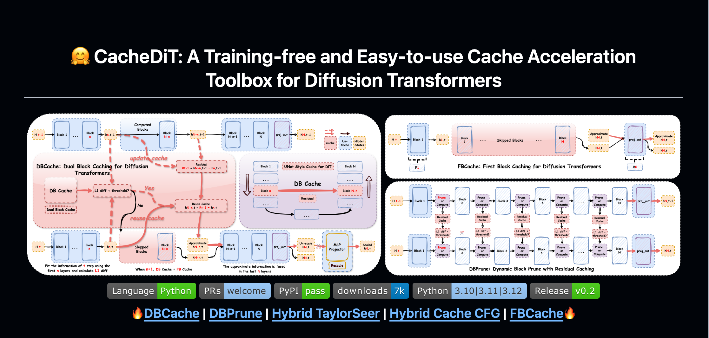
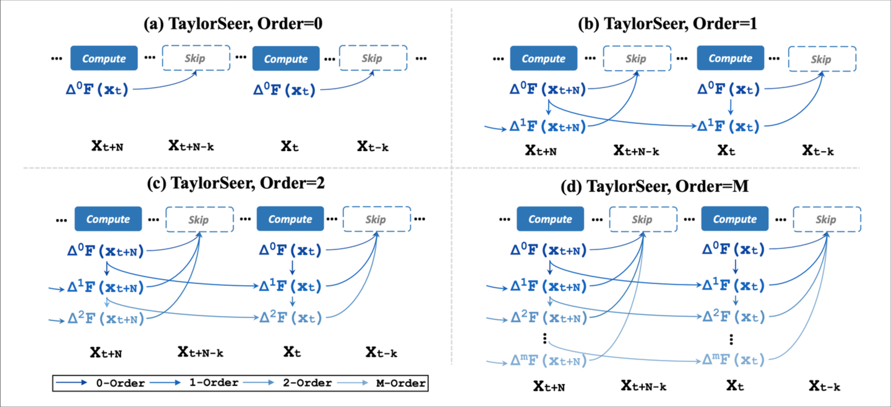
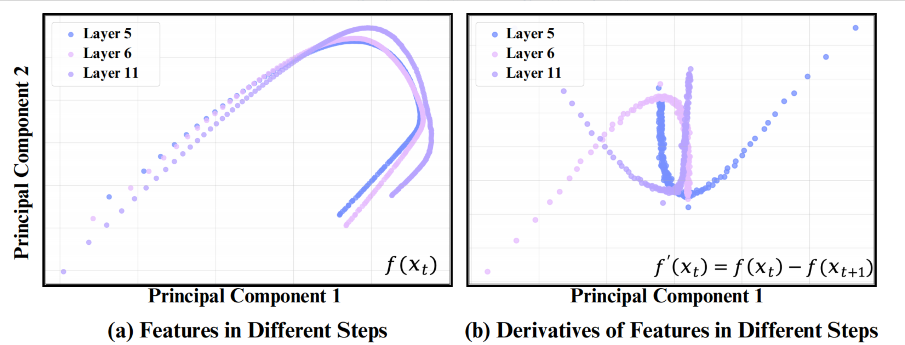
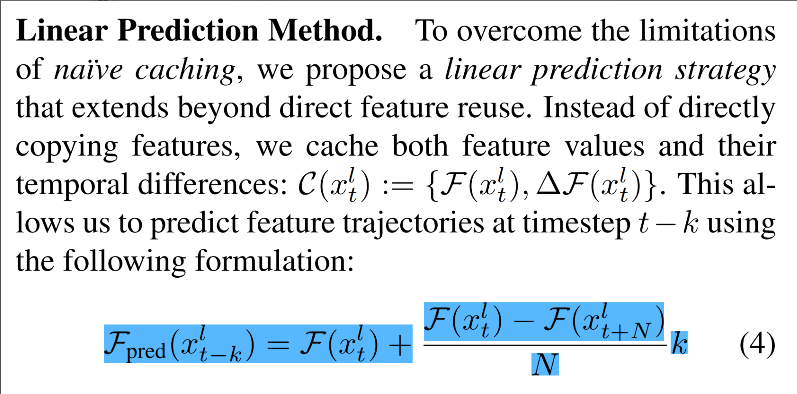
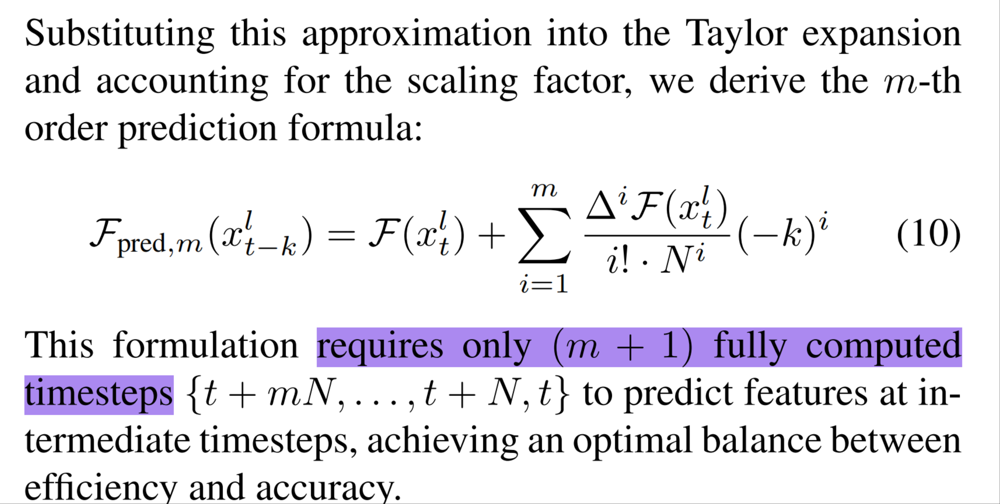
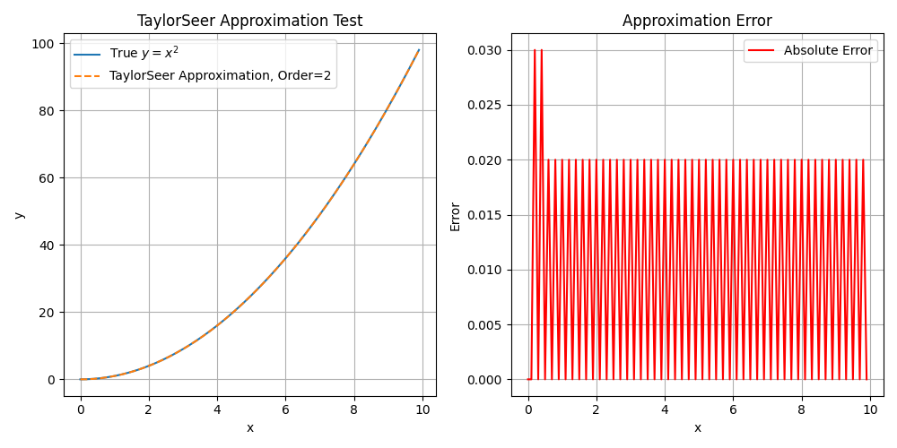
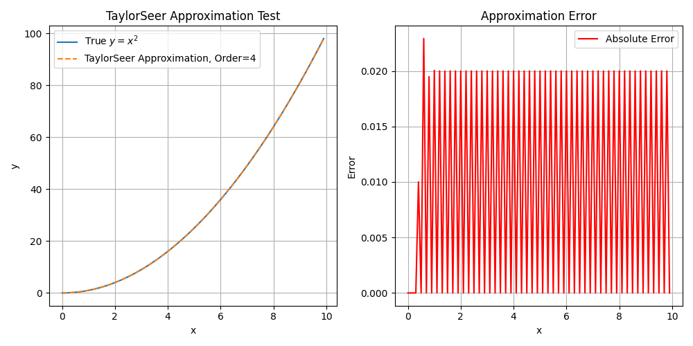
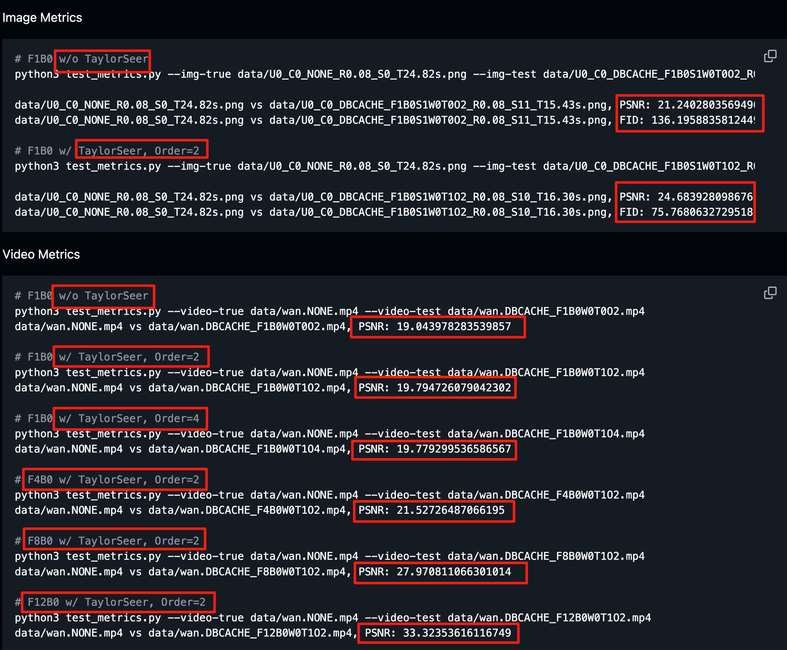
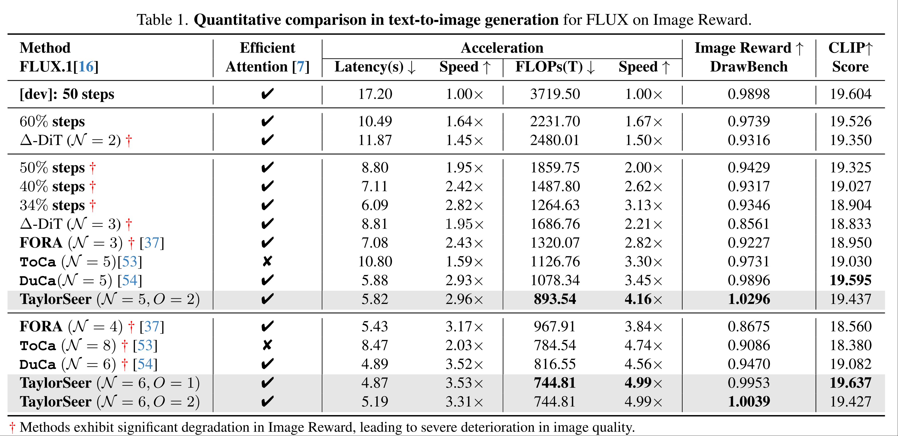
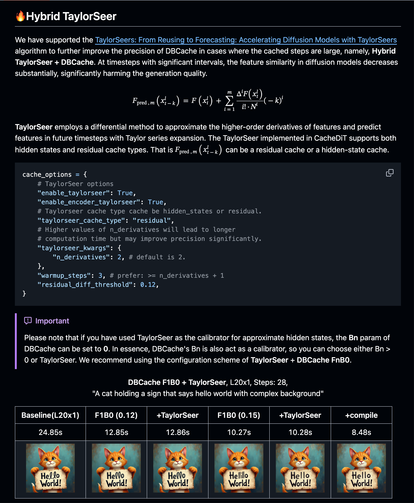

# [Diffusion 추론] Cache 가속 - TaylorSeer 알고리즘 간략 분석

> 원문: https://zhuanlan.zhihu.com/p/1937477466475197176

## 0x00 서문

업무 외 시간과 에너지가 한정되어 있어, 앞으로의 글은 단편적인 형태로, 핵심 내용을 기록하는 방향이 될 수 있습니다. 구체적인 세부 사항은 참고 논문을 확인해 주세요. 본 글은 DiT Cache 가속 알고리즘인 TaylorSeer의 핵심 요점을 간단히 기록합니다. 구체적인 실습은 cache-dit의 사용법을 참고하세요: Hybird TaylorSeer + DBCache

더 많은 기술 노트와 CUDA 학습 노트는 LeetCUDA를 참고해 주세요. 본 글의 내용:
- 0x00 서문
- 0x01 주요 기여
- 0x02 기본 가정
- 0x03 테일러 전개
- 0x04 모델 실측
- 0x05 코드 실습
- 0x06 총결

## 0x01 주요 기여

논문: From Reusing to Forecasting: Accelerating Diffusion Models with TaylorSeers, Code: https://github.com/Shenyi-Z/TaylorSeer

TaylorSeer, DuCa, ToCa 세 알고리즘은 동일한 저자입니다. TaylorSeer 핵심: 확산 Transformer(DiT)는 이미지 및 비디오 합성에서 높은 계산 요구량을 가지며, 기존 특성 캐시 방법은 시간 간격이 커질수록 특성 유사도가 하락하여 생성 품질이 저하됩니다. TaylorSeer는 "먼저 캐시 후 예측"(Cache-then-forecast) 패러다임(Cache-then-Reuse가 아닌)을 제안하여, 특성이 시간에 따라 천천히 연속적으로 변하는 특성을 기반으로, 미분법으로 특성 고차 도함수를 근사하고, 테일러 급수 전개를 통해 미래 시간 스텝의 특성을 예측하여 추가 학습 없이 효율적인 가속을 달성합니다.

주요 기여: 1. 새로운 패러다임을 제안하여 기존 캐시 방법의 높은 가속비에서 품질 급락 문제를 해결; 2. TaylorSeer를 도입하여 테일러 급수 전개와 고차 도함수 근사를 활용, 특성 궤적을 정확하게 예측하여 효율과 정밀도를 균형 있게 달성; 3. 실험에서 우수한 성과를 보이며 FLUX, HunyuanVideo 등 모델에서 4.99×~5.00× 가속을 품질 손실 없이 달성, DiT에서 4.53× 가속 시 FID가 SOTA보다 3.41 낮아 확산 모델 가속의 새로운 경로를 개척.

## 0x02 기본 가정

**특성값의 변화는 인접 스텝에서 매끄럽다**

**단점:** 추론 스텝 수가 많은 모델에만 적용 가능하며, 증류(distillation) 후의 모델에는 적합하지 않습니다. 증류 후 모델은 매 스텝마다 특성 변화가 크므로 기본 가정에 부합하지 않습니다.

## 0x03 테일러 전개

핵심 아이디어:

**과거의 점 위치를 알고 있을 때, 테일러 전개를 사용하여 현재의 점 위치를 추정한다.**

**1차 테일러 전개:**

1차 테일러 전개

**N차 테일러 전개:**

N차 테일러 전개

예시 1: TaylorSeer, Order=2

TaylorSeer, Order=2

예시 2: TaylorSeer, Order=4

TaylorSeer, Order=4

보시다시피, Order=4일 때 추정값의 피크 오차가 더 작습니다.

## 0x04 모델 실측

cache-dit에서 FLUX.1/Wan2.1 모델 실측:

모델 실측

논문의 실험 데이터:

TaylorSeer for FLUX.1

## 0x05 코드 실습

구체적인 실습은 cache-dit의 사용법을 참고하세요: Hybird TaylorSeer + DBCache. TaylorSeer 논문에서는 hidden_states에 대해 다차 테일러 전개를 사용하여 평활화 및 미래값 추정을 하지만, cache-dit에서는 hidden_states의 TaylorSeer뿐만 아니라 residual에 대한 TaylorSeer도 구현했으며, encoder_hidden_states에 TaylorSeer 사용 여부도 개별 설정할 수 있습니다.

Hybird TaylorSeer + DBCache

엔지니어링 잔여 과제: 고차 테일러 전개는 상당한 계산 오버헤드를 초래하므로, Triton/CUDA로 융합 연산자를 작성하여 가속할 필요가 있습니다.

## 0x06 총결

본 글은 TaylorSeer 알고리즘의 핵심 요점을 정리했습니다: 1. 새로운 패러다임을 제안하여 기존 캐시 방법의 높은 가속비에서 품질 급락 문제를 해결; 2. TaylorSeer를 도입하여 테일러 급수 전개와 고차 도함수 근사를 활용, 특성 궤적을 정확하게 예측하여 효율과 정밀도를 균형 있게 달성; 3. 실험에서 우수한 성과를 보이며 FLUX, HunyuanVideo 등 모델에서 4.99×~5.00× 가속을 품질 손실 없이 달성, DiT에서 4.53× 가속 시 FID가 SOTA보다 3.41 낮아 확산 모델 가속의 새로운 경로를 개척. 또한 코드 활용을 보여드렸습니다. 구체적인 실습은 cache-dit의 사용법을 참고하세요: Hybird TaylorSeer + DBCache.
