# DiT 추론 가속 종합 리뷰: Caching

> 원문: https://zhuanlan.zhihu.com/p/711223667

**목차**
- 0x00 머리말
- 0x01 DeepCache
- 0x02 FORA
- 0x03 AdaCache
- 0x04 Token Cache
- 0x05 ToCa
- 0x06 DuCa
- 0x07 TaylorSeer
- 0x08 TeaCache
- 0x09 AB-Cache
- 0x0a FBCache
- 0x0b DBCache
- 0x0c DBPrune
- 0x0d FastCache
- 0x0e 정리

## 0x00 머리말

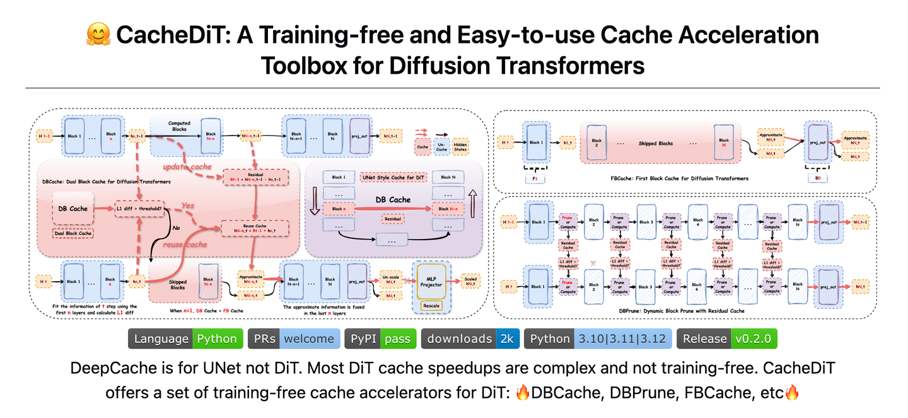
*CacheDiT*

Diffusion 추론 가속 방법론에는 Cache, 양자화, 분산 추론, sampler 최적화, 증류 등이 있다. 본 글은 Cache 방향의 가속 방안을 정리한다. **본업 외 시간과 여력이 한정적이라, 앞으로 글은 다소 단편적으로 흘러갈 수 있다.** 핵심만 짚고, 세부는 참고 논문에서 직접 확인하길 권한다.

Diffusion 추론 가속과 관련해서 저자가 정리한 논문·코드 모음은 Awesome-DiT-Inference에서 확인할 수 있다. 동시에 DiT Cache 가속을 위한 소형 툴박스 CacheDiT를 유지·보수하고 있다. 현재 CacheDiT는 **DBCache, DBPrune, TaylorSeer, FBCache** 네 가지 Cache 알고리즘을 지원하며, **FLUX, Wan2.1, CogVideoX** 등 주요 모델을 모두 지원한다.

```bash
pip3 install -U cache-dit
```

저자의 더 많은 기술 노트와 CUDA 학습 노트는 LeetCUDA에서 확인할 수 있다.

## 0x01 DeepCache

- 논문: DeepCache: Accelerating Diffusion Models for Free
- 코드: https://github.com/horseee/DeepCache

DeepCache는 Diffusion Cache 가속의 시조격 알고리즘으로, 주로 UNet 구조의 Diffusion 모델 추론 가속을 다룬다. Training-free 가속 알고리즘이며, 핵심 아이디어는 diffusion 모델의 순차 denoising step에 본래 존재하는 시간 중복(temporal redundancy)을 활용해 연산량을 줄이는 것이다. U-Net 구조 특성상 인접 denoising step 간 고수준 feature가 시간적으로 일관성이 큰 점에 착안해, 이런 고수준 feature를 cache하고 저수준 feature만 저비용으로 갱신함으로써 중복 연산을 피한다.

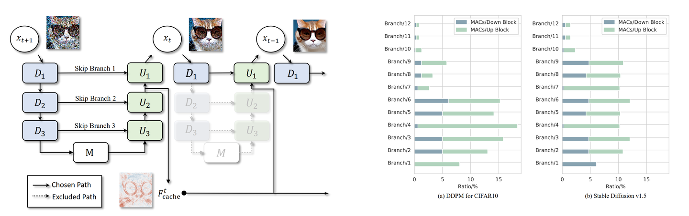
*DeepCache*

DeepCache는 생성 과정에서 이미 계산된 고수준 feature를 재사용하고, non-uniform 1:N 캐싱 간격 전략을 결합해 긴 간격에서도 feature 불변성을 유지하면서 가속한다. 기여는 다음과 같다. (1) Training-free Cache 가속 알고리즘 제안: Stable Diffusion v1.5에서 2.3배 가속과 CLIP 점수 0.05 하락에 그쳤고, LDM-4-G에서는 4.1배 가속과 FID 0.22 소폭 하락. (2) 고수준 feature의 시간 일관성을 활용해 중복 연산을 줄이고, non-uniform 1:N으로 긴 cache 간격에 적응해 유연성 강화. (3) CIFAR, ImageNet 등 다양한 데이터셋과 DDPM, LDM 등 모델에서 검증되었으며, 재학습이 필요한 pruning·distillation 기법보다 우수한 성능.

## 0x02 FORA

- 논문: FORA: Fast-Forward Caching in Diffusion Transformer Acceleration
- 코드: https://github.com/prathebaselva/FORA

FORA는 Fast-Forward Cache라고도 불리며, DiT 구조 Diffusion 모델에 맞춘 Cache 가속 방안이다. DeepCache는 UNet 구조와 U-shape 모델의 residual connection을 전제로 설계되어 DiT에 그대로 적용하기 어렵다.

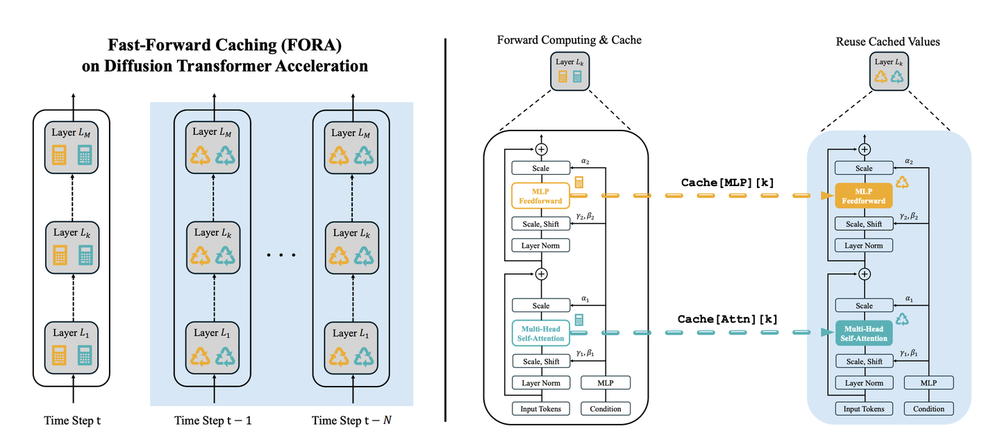
*FORA: Fast-Forward Cache*

FORA의 핵심 아이디어는 Diffusion Transformer의 diffusion 과정에서 나타나는 반복성을 활용해 DiT에 적용 가능한 Training-free Cache 가속을 구현하는 것이다. FORA(Fast-Forward Caching)는 DiT가 denoising 과정에서 인접 시점의 Attn·MLP layer feature에 두드러진 반복성을 보임을 관찰한다. feature를 캐싱해 중복되는 중간 feature를 저장하고 이후 step에서 그대로 재사용함으로써 단계별 재계산을 피한다. 구체적으로, 고정 간격 N으로 feature를 재계산·캐시한다. 시점 t가 t mod N == 0을 만족할 때 모든 layer의 cache를 업데이트하고, 이후 N-1 step 동안은 cache된 Attn·MLP feature를 직접 가져와 중복 계산을 건너뛴다. DiT 구조의 모델 구조 변경 없이 인접 시점 feature 유사성을 활용해 가속한다.

예컨대 250 step DDIM sampling에서 N=3이라면 3, 6, 9... step에서만 feature를 재계산하고 나머지는 cache를 재사용하므로 약 2/3의 연산을 줄일 수 있다. 실험적으로 FORA는 denoising 후기에 feature 유사성을 더 효과적으로 활용한다. 후기에는 feature 변화가 느려 cache 재사용의 가성비가 가장 높다.

## 0x03 AdaCache

- 논문: Adaptive Caching for Faster Video Generation with Diffusion Transformers
- 코드: https://github.com/AdaCache-DiT/AdaCache

AdaCache의 가장 큰 기여는 "adaptive caching mechanism"의 도입이다. 뒤에서 다룰 FBCache 역시 AdaCache를 간소화한 실용적 변형이다. AdaCache의 두 가지 핵심은:

1. **Adaptive caching mechanism**: DeepCache·FORA의 고정 간격 cache와 달리 AdaCache는 feature residual의 거리(예: L1 distance)를 계산해 언제 재계산하고 언제 cache를 재사용할지 동적으로 결정한다. 인접 diffusion step에서 feature 변화가 작으면(예: 정적 장면) cache를 더 많은 step에 걸쳐 재사용하고, 변화가 크면(예: 빠른 모션) cache 간격을 줄여 품질 저하를 막는다.
2. **Motion regularization (MoReg)**: latent feature 기반의 motion score 메커니즘으로, 모션이 큰 비디오에는 자동으로 더 많은 연산을 할당해 cache step을 줄이고, 정적 비디오에는 더 많은 step을 cache한다. 구현 측면에서 AdaCache는 motion-gradient를 계산해 향후 모션 추세를 예측하고, 초기 noise의 간섭을 피해 동적 장면의 생성 품질을 보장한다.

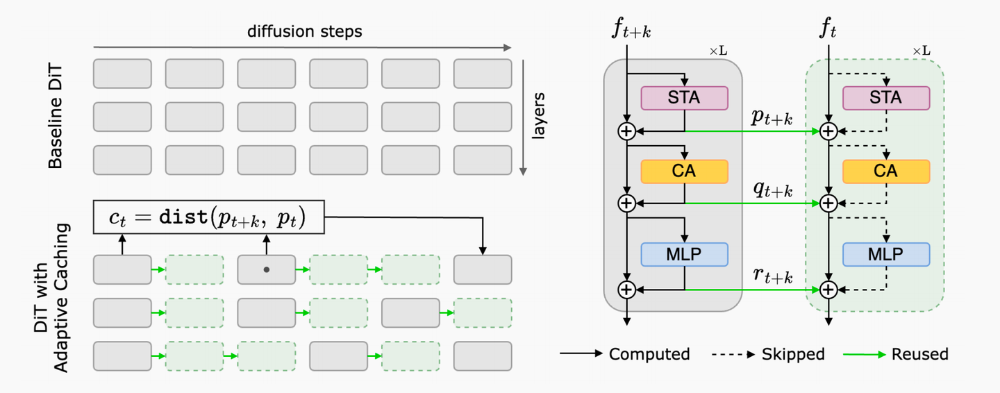
*AdaCache*

## 0x04 Token Cache

- 논문: Token Caching for Diffusion Transformer Acceleration

TokenCache는 Transformer(DiT)의 token 단위 연산 중복 관점에서 Cache 알고리즘을 설계했다. "동적 token pruning + adaptive block 선택 + 단계별 스케줄링"으로 token 단위 cache 가속을 구현한다. 핵심은:

- **Token 중요도 예측**: TokenCache는 Cache Predictor를 두어 각 token에 0~1 사이 점수를 매긴다. 값이 클수록 중요한 token이다. 점수가 낮은 token(예: 배경)은 이전 step에서 cache된 feature를 그대로 재사용해 중복 계산을 피한다. 임계값 이하인 token에는 이전 step 출력을 현재 계산 대신 사용한다.
- **Adaptive block 선택**: token 중요도 점수를 평균 내 block 중요도를 구하고, 출력에 영향이 가장 적은 block부터 우선적으로 잘라낸다.

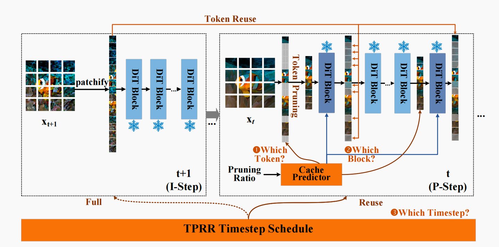
*Token Cache*

## 0x05 ToCa

- 논문: ToCa: Accelerating Diffusion Transformers with Token-wise Feature Caching
- 코드: https://github.com/Shenyi-Z/ToCa

ToCa 역시 token 수준의 cache 방법이다. Diffusion Transformer의 높은 계산 비용 문제를 token-wise feature caching인 ToCa로 풀어낸다. ToCa는 token마다 cache 민감도가 다르다는 점에 착안해, 시간 중복과 오차 전파를 분석한 뒤 cache할 token을 adaptive하게 선택하고 layer마다 다른 cache 비율을 적용한다. 실험적으로 PixArt-α, OpenSora, DiT 등에서 효율적인 가속이 가능하며, OpenSora에서는 2.36배 가속에 품질 손실이 거의 없다. 기여는 다음과 같다. (1) ToCa 제안: 오차 전파 관점에서 Diffusion Transformer Caching을 처음으로 최적화. (2) 추가 연산 없이 사분위수 기반 token 선택을 정의하고, layer별 차등 cache 지원. (3) 이미지·비디오 생성에서 효율적인 가속과 작은 품질 손실을 실험으로 검증, 코드 공개. **핵심: ToCa는 Attention Score(A = Softmax(QKᵀ/√d))를 그대로 사용해 token 중요도를 평가한다.**

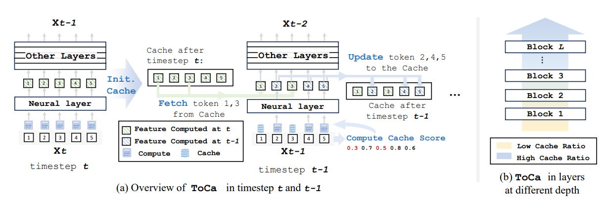
*ToCa*

## 0x06 DuCa

- 논문: Accelerating Diffusion Transformers with Dual Feature Caching
- 코드: https://github.com/Shenyi-Z/DuCa

DuCa(Dual Feature Caching)는 DiT의 연산 중복 문제에 대해 dual feature caching 전략을 제안한다. **공격적 Cache**(모든 block을 cache, 모든 계산을 건너뜀)와 **보수적 Cache**(일부 block만 cache)를 번갈아 사용한다. 먼저 공격적 cache로 높은 가속비를 얻고, 이어서 보수적 cache로 오차를 보정해 품질-속도의 모순을 해결한다. 동시에 V-Caching 전략을 도입해 value matrix norm 기준으로 중요 token을 선별하고, FlashAttention 같은 고효율 attention과의 호환을 유지해 기존 token 선택·메모리 최적화 기법과의 충돌을 피하며 효율을 끌어올린다.

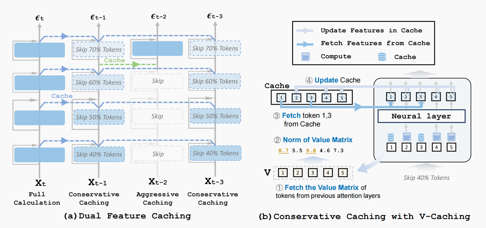
*DuCa: Dual Feature Caching*

DuCa에서 가장 가치 있게 본 부분은 한 가지 현상을 명확히 짚었다는 점이다. 즉 **cache하는 block 수를 줄이면 오차가 크게 떨어진다**. 이는 **모델의 block 자체가 자가 보정 기능을 갖추고 있어** 별도의 보정 모듈을 추가로 학습할 필요가 없음을 의미한다. 저자가 만든 DBCache 역시 이 특성을 활용한다.

## 0x07 TaylorSeer

- 논문: From Reusing to Forecasting: Accelerating Diffusion Models with TaylorSeers
- 코드: https://github.com/Shenyi-Z/TaylorSeer

TaylorSeer, DuCa, ToCa는 같은 저자의 작업이다. TaylorSeer의 핵심: DiT는 이미지·비디오 합성에서 계산 수요가 크고, 기존 feature caching 기법은 **시간 간격이 커지면 feature 유사도가 떨어져** 생성 품질이 손상된다. TaylorSeer는 **"cache 후 예측"(Cache-then-forecast)** 패러다임을 제안한다(Cache-then-Reuse가 아님). feature가 시간에 따라 매끄럽고 연속적으로 변화한다는 점을 이용해, 미분으로 feature의 고차 도함수를 근사한 뒤 Taylor 급수 전개로 미래 시점의 feature를 예측해 추가 학습 없이 가속한다.

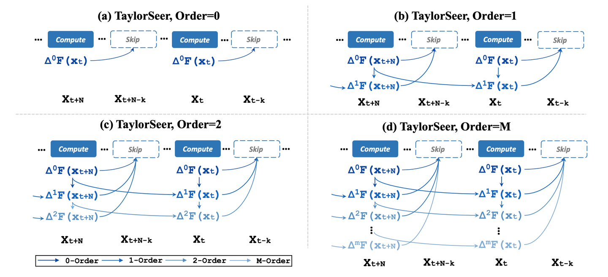
*TaylorSeers*

기여: 1) 높은 가속비에서 품질이 급락하던 기존 cache 기법의 한계를 해결하는 새 패러다임 제시. 2) Taylor 급수 전개와 고차 도함수 근사를 활용해 feature trajectory를 정확히 예측, 효율과 정확도의 균형. 3) FLUX, HunyuanVideo 등에서 4.99×~5.00× 가속에 품질 무손실, DiT에서 4.53× 가속 시 FID가 SOTA 대비 3.41 낮음. Diffusion 모델 가속의 새로운 방향을 열었다.

> **참고: CacheDiT는 이미 TaylorSeer 알고리즘을 지원하며 DBCache와 결합해 사용할 수 있다.**

## 0x08 TeaCache

- 논문: Timestep Embedding Tells: It's Time to Cache for Video Diffusion Model
- 코드: https://github.com/LiewFeng/TeaCache

TeaCache(CVPR 2025 채택, 커뮤니티가 활발하고 주요 모델을 폭넓게 지원)는 Timestep Embedding 기반의 동적 Cache 전략으로, diffusion 모델 추론 효율과 정확도 사이의 모순을 해결한다. 기존 균등 cache 전략은 출력 차이의 비균일성을 간과한다. 반면 TeaCache는 모델의 **입력과 출력의 강한 상관관계**를 발견하고, Timestep Embedding(입력)을 이용해 출력 차이를 추정한다. 먼저 이 입력으로 출력 변화를 거칠게 추정하고, 다항식 fitting으로 스케일 편향을 보정한 뒤 누적 차이를 판정 기준으로 삼아, 이전 step에서 cache된 출력을 재사용할지 동적으로 결정해 중복 연산을 피한다. 학습이 필요 없고 FlashAttention과 호환되며 시점별 연산 중복에 적응적이다. 다만 다항식 보정 단계가 데이터셋으로 fitting되어야 하므로 TeaCache의 유연성을 어느 정도 제한한다.

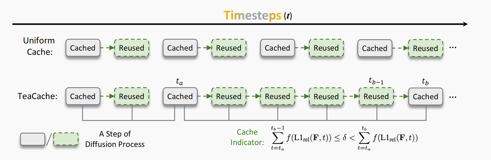
*TeaCache*

## 0x09 AB-Cache

- 논문: AB-Cache: Training-Free Acceleration of Diffusion Models via Adams-Bashforth Cached Feature Reuse

AB-Cache는 Adams-Bashforth 수치 적분 기반의 Training-free Diffusion 가속 알고리즘을 제안해 denoising 과정의 연산 중복 문제를 해결한다. Diffusion의 역과정을 적분 특성으로 분석해, 인접 시점의 출력이 선형 관계를 만족하며 2차 Adams-Bashforth가 O(h²) 절단 오차에 대응한다는 점을 보였다(공식이 복잡해 솔직히 깊이 따라가지는 않았다). **기존 Cache 기법이 단일 step 결과만 재사용했던 한계를 넘어**, **앞선 k step의 출력을 가중 결합해** k차 선형 근사로 현재 step의 전체 계산을 대체한다. O(h^k) 오차 범위를 유지하면서 연산량을 크게 줄인다. 예를 들어 3차 근사에서는 앞선 3 step 출력의 이항 결합으로 현재 step 결과를 동적으로 추정해 더 정확한 출력을 얻는다. 한 줄 요약: **앞선 k step 출력을 가중 결합하면 더 정확한 결과를 얻을 수 있다.**

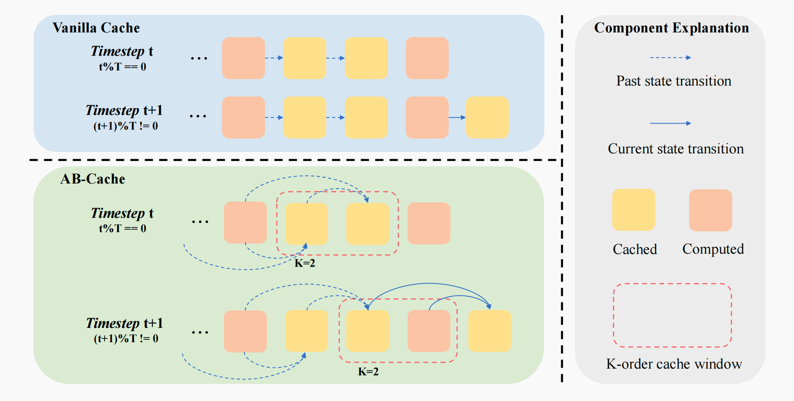
*AB-Cache*

## 0x0a FBCache

- 문서: Fastest HunyuanVideo Inference with Context Parallelism and First Block Cache
- 코드: https://github.com/chengzeyi/ParaAttention

FBCache(First Block Cache)는 Diffusion 추론 가속을 다루는 사람이라면 익숙할 것이다. ParaAttention 분산 추론 프레임워크의 중요 기능 중 하나다. 문서를 보면 FBCache는 AdaCache의 간소화 버전이자 TeaCache의 강화 버전이다. AdaCache·TeaCache와 비교하면, FBCache는 residual cache를 활용해 First Block L1 오차 기반 Cache 방안을 구현한다. 오차가 지정 임계값보다 작으면 현재 step 계산을 건너뛰고 residual cache를 재사용해 현재 step 출력을 추정한다. FBCache는 Training-free 알고리즘으로 calibration step이 필요 없다. FBCache 도식은 다음과 같이 간단히 그려 두었다.

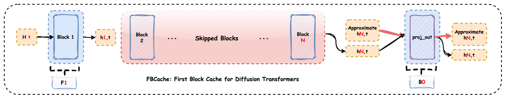
*FBCache: First Block Cache*

## 0x0b DBCache

- 문서: DBCache: Dual Block Caching for Diffusion Transformers
- 코드: https://github.com/vipshop/cache-dit

**DBCache(Dual Block Caching)**는 저자가 FBCache 위에서 진행한 엔지니어링 개선이며, AdaCache와 DuCa의 비교적 완성된 엔지니어링 구현이라고 볼 수도 있다. FBCache를 더 범용적이고 완전히 사용자 정의 가능한 Cache 알고리즘으로 확장해, DiT 모델에 완전한 UNet 스타일 Cache 가속을 가능하게 한다. DBCache는 F8B12처럼 다양한 computation block 구성을 정의할 수 있으며, DuCa의 관찰처럼 **non-cache block 수를 늘리면 결과 정확도가 높아진다**. Fn과 Bn을 조절해 DBCache는 성능과 정확도의 완벽한 균형을 잡을 수 있다. 게다가 DBCache 역시 Training-free 알고리즘이다.

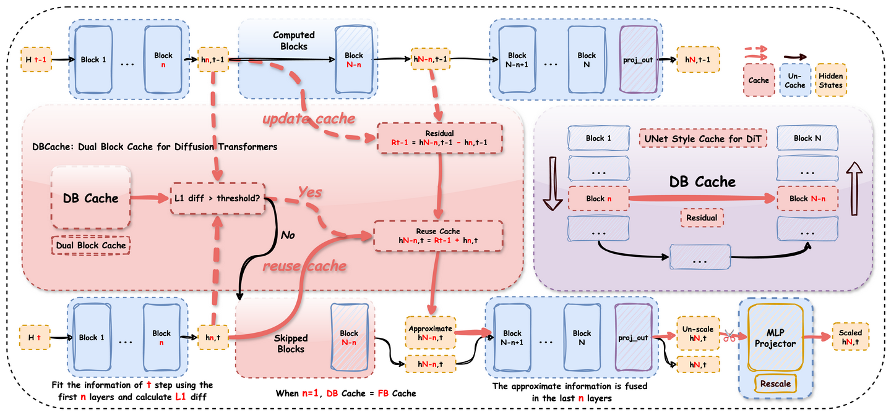
*DBCache: Dual Block Caching*

DBCache의 가장 큰 변화는 FBCache를 구성 가능한 **FnBn** Cache 가속 알고리즘으로 재설계했다는 점이다. **Fn**은 시점 t의 정보를 fitting하기 위해 앞쪽 n개 Transformer block을 사용함으로써 더 안정적인 L1 diff를 계산하고, 이후 block에 더 정확한 정보를 전달한다. **Bn**은 뒤쪽 n개 Transformer block을 추가로 사용해 residual cache로 추정한 근사 정보를 fusing함으로써 예측 정확도를 높인다. 이 뒤쪽 n개 block이 사실상 근사 정보의 자동 보정기 역할을 한다.

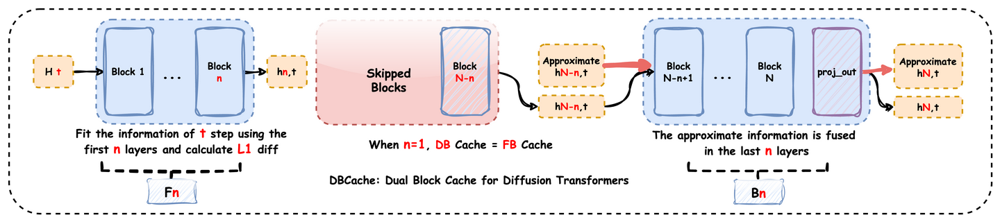
*DBCache: FnBn*

## 0x0c DBPrune

- 문서: DBPrune: Dynamic Block Prune with Residual Caching
- 코드: https://github.com/vipshop/cache-dit

**DBPrune(Dynamic Block Prune)**은 저자가 추가로 구현한, residual caching 기반의 block 동적 pruning 알고리즘이다. Diffusion Transformer에 적용 가능하다. DBPrune은 각 block의 hidden states와 residual을 cache한 뒤, 추론 도중 직전 step에서 같은 block의 입력 hidden states와 현재 step에서 같은 block의 입력 hidden states 간 L1 diff를 계산해 block을 동적으로 prune한다. 어떤 block이 prune되면 그 출력은 cache된 residual로 근사 계산된다.

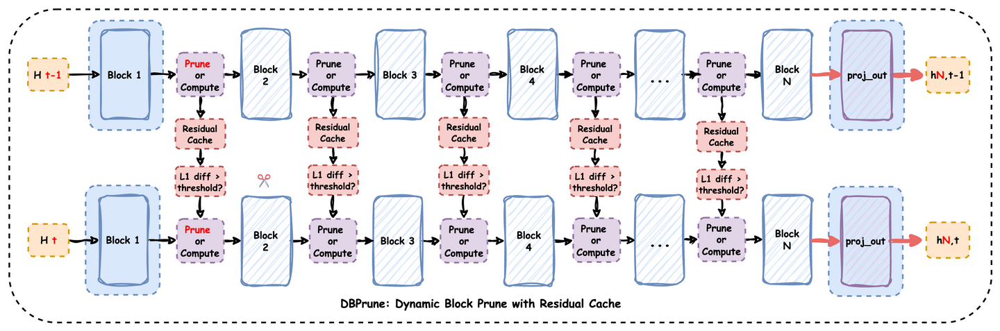
*DBPrune: Dynamic Block Prune*

## 0x0d FastCache

- 논문: FastCache: Fast Caching for Diffusion Transformer Through Learnable Linear Approximation
- 코드: https://github.com/NoakLiu/FastCache-xDiT

FastCache의 가장 큰 특징은 **Block Level Cache와 Token Level Cache의 결합**이다. 이론적으로 FastCache는 hypothesis test 기반의 결정 규칙 아래 bounded approximation error를 유지한다. 실제로는 전후 시점의 hidden states에 대한 L1 diff 차이로 어떤 token이 **"정적" token**(예: 변화가 적은 배경)이고 어떤 token이 **"동적" token**(예: 인물·동물)인지 판단한다. 정적 token은 시간 변화가 작아 cache를 직접 재사용할 수 있으며, 현재 Block Level Cache가 발동하지 않더라도 Token Level Cache는 여전히 적용 가능하다.

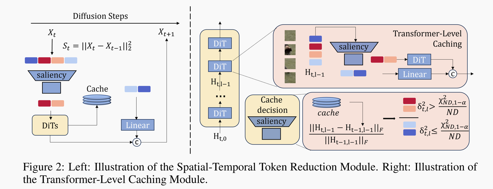
*FastCache*

더 나아가 정적으로 판정된 token에 대해 FastCache는 직전 step의 cache를 그대로 쓰지 않고, 학습 가능한 Linear layer로 cache를 보정한 뒤 사용한다. 또한 FastCache 코드는 xDiT 기반으로 개조되어 sequence parallelism까지 지원한다.

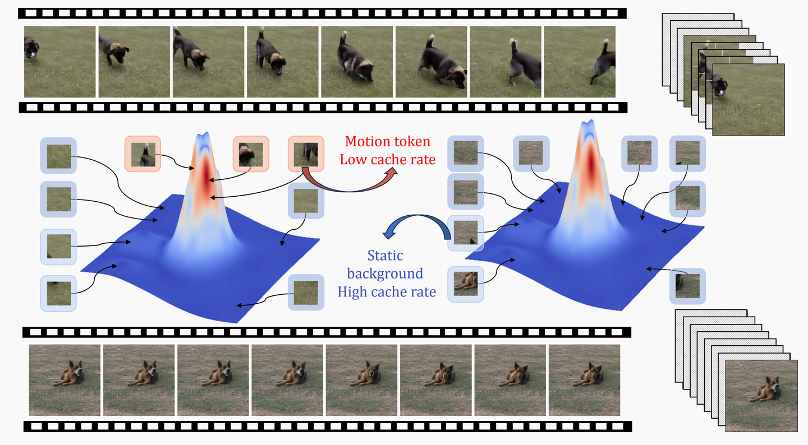
*Motion token and Static token*

## 0x0e 정리

본 글은 DeepCache, FORA, AdaCache, Token Cache, ToCa, DuCa, TaylorSeer, TeaCache, AB-Cache, FBCache 등 다양한 Diffusion 모델 Cache 가속 알고리즘의 핵심 아이디어를 정리했다. 그리고 FBCache, AdaCache, DuCa를 토대로 한 저자의 엔지니어링 구현인 DBCache와 DBPrune도 함께 소개했다.

전체적으로 DiT의 Cache 가속은 결국 두 가지 큰 축이다. **Block Level과 Token Level**.

엔지니어링 관점에서 Block Level은 입자도가 크지만 구현이 단순하고, torch.compile, sequence parallelism, 양자화 같은 기존 가속 기법과의 호환성이 강하다. 반면 Token Level은 극단적으로 동적인 특성 때문에 torch.compile 같은 가속 기법과의 호환이 까다롭고, transformer block 내부를 광범위하게 손봐야 한다.

마지막으로, Diffusion 추론 가속과 관련해서 저자가 정리한 논문·코드 모음은 Awesome-DiT-Inference에서 확인할 수 있다. DiT Cache 가속 툴박스 CacheDiT도 유지보수 중이다. **현재 CacheDiT는 DBCache, DBPrune, TaylorSeer, FBCache 네 가지 Cache 알고리즘을 지원한다.**

늘 그렇듯, 오류는 발견 즉시 갱신하고 수정해 나가겠다.
