> Blog source: https://pytorch.org/blog/accelerating-generative-ai-3/ By Sayak Paul and Patrick von Platen (Hugging Face 🤗) January 3, 2024. 이 글은 《Accelerating Generative AI Part III: Diffusion, Fast》의 번역으로, 순수 native PyTorch 기술만으로 text-to-image diffusion model, 특히 Stable Diffusion XL의 inference speed를 최대 3배까지 높이는 방법을 소개합니다. 글은 다섯 가지 주요 최적화 기법을 자세히 설명합니다. bfloat16으로 낮은 정밀도에서 실행(7.36초에서 4.63초), scaled_dot_product_attention(SDPA)을 적용해 efficient attention 계산(3.31초), `torch.compile`로 UNet과 VAE component compile(2.54초), q/k/v projection matrix를 결합해 attention 계산, dynamic int8 quantization(최종 2.43초). 이 기술들은 모두 PyTorch native이며 third-party library나 C++ code 의존이 필요 없습니다. 🤗Diffusers library에서 몇 줄 코드만으로 적용할 수 있고, 저자들은 이 방법이 다른 diffusion model(SSD-1B, Stable Diffusion v1-5, PixArt-Alpha 등)에서도 일반성과 유효성이 있음을 검증했습니다. 공개 계정의 이 번역은 과학 보급과 지식 전파만을 위한 것이며, 권리 침해 시 삭제하겠습니다.

# Accelerating Generative AI Part III: Diffusion, Fast

이 글은 순수 native PyTorch로 generative AI model을 가속하는 여러 편짜리 blog series의 세 번째 글입니다. 우리는 새로 출시된 PyTorch performance feature들과 실제 예시를 공유하며 PyTorch native performance를 어디까지 밀어붙일 수 있는지 살펴보려 합니다. 첫 번째 글에서는 순수 native PyTorch만으로 Segment Anything을 8배 넘게 가속하는 방법을 보였습니다(https://pytorch.org/blog/accelerating-generative-ai/). 두 번째 글에서는 native PyTorch optimization만으로 Llama-7B를 거의 10배 가속하는 방법을 보였습니다(https://pytorch.org/blog/accelerating-generative-ai-2/). 이 글에서는 text-to-image diffusion model을 최대 3배까지 가속하는 데 집중합니다.

> PyTorch로 Generative AI 가속하기: GPT Fast(https://mp.weixin.qq.com/s/wNfpeWxP4HK633RcTBkKyg)

우리는 다음 최적화 기법들을 사용합니다.

- bfloat16 precision으로 실행
- scaled_dot_product_attention (SDPA)
- torch.compile
- q,k,v projection을 결합해 attention 계산
- dynamic int8 quantization

주로 Stable Diffusion XL(SDXL)에 집중해 3배 latency 개선을 보여줍니다. 이 기술들은 모두 PyTorch native입니다. 즉 어떤 third-party library나 C++ code에도 의존하지 않고 활용할 수 있습니다.

🤗Diffusers library에서 이 최적화를 활성화하는 데는 몇 줄 코드만 필요합니다. 이미 흥미가 생겨 코드를 바로 보고 싶다면 함께 제공되는 code repository를 방문하세요: https://github.com/huggingface/diffusion-fast .

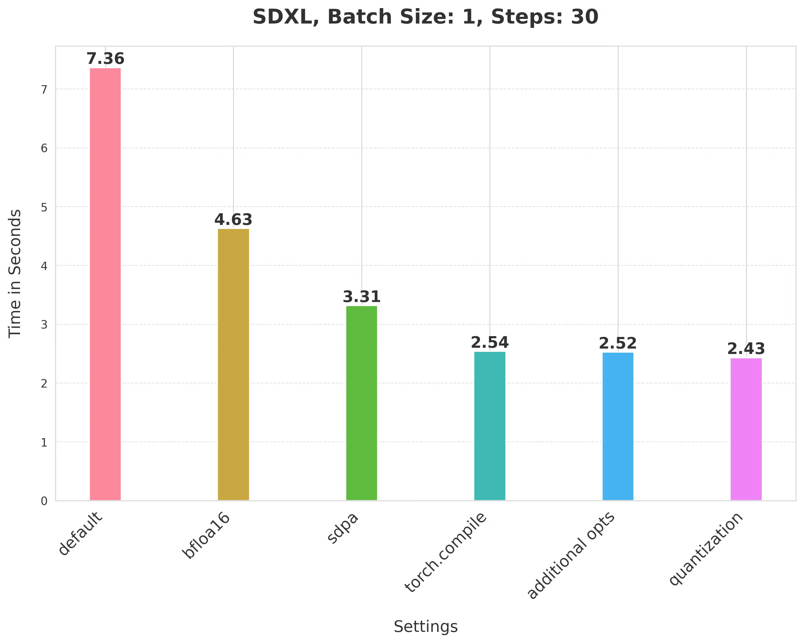

(논의하는 기술은 SDXL 전용이 아니며, 뒤에서 보이듯 다른 text-to-image diffusion system도 가속할 수 있습니다.)

관련 주제의 blog 글은 다음과 같습니다.

- Accelerated Diffusers with PyTorch 2.0(https://pytorch.org/blog/accelerated-diffusers-pt-20/)
- Exploring simple optimizations for SDXL (https://huggingface.co/blog/simple_sdxl_optimizations)
- Accelerated Generative Diffusion Models with PyTorch 2(https://pytorch.org/blog/accelerated-generative-diffusion-models/)

## 환경 설정

우리는 🤗Diffusers library(https://github.com/huggingface/diffusers)를 사용해 이 최적화들과 각각의 speedup을 보여줍니다. 그 밖에도 다음 PyTorch native library와 환경을 사용합니다.

- Torch nightly(efficient attention의 가장 빠른 kernel 이점을 얻기 위해 사용; 2.3.0.dev20231218+cu121)
- 🤗 PEFT(version: 0.7.1)
- torchao(commit SHA: 54bcd5a10d0abbe7b0c045052029257099f83fd9)
- CUDA 12.1

환경 재현을 더 쉽게 하려면 이 Dockerfile(https://github.com/huggingface/diffusion-fast/blob/main/Dockerfile)을 참고할 수 있습니다. 이 글의 benchmark data는 400W 80GB A100 GPU(clock frequency를 max로 설정)에서 얻었습니다.

여기서는 A100 GPU(Ampere architecture)를 사용하므로 `torch.set_float32_matmul_precision("high")`를 지정해 TF32 precision format의 이점을 얻을 수 있습니다.

## 낮은 정밀도로 inference 실행

Diffusers에서 SDXL을 실행하는 데는 몇 줄 코드만 필요합니다.

```python
from diffusers import StableDiffusionXLPipeline

# full precision pipeline을 load하고 model component를 CUDA에 올린다.
pipe = StableDiffusionXLPipeline.from_pretrained("stabilityai/stable-diffusion-xl-base-1.0").to("cuda")

# default attention processor(non-optimized version)를 사용한다.
pipe.unet.set_default_attn_processor()
pipe.vae.set_default_attn_processor()

# generation prompt 정의
prompt = "Astronaut in a jungle, cold color palette, muted colors, detailed, 8k"
# 30 inference steps로 image 생성
image = pipe(prompt, num_inference_steps=30).images[0]
```

하지만 이는 실용적이지 않습니다. 30 steps의 단일 image 생성에 **7.36초**가 필요하기 때문입니다. 이것이 baseline이며, 여기서부터 단계적으로 최적화를 시도합니다.

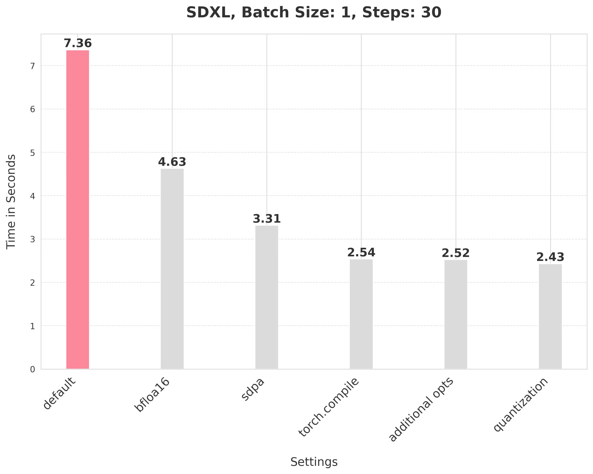

여기서는 full precision으로 pipeline을 실행했습니다. bfloat16 같은 낮은 precision을 사용하면 inference time을 즉시 줄일 수 있습니다. 또한 modern GPU에는 낮은 precision에서 빠른 계산을 수행할 수 있는 전용 core가 있습니다. bfloat16 precision으로 pipeline 계산을 실행하려면 pipeline 초기화 시 dtype만 지정하면 됩니다.

```python
from diffusers import StableDiffusionXLPipeline
import torch

# bfloat16 precision으로 pipeline load
pipe = StableDiffusionXLPipeline.from_pretrained(
	"stabilityai/stable-diffusion-xl-base-1.0", torch_dtype=torch.bfloat16
).to("cuda")

# default attention processor(non-optimized version)를 사용한다.
pipe.unet.set_default_attn_processor()
pipe.vae.set_default_attn_processor()

# generation prompt 정의
prompt = "Astronaut in a jungle, cold color palette, muted colors, detailed, 8k"
# 30 inference steps로 image 생성
image = pipe(prompt, num_inference_steps=30).images[0]
```

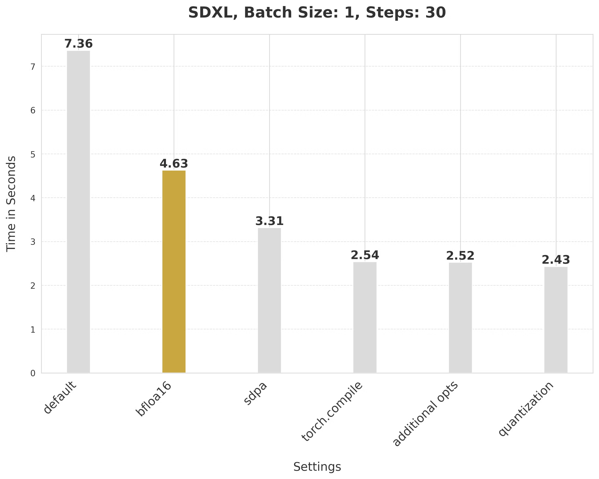

낮은 precision을 사용해 inference latency를 **7.36초**에서 **4.63초**로 줄일 수 있었습니다.

**bfloat16 사용에 관한 몇 가지 설명**

- float16, bfloat16 같은 낮은 numerical precision으로 inference를 수행해도 generation quality에 영향을 주지 않지만 latency는 크게 개선됩니다.
- float16과 비교했을 때 bfloat16 numerical precision의 장점은 hardware에 따라 달라집니다. modern GPU는 bfloat16을 지원하는 경향이 있습니다.
- 또한 실험에서 bfloat16이 float16보다 quantization과 함께 사용할 때 더 안정적이라는 것을 발견했습니다.

> (이후 float16에서도 실험했고, 최신 torchao version에서는 float16으로 인한 numerical issue가 생기지 않는다는 것을 확인했습니다.)

## SDPA로 attention 계산하기

기본적으로 Diffusers는 PyTorch 2를 사용할 때 `scaled_dot_product_attention`(SDPA)을 사용해 attention 관련 계산을 수행합니다. SDPA는 dense attention 관련 operation을 더 빠르고 효율적인 kernel로 실행합니다. SDPA로 pipeline을 실행하려면 attention processor를 아무것도 설정하지 않으면 됩니다.

```python
from diffusers import StableDiffusionXLPipeline
import torch

# bfloat16 precision으로 pipeline load
pipe = StableDiffusionXLPipeline.from_pretrained(
	"stabilityai/stable-diffusion-xl-base-1.0", torch_dtype=torch.bfloat16
).to("cuda")

# attention processor를 설정하지 않으면 기본적으로 SDPA를 사용한다.
# pipe.unet.set_default_attn_processor()  # SDPA를 사용하려면 이 줄을 주석 처리
# pipe.vae.set_default_attn_processor()   # SDPA를 사용하려면 이 줄을 주석 처리

# generation prompt 정의
prompt = "Astronaut in a jungle, cold color palette, muted colors, detailed, 8k"
# 30 inference steps로 image 생성
image = pipe(prompt, num_inference_steps=30).images[0]
```

SDPA는 좋은 개선을 가져와 **4.63초**에서 **3.31초**로 줄였습니다.

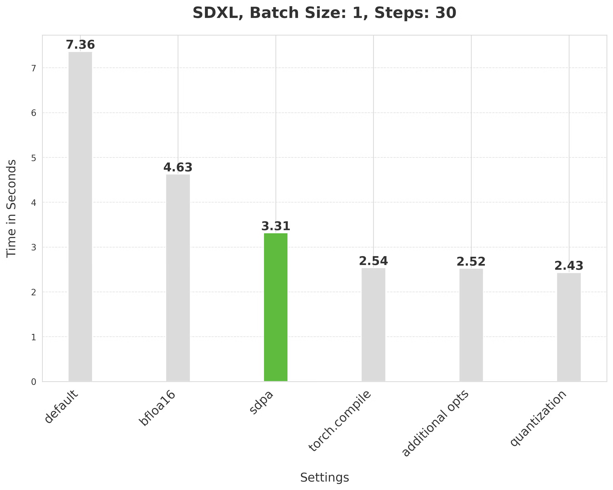

## UNet과 VAE compile

`torch.compile`을 사용해 PyTorch가 operator fusion이나 CUDA graphs를 통한 더 빠른 kernel launch 같은 low-level optimization을 수행하게 할 수 있습니다. `StableDiffusionXLPipeline`에서는 denoiser(UNet)와 VAE를 compile합니다.

```python
from diffusers import StableDiffusionXLPipeline
import torch

# bfloat16 precision으로 pipeline load
pipe = StableDiffusionXLPipeline.from_pretrained(
    "stabilityai/stable-diffusion-xl-base-1.0", torch_dtype=torch.bfloat16
).to("cuda")

# 최대 성능을 위해 UNet과 VAE를 compile한다.
# mode="max-autotune"은 CUDA graphs를 사용하고 latency에 맞춰 compile graph를 최적화한다.
# fullgraph=True는 graph break가 없게 해 torch.compile의 잠재력을 최대한 활용한다.
pipe.unet = torch.compile(pipe.unet, mode="max-autotune", fullgraph=True)
pipe.vae.decode = torch.compile(pipe.vae.decode, mode="max-autotune", fullgraph=True)

# generation prompt 정의
prompt = "Astronaut in a jungle, cold color palette, muted colors, detailed, 8k"

# 첫 번째 `pipe` 호출은 compile time 때문에 느리고, 이후 호출은 더 빠르다.
image = pipe(prompt, num_inference_steps=30).images[0]
```

SDPA attention을 사용하고 UNet과 VAE를 compile하면 latency가 **3.31초**에서 **2.54초**로 줄어듭니다.

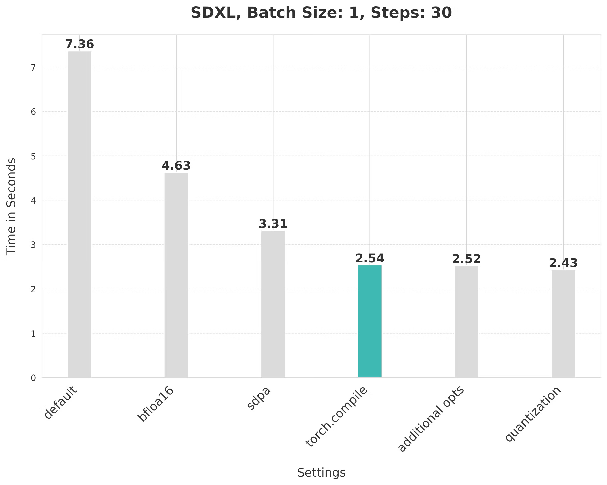

**`torch.compile`에 관한 설명**

`torch.compile`은 여러 backend와 mode를 제공합니다. 목표가 최대 inference speed이므로 우리는 inductor backend의 `"max-autotune"` mode를 선택합니다. `"max-autotune"`은 CUDA graphs를 사용하고 compile graph를 latency에 특화해 최적화합니다. CUDA graphs를 사용하면 GPU operation launch overhead가 크게 줄어듭니다. 이는 단일 CPU operation으로 여러 GPU operation을 launch하는 mechanism을 사용해 시간을 절약합니다.

`fullgraph`를 `True`로 지정하면 underlying model에 graph break가 없어 `torch.compile`이 최대 잠재력을 발휘하게 합니다. 우리의 경우 다음 compiler flag도 중요하며 명시적으로 설정해야 합니다.

```python
# 1x1 convolution을 matrix multiplication으로 처리
torch._inductor.config.conv_1x1_as_mm = True
# coordinate descent tuning 활성화
torch._inductor.config.coordinate_descent_tuning = True
# epilogue fusion 비활성화
torch._inductor.config.epilogue_fusion = False
# coordinate descent의 모든 방향 검사
torch._inductor.config.coordinate_descent_check_all_directions = True
```

compiler flag 전체 목록은 이 파일(https://github.com/pytorch/pytorch/blob/main/torch/_inductor/config.py)을 참고하세요.

compile 시 UNet과 VAE의 memory layout도 `"channels_last"`로 바꿔 최대 속도를 확보합니다.

```python
# 더 좋은 performance를 위해 channels_last memory format 사용
pipe.unet.to(memory_format=torch.channels_last)
pipe.vae.to(memory_format=torch.channels_last)
```

다음 절에서는 latency를 더 개선하는 방법을 보입니다.

## 추가 최적화 기술

### `torch.compile` 중 graph break 피하기

underlying model/method가 완전히 compile될 수 있게 하는 것은 성능에 중요합니다(`fullgraph=True`를 사용하는 `torch.compile`). 이는 graph break가 없어야 한다는 뜻입니다. 우리는 반환 변수에 접근하는 방식을 바꿔 UNet과 VAE에서 이를 달성했습니다. 다음 예를 보세요.

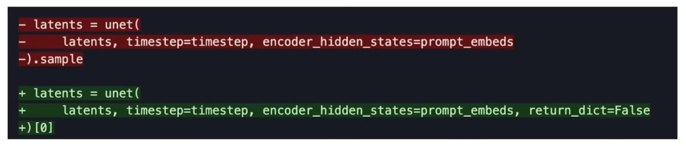

### compile 후 GPU synchronization 제거

반복적인 reverse diffusion 과정에서 denoiser가 더 적은 noise의 latent embedding을 예측할 때마다 scheduler의 `step()` method를 호출합니다(https://github.com/huggingface/diffusers/blob/1d686bac8146037e97f3fd8c56e4063230f71751/src/diffusers/pipelines/stable_diffusion_xl/pipeline_stable_diffusion_xl.py#L1228). `step()` 내부에서는 `sigmas` 변수가 indexing됩니다(https://github.com/huggingface/diffusers/blob/1d686bac8146037e97f3fd8c56e4063230f71751/src/diffusers/schedulers/scheduling_euler_discrete.py#L476). `sigmas` array가 GPU에 있으면 indexing이 CPU와 GPU 사이의 communication synchronization을 유발합니다. 이는 latency를 만들고, denoiser가 이미 compile되어 있을 때 더 두드러집니다.

하지만 `sigmas` array를 항상 CPU에 두면(이 줄 참고: https://github.com/huggingface/diffusers/blob/35a969d297cba69110d175ee79c59312b9f49e1e/src/diffusers/schedulers/scheduling_euler_discrete.py#L240) 이런 synchronization이 발생하지 않아 latency가 개선됩니다. 일반적으로 CPU <-> GPU communication synchronization은 없거나 최소로 유지해야 합니다. inference latency에 영향을 줄 수 있기 때문입니다.

### attention operation에 combined projection 사용

SDXL에서 사용하는 UNet과 VAE는 모두 Transformer와 비슷한 block을 사용합니다. Transformer block은 attention block과 feed-forward block으로 구성됩니다.

attention block에서 input은 세 개의 다른 projection matrix를 사용해 세 subspace, 즉 Q, K, V로 projection됩니다. naive implementation에서는 이 projection이 input에 대해 각각 수행됩니다. 하지만 projection matrix를 가로로 결합해 하나의 matrix로 만들고 한 번에 projection을 수행할 수 있습니다. 이는 input projection matrix multiplication의 크기를 키우고 quantization의 영향을 개선합니다(다음에서 논의).

Diffusers에서 이 계산을 활성화하는 데는 한 줄만 필요합니다.

```python
# 계산 효율을 위해 Q, K, V projection matrix를 fuse한다.
pipe.fuse_qkv_projections()
```

이렇게 하면 UNet과 VAE의 attention operation이 모두 combined projection을 사용합니다. Cross attention layer에서는 key와 value matrix만 결합합니다. 자세한 내용은 공식 문서(https://huggingface.co/docs/diffusers/main/en/api/pipelines/stable_diffusion/stable_diffusion_xl#diffusers.StableDiffusionXLPipeline.fuse_qkv_projections)를 참고하세요. 내부적으로는 PyTorch의 `scaled_dot_product_attention`을 사용합니다(https://github.com/huggingface/diffusers/blob/35a969d297cba69110d175ee79c59312b9f49e1e/src/diffusers/models/attention_processor.py#L1356).

이 추가 기술은 inference latency를 **2.54초**에서 **2.52초**로 개선합니다.

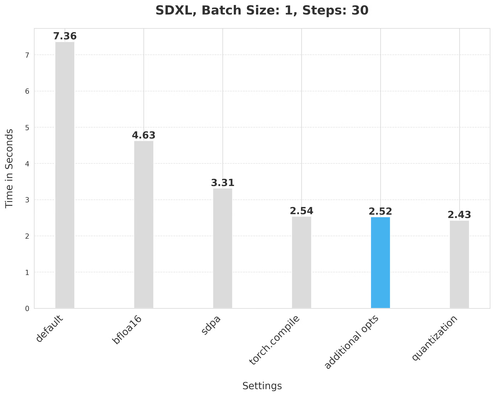

## Dynamic int8 quantization

UNet과 VAE에 선택적으로 dynamic int8 quantization(https://docs.pytorch.org/tutorials/recipes/recipes/dynamic_quantization.html)을 적용합니다. quantization은 model에 추가 conversion overhead를 더하므로, 더 빠른 matrix multiplication(dynamic quantization)으로 이를 보상하기를 기대하기 때문입니다. matrix multiplication이 너무 작으면 이 기술은 성능을 떨어뜨릴 수 있습니다.

실험을 통해 UNet과 VAE의 일부 linear layer는 dynamic int8 quantization에서 이점을 얻지 못한다는 것을 발견했습니다. 이런 layer를 filter하는 전체 코드는 여기(https://github.com/huggingface/diffusion-fast/blob/0f169640b1db106fe6a479f78c1ed3bfaeba3386/utils/pipeline_utils.py#L16)에서 볼 수 있습니다(아래에서는 `dynamic_quant_filter_fn`이라고 부름).

우리는 초경량 순수 PyTorch library인 torchao(https://github.com/pytorch/ao)를 사용해 user-friendly quantization API를 활용합니다.

```python
from torchao.quantization import apply_dynamic_quant

# 적합한 layer를 선택하는 filter function을 사용해 UNet에 dynamic quantization 적용
apply_dynamic_quant(pipe.unet, dynamic_quant_filter_fn)
# 적합한 layer를 선택하는 filter function을 사용해 VAE에 dynamic quantization 적용
apply_dynamic_quant(pipe.vae, dynamic_quant_filter_fn)
```

이 quantization support가 linear layer로 제한되므로, 이점을 극대화하기 위해 적절한 pointwise convolution layer를 linear layer로 변환합니다. 이 option을 사용할 때는 다음 compiler flag도 지정합니다.

```python
# int8 matrix multiplication과 multiply operation을 강제로 fuse
torch._inductor.config.force_fuse_int_mm_with_mul = True
# mixed precision matrix multiplication 사용
torch._inductor.config.use_mixed_mm = True
```

quantization으로 인한 numerical issue를 방지하기 위해 모든 것을 bfloat16 format으로 실행합니다.

이 방식으로 quantization을 적용하면 latency가 **2.52초**에서 **2.43초**로 개선됩니다.

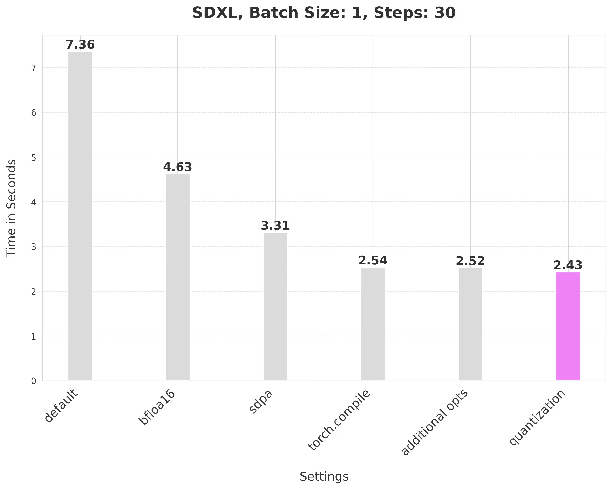

## Resources

아래 repository를 확인해 이 수치를 재현하고 기술을 다른 text-to-image diffusion system으로 확장해 보길 권합니다.

- diffusion-fast(위 숫자와 chart를 재현하는 모든 code를 제공하는 repository) https://github.com/huggingface/diffusion-fast
- torchao library(https://github.com/pytorch/ao)
- Diffusers library(https://github.com/huggingface/diffusers)
- PEFT library(https://github.com/huggingface/peft)

**Other links**

- SDXL: Improving Latent Diffusion Models for High-Resolution Image Synthesis(https://huggingface.co/papers/2307.01952)
- Fast diffusion documentation(https://huggingface.co/docs/diffusers/main/en/tutorials/fast_diffusion)

## 다른 pipeline의 개선

우리는 이 기술들을 다른 pipeline에도 적용해 방법의 generality를 테스트했습니다. 발견한 내용은 다음과 같습니다.

- SSD-1B(https://huggingface.co/segmind/SSD-1B)

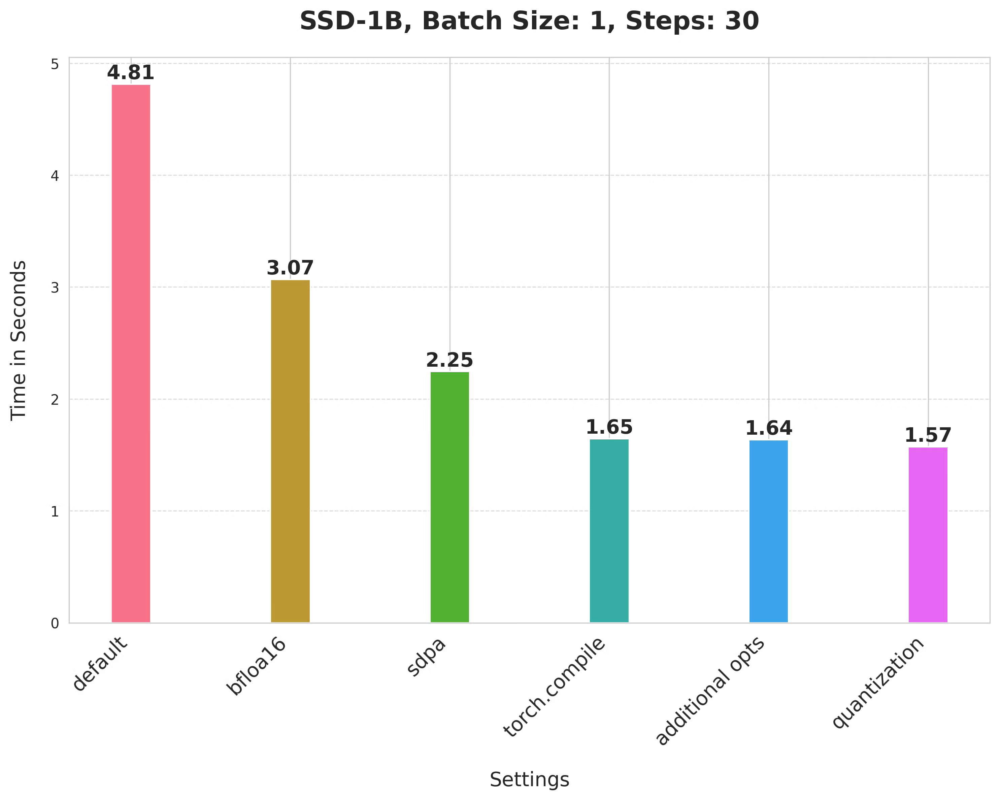

- Stable Diffusion v1-5

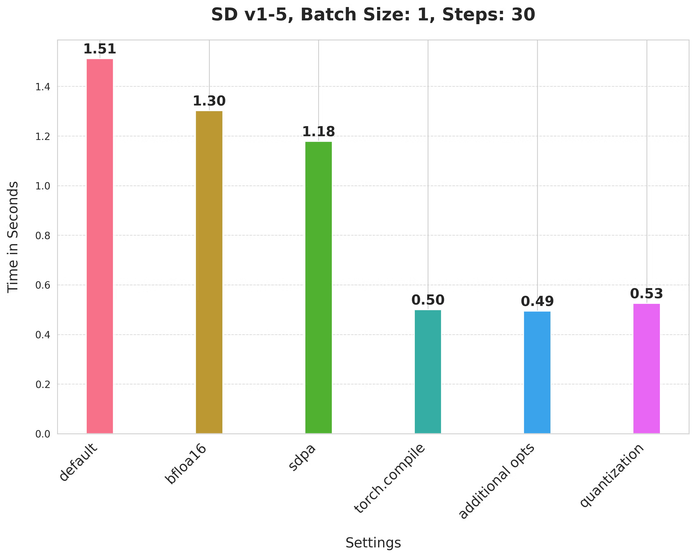

- PixArt-alpha/PixArt-XL-2-1024-MS(https://huggingface.co/PixArt-alpha/PixArt-XL-2-1024-MS)

주목할 점은 PixArt-Alpha가 reverse diffusion process의 denoiser로 UNet이 아니라 Transformer 기반 architecture를 사용한다는 것입니다.

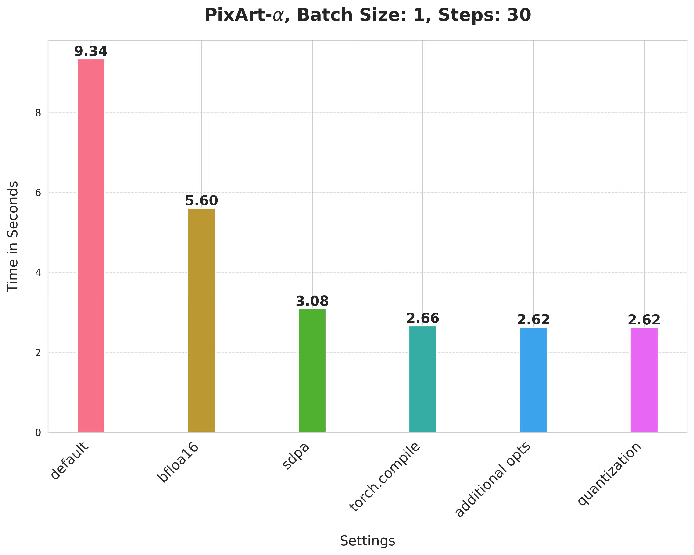

Stable Diffusion v1-5와 PixArt-Alpha에 대해서는 dynamic int8 quantization을 적용할 최적 shape combination criterion을 탐색하지 않았다는 점에 유의하세요. 더 나은 combination을 찾으면 더 좋은 숫자를 얻을 수 있을 것입니다.

전반적으로 우리가 제안한 방법은 generation quality를 낮추지 않으면서 baseline 대비 상당한 speedup을 제공합니다. 또한 이 방법들은 DeepCache(https://github.com/horseee/DeepCache), Stable Fast(https://github.com/chengzeyi/stable-fast) 등 community에서 인기 있는 다른 optimization과 상호 보완적일 것이라고 믿습니다.

## 결론과 다음 단계

이 글에서는 pure PyTorch에서 text-to-image Diffusion model의 inference latency를 개선하는 데 도움이 되는 간단하고 효과적인 기술들을 소개했습니다. 요약하면 다음과 같습니다.

- 낮은 precision으로 계산 수행
- Scaled-dot product attention으로 attention block을 효율적으로 실행
- `"max-autotune"` `torch.compile`로 latency 개선
- 서로 다른 projection을 결합해 attention 계산
- dynamic int8 quantization

text-to-image diffusion system에 quantization을 어떻게 적용할지에는 여전히 탐색할 부분이 많다고 믿습니다. 우리는 UNet과 VAE의 어떤 layer가 dynamic quantization에서 이점을 얻는지 완전히 탐색하지 않았습니다. quantization에 더 좋은 layer combination을 찾으면 추가 가속 기회가 있을 수 있습니다.

bfloat16으로 실행한 것 외에는 SDXL의 text encoder를 그대로 두었습니다. 이들을 최적화해도 latency 개선이 가능할 수 있습니다.

## 감사의 말

benchmark 전반에서 Ollin Boer Bohan(https://madebyoll.in/)의 VAE(https://huggingface.co/madebyollin/sdxl-vae-fp16-fix)를 사용했습니다. 낮은 numerical precision에서 더 안정적이기 때문입니다. 이에 감사드립니다.

infrastructure 도움을 준 Hugging Face의 Hugo Larcher에게도 감사합니다.
