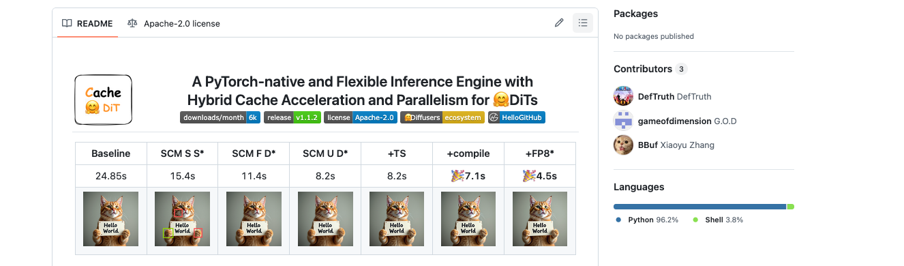
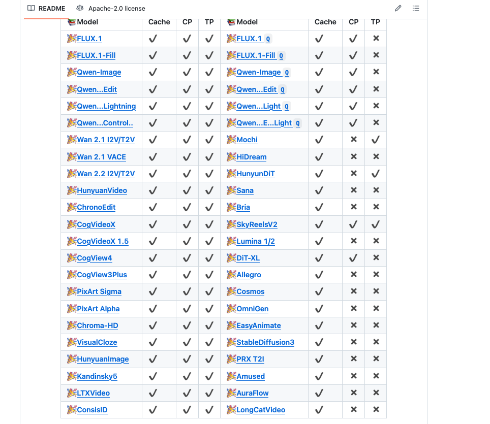
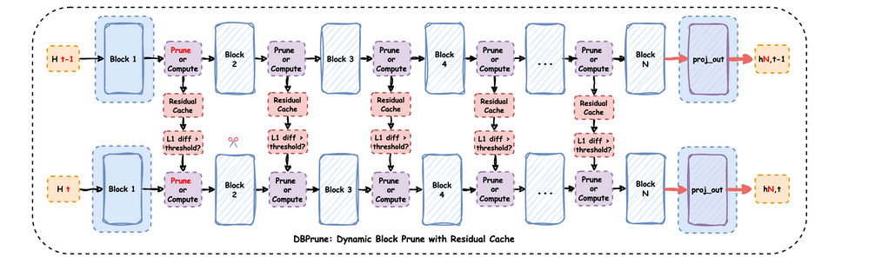
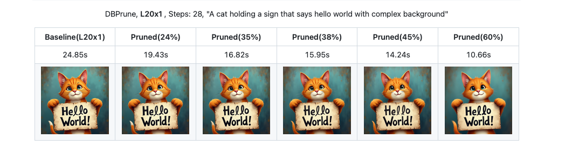
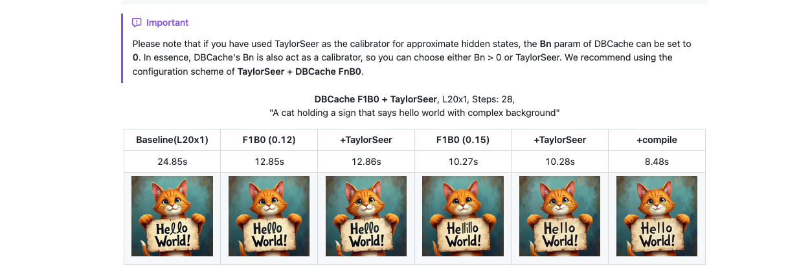
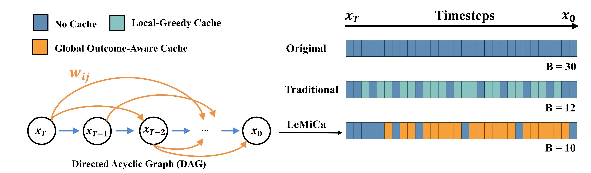
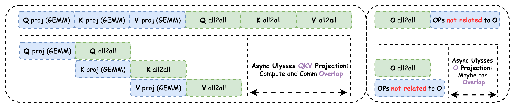

> 원본 markdown은 다음을 참고하라. https://github.com/BBuf/how-to-optim-algorithm-in-cuda/blob/master/large-language-model-note/Cache-Dit%20%E5%AD%A6%E4%B9%A0%E7%AC%94%E8%AE%B0.md

## 서문

최근 DiT(Diffusion Transformer) inference optimization을 연구하다가 Cache-Dit 프로젝트를 접했고, 지금도 이 프로젝트 구축에 참여하고 있다. 꽤 흥미롭지만 아직 인지도가 그렇게 크지는 않은 작업이라고 느껴져, 여기서 학습 노트 하나를 작성해 홍보도 겸하려 한다. Cache-Dit은 Vipshop이 open source로 공개한 PyTorch native DiT inference acceleration engine(https://github.com/vipshop/cache-dit)이다. hybrid cache acceleration과 parallelization technique으로 DiT model inference를 가속한다. 이 프로젝트에서 가장 매력적인 점은 여러 cache algorithm을 구현했을 뿐 아니라 Context Parallelism과 Tensor Parallelism도 지원하고, torch.compile 및 quantization method와의 integration도 해냈다는 점이다. 가장 중요한 것은 새 model 지원이 비교적 빠르다는 점이다.



관심 있는 분들은 star를 누르거나 contribution을 해주면 좋겠다.

이 노트는 Cache-Dit의 핵심 기술 포인트를 자세히 기록한다. cache strategy, parallelization scheme, 여러 optimization option의 사용법을 포함한다. FLUX.1-dev와 Wan 2.2라는 두 typical model을 예로 들어 실제 application에서 Cache-Dit의 optimization effect를 설명한다. 또한 Cache-Dit이 최근 구현한 Ulysses Anything Attention feature와 communication/computation overlap optimization인 Async Ulysses QKV Projection도 중점적으로 소개한다.

repository author는 Zhihu에 cache 관련 및 model support 관련 technical detail 글을 많이 올렸다. 관심 있는 분들은 볼 수 있다. https://www.zhihu.com/people/qyjdef/posts

model support list



## Cache-Dit의 핵심 design philosophy

Cache-Dit의 design philosophy는 몇 가지 keyword로 요약할 수 있다. PyTorch native, flexible, easy-to-use다. 독립 inference framework가 아니라 기존 Diffusers Pipeline에 seamless하게 integrate할 수 있는 acceleration library다. 이런 design 덕분에 torch.compile, quantization, CPU offload 등 다른 optimization method와 쉽게 조합해 사용할 수 있다.

Cache-Dit은 거의 모든 Transformer 기반 DiT model을 지원한다. FLUX.1, Qwen-Image, Wan series, HunyuanVideo, CogVideoX 등 30개가 넘는 model series와 거의 100개 pipeline을 포함한다. Forward Pattern Matching mechanism으로 서로 다른 model의 Transformer Block structure를 자동 식별한 뒤, 대응하는 cache strategy를 적용한다.

### unified Cache API design

Cache-Dit의 가장 큰 특징은 unified API interface를 제공한다는 점이다. 대부분의 경우 한 줄 code만으로 cache acceleration을 enable할 수 있다.

```python
import cache_dit
from diffusers import DiffusionPipeline

pipe = DiffusionPipeline.from_pretrained("Qwen/Qwen-Image")
cache_dit.enable_cache(pipe)  # 한 줄 code로 cache enable
output = pipe(...)
stats = cache_dit.summary(pipe)  # cache statistics 확인
cache_dit.disable_cache(pipe)  # cache disable
```

이 design은 사용자가 기존 code에 Cache-Dit을 매우 편리하게 integrate할 수 있게 하며, 많은 code 수정이 필요하지 않다. 예를 들면 다음과 같다. https://zhuanlan.zhihu.com/p/1950849526400263083

### Forward Pattern Matching

Cache-Dit은 Forward Pattern Matching mechanism으로 서로 다른 model의 Transformer Block structure를 식별한다. 현재 6가지 Forward Pattern을 지원하며, 각 pattern은 block forward의 input/output signature를 정의한다.

Pattern_0: dual input dual output, hidden_states가 먼저 반환됨
- input: `(hidden_states, encoder_hidden_states)`
- output: `(hidden_states, encoder_hidden_states)`
- typical model: 초기 일부 DiT model

Pattern_1: dual input dual output, encoder_hidden_states가 먼저 반환됨
- input: `(hidden_states, encoder_hidden_states)`
- output: `(encoder_hidden_states, hidden_states)`
- typical model: FLUX.1의 transformer_blocks(diffusers<0.35.0 version)

Pattern_2: dual input single output, hidden_states만 반환
- input: `(hidden_states, encoder_hidden_states)`
- output: `(hidden_states,)`
- typical model: Wan 2.1/2.2, CogVideoX, HunyuanVideo, Qwen-Image, LTXVideo, CogView3Plus/4, SkyReelsV2, Kandinsky5

Pattern_3: single input single output, hidden_states만 있음
- input: `(hidden_states,)`
- output: `(hidden_states,)`
- typical model: FLUX.1의 single_transformer_blocks, Mochi, PixArt, SD3, DiT-XL, Chroma, HiDream, Allegro, Sana, Lumina, OmniGen, AuraFlow

...

이 pattern을 식별함으로써 Cache-Dit은 어떤 tensor를 cache해야 하고 어떤 tensor를 recompute해야 하는지 자동으로 결정할 수 있다. Pattern 식별은 block의 forward method signature를 검사해 구현하며, parameter name과 return value 수를 포함한다.

### Block Adapter mechanism

특수한 model이나 custom Transformer를 위해 Cache-Dit은 Block Adapter mechanism을 제공한다. Block Adapter를 통해 사용자는 transformer, blocks, forward_pattern 등의 정보를 수동으로 지정해 Cache-Dit이 cache strategy를 올바르게 적용할 수 있게 한다.

#### BlockAdapter의 핵심 parameter

BlockAdapter는 dataclass이며 다음 core parameter를 포함한다.

Transformer configuration 관련:
- `pipe`: DiffusionPipeline instance, Transformer-only scenario에서는 None일 수 있다.
- `transformer`: single transformer 또는 transformer list, Wan 2.2 같은 multi-transformer model을 지원한다.
- `blocks`: torch.nn.ModuleList 또는 그 list, cache를 적용할 transformer blocks를 지정한다.
- `blocks_name`: transformer 안에서 blocks의 property name, 예를 들어 "transformer_blocks", "blocks" 등이다.
- `unique_blocks_name`: internal use를 위한 unique identifier, 자동 생성된다.
- `dummy_blocks_names`: skip해야 하는 blocks name list다.

Forward Pattern configuration:
- `forward_pattern`: ForwardPattern enum 또는 그 list, blocks의 forward pattern을 지정한다.
- `check_forward_pattern`: forward pattern matching을 check할지 여부, 기본적으로 diffusers model에 대해 enable된다.
- `check_num_outputs`: output count를 check할지 여부, 더 엄격한 pattern validation에 사용한다.

parameter modifier:
- `params_modifiers`: ParamsModifier 또는 그 list, 서로 다른 blocks에 서로 다른 cache parameter를 설정하는 데 사용한다.

Pipeline level configuration:
- `patch_functor`: PatchFunctor instance, transformer의 forward method를 수정하는 데 사용한다.
- `has_separate_cfg`: independent CFG forward가 있는지 여부, Wan 2.1, Qwen-Image 등이 그렇다.

automatic Block Adapter configuration:
- `auto`: automatic block adapter를 enable할지 여부, 적절한 blocks를 자동으로 찾는다.
- `allow_prefixes`: 허용되는 blocks property name prefix, 기본적으로 "transformer", "blocks", "layers" 등을 포함한다.
- `check_prefixes`: prefix를 check할지 여부다.
- `allow_suffixes`: 허용되는 block class name suffix, 예를 들어 "TransformerBlock"이다.
- `check_suffixes`: suffix를 check할지 여부다.
- `blocks_policy`: 여러 candidate blocks가 있을 때의 selection strategy, "max"는 block 수가 가장 많은 것을 선택하고 "min"은 가장 적은 것을 선택한다.

기타 configuration:
- `skip_post_init`: post_init을 skip할지 여부, special scenario에 사용한다.

예를 들어 FLUX.1처럼 여러 transformer blocks가 있는 model의 경우:

```python
from cache_dit import ForwardPattern, BlockAdapter

cache_dit.enable_cache(
    BlockAdapter(
        pipe=pipe,
        transformer=pipe.transformer,
        blocks=[
            pipe.transformer.transformer_blocks,
            pipe.transformer.single_transformer_blocks,
        ],
        forward_pattern=[
            ForwardPattern.Pattern_1,
            ForwardPattern.Pattern_3,
        ],
    ),
)
```

Wan 2.2처럼 여러 Transformer가 있는 MoE model의 경우:

```python
cache_dit.enable_cache(
    BlockAdapter(
        pipe=pipe,
        transformer=[
            pipe.transformer,
            pipe.transformer_2,
        ],
        blocks=[
            pipe.transformer.blocks,
            pipe.transformer_2.blocks,
        ],
        forward_pattern=[
            ForwardPattern.Pattern_2,
            ForwardPattern.Pattern_2,
        ],
        params_modifiers=[
            ParamsModifier(
                cache_config=DBCacheConfig().reset(
                    max_warmup_steps=4,
                    max_cached_steps=8,
                ),
            ),
            ParamsModifier(
                cache_config=DBCacheConfig().reset(
                    max_warmup_steps=2,
                    max_cached_steps=20,
                ),
            ),
        ],
        has_separate_cfg=True,
    ),
)
```

이 flexible design 덕분에 Cache-Dit은 여러 복잡한 model structure를 지원할 수 있다.

#### automatic Block Adapter

model의 blocks structure가 확실하지 않을 때는 automatic Block Adapter를 사용할 수 있다.

```python
from cache_dit import ForwardPattern, BlockAdapter

cache_dit.enable_cache(
    BlockAdapter(
        pipe=pipe,
        auto=True,  # automatic mode enable
        forward_pattern=ForwardPattern.Pattern_2,
        allow_prefixes=["transformer", "blocks"],  # optional, custom search prefix
        blocks_policy="max",  # blocks count가 가장 많은 것을 선택
    ),
)
```

automatic mode는 transformer의 모든 property를 순회하며 조건에 맞는 ModuleList를 찾고, forward pattern이 match되는지 validate한다.

#### LoRA model support

Cache-Dit은 LoRA를 사용하는 model을 완전히 지원한다. LoRA 사용 시 두 가지 방식이 있다.

방식 1: LoRA를 직접 사용한다. inference에 권장된다.
```python
from diffusers import FluxPipeline
import cache_dit

pipe = FluxPipeline.from_pretrained(
    "black-forest-labs/FLUX.1-dev",
    torch_dtype=torch.bfloat16,
).to("cuda")

# LoRA load
pipe.load_lora_weights("path/to/lora")

# cache enable
cache_dit.enable_cache(pipe)

# normal inference
image = pipe(prompt, ...).images[0]
```

방식 2: Fuse LoRA. benchmark에 권장된다.
```python
# LoRA load
pipe.load_lora_weights("path/to/lora")

# Fuse LoRA into base model
pipe.fuse_lora()
pipe.unload_lora_weights()

# cache enable
cache_dit.enable_cache(pipe)
```

Fuse LoRA는 LoRA weight를 base model에 merge한다. 이렇게 하면 inference 시 additional computation overhead를 피할 수 있다. 여러 번 inference해야 하는 scenario에서는 fuse_lora가 더 좋은 선택이다.

Cache-Dit의 Patch Functor는 LoRA 관련 `scale_lora_layers`와 `unscale_lora_layers` call을 자동으로 처리해 cache mechanism이 LoRA와 compatible하도록 보장한다. LoRA를 지원하는 model에는 FLUX.1, Qwen-Image, HiDream, Chroma, Wan VACE, HunyuanVideo 등이 포함된다.

## DBCache: Dual Block Cache

DBCache는 Cache-Dit의 core cache algorithm이며, full name은 Dual Block Cache다. 핵심 idea는 두 group의 compute blocks(Fn과 Bn)로 performance와 accuracy의 balance를 맞추는 것이다.

### DBCache의 design principle

DBCache의 design은 한 가지 observation에 기반한다. Diffusion model inference 과정에서 인접 time step의 hidden states 변화는 gradual하다. residual diff(L1 distance)가 어떤 threshold보다 작으면 전체 block을 recompute하지 않고 cached residual을 직접 사용할 수 있다.

DBCache는 두 key parameter를 도입한다.

- **Fn (First n blocks)**: 앞 n개 Transformer blocks가 항상 full computation을 수행하도록 지정한다. 이 blocks는 현재 time step 정보를 fitting하고 더 stable한 L1 diff를 계산하며, subsequent blocks에 더 accurate한 정보를 제공하는 데 사용된다.

- **Bn (Back n blocks)**: 뒤 n개 Transformer blocks도 full computation을 수행하도록 지정한다. 이 blocks는 auto-scaler 역할을 하며, residual cache를 사용한 approximate hidden states의 prediction accuracy를 강화한다.

중간 blocks는 `residual_diff_threshold`에 따라 cache 사용 여부를 결정한다.

### DBCache configuration option

```python
from cache_dit import DBCacheConfig

cache_dit.enable_cache(
    pipe,
    cache_config=DBCacheConfig(
        max_warmup_steps=8,  # 앞 8 step은 cache를 사용하지 않고 warm up에 사용
        max_cached_steps=-1,  # -1은 unlimited를 의미
        Fn_compute_blocks=8,  # F8, 앞 8 blocks는 항상 compute
        Bn_compute_blocks=0,  # B0, 뒤 0 blocks, 즉 Bn을 사용하지 않음
        residual_diff_threshold=0.12,  # residual diff threshold
    ),
)
```

서로 다른 FnBn configuration은 서로 다른 performance/accuracy trade-off를 가져온다. repository의 benchmark data(https://github.com/vipshop/cache-dit/tree/main/bench)에 따르면 FLUX.1-dev에서 다음과 같다.

- F8B0_W4MC0_R0.08: 1.80x acceleration, Clip Score: 32.99, ImageReward: 1.04
- F8B0_W4MC2_R0.12: 1.93x acceleration, Clip Score: 32.95, ImageReward: 1.02
- F4B0_W4MC3_R0.12: 2.47x acceleration, Clip Score: 32.90, ImageReward: 1.01
- F4B0_W4MC4_R0.12: 2.66x acceleration, Clip Score: 32.84, ImageReward: 1.01

Fn이 작을수록, `max_continuous_cached_steps(MC)`가 클수록 acceleration effect는 더 좋지만 accuracy는 약간 떨어진다.

### residual_diff_threshold 선택

`residual_diff_threshold`는 DBCache에서 가장 중요한 hyperparameter다. 언제 cache를 사용하고 언제 recompute할지 결정한다.

일반적으로:
- threshold가 작을수록 cache 사용 frequency가 낮고, accuracy는 높지만 speed는 느리다.
- threshold가 클수록 cache 사용 frequency가 높고, speed는 빠르지만 accuracy가 떨어질 수 있다.

서로 다른 model과 서로 다른 blocks에서 optimal threshold는 다를 수 있다. Cache-Dit은 `cache_dit.summary(pipe, details=True)`를 제공해 각 cached step의 residual diff statistics를 확인하게 하며, 사용자가 적절한 threshold를 선택하는 데 도움을 준다.

FLUX.1의 `single_transformer_blocks`의 경우 앞의 `transformer_blocks`에서 error accumulation이 있으므로 보통 더 높은 threshold, 예를 들어 0.16이 필요하고, `transformer_blocks`는 더 낮은 threshold, 예를 들어 0.08을 사용할 수 있다.

## DBPrune: Dynamic Block Prune

DBCache 외에도 Cache-Dit은 DBPrune(Dynamic Block Prune) algorithm을 구현했다. DBPrune과 DBCache의 idea는 비슷하지만, residual을 cache하는 것이 아니라 특정 blocks의 computation을 직접 skip(prune)한다.



```python
from cache_dit import DBPruneConfig

cache_dit.enable_cache(
    pipe,
    cache_config=DBPruneConfig(
        max_warmup_steps=8,
        Fn_compute_blocks=8,
        Bn_compute_blocks=8,
        residual_diff_threshold=0.12,
        enable_dynamic_prune_threshold=True,
        non_prune_block_ids=list(range(16, 24)),  # prune하지 않을 blocks 지정
    ),
)
```

DBPrune은 더 aggressive한 acceleration을 구현할 수 있지만 parameter를 더 주의 깊게 조정해야 한다. repository의 User Guide에 따르면 FLUX.1에서 L20 GPU를 사용할 때 DBPrune은 서로 다른 비율의 blocks를 prune하여 서로 다른 수준의 acceleration을 구현할 수 있다. 자세한 내용은 https://github.com/vipshop/cache-dit/blob/main/docs/User_Guide.md#dbprune 를 참고하라.



## Hybrid Cache CFG

Cache-Dit은 CFG(Classifier-Free Guidance)에 대한 hybrid cache를 지원한다. 서로 다른 DiT model은 CFG 처리 방식이 다르다.

### 두 가지 CFG mode

1. Separate CFG: CFG와 non-CFG가 분리된 두 번의 forward다.
   - typical model: Wan 2.1/2.2, Qwen-Image, CogView4, Cosmos, SkyReelsV2 등
   - `enable_separate_cfg=True` 설정이 필요하다.

2. Fused CFG: CFG와 non-CFG가 한 번의 forward에 fused되어 있다.
   - typical model: FLUX.1, HunyuanVideo, CogVideoX, Mochi, LTXVideo, Allegro, CogView3Plus, SD3 등
   - `enable_separate_cfg=False`(default) 설정이 필요하다.

### configuration parameter

```python
from cache_dit import DBCacheConfig

cache_dit.enable_cache(
    pipe_or_adapter, 
    cache_config=DBCacheConfig(
        Fn_compute_blocks=8,
        Bn_compute_blocks=0,
        residual_diff_threshold=0.12,
        # CFG 관련 configuration
        enable_separate_cfg=True,  # Wan 2.1, Qwen-Image 등은 True 필요
        cfg_compute_first=False,   # False는 0,2,4,...가 non-CFG; 1,3,5,...가 CFG임을 의미
        cfg_diff_compute_separate=True,  # CFG와 non-CFG에 대해 diff를 따로 계산할지 여부
    ),
)
```

### parameter explanation

- `enable_separate_cfg`: separate CFG mode를 enable할지 여부
  - `True`: Wan, Qwen-Image 등 model에 적용한다. CFG와 non-CFG는 두 번의 independent forward다.
  - `False` 또는 `None`: FLUX, HunyuanVideo 등 model에 적용한다. CFG는 single forward 안에 fused되어 있다.
  
- `cfg_compute_first`: CFG forward의 execution order
  - `False`(default): transformer step 0,2,4,...는 non-CFG step이고, 1,3,5,...는 CFG step이다.
  - `True`: transformer step 0,2,4,...는 CFG step이고, 1,3,5,...는 non-CFG step이다.

- `cfg_diff_compute_separate`: CFG와 non-CFG에 대해 residual diff를 따로 계산할지 여부
  - `True`(default): CFG와 non-CFG가 각각 independent residual diff statistics를 유지한다.
  - `False`: CFG step이 non-CFG step에서 계산한 diff 값을 reuse한다.

### implementation principle

source code에서 Cache-Dit은 `enable_separate_cfg`에 따라 step counting logic을 자동 조정한다.

```python
# cache_context.py에서 가져옴
if not self.cache_config.enable_separate_cfg:
    self.executed_steps += 1  # 각 transformer forward를 한 step으로 계산
else:
    # Separate CFG mode: 두 번의 transformer forward가 한 step
    if not self.cache_config.cfg_compute_first:
        if not self.is_separate_cfg_step():
            # non-CFG step에서만 executed_steps 증가
            self.executed_steps += 1
```

이 design 덕분에 Cache-Dit은 서로 다른 model의 CFG implementation을 올바르게 처리할 수 있고, cache strategy가 여러 상황에서 정상 동작하도록 보장한다.

## TaylorSeer Calibrator

TaylorSeer는 Taylor expansion 기반 feature prediction algorithm이다. Cache-Dit은 TaylorSeer를 Calibrator로 integrate하여 cached steps가 많을 때 DBCache의 accuracy를 높이는 데 사용한다.

TaylorSeer의 core idea는 Taylor series expansion을 사용해 future time step의 feature를 prediction하는 것이다.

$$\mathcal{F}_{\text{pred}, m}(x_{t-k}^l) = \mathcal{F}(x_t^l) + \sum_{i=1}^m \frac{\Delta^i \mathcal{F}(x_t^l)}{i! \cdot N^i}(-k)^i$$

Cache-Dit에서 TaylorSeer는 hidden states 또는 residual cache를 prediction하는 데 사용할 수 있다.

```python
from cache_dit import DBCacheConfig, TaylorSeerCalibratorConfig

cache_dit.enable_cache(
    pipe_or_adapter,
    # Basic DBCache w/ FnBn configurations
    cache_config=DBCacheConfig(
        max_warmup_steps=8,  # steps do not cache
        max_cached_steps=-1, # -1 means no limit
        Fn_compute_blocks=8, # Fn, F8, etc.
        Bn_compute_blocks=8, # Bn, B8, etc.
        residual_diff_threshold=0.12,
    ),
    # Then, you can use the TaylorSeer Calibrator to approximate 
    # the values in cached steps, taylorseer_order default is 1.
    calibrator_config=TaylorSeerCalibratorConfig(
        taylorseer_order=1,
    ),
)
```

더 자세한 detail은 DefTruth author의 이 blog를 직접 보면 된다. https://zhuanlan.zhihu.com/p/1937477466475197176



## SCM: Steps Computation Masking

SCM(Steps Computation Masking)은 LeMiCa와 EasyCache에서 영감을 받은 optimization strategy다. 핵심 observation은 early caching이 downstream error를 amplify하고, later caching의 영향은 작다는 것이다. 따라서 non-uniform cached steps distribution을 사용해야 한다.



```python
from cache_dit import DBCacheConfig, TaylorSeerCalibratorConfig

# Scheme: Hybrid DBCache + LeMiCa/EasyCache + TaylorSeer
cache_dit.enable_cache(
    pipe_or_adapter,
    cache_config=DBCacheConfig(
        # Basic DBCache configs
        Fn_compute_blocks=8,
        Bn_compute_blocks=0,
        # keep is the same as first compute bin
        max_warmup_steps=6,  
        residual_diff_threshold=0.12,
        # LeMiCa or EasyCache style Mask for 28 steps, e.g, 
        # SCM=111111010010000010000100001, 1: compute, 0: cache.
        steps_computation_mask=cache_dit.steps_mask(
            compute_bins=[6, 1, 1, 1, 1], # 10
            cache_bins=[1, 2, 5, 5, 5], # 18
        ),
        # The policy for cache steps can be 'dynamic' or 'static'
        steps_computation_policy="dynamic",
    ),
    calibrator_config=TaylorSeerCalibratorConfig(
        taylorseer_order=1,
    ),
)
```

`steps_computation_mask`는 길이가 `num_inference_steps`인 list이며, 1은 반드시 compute, 0은 cache 사용을 의미한다. `cache_dit.steps_mask()`로 이 mask를 편리하게 생성할 수 있다.


## quantization support

Cache-Dit은 torchao를 quantization backend로 integrate했고, 다양한 quantization scheme을 지원한다.

### supported quantization type

Weight-Only quantization(torch.compile에 의존하지 않음):
- `float8_weight_only` (fp8_w8a16_wo): FP8 weight, FP16 activation
- `int8_weight_only` (int8_w8a16_wo): INT8 weight, FP16 activation
- `int4_weight_only` (int4_w4a16_wo): INT4 weight, FP16 activation

Dynamic Quantization(torch.compile에 의존):
- `float8` (fp8_w8a8_dq): FP8 weight 및 dynamic FP8 activation
- `int8` (int8_w8a8_dq): INT8 weight 및 dynamic INT8 activation
- `int4` (int4_w4a8_dq): INT4 weight 및 dynamic INT8 activation
- `int4_w4a4` (int4_w4a4_dq): INT4 weight 및 dynamic INT4 activation

### quantization과 torch.compile의 관계

Weight-Only quantization은 model load 시 수행되는 static quantization이다. weight를 low-precision format으로 변환하지만 activation은 original precision을 유지한다. 이런 quantization은 torch.compile이 필요 없고 바로 사용할 수 있다.

```python
import cache_dit

# Weight-only quantization, compile 필요 없음
cache_dit.quantize(
    pipe.transformer,
    quant_type="float8_weight_only",
)

# 바로 inference 가능
image = pipe(prompt, ...).images[0]
```

Dynamic Quantization은 forward 과정에서 activation value를 dynamic하게 quantize해야 한다. 이는 torch.compile로 efficient fused kernel을 생성해야 한다. compile을 사용하지 않으면 dynamic quantization은 매우 느리다.

```python
import cache_dit

# Dynamic quantization, 반드시 compile과 함께 사용해야 함
cache_dit.quantize(
    pipe.transformer,
    quant_type="float8",  # dynamic quantization
)

# torch.compile을 반드시 사용
cache_dit.set_compile_configs()
pipe.transformer = torch.compile(pipe.transformer)

# 이제 efficient inference 가능
image = pipe(prompt, ...).images[0]
```

### quantization configuration option

```python
cache_dit.quantize(
    pipe.transformer,
    quant_type="float8_weight_only",
    exclude_layers=["embedder", "embed"],  # embedding layer skip
    per_row=True,  # fp8_w8a8_dq의 경우 per-row quantization 사용
)
```

- `exclude_layers`: quantize하지 않을 layer 지정. 기본적으로 accuracy 유지를 위해 embedding layer를 skip한다.
- `per_row`: FP8 dynamic quantization에서 per-row quantization을 사용할지 여부. bfloat16이 필요하다.

### Weight-Only quantization computation flow

Weight-Only quantization은 torchao의 `Float8WeightOnlyConfig` 같은 configuration을 사용해 model load 시 Linear layer의 weight를 low-precision format으로 변환한다. `float8_weight_only`를 예로 들면 다음과 같다.

```python
# torchao internal implementation pseudocode
class Float8WeightOnlyLinear(nn.Module):
    def __init__(self, in_features, out_features, weight_fp8, scale):
        self.weight_fp8 = weight_fp8  # FP8 format weight
        self.scale = scale            # quantization scale
    
    def forward(self, x):
        # x is FP16/BF16 activation
        # 1. dequantize FP8 weight back to FP16/BF16
        weight_fp16 = self.weight_fp8.to(x.dtype) * self.scale
        # 2. execute standard FP16/BF16 matrix multiplication
        output = F.linear(x, weight_fp16)
        return output
```

actual implementation에서 torchao는 CUDA kernel을 사용해 dequantization과 matrix multiplication operation을 fuse하고, explicit dequantization overhead를 피한다. key point는 다음과 같다.

1. weight는 memory에서 FP8 format으로 저장되어 VRAM을 절약한다.
2. computation 시 dynamic하게 FP16/BF16으로 dequantize한 뒤 standard GEMM을 수행한다.
3. dequantization과 GEMM은 single kernel로 fuse될 수 있어 memory access를 줄인다.
4. torchao가 이미 optimized CUDA kernel을 제공하므로 torch.compile이 필요 없다.

### Dynamic Quantization computation flow

Dynamic Quantization은 forward 시 activation value를 dynamic하게 quantize해야 한다. `float8`(fp8_w8a8_dq)을 예로 들면 다음과 같다.

```python
# torchao internal implementation pseudocode
class Float8DynamicLinear(nn.Module):
    def __init__(self, in_features, out_features, weight_fp8, weight_scale):
        self.weight_fp8 = weight_fp8
        self.weight_scale = weight_scale
    
    def forward(self, x):
        # x is FP16/BF16 activation
        # 1. dynamically compute activation quantization scale
        x_scale = x.abs().max() / 448.0  # max value of FP8 E4M3
        # 2. quantize activation to FP8
        x_fp8 = (x / x_scale).to(torch.float8_e4m3fn)
        # 3. FP8 matrix multiplication
        output_fp8 = torch.mm(x_fp8, self.weight_fp8.T)
        # 4. dequantize output
        output = output_fp8.to(x.dtype) * x_scale * self.weight_scale
        return output
```

이 과정은 scale 계산, quantization, GEMM, dequantization 같은 여러 small kernel을 포함한다. torch.compile을 사용하지 않으면 이 kernel들이 serial하게 실행되어 overhead가 크다. torch.compile은 다음을 할 수 있다.

1. 여러 small kernel을 하나의 large kernel로 fuse한다.
2. intermediate tensor의 memory allocation을 제거한다.
3. memory access pattern을 optimize한다.

따라서 Dynamic Quantization은 performance improvement를 얻으려면 반드시 torch.compile과 함께 사용해야 한다.

### quantization 선택 제안

- low VRAM scenario: `float8_weight_only` 또는 `int8_weight_only`를 사용한다. accuracy loss가 작고 compile이 필요 없다.
- extreme performance 추구: `float8` + torch.compile을 사용한다. 다만 더 많은 debugging이 필요하다.
- 4-bit quantization: `int4_weight_only`를 사용할 수 있고, 또는 nunchaku의 W4A4 scheme을 사용할 수 있다.

Cache-Dit의 quantization은 cache, parallelization 등 optimization method와 조합해 사용할 수 있다.

## torch.compile support

Cache-Dit은 torch.compile과 완전히 compatible하다. torch.compile을 사용하면 performance를 더 높일 수 있다.

```python
import cache_dit

# recommended compile configuration 설정
cache_dit.set_compile_configs()

# compile transformer
pipe.transformer = torch.compile(pipe.transformer)
```

### set_compile_configs는 무엇을 하는가

`cache_dit.set_compile_configs()`는 다음 configuration을 설정한다.

1. **recompile limit 증가**: `torch._dynamo.config.cache_size_limit`를 더 큰 값으로 설정해 DBCache의 dynamic behavior가 frequent recompile을 유발하는 것을 피한다.

2. **compute-communication overlap enable**: Context Parallelism을 사용하는 scenario에서 communication과 computation의 overlap optimization을 enable한다.

3. **기타 inductor optimization**: 몇 가지 recommended inductor flags를 설정한다.

### compile과 cache의 compatibility

Cache-Dit의 DBCache는 residual diff에 따라 cache 사용 여부를 dynamic하게 결정하며, 이는 서로 다른 execution path를 만든다. torch.compile은 각 path에 대해 서로 다른 kernel을 생성하므로 `cache_size_limit`를 키워야 한다.

compile과 cache를 함께 사용하고 싶지 않다면 다음처럼 할 수 있다.

```python
# cache만 사용하고 compile은 사용하지 않음
cache_dit.enable_cache(pipe)

# 또는 compile만 사용하고 cache는 사용하지 않음
pipe.transformer = torch.compile(pipe.transformer)
```

### compile과 quantization의 조합

앞서 말했듯 dynamic quantization은 반드시 torch.compile과 함께 사용해야 한다.

```python
# 먼저 quantize
cache_dit.quantize(pipe.transformer, quant_type="float8")

# 그다음 compile
cache_dit.set_compile_configs()
pipe.transformer = torch.compile(pipe.transformer)
```

반면 weight-only quantization은 compile이 필요 없지만, compile을 추가하면 더 optimize할 수 있다.

```python
# weight-only quantization
cache_dit.quantize(pipe.transformer, quant_type="float8_weight_only")

# optional: compile을 추가해 further optimize
pipe.transformer = torch.compile(pipe.transformer)
```

## Attention Kernel 선택

Cache-Dit은 여러 attention kernel implementation을 지원하며 `attention_backend` parameter로 선택할 수 있다.

### supported Attention Backend

1. `_native_cudnn`: PyTorch native cuDNN attention implementation
   - default option, 가장 stable하다.
   - Context Parallelism을 지원한다.
   - performance는 중간 정도다.

2. `native`: PyTorch의 scaled_dot_product_attention
   - PyTorch의 SDPA implementation을 사용한다.
   - FlashAttention 또는 Memory-Efficient Attention을 자동 선택한다.
   - diffusers>=0.36.0이 필요하다.

3. `flash`: FlashAttention-2
   - flash-attn library 설치가 필요하다.
   - performance가 가장 좋고 VRAM efficiency가 높다.
   - Context Parallelism을 지원한다.

4. `sage`: SageAttention
   - sageattention library 설치가 필요하다. https://github.com/thu-ml/SageAttention
   - long sequence에 최적화되어 있다.
   - Context Parallelism을 지원한다.

### usage

```python
from cache_dit import ParallelismConfig

cache_dit.enable_cache(
    pipe,
    parallelism_config=ParallelismConfig(
        ulysses_size=2,
        parallel_kwargs={
            "attention_backend": "flash",  # FlashAttention 선택
        },
    ),
)
```

## Context Parallelism support

Context Parallelism(CP)은 Cache-Dit이 지원하는 중요한 parallelization scheme이다. CP는 sequence dimension에서 input을 split해 여러 GPU가 서로 다른 sequence fragment를 parallel processing하게 하여 acceleration을 구현한다.

### Ulysses Attention

Cache-Dit은 Diffusers의 Context Parallelism implementation을 기반으로 하며, Ulysses Attention을 core algorithm으로 사용한다. Ulysses Attention의 core idea는 다음과 같다.

1. hidden_states를 sequence dimension에서 서로 다른 GPU로 split한다.
2. attention을 계산하기 전에 all-to-all communication으로 Q, K, V를 redistribute하여 각 GPU가 complete sequence를 갖되 일부 head만 갖게 한다.
3. attention을 계산한다.
4. 다시 all-to-all communication을 통해 result를 원래 sequence split 방식으로 redistribute한다.

이 method의 장점은 communication amount가 비교적 작고, FlashAttention 같은 다른 optimization method와 결합할 수 있다는 점이다.

### Context Parallelism 사용

```python
from cache_dit import ParallelismConfig

cache_dit.enable_cache(
    pipe,
    cache_config=DBCacheConfig(...),
    parallelism_config=ParallelismConfig(
        ulysses_size=2,  # 2개 GPU로 CP 수행
    ),
)
```

그런 다음 torchrun으로 시작한다.

```bash
torchrun --nproc_per_node=2 run_flux_cp.py --cache --parallel ulysses
```

FLUX.1에서 CP2(2개 GPU)를 사용하면 23.25s에서 13.87s로 줄어 거의 2x acceleration을 구현할 수 있다.

### Ulysses Anything Attention (UAA)

standard Ulysses Attention에는 한 가지 limit가 있다. sequence length가 GPU 수로 나누어떨어져야 한다는 것이다. 실제 application에서는 이것이 큰 limitation이다. 사용자 input prompt length는 fixed되어 있지 않아 sequence length가 항상 GPU 수로 나누어떨어진다고 보장하기 어렵기 때문이다.

이 문제를 해결하기 위해 Cache-Dit은 Ulysses Anything Attention(UAA)을 구현했다. UAA는 arbitrary sequence length를 지원하는 Ulysses Attention이며, 다음 feature가 있다.

- **zero padding**: sequence padding이 필요 없어 computation waste를 피한다.
- **near-zero communication overhead**: 각 rank의 sequence length를 모으기 위한 all-gather operation 하나만 추가한다.

UAA implementation의 core는 `chunk` 대신 `tensor_split`을 사용해 sequence를 split하고, all-gather를 사용해 uneven sequence length를 처리하는 것이다.

```python
cache_dit.enable_cache(
    pipe,
    cache_config=DBCacheConfig(...),
    parallelism_config=ParallelismConfig(
        ulysses_size=2,
        parallel_kwargs={
            "experimental_ulysses_anything": True,  # UAA enable
        },
    ),
)
```

communication latency를 줄이려면 process group initialization 시 gloo와 nccl backend를 동시에 enable하는 것을 권장한다.

```python
dist.init_process_group(backend="cpu:gloo,cuda:nccl")
```

이렇게 하면 H2D와 D2H transfer로 인한 multiple CUDA sync를 피할 수 있다.

experiment에 따르면 UAA는 arbitrary sequence length를 지원하면서도 standard Ulysses Attention과 거의 동일한 performance를 낸다. FLUX.1에서 CP2 + UAA performance는 13.88s로, standard Ulysses의 13.87s와 거의 같다.

### UAA implementation detail

UAA의 core implementation은 `_templated_ulysses_anything.py`에 있다. 주로 몇 가지 key function을 포함한다.

1. **_gather_size_by_comm**: all-gather로 각 rank의 sequence length를 수집한다.
2. **_all_to_all_single_any_qkv**: Q, K, V의 all-to-all communication을 처리하며 uneven sequence length를 지원한다.
3. **_all_to_all_single_any_o**: output의 all-to-all communication을 처리한다.
4. **shard_anything/unshard_anything**: EquipartitionSharder의 shard와 unshard method를 수정하며, `tensor_split`을 사용해 arbitrary sequence length를 지원한다.

이 implementation은 모두 `@torch.compiler.allow_in_graph` decorator를 사용해 torch.compile이 올바르게 처리할 수 있도록 보장한다.

### Async Ulysses QKV Projection for FLUX

Cache-Dit은 PR #480에서 Async Ulysses QKV Projection feature를 구현했으며, FLUX.1 model에 특화해 optimize했다. 이 feature의 core idea는 QKV projection computation과 all-to-all communication을 overlap하여 communication latency를 hide하는 것이다.

#### standard Ulysses Attention의 communication bottleneck

standard Ulysses Attention에서 communication과 computation은 serial하다.

```
1. QKV Projection (GEMM)  <- computation
2. All-to-all Q           <- communication
3. All-to-all K           <- communication
4. All-to-all V           <- communication
5. Attention computation  <- computation
6. All-to-all output      <- communication
```

이 serial 방식은 GPU가 communication completion을 기다리는 동안 idle 상태가 되게 하며, compute resource를 낭비한다.

#### Async Ulysses의 optimization idea

Async Ulysses는 QKV projection을 split하여 각 projection의 GEMM과 all-to-all이 overlap될 수 있게 한다.

```
Timeline:
|--Q GEMM--||--Q all2all--|
          |--K GEMM--||--K all2all--|
                    |--V GEMM--||--V all2all--|
                              |--Attention--||--O all2all--|
```

구체적으로:
1. **Q projection 완료 후 즉시 Q all-to-all을 시작**하고 동시에 K projection을 시작한다.
2. **K projection 완료 후 즉시 K all-to-all을 시작**하고 동시에 V projection을 시작한다.
3. **V projection 완료 후 즉시 V all-to-all을 시작**하고 동시에 Q와 K communication completion을 기다린다.
4. 모든 communication이 완료되면 attention computation을 수행한다.



#### implementation detail

이 optimization은 FLUX의 attention forward를 수정해야 한다. 원래는 다음과 같다.

```python
# original implementation: serial
q, k, v = self.to_qkv(hidden_states).chunk(3, dim=-1)
q = all_to_all(q)  # wait
k = all_to_all(k)  # wait
v = all_to_all(v)  # wait
out = attention(q, k, v)
```

다음처럼 바꾼다.

```python
# Async implementation: overlap
q = self.to_q(hidden_states)
q_async = all_to_all_async(q)  # async start, no wait

k = self.to_k(hidden_states)
k_async = all_to_all_async(k)  # async start, no wait

v = self.to_v(hidden_states)
v_async = all_to_all_async(v)  # async start, no wait

# wait for all communication
q = q_async.wait()
k = k_async.wait()
v = v_async.wait()

out = attention(q, k, v)
```

필요한 것은 다음과 같다.
1. `to_qkv`를 `to_q`, `to_k`, `to_v` 세 independent projection으로 split한다.
2. PyTorch의 async communication API, 예를 들어 `torch.distributed._functional_collectives`를 사용한다.
3. communication과 computation이 실제로 overlap될 수 있도록 보장한다. CUDA stream management가 필요하다.

#### performance gain

이론적으로 QKV projection time과 all-to-all communication time이 비슷하다면 communication overhead의 대부분을 hide할 수 있다. 실제 gain은 다음에 의존한다.
- network bandwidth와 latency
- QKV projection의 computation amount
- GPU와 network의 parallel capability

FLUX.1 같은 large model에서는 QKV projection computation amount가 커서 communication latency를 효과적으로 hide할 수 있다.

#### usage

현재 이 feature는 experimental이며 PR #480에서 구현되었다. future에는 `parallel_kwargs`로 enable될 수 있다.

```python
# possible future API
cache_dit.enable_cache(
    pipe,
    parallelism_config=ParallelismConfig(
        ulysses_size=2,
        parallel_kwargs={
            "experimental_async_qkv_proj": True,  # async QKV enable
        },
    ),
)
```

이 optimization은 현재 FLUX.1에만 구현되어 있다. FLUX의 attention structure가 이런 split에 비교적 적합하기 때문이다. future에는 다른 model로 확장될 것이다.

## Tensor Parallelism support

Context Parallelism 외에도 Cache-Dit은 Tensor Parallelism(TP)을 지원한다. TP는 model dimension, 예를 들어 hidden dimension이나 head dimension에서 parameter를 split하여 여러 GPU가 parallel computation하게 함으로써 acceleration과 single-card VRAM usage reduction을 구현한다.

```python
cache_dit.enable_cache(
    pipe,
    cache_config=DBCacheConfig(...),
    parallelism_config=ParallelismConfig(
        tp_size=2,  # 2개 GPU로 TP 수행
    ),
)
```

TP는 VRAM-limited scenario에 특히 적합하다. model parameter를 여러 GPU에 분산해 single-card VRAM usage를 낮출 수 있기 때문이다.

주의할 점은 Cache-Dit이 현재 hybrid parallelism(CP + TP)을 지원하지 않는다는 것이다. 사용자는 실제 scenario에 따라 CP 또는 TP 중 하나를 선택해야 한다.


## Context Parallelism implementation detail

Cache-Dit의 Context Parallelism implementation은 Diffusers의 native support를 기반으로 한다. CP의 implementation detail을 깊이 살펴보자.

### CP Plan의 core concept

CP Plan은 transformer forward 과정에서 어떤 tensor가 어느 위치, 어느 dimension에서 split 또는 gather되어야 하는지를 정의한다.

#### ContextParallelInput

`ContextParallelInput`은 input tensor가 split되어야 함을 표시한다.

```python
ContextParallelInput(
    split_dim=1,        # 어느 dimension에서 split할지
    expected_dims=3,    # expected tensor dimension count
    split_output=False, # output도 split할지 여부
)
```

- `split_dim`: split dimension, 보통 sequence dimension(dim=1)이다.
- `expected_dims`: tensor dimension이 expectation에 맞는지 validate하는 데 사용한다.
- `split_output`: True이면 해당 layer의 output도 split된다. False이면 output은 split state를 유지하지만 추가 split은 하지 않는다.

#### ContextParallelOutput

`ContextParallelOutput`은 output tensor가 gather되어야 함을 표시한다.

```python
ContextParallelOutput(
    gather_dim=1,      # 어느 dimension에서 gather할지
    expected_dims=3,   # expected tensor dimension count
)
```

### CP Plan의 structure

CP Plan은 dictionary이며, key는 module path이고 value는 해당 module의 input/output configuration이다. 몇 가지 common pattern이 있다.

#### pattern 1: Transformer level split(FLUX.1)

```python
_cp_plan = {
    "": {  # empty string은 transformer 자체를 의미
        "hidden_states": ContextParallelInput(
            split_dim=1, expected_dims=3, split_output=False
        ),
        "encoder_hidden_states": ContextParallelInput(
            split_dim=1, expected_dims=3, split_output=False
        ),
        "img_ids": ContextParallelInput(
            split_dim=0, expected_dims=2, split_output=False
        ),
        "txt_ids": ContextParallelInput(
            split_dim=0, expected_dims=2, split_output=False
        ),
    },
    "proj_out": ContextParallelOutput(gather_dim=1, expected_dims=3),
}
```

이 pattern은 transformer forward의 가장 처음에 모든 input을 split하고 마지막에 output을 gather한다. 중간 blocks에는 추가 split/gather operation이 필요 없다. Ulysses Attention 내부의 all-to-all이 자동으로 처리하기 때문이다.

#### pattern 2: Block level progressive split(Wan, Qwen-Image)

```python
_cp_plan = {
    "rope": {...},  # RoPE 관련 configuration
    "blocks.0": {
        "hidden_states": ContextParallelInput(
            split_dim=1, expected_dims=3, split_output=False
        )
    },
    "blocks.*": {  # 두 번째 block부터
        "encoder_hidden_states": ContextParallelInput(
            split_dim=1, expected_dims=3, split_output=False
        )
    },
    "proj_out": ContextParallelOutput(gather_dim=1, expected_dims=3),
}
```

이 pattern은 progressive split을 사용한다.
1. `blocks.0`에서 `hidden_states`만 split한다.
2. `blocks.1`부터, `blocks.*`로 표현된다, `encoder_hidden_states`도 split한다.
3. 마지막으로 `proj_out`에서 gather한다.

### progressive split strategy의 이유

Wan model의 두 branch를 통해 이 design을 이해해보자.

ChronoEdit branch는 encoder_hidden_states를 split할 수 없다.

```python
if cls_name.startswith("ChronoEditTransformer3D"):
    _cp_plan = {
        "blocks.0": {
            "hidden_states": ContextParallelInput(...)
        },
        # 주의: "blocks.*" configuration이 없다.
        "proj_out": ContextParallelOutput(...),
    }
```

ChronoEdit의 `encoder_hidden_states`는 text_tokens(512) + image_tokens(257) = 769개 token을 포함한다. 769는 prime number이며, 2, 4, 8 같은 common GPU count로 나누어떨어지지 않으므로 split할 수 없다. `hidden_states`만 split하고, `encoder_hidden_states`는 모든 GPU에서 complete하게 유지할 수밖에 없다.

Wan 2.2 branch는 encoder_hidden_states를 split할 수 있다.

```python
else:  # WanTransformer3D
    _cp_plan = {
        "blocks.0": {
            "hidden_states": ContextParallelInput(...)
        },
        "blocks.*": {  # 이 configuration이 있음
            "encoder_hidden_states": ContextParallelInput(...)
        },
        "proj_out": ContextParallelOutput(...),
    }
```

Wan 2.2의 `encoder_hidden_states`는 512개 text_tokens만 있으므로 2, 4, 8로 나누어떨어질 수 있고 split할 수 있다.

`blocks.0`에서 바로 encoder_hidden_states를 split하지 않는 이유는 다음과 같다.
1. transformer forward 시작 시 complete `encoder_hidden_states`로 어떤 initialization, 예를 들어 RoPE computation을 먼저 해야 할 수 있다.
2. 모든 model의 `encoder_hidden_states`가 split될 수 있는 것은 아니며, progressive strategy는 더 나은 generality를 제공한다.

### CP Plan의 actual execution flow

Wan 2.2를 예로 들면 execution flow는 다음과 같다.

```
input:
  hidden_states: [B, 302400, D]        (video patch sequence)
  encoder_hidden_states: [B, 512, D]   (text tokens)

1. before blocks.0:
   - Split hidden_states on dim=1
   GPU 0: hidden_states[B, 151200, D]
   GPU 1: hidden_states[B, 151200, D]
   - encoder_hidden_states stays complete
   GPU 0: encoder_hidden_states[B, 512, D]
   GPU 1: encoder_hidden_states[B, 512, D]

2. blocks.0 forward:
   - use split hidden_states
   - use complete encoder_hidden_states
   - Ulysses Attention internally does all-to-all

3. before blocks.1-N:
   - hidden_states is already split (auto propagated)
   - Split encoder_hidden_states on dim=1
   GPU 0: encoder_hidden_states[B, 256, D]
   GPU 1: encoder_hidden_states[B, 256, D]

4. blocks.1-N forward:
   - both are split state
   - Ulysses Attention internally does all-to-all

5. after proj_out:
   - Gather hidden_states on dim=1
   output: hidden_states[B, 302400, D]  (complete)
```

### "blocks.*" configuration이 필요한지 판단하기

두 조건을 check한다.

1. encoder_hidden_states가 blocks 안에서 unchanged로 유지되는가?
   - update된다면, 예를 들어 Pattern_0, `blocks.*`가 필요 없다.
   - unchanged라면, 예를 들어 Pattern_1/2/3, 두 번째 조건을 계속 check한다.

2. encoder_hidden_states의 sequence length가 GPU count로 나누어떨어지는가?
   - 나누어떨어진다 -> `blocks.*` configuration을 추가한다.
   - 나누어떨어지지 않는다 -> 추가하지 않는다. ChronoEdit처럼 그렇다.

## command line parameter explanation

Cache-Dit의 examples에는 unified parameter parsing tool `utils.py`(https://github.com/vipshop/cache-dit/blob/main/examples/utils.py)가 제공되며, 다음 parameter를 지원한다.

### cache 관련 parameter

- `--cache`: cache를 enable할지 여부
- `--Fn`: Fn_compute_blocks, default 8
- `--Bn`: Bn_compute_blocks, default 0
- `--rdt`: residual_diff_threshold, default 0.08
- `--max-warmup-steps` / `--w`: maximum warmup steps, default 8
- `--warmup-interval` / `--wi`: warmup interval, default 1
- `--max-cached-steps` / `--mc`: maximum cached steps, default -1(unlimited)
- `--max-continuous-cached-steps` / `--mcc`: maximum continuous cached steps, default -1(unlimited)
- `--taylorseer`: TaylorSeer를 enable할지 여부
- `--taylorseer-order` / `-order`: TaylorSeer order, default 1

### quantization 관련 parameter

- `--quantize` / `-q`: quantization을 enable할지 여부
- `--quantize-type`: quantization type, options:
  - `float8`: FP8 dynamic quantization
  - `float8_weight_only`: FP8 weight-only(default)
  - `int8`: INT8 dynamic quantization
  - `int8_weight_only`: INT8 weight-only
  - `int4`: INT4 dynamic quantization
  - `int4_weight_only`: INT4 weight-only
  - `bitsandbytes_4bit`: BitsAndBytes 4-bit quantization

### parallelization 관련 parameter

- `--parallel-type` / `--parallel`: parallelization type, options:
  - `tp`: Tensor Parallelism
  - `ulysses`: Ulysses Context Parallelism
  - `ring`: Ring Context Parallelism
- `--attn`: Attention backend, options:
  - `flash`: FlashAttention
  - `native`: PyTorch native SDPA
  - `_native_cudnn`: cuDNN attention(default)
  - `sage`: SageAttention
- `--ulysses-anything` / `--uaa`: Ulysses Anything Attention을 enable할지 여부
- `--disable-compute-comm-overlap` / `--dcco`: compute-communication overlap disable

### compile 관련 parameter

- `--compile`: torch.compile을 enable할지 여부

### other parameters

- `--steps`: inference steps
- `--height`: image height
- `--width`: image width
- `--prompt`: custom prompt
- `--negative-prompt`: custom negative prompt
- `--model-path`: custom model path
- `--track-memory`: VRAM usage를 track할지 여부
- `--fuse-lora`: LoRA weight를 fuse할지 여부
- `--perf`: performance test mode를 enable할지 여부

### usage example

```bash
# basic cache
python run_flux_cp.py --cache --Fn 8 --Bn 0 --rdt 0.08

# cache + quantization
python run_flux_cp.py --cache --quantize --quantize-type float8_weight_only

# cache + Context Parallelism
torchrun --nproc_per_node=2 run_flux_cp.py --cache --parallel-type ulysses --attn flash --uaa

# cache + quantization + compile
python run_flux_cp.py --cache --quantize --compile --Fn 1 --Bn 0

# TaylorSeer + SCM
python run_flux_cp.py --cache --taylorseer --taylorseer-order 1 --Fn 1
```

## references

1. Cache-Dit GitHub repository: https://github.com/vipshop/cache-dit
2. author Zhihu page: https://www.zhihu.com/people/qyjdef/posts
3. Async Ulysses CP for FLUX PR: https://github.com/vipshop/cache-dit/pull/480
4. UAA: ulysses anything attn w/ zero overhead PR: https://github.com/vipshop/cache-dit/pull/462
8. SageAttention: https://github.com/thu-ml/SageAttention

## summary

Cache-Dit은 PyTorch native DiT inference acceleration engine이며, hybrid cache strategy와 parallelization technique으로 DiT model inference를 가속한다. 핵심 장점은 ease of use, flexibility, composability다. DBCache는 Fn과 Bn 두 group의 compute blocks로 performance와 accuracy의 balance를 맞추며, TaylorSeer, SCM 같은 optimization strategy와 함께 더 좋은 효과를 낼 수 있다. Context Parallelism support는 Cache-Dit이 multi-GPU resource를 충분히 활용하게 하며, Ulysses Anything Attention은 sequence length limitation을 해결하고, Async Ulysses QKV Projection은 communication과 computation을 overlap하여 performance를 더 높인다. Cache-Dit은 거의 모든 mainstream DiT model을 지원하므로 깊이 학습하고 사용할 가치가 있는 inference optimization tool이다.
