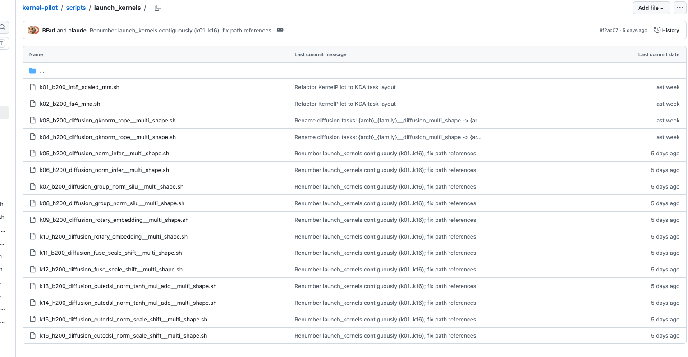
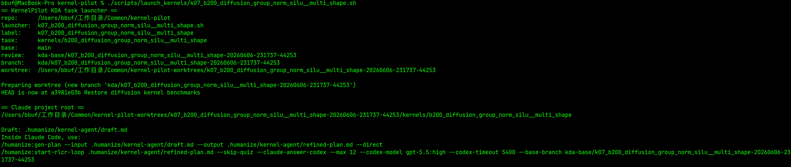
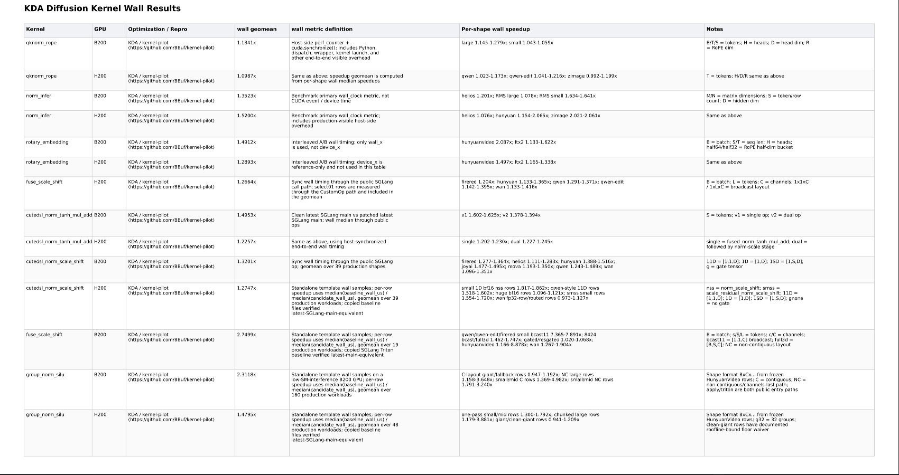
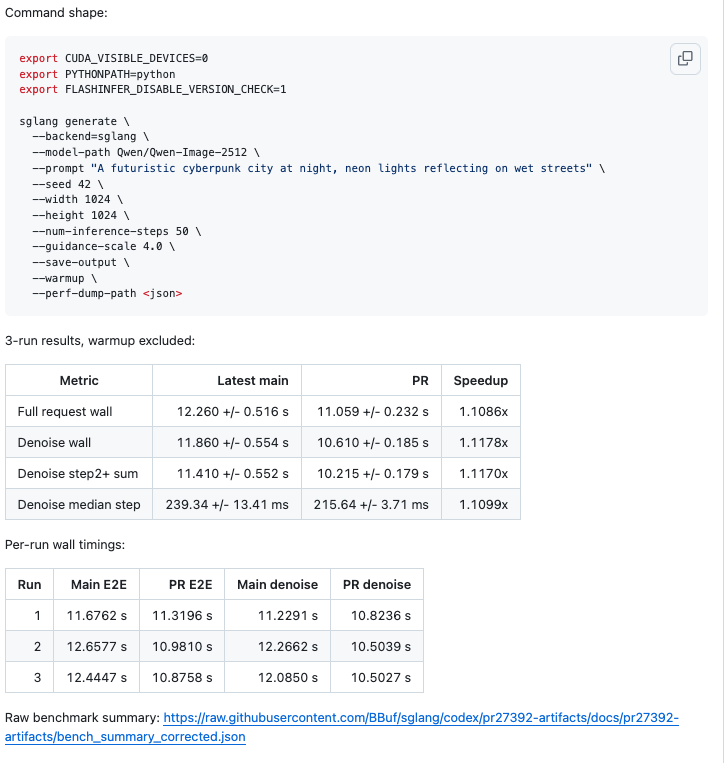
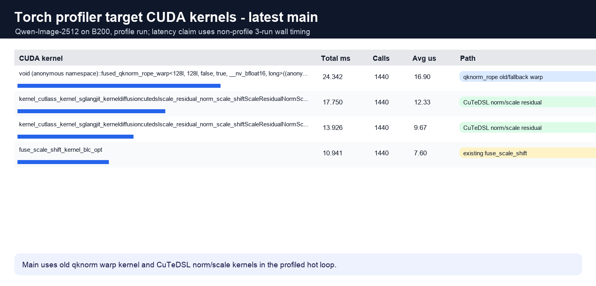
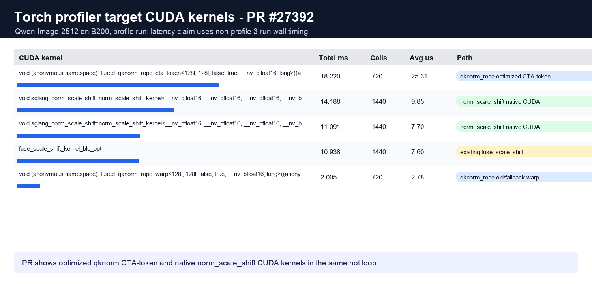

# KDA로 SGLang Diffusion Kernel을 최적화할 때의 함정과 prompt 실전

## 0x0. 배경

이 글은 최근 KDA(https://github.com/mit-han-lab/kernel-design-agents)를 사용해 SGLang Diffusion Kernel을 최적화한 과정을 기록합니다. 주요 내용은 이 과정에서 드러난 공학적 문제와 해결 방법, prompt 제약, 검증 규칙입니다.

이전 kernel-pilot의 [Humanize loop 방식](https://mp.weixin.qq.com/s/pScZ_9cA-6cWUPjfcGjNyg)과 일부 공개 Kernel Agent 프레임워크를 바탕으로, kernel-pilot은 최근 KDA 스타일의 작업 구성 방식으로 전환했습니다. 이 구성은 각 kernel을 독립적인 작업 디렉터리로 나누고 prompt, baseline, benchmark, review, 결과 기록을 보존하므로 SGLang Diffusion Kernel 최적화 작업을 일괄 생성하고 검증하기 쉽습니다. 관련 저장소는 https://github.com/BBuf/kernel-pilot 입니다.

kernel-pilot의 SGLang Diffusion Kernel 작업은 바로 실행할 수 있는 스크립트로 패키징되어 있습니다.



각 스크립트는 SGLang Diffusion 시스템의 최적화 kernel 또는 fuse kernel 하나에 대응합니다. baseline은 CUDA, Triton, CuTe-DSL 등의 구현을 포함합니다.

스크립트 하나를 실행하면 다음과 비슷한 출력을 볼 수 있습니다.



스크립트는 두 단계의 명령을 출력합니다. 첫 번째 단계는 gen-plan이고, 두 번째 단계는 RLCR loop, 즉 Humanize의 반복 개발 및 검토 흐름입니다. 명령 안의 파라미터는 주로 브랜치 격리와 작업 격리에 쓰이며, 여러 kernel 최적화 작업을 병렬로 실행할 수 있게 합니다. 한 실험에서는 14개의 Agent가 하루 동안 여러 SGLang Diffusion Kernel 작업을 병렬 처리했고, 총 비용은 2000달러 미만이었습니다. 작업 실행 모델은 Opus4.8, review 모델은 Codex GPT5.5 High였습니다.

이 작업들이 사용하는 shape는 실제 SGLang Diffusion benchmark에서 온 것입니다. 구체적으로는 https://github.com/sgl-project/sglang/blob/main/python/sglang/multimodal_gen/.claude/skills/sglang-diffusion-benchmark-profile/benchmark-and-profile.md 안의 약 20개 모델을 실행하고, 최적화 대상 kernel의 입력 정보를 기록합니다. 여기에는 shape, dtype 등이 포함됩니다. 여러 GPU 플랫폼을 커버해야 하므로 같은 종류의 kernel도 B200 작업과 H200 작업으로 따로 생성합니다.

실험 결과는 다음과 같습니다.



위 작업들은 모두 RLCR 루프를 완료했으며, 대부분의 작업은 약 6회 반복했습니다. 각 작업이 최종 생성한 `.cu` 파일과 해당 benchmark는 https://github.com/BBuf/kernel-pilot/tree/main/kernels 에서 재현할 수 있습니다.

이 kernel들은 계산량이 비교적 큰 일부 Diffusion 모델에서 주요 병목은 아니므로, end2end 이득은 해당 연산자가 workflow 안에서 차지하는 비율에 따라 달라집니다. qknorm-rope와 norm-scale-shift 비중이 높은 Qwen/Qwen-Image-2512에서는 B200 플랫폼에서 약 10%의 end2end 향상을 관측했습니다. 자세한 내용은 https://github.com/sgl-project/sglang/pull/27392 를 참고하세요.



아래는 이 모델의 main 브랜치와 PR 브랜치에서 관련 kernel의 시간과 비중을 비교한 것입니다.





## 0x1. KDA로 SGLang Diffusion Kernel을 최적화할 때의 함정과 prompt 실전

### 0x1.1 여러 Agent가 서로 다른 kernel을 병렬 최적화할 때의 격리 방식

여러 kernel 작업은 같은 checkout을 공유해 직접 실행해서는 안 됩니다. Humanize/RLCR은 `.humanize/`에 기록을 쓰고, review base, round prompt, summary, review result, 중간 코드, benchmark, profile artifact를 만듭니다. 여러 Agent가 같은 git 작업 디렉터리를 공유하면 다음 문제가 쉽게 발생합니다.

- `.humanize` 상태가 다른 작업에 섞입니다.
- Codex review의 diff가 현재 kernel 작업의 diff가 아닙니다.
- benchmark/profile artifact가 뒤섞여 숫자의 출처를 판단할 수 없습니다.
- 한 Agent가 launcher나 docs를 수정하는 동안, 다른 Agent가 여전히 이전 작업 정의를 바탕으로 실행합니다.

kernel-pilot은 현재 `scripts/launch_kda_kernel_task.sh`로 각 작업마다 독립 worktree를 만들고, 두 개의 브랜치를 생성합니다.

- `kda/<task-label>-<run-id>`: 현재 Agent가 실제로 작업하는 브랜치입니다.
- `kda-base/<task-label>-<run-id>`: Humanize RLCR review가 사용하는 고정 base입니다.

launcher는 생성된 worktree 안의 구체적인 kernel folder로 들어가고, `CLAUDE_PROJECT_DIR`을 해당 folder로 설정합니다. Humanize hooks가 보는 project root는 전체 `kernel-pilot` 저장소가 아니라 현재 kernel 작업입니다. 각 작업의 `.humanize/kernel-agent/draft.md`, `baseline/`, `solution/`, `bench/`, `docs/`는 모두 독립 worktree 안에 있습니다.

worktree만 준비하고 Claude Code를 시작하지 않으려면 다음을 사용합니다.

```bash
KDA_NO_CLAUDE=1 ./scripts/launch_kernels/k03_b200_diffusion_qknorm_rope__multi_shape.sh
```

이 명령은 현재 작업의 worktree, branch, review base와 이후 Claude Code에서 실행해야 할 Humanize 명령을 출력합니다. review base는 launcher가 출력한 값을 사용합니다.

### 0x1.2 Ghostty로 여러 Agent의 CLI 창 관리하기

여러 Agent를 병렬 실행할 때는 CLI 분할 화면으로 여러 작업 상태를 계속 보여줄 수 있습니다. Ghostty의 기본 분할 화면 기능은 하나의 tab 안에 여러 독립 shell을 유지할 수 있어, 여러 kernel 최적화 작업에 쓰기 좋습니다.

이번 실험에서는 Ghostty를 사용해 하나의 창 안에서 여러 CLI 세션을 관리했고, 여러 작업의 RLCR 상태를 동시에 관찰하기 쉬웠습니다.

macOS에서 Ghostty의 기본 단축키는 다음과 같습니다.

| 동작 | 단축키 |
| --- | --- |
| 새 tab | `Cmd + T` |
| 오른쪽으로 분할 | `Cmd + D` |
| 아래로 분할 | `Cmd + Shift + D` |
| pane 전환 | `Cmd + Option + 방향키`, 또는 `Cmd + [` / `Cmd + ]` |
| pane 크기 조정 | `Cmd + Ctrl + 방향키` |
| pane 크기 균등 분배 | `Cmd + Ctrl + =` |
| 현재 pane 확대/복구 | `Cmd + Shift + Enter` |
| 현재 pane 닫기 | `Cmd + W` |

실제 바인딩은 다음 명령으로 확인합니다.

```bash
ghostty +list-keybinds --default
```

### 0x1.3 Benchmark와 `.cu` 내보내기는 고정 템플릿으로 만들어야 한다

초기 흐름에서는 `kda_kernels` overlay, 즉 런타임 덮어쓰기 계층을 통해 최적화된 kernel을 SGLang에 연결하려고 했습니다. 이 방식은 KernelPilot #25(https://github.com/BBuf/kernel-pilot/pull/25)에서 문제를 드러냈습니다. overlay promotion, 즉 후보 구현을 런타임 overlay 경로로 올리는 과정이 `setattr`을 사용해 SGLang 안에서 `@register_custom_op`로 장식된 외부 op를 일반 Python 분기 함수로 바꾸는 문제였습니다. 이때 측정된 "가속"은 device kernel 자체가 빨라진 것이 아니라 CPU 쪽 wrapper, custom op 등록, torch.compile 관련 로직을 우회한 데서 올 수 있습니다.

SGLang의 프로덕션 경로는 외부 진입점 의미를 유지해야 합니다. 예를 들어 `@register_custom_op`는 `torch.compile`과 CUDA graph 호환성에 영향을 줍니다. 이 계층을 제거한 뒤 얻은 benchmark 숫자는 프로덕션 경로 성능을 직접 대표할 수 없습니다.

kernel-pilot은 이후 standalone diffusion benchmark contract를 채택했습니다. 이는 SGLang 런타임에서 분리해 작업 디렉터리 안에서 baseline/candidate를 대칭적으로 계측하는 약속입니다. 또한 통일된 benchmark와 `.cu` 내보내기 Python 인터페이스 템플릿을 제공합니다.

- benchmark runtime은 SGLang 소스 코드를 patch, import, monkey-patch, 즉 런타임 대체하지 않습니다.
- Agent는 최신 upstream SGLang `main`에서 관련 kernel 소스를 현재 작업의 `baseline/`으로 복사합니다.
- `baseline/`과 `solution/`은 같은 로컬 ABI로 노출됩니다. `.cu`라면 양쪽 모두 같은 tvm-ffi, 즉 TVM FFI 호출 계층 CUDA wrapper를 사용하며, wrapper overhead는 대칭입니다.
- 출력 tensor는 모두 destination-passing, 즉 출력은 호출자가 전달하는 방식을 사용해, 한쪽만 timed path에서 할당하고 다른 쪽은 할당하지 않는 일을 피합니다.
- workload는 tuning 전에 고정되며, 이후 shape, tolerance, scoring을 수정하지 않습니다.
- `bench/benchmark.py`는 통일 템플릿에서 시작하며 isolated subprocess, fresh inputs, poison outputs, correctness-before-timing, CUDA event, inner-loop amplification, interleaved A/B, per-row median/mean/std/min/p10/p90을 포함합니다. poison outputs는 먼저 sentinel 값을 써서 출력이 실제로 덮어써졌는지 확인하는 절차이고, inner-loop amplification은 단일 계측 안에서 호출을 반복해 타이밍 신호를 키우는 방식입니다. 여기서는 AKO4X의 benchmark 템플릿도 참고했습니다. 자세한 내용은 https://github.com/TongmingLAIC/AKO4X/tree/main/templates/skills/benchmark 를 참고하세요.
- 대표 지표는 모든 production workload의 equal-weight geomean을 사용합니다.

예를 들어 KernelPilot #40(https://github.com/BBuf/kernel-pilot/pull/40)의 H200 `norm_scale_shift`는 baseline이 SGLang `main@133254086b`에서 왔다고 기록하고, baseline-vs-baseline A/A 대조도 포함합니다. 양쪽 모두 baseline을 실행해 계측 잡음을 확인하는 실험이며 geomean은 `0.9992`였습니다. KernelPilot #41(https://github.com/BBuf/kernel-pilot/pull/41)의 B200 `fuse_scale_shift`는 copied Triton baseline과 tvm-ffi CUDA candidate를 사용했고, 양쪽 모두 destination-passing ABI를 사용했으며, 최종적으로 `2.7570x` geomean을 보고했습니다.

이 흐름은 kernel 최적화 결과를 보고하기 전에 baseline과 benchmark 대칭성을 먼저 검증하도록 요구합니다. 핵심 제약은 baseline과 candidate의 내보내기, 호출, 계측 경로를 대칭으로 유지하는 것입니다.

### 0x1.4 Fast Math로 인한 reward hacking 피하기

Fast Math는 수치 경로에 영향을 줍니다. CUDA kernel에 `--use_fast_math`를 추가하면 benchmark 숫자가 바뀔 수 있습니다. 하지만 diffusion 안의 Norm, RoPE, scale/shift, GroupNorm은 이후 denoise 과정에 영향을 주며, 오차가 단일 연산자 안에만 머물지 않습니다.

kernel-pilot의 현재 규칙은 다음과 같습니다. copied upstream SGLang baseline 자체가 `--use_fast_math`를 사용하고 candidate도 완전히 같은 flag를 사용하는 경우가 아니라면, candidate는 기본적으로 이 옵션을 사용하지 않습니다. 수치나 codegen을 바꿀 수 있는 모든 컴파일 옵션은 대칭이어야 합니다.

다음과 같은 benchmark 편향도 피해야 합니다.

- tolerance를 느슨하게 만들어 잘못된 결과가 통과하게 하는 것.
- NaN/Inf를 확인하지 않거나 poison output을 사용하지 않는 것.
- end-to-end 시간을 관찰하면서 Python wrapper 변화에서 나온 결과를 device kernel의 개선으로 귀속하는 것.

correctness, tolerance, workload, baseline contract는 작업 규칙이 미리 고정해야 하며, Agent는 이 경계 안에서 성능을 최적화해야 합니다. 이러한 제약은 각 최적화 작업의 prompt에 이미 들어 있습니다.

### 0x1.5 **Bash 버전이 Humanize hook에 미치는 영향**

실험에 사용한 macOS 시스템 기본 `/bin/bash` 버전은 3.2.57입니다. Humanize의 여러 hook 스크립트는 `#!/usr/bin/env bash`와 `set -euo pipefail`을 사용합니다. PATH에서 `/bin`이 Homebrew Bash보다 앞에 있으면, 시스템에 Bash 5.3.9가 `/opt/homebrew/bin/bash`에 설치되어 있더라도 hook이 Bash 3.2로 실행될 수 있습니다.

Bash 3.2는 `set -u`에서 빈 배열을 펼칠 때 오류를 냅니다. 최소 재현은 다음과 같습니다.

```bash
/bin/bash -uc 'a=(); env "${a[@]}" true'
```

새 Bash 버전은 보통 오류를 내지 않지만, Bash 3.2는 `a[@]: unbound variable`을 출력합니다. BBuf/humanize #1(https://github.com/BBuf/humanize/pull/1)에서 수정한 경로는 `hooks/lib/template-loader.sh::render_template`입니다. 아무 `VAR=value`도 전달되지 않으면 코드가 빈 배열 `env_vars=()`를 만들고 다음을 실행합니다.

```bash
env "${env_vars[@]}" awk ...
```

일부 Stop hook이 정적 block 템플릿을 렌더링할 때 변수를 전달하지 않으면 template render가 실패하고, 바깥에서는 다음과 같은 메시지를 볼 수 있습니다.

```text
Stop hook error: Failed with non-blocking status code: No stderr output
```

Bash 3.2와 호환되는 작성 방식은 다음과 같습니다.

```bash
env ${env_vars[@]+"${env_vars[@]}"} awk ...
```

KernelPilot #28(https://github.com/BBuf/kernel-pilot/pull/28)은 launcher 계층에 현대 Bash guard를 추가했습니다. 먼저 `KDA_BASH_BIN`을 사용하고, 없으면 PATH, `/opt/homebrew/bin/bash`, `/usr/local/bin/bash`를 찾으며, `/bin/bash` 3.2는 거부합니다. 선택된 Bash는 `PATH`, `SHELL`, `KDA_BASH_BIN`을 통해 이후 Claude/Humanize hooks에 전달됩니다.

kernel-pilot launcher를 시작하기 전에 다음을 설정할 수 있습니다.

```bash
brew install bash
export KDA_BASH_BIN=/opt/homebrew/bin/bash
export PATH="/opt/homebrew/bin:$PATH"
bash --version
```

### 0x1.6 **Codex hook feature 이름 변화로 인한 Stop Hook 재귀**

Humanize의 RLCR은 일부 단계에서 nested Codex helper를 시작합니다. 예를 들어 summary review에는 `codex exec`를, 코드 review에는 `codex review`를 사용합니다. nested Codex가 다시 바깥 Humanize Stop Hook을 트리거하지 않도록 기존 로직은 다음을 전달했습니다.

```bash
--disable codex_hooks
```

이후 Codex CLI의 hook feature 이름이 바뀌었습니다. 오래된 버전은 `codex_hooks`를 사용했을 수 있고, 새 버전은 `hooks`와 `plugin_hooks`를 노출합니다. Humanize가 `codex_hooks`만 비활성화하면 새 Codex에서는 실제로 유효한 hook이 여전히 로드될 수 있고, nested Codex가 같은 Stop Hook으로 다시 들어가 재귀가 생깁니다.

동시에 모든 feature name을 그대로 `--disable`에 넘길 수도 없습니다. 일부 구버전 Codex는 `--disable`을 지원하더라도 알 수 없는 feature name을 만나면 오류를 냅니다. 따라서 호환되는 방식은 먼저 탐지한 뒤 인자를 전달하는 것입니다.

PolyArch/humanize #194(https://github.com/PolyArch/humanize/pull/194)의 수정 로직은 다음과 같습니다.

- `loop-codex-stop-hook.sh`, `ask-codex.sh`, `bitlesson-select.sh`에서 Codex가 `--disable`을 지원하는지 탐지합니다.
- `hooks`, `plugin_hooks`, `codex_hooks` 각각의 feature name을 현재 Codex가 받아들이는지 하나씩 테스트합니다.
- 지원되는 feature만 `--disable <feature>`로 nested Codex에 전달합니다.
- 탐지 결과를 캐시해 반복 probe를 피합니다.
- 현대 Codex와 legacy Codex에 대한 테스트 커버리지를 추가합니다.

이 수정 후 Humanize plugin version은 `1.17.0`으로 동기화되었습니다. Codex review가 `running stop hook`에서 오래 멈춰 있고, token 사용량이 계속 늘어가는데 새 summary/review result가 나오지 않는다면 이 문제를 먼저 확인하고 Humanize 업그레이드로 처리할 수 있습니다.

### 0x1.7 Prompt는 shape 특화와 dispatch를 허용해야 한다

실제 SGLang Diffusion workload는 하나의 shape, 하나의 dtype, 하나의 layout만 갖지 않습니다. 같은 kernel family도 다음을 포함할 수 있습니다.

- token 수가 작은 장면, 주로 launch/host overhead의 영향을 받습니다.
- 중간 규모 shape, 해당 shape에 맞는 block/grid로 SM을 커버해야 합니다.
- 큰 shape, HBM roofline에 가까워집니다.
- contiguous와 channels-last-3d 두 layout.
- bf16/fp16/fp32 혼합.
- `[1, D]`, `[B, S, D]`, `[B, F, 1, D]` 같은 서로 다른 operand 형태.

prompt가 shape-specialized dispatch, 즉 shape에 따라 특화하고 분기하는 방식을 명확히 허용하지 않으면, Agent는 모든 shape를 덮는 범용 kernel을 생성할 수 있습니다. 이 전략은 일부 shape는 빨라지고 일부 shape는 느려지게 만들 수 있으며, geomean은 여전히 괜찮아 보일 수 있습니다. 하지만 프로덕션 workload는 특정 shape, layout, dtype bucket에서 생긴 회귀를 맞을 수 있습니다.

kernel-pilot의 `diffusion_kernel_rules.md`는 shape-specialized kernels, template variants, autotune tables, dispatchers를 명확히 허용합니다. dispatchers는 조건에 따라 kernel/config 또는 fallback을 선택하는 분기 로직입니다. dispatch를 사용할 때는 `docs/dispatch.md`에 다음을 기록해야 합니다.

- bucket condition, 즉 각 분류의 매칭 조건.
- 각 bucket이 어떤 baseline/candidate entry를 사용하는지.
- 각 bucket의 latency와 speedup.
- dispatch 이유.

KernelPilot #43(https://github.com/BBuf/kernel-pilot/pull/43)의 B200 `group_norm_silu`는 여러 bucket 전략을 사용했습니다. contiguous 64K-2M은 `cont_split`, channels-last는 `nchw_last`, 작은 shape는 vectorized one-pass, 초대형 contiguous bucket은 baseline-equivalent path, 즉 baseline과 동등한 fallback 경로로 보냈습니다. KernelPilot #42(https://github.com/BBuf/kernel-pilot/pull/42)의 H200 `group_norm_silu`는 giant rows의 여러 변형 시도를 기록했고, 특수 giant row에 대해 owner ruling을 내렸습니다. 여기서 owner ruling은 작업 owner가 계속 진행할지, fallback할지, 멈출지를 명확히 판단하는 것입니다.

KernelPilot #40(https://github.com/BBuf/kernel-pilot/pull/40)의 H200 `norm_scale_shift`도 플랫폼 차이를 보여줍니다. B200에서 유효했던 32B/thread vector width가 H200에서는 회귀했고, H200은 최종적으로 16B/thread를 선택했습니다.

따라서 prompt에는 작업이 shape, layout, dtype 또는 플랫폼 차이에 따라 서로 다른 kernel/config를 사용할 수 있고, fail-closed dispatcher, 즉 조건이 맞지 않으면 기본적으로 baseline으로 fallback하는 분기 로직을 통해 프로덕션 경로를 설명 가능하게 유지해야 한다는 점을 명확히 적어야 합니다.

### 0x1.8 Prompt 안의 다른 규칙과 최적화 목표

- 먼저 K/R/W, 즉 Kernel/Reference/Workload를 복원합니다. kernel semantics, correctness oracle, workload/benchmark methodology가 명확해진 뒤 kernel을 작성합니다.
- baseline은 최신 SGLang `main`에서 가져오고, commit, 복사한 파일, resolution time을 기록합니다.
- benchmark runtime은 SGLang을 import하지 않으며, SGLang은 소스 제공자로만 사용합니다.
- benchmark/profile 전후로 GPU idle evidence를 기록합니다.
- no-go, 즉 해당 방향을 더 밀지 않겠다는 판단에는 correctness, benchmark/NCU evidence, 명확한 active bound가 필요합니다. 첫 번째 회귀만 보고 판단해서는 안 됩니다.
- raw NCU / Nsight / scratch artifact는 작업 디렉터리에 남기고, PR에는 작은 provenance와 shape별 결과만 넣습니다.

이 규칙들은 Agent의 탐색 공간을 제약해 benchmark 허점이나 비프로덕션 경로 차이를 kernel 최적화로 착각하지 않도록 합니다.

작업의 최적화 목표는 kernel의 Roofline 모델에 따라 kernel을 성능 상한에 가깝게 최적화하는 것입니다.

### 0x1.9 **KernelWiki와 ncu-report-skill 사용**

KernelPilot은 `KernelWiki`와 `ncu-report-skill`을 외부 지식 소스로 `external/` 아래에 둡니다. SGLang Diffusion Kernel 규칙은 각 RLCR 라운드에서 다음 code edit, benchmark, profile 또는 no-go를 결정하기 전에 task prompt, 현재 benchmark/profile evidence, `KernelWiki`, `ncu-report-skill`을 새로 확인하도록 요구합니다. 따라서 이 두 지식 소스는 한 번만 보는 preflight 자료가 아니라 매 라운드 반복 컨텍스트입니다.

`KernelWiki`는 주로 prior art 검색과 최적화 방향 선별에 쓰입니다. 예를 들어 `qknorm_rope` 작업은 fused QKNorm + RoPE, RoPE, FlashInfer / TensorRT-LLM / SGLang 관련 기록을 조회해 staged design, vectorized load, shared memory staging, PDL, 즉 Programmatic Dependent Launch 같은 방향에 upstream 선례가 있는지 판단합니다. 일부 작업은 직접적으로 맞는 결과가 없다는 조회 결과도 기록해, 존재하지 않는 prior art를 근거로 삼지 않도록 합니다.

`ncu-report-skill`은 주로 benchmark 숫자를 active bound로 분해하는 데 쓰입니다. 최적화 과정에서는 NCU를 바탕으로 kernel이 memory-bound, compute-bound, launch-bound, long scoreboard, register pressure, occupancy 제한 중 무엇인지 판단하고 다음 수정 또는 no-go를 결정합니다. long scoreboard는 메모리 접근 또는 의존성 대기로 인한 긴 대기를 뜻합니다. 예를 들어 `cutedsl_norm_tanh_mul_add`는 NCU로 baseline의 per-row `tanh` 계산 병목을 확인하고, 이후 register, occupancy, local memory 증거로 prefetch 변형을 기각했습니다. `rotary_embedding`은 NCU/roofline으로 일부 LTX-2 large shape가 이미 DRAM bandwidth ceiling에 가깝다는 점을 설명했고, 이후 후보가 active bound를 넘지 못하면 더 확장하지 않았습니다.

모든 후보에 대해 NCU를 완전히 실행할 필요는 없습니다. 규칙은 다음과 같습니다. benchmark 결과를 직접 설명하기 어렵거나, 후보가 목표 workload를 커버하는지 명확하지 않거나, 최종 improvement/no-go에 근거가 필요하면 NCU 또는 그에 상응하는 roofline-style active bound, 즉 주요 병목 판단을 제시해야 합니다. raw `.ncu-rep`, Nsight trace, profile 디렉터리는 작업 worktree에 남기고, 글이나 PR에는 결론, 핵심 지표, 재현 가능한 명령만 기록합니다.

## 0x2. 최종 후보 코드가 SGLang baseline 대비 최적화한 점

kernel-pilot의 현재 `kernels/` 디렉터리에 있는 이 SGLang Diffusion Kernel 작업들의 최종 후보는 몇 가지 유형으로 요약할 수 있습니다. CuTe-DSL/Triton 경로를 tvm-ffi CUDA native kernel로 바꾸는 것, 실제 shape에 맞춘 dispatcher를 만드는 것, 큰 shape에서 더 넓은 vectorization 또는 block-level parallelism으로 bandwidth 활용률을 높이는 것, 작은 shape에서는 더 가벼운 CPU 쪽 경로를 유지하는 것, 안정적인 이득이 없는 bucket은 명시적으로 baseline으로 fallback하거나 no-go를 기록하는 것입니다.

아래에서는 대표적인 최종 후보 버전 6개만 선택하고, 모든 작업을 하나씩 펼치지는 않습니다. 표의 "최종 후보"는 각 작업 디렉터리의 `docs/results.md`, `docs/dispatch.md`, `docs/sglang_jit_export.md`에 기록된 final/promoted 버전을 뜻합니다.

일부 작업의 결과는 standalone benchmark에서 나왔고, 일부 작업은 in-SGLang drop-in arbiter도 수행했습니다. 여기서 drop-in arbiter는 후보 구현을 SGLang의 실제 외부 API/custom-op 경로에 연결한 뒤 A/B 검증하는 절차입니다. in-tree arbiter는 그중 더 엄격한 방식으로, 후보 `.cu/.cuh`가 실제 SGLang worktree에 들어가고 원래 외부 진입점이 이를 호출합니다. 표의 "결과"는 해당 최적화 포인트에 대해 기록된 증거를 설명하기 위한 것입니다.

| Kernel family | 플랫폼 | SGLang baseline | 최종 후보 코드의 주요 최적화 | 결과 또는 경계 |
| --- | --- | --- | --- | --- |
| `cutedsl_norm_scale_shift` | B200/H200 | CuTe-DSL norm + scale/shift 경로 | native CUDA로 바꾸고 scale/shift/gate/weight/bias 조합에 따라 dispatch합니다. B200에서는 bf16-only에 더 넓은 vector를 사용하고, H200은 최종적으로 16B/thread까지 보수적으로 낮춥니다. 이득이 없는 fp32-row bucket은 baseline으로 fallback합니다. | B200 `1.3022x` end-to-end, H200 약 `1.27x`; 플랫폼 차이와 fallback 규칙을 보여줍니다. |
| `fuse_scale_shift` | B200 | Triton scale/shift, gated LayerNorm 경로 | 하나의 CUDA module이 여러 entry를 덮습니다. scale/shift는 row-grid 또는 flat-vector 16B kernel을 사용하고, gated LN은 exact-C register cached row kernel로 Triton tile에서 mask 처리되는 lane 낭비를 줄입니다. | 19개 production rows geomean `2.7570x`, 모든 행 >= `1.0391x` |
| `group_norm_silu` | B200 | SGLang Triton group_norm_silu, channels-last는 먼저 contiguous tensor로 변환 | CUDA dispatcher를 `cont_small`, `cont_split`, `nchw_last`, fallback으로 나눕니다. contiguous mid bucket은 split-group stats로 SM을 채우고, channels-last는 원본 layout을 직접 읽어 `x.contiguous()`를 피합니다. | 160개 production rows geomean `2.2794x`; giant contiguous bucket은 bandwidth bound에 가까워 baseline 동등 경로로 돌아갑니다. |
| `norm_infer` | B200/H200 | Triton `norm_infer`와 `rmsnorm_onepass` | fp32 LN은 float4/exact-N row kernel을 사용합니다. bf16 RMS는 규모에 따라 warp-per-row 또는 tiled CTA를 선택합니다. H200 fast path는 원래 외부 함수 본문 안에 넣어 custom-op 등록을 유지합니다. | B200 round-2 시간 geomean `1.358x`; H200 vs main in-tree arbiter 시간 `1.4475x` |
| `qknorm_rope` | B200/H200 | SGLang `qknorm_rope.cuh` baseline | 후보 `.cuh`를 SGLang worktree에 직접 넣고 `@register_custom_op`를 유지합니다. B200 large rows는 cos/sin을 단계적으로 캐시해 head 간 반복 global load를 줄입니다. H200 `cossin-vec`는 128-bit quartet load로 register를 38에서 32로 낮춥니다. | B200 in-SGLang arbiter `1.0970x`; H200 in-SGLang arbiter `1.0945x` |
| `rotary_embedding` | B200/H200 | SGLang Triton standard RoPE + LTX-2 split RoPE | native CUDA/tvm-ffi를 사용합니다. standard RoPE와 LTX-2 모두 128-bit vector load/store를 사용합니다. H200 버전은 한 번 읽고 한 번 쓰는 데이터 흐름에 `__ldcs`/`__stcs`를 추가로 사용합니다. | B200 vs 현재 main geomean `1.4660x`; H200 실제 통합 경로 시간 geomean `1.2977x` |

이 최종 후보들은 몇 가지 최적화 패턴을 보여줍니다. 큰 shape는 보통 bandwidth, occupancy, long scoreboard를 중심으로 처리합니다. 작은 shape는 kernel launch와 CPU 쪽 경로의 제한을 받는 경우가 많습니다. layout 특화와 shape dispatch는 어떤 최적화가 실제 workload를 덮을 수 있는지를 결정합니다. Roofline에 가까운 bucket에서는 최종 조치가 계속 kernel 복잡도를 늘리는 것이 아니라 fallback 또는 no-go 기록일 수 있습니다.

## 0x3. 요약

KDA를 SGLang Diffusion Kernel 최적화에 사용할 때는 Agent가 CUDA 코드를 생성하는 능력뿐 아니라, 실험 시스템이 benchmark, baseline, correctness, review를 어떻게 제약하는지도 함께 봐야 합니다.

재사용 가능한 흐름에는 최소한 다음이 포함되어야 합니다.

- 각 작업의 독립 worktree와 Humanize 상태. 여러 Agent 병렬 실행을 지원해야 합니다.
- baseline은 최신 upstream main에서 복사하고, source lineage를 추적할 수 있어야 합니다.
- baseline/candidate는 같은 wrapper/ABI/build path를 지나야 합니다.
- workload는 실제 SGLang Diffusion preset capture에서 오며, tuning 전에 고정되어야 합니다.
- benchmark는 A/B interleaving, inner-loop amplification, A/A gate, GPU idle evidence를 포함해야 합니다. A/A gate는 baseline 대 baseline 안정성 문턱입니다.
- correctness는 production shape, canonical regression grid, NaN/Inf, poison output, fallback contract를 포함해야 합니다. canonical regression grid는 고정 회귀 테스트 격자입니다.
- prompt는 shape-specialized dispatch를 허용하고, `docs/dispatch.md`가 각 bucket을 설명하도록 요구해야 합니다.
- Humanize/Codex hook 환경은 안정적이어야 하며, Bash 3.2와 Stop Hook 재귀가 긴 작업에 영향을 주지 않도록 해야 합니다.

실험에서 KDA는 하루 안에 SGLang Diffusion Kernel의 microbench 최적화 묶음을 완료했습니다. 여기에는 B200 `fuse_scale_shift`의 `2.7570x` geomean, B200 `group_norm_silu`의 `2.2794x` geomean, H200 `norm_scale_shift`의 `1.27x` geomean이 포함됩니다. 이 흐름은 benchmark 대칭성, baseline provenance, correctness, review hardening도 함께 기록했습니다. 최적화된 kernel은 필요에 따라 실제 모델 추론 프레임워크에 가져다 쓸 수 있습니다.
