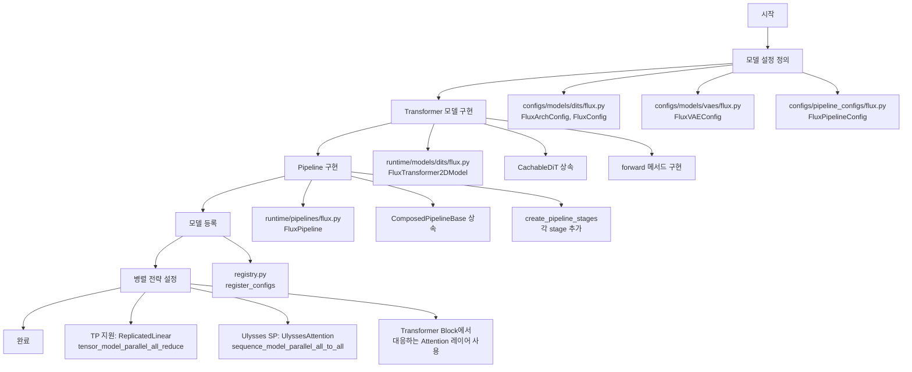

## 0x0. 서론

최근 SGLang Diffusion의 소스 구현을 살펴보고 있다. SGLang 팀이 내놓은 diffusion 모델 추론 엔진으로, Wan, Hunyuan, Qwen-Image, Flux 등 주요 이미지·비디오 생성 모델을 지원한다. FLUX.1-dev를 예로 삼아 소스 구현에 대해 이해한 내용을 기록해 두려고 하며, 주로 모델 구성, 병렬 전략, attention backend 세 가지를 다룬다.

## 0x1. 전체 아키텍처

SGLang Diffusion은 SGLang의 serving 아키텍처를 기반으로 구현되어 있고, 핵심 설계 아이디어는 `ComposedPipelineBase`와 `PipelineStage`의 조합 패턴이다(코드는 `python/sglang/multimodal_gen/runtime/pipelines_core/composed_pipeline_base.py`와 `stages/base.py`에 있다). 각 stage는 텍스트 인코딩, denoising, VAE 디코딩처럼 특정 기능 하나를 캡슐화하며, 이 stage들을 조합하면 완전한 추론 흐름을 구성할 수 있다.

전형적인 pipeline은 다음 stage들을 포함한다: InputValidationStage(입력 검증), TextEncodingStage(텍스트 인코딩), ConditioningStage(조건 준비), TimestepPreparationStage(timestep 준비), LatentPreparationStage(latent 준비), DenoisingStage(denoising 루프), DecodingStage(VAE 디코딩). 이런 모듈화된 설계 덕분에 새 모델을 추가하거나 기존 pipeline을 수정하는 일이 비교적 간단해진다.

## 0x2. FLUX.1-dev 모델 구현 상세

이어서 FLUX.1-dev를 예로 SGLang Diffusion이 모델을 어떻게 구성하고 실행하는지 살펴본다.

### 2.1 Pipeline 설정

FLUX.1-dev의 pipeline 설정은 `FluxPipelineConfig`에 정의되어 있다(`configs/pipeline_configs/flux.py`):

```python
@dataclass
class FluxPipelineConfig(ImagePipelineConfig):
    """Configuration for the FLUX pipeline."""
    
    embedded_cfg_scale: float = 3.5
    task_type: ModelTaskType = ModelTaskType.T2I
    
    # DiT 설정
    dit_config: DiTConfig = field(default_factory=FluxConfig)
    
    # VAE 설정
    vae_config: VAEConfig = field(default_factory=FluxVAEConfig)
    
    # Text encoder 설정(CLIP + T5)
    text_encoder_configs: tuple[EncoderConfig, ...] = field(
        default_factory=lambda: (CLIPTextConfig(), T5Config())
    )
```

이 설정은 FLUX.1-dev에 필요한 모든 컴포넌트를 정의한다: DiT(핵심 diffusion 모델), VAE(이미지 인코딩/디코딩), Text Encoders(CLIP과 T5 두 개의 텍스트 인코더).

### 2.2 모델 아키텍처

FLUX.1-dev의 transformer 아키텍처는 `FluxTransformer2DModel`에 구현되어 있다(`runtime/models/dits/flux.py`):

```python
class FluxTransformer2DModel(CachableDiT):
    def __init__(self, config: FluxConfig, hf_config: dict[str, Any]) -> None:
        super().__init__(config=config, hf_config=hf_config)
        
        # 핵심 컴포넌트
        self.rotary_emb = FluxPosEmbed(theta=10000, axes_dim=self.config.axes_dims_rope)
        self.time_text_embed = CombinedTimestepTextProjEmbeddings(...)
        self.context_embedder = ReplicatedLinear(...)
        self.x_embedder = ReplicatedLinear(...)
        
        # Transformer blocks(dual-stream 아키텍처)
        self.transformer_blocks = nn.ModuleList([
            FluxTransformerBlock(...) for _ in range(self.config.num_layers)
        ])
        
        # Single transformer blocks
        self.single_transformer_blocks = nn.ModuleList([
            FluxSingleTransformerBlock(...) for _ in range(self.config.num_single_layers)
        ])
```

FLUX는 독특한 dual-stream 아키텍처를 채택했다. transformer_blocks는 이미지와 텍스트의 결합 attention을 처리하고(19층), single_transformer_blocks는 이미지의 attention만 처리한다(38층). 이 설계는 꽤 흥미롭다.

### 2.3 Pipeline Stages 상세

FLUX.1-dev의 pipeline은 다음 stage들로 구성된다(전체 코드는 `runtime/pipelines/flux.py`의 `create_pipeline_stages` 메서드에 있다):

```python
def create_pipeline_stages(self, server_args: ServerArgs):
    # 1. 입력 검증
    self.add_stage(
        stage_name="input_validation_stage", 
        stage=InputValidationStage()
    )
    
    # 2. 텍스트 인코딩(CLIP + T5)
    self.add_stage(
        stage_name="prompt_encoding_stage_primary",
        stage=TextEncodingStage(
            text_encoders=[
                self.get_module("text_encoder"),      # CLIP
                self.get_module("text_encoder_2"),    # T5
            ],
            tokenizers=[
                self.get_module("tokenizer"),
                self.get_module("tokenizer_2"),
            ],
        ),
    )
    
    # 3. 조건 준비
    self.add_stage(
        stage_name="conditioning_stage", 
        stage=ConditioningStage()
    )
    
    # 4. timestep 준비
    self.add_stage(
        stage_name="timestep_preparation_stage",
        stage=TimestepPreparationStage(
            scheduler=self.get_module("scheduler"),
            prepare_extra_set_timesteps_kwargs=[prepare_mu],
        ),
    )
    
    # 5. Latent 준비
    self.add_stage(
        stage_name="latent_preparation_stage",
        stage=LatentPreparationStage(
            scheduler=self.get_module("scheduler"),
            transformer=self.get_module("transformer"),
        ),
    )
    
    # 6. denoising 루프
    self.add_stage(
        stage_name="denoising_stage",
        stage=DenoisingStage(
            transformer=self.get_module("transformer"),
            scheduler=self.get_module("scheduler"),
        ),
    )
    
    # 7. VAE 디코딩
    self.add_stage(
        stage_name="decoding_stage", 
        stage=DecodingStage(vae=self.get_module("vae"))
    )
```

`TextEncodingStage`(`pipelines_core/stages/text_encoding.py`)는 텍스트 prompt를 embedding으로 인코딩하는 일을 맡는다:

```python
class TextEncodingStage(PipelineStage):
    def forward(self, batch: Req, server_args: ServerArgs) -> Req:
        # CLIP과 T5로 prompt 인코딩
        prompt_embeds_list, prompt_masks_list, pooler_embeds_list = self.encode_text(
            prompt_text,
            server_args,
            encoder_index=all_indices,
            return_attention_mask=True,
        )
        
        # CFG가 켜져 있으면 negative prompt도 인코딩
        if batch.do_classifier_free_guidance:
            neg_embeds_list, neg_masks_list, neg_pooler_embeds_list = self.encode_text(
                batch.negative_prompt,
                server_args,
                encoder_index=all_indices,
                return_attention_mask=True,
            )
```

FLUX는 두 개의 텍스트 인코더를 사용한다. CLIP은 전역 조건에 쓰이는 pooled embeddings를 제공하고, T5는 세밀한 텍스트 이해에 쓰이는 시퀀스 embeddings를 제공한다.

`DenoisingStage`(`pipelines_core/stages/denoising.py`)는 가장 핵심적인 stage로, 반복적인 denoising을 수행한다:

```python
class DenoisingStage(PipelineStage):
    def forward(self, batch: Req, server_args: ServerArgs) -> Req:
        # latents 초기화
        latents = batch.latents
        
        # 반복 denoising
        for i, t in enumerate(timesteps):
            # 입력 준비
            latent_model_input = self.scheduler.scale_model_input(latents, t)
            
            # Transformer 순전파
            noise_pred = self.transformer(
                hidden_states=latent_model_input,
                encoder_hidden_states=prompt_embeds,
                pooled_projections=pooled_embeds,
                timestep=t,
                freqs_cis=freqs_cis,
            )
            
            # latents 갱신
            latents = self.scheduler.step(noise_pred, t, latents)
```

### 2.4 모델 로딩 흐름

SGLang Diffusion은 `PipelineComponentLoader`로 각 컴포넌트를 로드하며(`runtime/loader/component_loader.py`), 구체적인 로딩 로직은 `ComposedPipelineBase`의 `load_modules` 메서드에 있다:

```python
def load_modules(self, server_args: ServerArgs) -> dict[str, Any]:
    model_index = self._load_config()  # model_index.json 읽기
    
    components = {}
    for module_name, (transformers_or_diffusers, architecture) in model_index.items():
        if module_name not in required_modules:
            continue
            
        # 모듈 로드
        module = PipelineComponentLoader.load_module(
            module_name=module_name,
            component_model_path=component_model_path,
            transformers_or_diffusers=transformers_or_diffusers,
            server_args=server_args,
        )
        components[module_name] = module
    
    return components
```

로딩 과정은 비교적 명확하다. `model_index.json`을 읽어 컴포넌트 정보를 얻고, 설정에 따라 각 컴포넌트(transformer, vae, text_encoder 등)를 로드하고, TP/SP 같은 병렬 전략을 적용한 뒤, 마지막으로 컴포넌트 딕셔너리를 반환해 pipeline이 사용하도록 한다.

### 2.5 모델 가중치 로딩 메커니즘

SGLang Diffusion의 가중치 로딩 메커니즘은 꽤 정교하게 설계되어 있어, 컴포넌트 종류마다 서로 다른 로딩 전략을 사용한다. 이 부분의 구현을 자세히 설명한다.

**로더 팩토리 패턴**

SGLang은 컴포넌트 종류마다 전용 Loader를 구현해 두었다(`runtime/loader/component_loader.py`):

```python
class ComponentLoader:
    def load(self, component_model_path, server_args, module_name, transformers_or_diffusers):
        # 커스터마이즈 버전 로딩을 우선 시도
        try:
            component = self.load_customized(component_model_path, server_args, module_name)
            source = "customized"
        except Exception:
            # 네이티브 버전(transformers/diffusers)으로 fallback
            component = self.load_native(component_model_path, server_args, transformers_or_diffusers)
            source = "native"
        return component
```

이런 설계의 장점은 SGLang이 최적화한 구현을 우선 사용하고, 로딩에 실패하면 원래의 transformers/diffusers 구현으로 fallback해 호환성을 보장한다는 점이다.

**Transformer 가중치 로딩(FSDP 방식)**

Transformer(DiT) 같은 대형 모델에 대해 SGLang은 FSDP(Fully Sharded Data Parallel)로 가중치를 로드한다:

```python
class TransformerLoader(ComponentLoader):
    def load_customized(self, component_model_path, server_args, *args):
        # 1. 설정 읽기
        config = get_diffusers_component_config(model_path=component_model_path)
        dit_config = server_args.pipeline_config.dit_config
        dit_config.update_model_arch(config)
        
        # 2. 모든 safetensors 파일 찾기
        safetensors_list = _list_safetensors_files(component_model_path)
        
        # 3. FSDP로 모델 로드
        model = maybe_load_fsdp_model(
            model_cls=model_cls,
            init_params={"config": dit_config, "hf_config": hf_config},
            weight_dir_list=safetensors_list,
            device=get_local_torch_device(),
            hsdp_shard_dim=server_args.hsdp_shard_dim,
            cpu_offload=server_args.dit_cpu_offload,
            default_dtype=torch.bfloat16,
        )
        return model.eval()
```

FSDP의 장점은 모델 파라미터를 여러 GPU에 분할할 수 있고 CPU offload를 지원한다는 점이다. 덕분에 23.8GB짜리 FLUX transformer도 메모리가 제한된 GPU에서 로드할 수 있다.

**Text Encoder 가중치 로딩(스트리밍 로딩)**

Text Encoder에 대해서는 SGLang이 더 세밀한 스트리밍 로딩 방식을 사용한다:

```python
class TextEncoderLoader(ComponentLoader):
    def load_model(self, model_path, model_config, server_args, dtype="fp16"):
        # 1. 초기화를 건너뛰고 빈 모델 생성
        with skip_init_modules():
            model_cls, _ = ModelRegistry.resolve_model_cls(architectures)
            model = model_cls(model_config)
        
        # 2. 가중치 스트리밍 로딩
        weights_to_load = {name for name, _ in model.named_parameters()}
        loaded_weights = model.load_weights(
            self._get_all_weights(model, model_path, to_cpu=should_offload)
        )
        
        # 3. 대상 디바이스로 이동
        model = model.to(local_torch_device)
        
        # 4. CPU offload가 필요하면 FSDP 사용
        if should_offload:
            shard_model(
                model,
                cpu_offload=True,
                reshard_after_forward=True,
                mesh=mesh["offload"],
            )
        return model.eval()
```

여기서 핵심은 `skip_init_modules` 컨텍스트 매니저다. 이것이 PyTorch의 기본 파라미터 초기화를 건너뛰어 시간과 메모리 낭비를 막아 준다. 그다음 `_get_all_weights`로 가중치 이터레이터를 얻어 스트리밍 방식으로 가중치를 로드한다.

**가중치 이터레이터 구현**

`_get_all_weights`는 제너레이터를 반환해 safetensors 파일 안의 가중치를 하나씩 읽는다:

```python
def _get_weights_iterator(self, source, to_cpu):
    hf_folder, hf_weights_files, use_safetensors = self._prepare_weights(
        source.model_or_path, source.fall_back_to_pt, source.allow_patterns_overrides
    )
    
    if use_safetensors:
        weights_iterator = safetensors_weights_iterator(hf_weights_files, to_cpu=to_cpu)
    else:
        weights_iterator = pt_weights_iterator(hf_weights_files, to_cpu=to_cpu)
    
    # prefix 적용
    return ((source.prefix + name, tensor) for (name, tensor) in weights_iterator)
```

이런 스트리밍 로딩의 장점은 모든 가중치를 한 번에 메모리로 올릴 필요 없이 로드하면서 바로 처리할 수 있어 메모리를 절약한다는 점이다.

**커스텀 가중치 로딩 로직**

모델마다 자체 `load_weights` 메서드를 구현해 가중치 매핑을 처리한다. 예를 들어 CLIP의 구현은 다음과 같다:

```python
def load_weights(self, weights: Iterable[tuple[str, torch.Tensor]]) -> set[str]:
    # QKV 융합 매핑
    stacked_params_mapping = [
        ("qkv_proj", "q_proj", "q"),
        ("qkv_proj", "k_proj", "k"),
        ("qkv_proj", "v_proj", "v"),
    ]
    
    params_dict = dict(self.named_parameters())
    loaded_params = set()
    
    for name, loaded_weight in weights:
        # q_proj, k_proj, v_proj -> qkv_proj 매핑 처리
        for param_name, weight_name, shard_id in stacked_params_mapping:
            if weight_name in name:
                model_param_name = name.replace(weight_name, param_name)
                if model_param_name in params_dict:
                    param = params_dict[model_param_name]
                    weight_loader = param.weight_loader
                    weight_loader(param, loaded_weight, shard_id)
                    loaded_params.add(model_param_name)
                break
        else:
            # 기본 로딩 로직
            if name in params_dict:
                param = params_dict[name]
                weight_loader = getattr(param, "weight_loader", default_weight_loader)
                weight_loader(param, loaded_weight)
                loaded_params.add(name)
    
    return loaded_params
```

여기서 `weight_loader`는 커스터마이즈 가능한 함수로, QKV 융합, 가중치 분할, 데이터 타입 변환 등 다양한 특수 상황을 처리할 수 있다.

**VAE 가중치 로딩(단순하고 직접적)**

VAE는 상대적으로 단순해서 `load_state_dict`를 그대로 사용한다:

```python
class VAELoader(ComponentLoader):
    def load_customized(self, component_model_path, server_args, *args):
        # 1. 모델 생성
        vae_cls, _ = ModelRegistry.resolve_model_cls(class_name)
        vae = vae_cls(vae_config).to(target_device)
        
        # 2. 가중치 로드
        safetensors_list = _list_safetensors_files(component_model_path)
        loaded = safetensors_load_file(safetensors_list[0])
        vae.load_state_dict(loaded, strict=False)
        
        return vae.eval()
```

VAE는 비교적 작아서(168 MiB) 모든 가중치를 한 번에 로드해도 된다.

**가중치 로딩의 특징 정리**:

1. **계층적 설계**: 컴포넌트마다 다른 Loader를 사용하고, 각 Loader는 커스터마이즈 방식과 네이티브 방식 두 가지 로딩 경로를 가진다
2. **스트리밍 로딩**: 대형 모델(Text Encoder, Transformer)에 대해서는 제너레이터로 스트리밍 로딩해 메모리를 절약한다
3. **FSDP 지원**: 대형 모델은 FSDP 분할과 CPU offload를 지원하므로, 제한된 메모리에서도 초대형 모델을 로드할 수 있다
4. **가중치 매핑**: 모델마다 `load_weights` 메서드를 커스터마이즈해 다양한 가중치 매핑과 융합을 처리할 수 있다
5. **초기화 건너뛰기**: `skip_init_modules`를 사용해 파라미터 초기화에 시간을 낭비하지 않는다

이 메커니즘 덕분에 SGLang Diffusion은 다양한 규모의 모델을 효율적으로 로드하면서도 유연성과 확장성을 잘 유지한다.

## 0x3. 병렬 전략 상세

이어서 SGLang Diffusion의 병렬 전략을 이야기한다. 이 부분이 고성능의 핵심이다. 여러 병렬 방식을 지원하는데 하나씩 살펴본다.

### 3.1 Tensor Parallelism (TP)

TP는 모델 파라미터를 텐서 차원에 따라 여러 GPU에 분할하는 것이다. FLUX에서는 주로 `ReplicatedLinear`라는 선형 레이어에 적용된다(`runtime/layers/linear.py`):

```python
class ReplicatedLinear(nn.Module):
    """TP를 지원하는 선형 레이어"""
    def forward(self, x):
        # TP 모드에서는 가중치가 분할되어 있다
        output = F.linear(x, self.weight, self.bias)
        # All-reduce로 결과 집계
        if self.tp_size > 1:
            output = tensor_model_parallel_all_reduce(output)
        return output
```

TP의 장점은 GPU 한 장당 메모리 사용량을 줄이고 계산 병렬도를 높인다는 점으로, 대형 모델 추론에 큰 도움이 된다.

### 3.2 Ulysses Sequence Parallelism

Ulysses SP는 시퀀스 병렬 방법의 하나로, all-to-all 통신을 통해 시퀀스 차원과 head 차원 사이에서 분할을 수행한다(`UlyssesAttention`의 구현은 `runtime/layers/attention/layer.py`에 있다):

```python
class UlyssesAttention(nn.Module):
    def forward(self, q, k, v):
        # 입력: [B, S_local, H, D]
        
        # Stack QKV
        qkv = torch.cat([q, k, v], dim=0)
        
        # All-to-all: head 차원과 시퀀스 차원 사이에서 재분배
        # [3*B, S_local, H, D] -> [3*B, S_global, H_local, D]
        qkv = sequence_model_parallel_all_to_all_4D(
            qkv, scatter_dim=2, gather_dim=1
        )
        
        # attention 수행
        output = self.attn_impl.forward(q, k, v, ctx_attn_metadata)
        
        # All-to-all: 원래 분포로 복원
        # [B, S_global, H_local, D] -> [B, S_local, H, D]
        output = sequence_model_parallel_all_to_all_4D(
            output, scatter_dim=1, gather_dim=2
        )
        
        return output
```

Ulysses SP의 동작 원리는 이렇다. 입력 단계에서 각 GPU는 전체 시퀀스의 일부와 전체 head를 가지고 있고, all-to-all 통신으로 시퀀스 차원을 gather하고 head 차원을 scatter한다. 그러면 각 GPU가 전체 시퀀스에 대해 일부 head를 계산하고, 마지막에 다시 all-to-all 통신으로 원래 분포를 복원한다.

### 3.3 USP (Unified Sequence Parallelism)

USP는 Ulysses SP와 Ring Attention을 결합한 것이다(`USPAttention`의 구현도 `runtime/layers/attention/layer.py`에 있다):

```python
class USPAttention(nn.Module):
    def forward(self, q, k, v):
        # Ulysses-style All-to-All
        if get_ulysses_parallel_world_size() > 1:
            q = _usp_input_all_to_all(q, head_dim=2)
            k = _usp_input_all_to_all(k, head_dim=2)
            v = _usp_input_all_to_all(v, head_dim=2)
        
        # Ring Attention(활성화된 경우)
        if get_ring_parallel_world_size() > 1:
            out = ring_attn(q, k, v, attn_impl=self.attn_impl)
        else:
            out = self.attn_impl.forward(q, k, v, ctx_attn_metadata)
        
        # Ulysses-style All-to-All(복원)
        if get_ulysses_parallel_world_size() > 1:
            out = _usp_output_all_to_all(out, head_dim=2)
        
        return out
```

USP는 Ulysses와 Ring의 장점을 결합해 병렬 설정이 더 유연하고, 초장문 시퀀스에 특히 유용하다.

### 3.4 CFG Parallelism

Classifier-Free Guidance (CFG) 병렬은 positive 조건과 negative 조건의 계산을 서로 다른 GPU에 분배하는 것이다:

```python
# DenoisingStage 내부
if batch.do_classifier_free_guidance:
    # CFG rank 0은 positive 조건을 계산
    # CFG rank 1은 negative 조건을 계산
    cfg_rank = get_classifier_free_guidance_rank()
    
    if cfg_rank == 0:
        noise_pred = transformer(latents, pos_prompt_embeds, ...)
    else:
        noise_pred = transformer(latents, neg_prompt_embeds, ...)
    
    # All-gather로 결과 수집
    noise_pred = cfg_model_parallel_all_gather(noise_pred, dim=0)
    
    # 예측 결합
    noise_pred_uncond, noise_pred_text = noise_pred.chunk(2)
    noise_pred = noise_pred_uncond + guidance_scale * (noise_pred_text - noise_pred_uncond)
```

### 3.5 모델에서의 병렬 컴포넌트 사용

이 병렬 컴포넌트들은 모델이 달라도 사용 방식이 거의 같다. 전형적인 모델 몇 가지를 예로 설명한다.

**FLUX 모델에서의 사용**(`runtime/models/dits/flux.py`):

```python
class FluxAttention(nn.Module):
    def __init__(self, query_dim, num_heads, ...):
        # TP 지원: ReplicatedLinear 사용
        self.to_q = ReplicatedLinear(query_dim, self.inner_dim, bias=bias)
        self.to_k = ReplicatedLinear(query_dim, self.inner_dim, bias=bias)
        self.to_v = ReplicatedLinear(query_dim, self.inner_dim, bias=bias)
        
        # 출력 projection에도 ReplicatedLinear 사용
        self.to_out = torch.nn.ModuleList([])
        self.to_out.append(
            ReplicatedLinear(self.inner_dim, self.out_dim, bias=out_bias)
        )
        
        # USPAttention을 사용해 시퀀스 병렬 지원
        self.attn = USPAttention(
            num_heads=num_heads,
            head_size=self.head_dim,
            causal=False,
            supported_attention_backends={
                AttentionBackendEnum.FA,
                AttentionBackendEnum.TORCH_SDPA,
            },
        )
```

FLUX의 모든 선형 레이어는 표준 `nn.Linear` 대신 `ReplicatedLinear`로 교체되어 있어, TP를 켜면 가중치가 자동으로 분할된다. Attention 레이어는 `USPAttention`을 사용하므로 Ulysses와 Ring 병렬을 동시에 지원할 수 있다.

**HunyuanVideo 모델에서의 사용**(`runtime/models/dits/hunyuanvideo.py`):

```python
class MMDoubleStreamBlock(nn.Module):
    def __init__(self, hidden_size, num_attention_heads, ...):
        # QKV projection에 ReplicatedLinear 사용
        self.img_attn_qkv = ReplicatedLinear(
            hidden_size, hidden_size * 3, bias=qkv_bias
        )
        self.txt_attn_qkv = ReplicatedLinear(
            hidden_size, hidden_size * 3, bias=qkv_bias
        )
        
        # UlyssesAttention 사용
        self.attn = UlyssesAttention(
            num_heads=num_attention_heads,
            head_size=head_dim,
            causal=False,
            supported_attention_backends=supported_attention_backends,
        )
```

HunyuanVideo는 `USPAttention`이 아니라 `UlyssesAttention`을 사용하는데, Ring Attention이 필요 없기 때문이다. 이 선택은 모델의 시퀀스 길이와 병렬 요구에 따라 달라진다.

**WanVideo 모델에서의 사용**(`runtime/models/dits/wanvideo.py`):

```python
class WanVideoSelfAttentionBlock(nn.Module):
    def __init__(self, dim, num_heads, ...):
        # QKV projection
        self.to_q = ReplicatedLinear(dim, dim, bias=True)
        self.to_k = ReplicatedLinear(dim, dim, bias=True)
        self.to_v = ReplicatedLinear(dim, dim, bias=True)
        
        # 특수한 UlyssesAttention_VSA(Video Sparse Attention) 사용
        self.attn1 = UlyssesAttention_VSA(
            num_heads=num_heads,
            head_size=dim // num_heads,
            causal=False,
            supported_attention_backends={
                AttentionBackendEnum.VIDEO_SPARSE_ATTN,
            },
        )
```

WanVideo는 특수한 `UlyssesAttention_VSA`를 사용하는데, 이는 비디오 생성에 맞춰 최적화된 sparse attention 변형이다.

이 예시들에서 알 수 있듯이 SGLang Diffusion의 병렬 컴포넌트 사용 방식은 매우 일관적이다:
- 모든 선형 레이어를 `ReplicatedLinear`로 교체해 TP를 자동으로 지원한다
- Attention 레이어는 필요에 따라 `UlyssesAttention`, `USPAttention` 또는 특수 변형을 선택한다
- 순전파 로직을 수정할 필요가 없고, 병렬 통신은 컴포넌트 내부에서 자동으로 처리된다

### 3.6 병렬 전략 설정

이 병렬 전략들은 모두 커맨드라인 인자로 설정할 수 있다:

```bash
# TP=2, Ulysses=2
sglang serve --model-path FLUX.1-dev \
    --tp-size 2 \
    --ulysses-degree 2 \
    --num-gpus 4

# USP: Ulysses=2, Ring=2
sglang serve --model-path FLUX.1-dev \
    --ulysses-degree 2 \
    --ring-degree 2 \
    --num-gpus 4

# CFG Parallel
sglang serve --model-path FLUX.1-dev \
    --enable-cfg-parallel \
    --num-gpus 2
```

## 0x4. Attention Backend 상세

SGLang Diffusion은 여러 attention backend를 지원하며, 하드웨어와 상황에 맞춰 최적의 구현을 선택할 수 있다.

### 4.1 Backend 선택 메커니즘

Backend 선택 로직은 `runtime/layers/attention/selector.py`에 있다:

```python
def get_attn_backend(head_size: int, dtype: torch.dtype, 
                     supported_attention_backends: set[AttentionBackendEnum]) -> AttentionBackend:
    # 플랫폼과 하드웨어에 따라 backend 선택
    backend_cls_str = current_platform.get_attn_backend_cls_str(
        selected_backend, head_size, dtype
    )
    
    # backend 클래스 동적 import
    backend_cls = import_from_string(backend_cls_str)
    return backend_cls()
```

### 4.2 FlashAttention Backend

기본으로 사용되는 것은 FlashAttention이라는 고성능 attention 구현이다(`runtime/layers/attention/backends/flash_attn.py`):

```python
class FlashAttentionImpl(AttentionImpl):
    def forward(self, query, key, value, attn_metadata=None):
        output = flash_attn_func(
            q=query,
            k=key,
            v=value,
            cu_seqlens_q=None,
            cu_seqlens_k=None,
            max_seqlen_q=query.shape[1],
            max_seqlen_k=key.shape[1],
            softmax_scale=self.softmax_scale,
            causal=self.causal,
            ver=fa_ver,  # FA3 for Hopper, FA4 for Blackwell
        )
        return output
```

FlashAttention은 sgl-kernel의 최적화 구현을 사용하며 FA3(Hopper)와 FA4(Blackwell)를 지원한다. 메모리 효율이 높고 속도도 빠르다.

### 4.3 그 외 Backend

FlashAttention 외에도 SGLang Diffusion은 몇 가지 backend를 더 지원한다: Torch SDPA(PyTorch 네이티브 구현, 호환성이 좋다), Sage Attention(긴 시퀀스에 맞춘 최적화), Sliding Tile Attention(비디오 생성에 적합), Video Sparse Attention(sparse attention, 계산량 감소), VMOBA Attention(비디오 MoBA attention).

Backend 선택 로직:

```python
# CUDA 플랫폼
if selected_backend == AttentionBackendEnum.FA:
    if is_blackwell():
        set_fa_ver(4)  # FA4 사용
    else:
        set_fa_ver(3)  # FA3 사용
    return FlashAttentionBackend
elif selected_backend == AttentionBackendEnum.SAGE_ATTN:
    return SageAttentionBackend
# ... 그 외 backend
```

### 4.4 Backend 설정

환경 변수로 backend를 선택할 수 있다:

```bash
# FlashAttention 사용
export SGLANG_DIFFUSION_ATTENTION_BACKEND=fa

# Sage Attention 사용
export SGLANG_DIFFUSION_ATTENTION_BACKEND=sage_attn

# Torch SDPA 사용
export SGLANG_DIFFUSION_ATTENTION_BACKEND=torch_sdpa
```

## 0x5. 새 모델 지원 추가 흐름

새 모델을 추가하는 흐름을 FLUX.1-dev를 예로 정리해 봤다:



구체적으로는 다음 단계로 나뉜다:

1. 모델 설정 정의
   - `configs/models/dits/flux.py`: 모델 아키텍처 파라미터를 담은 `FluxArchConfig`와 `FluxConfig`를 정의한다
   - `configs/models/vaes/flux.py`: VAE 설정을 정의한다
   - `configs/pipeline_configs/flux.py`: `FluxPipelineConfig`를 정의하고 DiT, VAE, Text Encoder 등의 컴포넌트를 지정한다

2. Transformer 모델 구현
   - `runtime/models/dits/flux.py`: `CachableDiT`를 상속하는 `FluxTransformer2DModel`을 구현한다
   - `__init__`에서 각 레이어(embedding, transformer blocks 등)를 초기화한다
   - `forward` 메서드를 구현해 순전파 로직을 정의한다

3. Pipeline 구현
   - `runtime/pipelines/flux.py`: `ComposedPipelineBase`를 상속하는 `FluxPipeline`을 구현한다
   - `create_pipeline_stages`에서 각 stage(TextEncodingStage, DenoisingStage 등)를 추가한다
   - 각 stage는 `self.get_module()`로 대응하는 컴포넌트를 가져온다

4. 모델 등록
   - `registry.py`: `register_configs`를 호출해 모델 경로와 설정 클래스를 연결한다

5. 병렬 전략 설정
   - TP 지원: 선형 레이어에서 `ReplicatedLinear`를 사용하고, 순전파 뒤에 `tensor_model_parallel_all_reduce`를 호출한다
   - Ulysses SP 지원: Transformer Block의 attention 레이어에서 `UlyssesAttention` 또는 `USPAttention`을 사용한다
   - 모델 초기화 시 `server_args.tp_size`, `server_args.ulysses_degree` 등의 인자에 따라 병렬을 설정한다

## 0x6. Profiler 사용

SGLang Diffusion은 두 가지 성능 분석 도구를 제공한다. 경량 성능 로그와 상세한 torch profiler다. 각각 소개한다.

### 6.1 성능 로그(Performance Logger)

성능 로그(`runtime/utils/perf_logger.py`)는 각 stage와 denoising step의 소요 시간을 기록할 수 있다:

```bash
# 성능 로그 디렉터리 설정
export SGLANG_PERF_LOG_DIR=/path/to/logs

# 서비스 시작
sglang serve --model-path black-forest-labs/FLUX.1-dev --port 3000
```

성능 로그는 `SGLANG_PERF_LOG_DIR` 디렉터리에 자동으로 기록되며, 각 stage의 소요 시간(TextEncodingStage, DenoisingStage 등), 각 denoising step의 소요 시간, 전체 추론 시간, Git commit hash와 타임스탬프를 포함한다.

로그 형식은 JSON이라 스크립트로 분석할 수 있다:

```python
import json

with open('perf_log.json') as f:
    data = json.load(f)
    
print(f"Total duration: {data['total_duration_ms']:.2f}ms")
for stage, duration in data['stages'].items():
    print(f"{stage}: {duration:.2f}ms")
```

### 6.2 Torch Profiler

더 상세한 성능 분석이 필요하면 torch profiler를 사용할 수 있다(`DenoisingStage`의 `start_profile`/`stop_profile` 메서드에 구현되어 있다). torch profiler는 연산자 소요 시간, 메모리 사용량, kernel 호출 등 CPU와 GPU의 상세한 실행 정보를 기록할 수 있다.

torch profiler를 켜는 방법은 아주 간단하다. `sglang generate` 명령에 `--profile` 인자를 추가하기만 하면 된다:

```bash
# --profile로 profiler 활성화
sglang generate --model-path black-forest-labs/FLUX.1-dev \
    --prompt "A cute baby sea otter" \
    --profile \
    --num-profiled-timesteps 8  # 선택: 앞의 8개 denoising step만 기록하도록 지정
```

Profiler 설정 파라미터:

```python
# DenoisingStage 내부의 설정
self.profiler = torch.profiler.profile(
    activities=[
        torch.profiler.ProfilerActivity.CPU,
        torch.profiler.ProfilerActivity.CUDA,  # CUDA를 사용할 수 있는 경우
    ],
    schedule=torch.profiler.schedule(
        skip_first=0,  # 어떤 스텝도 건너뛰지 않음
        wait=0,        # 대기 없음
        warmup=1,      # 1 스텝 warmup
        active=batch.num_profiled_timesteps,  # 지정한 개수만큼 스텝 기록
        repeat=5,      # 5회 반복
    ),
    record_shapes=True,   # 텐서 shape 기록
    with_stack=True,      # 호출 스택 기록
)
```

Profiler 출력:

생성된 trace 파일은 `./logs` 디렉터리에 저장되며 형식은 `{request_id}-rank{rank}.trace.json.gz`이다. Chrome의 `chrome://tracing`이나 TensorBoard로 볼 수 있다:

```bash
# TensorBoard로 보기
tensorboard --logdir=./logs

# 또는 Chrome에서 trace 파일을 직접 열기
# chrome://tracing 에 접속한 뒤 .trace.json.gz 파일을 로드
```

Profiler의 장점은 각 CUDA kernel의 실행 시간을 볼 수 있고, CPU와 GPU 사이의 동기화 오버헤드를 분석하며, 성능 병목(예를 들어 메모리 복사나 kernel 실행 오버헤드)을 식별할 수 있다는 점이다. 게다가 멀티 GPU 분석도 지원해 rank마다 독립적인 trace 파일을 생성한다.

다만 몇 가지 주의할 점이 있다. Profiler는 어느 정도 런타임 오버헤드를 추가하므로 프로덕션 환경에서는 켜지 않는 편이 좋다. 대형 모델의 경우 메모리 초과를 피하기 위해 적은 수의 timestep(예를 들어 3-8 스텝)만 profile하기를 권한다. OOM이 발생하면 `record_shapes=False`와 `with_stack=False`로 설정해 메모리 사용량을 줄일 수 있다.

## 0x7. 사용 예시

### 7.1 설치

```bash
# Use the latest release branch
git clone https://github.com/sgl-project/sglang.git
cd sglang

# Install the Python packages
pip install --upgrade pip
pip install -e "python[diffusion]"

# With uv
uv pip install -e "python[diffusion]" --prerelease=allow
```

### 7.2 서비스 실행

```bash
# 단일 GPU 추론
sglang serve --model-path black-forest-labs/FLUX.1-dev --port 3000

또는

sglang generate --model-path black-forest-labs/FLUX.1-dev \
    --prompt "A logo With Bold Large text: SGL Diffusion"

# 멀티 GPU TP
sglang serve --model-path black-forest-labs/FLUX.1-dev \
    --tp-size 2 --num-gpus 2 --port 3000

# Ulysses SP
sglang serve --model-path black-forest-labs/FLUX.1-dev \
    --ulysses-degree 2 --num-gpus 2 --port 3000
```

### 7.3 API 호출

```python
import requests
import base64
from PIL import Image
from io import BytesIO

# 요청 전송
response = requests.post(
    "http://127.0.0.1:3000/v1/images/generations",
    headers={"Content-Type": "application/json"},
    json={
        "model": "black-forest-labs/FLUX.1-dev",
        "prompt": "A cute baby sea otter",
        "n": 1,
        "size": "1024x1024",
        "response_format": "b64_json"
    }
)

# 이미지 디코딩
result = response.json()
image_data = base64.b64decode(result["data"][0]["b64_json"])
image = Image.open(BytesIO(image_data))
image.save("output.png")
```

로그를 하나 붙여 둔다:

```shell
sglang serve --model-path black-forest-labs/FLUX.1-dev --port 3000

[12-05 09:17:00] Downloaded model to /root/.cache/huggingface/hub/models--black-forest-labs--FLUX.1-dev/snapshots/3de623fc3c33e44ffbe2bad470d0f45bccf2eb21
[12-05 09:17:00] Model path: /root/.cache/huggingface/hub/models--black-forest-labs--FLUX.1-dev/snapshots/3de623fc3c33e44ffbe2bad470d0f45bccf2eb21
[12-05 09:17:00] Diffusers version: 0.30.0.dev0
[12-05 09:17:00] Loading pipeline modules from config: {'_class_name': 'FluxPipeline', '_diffusers_version': '0.30.0.dev0', 'scheduler': ['diffusers', 'FlowMatchEulerDiscreteScheduler'], 'text_encoder': ['transformers', 'CLIPTextModel'], 'text_encoder_2': ['transformers', 'T5EncoderModel'], 'tokenizer': ['transformers', 'CLIPTokenizer'], 'tokenizer_2': ['transformers', 'T5TokenizerFast'], 'transformer': ['diffusers', 'FluxTransformer2DModel'], 'vae': ['diffusers', 'AutoencoderKL']}
[12-05 09:17:00] Loading required components: ['text_encoder', 'text_encoder_2', 'tokenizer', 'tokenizer_2', 'vae', 'transformer', 'scheduler']
Loading required modules:   0%|                                                                                                                                                       | 0/7 [00:00<?, ?it/s][12-05 09:17:00] Loading text_encoder using transformers from /root/.cache/huggingface/hub/models--black-forest-labs--FLUX.1-dev/snapshots/3de623fc3c33e44ffbe2bad470d0f45bccf2eb21/text_encoder
[12-05 09:17:00] Loading text_encoder from /root/.cache/huggingface/hub/models--black-forest-labs--FLUX.1-dev/snapshots/3de623fc3c33e44ffbe2bad470d0f45bccf2eb21/text_encoder
[12-05 09:17:00] HF model config: {'architectures': ['CLIPTextModel'], 'attention_dropout': 0.0, 'bos_token_id': 0, 'dropout': 0.0, 'eos_token_id': 2, 'hidden_act': 'quick_gelu', 'hidden_size': 768, 'initializer_factor': 1.0, 'initializer_range': 0.02, 'intermediate_size': 3072, 'layer_norm_eps': 1e-05, 'max_position_embeddings': 77, 'num_attention_heads': 12, 'num_hidden_layers': 12, 'pad_token_id': 1, 'projection_dim': 768, 'vocab_size': 49408}
[12-05 09:17:00] Using FlashAttention (FA3 for hopper, FA4 for blackwell) backend
[12-05 09:17:00] [RunAI Streamer] Overall time to stream 234.7 MiB of all files to cpu: 0.56s, 420.2 MiB/s
[12-05 09:17:00] Loading weights took 0.57 seconds
[12-05 09:17:01] Loaded text_encoder: FSDPCLIPTextModel from: customized
[12-05 09:17:01] Loaded module text_encoder from /root/.cache/huggingface/hub/models--black-forest-labs--FLUX.1-dev/snapshots/3de623fc3c33e44ffbe2bad470d0f45bccf2eb21/text_encoder
Loading required modules:  14%|████████████████████▍                                                                                                                          | 1/7 [00:01<00:10,  1.68s/it][12-05 09:17:01] Loading text_encoder_2 using transformers from /root/.cache/huggingface/hub/models--black-forest-labs--FLUX.1-dev/snapshots/3de623fc3c33e44ffbe2bad470d0f45bccf2eb21/text_encoder_2
[12-05 09:17:01] Loading text_encoder_2 from /root/.cache/huggingface/hub/models--black-forest-labs--FLUX.1-dev/snapshots/3de623fc3c33e44ffbe2bad470d0f45bccf2eb21/text_encoder_2
[12-05 09:17:01] HF model config: {'architectures': ['T5EncoderModel'], 'classifier_dropout': 0.0, 'd_ff': 10240, 'd_kv': 64, 'd_model': 4096, 'decoder_start_token_id': 0, 'dense_act_fn': 'gelu_new', 'dropout_rate': 0.1, 'eos_token_id': 1, 'feed_forward_proj': 'gated-gelu', 'initializer_factor': 1.0, 'is_encoder_decoder': True, 'is_gated_act': True, 'layer_norm_epsilon': 1e-06, 'num_decoder_layers': 24, 'num_heads': 64, 'num_layers': 24, 'output_past': True, 'pad_token_id': 0, 'relative_attention_max_distance': 128, 'relative_attention_num_buckets': 32, 'tie_word_embeddings': False, 'use_cache': True, 'vocab_size': 32128}
[12-05 09:17:07] [RunAI Streamer] Overall time to stream 8.9 GiB of all files to cpu: 5.4s, 1.6 GiB/s
[12-05 09:17:07] Loading weights took 5.45 seconds
[12-05 09:17:27] Loaded text_encoder_2: FSDPT5EncoderModel from: customized
[12-05 09:17:27] Loaded module text_encoder_2 from /root/.cache/huggingface/hub/models--black-forest-labs--FLUX.1-dev/snapshots/3de623fc3c33e44ffbe2bad470d0f45bccf2eb21/text_encoder_2
Loading required modules:  29%|████████████████████████████████████████▊                                                                                                      | 2/7 [00:27<01:19, 15.89s/it][12-05 09:17:27] Loading tokenizer using transformers from /root/.cache/huggingface/hub/models--black-forest-labs--FLUX.1-dev/snapshots/3de623fc3c33e44ffbe2bad470d0f45bccf2eb21/tokenizer
[12-05 09:17:27] Loading tokenizer from /root/.cache/huggingface/hub/models--black-forest-labs--FLUX.1-dev/snapshots/3de623fc3c33e44ffbe2bad470d0f45bccf2eb21/tokenizer
[12-05 09:17:27] Loaded tokenizer: CLIPTokenizerFast from: customized
[12-05 09:17:27] Loaded module tokenizer from /root/.cache/huggingface/hub/models--black-forest-labs--FLUX.1-dev/snapshots/3de623fc3c33e44ffbe2bad470d0f45bccf2eb21/tokenizer
[12-05 09:17:27] Loading tokenizer_2 using transformers from /root/.cache/huggingface/hub/models--black-forest-labs--FLUX.1-dev/snapshots/3de623fc3c33e44ffbe2bad470d0f45bccf2eb21/tokenizer_2
[12-05 09:17:27] Loading tokenizer_2 from /root/.cache/huggingface/hub/models--black-forest-labs--FLUX.1-dev/snapshots/3de623fc3c33e44ffbe2bad470d0f45bccf2eb21/tokenizer_2
You set `add_prefix_space`. The tokenizer needs to be converted from the slow tokenizers
[12-05 09:17:27] Loaded tokenizer_2: T5TokenizerFast from: customized
[12-05 09:17:27] Loaded module tokenizer_2 from /root/.cache/huggingface/hub/models--black-forest-labs--FLUX.1-dev/snapshots/3de623fc3c33e44ffbe2bad470d0f45bccf2eb21/tokenizer_2
Loading required modules:  57%|█████████████████████████████████████████████████████████████████████████████████▋                                                             | 4/7 [00:27<00:18,  6.01s/it][12-05 09:17:27] Loading vae using diffusers from /root/.cache/huggingface/hub/models--black-forest-labs--FLUX.1-dev/snapshots/3de623fc3c33e44ffbe2bad470d0f45bccf2eb21/vae
[12-05 09:17:27] Loading vae from /root/.cache/huggingface/hub/models--black-forest-labs--FLUX.1-dev/snapshots/3de623fc3c33e44ffbe2bad470d0f45bccf2eb21/vae
[12-05 09:17:27] HF model config: {'_name_or_path': '../checkpoints/flux-dev', 'act_fn': 'silu', 'block_out_channels': [128, 256, 512, 512], 'down_block_types': ['DownEncoderBlock2D', 'DownEncoderBlock2D', 'DownEncoderBlock2D', 'DownEncoderBlock2D'], 'force_upcast': True, 'in_channels': 3, 'latent_channels': 16, 'latents_mean': None, 'latents_std': None, 'layers_per_block': 2, 'mid_block_add_attention': True, 'norm_num_groups': 32, 'out_channels': 3, 'sample_size': 1024, 'scaling_factor': 0.3611, 'shift_factor': 0.1159, 'up_block_types': ['UpDecoderBlock2D', 'UpDecoderBlock2D', 'UpDecoderBlock2D', 'UpDecoderBlock2D'], 'use_post_quant_conv': False, 'use_quant_conv': False}
[12-05 09:17:28] Loaded vae: AutoencoderKL from: customized
[12-05 09:17:28] Loaded module vae from /root/.cache/huggingface/hub/models--black-forest-labs--FLUX.1-dev/snapshots/3de623fc3c33e44ffbe2bad470d0f45bccf2eb21/vae
Loading required modules:  71%|██████████████████████████████████████████████████████████████████████████████████████████████████████▏                                        | 5/7 [00:28<00:08,  4.34s/it][12-05 09:17:28] Loading transformer using diffusers from /root/.cache/huggingface/hub/models--black-forest-labs--FLUX.1-dev/snapshots/3de623fc3c33e44ffbe2bad470d0f45bccf2eb21/transformer
[12-05 09:17:28] Loading transformer from /root/.cache/huggingface/hub/models--black-forest-labs--FLUX.1-dev/snapshots/3de623fc3c33e44ffbe2bad470d0f45bccf2eb21/transformer
[12-05 09:17:28] transformer cls_name: FluxTransformer2DModel
[12-05 09:17:28] Loading model from 3 safetensors files: ['/root/.cache/huggingface/hub/models--black-forest-labs--FLUX.1-dev/snapshots/3de623fc3c33e44ffbe2bad470d0f45bccf2eb21/transformer/diffusion_pytorch_model-00001-of-00003.safetensors', '/root/.cache/huggingface/hub/models--black-forest-labs--FLUX.1-dev/snapshots/3de623fc3c33e44ffbe2bad470d0f45bccf2eb21/transformer/diffusion_pytorch_model-00002-of-00003.safetensors', '/root/.cache/huggingface/hub/models--black-forest-labs--FLUX.1-dev/snapshots/3de623fc3c33e44ffbe2bad470d0f45bccf2eb21/transformer/diffusion_pytorch_model-00003-of-00003.safetensors']
[12-05 09:17:28] Loading FluxTransformer2DModel, default_dtype: torch.bfloat16
[12-05 09:17:28] Using FlashAttention (FA3 for hopper, FA4 for blackwell) backend
[12-05 09:17:39] [RunAI Streamer] Overall time to stream 22.2 GiB of all files to cpu: 11.36s, 2.0 GiB/s
[12-05 09:17:46] Loaded model with 11.90B parameters
[12-05 09:17:46] Loaded transformer: FluxTransformer2DModel from: customized
[12-05 09:17:46] Loaded module transformer from /root/.cache/huggingface/hub/models--black-forest-labs--FLUX.1-dev/snapshots/3de623fc3c33e44ffbe2bad470d0f45bccf2eb21/transformer
Loading required modules:  86%|██████████████████████████████████████████████████████████████████████████████████████████████████████████████████████████▌                    | 6/7 [00:46<00:08,  8.42s/it][12-05 09:17:46] Loading scheduler using diffusers from /root/.cache/huggingface/hub/models--black-forest-labs--FLUX.1-dev/snapshots/3de623fc3c33e44ffbe2bad470d0f45bccf2eb21/scheduler
[12-05 09:17:46] Loading scheduler from /root/.cache/huggingface/hub/models--black-forest-labs--FLUX.1-dev/snapshots/3de623fc3c33e44ffbe2bad470d0f45bccf2eb21/scheduler
[12-05 09:17:46] Loaded scheduler: FlowMatchEulerDiscreteScheduler from: customized
[12-05 09:17:46] Loaded module scheduler from /root/.cache/huggingface/hub/models--black-forest-labs--FLUX.1-dev/snapshots/3de623fc3c33e44ffbe2bad470d0f45bccf2eb21/scheduler
Loading required modules: 100%|███████████████████████████████████████████████████████████████████████████████████████████████████████████████████████████████████████████████| 7/7 [00:46<00:00,  6.58s/it]
[12-05 09:17:46] Pipelines instantiated
[12-05 09:17:46] Worker 0: Initialized device, model, and distributed environment.
[12-05 09:17:46] Worker 0: Scheduler loop started.
[12-05 09:17:46] Rank 0 scheduler listening on tcp://*:5592
[12-05 09:17:46] Starting FastAPI server.
[12-05 09:17:46] Started server process [37013]
[12-05 09:17:46] Waiting for application startup.
[12-05 09:17:46] Scheduler client connected to backend scheduler at tcp://localhost:5592
[12-05 09:17:46] ZMQ Broker is listening for offline jobs on tcp://*:3001
[12-05 09:17:46] Application startup complete.
[12-05 09:17:46] Uvicorn running on http://localhost:3000 (Press CTRL+C to quit)
[12-05 09:19:06] 127.0.0.1:51806 - "GET /metrics HTTP/1.1" 404
[12-05 09:21:32] Sampling params:
                       width: 1024
                      height: 1024
                  num_frames: 1
                      prompt: A cute baby sea otter
                  neg_prompt: None
                        seed: 1024
                 infer_steps: 50
      num_outputs_per_prompt: 1
              guidance_scale: 1.0
     embedded_guidance_scale: 3.5
                    n_tokens: 16384
                  flow_shift: None
                  image_path: None
                 save_output: True
            output_file_path: outputs/8c8083c6-870e-4f30-b682-15fdc2f58910.jpg
        
[12-05 09:21:32] Processing prompt: A cute baby sea otter
[12-05 09:21:32] Creating pipeline stages...
[12-05 09:21:32] Using FlashAttention (FA3 for hopper, FA4 for blackwell) backend
[12-05 09:21:32] Running pipeline stages: ['input_validation_stage', 'prompt_encoding_stage_primary', 'conditioning_stage', 'timestep_preparation_stage', 'latent_preparation_stage', 'denoising_stage', 'decoding_stage']
[12-05 09:21:32] [InputValidationStage] started...
[12-05 09:21:32] [InputValidationStage] finished in 0.0003 seconds
[12-05 09:21:32] [TextEncodingStage] started...
[12-05 09:21:33] Running FA4 warmup (global/causal/local, LSE on/off, optional GQA pack)...
[12-05 09:21:51] [TextEncodingStage] finished in 19.1504 seconds
[12-05 09:21:51] [ConditioningStage] started...
[12-05 09:21:51] [ConditioningStage] finished in 0.0001 seconds
[12-05 09:21:51] [TimestepPreparationStage] started...
[12-05 09:21:51] [TimestepPreparationStage] finished in 0.0924 seconds
[12-05 09:21:51] [LatentPreparationStage] started...
[12-05 09:21:51] [LatentPreparationStage] finished in 0.0005 seconds
[12-05 09:21:51] [DenoisingStage] started...
100%|██████████████████████████████████████████████████████████████████████████████████████████████████████████████████████████████████████████████████████| 50/50 [00:09<00:00,  5.55it/s]
[12-05 09:22:01] [DenoisingStage] average time per step: 0.1804 seconds
[12-05 09:22:01] [DenoisingStage] finished in 9.0389 seconds
[12-05 09:22:01] [DecodingStage] started...
[12-05 09:22:02] [DecodingStage] finished in 1.8255 seconds
[12-05 09:22:03] Saved output to outputs/8c8083c6-870e-4f30-b682-15fdc2f58910.jpg
[12-05 09:22:03] Pixel data generated successfully in 30.35 seconds
[12-05 09:22:03] Completed batch processing. Generated 1 outputs in 30.35 seconds.
[12-05 09:22:03] 127.0.0.1:46656 - "POST /v1/images/generations HTTP/1.1" 200
```

이 로그는 FLUX.1-dev 모델이 기동부터 이미지 한 장을 생성하기까지의 전체 과정을 보여준다. 소스 코드와 함께 각 단계를 설명한다:

**1. 서비스 기동과 초기화(09:14:31 - 09:14:38)**

먼저 `server_args`가 출력되는데, 여기서 주요 설정을 확인할 수 있다:
- `num_gpus=1, tp_size=1`: 단일 GPU 추론으로 TP를 켜지 않았다
- `ulysses_degree=1, ring_degree=1`: 시퀀스 병렬을 켜지 않았다
- `dit_cpu_offload=true, text_encoder_cpu_offload=true, vae_cpu_offload=true`: DiT, Text Encoder, VAE 모두 CPU offload를 켰다. 메모리를 절약하기 위해서다

그다음 분산 환경을 초기화한다. GPU가 한 장뿐이지만 SGLang 내부에서는 (코드를 통일하기 위해) 여전히 Gloo 통신 그룹을 초기화한다.

**2. 모델 로딩 단계(09:14:41 - 09:17:46)**

이 부분은 `ComposedPipelineBase.load_modules` 메서드의 실행에 대응한다:

```python
# model_index.json을 읽어 이것이 FluxPipeline임을 식별
[12-05 09:14:41] Downloaded model_index.json for black-forest-labs/FLUX.1-dev, pipeline: FluxPipeline
```

그다음 7개 컴포넌트를 순서대로 로드한다(`FluxPipelineConfig._required_config_modules`에 대응):

- **text_encoder (CLIP)**: 로딩에 1.68s, 234.7 MiB, FlashAttention backend 사용
- **text_encoder_2 (T5)**: 로딩에 15.89s, 8.9 GiB, 가장 큰 컴포넌트다
- **tokenizer & tokenizer_2**: 설정 파일뿐이라 로딩이 아주 빠르다
- **vae**: 로딩에 1s, 168 MiB
- **transformer (DiT)**: 로딩에 18s, 22.2 GiB, 11.90B 파라미터로 핵심 모델이다
- **scheduler**: 설정 로딩

전체 로딩 과정에 약 3분이 걸렸고, 주된 시간은 transformer와 text_encoder_2를 내려받고 로드하는 데 쓰였다.

**3. Pipeline 생성(09:17:46)**

```python
[12-05 09:17:46] Pipelines instantiated
[12-05 09:17:46] Worker 0: Initialized device, model, and distributed environment.
```

여기서 `FluxPipeline.create_pipeline_stages`를 호출해 7개 stage를 생성했다: InputValidationStage, TextEncodingStage, ConditioningStage, TimestepPreparationStage, LatentPreparationStage, DenoisingStage, DecodingStage.

**4. 추론 단계(09:21:32 - 09:22:03)**

요청을 받으면 각 stage를 순서대로 실행한다:

```python
# 샘플링 파라미터
width=1024, height=1024, infer_steps=50, guidance_scale=1.0

# 각 stage의 소요 시간
[InputValidationStage] 0.0003s        # 입력 파라미터 검증
[TextEncodingStage] 19.1504s          # CLIP + T5 인코딩, FA4 warmup 포함
[ConditioningStage] 0.0001s           # 조건 준비
[TimestepPreparationStage] 0.0924s    # timestep 준비
[LatentPreparationStage] 0.0005s      # latent 초기화
[DenoisingStage] 9.0389s              # 50 스텝 denoising, 스텝당 평균 0.1804s
[DecodingStage] 1.8255s               # VAE 디코딩
```

TextEncodingStage의 소요 시간이 가장 길다(19.15s). 그 이유는 다음과 같다:
1. 첫 실행에서는 FlashAttention 4의 warmup이 필요하다(`Running FA4 warmup`)
2. T5 모델이 매우 크고(8.9 GiB) 인코딩이 비교적 느리다
3. CPU offload를 켜서 CPU와 GPU 사이에서 데이터를 옮겨야 한다

DenoisingStage가 두 번째로 오래 걸린다(9.04s). 핵심 denoising 루프로, transformer 순전파를 50 스텝 실행한다.

**5. 총 소요 시간 분석**

```python
[12-05 09:22:03] Pixel data generated successfully in 30.35 seconds
```

총 30.35초이며, 그 내역은 다음과 같다:
- TextEncodingStage: 19.15s (63%)
- DenoisingStage: 9.04s (30%)
- DecodingStage: 1.83s (6%)
- 그 외 stage: < 0.1s

CPU offload를 끄거나 멀티 GPU TP/SP를 사용하면 성능이 뚜렷하게 좋아진다. 이 로그는 SGLang Diffusion의 모듈화된 설계를 잘 보여준다. 각 stage의 소요 시간이 명확하게 기록되어 성능 분석과 최적화에 편리하다.

### 7.4 커맨드라인 생성

```bash
# 이미지 직접 생성
sglang generate --model-path black-forest-labs/FLUX.1-dev \
    --prompt "A Logo With Bold Large Text: SGL Diffusion" \
    --save-output
```


## 0x8. 정리

이 글은 SGLang Diffusion 소스 코드에 대해 이해한 내용을 기록한 것이다. SGLang Diffusion은 ComposedPipelineBase + PipelineStage의 모듈화 설계를 통해 비교적 유연한 diffusion 모델 추론 프레임워크를 제공한다. 풍부한 병렬 전략(TP, Ulysses SP, USP, CFG Parallel)과 여러 Attention Backend(FlashAttention, Sage Attention 등)를 지원해 다양한 diffusion 모델을 효율적으로 배포할 수 있다. 새 모델을 추가하는 흐름도 비교적 명확해서, 설정 클래스와 Transformer 모델, Pipeline 클래스를 구현하고 등록하기만 하면 되며, ReplicatedLinear와 UlyssesAttention 같은 컴포넌트를 통해 병렬을 손쉽게 지원할 수 있다.

## 참고 자료

- SGLang Diffusion 공식 블로그: https://lmsys.org/blog/2025-11-07-sglang-diffusion/
- SGLang GitHub: https://github.com/sgl-project/sglang
- FastVideo: https://github.com/hao-ai-lab/FastVideo
- FLUX.1 모델: https://huggingface.co/black-forest-labs/FLUX.1-dev
