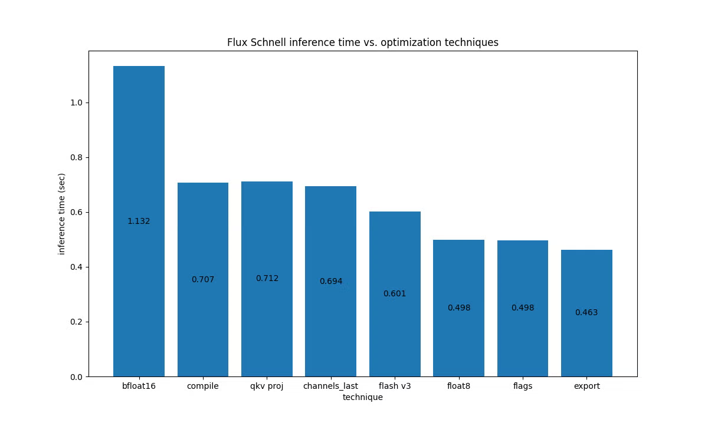
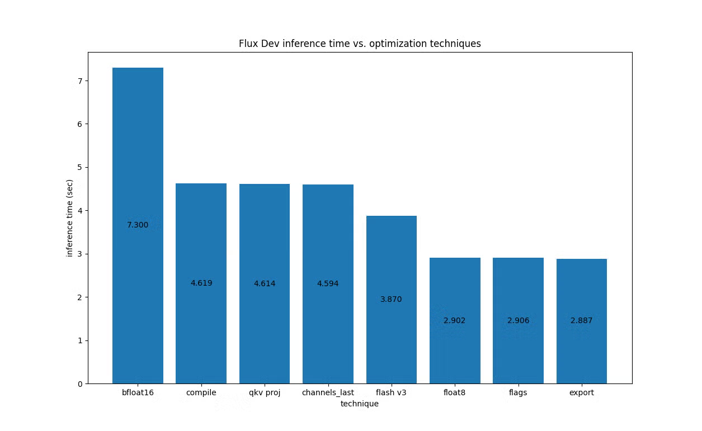

> 블로그 출처: https://pytorch.org/blog/presenting-flux-fast-making-flux-go-brrr-on-h100s/ By Joel Schlosser (Meta), Christian Puhrsch (Meta), and Sayak Paul (Hugging Face)June 25, 2025 . 이 블로그는 Meta와 Hugging Face 팀이 네이티브 PyTorch 코드를 사용해 Flux.1-Schnell과 Flux.1-Dev 모델을 H100 GPU에서 약 2.5배 가속한 최적화를 소개한다. 주요 최적화 기술에는 `torch.compile`과 `fullgraph=True`, `max-autotune` 모드 사용, attention 계산의 q/k/v projection 병합, Flash Attention v3와 float8 quantization 채택, 특정 Inductor 튜닝 flag 적용, 그리고 `torch.export`+AOT 컴파일+CUDAGraphs를 통한 framework overhead 제거가 포함된다. 블로그는 torch.compile 성능에서 CPU-GPU synchronization point 제거가 중요하다는 점도 특별히 지적하며, 이미지 품질을 기본적으로 유지하면서 추론 성능을 크게 향상시킨 효과를 보여준다. 공식 계정의 이 글 번역은 과학 보급과 지식 전파만을 위한 것이며, 권리 침해 시 삭제한다.

# Presenting Flux Fast: H100에서 Flux를 초고속으로 달리게 하기

이전 글 diffusion-fast(https://pytorch.org/blog/accelerating-generative-ai-3/)에서 우리는 네이티브 PyTorch 코드를 사용해 Stable Diffusion XL (SDXL) pipeline을 3배 속도로 최적화하는 방법을 보여주었다. 그 당시 SDXL은 이미지 생성 분야의 오픈소스 state-of-the-art pipeline이었다. 놀랍지 않게도 그 이후 많은 변화가 있었고, Flux(https://blog.fal.ai/flux-the-largest-open-sourced-text2img-model-now-available-on-fal/)는 이제 이 분야에서 가장 강력한 open-weight 모델 중 하나라고 할 수 있다.

이 글에서는 (주로) 순수 PyTorch 코드와 H100 같은 강력한 GPU를 사용해 Flux.1-Schnell과 Flux.1-Dev에서 약 2.5배 가속을 달성하는 방법을 보여주게 되어 매우 기쁘다.

코드를 바로 사용해 보고 싶다면 여기에서 코드 저장소(https://github.com/huggingface/flux-fast/)를 찾을 수 있다.

## 최적화 개요

Diffusers 라이브러리에서 제공하는 pipeline은 최대한 `torch.compile` 친화적으로 되어 있다. 이는 다음을 의미한다.

- 가능한 한 graph break를 피한다.
- 가능한 한 recompile을 피한다.
- CPU<->GPU synchronization을 줄이거나 최소화해 inductor cache lookup overhead를 낮춘다.

따라서 이것은 이미 합리적인 출발점을 제공한다. 이 프로젝트에서 우리는 diffusion-fast 프로젝트에서 사용한 것과 같은 기본 원칙을 채택하고, 이를 FluxPipeline(https://huggingface.co/docs/diffusers/main/en/api/pipelines/flux)에 적용했다. 아래에서는 적용한 최적화 개요를 공유한다(자세한 정보는 코드 저장소(https://github.com/huggingface/flux-fast/)를 참고하라).

- `torch.compile`은 `fullgraph=True`와 `max-autotune` 모드를 사용해 CUDAGraphs 사용을 보장한다.
- attention 계산을 위한 q, k, v projection을 병합한다. 이는 quantization 과정에서 특히 유용한데, dimension density를 높여 계산 밀도를 높이기 때문이다.
- decoder 출력에 `torch.channels_last` memory format을 사용한다.
- Flash Attention v3 (FA3)(https://pytorch.org/blog/flashattention-3/)와 입력을 `torch.float8_e4m3fn` dtype으로 (비 scaling) 변환하는 방식을 함께 사용한다.
- torchao의 `float8_dynamic_activation_float8_weight`를 통해 dynamic float8 activation quantization과 Linear layer weight quantization을 수행한다.
- 이 모델에서 Inductor 성능을 튜닝하기 위한 몇 가지 flag:
    - `conv_1x1_as_mm = True`
    - `epilogue_fusion = False`
    - `coordinate_descent_tuning = True`
    - `coordinate_descent_check_all_directions = True`
- `torch.export` + Ahead-of-time Inductor (AOTI) + CUDAGraphs

이 최적화의 대부분은 이름만으로 의미가 분명하지만, 다음 두 가지는 예외다.

- Inductor flag. 관심 있는 독자는 이 블로그 글(https://pytorch.org/blog/accelerating-generative-ai-3/)에서 더 많은 세부 사항을 볼 수 있다.
- AoT 컴파일을 통해 우리는 framework overhead를 제거하고 torch.export로 내보낼 수 있는 compile binary를 얻는 것을 목표로 한다. CUDAGraphs를 통해서는 kernel launch 최적화를 달성하고자 한다. 더 자세한 정보는 이 글(https://pytorch.org/blog/accelerating-generative-ai-4/)에서 찾을 수 있다.

LLM과 달리 diffusion 모델은 주로 compute bound이므로, gpt-fast(https://pytorch.org/blog/accelerating-generative-ai-2/)의 최적화를 여기에는 완전히 적용할 수 없다. 아래 그림은 각 최적화가 H100 700W GPU의 Flux.1-Schnell에 미치는 영향을 보여준다. 왼쪽에서 오른쪽으로 갈수록 최적화가 점진적으로 적용된다.

H100의 Flux.1-Dev에 대해서는 다음 결과를 얻었다.

아래는 서로 다른 최적화를 Flux.1-Dev에 적용해 얻은 이미지 시각 비교다.

주의할 점은 FP8 quantization만 본질적으로 lossy라는 것이다. 따라서 이 최적화 대부분에서는 이미지 품질이 동일하게 유지되어야 한다. 하지만 이 경우 FP8에서도 차이가 매우 작다는 것을 볼 수 있다.

## CUDA synchronization에 대한 설명

연구 과정에서 우리는 denoising loop의 첫 번째 step(https://github.com/huggingface/diffusers/blob/b0f7036d9af75c5df0f39d2d6353964e4c520534/src/diffusers/pipelines/flux/pipeline_flux.py#L900)에 scheduler의 이 step(https://github.com/huggingface/diffusers/blob/b0f7036d9af75c5df0f39d2d6353964e4c520534/src/diffusers/schedulers/scheduling_flow_match_euler_discrete.py#L355)으로 인해 발생하는 CPU<->GPU synchronization point가 있음을 발견했다. denoising loop 시작 시 `self.scheduler.set_begin_index(0)`을 추가하면 이를 제거할 수 있다 (PR)(https://github.com/huggingface/diffusers/pull/11696).

torch.compile을 사용할 때 이것은 실제로 더 큰 영향을 만든다. CPU가 synchronization을 기다린 뒤에야 Dynamo cache lookup을 수행하고 GPU에서 instruction을 시작할 수 있는데, 이 cache lookup은 약간 느리기 때문이다. 따라서 핵심은 pipeline 구현을 performance analysis하고, compile의 이점을 얻기 위해 가능한 한 이런 synchronization을 제거하는 것이 현명하다는 점이다.

## 결론

이 글은 Hopper 아키텍처에 맞춰 Flux를 최적화하는 네이티브 PyTorch 코드 방식을 소개했다. 이 방식은 간결성과 성능 사이의 균형을 잡으려 한다. 다른 유형의 최적화도 가능할 수 있다(예를 들어 fused MLP kernel과 fused adaptive LayerNorm kernel 사용). 하지만 간결함을 위해 자세히 소개하지 않았다.

또 다른 핵심은 Hopper 아키텍처를 가진 GPU가 보통 비용이 높다는 점이다. 따라서 consumer-grade GPU에서 합리적인 속도-메모리 tradeoff를 제공하기 위해, Diffusers 라이브러리에는 다른(보통 `torch.compile`과 호환되는) 옵션도 제공된다. 여기(https://huggingface.co/docs/diffusers/main/en/optimization/memory)와 여기(https://huggingface.co/docs/diffusers/main/en/optimization/fp16)에서 확인해 보기를 권한다.

다른 모델에서도 이 기술들을 시도하고 결과를 공유해 주기 바란다. 즐거운 최적화가 되길!

