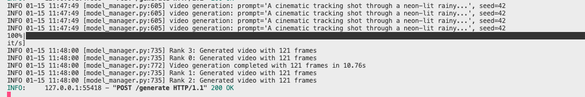

## 0x0. 서문
 
최근 나와 [DefTruth](https://github.com/DefTruth)는 Cache-DIT에서 LTX-2 모델을 지원했으며, 대응 PR은 다음과 같다.
 
https://github.com/vipshop/cache-dit/pull/691
 
Cache-DIT가 LTX-2에 적응하는 몇 가지 핵심 지점을 기록한다. 초점은 cache 측 적응(`functor_ltx2.py`)에 둔다. Parallel-Text-Encoder / Parallel-Vae 적응은 상대적으로 간단하고 기존 예시를 참고하면 되므로 자세히 반복하지 않는다. Cache-DIT에 새 모델 적응 요구가 있는 분들은 참고할 수 있다.

 
- **모델 측**: LTX-2는 T2V / I2V를 동시에 지원하며, 생성된 비디오에는 오디오가 포함된다.
- **프레임워크 측**: Cache-DIT의 cache 특성에 적응시키기 위해 LTX-2용 patch(`functor_ltx2.py`)를 추가했다. 또한 H100 Ulysses4 OOM을 피하기 위해 `--parallel-text-encoder`와 `--parallel-vae` 두 feature도 연결했다.

이 모델에 대한 더 많은 정보는 https://huggingface.co/Lightricks/LTX-2 에서 볼 수 있다.

# 0x1. 효과

## Text2Video

```python
prompt = (
            "A cinematic tracking shot through a neon-lit rainy cyberpunk street at night. "
            "Reflections shimmer on wet asphalt, holographic signs flicker, and steam rises from vents. "
            "A sleek motorbike glides past the camera in slow motion, droplets scattering in the air. "
            "Smooth camera motion, natural parallax, ultra-realistic detail, cinematic lighting, film look."
        )
        negative_prompt = (
            "shaky, glitchy, low quality, worst quality, deformed, distorted, disfigured, motion smear, "
            "motion artifacts, bad anatomy, ugly, transition, static, text, watermark."
        )
```

## Image2Video

```python
prompt = (
            "An astronaut hatches from a fragile egg on the surface of the Moon, the shell cracking and peeling "
            "apart in gentle low-gravity motion. Fine lunar dust lifts and drifts outward with each movement, "
            "floating in slow arcs before settling back onto the ground. The astronaut pushes free in a deliberate, "
            "weightless motion, small fragments of the egg tumbling and spinning through the air. In the background, "
            "the deep darkness of space subtly shifts as stars glide with the camera's movement, emphasizing vast "
            "depth and scale. The camera performs a smooth, cinematic slow push-in, with natural parallax between the "
            "foreground dust, the astronaut, and the distant starfield. Ultra-realistic detail, physically accurate "
            "low-gravity motion, cinematic lighting, and a breath-taking, movie-like shot."
        )
        negative_prompt = (
            "shaky, glitchy, low quality, worst quality, deformed, distorted, disfigured, motion smear, "
            "motion artifacts, fused fingers, bad anatomy, weird hand, ugly, transition, static."
        )
```

# 0x2. Benchmark

T2V를 예로 들면 다음과 같다.

```shell
CACHE_DIT_LTX2_PIPELINE=t2v CUDA_VISIBLE_DEVICES=0,1,2,3 torchrun --nproc_per_node=4 \
        -m cache_dit.serve.serve \
        --model-path Lightricks/LTX-2 \
        --parallel-type ulysses \
        --parallel-text-encoder \
        --parallel-vae \
        --cache \
        --ulysses-anything

DIT_LTX2_MODE=base python -m pytest -q cache-dit/tests/serving/test_ltx2_text2video.py
```

비디오 파라미터는 다음과 같다.

```python
prompt = (
    "A cinematic tracking shot through a neon-lit rainy cyberpunk street at night. "
    "Reflections shimmer on wet asphalt, holographic signs flicker, and steam rises from vents. "
    "A sleek motorbike glides past the camera in slow motion, droplets scattering in the air. "
    "Smooth camera motion, natural parallax, ultra-realistic detail, cinematic lighting, film look."
)
negative_prompt = (
    "shaky, glitchy, low quality, worst quality, deformed, distorted, disfigured, motion smear, "
    "motion artifacts, bad anatomy, ugly, transition, static, text, watermark."
)
return call_api(
    prompt=prompt,
    negative_prompt=negative_prompt,
    name="ltx2_base_t2v",
    seed=42,
    width=1280,
    height=720,
    num_frames=121,
    fps=24,
    num_inference_steps=40,
    guidance_scale=4.0,
)
```



H100 4카드에서 약 23s 정도면 1080P 비디오를 생성한다.

## 0x1. LTX-2 모델은 무엇이 다른가
 
이번에 LTX-2를 연결하면서 가장 관심 있는 지점은 "또 하나의 비디오 모델이 늘었다"가 아니라, 본질적으로 **Audio-Visual Transformer**라는 점이다.
 
- **(1) 같은 모델 저장소가 T2V + I2V를 지원한다**
- **(2) 출력 비디오가 자체 오디오를 포함한다(video/audio 두 경로 latent가 함께 간다)**
 
이 두 점은 cache-dit 안에서 block cache의 추상을 어떻게 "정렬"할지에 직접적인 영향을 준다.
 
- **cache 측에서 block adapter / forward pattern matching을 어떻게 할 것인가**
- **Ulysses/Ring(context parallel)에서 timestep, mask, RoPE 분할이 올바른가**
- **TP(tensor parallel)에서 RoPE, qk norm 같은 세부 사항을 맞출 수 있는가**

## 0x2. Cache-DIT에서 T2V / I2V를 어떻게 로드하고 구분하는가
 
우리는 serving에서 직관적인 분기를 만들었다(`cache_dit/src/cache_dit/serve/model_manager.py`).
 
- `model_path`에 `LTX-2`가 포함되면 환경 변수 `CACHE_DIT_LTX2_PIPELINE`을 읽는다(기본값 `t2v`).
- `t2v`는 `diffusers.LTX2Pipeline`을 사용한다.
- `i2v`는 `diffusers.LTX2ImageToVideoPipeline`을 사용한다.
 
개인적으로 이 점은 사용자 경험에 좋다고 생각한다. 같은 모델 경로에서 작업 전환은 env 하나만 바꾸면 된다.

## 0x3. Cache 측에서 주로 무엇을 바꾸었나: 왜 `functor_ltx2.py` patch가 반드시 필요한가
 
이번 LTX-2 접속에서 가장 중요한 것은 "실행할 수 있다"가 아니라 --cache와의 호환성이다.

### 0x3.1 cache-dit의 Pattern_0은 block을 어떻게 호출하는가
 
cache-dit의 block cache 로직(Pattern_0/1/2)은 `cache_dit/src/cache_dit/caching/cache_blocks/pattern_base.py` 안에 있다.

각 block에 대한 호출 방식은 고정되어 있다.
 
- wrapper의 forward 형식 인자는 `(hidden_states, encoder_hidden_states, *args, **kwargs)`이다.
- block을 호출할 때는 항상 다음과 같다.
 
```python
hidden_states = block(hidden_states, encoder_hidden_states, *args, **kwargs)
```
 
그다음 block이 tuple을 반환하면 wrapper는 이를 "두 경로 출력"으로 처리한다(`_process_block_outputs`).

즉 cache-dit의 추상 관점에서 Pattern_0은 본래 두 경로이다.
 
- 첫 번째 경로: `hidden_states`
- 두 번째 경로: `encoder_hidden_states`
 
두 번째 경로가 실제로 어떤 의미인지(text인지, audio인지, 다른 것인지)는 cache-dit 자체가 신경 쓰지 않는다.

### 0x3.2 LTX-2의 block forward 입력 인자 순서는 이 추상과 호환되지 않는다
 
`cache_dit/src/cache_dit/caching/block_adapters/adapters.py`에서 나는 LTX-2를 `ForwardPattern.Pattern_0`으로 분류했다. 그 block이 실제로 두 경로를 반환하기 때문이다.
 
- LTX-2 block은 `(hidden_states, audio_hidden_states)`를 반환한다.
 
동시에 adapter 안에도 명확한 선택을 적어 두었다. `audio_hidden_states`를 Pattern_0의 "두 번째 경로"로 사용한다.

하지만 문제가 생긴다.
 
cache-dit의 wrapper가 block을 호출할 때 두 번째 위치 인자는 고정적으로 `encoder_hidden_states`라고 부른다.

반면 LTX-2의 block forward(diffusers)에서 두 번째 위치 인자는 "텍스트 encoder hidden states"가 아니라 `audio_hidden_states`이다.

patch를 하지 않고 cache wrapper가 기본 방식으로 그대로 호출하게 하면 다음과 같다.
 
```python
block(hidden_states, encoder_hidden_states, ...)
```
 
그러면 LTX-2 block 관점에서는 이 `encoder_hidden_states`(텍스트 embeddings)가 잘못해서 `audio_hidden_states` 위치 인자로 전달된다.

이렇게 되면 오류가 발생한다.

### 0x3.3 patch 방식: transformer.forward 안에서 block 호출의 앞 네 입력을 위치에 맞춰 정렬한다
 
그래서 `functor_ltx2.py`에서 하는 일은 매우 명확하다.

- `LTX2PatchFunctor`로 `LTX2VideoTransformer3DModel.forward`를 `__patch_transformer_forward__`로 교체한다.
- `for block in self.transformer_blocks:` 안에서 block을 호출할 때 LTX-2 block의 실제 signature에 맞춰 앞 네 입력을 명시적으로 위치 인자로 전달한다.
 
```python
hidden_states, audio_hidden_states = block(
    hidden_states,
    audio_hidden_states,
    encoder_hidden_states,
    audio_encoder_hidden_states,
    ...
)
```
 
이렇게 한 뒤에는 다음과 같다.
 
- block의 두 번째 위치 인자는 자신이 원하는 `audio_hidden_states`를 받는다.
- block은 `(hidden_states, audio_hidden_states)`를 반환하고, cache-dit의 Pattern_0은 마침 "두 번째 경로"를 `encoder_hidden_states`처럼 cache한다.
- 진짜 텍스트 embeddings(`encoder_hidden_states/audio_encoder_hidden_states`)는 내가 세 번째, 네 번째 위치 인자로 전달하여, cache wrapper의 `encoder_hidden_states`라는 인자와 충돌하지 않게 한다.

또한 Ulysses4가 OOM이 나지 않도록 parallel-text-encoder TP + parallel VAE 적응도 했다.

TP plan / CP plan 부분은 다른 모델과 큰 차이가 없다. 이번에는 기본적으로 diffusers의 LTX-2 구현을 따라 필요한 입력을 잘라 주었다.

## 0x6. 어떻게 사용하는가
 
### 0x6.1 examples(멀티 카드: Ulysses/TP + cache)
 
```bash
torchrun --nproc_per_node=4 generate.py ltx2_t2v \
  --parallel ulysses --parallel-vae --parallel-text-encoder --cache
 
torchrun --nproc_per_node=4 generate.py ltx2_t2v \
  --parallel tp --parallel-vae --parallel-text-encoder --cache
 
torchrun --nproc_per_node=4 generate.py ltx2_i2v \
  --parallel ulysses --parallel-vae --parallel-text-encoder --cache
 
torchrun --nproc_per_node=4 generate.py ltx2_i2v \
  --parallel tp --parallel-vae --parallel-text-encoder --cache
```
 
### 0x6.2 serving(T2V/I2V는 env로 pipeline 전환)
 
T2V:
 
```bash
CACHE_DIT_LTX2_PIPELINE=t2v CUDA_VISIBLE_DEVICES=0,1,2,3 torchrun --nproc_per_node=4 \
  -m cache_dit.serve.serve \
  --model-path Lightricks/LTX-2 \
  --parallel-type ulysses \
  --parallel-text-encoder \
  --parallel-vae \
  --cache \
  --ulysses-anything
```
 
I2V:
 
```bash
CACHE_DIT_LTX2_PIPELINE=i2v CUDA_VISIBLE_DEVICES=0,1,2,3 torchrun --nproc_per_node=4 \
  -m cache_dit.serve.serve \
  --model-path Lightricks/LTX-2 \
  --parallel-type ulysses \
  --parallel-text-encoder \
  --parallel-vae \
  --cache \
  --ulysses-anything
```

### 0x6.3 어떻게 테스트하는가

```shell
CACHE_DIT_LTX2_MODE=base python -m pytest -q cache-dit/tests/serving/test_ltx2_text2video.py
CACHE_DIT_LTX2_MODE=base python -m pytest -q cache-dit/tests/serving/test_ltx2_image2video.py
```

전체 테스트 코드는 다음을 참조하라: https://github.com/vipshop/cache-dit/blob/main/tests/serving/test_ltx2_text2video.py & https://github.com/vipshop/cache-dit/blob/main/tests/serving/test_ltx2_image2video.py
