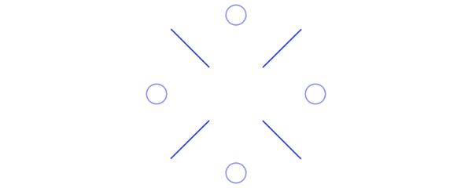
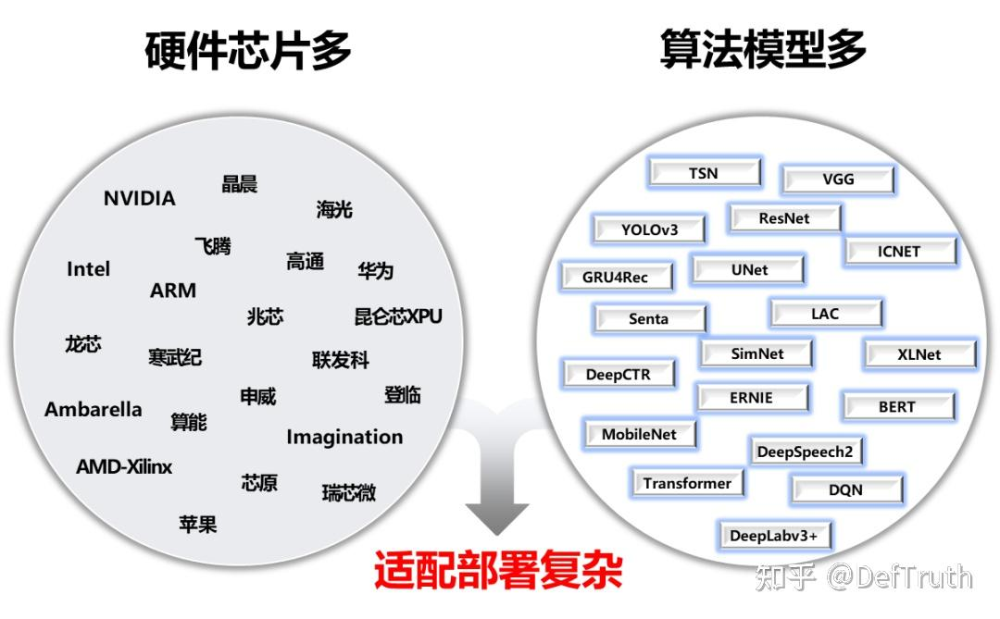
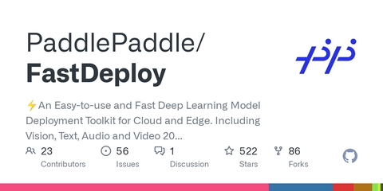
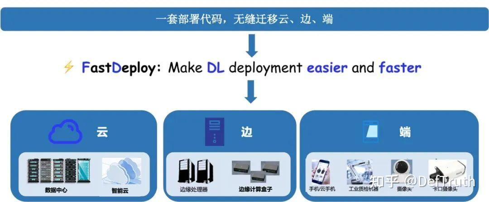
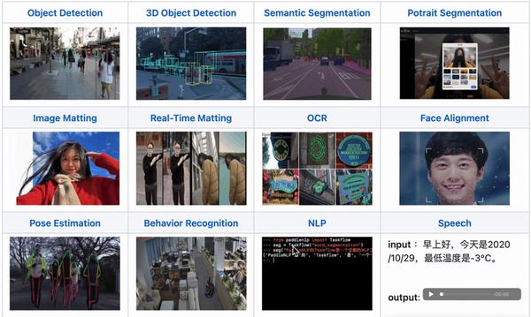
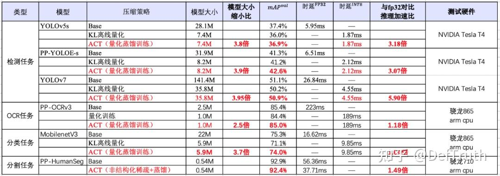
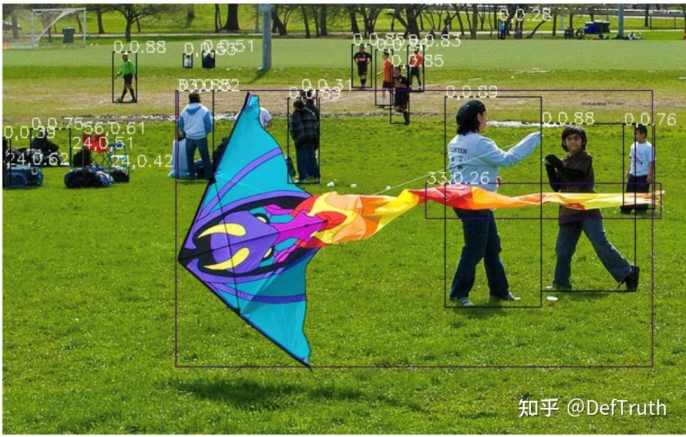

# [배포][CV/NLP] FastDeploy: 3줄 코드로 150+ 모델 배포

> 원문: https://zhuanlan.zhihu.com/p/581326442

### 서문

DefTruth다. 평범한 code writer다. 좋은 기억력보다 엉성한 기록이 낫다. 기술 글을 쓰는 것은 output이기도 하고 input이기도 하다. 이전에는 모델 배포와 관련된 글을 계속 썼고, 여가 시간에는 내 open source project인 `lite.ai.toolkit`도 유지했다. 그런데 최근 한동안 글을 갱신하지 않았다. 이유는 최근 몇 달 동안 FastDeploy 개발에 꽤 높은 밀도로 참여했기 때문이다.

그렇다면 FastDeploy는 어떤 도구인가. 어떤 문제를 해결하는가. 이 글에서 이 배포 도구를 간단히 공유한다.

이 글은 FastDeploy 기술 공유 column의 첫 번째 글이다. 이후에도 FastDeploy 사용법을 더 공유할 예정이다.


FastDeploy 기술 공유 column.

### 본문

아래 내용은 PaddlePaddle 공식 WeChat 계정에서 옮긴 것이다. 더 많은 내용은 PaddlePaddle 공식 계정을 참고하면 된다.



AI 산업 응용의 발전 속도가 점점 빨라지면서, 개발자가 마주해야 하는 adaptation과 deployment 작업도 점점 복잡해지고 있다. 계속 등장하는 algorithm model, 다양한 architecture의 AI hardware, 서로 다른 deployment requirement(server, service deployment, embedded, mobile 등), 다른 OS와 development language는 AI developer가 project를 실제로 landing하는 데 적지 않은 부담을 준다.



AI deployment landing의 어려움을 해결하기 위해 FastDeploy project를 시작했다. FastDeploy는 산업 landing scenario에서 중요한 AI model의 model API를 표준화하고, 다운로드하면 바로 실행할 수 있는 demo example을 제공한다. 전통적인 inference engine과 비교해 end-to-end inference performance optimization을 수행한다. FastDeploy는 online(service deployment)과 offline deployment 형태도 지원해 서로 다른 developer의 deployment 요구를 만족한다.

1년 동안 높은 밀도로 다듬은 결과, FastDeploy는 현재 세 가지 특징을 갖는다.

- **all-scenario**: GPU, CPU, Jetson, ARM CPU, Rockchip NPU, Amlogic NPU, NXP NPU 등 여러 hardware를 지원한다. local deployment, service deployment, web deployment, mobile deployment 등을 지원한다. CV, NLP, Speech 세 domain을 지원하고, image classification, image segmentation, semantic segmentation, object detection, OCR, face detection/recognition, portrait matting, pose estimation, text classification, information extraction, pedestrian tracking, speech synthesis 등 16개 주요 algorithm scenario를 지원한다.
- **easy and flexible**: 3줄 코드로 AI model deployment를 끝내고, 1줄 코드로 backend inference engine과 deployment hardware를 빠르게 바꾼다. unified API로 다른 deployment scenario 사이를 거의 비용 없이 옮길 수 있다. 150개 이상의 인기 AI model deployment demo를 제공한다.
- **highly efficient**: 전통적인 deep learning inference engine은 model inference time만 주로 보지만, FastDeploy는 model task의 end-to-end deployment performance를 본다. high-performance pre/post-processing, high-performance inference engine integration, one-click automatic compression 등을 통해 AI model inference deployment 성능을 극한까지 끌어올린다.

Project link:



GitHub - PaddlePaddle/FastDeploy: An easy-to-use and fast deep learning model deployment toolkit for cloud and edge. Vision, Text, Audio, Video의 주요 scenario와 150+ SOTA model을 포함하고, end-to-end optimization과 multi-platform, multi-framework support를 제공한다.

아래에서는 이 세 가지 특성을 조금 더 기술적으로 해석한다. 전체 글은 약 2100자이며 예상 읽기 시간은 3분이다.

- 1. 3대 특성
- 2. 3단계 deployment 실전 미리 보기
- CPU/GPU deployment 실전
- Jetson deployment 실전
- RK3588 deployment 실전(RV1126, Amlogic A311D 등 NPU도 유사)

### 3대 특성 해석

- **all-scenario: code 한 세트로 cloud, edge, device의 multi-platform, multi-hardware를 모두 다룬다. CV, NLP, Speech를 포괄하고 Paddle Inference, TensorRT, OpenVINO, ONNX Runtime, Paddle Lite, RKNN 등 backend를 지원한다. 일반적인 NVIDIA GPU, x86 CPU, ARM CPU(mobile, ARM board), Rockchip NPU(RK3588, RK3568, RV1126, RV1109, RK1808), Amlogic NPU(A311D, S905D) 등 cloud-edge-device scenario의 여러 AI hardware deployment를 지원한다. 동시에 service deployment, offline CPU/GPU deployment, edge/mobile deployment 방식을 지원한다. 서로 다른 hardware에 대해서도 unified API로 data center, edge deployment, device-side deployment를 자연스럽게 전환한다.**



FastDeploy는 CV, NLP, Speech 세 AI domain을 지원한다. image classification, image segmentation, semantic segmentation, object detection, OCR, face detection, face landmark detection, face recognition, portrait matting, video matting, pose estimation, text classification, information extraction, text-image generation, pedestrian tracking, speech synthesis 등 16개 algorithm category를 포괄한다.

또 PaddleClas, PaddleDetection, PaddleSeg, PaddleOCR, PaddleNLP, PaddleSpeech라는 PaddlePaddle의 6개 인기 AI suite의 주요 model을 지원하고, PyTorch, ONNX 등 ecosystem의 인기 model deployment도 지원한다.



- **easy and flexible: 3줄 코드로 model deployment를 끝내고, 1줄 command로 inference backend와 hardware를 바꾼다. 150+ 인기 model deployment를 빠르게 체험한다.**

FastDeploy는 세 줄 코드로 서로 다른 hardware의 AI model deployment를 끝낼 수 있어 AI model deployment의 난도와 작업량을 크게 낮춘다. 한 줄 command로 TensorRT, OpenVINO, Paddle Inference, Paddle Lite, ONNX Runtime, RKNN 등 서로 다른 inference backend와 대응 hardware를 바꿀 수 있다.

낮은 진입 장벽의 inference engine backend integration 방안을 제공한다. 평균 1주일이면 임의 hardware inference engine을 붙여 사용할 수 있다. front/back-end architecture design을 decouple하고, 간단한 compile/test만으로 FastDeploy가 지원하는 AI model을 체험할 수 있다. developer는 model API에 따라 해당 model deployment를 직접 구현할 수도 있고, `git clone`으로 150+ 인기 AI model deployment demo를 한 번에 받아 빠르게 inference deployment를 체험할 수도 있다.

- **FastDeploy로 서로 다른 model 배포**

```python
# PP-YOLOE deployment
import fastdeploy as fd
import cv2
model = fd.vision.detection.PPYOLOE("model.pdmodel",
                                    "model.pdiparams",
                                     "infer_cfg.yml")
im = cv2.imread("test.jpg")
result = model.predict(im)

# YOLOv7 deployment
import fastdeploy as fd
import cv2
model = fd.vision.detection.YOLOv7("model.onnx")
im = cv2.imread("test.jpg")
result = model.predict(im)
```

- **FastDeploy backend와 hardware 전환**

```python
# PP-YOLOE deployment
import fastdeploy as fd
import cv2
option = fd.RuntimeOption()
option.use_cpu()
option.use_openvino_backend() # 한 줄 command로 OpenVINO deployment로 전환
model = fd.vision.detection.PPYOLOE("model.pdmodel",
                                    "model.pdiparams",
                                    "infer_cfg.yml",
                                    runtime_option=option)
im = cv2.imread("test.jpg")
result = model.predict(im)
```

- **highly efficient: one-click compression acceleration, preprocessing acceleration, end-to-end performance optimization으로 AI algorithm 산업 landing을 개선한다.**

FastDeploy는 TensorRT, OpenVINO, Paddle Inference, Paddle Lite, ONNX Runtime, RKNN 등 high-performance inference의 장점을 흡수한다. 동시에 end-to-end inference optimization으로, 전통적인 inference engine이 model inference speed만 보는 문제를 해결하고 전체 inference speed와 performance를 개선한다.

automatic compression tool을 통합해 parameter 수를 크게 줄이면서도 accuracy는 거의 손실하지 않고 inference speed를 크게 높인다. CUDA를 사용해 pre-processing과 post-processing module을 optimize하고, YOLO series model inference 전체를 41ms에서 25ms로 줄인다. end-to-end optimization strategy로 AI deployment landing에서의 performance 문제를 해결한다.

더 많은 performance optimization은 GitHub에서 확인하면 된다.



### 3단계 deployment 실전

CPU/GPU deployment 실전. YOLOv7을 예로 든다.

- FastDeploy deployment package 설치, deployment example 다운로드. 선택 사항이며, 3줄 API로 deployment code를 직접 구현해도 된다.

```bash
pip install fastdeploy-gpu-python -f https://www.paddlepaddle.org.cn/whl/fastdeploy.html
git clone https://github.com/PaddlePaddle/FastDeploy.git
cd examples/vision/detection/yolov7/python/
```

- **model file과 test image 준비**

```bash
wget https://bj.bcebos.com/paddlehub/fastdeploy/yolov7.onnx
wget https://gitee.com/paddlepaddle/PaddleDetection/raw/release/2.4/demo/000000014439.jpg
```

- **CPU/GPU inference model**

```bash
# CPU inference
python infer.py --model yolov7.onnx --image 000000014439.jpg --device cpu
# GPU inference
python infer.py --model yolov7.onnx --image 000000014439.jpg --device gpu
# TensorRT inference on GPU
python infer.py --model yolov7.onnx --image 000000014439.jpg --device gpu --use_trt True
```

- **inference result example**


**Jetson deployment 실전. YOLOv7을 예로 든다.**

- **FastDeploy deployment package 설치와 environment variable 구성**

```bash
git clone https://github.com/PaddlePaddle/FastDeploy cd FastDeploy
mkdir build && cd build
cmake .. ­DBUILD_ON_JETSON=ON ­DENABLE_VISION=ON ­DCMAKE_INSTALL_PREFIX=${PWD}/install make ­j8
make install
cd FastDeploy/build/install
source fastdeploy_init.sh
```

- **model file과 test image 준비**

```bash
wget https://bj.bcebos.com/paddlehub/fastdeploy/yolov7.onnx
wget https://gitee.com/paddlepaddle/PaddleDetection/raw/release/2.4/demo/000000014439.jpg
```

- **inference model compile**

```bash
cd examples/vision/detection/yolov7/cpp
cmake .. ­DFASTDEPLOY_INSTALL_DIR=${FASTDEPOLY_DIR}
mkdir build && cd build
make ­j

# TensorRT inference 사용. model이 TensorRT를 지원하지 않으면 자동으로 CPU inference로 전환된다.
./infer_demo yolov7s.onnx 000000014439.jpg 2
```

- **inference result example**



### RK3588 deployment 실전

경량 detection network PicoDet을 예로 든다.

- FastDeploy deployment package 설치와 deployment example 다운로드. 선택 사항이며, 3줄 API로 deployment code를 직접 구현해도 된다.

```bash
# compile 문서를 참고해 FastDeploy compile/install 완료
# 문서 링크: https://github.com/PaddlePaddle/FastDeploy/blob/develop/docs/cn/build_and_install/rknpu2.md
# deployment example code 다운로드
git clone https://github.com/PaddlePaddle/FastDeploy.git
cd examples/vision/detection/paddledetection/rknpu2/python
```

- **model file과 test image 준비**

```bash
wget https://bj.bcebos.com/fastdeploy/models/rknn2/picodet_s_416_coco_npu.zip
unzip -qo picodet_s_416_coco_npu.zip
## Paddle static graph model 다운로드 후 압축 해제
wget https://bj.bcebos.com/fastdeploy/models/rknn2/picodet_s_416_coco_npu.zip
unzip -qo picodet_s_416_coco_npu.zip
# static graph를 ONNX model로 변환. 여기의 save_file은 zip package 이름과 맞춰야 한다.
paddle2onnx --model_dir picodet_s_416_coco_npu \
 --model_filename model.pdmodel \
 --params_filename model.pdiparams \
 --save_file picodet_s_416_coco_npu/picodet_s_416_coco_npu.onnx \
 --enable_dev_version True

python -m paddle2onnx.optimize --input_model picodet_s_416_coco_npu/picodet_s_416_coco_npu.onnx \
 --output_model picodet_s_416_coco_npu/picodet_s_416_coco_npu.onnx \
 --input_shape_dict "{'image':[1,3,416,416]}"
# ONNX model을 RKNN model로 변환
# model은 picodet_s_320_coco_lcnet_non_postprocess directory에 생성된다.
python tools/rknpu2/export.py --config_path tools/rknpu2/config/RK3588/picodet_s_416_coco_npu.yaml

# image 다운로드
wget https://gitee.com/paddlepaddle/PaddleDetection/raw/release/2.4/demo/000000014439.jpg
```

- **inference model**

```bash
python3 infer.py --model_file ./picodet _3588/picodet_3588.rknn \
 --config_file ./picodet_3588/deploy.yaml \
 --image images/000000014439.jpg
```

- **FastDeploy 기술 교류 group 참여**

- **group benefit** FastDeploy: 이번 update 외에도 hardware capability는 계속 확장 중이다. Graphcore, Phytium, ARM CPU(Android, iOS, ARMLinux), Qualcomm, Ascend, Horizon, Kunlun, Aixin Yuanzhi 등이 포함된다. service deployment, Jetson에서 hardware decoding 기반 system solution(곧 release), end-to-end high-performance optimization 등도 계속 다룬다. deployment landing에서 모두가 관심을 가지는 speed, performance, system 문제를 실제로 해결하는 것이 목표다. group에 들어오면 product release 최신 정보를 얻을 수 있다. developer가 FastDeploy의 deployment capability를 더 이해하고 project에 더 빠르게 사용할 수 있도록 live technical exchange event도 준비했다.

- **live time:** 2022.11.9 - 11.11 20:30.

GitHub link:
