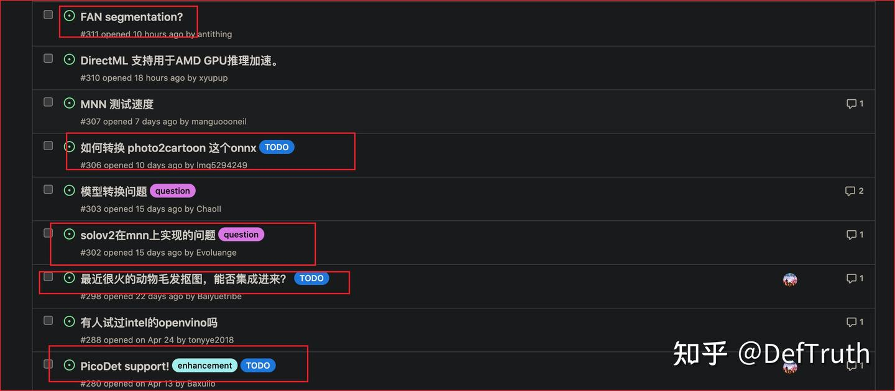

# [배포][CV] lite.ai.toolkit에 새 모델 추가하기

> 원문: https://zhuanlan.zhihu.com/p/523876625

### 0. 최근 생각

여가 시간에 C++ AI model toolkit을 하나 만들었다. 이름은 **lite.ai.toolkit**이다. 이 repository를 처음 시작한 이유는 거창한 vision이나 계획이 아니라, 내가 접한 algorithm을 더 잘 이해하고 그 detail을 더 잘 파악하기 위해서였다.

내가 보기에는 어떤 것은 C++ level에 놓고 봐야 가장 실제적인 detail에 닿을 수 있다. 예를 들어 object detection에서는 post-processing에 anchor generation과 coordinate reverse calculation이 들어간다. `20x20x?` output이 주어졌을 때, C++로 anchor를 정확히 계산하고, predicted offsets의 memory index와 anchor index를 정확히 대응시켜 마지막 bounding box를 오차 없이 복원할 수 있다면, 그 logic의 detail을 어느 정도 이해했다고 본다.

그래서 paper를 읽거나 새 algorithm을 이해할 때, 나는 보통 C++로 inference를 한번 구현해 보는 쪽을 선호한다. `lite.ai.toolkit`은 그런 code를 보관하는 장소다. 예상 밖으로 나중에 만든 model이 점점 많아졌고, 조금씩 관심을 받기 시작했다. 그래서 이 code들을 library로 묶어 보자는 생각이 생겼고, 지금의 `lite.ai.toolkit`이 되었다. 현재까지 **1.5k+ stars**를 받았다.

솔직히 말하면 개인적으로는 조심스럽다. 이 일 자체의 난도가 아주 높지 않다는 것을 알고 있고, `lite.ai.toolkit` code quality도 평범하다. 다만 내가 마침 이렇게 했을 뿐이다. 그래도 community의 지원에는 감사한다.

`lite.ai.toolkit`은 아직 내가 마음속으로 인정하는 1.0 version에 도달하지 않았다. 적어도 100+ model이 있어야 하고, 핵심 pre/post-processing에 대한 targeted performance optimization이 있어야 하며, 충분히 분해 가능하고 2차 개발이 쉬워야 한다. 예를 들어 MediaPipe 기반으로 2차 개발을 하려면 꽤 어렵다. 또 기본적인 multi-platform prebuilt library도 있어야 한다. 그래도 내가 계속 algorithm이나 engineering을 하고 있다면 이 작은 tool은 계속 유지할 것이다. 길게 볼 일이다.

### 1. 이 글에서 다루는 내용

이 글은 무엇을 다루는가. `lite.ai.toolkit`을 쓰는 사람이 조금씩 늘고 있고, 최근 새 model을 `lite.ai.toolkit`에 추가하고 싶다는 issue가 많아졌다. 본질적으로는 `lite.ai.toolkit`을 어떻게 2차 개발할 것인가의 문제다. 최근 issue는 대략 다음과 같다.



다만 내 여가 시간이 제한되어 있어 새 model 추가 요구를 제때 만족시키기 어렵다. 그래서 이 글에서는 자신의 model을 `lite.ai.toolkit`에 추가하는 방법을 설명한다.

`lite.ai.toolkit`에는 비교적 새로운 base model이 몇 가지 통합되어 있다. 예를 들면 face detection, face recognition, matting, face attribute analysis, image classification, face landmark detection, image colorization, object detection 등이다. 구체적인 scenario에 바로 사용할 수 있다.

하지만 `lite.ai.toolkit`의 model 수는 제한적이다. 특정 scenario에서는 사용자가 직접 optimize한 model이 있을 수 있다. 예를 들어 직접 training한 object detector가 더 좋은 성능을 낼 수도 있다. 그렇다면 그 model을 어떻게 `lite.ai.toolkit`에 넣을 것인가. 이렇게 하면 `lite.ai.toolkit`의 기존 algorithm capability를 사용하면서도 구체 scenario에 맞출 수 있다.

`lite.ai.toolkit` repository에도 같은 주제로 issue를 열어 두었다. 궁금한 점은 그 issue에 남기면 가능한 한 답변한다.

### 2. Lite.AI.ToolKit code structure 소개

`lite.ai.toolkit`은 가능한 한 decoupled 방식으로 code를 관리한다. 서로 다른 inference engine 기반 implementation은 서로 독립적이다.

- code structure idea: ONNXRuntime version YOLOX와 MNN version YOLOX는 서로 독립적이다. 각 code는 다른 directory에서 관리된다. ONNXRuntime version implementation만 compile할 수도 있다.
- 단점과 장점: 이 방식의 단점은 duplicate code를 피하기 어렵다는 것이다. 하지만 AI atomic capability level에서는 완전히 독립적이다. 예를 들어 ONNXRuntime version YOLOX만 필요하다면 다른 model의 cpp/h file을 전부 삭제하고 `yolox.cpp`, `yolox.h`만 남겨도 된다. 또 compile time에 어떤 model을 쓸지 결정할 수 있다. 필요 없는 model은 compile하지 않아도 되므로 build된 library도 크지 않다. 이 기능은 나중에 추가할 예정이다.

2차 개발 이야기로 돌아온다. `lite.ai.toolkit` user가 자기 model을 추가하기 편하도록 code layout을 간단히 소개한다.

- `lite` folder

이 folder root에는 모든 주요 code가 들어 있다. structure는 다음과 같다.

```text
# --------------------------- project 전체를 관리하는 code. downstream module들이 의존한다 ----------------------------------
├── backend.h          # macro 처리. base inference engine 결정. 현재는 ONNXRuntime이 필수
├── config.h           # macro 처리
├── config.h.in        # CMake compile 시 macro 처리
├── lite.ai.defs.h     # macro 처리
├── lite.ai.headers.h  # base dependency library include
├── lite.h             # project의 base public module include
├── pipeline           # 아직 사용하지 않음
├── pipeline.h         # 아직 사용하지 않음
├── types.h            # base type. 중요하다. downstream module에서 재사용된다. 예를 들어 ort::types는 실제로 types의 alias다.
├── utils.cpp          # base utility function implementation. 중요하다. downstream module에서 재사용된다.
└── utils.h            # base utility function header
├── models.h           # model 전체 namespace management. 중요하다. 구현된 모든 model은 여기서 export해야 한다.

# --------------------------- 아래 각 부분은 서로 독립적이지만 위의 전체 부분에 의존한다 --------------------------
...
├── mnn
│   ├── core     # MNN base parent class와 specific function implementation. 반드시 읽어야 한다.
│   │   ├── mnn_config.h
│   │   ├── mnn_core.h       # MNN model namespace management. class 구현 전에 여기 signature 추가
│   │   ├── mnn_defs.h
│   │   ├── mnn_handler.cpp  # base parent class implementation. 반드시 읽어야 한다.
│   │   ├── mnn_handler.h
│   │   ├── mnn_types.h
│   │   ├── mnn_utils.cpp
│   │   └── mnn_utils.h
│   └── cv      # 각 model의 구체 implementation. core의 parent class와 utility를 reference한다.
│       ├── mnn_age_googlenet.cpp
│       ├── mnn_age_googlenet.h
│       ├── mnn_cava_combined_face.cpp
...
├── ncnn
│   ├── core     # NCNN base parent class와 specific function implementation. 반드시 읽어야 한다.
│   │   ├── ncnn_config.h
│   │   ├── ncnn_core.h        # NCNN model namespace management. class 구현 전에 여기 signature 추가
│   │   ├── ncnn_custom.cpp
│   │   ├── ncnn_custom.h
│   │   ├── ncnn_defs.h
│   │   ├── ncnn_handler.cpp   # base parent class implementation. 반드시 읽어야 한다.
│   │   ├── ncnn_handler.h
│   │   ├── ncnn_types.h
│   │   ├── ncnn_utils.cpp
│   │   └── ncnn_utils.h
│   └── cv      # 각 model의 구체 implementation. core의 parent class와 utility를 reference한다.
│       ├── ncnn_age_googlenet.cpp
│       ├── ncnn_age_googlenet.h
│       ├── ncnn_cava_combined_face.cpp
│       ├── ncnn_cava_combined_face.h
│       ├── ncnn_cava_ghost_arcface.cpp
...
├── ort
│   ├── core     # ONNXRuntime base parent class와 specific function implementation. 반드시 읽어야 한다.
│   │   ├── ort_config.h
│   │   ├── ort_core.h        # ONNXRuntime model namespace management. class 구현 전에 여기 signature 추가
│   │   ├── ort_defs.h
│   │   ├── ort_handler.cpp   # base parent class implementation. 반드시 읽어야 한다.
│   │   ├── ort_handler.h
│   │   ├── ort_types.h
│   │   ├── ort_utils.cpp
│   │   └── ort_utils.h
│   └── cv      # 각 model의 구체 implementation. core의 parent class와 utility를 reference한다.
│       ├── age_googlenet.cpp
│       ├── age_googlenet.h
│       ├── cava_combined_face.cpp
│       ├── cava_combined_face.h
│       ├── cava_ghost_arcface.cpp
│       ├── cava_ghost_arcface.h
...
├── tnn
│   ├── core     # TNN base parent class와 specific function implementation. 반드시 읽어야 한다.
│   │   ├── tnn_config.h
│   │   ├── tnn_core.h        # TNN model namespace management. class 구현 전에 여기 signature 추가
│   │   ├── tnn_defs.h
│   │   ├── tnn_handler.cpp   # base parent class implementation. 반드시 읽어야 한다.
│   │   ├── tnn_handler.h
│   │   ├── tnn_types.h
│   │   ├── tnn_utils.cpp
│   │   └── tnn_utils.h
│   └── cv    # 각 model의 구체 implementation. core의 parent class와 utility를 reference한다.
│       ├── tnn_age_googlenet.cpp
│       ├── tnn_age_googlenet.h
│       ├── tnn_cava_combined_face.cpp
│       ├── tnn_cava_combined_face.h
│       ├── tnn_cava_ghost_arcface.cpp
│       ├── tnn_cava_ghost_arcface.h
│       ├── tnn_center_loss_face.cpp
```

### 3. model 추가 단계

아래에서는 YOLOX의 ONNXRuntime C++ version을 추가하는 것을 예로 새 model 추가 방법을 설명한다.

- 첫 번째 단계: YOLOX class signature 추가. `lite/ort/core/ort_core.h`에 `YoloX` signature를 추가한다. 다른 inference engine이라면 specific engine prefix를 붙인다. 예를 들면 `MNNYoloX`다.

```cpp
// lite/ort/core/ort_core.h
namespace ortcv
{
  // ...
  class LITE_EXPORTS YoloX;                      // [56] * reference: https://github.com/Megvii-BaseDetection/YOLOX
}
// lite/mnn/core/mnn_core.h
namespace mnncv
{
// ...
class LITE_EXPORTS MNNYoloX;                      // [3] * reference: https://github.com/Megvii-BaseDetection/YOLOX
}
```

- 두 번째 단계: `lite/ort/cv`에 `yolox.h`와 `yolox.cpp`를 새로 만든다. file name은 `xxx_core.h`에 넣은 이름과 되도록 일치시키는 것이 관리에 편하다. ONNXRuntime이 아닌 version에서는 inference engine prefix를 붙인다. 예를 들어 `mnn_yolox.h`, `mnn_yolox.cpp`다.

```text
├── ort
│   ├── core     # ONNXRuntime base parent class와 specific function implementation. 반드시 읽어야 한다.
│   │   ├── ort_config.h
│...
│   │   └── ort_utils.h
│   └── cv      # 각 model의 구체 implementation. core의 parent class와 utility를 reference한다.
│       ├── yolox.cpp
│       ├── yolox.h
```

- 세 번째 단계: `YoloX` class header를 작성한다. static dimension inference이고 single-input multi(single)-output model이므로 `BasicOrtHandler`를 상속할 수 있다. `lite/ort/core/ort_handler.cpp`의 구체 implementation은 직접 읽어야 한다. `BasicOrtHandler`에는 override해야 하는 virtual function `transform`이 있다.

최종 public interface는 API semantic을 통일하기 위해 `detect` naming convention을 유지한다. `detect`, `detect_video` 등의 naming convention을 반드시 지킨다. `detect`는 image-level detection interface이고, `detect_video`는 video-level detection interface다.

`types` namespace는 실제로 global `types`의 reference다. 따라서 `lite/types.h`에서 적절한 type이 있는지 확인한다. 없다면 `lite::types` namespace에 type을 추가한 뒤 `yolox.h`에서 사용한다. custom type은 가능한 단순하게 유지한다.

```cpp
#ifndef LITE_AI_ORT_CV_YOLOX_H
#define LITE_AI_ORT_CV_YOLOX_H

#include "lite/ort/core/ort_core.h"

namespace ortcv
{
  class LITE_EXPORTS YoloX : public BasicOrtHandler
  {
  public:
    explicit YoloX(const std::string &_onnx_path, unsigned int _num_threads = 1) :
        BasicOrtHandler(_onnx_path, _num_threads)
    {};

    ~YoloX() override = default;

  private:
    // nested classes
    typedef struct GridAndStride
    {
      int grid0;
      int grid1;
      int stride;
    } YoloXAnchor;

    typedef struct
    {
      float r;
      int dw;
      int dh;
      int new_unpad_w;
      int new_unpad_h;
      bool flag;
    } YoloXScaleParams;

  private:
    const float mean_vals[3] = {255.f * 0.485f, 255.f * 0.456, 255.f * 0.406f};
    const float scale_vals[3] = {1 / (255.f * 0.229f), 1 / (255.f * 0.224f), 1 / (255.f * 0.225f)};

    const char *class_names[80] = {
        "person", "bicycle", "car", "motorcycle", "airplane", "bus", "train", "truck", "boat", "traffic light",
        "fire hydrant", "stop sign", "parking meter", "bench", "bird", "cat", "dog", "horse", "sheep", "cow",
        "elephant", "bear", "zebra", "giraffe", "backpack", "umbrella", "handbag", "tie", "suitcase", "frisbee",
        "skis", "snowboard", "sports ball", "kite", "baseball bat", "baseball glove", "skateboard", "surfboard",
        "tennis racket", "bottle", "wine glass", "cup", "fork", "knife", "spoon", "bowl", "banana", "apple",
        "sandwich", "orange", "broccoli", "carrot", "hot dog", "pizza", "donut", "cake", "chair", "couch",
        "potted plant", "bed", "dining table", "toilet", "tv", "laptop", "mouse", "remote", "keyboard",
        "cell phone", "microwave", "oven", "toaster", "sink", "refrigerator", "book", "clock", "vase",
        "scissors", "teddy bear", "hair drier", "toothbrush"
    };
    enum NMS
    {
      HARD = 0, BLEND = 1, OFFSET = 2
    };
    static constexpr const unsigned int max_nms = 30000;

  private:
    // method that must be overridden
    Ort::Value transform(const cv::Mat &mat_rs) override; // without resize

    void resize_unscale(const cv::Mat &mat,
                        cv::Mat &mat_rs,
                        int target_height,
                        int target_width,
                        YoloXScaleParams &scale_params);

    void generate_anchors(const int target_height,
                          const int target_width,
                          std::vector<int> &strides,
                          std::vector<YoloXAnchor> &anchors);

    void generate_bboxes(const YoloXScaleParams &scale_params,
                         std::vector<types::Boxf> &bbox_collection,
                         std::vector<Ort::Value> &output_tensors,
                         float score_threshold, int img_height,
                         int img_width); // rescale & exclude

    void nms(std::vector<types::Boxf> &input, std::vector<types::Boxf> &output,
             float iou_threshold, unsigned int topk, unsigned int nms_type);

  public:
    // keep naming convention like detect/detect_video.
    // detect is image-level detection interface; detect_video is video-level detection interface.
    void detect(const cv::Mat &mat, std::vector<types::Boxf> &detected_boxes,
                float score_threshold = 0.25f, float iou_threshold = 0.45f,
                unsigned int topk = 100, unsigned int nms_type = NMS::OFFSET);

  };
}
#endif //LITE_AI_ORT_CV_YOLOX_H
```

- 네 번째 단계: `yolox.cpp`에서 `YoloX` class의 모든 method를 구현한다. global `lite/utils.h`를 reference해 재사용할 수 있다. 이것이 거의 유일한 global dependency다.

```cpp
#include "yolox.h"
#include "lite/ort/core/ort_utils.h" // ONNXRuntime-specific custom utility, depends on inference engine
#include "lite/utils.h" // global utility, not depending on inference engine, e.g. NMS

using ortcv::YoloX;

Ort::Value YoloX::transform(const cv::Mat &mat_rs)
{
  cv::Mat canvas;
  cv::cvtColor(mat_rs, canvas, cv::COLOR_BGR2RGB);
  // resize without padding, (Done): add padding as the official Python implementation.
  // cv::resize(canva, canva, cv::Size(input_node_dims.at(3),
  //                                  input_node_dims.at(2)));
  // (1,3,640,640) 1xCXHXW
  ortcv::utils::transform::normalize_inplace(canvas, mean_vals, scale_vals); // float32
  // Note !!!: Comment out this line if you use the newest YOLOX model.
  // There is no normalization for the newest official C++ implementation
  // using ncnn. Reference:
  // [1] https://github.com/Megvii-BaseDetection/YOLOX/blob/main/demo/ncnn/cpp/yolox.cpp
  // ortcv::utils::transform::normalize_inplace(canva, mean_vals, scale_vals); // float32
  return ortcv::utils::transform::create_tensor(
      canvas, input_node_dims, memory_info_handler,
      input_values_handler, ortcv::utils::transform::CHW);
}

void YoloX::resize_unscale(const cv::Mat &mat, cv::Mat &mat_rs,
                           int target_height, int target_width,
                           YoloXScaleParams &scale_params)
{
  if (mat.empty()) return;
  int img_height = static_cast<int>(mat.rows);
  int img_width = static_cast<int>(mat.cols);

  mat_rs = cv::Mat(target_height, target_width, CV_8UC3,
                   cv::Scalar(114, 114, 114));
  // scale ratio (new / old) new_shape(h,w)
  float w_r = (float) target_width / (float) img_width;
  float h_r = (float) target_height / (float) img_height;
  float r = std::min(w_r, h_r);
  // compute padding
  int new_unpad_w = static_cast<int>((float) img_width * r); // floor
  int new_unpad_h = static_cast<int>((float) img_height * r); // floor
  int pad_w = target_width - new_unpad_w; // >=0
  int pad_h = target_height - new_unpad_h; // >=0

  int dw = pad_w / 2;
  int dh = pad_h / 2;

  // resize with unscaling
  cv::Mat new_unpad_mat = mat.clone();
  cv::resize(new_unpad_mat, new_unpad_mat, cv::Size(new_unpad_w, new_unpad_h));
  new_unpad_mat.copyTo(mat_rs(cv::Rect(dw, dh, new_unpad_w, new_unpad_h)));

  // record scale params.
  scale_params.r = r;
  scale_params.dw = dw;
  scale_params.dh = dh;
  scale_params.new_unpad_w = new_unpad_w;
  scale_params.new_unpad_h = new_unpad_h;
  scale_params.flag = true;
}

void YoloX::detect(const cv::Mat &mat, std::vector<types::Boxf> &detected_boxes,
                   float score_threshold, float iou_threshold,
                   unsigned int topk, unsigned int nms_type)
{
  if (mat.empty()) return;
  const int input_height = input_node_dims.at(2);
  const int input_width = input_node_dims.at(3);
  int img_height = static_cast<int>(mat.rows);
  int img_width = static_cast<int>(mat.cols);

  // resize & unscale
  cv::Mat mat_rs;
  YoloXScaleParams scale_params;
  this->resize_unscale(mat, mat_rs, input_height, input_width, scale_params);

  // 1. make input tensor
  Ort::Value input_tensor = this->transform(mat_rs);
  // 2. inference scores & boxes.
  auto output_tensors = ort_session->Run(
      Ort::RunOptions{nullptr}, input_node_names.data(),
      &input_tensor, 1, output_node_names.data(), num_outputs
  );
  // 3. rescale & exclude.
  std::vector<types::Boxf> bbox_collection;
  this->generate_bboxes(scale_params, bbox_collection, output_tensors, score_threshold, img_height, img_width);
  // 4. hard|blend|offset nms with topk.
  this->nms(bbox_collection, detected_boxes, iou_threshold, topk, nms_type);
}

void YoloX::generate_anchors(const int target_height,
                             const int target_width,
                             std::vector<int> &strides,
                             std::vector<YoloXAnchor> &anchors)
{
  for (auto stride : strides)
  {
    int num_grid_w = target_width / stride;
    int num_grid_h = target_height / stride;
    for (int g1 = 0; g1 < num_grid_h; ++g1)
    {
      for (int g0 = 0; g0 < num_grid_w; ++g0)
      {
#ifdef LITE_WIN32
        YoloXAnchor anchor;
        anchor.grid0 = g0;
        anchor.grid1 = g1;
        anchor.stride = stride;
        anchors.push_back(anchor);
#else
        anchors.push_back((YoloXAnchor) {g0, g1, stride});
#endif
      }
    }
  }
}

void YoloX::generate_bboxes(const YoloXScaleParams &scale_params,
                            std::vector<types::Boxf> &bbox_collection,
                            std::vector<Ort::Value> &output_tensors,
                            float score_threshold, int img_height,
                            int img_width)
{
  Ort::Value &pred = output_tensors.at(0); // (1,n,85=5+80=cxcy+cwch+obj_conf+cls_conf)
  auto pred_dims = output_node_dims.at(0); // (1,n,85)
  const unsigned int num_anchors = pred_dims.at(1); // n = ?
  const unsigned int num_classes = pred_dims.at(2) - 5;
  const float input_height = static_cast<float>(input_node_dims.at(2)); // e.g 640
  const float input_width = static_cast<float>(input_node_dims.at(3)); // e.g 640

  std::vector<YoloXAnchor> anchors;
  std::vector<int> strides = {8, 16, 32}; // might have stride=64
  this->generate_anchors(input_height, input_width, strides, anchors);

  float r_ = scale_params.r;
  int dw_ = scale_params.dw;
  int dh_ = scale_params.dh;

  bbox_collection.clear();
  unsigned int count = 0;
  for (unsigned int i = 0; i < num_anchors; ++i)
  {
    float obj_conf = pred.At<float>({0, i, 4});
    if (obj_conf < score_threshold) continue; // filter first.

    float cls_conf = pred.At<float>({0, i, 5});
    unsigned int label = 0;
    for (unsigned int j = 0; j < num_classes; ++j)
    {
      float tmp_conf = pred.At<float>({0, i, j + 5});
      if (tmp_conf > cls_conf)
      {
        cls_conf = tmp_conf;
        label = j;
      }
    } // argmax
    float conf = obj_conf * cls_conf; // cls_conf (0.,1.)
    if (conf < score_threshold) continue; // filter

    const int grid0 = anchors.at(i).grid0;
    const int grid1 = anchors.at(i).grid1;
    const int stride = anchors.at(i).stride;

    float dx = pred.At<float>({0, i, 0});
    float dy = pred.At<float>({0, i, 1});
    float dw = pred.At<float>({0, i, 2});
    float dh = pred.At<float>({0, i, 3});

    float cx = (dx + (float) grid0) * (float) stride;
    float cy = (dy + (float) grid1) * (float) stride;
    float w = std::exp(dw) * (float) stride;
    float h = std::exp(dh) * (float) stride;
    float x1 = ((cx - w / 2.f) - (float) dw_) / r_;
    float y1 = ((cy - h / 2.f) - (float) dh_) / r_;
    float x2 = ((cx + w / 2.f) - (float) dw_) / r_;
    float y2 = ((cy + h / 2.f) - (float) dh_) / r_;

    types::Boxf box;
    box.x1 = std::max(0.f, x1);
    box.y1 = std::max(0.f, y1);
    box.x2 = std::min(x2, (float) img_width - 1.0f);
    box.y2 = std::min(y2, (float) img_height - 1.0f);
    box.score = conf;
    box.label = label;
    box.label_text = class_names[label];
    box.flag = true;
    bbox_collection.push_back(box);

    count += 1; // limit boxes for nms.
    if (count > max_nms)
      break;
  }
#if LITEORT_DEBUG
  std::cout << "detected num_anchors: " << num_anchors << "\n";
  std::cout << "generate_bboxes num: " << bbox_collection.size() << "\n";
#endif
}

void YoloX::nms(std::vector<types::Boxf> &input, std::vector<types::Boxf> &output,
                float iou_threshold, unsigned int topk, unsigned int nms_type)
{
  if (nms_type == NMS::BLEND) lite::utils::blending_nms(input, output, iou_threshold, topk);
  else if (nms_type == NMS::OFFSET) lite::utils::offset_nms(input, output, iou_threshold, topk);
  else lite::utils::hard_nms(input, output, iou_threshold, topk);
}
```

- 다섯 번째 단계: `lite/models.h`에 type alias를 추가해 namespace를 관리한다. 다른 inference engine version의 namespace management도 비슷하다. 이 단계는 나중에 `DECLARE_ORT_MODEL(...)` 같은 macro를 추가해 더 편하게 만들 예정이다. 현재는 수동으로 추가한다.

```cpp
// ENABLE_ONNXRUNTIME
#ifdef ENABLE_ONNXRUNTIME
// ...
#include "lite/ort/cv/yolox.h"
#endif

// default version
namespace lite
{
  namespace cv
  {
#ifdef BACKEND_ONNXRUNTIME
    typedef ortcv::YoloX _YoloX;
#endif
  }
    // 2. general object detection
  namespace detection
  {
#ifdef BACKEND_ONNXRUNTIME
    typedef _YoloX YoloX;
#endif
  }
}
// ONNXRuntime namespace also needs to be added.
namespace lite
{
  namespace onnxruntime
  {
    namespace cv
    {
      typedef ortcv::YoloX _ONNXYoloX;
    }
    // 2. general object detection
    namespace detection
    {
      typedef _ONNXYoloX YoloX;
    }
  }
}
```

- 여섯 번째 단계: test project `examples/lite/cv/test_lite_yolox.cpp` 작성.

```cpp
#include "lite/lite.h"

static void test_default()
{
  std::string onnx_path = "../../../hub/onnx/cv/yolox_s.onnx";
  std::string test_img_path = "../../../examples/lite/resources/test_lite_yolox_1.jpg";
  std::string save_img_path = "../../../logs/test_lite_yolox_1.jpg";

  // 1. Test Default Engine ONNXRuntime
  lite::cv::detection::YoloX *yolox = new lite::cv::detection::YoloX(onnx_path); // default

  std::vector<lite::types::Boxf> detected_boxes;
  cv::Mat img_bgr = cv::imread(test_img_path);
  yolox->detect(img_bgr, detected_boxes);

  lite::utils::draw_boxes_inplace(img_bgr, detected_boxes);

  cv::imwrite(save_img_path, img_bgr);

  std::cout << "Default Version Detected Boxes Num: " << detected_boxes.size() << std::endl;

  delete yolox;

}

static void test_onnxruntime()
{
#ifdef ENABLE_ONNXRUNTIME
  std::string onnx_path = "../../../hub/onnx/cv/yolox_s.onnx";
  std::string test_img_path = "../../../examples/lite/resources/test_lite_yolox_2.jpg";
  std::string save_img_path = "../../../logs/test_lite_yolox_2.jpg";

  // 2. Test Specific Engine ONNXRuntime
  lite::onnxruntime::cv::detection::YoloX *yolox =
      new lite::onnxruntime::cv::detection::YoloX(onnx_path);

  std::vector<lite::types::Boxf> detected_boxes;
  cv::Mat img_bgr = cv::imread(test_img_path);
  yolox->detect(img_bgr, detected_boxes);

  lite::utils::draw_boxes_inplace(img_bgr, detected_boxes);

  cv::imwrite(save_img_path, img_bgr);

  std::cout << "ONNXRuntime Version Detected Boxes Num: " << detected_boxes.size() << std::endl;

  delete yolox;
#endif
}

static void test_mnn()
{
#ifdef ENABLE_MNN
  // ...
#endif
}

static void test_ncnn()
{
#ifdef ENABLE_NCNN
  // ...
#endif
}

static void test_tnn()
{
#ifdef ENABLE_TNN
  // ...
#endif
}

static void test_lite()
{
  test_default();
  test_onnxruntime();
  test_mnn();
  test_ncnn();
  test_tnn();
}

int main(__unused int argc, __unused char *argv[])
{
  test_lite();
  return 0;
}
```

- 일곱 번째 단계: `examples/CMakeLists.txt`에 executable compile option 추가.

```cmake
# ...
add_lite_executable(lite_yolox cv)
```

이 단계에는 naming convention이 필요하다. `add_lite_executable` function을 사용하려면 test case cpp name을 다음 format으로 맞춰야 한다.

```text
test_lite_xxx.cpp # CMakeLists에 추가할 때 add_lite_executable(lite_xxx, cv) 사용
```

- 여덟 번째 단계: project를 다시 compile하고 example을 test한다. macOS/Linux 기준이다. Windows에서는 compile된 `lite.ai.toolkit.dll`과 다른 dependency library를 `build/lite.ai.toolkit/bin`으로 수동 복사해야 한다.

```bash
sh ./build.sh && cd build/lite.ai.toolkit/bin && ./lite_yolox
```

참고: multi-input multi-output model은 `BasicOrtHandler`를 상속할 수 없다. 별도 implementation이 필요하다. `rvm.h`와 `rvm.cpp` 방식을 참고하면 된다.

### 4. 정리

`lite.ai.toolkit` toolbox에 새 model을 추가하는 기본 단계는 이렇다. inference deployment에 익숙하든 아니든 위 단계를 이해하는 것은 어렵지 않다. 이 절차를 따르면 `lite.ai.toolkit`의 기존 capability를 사용하면서 필요한 새 model을 추가할 수 있다.

또 `lite.ai.toolkit` repository에도 이 주제로 issue를 열어 두었다. 궁금한 점은 그 issue에 남기면 가능한 한 답변한다.

다시 말하지만, 관심을 받는 것은 조심스럽다. 이 작은 tool은 계속 유지할 예정이다. 나에게도 좋은 learning process다. 길게 보고 계속 간다. 올해 안에 1.0 version이 나올 수도 있다.

평소 기술 글을 조금씩 쓰고 있으니 관심이 있으면 기술 column을 보면 된다.
