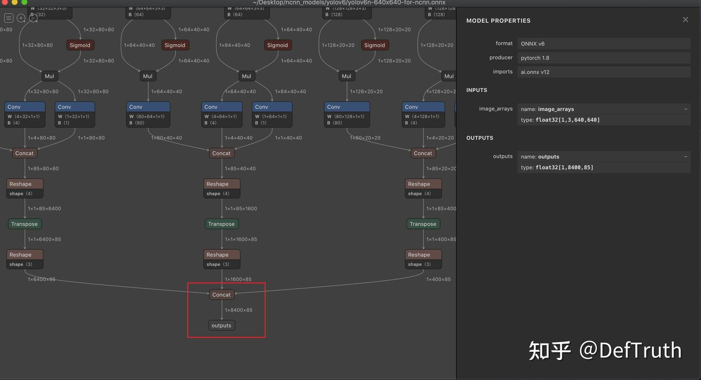
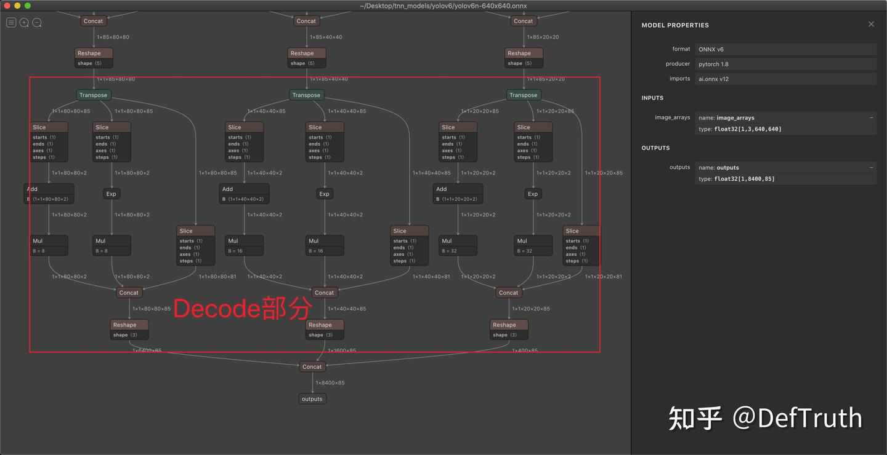
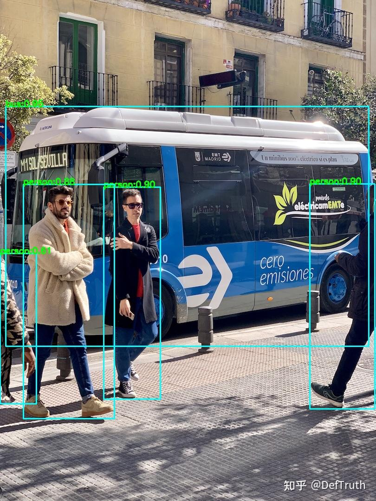
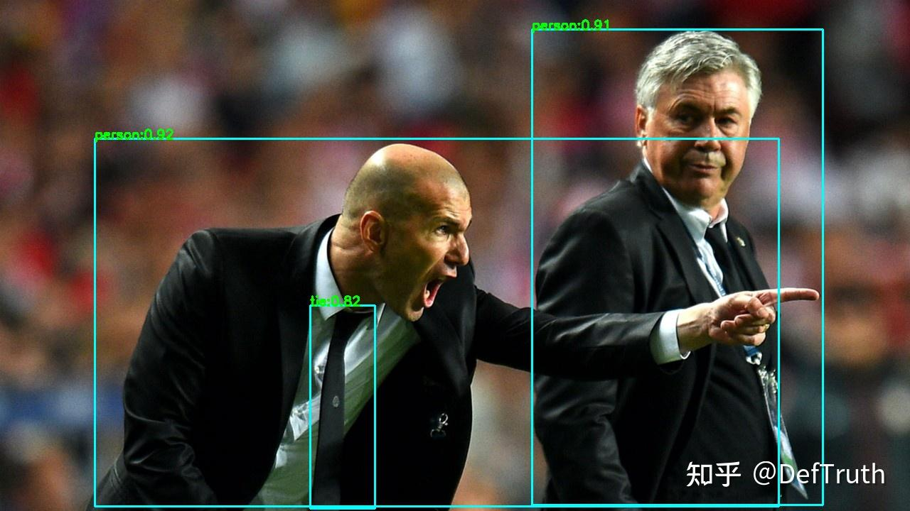

# YOLOv6 ORT/MNN/TNN/NCNN C++ 추론 배포

> 원문: https://zhuanlan.zhihu.com/p/533643238

## YOLOv6 ORT/MNN/TNN/NCNN C++ 추론 배포

### 0. 서문

어제 Meituan이 YOLOv6를 오픈소스로 공개했다. YOLO 계열의 또 다른 신작이다. YOLOX가 공개된 지 거의 정확히 1년이 지난 시점이다. 이전에도 YOLOv3, YOLOv4, YOLOv5, YOLOX, YOLOR, YOLOP 등 YOLO 계열 추론 예제를 꽤 많이 만들었다. 최근에는 detection 방향을 하고 있지는 않지만, YOLO 계열을 오래 봐 온 입장에서 한번 다뤄 보는 정도는 괜찮다.

그래서 이번에도 YOLO 계열 흐름에 맞춰 몇 가지 서로 다른 추론 엔진 예제를 제공한다. ONNXRuntime, MNN, NCNN, TNN을 포함하고, 모델 변환 과정도 간단히 기록한다. 전체적으로 YOLOv6 C++ 추론은 반복 작업에 가깝고 난도가 높지는 않다. 주말에 손 가는 대로 정리했다. 이 글은 아주 자세히 기록하지 않고 몇 가지 핵심만 설명한다.

### 1. ONNX와 TNN 모델 변환

시도해 본 결과, 직접 변환한 ONNX와 TNN 모델 파일은 추론 결과가 정상이다. YOLOv6의 `Detect` 소스 코드를 수정할 필요 없이 공식에서 제공하는 `deploy/ONNX/export_onnx.py`로 바로 변환하면 된다. 하지만 NCNN과 MNN은 정상 추론을 위해 `Detect` 소스 코드를 수정하는 특수 처리가 필요하다. 그래서 ONNX와 TNN은 이 절에서 다루고, MNN과 NCNN 모델 변환은 다음 절에서 다룬다.

먼저 소스 코드를 내려받는다.

```bash
git clone --depth=1 https://github.com/meituan/YOLOv6.git
```

그다음 `export_onnx.py`를 조금 수정한다. 원본 소스에는 `onnxsim`이 추가되어 있지 않다. 기본 작업으로 이것을 추가한다. 수정 후 코드는 다음과 같다.

```python
#!/usr/bin/env python3
# -*- coding:utf-8 -*-
import argparse
import time
import sys
import os
import torch
import torch.nn as nn
import onnx
import onnxsim
import onnxruntime as ort

ROOT = os.getcwd()
if str(ROOT) not in sys.path:
    sys.path.append(str(ROOT))

from yolov6.models.yolo import *
from yolov6.models.effidehead import Detect
from yolov6.layers.common import *
from yolov6.utils.events import LOGGER
from yolov6.utils.checkpoint import load_checkpoint

if __name__ == '__main__':
    parser = argparse.ArgumentParser()
    parser.add_argument('--weights', type=str, default='./yolov6s.pt', help='weights path')
    parser.add_argument('--img-size', nargs='+', type=int, default=[640, 640], help='image size')  # height, width
    parser.add_argument('--batch-size', type=int, default=1, help='batch size')
    parser.add_argument('--half', action='store_true', help='FP16 half-precision export')
    parser.add_argument('--inplace', action='store_true', help='set Detect() inplace=True')
    parser.add_argument('--device', default='0', help='cuda device, i.e. 0 or 0, 1, 2, 3 or cpu')
    args = parser.parse_args()
    args.img_size *= 2 if len(args.img_size) == 1 else 1  # expand
    print(args)
    t = time.time()
    apply_simplify = True  # add onnxsim

    # Check device
    cuda = args.device != 'cpu' and torch.cuda.is_available()
    device = torch.device('cuda:0' if cuda else 'cpu')
    assert not (device.type == 'cpu' and args.half), '--half only compatible with GPU export, i.e. use --device 0'
    # Load PyTorch model
    model = load_checkpoint(args.weights, map_location=device, inplace=True, fuse=True)  # load FP32 model
    for layer in model.modules():
        if isinstance(layer, RepVGGBlock):
            layer.switch_to_deploy()
    # Input
    img = torch.zeros(args.batch_size, 3, *args.img_size).to(device)  # image size(1,3,320,192) iDetection
    # Update model
    if args.half:
        img, model = img.half(), model.half()  # to FP16
    model.eval()
    for k, m in model.named_modules():
        if isinstance(m, Conv):  # assign export-friendly activations
            if isinstance(m.act, nn.SiLU):
                m.act = SiLU()
        elif isinstance(m, Detect):
            m.inplace = args.inplace
    y = model(img)  # dry run
    # ONNX export
    h, w = args.img_size
    export_file = args.weights.replace('.pt', f'-{h}x{w}.onnx')  # add size marker to filename
    try:
        LOGGER.info('\nStarting to export ONNX...')
        torch.onnx.export(model, img, export_file, verbose=False, opset_version=12,
                          training=torch.onnx.TrainingMode.EVAL,
                          do_constant_folding=True,
                          input_names=['image_arrays'],
                          output_names=["outputs"],
                          )
        # Checks
        onnx_model = onnx.load(export_file)  # load onnx model
        onnx.checker.check_model(onnx_model)  # check onnx model
        LOGGER.info(f'ONNX export success, saved as {export_file}')
    except Exception as e:
        LOGGER.info(f'ONNX export failure: {e}')
    if apply_simplify:  # added onnxsim part
        print(f'{export_file} simplifying with onnx-simplifier {onnxsim.__version__}...')
        try:
            onnx_model = onnx.load(export_file)  # load onnx model
            onnx_model, check = onnxsim.simplify(onnx_model, check_n=3)
            assert check, 'simplifying check failed'
            onnx.save(onnx_model, export_file)
        except Exception as e:
            print(f'{export_file} simplifier failure: {e}')
    # Running ORT check; added ORT validation
    sess = ort.InferenceSession(export_file)
    print(f"ORT Loaded {export_file} !")
    for _ in sess.get_inputs(): print(f"Input: {_}")
    for _ in sess.get_outputs(): print(f"Output: {_}")
    print("ORT Check Done !")

    # Finish
    LOGGER.info('\nExport complete (%.2fs)' % (time.time() - t))
```

사전 학습된 `pt` 모델 파일은 공식 링크에서 내려받을 수 있다. YOLOv6 루트 디렉터리에 두고 바로 변환하면 된다.

```bash
PYTHONPATH=. python3 ./deploy/ONNX/export_onnx.py --weights yolov6n.pt --img 640 --batch 1
PYTHONPATH=. python3 ./deploy/ONNX/export_onnx.py --weights yolov6n.pt --img 320 --batch 1
PYTHONPATH=. python3 ./deploy/ONNX/export_onnx.py --weights yolov6s.pt --img 640 --batch 1
PYTHONPATH=. python3 ./deploy/ONNX/export_onnx.py --weights yolov6s.pt --img 320 --batch 1
PYTHONPATH=. python3 ./deploy/ONNX/export_onnx.py --weights yolov6t.pt --img 640 --batch 1
```

이 과정은 비교적 순조롭고, 아직 특별한 문제는 발견하지 못했다. 다음은 TNN 모델 파일로 변환한다. 명령은 다음과 같다.

```bash
convert2tnn# python3 ./converter.py onnx2tnn ./tnn_models/yolov6/yolov6t-640x640.onnx -o ./tnn_models/yolov6/ -v v1.0 -optimize -align
convert2tnn# python3 ./converter.py onnx2tnn ./tnn_models/yolov6/yolov6s-640x640.onnx -o ./tnn_models/yolov6/ -v v1.0 -optimize -align
convert2tnn# python3 ./converter.py onnx2tnn ./tnn_models/yolov6/yolov6n-640x640.onnx -o ./tnn_models/yolov6/ -v v1.0 -optimize -align
convert2tnn# python3 ./converter.py onnx2tnn ./tnn_models/yolov6/yolov6s-320x320.onnx -o ./tnn_models/yolov6/ -v v1.0 -optimize -align
convert2tnn# python3 ./converter.py onnx2tnn ./tnn_models/yolov6/yolov6n-320x320.onnx -o ./tnn_models/yolov6/ -v v1.0 -optimize -align
```

TNN 모델 변환에는 `tnn-convert`가 필요하다. `tnn-convert` 사용법은 여기서 자세히 다루지 않는다. 관심이 있으면 이전에 작성한 글을 보면 된다.

### 2. MNN과 NCNN 모델 변환

NCNN과 MNN은 모두 정상 추론을 위해 `Detect` 소스 코드를 수정하는 특수 처리가 필요하다. 사실 MNN도 직접 변환할 수는 있다. 변환된 모델 파일도 추론은 가능하다. 하지만 decode 이후 결과가 이상해서, 마지막에는 MNN 모델 파일 변환도 NCNN과 같은 처리 방식을 사용하기로 했다. YOLO 계열 배포 글에서 자주 언급되는 것처럼, 이 계열을 배포할 때 주요 문제 중 하나는 `Detect Head`의 decode 로직을 어떻게 처리하느냐다. YOLOv6에서 이 부분 코드는 다음과 같다.

```python
    def forward(self, x):
        z = []
        for i in range(self.nl):
            # ...
            if self.training:
                # ...
            else:
                y = torch.cat([reg_output, obj_output.sigmoid(), cls_output.sigmoid()], 1)
                bs, _, ny, nx = y.shape
                y = y.view(bs, self.na, self.no, ny, nx).permute(0, 1, 3, 4, 2).contiguous()
                if self.grid[i].shape[2:4] != y.shape[2:4]:
                    d = self.stride.device
                    yv, xv = torch.meshgrid([torch.arange(ny).to(d), torch.arange(nx).to(d)])
                    self.grid[i] = torch.stack((xv, yv), 2).view(1, self.na, ny, nx, 2).float()
                if self.inplace:
                    y[..., 0:2] = (y[..., 0:2] + self.grid[i]) * self.stride[i]  # xy
                    y[..., 2:4] = torch.exp(y[..., 2:4]) * self.stride[i] # wh
                else:
                    xy = (y[..., 0:2] + self.grid[i]) * self.stride[i]  # xy
                    wh = torch.exp(y[..., 2:4]) * self.stride[i]  # wh
                    y = torch.cat((xy, wh, y[..., 4:]), -1)
                z.append(y.view(bs, -1, self.no))
        return x if self.training else torch.cat(z, 1)
```

이 부분은 일부 프레임워크에서 그대로 export할 수 있지만, 많은 glue op가 생긴다. 그래서 선택 가능한 방식은 decode 전의 Raw 부분만 export하고 C++ 쪽에서 decode를 수행하는 것이다. 또 decode 부분에는 5차원 연산이 존재한다.

```python
 y = y.view(bs, self.na, self.no, ny, nx).permute(0, 1, 3, 4, 2).contiguous()
```

이 부분은 NCNN에서 지원되지 않을 가능성이 높다. `ncnn::Mat`에 대한 이해로는 `c`, `h`, `w` 세 차원을 가지고 `b=1`을 가정하므로, 4차원 이하의 tensor만 처리할 수 있다. 따라서 직접 export할 수 없다. 이 5차원 처리도 그에 맞게 수정해야 한다. MNN의 경우 이 decode 로직을 직접 변환할 수는 있지만, 추론 결과가 맞지 않았다. 그래서 NCNN과 같은 처리 방식, 즉 decode 전 부분만 export하고 decode를 C++ 쪽으로 옮기는 방식을 채택했다. 나중에 검증해 보니 이 방식으로 정상 추론 결과를 얻을 수 있었다.

그렇다면 이 `Detect Head` 로직을 어떻게 바꿔야 할까. 길게 설명하지 않고 수정한 코드를 바로 둔다.

`models/effidehead.py` 수정 후:

```python
class Detect(nn.Module):
    # ...
    def forward(self, x):
        z = []
        for i in range(self.nl):
            # ...
            if self.training:
                # ...
            else:  # after modification
                x[i] = torch.cat([reg_output, obj_output, cls_output], 1)
                bs, _, ny, nx = x[i].shape
                # x(bs,255,20,20) to x(bs,1,20,20,85=80+5) (bs,na,ny,nx,no=nc+5=4+1+nc)
                # x[i] = x[i].view(bs, self.na, self.no, ny, nx).permute(0, 1, 3, 4, 2).contiguous()
                x[i] = x[i].view(bs, self.na, 85, -1).permute(0, 1, 3, 2).contiguous()  # (b,self.na,20x20,85) for NCNN
                x[i] = x[i].view(bs, -1, 85)
        return torch.cat(x, dim=1)  # (b,?,85)
```

여기서는 원래의 5차원 연산을 4차원 연산으로 바꾼다. export 시점에는 실제 `no(num_outputs=85)`, `na(num_anchors=1)` 값을 미리 계산할 수 있다. YOLOv6의 `configs` 디렉터리 안 설정 파일을 보면 실제로 `na`가 항상 1임도 확인할 수 있다. `ny`, `nx`는 각 feature map의 크기이며, 고정 입력 shape에서는 각 feature map의 `ny`, `nx`도 고정된다. 4차원 연산으로 바꾸기 위해 원래 마지막 두 차원인 `(ny,nx)`를 바로 flatten한다. row-major 선형 메모리로 이해하면 이 방식이 가능하다. 따라서 다음과 같이 된다.

```python
x[i] = x[i].view(bs, self.na, 85, -1).permute(0, 1, 3, 2).contiguous()  # (b,self.na,20x20,85) for NCNN
x[i] = x[i].view(bs, -1, 85)
```

마지막으로 반환 전에 병합 처리를 한 번 더 한다. 이렇게 하면 C++에서 decode할 때 각 feature map을 따로 한 번씩 처리할 필요가 없고, 병합된 큰 출력 하나에 대해서만 decode하면 된다.

```python
return torch.cat(x, dim=1)  # (b,?,85)
```

이렇게 수정한 뒤에는 `export_onnx.py` 코드를 바꿀 필요가 없다. 기존 명령줄을 그대로 사용해 export하면 된다. 파일명에는 구분하기 쉽도록 `-for-ncnn` suffix를 추가했다.

먼저 ONNX로 export한다.

```bash
PYTHONPATH=. python3 ./deploy/ONNX/export_onnx.py --weights yolov6n.pt --img 640 --batch 1
PYTHONPATH=. python3 ./deploy/ONNX/export_onnx.py --weights yolov6n.pt --img 320 --batch 1
PYTHONPATH=. python3 ./deploy/ONNX/export_onnx.py --weights yolov6s.pt --img 640 --batch 1
PYTHONPATH=. python3 ./deploy/ONNX/export_onnx.py --weights yolov6s.pt --img 320 --batch 1
PYTHONPATH=. python3 ./deploy/ONNX/export_onnx.py --weights yolov6t.pt --img 640 --batch 1
```

모델 파일은 다음과 같다.

```text
yolov6 ls -lh | grep yolov6 | grep for-ncnn | grep onnx
-rw-r--r--  1 yanjunqiu  staff    16M Jun 25 12:52 yolov6n-320x320-for-ncnn.onnx
-rw-r--r--  1 yanjunqiu  staff    16M Jun 25 12:51 yolov6n-640x640-for-ncnn.onnx
-rw-r--r--  1 yanjunqiu  staff    66M Jun 25 12:53 yolov6s-320x320-for-ncnn.onnx
-rw-r--r--  1 yanjunqiu  staff    66M Jun 25 12:52 yolov6s-640x640-for-ncnn.onnx
-rw-r--r--  1 yanjunqiu  staff    57M Jun 25 12:53 yolov6t-640x640-for-ncnn.onnx
```

Netron으로 열어 보면 decode 부분이 사라진 것을 볼 수 있다.



decode가 포함된 ONNX를 Netron으로 열면 다음과 같다.



두 그래프는 뚜렷한 차이가 있다. decode가 없는 그래프는 출력 부분이 훨씬 단순하다.

다음은 일반적인 절차에 따라 ONNX를 NCNN과 MNN 모델로 변환한다. 명령줄은 다음과 같다.

```bash
onnx2ncnn yolov6/yolov6s-320x320-for-ncnn.onnx yolov6/yolov6s-320x320-for-ncnn.param yolov6/yolov6s-320x320-for-ncnn.bin
ncnnoptimize yolov6/yolov6s-320x320-for-ncnn.param yolov6/yolov6s-320x320-for-ncnn.bin yolov6/yolov6s-320x320-for-ncnn.opt.param yolov6/yolov6s-320x320-for-ncnn.opt.bin 0
```

모두 정상이다. MNN 모델로 변환하는 명령은 다음과 같다.

```text
YOLOv6 MNNConvert -f ONNX --modelFile yolov6n-640x640-for-ncnn.onnx --MNNModel yolov6n-640x640.mnn --bizCode MNN 
Start to Convert Other Model Format To MNN Model...
[15:19:09] /Users/yanjunqiu/Desktop/third_party/library/MNN/tools/converter/source/onnx/onnxConverter.cpp:30: ONNX Model ir version: 6
Start to Optimize the MNN Net...
inputTensors : [ image_arrays, ]
outputTensors: [ outputs, ]
Converted Success!
```

이 역시 모두 정상이다.

### 3. ONNX와 TNN 모델 C++ 추론

ONNX와 TNN 모델은 모두 decode를 포함하므로 후처리가 조금 더 단순하다. anchor를 생성할 필요가 없다. 모델 추론의 직접 출력 차원은 `(1,n,85)`다. 여기서 `n`은 전체 출력 anchor 수를 나타내며, `85`의 의미는 다음과 같다.

```text
85=5+80=cxcy(2)+cwch(2)+obj_conf(1)+cls_conf(80)
```

출력 좌표는 이미 정규화된 `cx`, `cy`, `cw`, `ch`이므로 후처리는 단순하다. 바로 `x1`, `y1`, `x2`, `y2` 형식으로 변환하면 된다. 대략적인 로직은 다음과 같다.

```cpp
    float cx = offset_obj_cls_ptr[0];
    float cy = offset_obj_cls_ptr[1];
    float w = offset_obj_cls_ptr[2];
    float h = offset_obj_cls_ptr[3];
    float x1 = ((cx - w / 2.f) - (float) dw_) / r_;
    float y1 = ((cy - h / 2.f) - (float) dh_) / r_;
    float x2 = ((cx + w / 2.f) - (float) dw_) / r_;
    float y2 = ((cy + h / 2.f) - (float) dh_) / r_;

```

상세한 추론 코드는 여기서 자세히 다루지 않고 글 마지막에 둔다.

### 4. NCNN과 MNN 모델 C++ 추론

NCNN과 MNN 모델 파일은 decode 부분을 export하지 않았으므로 후처리가 조금 더 복잡하다. 후처리는 크게 두 부분으로 구성된다. 하나는 anchor 생성이고, 다른 하나는 생성한 anchor와 출력 원시 정보를 기반으로 좌표를 decode하는 것이다. YOLOv6의 anchor 생성 로직은 YOLOX와 거의 같다. 각 feature map의 각 anchor point에서 anchor box 하나를 생성하는 방식이다. detection 알고리즘을 해 봤다면 이 문장의 의미는 대부분 이해할 것이므로 더 길게 설명하지 않는다. 바로 코드를 둔다.

`generate_anchors` 함수의 주요 로직:

```cpp
void NCNNYOLOv6::generate_anchors(const int target_height,
                                  const int target_width,
                                  std::vector<int> &strides,
                                  std::vector<YOLOv6Anchor> &anchors)
{
  for (auto stride: strides)
  {
    int num_grid_w = target_width / stride;
    int num_grid_h = target_height / stride;
    for (int g1 = 0; g1 < num_grid_h; ++g1)
    {
      for (int g0 = 0; g0 < num_grid_w; ++g0)
      {
        YOLOv6Anchor anchor;
        anchor.grid0 = g0;
        anchor.grid1 = g1;
        anchor.stride = stride;
        anchors.push_back(anchor);
      }
    }
  }
}

```

좌표 decode의 주요 로직:

```cpp
    const int grid0 = anchors.at(i).grid0;
    const int grid1 = anchors.at(i).grid1;
    const int stride = anchors.at(i).stride;

    float dx = offset_obj_cls_ptr[0];
    float dy = offset_obj_cls_ptr[1];
    float dw = offset_obj_cls_ptr[2];
    float dh = offset_obj_cls_ptr[3];

    float cx = (dx + (float) grid0) * (float) stride;
    float cy = (dy + (float) grid1) * (float) stride;
    float w = std::exp(dw) * (float) stride;
    float h = std::exp(dh) * (float) stride;
    float x1 = ((cx - w / 2.f) - (float) dw_) / r_;
    float y1 = ((cy - h / 2.f) - (float) dh_) / r_;
    float x2 = ((cx + w / 2.f) - (float) dw_) / r_;
    float y2 = ((cy + h / 2.f) - (float) dh_) / r_;

```

상세한 추론 코드는 여기서 자세히 다루지 않고 글 마지막에 둔다.

### 5. YOLOv6 C++ 추론 사용 예시

먼저 YOLOv6의 네 추론 엔진에 대한 C++ 소스 코드를 둔다. 가장 관심 있는 부분은 가져다 쓸 수 있는지일 것이다. 모든 코드는 `lite.ai.toolkit` 도구 상자에 통합되어 있어 별도 비용 없이 바로 사용할 수 있다.

- YOLOv6 ONNXRuntime C++ 소스 코드
- YOLOv6 MNN C++ 소스 코드
- YOLOv6 NCNN C++ 소스 코드
- YOLOv6 TNN C++ 소스 코드

소스 코드에 관심이 있으면 필요한 추론 엔진 버전을 골라 읽으면 된다. 다음은 `lite.ai.toolkit` 도구 상자를 한 번에 호출하는 간단한 사용 예시 몇 가지다.

ONNXRuntime 버전:

```cpp
#include "lite/lite.h"

static void test_default()
{
  std::string onnx_path = "../../../hub/onnx/cv/yolov6s-640x640.onnx";
  std::string test_img_path = "../../../examples/lite/resources/test_lite_yolov6_1.jpg";
  std::string save_img_path = "../../../logs/test_lite_yolov6_1.jpg";

  // 1. Test Default Engine ONNXRuntime
  auto *yolov6 = new lite::cv::detection::YOLOv6(onnx_path); // default

  std::vector<lite::types::Boxf> detected_boxes;
  cv::Mat img_bgr = cv::imread(test_img_path);
  yolov6->detect(img_bgr, detected_boxes);
  lite::utils::draw_boxes_inplace(img_bgr, detected_boxes);

  cv::imwrite(save_img_path, img_bgr);
  std::cout << "Default Version Detected Boxes Num: " << detected_boxes.size() << std::endl;
  delete yolov6;
}

```

MNN 버전:

```cpp
static void test_mnn()
{
#ifdef ENABLE_MNN
  std::string mnn_path = "../../../hub/mnn/cv/yolov6s-640x640.mnn";
  std::string test_img_path = "../../../examples/lite/resources/test_lite_yolov6_2.jpg";
  std::string save_img_path = "../../../logs/test_lite_yolov6_mnn_2.jpg";

  // 3. Test Specific Engine MNN
  auto *yolov6 = new lite::mnn::cv::detection::YOLOv6(mnn_path);

  std::vector<lite::types::Boxf> detected_boxes;
  cv::Mat img_bgr = cv::imread(test_img_path);
  yolov6->detect(img_bgr, detected_boxes);

  lite::utils::draw_boxes_inplace(img_bgr, detected_boxes);
  cv::imwrite(save_img_path, img_bgr);
  std::cout << "MNN Version Detected Boxes Num: " << detected_boxes.size() << std::endl;
  delete yolov6;
#endif
}

```

NCNN 버전:

```cpp
static void test_ncnn()
{
#ifdef ENABLE_NCNN
  std::string param_path = "../../../hub/ncnn/cv/yolov6s-640x640-for-ncnn.opt.param";
  std::string bin_path = "../../../hub/ncnn/cv/yolov6s-640x640-for-ncnn.opt.bin";
  std::string test_img_path = "../../../examples/lite/resources/test_lite_yolov6_2.jpg";
  std::string save_img_path = "../../../logs/test_lite_yolov6_ncnn_2.jpg";

  // 4. Test Specific Engine NCNN
  auto *yolov6 = new lite::ncnn::cv::detection::YOLOv6(param_path, bin_path);

  std::vector<lite::types::Boxf> detected_boxes;
  cv::Mat img_bgr = cv::imread(test_img_path);
  yolov6->detect(img_bgr, detected_boxes);

  lite::utils::draw_boxes_inplace(img_bgr, detected_boxes);
  cv::imwrite(save_img_path, img_bgr);
  std::cout << "NCNN Version Detected Boxes Num: " << detected_boxes.size() << std::endl;
  delete yolov6;
#endif
}

```

TNN 버전:

```cpp
static void test_tnn()
{
#ifdef ENABLE_TNN
  std::string proto_path = "../../../hub/tnn/cv/yolov6s-640x640.opt.tnnproto";
  std::string model_path = "../../../hub/tnn/cv/yolov6s-640x640.opt.tnnmodel";
  std::string test_img_path = "../../../examples/lite/resources/test_lite_yolov6_2.jpg";
  std::string save_img_path = "../../../logs/test_lite_yolov6_tnn_2.jpg";

  // 5. Test Specific Engine TNN
  auto *yolov6 = new lite::tnn::cv::detection::YOLOv6(proto_path, model_path);

  std::vector<lite::types::Boxf> detected_boxes;
  cv::Mat img_bgr = cv::imread(test_img_path);
  yolov6->detect(img_bgr, detected_boxes);

  lite::utils::draw_boxes_inplace(img_bgr, detected_boxes);
  cv::imwrite(save_img_path, img_bgr);
  std::cout << "TNN Version Detected Boxes Num: " << detected_boxes.size() << std::endl;
  delete yolov6;
#endif
}

```

출력 결과는 다음과 같다.





### 6. 정리

이 글은 Meituan이 6월 24일 오픈소스로 공개한 YOLOv6를 여러 추론 엔진에서 C++로 엔지니어링하는 과정을 설명했다. ORT, MNN, NCNN, TNN에서의 추론 처리와 각 추론 프레임워크별 모델 변환 시 주의할 문제를 포함했다. 또한 모든 코드는 `lite.ai.toolkit` 도구 상자에 통합되어 있어 별도 비용 없이 바로 사용할 수 있다.

- YOLOv6 ONNXRuntime C++ 소스 코드
- YOLOv6 MNN C++ 소스 코드
- YOLOv6 NCNN C++ 소스 코드
- YOLOv6 TNN C++ 소스 코드

주말에 Meituan의 YOLOv6 모델을 다뤄 보고 이 글을 다 썼을 때는 거의 저녁 6시였다. 한여름이고 배도 고팠다. 휴대폰에서 Meituan 배달 앱을 열어 주문할 때가 됐다고 판단했다. 문제는 무엇을 먹을지다.
