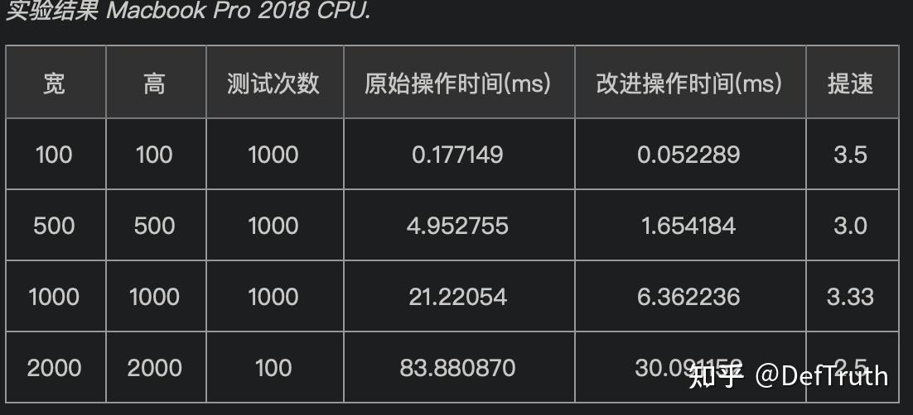
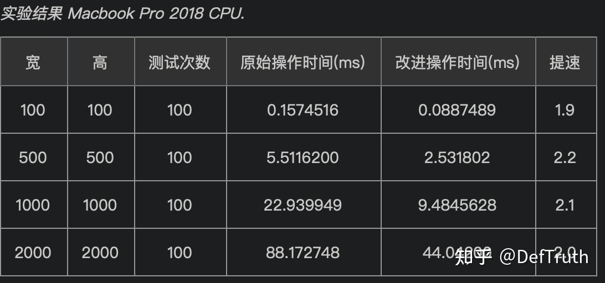

# [배포][ONNX] ONNX inference acceleration 기술 문서 잡기록

> 원문: https://zhuanlan.zhihu.com/p/524023964

목차

- ONNX inference acceleration 기술 문서 잡기록
- 0. 서문
- 1. model file conversion
- 1.1 `pth` file을 ONNX로 변환
- 1.2 `pb` file을 ONNX로 변환
- 1.3 ONNX를 `pb` file로 변환
- 2. ONNX로 직접 inference
- 3. ONNXRuntime으로 inference acceleration
- 4. experiment result
- 5. Numpy를 조심해서 사용
- 6. 기타 참고
- TensorFlow + TensorRT C++

## ONNX inference acceleration 기술 문서 잡기록

### 0. 서문

단오 연휴를 틈타 이전에 기록한 note를 정리한다. 늘 같은 말이다. 좋은 기억력보다 엉성한 기록이 낫다. 글을 쓰는 것은 output이자 input이다.

### 1. model file conversion

### 1.1 `pth` file을 ONNX로 변환

PyTorch framework에는 ONNX module이 통합되어 있다. official support에 속하며, ONNX도 PyTorch framework의 대부분 operator를 cover한다. 따라서 `pth` model file을 ONNX file로 변환하는 것은 매우 간단하다. 아래는 code example이다.

주의할 점은 변환 전에 `pth` model의 input size를 freeze해야 한다는 것이다. 예:

```python
batch_size = 1
dummy_input = torch.randn(batch_size, 3, 240, 320).to(device)
```

input이 freeze되면 fixed `batch_size`만 가진다. 변환된 ONNX file로 model inference를 수행할 때 inference input의 `batch_size`는 freeze할 때와 같아야 한다. 이 example에서는 `batch_size=1`로만 inference할 수 있다.

inference 때 다른 `batch_size`, 예를 들어 10을 사용해야 한다면 ONNX model을 저장하기 전에 freeze input node를 바꿔야 한다.

```python
batch_size = 10
dummy_input = torch.randn(batch_size, 3, 240, 320).to(device)
```

이렇게 하면 `batch_size=10`인 ONNX model을 얻는다. ONNX file export는 `torch.onnx.export()` function을 사용하면 된다.

```python
    model_name = model_path.split("/")[-1].split(".")[0]
    model_path = f"inference/ulfd/onnx/{model_name}-batch-{batch_size}.onnx"

    dummy_input = torch.randn(batch_size, 3, 240, 320).to(device)
    # dummy_input = torch.randn(1, 3, 480, 640).to("cuda") # if input size is 640x480
    torch.onnx.export(net, dummy_input, model_path,
                      verbose=False, input_names=['input'],
                      output_names=['scores', 'boxes'])
```

전체 conversion code:

```python
# -*- coding: utf-8 -*-
"""
This code is used to convert the pytorch model into an onnx format model.
"""
import argparse
import sys
import torch.onnx
from models.ulfd.lib.ssd.config.fd_config import define_img_size

input_img_size = 320  # define input size, default optional(128/160/320/480/640/1280)
define_img_size(input_img_size)
from models.ulfd.lib.ssd.mb_tiny_RFB_fd import create_Mb_Tiny_RFB_fd
from models.ulfd.lib.ssd.mb_tiny_fd import create_mb_tiny_fd


def get_args():
    parser = argparse.ArgumentParser(description='convert model to onnx')
    parser.add_argument("--net", dest='net_type', default="RFB",
                        type=str, help='net type.')
    parser.add_argument('--batch', dest='batch_size', default=1,
                        type=int, help='batch size for input.')
    args_ = parser.parse_args()

    return args_


if __name__ == '__main__':

    # net_type = "slim"  # inference faster, lower precision
    args = get_args()

    net_type = args.net_type  # inference lower, higher precision
    batch_size = args.batch_size

    device = torch.device("cuda:0" if torch.cuda.is_available() else "cpu")

    label_path = "models/ulfd/voc-model-labels.txt"
    class_names = [name.strip() for name in open(label_path).readlines()]
    num_classes = len(class_names)

    if net_type == 'slim':
        model_path = "baseline/ulfd/version-slim-320.pth"
        # model_path = "models/pretrained/version-slim-640.pth"
        net = create_mb_tiny_fd(len(class_names), is_test=True, device=device)
    elif net_type == 'RFB':
        model_path = "baseline/ulfd/version-RFB-320.pth"
        # model_path = "models/pretrained/version-RFB-640.pth"
        net = create_Mb_Tiny_RFB_fd(len(class_names), is_test=True, device=device)

    else:
        print("unsupport network type.")
        sys.exit(1)
    net.load(model_path)
    net.eval()
    net.to(device)

    model_name = model_path.split("/")[-1].split(".")[0]
    model_path = f"inference/ulfd/onnx/{model_name}-batch-{batch_size}.onnx"

    dummy_input = torch.randn(batch_size, 3, 240, 320).to(device)
    # dummy_input = torch.randn(1, 3, 480, 640).to("cuda") # if input size is 640x480
    torch.onnx.export(net, dummy_input, model_path,
                      verbose=False, input_names=['input'],
                      output_names=['scores', 'boxes'])
    print('onnx model saved ', model_path)

    """
    PYTHONPATH=. python3 inference/ulfd/pth_to_onnx.py --net RFB --batch 16

    PYTHONPATH=. python inference/ulfd/pth_to_onnx.py --net RFB --batch 3
    """
```

### 1.2 `pb` file을 ONNX로 변환

`pb` file을 ONNX로 변환할 때는 `tf2onnx` library를 사용할 수 있다. 단, TensorFlow는 ONNX를 official support하지 않는다. `tf2onnx`는 third-party library다. 이 tool은 TensorFlow `pb` file을 ONNX format file로 변환한다.

`tf2onnx` 설치:

```bash
pip install tf2onnx
```

format conversion command:

```bash
python -m tf2onnx.convert
--input ./checkpoints/new_model.pb
--inputs intent_network/inputs:0,intent_network/seq_len:0
--outputs logits:0
--output ./pb_models/model.onnx
--fold_const

# SAVE_MODEL
# save_model로 저장
from tensorflow.python.compiler.tensorrt import trt_convert as trt
converter = trt.TrtGraphConverter(input_saved_model_dir=input_saved_model_dir)
converter.convert()
converter.save(output_saved_model_dir)

python -m tf2onnx.convert --saved_model saved_model_dir --output model.onnx

# .pb file
python -m tf2onnx.convert --input frozen_graph.pb  --inputs X:0,X1:0 --outputs output:0 --output model.onnx --fold_const

# .ckpt file
python -m tf2onnx.convert --checkpoint checkpoint.meta  --inputs X:0 --outputs output:0 --output model.onnx --fold_const
```

### 1.3 ONNX를 `pb` file로 변환

때로는 cross-framework conversion이 필요하다. 예를 들어 PyTorch로 model을 training했지만, deployment 편의나 다른 model과 일관성을 맞추기 위해 TensorFlow에 통합해야 할 수 있다. 이때 `pth`를 ONNX로 변환한 뒤 ONNX를 다시 `pb` file로 변환할 수 있다. 변환이 성공한다면 TensorFlow에서 `pb` file로 inference할 수 있다.

여기서 “성공한다면”이라고 강조하는 이유는 TensorFlow가 ONNX를 official support하지 않기 때문이다. 일부 operator incompatibility 때문에 변환된 `pb` file이 TensorFlow inference에서 문제를 낼 수 있다.

ONNX를 `pb` file로 변환하려면 `onnx-tf` library를 사용할 수 있다.

```bash
pip install onnx-tf
```

전체 conversion code:

```python
# -*- coding: utf-8 -*-
"""
@File  : onnx_to_pb.py
@Author: qiuyanjun
@Date  : 2020-01-10 19:22
@Desc  :
"""
import cv2
import numpy as np
import onnx
import tensorflow as tf
from onnx_tf.backend import prepare
import onnx_tf


model = onnx.load('models/onnx/version-RFB-320.onnx')
tf_rep = prepare(model)

img = cv2.imread('imgs/1.jpg')
image = cv2.resize(img, (320, 240))
# test whether inference works
image_mean = np.array([127, 127, 127])
image = (image - image_mean) / 128
image = np.transpose(image, [2, 0, 1])
image = np.expand_dims(image, axis=0)
image = image.astype(np.float32)
output = tf_rep.run(image)

print("output mat: \n", output)
print("output type ", type(output))

# create session and get input/output node information
with tf.Session() as persisted_sess:
    print("load graph")
    persisted_sess.graph.as_default()
    tf.import_graph_def(tf_rep.graph.as_graph_def(), name='')
    inp = persisted_sess.graph.get_tensor_by_name(
        tf_rep.tensor_dict[tf_rep.inputs[0]].name
    )
    print('input_name: ', tf_rep.tensor_dict[tf_rep.inputs[0]].name)
    print('input_names: ', tf_rep.inputs)
    out = persisted_sess.graph.get_tensor_by_name(
        tf_rep.tensor_dict[tf_rep.outputs[0]].name
    )
    print('output_name_0: ', tf_rep.tensor_dict[tf_rep.outputs[0]].name)
    print('output_name_1: ', tf_rep.tensor_dict[tf_rep.outputs[1]].name)
    print('output_names: ', tf_rep.outputs)
    res = persisted_sess.run(out, {inp: image})
    print(res)
    print("result is ", res)

# save as pb file
tf_rep.export_graph('version-RFB-320.pb')
print('onnx to pb done.')

"""cmd
PYTHONPATH=. python3 onnx_to_pb.py
"""
```

### 2. ONNX로 직접 inference

ONNX file은 직접 inference할 수 있다. 이때 code는 framework와 무관해지며 training stage와 decouple된다. 하지만 inference를 제대로 수행하려면 여전히 ONNX backend를 선택해야 한다. TensorFlow를 예로 들면 다음과 같다.

```python
import onnx
import tensorflow as tf
from onnx_tf.backend import prepare
import onnx_tf

...
# wrap a TensorFlow backend
predictor = onnx.load(onnx_path)
onnx.checker.check_model(predictor)
onnx.helper.printable_graph(predictor.graph)
tf_rep = prepare(predictor, device="CUDA:0")  # default CPU

# use TensorFlow to predict
gpu_options = tf.GPUOptions(per_process_gpu_memory_fraction=0.7)  # default 0.5
tfconfig = tf.ConfigProto(allow_soft_placement=True, gpu_options=gpu_options)

...
with tf.Session(config=tfconfig) as persisted_sess:
    persisted_sess.graph.as_default()
    tf.import_graph_def(tf_rep.graph.as_graph_def(), name='')
    tf_input = persisted_sess.graph.get_tensor_by_name(
        tf_rep.tensor_dict[tf_rep.inputs[0]].name
    )
    tf_scores = persisted_sess.graph.get_tensor_by_name(
        tf_rep.tensor_dict[tf_rep.outputs[0]].name
    )
    tf_boxes = persisted_sess.graph.get_tensor_by_name(
        tf_rep.tensor_dict[tf_rep.outputs[1]].name
    )

    for file_path in listdir:
        ...
        confidences, boxes = persisted_sess.run([tf_scores, tf_boxes], {tf_input: image})
        ...
```

### 3. ONNXRuntime으로 inference acceleration

사실 ONNX는 더 효율적으로 사용할 수 있다. ONNXRuntime은 ONNX model에 inference acceleration을 제공하는 library다. CPU와 GPU acceleration을 모두 지원한다. GPU acceleration version은 `onnxruntime-gpu`이고, default version은 CPU acceleration이다.

설치:

```bash
pip install onnxruntime  # CPU
pip install onnxruntime-gpu # GPU
```

ONNXRuntime으로 ONNX model을 accelerate하는 것은 매우 간단하다. 몇 줄 code만 필요하다. 예시는 다음과 같다.

```python
import onnxruntime as ort
class NLFDOnnxCpuInferBase:
    """only support in CPU and accelerate with onnxruntime."""

    __metaclass__ = ABCMeta
   ...
   def __init__(self,
                 onnx_path=ONNX_PATH):
        """pytorch and onnx can work well together.
        :param onnx_path: .onnx file path
        """
        self._onnx_path = onnx_path
        # use ONNX model to initialize ort session
        self._ort_session = ort.InferenceSession(self._onnx_path)
        self._input_img = self._ort_session.get_inputs()[0].name
   ...

   # use run for inference
   def _detect_img_utils(self, img: np.ndarray):
        """batch is ok."""
        feed_dict = {self._input_img: img}
        scores_before_nms, rois_before_nms = \
            self._ort_session.run(None,input_feed=feed_dict)
        return rois_before_nms, scores_before_nms
```

ONNXRuntime은 ONNX 안의 irrelevant node를 자동으로 검사하고 제거한다. 또한 일부 acceleration library로 inference graph를 optimize해 inference를 accelerate한다. 일부 log는 다음과 같다.

```text
 python3 inference/ulfd/onnx_cpu_infer.py
2020-01-16 12:03:49.259044 [W:onnxruntime:, graph.cc:2412 CleanUnusedInitializers] Removing initializer 'base_net.9.4.num_batches_tracked'. It is not used by any node and should be removed from the model.
2020-01-16 12:03:49.259478 [W:onnxruntime:, graph.cc:2412 CleanUnusedInitializers] Removing initializer 'base_net.9.1.num_batches_tracked'. It is not used by any node and should be removed from the model.
2020-01-16 12:03:49.259492 [W:onnxruntime:, graph.cc:2412 CleanUnusedInitializers] Removing initializer 'base_net.8.4.num_batches_tracked'. It is not used by any node and should be removed from the model.
2020-01-16 12:03:49.259501 [W:onnxruntime:, graph.cc:2412 CleanUnusedInitializers] Removing initializer 'base_net.8.1.num_batches_tracked'. It is not used by any node and should be removed from the model.
```

### 4. experiment result

face detection ULFD model에서 ONNXRuntime acceleration을 사용하지 않으면 320x240 image를 CPU에서 처리하는 데 50-60ms가 필요하다. ONNXRuntime acceleration을 사용하면 CPU에서 8-11ms가 필요하다.

### 5. Numpy를 조심해서 사용

image processing에서는 normalization이 자주 등장한다. inference 때도 필요하다. inference에서는 performance를 고려해야 한다. 최근 Numpy tensor computation의 다른 작성 방식이 performance에 큰 영향을 준다는 것을 발견했다.

mean normalization에서 각 channel에서 빼는 mean이 모두 같다면, 예를 들어 127이라면:

```python
# common approach: do not use this approach.
image_mean = np.array([127, 127, 127])
image = (image - image_mean) / 128
# this costs more time due to numpy broadcasting
# use this instead: keep dtype consistent and subtracting a constant is more efficient
image = (image - 127.) / 128.
```

- experiment code: same mean

```python
# coding: utf-8
import cv2
import time
import numpy as np


if __name__ == '__main__':
    test_w, test_h = 500, 500

    test_path = 'logs/test0.jpg'
    test_img = cv2.imread(test_path)
    resize_img = cv2.resize(test_img, (test_w, test_h))


    test_count = 1000
    print('width: {0}, height: {1}, test_count: {2}'.format(test_w, test_h, test_count))

    t1 = time.time()
    image_mean = np.array([127, 127, 127])
    for _ in range(test_count):
        image = (resize_img - image_mean) / 128
    t2 = time.time()
    print('total_time_ugly: {0}s, mean_time_ugly: {1}ms'.format(
        (t2-t1), (t2-t1)*1000/test_count
    ))
    t3 = time.time()
    for _ in range(test_count):
        image = (resize_img - 127.) / 128.
    t4 = time.time()
    print('total_time_elegant: {0}s, mean_time_elegant: {1}ms'.format(
        (t4 - t3), (t4 - t3) * 1000 / test_count
    ))
```

experiment result:



하지만 정말 channel마다 다른 mean을 써야 한다면 어떻게 해야 할까. 그때도 아래처럼 작성한다. 다음은 또 다른 test result다.

- experiment code: different mean

```python
# coding: utf-8
import cv2
import time
import numpy as np


if __name__ == '__main__':
    test_w, test_h = 100, 100

    test_path = 'logs/test0.jpg'
    test_img = cv2.imread(test_path)
    resize_img = cv2.resize(test_img, (test_w, test_h))


    test_count = 100
    print('width: {0}, height: {1}, test_count: {2}'.format(test_w, test_h, test_count))
    print('-'*100)
    t1 = time.time()
    image_mean = np.array([127, 120, 107])
    for _ in range(test_count):
        image = (resize_img - image_mean) / 128
    t2 = time.time()
    print('total_time_ugly: {0}s, mean_time_ugly: {1}ms'.format(
        (t2 - t1), (t2 - t1) * 1000 / test_count
    ))
    t3 = time.time()
    image = np.zeros_like(resize_img)
    for _ in range(test_count):
        image[:, :, 0] = (resize_img[:, :, 0] - 127.) / 128.
        image[:, :, 1] = (resize_img[:, :, 1] - 120.) / 128.
        image[:, :, 2] = (resize_img[:, :, 2] - 107.) / 128.
    t4 = time.time()
    print('total_time_elegant: {0}s, mean_time_elegant: {1}ms'.format(
        (t4 - t3), (t4 - t3) * 1000 / test_count
    ))
```

experiment result:



간단히 말하면, 몇 줄 code를 직접 수정할 의지만 있다면 5-15ms의 performance improvement를 얻을 수 있다. 이는 TensorRT/ONNX 같은 여러 acceleration tool을 쓰는 것보다 훨씬 단순하다.

### 6. 기타 참고

### TensorFlow + TensorRT C++

- [1] 매우 가치 있는 참고 자료.
- [2] 참고 1.
- [3] TensorFlow source compile 및 TensorRT activate.
- [4] C++에서 TensorFlow 호출.
- [5] C++에서 `pb` model 호출.
- [6] single machine C++ deployment: C interface 사용.
- [7] TensorFlow C++ compile document.
- [8] GitHub contributor의 TF-C API wrapper.

평소 기술 글을 조금씩 쓰고 있으니 관심이 있으면 기술 column을 보면 된다.
