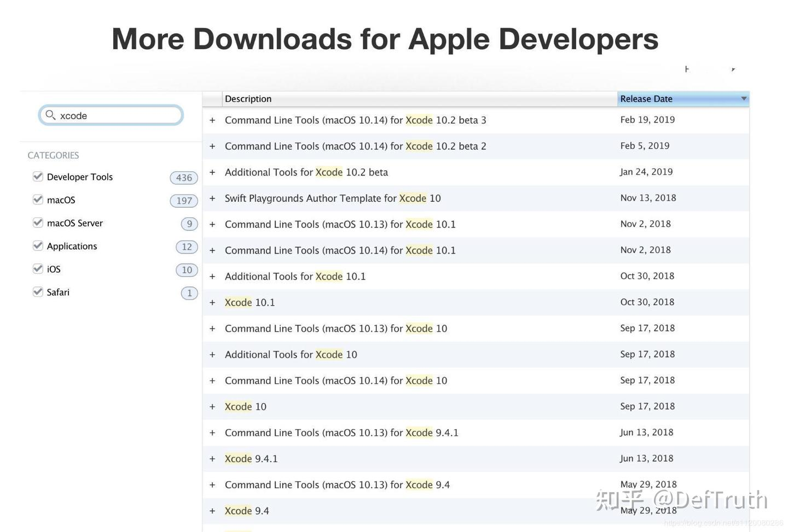
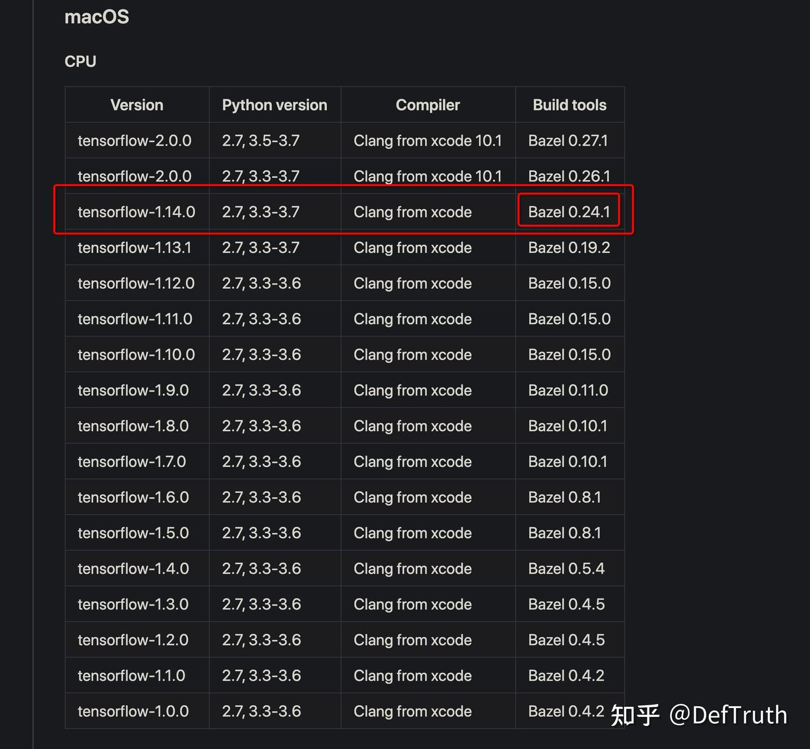
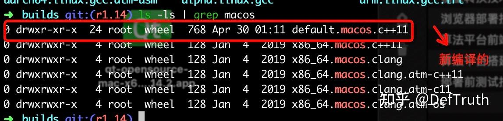

# [배포][TF] Mac에서 TensorFlow C++ source build

> 원문: https://zhuanlan.zhihu.com/p/524013615

목차

- 0. 서문
- 1. system environment
- 2. dependency 설치
- 2.1 Xcode와 Command Line Tools 설치
- 2.2 JDK 1.8.0 설치
- 2.3 Bazel 설치
- Bazel 0.24.1 수동 설치
- 2.4 automake 설치
- 2.5 virtual environment에 Python 3.7.5 설치
- 2.6 TensorFlow source download
- 3. compile
- 3.1 compile option 구성
- 4. TensorFlow compile
- 4.1 `libtensorflow_cc.so` compile
- 4.2 dependency library compile
- 5. C++ interface test
- 6. TFLite compile
- 7. 정리

### 0. 서문

단오 연휴를 틈타 이전에 기록한 note를 정리한다. 당시 TensorFlow C++ source compile을 한번 만져 보았고, 나중에 TensorFlow C++ source compile에서 다시 삽질하지 않기 위해 이 문서를 남겼다. 늘 같은 말이지만, 좋은 기억력보다 엉성한 기록이 낫다. 글을 쓰는 것은 output이자 input이다.

### 1. system environment

이번 TensorFlow source compile에 사용한 system environment는 다음과 같다.

- Mac 10.14.6
- Python 3.7.5
- TensorFlow 1.14 CPU
- Bazel 0.24.1
- automake 1.16.1(latest)
- Xcode 10.3
- Command Line Tools 10.3
- Clang from Xcode
- JDK 1.8.0

### 2. dependency 설치

Homebrew는 이미 설치되어 있다고 가정한다.

### 2.1 Xcode와 Command Line Tools 설치

Mac에서 TensorFlow를 compile하므로 Xcode environment가 필요하다.

- 먼저 https://developer.apple.com/download/more/ 를 열어 Apple Developer official site로 들어간다. 로그인에는 Apple ID가 필요하다. Apple ID가 없다면 email로 등록한다.
- Xcode를 검색해서 system에 맞는 version을 찾는다. 내 system은 macOS 10.14.6이므로 선택 가능한 Xcode는 10, 10.1, 10.2, 10.3 등이었다. 여기서는 Xcode 10.3과 그 version에 대응하는 Command Line Tools(macOS 10.14) for Xcode 10.3을 선택했다.



- `+`를 눌러 detail을 열고 download를 클릭한 뒤 압축을 풀어 설치한다. Xcode는 5GB가 넘으므로 download에 시간이 걸린다.
- 설치가 끝나면 command line에서 설치 성공 여부를 확인한다.

```bash
# 1. Xcode version 확인
➜  ~ xcodebuild -version
Xcode 10.3
Build version 10G8
# 2. 설치된 Xcode.app을 찾아 /User/xxx/Applications/ directory로 이동한다.
# 3. xcode command line tool의 default path가 올바른지 확인한다.
➜  ~ xcode-select -p
/Applications/Xcode.app/Contents/Developer
# 4. 이 path가 아니라면 xcode-select -s <path>로 Xcode.app path로 전환한다.
➜  ~ xcode-select -s /Applications/Xcode.app/Contents/Developer
# 5. path가 올바르게 설정되었는지 확인한다.
➜  ~ xcode-select -p
/Applications/Xcode.app/Contents/Developer
```

### 2.2 JDK 1.8.0 설치

TensorFlow C++ source compile에는 Java가 필요하므로 JDK를 설치해야 한다. 여기서는 JDK 1.8.0을 사용했다.

- 먼저 machine에 JDK가 설치되어 있는지 확인한다.

```bash
# 1. Java version 확인
➜  ~ java -version
java version "1.8.0_201"
Java(TM) SE Runtime Environment (build 1.8.0_201-b09)
Java HotSpot(TM) 64-Bit Server VM (build 25.201-b09, mixed mode)
# 2. JDK install path 확인
➜  ~ /usr/libexec/java_home -V
Matching Java Virtual Machines (1):
    1.8.0_201, x86_64:  "Java SE 8" /Library/Java/JavaVirtualMachines/jdk1.8.0_201.jdk/Contents/Home
/Library/Java/JavaVirtualMachines/jdk1.8.0_201.jdk/Contents/Home
# 3. JAVA_HOME environment variable이 설정되었는지 확인
➜  ~ echo $JAVA_HOME
/Library/Java/JavaVirtualMachines/jdk1.8.0_201.jdk/Contents/Home
```

- 설치되어 있지 않다면 먼저 Java environment를 설치해야 한다. 참고: Mac system에서 JDK 1.8 설치와 environment variable 설정.

### 2.3 Bazel 설치

TensorFlow는 Google의 build tool인 Bazel로 compile하므로 Bazel을 설치해야 한다. TensorFlow와 Bazel은 엄격한 version 대응 관계가 있으므로 틀린 version을 설치하면 안 된다. TensorFlow 1.14에 대응하는 Bazel은 0.24.1이다.

주의할 점:

- brew로 설치하지 않는다. 수동 설치를 사용한다. brew는 기본적으로 최신 version을 설치한다.
- 먼저 `bazel --version`으로 현재 system에 Bazel이 설치되어 있는지 확인한다.
- Bazel이 설치되어 있고 version이 0.24.1이 아니라면 먼저 Bazel을 제거한다.

```bash
brew uninstall bazel
```

- TensorFlow와 Bazel의 version 대응 관계는 TensorFlow/Bazel compatibility 자료를 참고한다. macOS 대응 관계는 아래 그림과 같다.



### Bazel 0.24.1 수동 설치

주요 참고 자료: Installing Bazel on macOS.

- 먼저 Xcode가 올바르게 설치되어 있고 command line에서 license를 accept했는지 확인한다.

```bash
sudo xcodebuild -license accept
```

- 이후 release page에서 `bazel-0.24.1-installer-darwin-x86_64.sh`를 다운로드한다. 특히 macOS에서는 `curl`로 download해야 한다.

```bash
curl -LO https://github.com/bazelbuild/bazel/releases/download/0.24.1/bazel-0.24.1-installer-darwin-x86_64.sh
```

- Bazel 설치

```bash
chmod +x bazel-0.24.1-installer-darwin-x86_64.sh
./bazel-0.24.1-installer-darwin-x86_64.sh --user
```

`--user` option은 Bazel을 `$HOME/bin`에 설치하고 `.bazelrc` path를 `$HOME/.bazelrc`로 설정한다는 의미다.

- 마지막으로 environment variable을 설정한다.

```bash
export PATH="$PATH:$HOME/bin"
# Bazel version 확인
# source ~/.zshrc 또는 source ~/.bashrc 또는 exec $SHELL 실행 후 다시 실행한다.
bazel --version
```

### 2.4 automake 설치

여기서는 최신 automake를 설치했다.

```bash
brew install automake
# 설치 성공 여부 확인
automake -version
```

### 2.5 virtual environment에 Python 3.7.5 설치

TensorFlow C++ source compile에는 virtual environment를 사용하는 것을 권장한다. 이렇게 하면 global Python 및 TensorFlow와 충돌하지 않는다.

- virtual environment 생성

```bash
mkdir tensorflowCpp
cd tensorflowCpp
# virtual environment 초기화
pyenv install 3.7.5
pyenv local 3.7.5
# Python activate
virtualenv --no-site-packages venv
# virtual environment 진입
. venv/bin/activate
pip --version
# 종료 command
deactivate
```

- 먼저 pip로 Python version TensorFlow 1.14를 설치하면 일부 dependency를 자동으로 설치할 수 있다.

```bash
pip install -i https://pypi.tuna.tsinghua.edu.cn/simple tensorflow==1.14.0
```

pip는 Tsinghua mirror를 사용하면 훨씬 빠르다.

### 2.6 TensorFlow source download

여기서는 git clone으로 download한다. `r1.14` branch로 checkout해야 하기 때문이다.

```bash
cd tensorflowCpp
. venv/bin/activate
# TensorFlow source download
git clone git@github.com:tensorflow/tensorflow.git
```

여기서는 SSH로 download했다. HTTPS보다 빠를 수 있지만 GitHub에 SSH key를 설정해야 한다. 또한 git clone이 느린 이유는 GitHub default domain이 제한될 때가 있기 때문이다. domain mapping을 수정하고 DNS를 갱신하는 방식으로 속도를 올릴 수 있다. 실제로 수십 KB/s에서 2MB/s까지 올라갔다. 참고: git clone 속도 저하 해결 방법.

- 원하는 version으로 전환한다.

```bash
cd tensorflow
git checkout r1.14  # e.g. r1.11 r1.12 r1.13
```

### 3. compile

### 3.1 compile option 구성

`tensorflow` folder에서 아래 command를 실행한다.

```bash
./configure
```

configuration 과정에서 여러 질문이 나온다. 특별한 요구 사항이 없다면 일반적으로 모두 `n`을 선택한다.

### 4. TensorFlow compile

### 4.1 `libtensorflow_cc.so` compile

```bash
bazel clean --expunge
# 이 command는 두 개의 dynamic library를 얻는다.
# libtensorflow_cc.so file과 libtensorflow_framework.1.dylib file
bazel build -c opt //tensorflow:libtensorflow_cc.so
# 이 command는 so library 하나만 얻는다. 위의 두 library를 하나로 합친 것과 같다.
# C++ environment에서 OpenCV를 사용해야 한다면 이 방식으로 compile해야 한다.
bazel build --config=monolithic //tensorflow:libtensorflow_cc.so
```

보통 30-60분 정도 오래 compile한다. compile이 끝난 뒤의 대략적인 message는 다음과 같다.

```text
Target //tensorflow:libtensorflow_cc.so up-to-date:
  bazel-bin/tensorflow/libtensorflow_cc.so

INFO: Elapsed time: 1233.631s, Critical Path: 48.36s
INFO: 2724 processes: 2724 local.
INFO: Build completed successfully, 2842 total actions
```

compile 완료 후 current directory에 여러 directory가 생성된다.

```text
├── bazel-bin
├── bazel-genfiles
├── bazel-out
├── bazel-tensorflow
├── bazel-testlogs
```

`bazel-bin/tensorflow` directory에서 compile된 `libtensorflow_cc.so` file과 `libtensorflow_framework.1.dylib` file을 볼 수 있다.

### 4.2 dependency library compile

- Eigen3, Protobuf, Nsync 같은 다른 dependency를 compile한다.

```bash
cd tensorflow/  ## TensorFlow source directory로 먼저 들어간다.
cd tensorflow/contrib/makefile
./build_all_linux.sh ## 이 script를 실행해 dependency를 compile한다.
```

`Undefined symbols for architecture x86_64: "_CFRelease"` 오류가 나올 수 있다. 이 오류는 symbolic link를 만드는 과정에서 발생하는 것으로 보인다. 다만 folder 안에 `default.macos.c++11`이 생성되어 있다면 무시해도 된다.



file path는 다음과 같다.

```text
/Users/<your-use-name>/tensorflowCpp/tensorflow/tensorflow/contrib/makefile/downloads/nsync/builds
```

Eigen3 같은 dependency를 수동으로 설치할 수도 있다. 참고: Ubuntu 16.04에서 TensorFlow C++ compile 및 pb file 호출.

### 5. C++ interface test

- 참고: Mac에서 TensorFlow C++ API compile과 test. TensorFlow compile을 끝냈다면 C++ code를 작성해 실제로 동작하는지 test한다. 먼저 test code `main.cpp`를 저장할 directory를 만든다.

```bash
mkdir tf_cpp_test
cd tf_cpp_test
vim main.cpp
vim CMakeLists.txt
```

- `main.cpp`

```cpp
#include <tensorflow/core/platform/env.h>
#include <tensorflow/core/public/session.h>
#include <iostream>

using namespace std;
// using namespace tensorflow;

namespace TF = tensorflow;

int main()
{
    TF::Session* session;
    TF::Status status = TF::NewSession(TF::SessionOptions(), &session);
    if (!status.ok()) {
        cout << status.ToString() << "\n";
        return 1;
    }
    cout << "Session successfully created.\n";
}
```

- `CMakeLists.txt`

```cmake
# minimum CMake version 지정
cmake_minimum_required(VERSION 3.14)
# project name
project(tf_cpp_test)
# C++ compiler 설정
# Set C++11 as standard for the whole project
set(CMAKE_CXX_STANDARD 11)
# TENSORFLOW_DIR variable 설정. value는 설치한 TensorFlow folder path다.
set(TENSORFLOW_DIR /Users/def/tensorflowCpp/tensorflow) ## 여기서는 내 TensorFlow source directory
# source directory를 variable에 저장
aux_source_directory(. DIR_SRCS)  # current directory의 모든 .cpp file 검색
#add_library(demo ${SRC_LIST})   # 어떤 source file을 포함할지 명확히 지정
# include directory 설정. project include path는 자신의 path로 바꾸면 된다.
# TensorFlow 자체와 third-party dependency library path를 포함해야 한다.
include_directories(
        /usr/local/include/eigen3
        ${CMAKE_CURRENT_SOURCE_DIR}
        ${TENSORFLOW_DIR}
        ${TENSORFLOW_DIR}/bazel-genfiles
        ${TENSORFLOW_DIR}/bazel-bin/tensorflow
        ${TENSORFLOW_DIR}/tensorflow/contrib/makefile/downloads/nsync/public
        ${TENSORFLOW_DIR}/tensorflow/contrib/makefile/downloads/eigen
        ${TENSORFLOW_DIR}/tensorflow/contrib/makefile/downloads/absl
        ${TENSORFLOW_DIR}/tensorflow/contrib/makefile/downloads/protobuf
        ${TENSORFLOW_DIR}/tensorflow/contrib/makefile/downloads/protobuf/src
)
# link library search directory 설정. project lib path
link_directories(${TENSORFLOW_DIR}/tensorflow/contrib/makefile/downloads/nsync/builds/default.macos.c++11)
link_directories(${TENSORFLOW_DIR}/bazel-bin/tensorflow)  # dynamic library directory
# compile할 executable 추가
#add_executable(demo test.cpp)
add_executable(tf_cpp_test ${DIR_SRCS}) ## executable 생성
# target이 link해야 하는 library 설정
# executable에 필요한 library 추가. libtensorflow_cc.so와 libtensorflow_framework library를 link한다.
#target_link_libraries(demo tensorflow_cc tensorflow_framework)
## ${TENSORFLOW_DIR}/bazel-bin/tensorflow/libtensorflow_framework.1.dylib는 추가하지 않아도 compile에 성공했다.
target_link_libraries(tf_cpp_test ${TENSORFLOW_DIR}/bazel-bin/tensorflow/libtensorflow_cc.so)
```

- build

```bash
mkdir build   # build file을 만든다. compiled program을 build folder에 두기 위한 것이다.
cd build
cmake ..   # cmake로 make file 생성
make       # make로 compile
./tf_cpp_test    # executable 실행
```

아래 결과를 얻는다.

```text
2020-04-29 23:20:31.366661: I tensorflow/core/platform/cpu_feature_guard.cc:142] Your CPU supports instructions that this TensorFlow binary was not compiled to use: SSE4.2 AVX AVX2 FMA
Session successfully created.
```

여기까지 하면 Mac에서 TensorFlow C++ compile이 완료된다.

### 6. TFLite compile

- TensorFlow 및 TensorFlow Lite source compile C++ library

```bash
bazel build --config=opt //tensorflow/lite:libtensorflowlite.so
```

compile로 생성된 dynamic library는 아래에 저장된다.

```text
/Users/xxx/tensorflowCpp/tensorflow/bazel-bin/tensorflow/lite
```

`CMakeLists.txt`에 아래 configuration을 추가한다.

```cmake
################################## TensorFlow1.14 및 dependency header 추가 ##################################
# include directory 설정. project include path는 자신의 path로 바꾸면 된다.
# TensorFlow 자체와 third-party dependency library path를 포함해야 한다.
include_directories(
        ......
        ${TENSORFLOW_DIR}/tensorflow/lite/tools/make/downloads/flatbuffers
        ${TENSORFLOW_DIR}/tensorflow/lite/tools/make/downloads/flatbuffers/include
)
# 주의: flatbuffers는 TFLite가 사용하는 dependency library다.

################################# TensorFlow1.14 dynamic library search directory 추가 #################################
# link library search directory 설정. project lib path
......
link_directories(${TENSORFLOW_DIR}/bazel-bin/tensorflow/lite)  # TFLite dynamic library directory
####################################### target이 필요한 so library 설정 ##########################################
# executable에 필요한 library 추가. libtensorflowlite.so를 dynamic library로 link한다.
......
target_link_libraries(tf_cpp_test ${TENSORFLOW_DIR}/bazel-bin/tensorflow/lite/libtensorflowlite.so)
```

### 7. 정리

이 글은 Mac에서 TensorFlow 1.14 C++ source compile 방식과 source에서 TFLite를 compile하는 방식을 정리했다. Linux system에서의 compile 방식도 비슷할 것이므로 반복하지 않는다. 평소 기술 글을 조금씩 쓰고 있으니 관심이 있으면 기술 column을 보면 된다.
