# FSANet Head Pose Estimation과 ONNXRuntime/MNN/TNN C++ 추론

> 원문: https://zhuanlan.zhihu.com/p/447364201

FSANet C++ 코드:

- fsanet.lite.ai.toolkit: https://github.com/DefTruth/fsanet.lite.ai.toolkit
- Lite.AI.ToolKit(**1.5k stars**): https://github.com/DefTruth/lite.ai.toolkit

### 0. 서문

좋은 기억력보다 낡은 필기가 낫다. 이 문서를 쓰는 목적은 논문의 몇 가지 핵심과 내 이해를 기록하고, 다른 블로그의 해석도 참고하는 것이다. 따라서 이 글에는 내 정리와 선행 자료의 이해가 함께 들어 있다. 인용한 부분은 본문에 표시한다.

### 1. FSANet 소개

FSANet은 경량 head pose estimation 모델이다. 매우 빠르고 모델 크기는 1.1MB뿐이다. 여러 데이터셋에서 당시(2019년) 경량 모델 SOTA를 넘었고, heavy model SOTA에도 매우 근접했다. FSANet은 단일 프레임 RGB 정적 이미지만 입력하면 머리 자세, 즉 세 오일러각을 추정할 수 있다. depth 데이터가 필요 없으므로 depth 기반 모델보다 실제 사용 의미가 크다.

또 다른 고전 구조인 Hopenet과 비교해도 FSANet은 상당히 가볍다. Hopenet은 오일러각 회귀 문제를 bin classification과 보조 regression의 형태로 교묘하게 바꾸지만, backbone으로 ResNet50을 사용하므로 여전히 느린 편이다. FSANet은 bin classification을 SSR, 즉 multi-stage soft regression으로 대체하고, SSRNet의 다중 병렬 feature branch 방식을 이어받아 매우 compact한 모델 구조를 설계했다.

다만 compact하다고 해서 단순하다는 뜻은 아니다. FSANet은 사실 꽤 복잡하다. depthwise separable convolution, CapsuleNet 같은 비교적 새로운 모델 구조를 결합한다. 서로 다른 feature extraction branch에는 모두 depthwise separable convolution을 사용하고, mapping module에서는 fine-grained mapping attention mechanism을 사용한다. 이어서 capsule layer로 정보를 한 번 더 융합하고, 마지막에는 SSRNet 구조로 결과를 cascade regression한다. 복잡하게 들리지만 크기는 1.1MB이고 정확도도 높다.

FSANet 모델의 특징:

- end-to-end, 경량, 고정밀
- 다중 병렬 feature extraction branch
- depthwise separable convolution으로 계산 복잡도 감소
- fine-grained structure mapping attention mechanism 제안
- CapsuleNet으로 feature fusion 수행
- SSRNet을 다차원 출력용 SSRNet-MD로 확장

### 2. SSRNet 복습

FSANet은 SSRNet의 개선형이므로 먼저 SSRNet을 간단히 복습한다. 별도로 작성한 SSRNet 글을 참고할 수도 있다.

### 2.1 SSRNet의 기여

- Soft Stagewise Regression Network를 제안했다. 나이 회귀 문제를 서로 다른 세 stage로 분해하고, 각 stage에는 하나의 regressor만 둔다. 직관적으로 classifier로 이해할 수도 있지만 실제로는 classification이 아니다. 각 regressor는 "relatively younger", "about right", "relatively older" 세 구간에 대응하는 훈련 가능한 파라미터 세 개를 가진다. 각 stage를 K개 구간으로 나누면 훈련 가능한 파라미터도 K개가 된다.
- 매우 compact한 모델 구조다. 크기는 0.32MB뿐이며, 당시 SOTA보다 1500배 빠르고 실시간으로 동작한다.
- dynamic range 방식을 제안했다. static range가 가져오는 경직성을 완화할 수 있다. 모델이 구간의 offset과 scale 변화를 자동으로 학습하도록 하여 예측 정확도를 효과적으로 높인다.

### 2.2 SSRNet 모델 구조

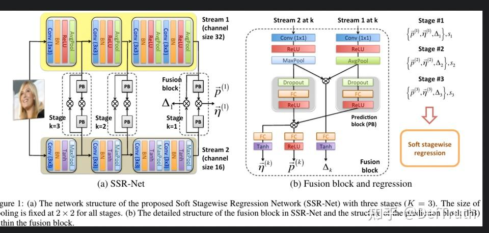

### 2.3 SSR 회귀

```text
\tilde{y}
=\sum_{k=1}^{K} \vec{p}^{(k)} \cdot \vec{\mu}^{(k)}=\sum_{k=1}^{K}
\sum_{i=0}^{s_{k}-1} p_{i}^{(k)} \cdot
\bar{i}\left(\frac{V}{\prod_{j=1}^{k} s_{j}}\right)
```

`V=90`이라고 하자. 즉 나이 범위가 0세부터 90세까지다. stage 수는 `K=2`, 각 stage의 나이 구간 수는 3, 즉 `s_1=s_2=s_3`라고 둔다. 그러면 `K=1` 단계에서 각 나이 구간은 `(0~30)`, `(30~60)`, `(60~90)`이다. `K=2` 단계에서는 각 구간을 다시 세 구간으로 나누므로 각 구간은 `(+0~10)`, `(+10~20)`, `(+20~30)`이 된다. 논문에서는 `K=3`이고 `s_1=s_2=s_3=3`이다. SSR에는 주의할 세부 사항이 하나 있다.

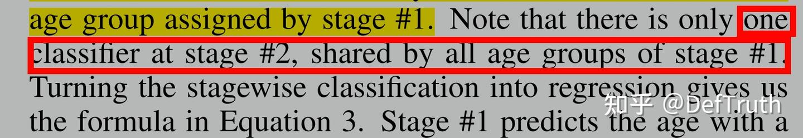

의미는 다음과 같다. 각 stage에는 classifier가 하나뿐이다. 여기서는 잠시 classifier라고 표현하지만, 뒤에서 왜 실제로는 regressor인지 설명한다. 첫 stage에는 구간이 3개 있다. `s_1=s_2=s_3=3`이므로 두 번째 stage에는 실제로 9개 구간이 있고, 세 번째 stage에는 실제로 27개 구간이 있다. 그러나 두 번째 stage가 이전 stage의 3개 구간 각각에 classifier를 하나씩 만드는 것은 아니다. 하나의 classifier를 공유한다. 세 번째 stage도 마찬가지다.

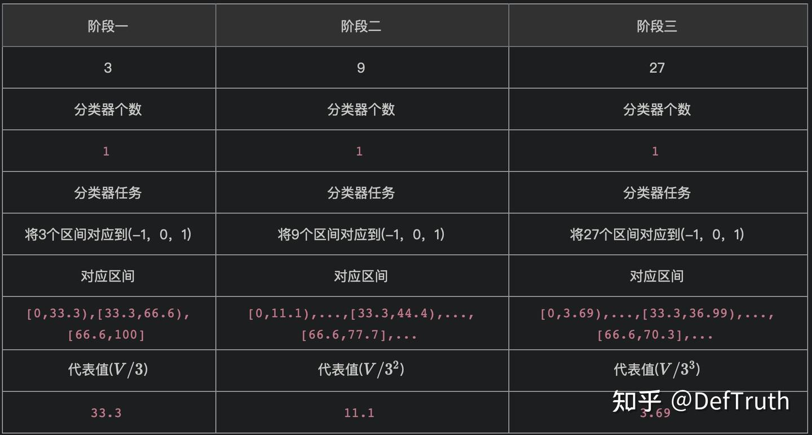

주: `(-1,0,1)`은 "relatively younger", "about right", "relatively older"를 나타낸다.

계산식을 펼치면 다음과 같다.

```text
\tilde{y}_{0}=(p_{0}^{1}*0*33.3+p_{1}^{1}*1*33.3+p_{2}^{1}*2*33.3), 33.3+2*33.3=99.9

\tilde{y}_{1}=(p_{0}^{2}*0*11.1+p_{1}^{2}*1*11.1+p_{2}^{2}*2*11.1), 11.1+2*11.1=33.3

\tilde{y}_{2}=(p_{0}^{3}*0*3.69+p_{1}^{3}*1*3.69+p_{2}^{3}*2*3.69), 3.69+2*3.69=11.1

\tilde{y}=\tilde{y}_{1}+\tilde{y}_{2}+\tilde{y}_{3}
```

### 2.4 Dynamic Range

저자는 나이는 연속적이고 불확실성도 있으므로, 나이를 평균적이고 겹치지 않는 영역으로 거칠게 나누는 방식은 유연하지 않다고 말한다. 그래서 dynamic range를 사용한다. 의미는 각 나이 구간이 shifted and scaled될 수 있다는 것이다. BatchNorm이 제안됐을 때도 익숙하게 봤던 표현이다.

그렇다면 이 나이 dynamic range는 구체적으로 어떻게 구현할까. 분모로 사용되는 각 `s_k`를 입력 feature에 따라 동적으로 조정할 수 있게 한다.

```text
\bar{s}_{k}=s_{k}\left(1+\Delta_{k}\right)
```

마찬가지로 각 stage의 `s_k`개 대표값 `(\mu_0^k,...,\mu_{s_k-1}^k)`도 입력 feature에 따라 smooth하게 조정할 수 있게 한다.

```text
\bar{i}=i+\eta_{i}^{(k)},\vec{\eta}^{(k)}=\left(\eta_{0}^{(k)}, \eta_{1}^{(k)}, \dots, \eta_{s_{k}-1}^{(k)}\right)
```

`\tilde{p}^{(k)}`와 `\tilde{\eta}^{(k)}`는 모두 vector이며, 각 component가 일대일로 대응한다.

```text
\tilde{p}^{(k)}=\left(p_{0}^{(k)}, p_{1}^{(k)}, \dots, p_{s_{k}-1}^{(k)}\right)
```

반면 `\Delta_k`는 scalar이고, `k`번째 stage의 `s_k`개 대표값이 공유한다. 따라서 최종 SSR 계산식은 다음과 같다.

```text
\tilde{y}
=\sum_{k=1}^{K} \vec{p}^{(k)} \cdot \vec{\mu}^{(k)}=\sum_{k=1}^{K}
\sum_{i=0}^{s_{k}-1} p_{i}^{(k)} \cdot
\bar{i}\left(\frac{V}{\prod_{j=1}^{k} s_{j}}\right)
```

### 3. CapsuleNet 복습

FSANet은 마지막 feature fusion에서 CapsuleNet을 사용하므로 CapsuleNet도 이해할 필요가 있다. CapsuleNet은 일반 neuron의 확장이다. capsule unit은 vector이고, 일반 neural network model에서 neuron은 scalar다.

### 3.1 CapsNet의 흐름

현재 layer에 capsule 집합 `capsule_l=(u_1,u_2,...,u_n)`이 있다고 가정한다. 각 capsule `u_i, i=1,...,n`은 vector다. 우리는 `u_i, i=1,...,n`을 통해 다음 layer의 capsule 집합 `capsule_{l+1}=(v_1,v_2,...,v_m)`을 얻어야 한다. 각 output capsule `v_j, j=1,...,m`도 vector다.

구체적으로 `u_i \in R^{K x 1}`, `v_j \in R^{P x 1}`이다. `K`는 `l`번째 layer에서 각 capsule의 차원이고, `P`는 `l+1`번째 layer에서 각 capsule의 차원이다. 서로 다른 capsule 정보를 융합하기 위해 CapsNet은 transformation matrix `W_ij`를 사용해 먼저 `u_i`를 변환한다. CNN에서 weighted sum 뒤 activation function을 붙이는 것과 비슷하게, `u_i`를 `P`차원 vector로 변환한다. 이 중간 vector 계산을 다음과 같이 쓴다. `W`는 DNN으로 자동 학습된다. 예를 들어 현재 layer의 8차원 capsule을 다음 capsule에 필요한 16차원으로 변환하는데, 본질적으로 linear/nonlinear transformation이다.

```text
\hat{u}_{j|i}=W_{ij}u_{i},\hat{u}_{j|i} \in R^{P x 1},W_{ij} \in R^{P x K},u_{i} \in R^{K x 1}
```

여기서 `\hat{u}_{j|i}`는 `l`번째 layer의 `i`번째 capsule이 `l+1`번째 layer의 `j`번째 capsule에 주는 "contribution"으로 이해할 수 있다. 또는 `l+1`번째 layer의 `j`번째 capsule이 `l`번째 layer의 `i`번째 capsule 위에 놓이는 component라고 볼 수도 있다.

하나의 `v_j`는 `n`개의 upstream component와 대응한다. 이들은 각각 `(u_1,u_2,...,u_n)`과 연결되고, `(\hat{u}_{j|1},\hat{u}_{j|2},...,\hat{u}_{j|n})`에 대응한다. 반대로 하나의 `u_i`는 downstream의 `m`개 `v_j`에 contribution을 만든다. 각각 `(v_1,v_2,...,v_m)`에 대응하며 `(\hat{u}_{1|i},\hat{u}_{2|i},...,\hat{u}_{m|i})`로 표현된다.

더 나아가 `c_ij`가 `u_i`와 `v_j`의 관련 정도를 나타낸다고 하자. 그리고 `u_i`가 `v_j`에 주는 contribution이 `\hat{u}_{j|i}`임을 이미 알고 있다. 따라서 `v_j`를 계산할 때는 `(u_1,u_2,...,u_n)`이 주는 전체 contribution을 고려해야 하며, 가중치는 각각 `(c_{1j},c_{2j},...,c_{nj})`다. weighted sum으로 쓰면 다음과 같다.

```text
s_{j}=\sum_{i}^{n}{c_{ij} \hat{u}_{j|i}},\hat{u}_{j|i}=W_{ij}u_{i}.
```

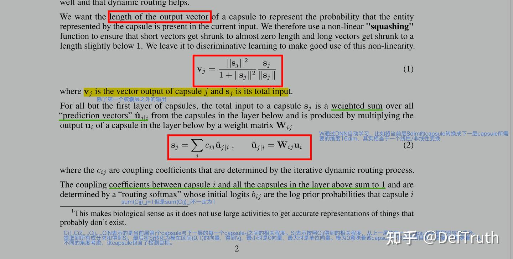

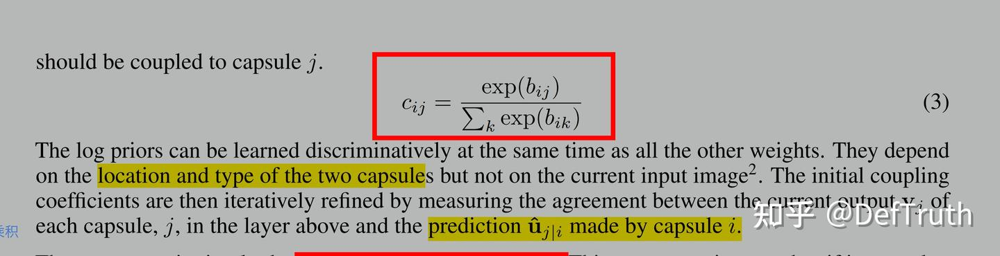

마지막으로 저자는 `v_j`의 길이, 즉 norm이 어떤 entity의 확률 분포를 대표하길 원했다. 그래서 nonlinear squash function으로 vector를 정규화한다. norm이 작을수록 어떤 entity일 가능성이 낮고, 값이 클수록 어떤 entity일 가능성이 높다.

```text
\mathbf{v}_{j}=\frac{\left\|\mathbf{s}_{j}\right\|^{2}}{1+\left\|\mathbf{s}_{j}\right\|^{2}} \frac{\mathbf{s}_{j}}{\left\|\mathbf{s}_{j}\right\|}
```

이 식을 통해 `||v||` 값을 `(0,1)` 사이로 제한할 수 있다. activation 정도가 낮은 vector는 0에 가깝게 만들고, activation 정도가 높은 vector는 1에 가깝게 만든다. `c_ij`는 softmax를 거친 정규화 weight다.

```text
c_{i j}=\frac{\exp \left(b_{i j}\right)}{\sum_{k} \exp \left(b_{i k}\right)}
```

주의할 점은 이 정규화가 `j`를 기준으로 이뤄진다는 것이다. 즉 같은 `i`에 대해서는 `\sum_j^m c_{ij}=1`이지만, 같은 `j`에 대해서 반드시 `\sum_i^n c_{ij}=1`인 것은 아니다. 따라서 `s_j=\sum_i^n c_{ij}\hat{u}_{j|i}`를 계산한 뒤 `\mathbf{v}_j` 식으로 정규화하는 과정이 필요하다. `s_j`를 구하는 단계에서는 `\sum_i^n c_{ij}=1`을 보장할 수 없으므로, 정규화하지 않으면 `s_j` 값이 누적적으로 커지거나 작아질 수 있고 모델이 수렴하기 어려워질 수 있다.

### 3.2 Dynamic Routing

우리는 이미 `c_ij` 계산식을 알고 있다.

```text
c_{i j}=\frac{\exp \left(b_{i j}\right)}{\sum_{k} \exp \left(b_{i k}\right)}
```

그렇다면 마지막 문제는 `b_ij`를 어떻게 계산하느냐다. 분명 `b_ij`는 어떤 종류의 correlation 표현이어야 한다. `b_ij`가 클수록 관련성이 더 크다는 뜻이다. 이제 `v_j`의 구성 과정을 다시 보자. 마지막 단계는 다음과 같다.

```text
\mathbf{v}_{j}=\frac{\left\|\mathbf{s}_{j}\right\|^{2}}{1+\left\|\mathbf{s}_{j}\right\|^{2}} \frac{\mathbf{s}_{j}}{\left\|\mathbf{s}_{j}\right\|}
```

이 단계에서 `v_j`는 norm이 `(0,1)` 사이인 vector다. 마찬가지로 `u_i`의 norm도 `(0,1)` 사이다. `u_i`는 `l-1`번째 layer의 capsule로 계산되고 같은 squash function을 사용하기 때문이다. 따라서 `\hat{u}_{j|i}`의 norm도 대략 `(0,1)` 사이가 된다.

두 vector의 유사도를 측정할 때 cosine similarity를 사용할 수 있다. cosine 값이 1에 가까울수록 angle이 0도에 가깝고, 두 vector가 더 비슷하다는 뜻이다.

```text
\begin{aligned}
 \cos (\theta) &=\frac{\sum_{i=1}^{n}\left(X_{i} \times
y_{i}\right)}{\sqrt{\sum_{i=1}^{n}\left(X_{i}\right)^{2}} \times
\sqrt{\sum_{i=1}^{n}\left(y_{i}\right)^{2}}} \\ &=\frac{a \cdot
b}{|| a|| \times|| b||} \end{aligned}
```

따라서 두 vector의 유사도는 항상 dot product와 비례한다. 그래서 다음과 같이 둘 수 있다.

```text
b_{ij}=v_{j}\cdot \hat{u}_{j|i}
```

CapsuleNet은 여기에 dynamic routing algorithm을 한 단계 더 추가하여 관련 vector의 weight를 더 키운다. dynamic routing algorithm을 거친 뒤 원래 `v_j`와 관련성이 높던 `\hat{u}_{j|i}`는 더 관련성이 높아지고, 관련성이 낮던 것은 더 낮아진다.

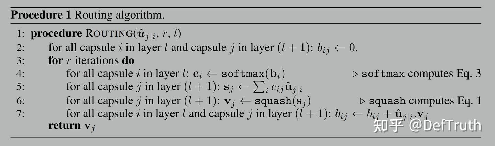

식은 다음과 같다.

```text
b_{ij} \leftarrow b_{ij}+\hat{u}_{j|i} \cdot v_{j}
```

예를 들어 `r=2`라고 두면 다음과 같다.

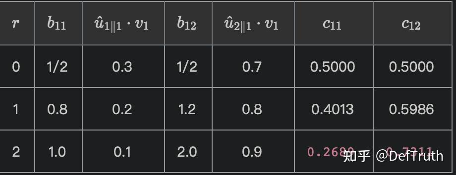

주: constraint가 `\sum_{j=1}^{2}{c_{1j}}=1`, `c_{1j}=\frac{\exp(b_{1j})}{\sum_k \exp(b_{1k})}`라고 가정한다.

### 4. FSANet 모델 구조

SSRNet과 CapsuleNet을 이해했으므로 이제 FSANet 구조를 볼 수 있다. 물론 그 전에 depthwise separable convolution이 무엇인지도 이해해 두는 것이 좋다.

Head pose estimation의 주요 task는 주어진 이미지에서 머리 자세를 나타내는 세 오일러각 `(yaw,pitch,roll)`을 추정하는 것이다. `\{x_n|n=1,2,...,N\}`이 `N`장의 training image를 나타내고, `y_n=(yaw,pitch,roll)`이 대응하는 head pose라고 하자. Head pose estimation의 task는 `\tilde{y}=F(x)`가 되도록 fitting function `F`를 찾는 것이다. 주어진 실제 head pose `y`에 대해 평균 오차 MAE를 최소화하는 방식으로 `F`를 푼다.

```text
J(x)=\frac{1}{N} \sum_{n=1}^{N}{||\tilde{y}_{n}-y_{n}||_{1}}
```

### 4.1 SSRNet-MD

일반 SSRNet의 역할은 `SSR({\vec{p}^{(k)},\vec{\eta}^{(k)},\Delta_k}_{k=1}^K)`로 나타낼 수 있다. SSR network는 `K`개의 parameter set `({\vec{p}^{(k)},\vec{\eta}^{(k)},\Delta_k}_{k=1}^K)`를 입력으로 받고, 이 입력들로 SSR regression을 수행하여 최종 출력 결과를 얻는다.

나이 검출과 달리 head pose estimation의 출력은 `(yaw,pitch,roll)`을 포함하는 multidimensional vector다. 나이 회귀 결과는 scalar다. 따라서 저자는 원래 scalar regression용 SSRNet을 vector regression용 SSRNet-MD로 확장했다.

### 4.2 FSANet 구조

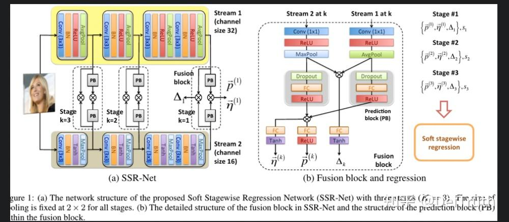

SSRNet

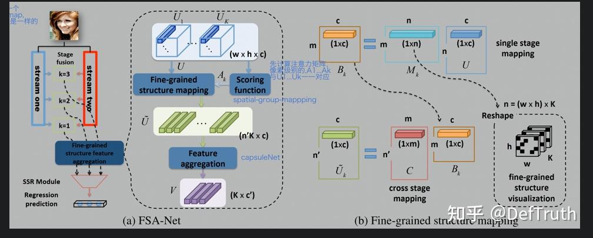

FSANet

FSANet은 주로 네 module로 구성된다.

- Stage-Fusion

역할: feature extraction을 수행해 `(U_1,U_2,U_3)`를 raw feature로 얻는다. 첫 번째 단계의 feature fusion은 SSRNet의 parallel feature extraction 구조와 top-down multi-scale feature fusion을 사용한다. 즉 세 stage 각각에서 SSRNet의 두 branch feature를 융합한다. 다만 fusion 방식은 원래 SSRNet과 다르다. 마지막에는 세 stage의 서로 다른 feature map `(U_1,U_2,U_3)`을 얻는다. FSANet에서 서로 다른 stage의 feature map 크기는 같고, `w*h*c`로 지정된다. 여기서 `c`는 feature map channel 수다. 이후 FSANet은 `(U_1,U_2,U_3)`를 Fine-grained structure feature aggregation module에 보내 fine-grained structural feature fusion과 capsule information extraction을 수행한다.

- Fine-grained structure feature aggregation

역할: attention mechanism, importance matrix 계산, fine-grained spatial structure mapping, CapsuleNet feature extraction을 수행하여 마지막에 `K`개의 `c'`차원 capsule을 얻는다. 두 번째 단계의 feature fusion이며, 주로 Score-function, Fine-grained structure mapping, Feature aggregation 세 submodule을 포함한다. Score-function module은 feature map `(U_1,U_2,U_3)` 안의 각 spatial location feature point `(w*h)`에 대한 importance matrix `(A_k,k=1,2,3)`를 계산한다. `w*h`의 각 spatial point는 `c`차원 vector로 표현되며, 사실 capsule로 이해할 수 있다.

Fine-grained structure mapping module은 계산된 `A_k`와 `(U_1,U_2,U_3)`를 사용해 model training으로 `S_k` 집합을 찾고, `U=(U_1,U_2,U_3)`에 대해 spatial structure aggregation을 수행한다. 유사한 정보를 표현하는 spatial point의 feature vector를 weighted sum으로 결합해 새로운 feature를 형성한다. 각 stage의 feature map은 이런 `c`차원 feature vector를 `n'`개 얻는다. stage가 `K=3`개이므로 마지막에는 `n'K`개의 `c`차원 feature vector가 생긴다. 이 역시 `n'K`개의 `c`차원 capsule로 이해할 수 있다. 마지막 Feature aggregation module은 CapsNet을 사용해 `n'K`개의 `c`차원 capsule을 `K`개의 `c'`차원 capsule `V=(v_1,v_2,v_3),K=3`으로 변환한다.

- Fully-connected layer

역할: 이 fully-connected layer module은 `V=(v_1,v_2,v_3)` feature vector를 SSR module이 필요로 하는 입력, 즉 `({\vec{p}^{(k)},\vec{\eta}^{(k)},\Delta_k}_{k=1}^K)`로 변환한다.

- SSR Module

역할: `SSR({\vec{p}^{(k)},\vec{\eta}^{(k)},\Delta_k}_{k=1}^K)`. SSR network는 `K`개의 parameter set `({\vec{p}^{(k)},\vec{\eta}^{(k)},\Delta_k}_{k=1}^K)`를 입력으로 받아 SSR regression을 수행하고, 최종 결과 `(yaw,pitch,roll)`을 얻는다.

### 4.3 Stage-Fusion

Stage-Fusion 단계는 SSRNet과 비슷하지만 convolution 구조가 다르다. SSRNet은 일반 conv layer를 사용하는 반면, Stage-Fusion은 depthwise separable convolution을 사용한다. 두 branch는 서로 다른 activation function과 pooling layer로 feature를 추출한다. 두 branch는 각각 다음 구조를 사용한다.

```text
B_R(c)={SepConv2D(3x3,c)-BN-ReLU}

B_T(c)={SepConv2D(3x3,c)-BN-Tanh}
```

여기서 `c`는 branch channel 수만 나타내며, 앞에서 사용한 `c`와 의미가 다르다. 두 stream은 다음과 같다.

```text
Stream2=
 {B_T(16)-MaxPool(2x2)-B_T(32)-MaxPool(2x2)}_{k=1}-
 {B_T(64)-B_T(64)-MaxPool(2x2)}_{k=2}-
 {B_T(128)-B_T(128)}_{k=3}

Stream1=
 {B_R(16)-AvgPool(2x2)-B_R(32)-AvgPool(2x2)}_{k=1}-
 {B_R(64)-B_R(64)-AvgPool(2x2)}_{k=2}-
 {B_R(128)-B_R(128)}_{k=3}
```

```python
    # Author source: use depthwise separable convolution instead of normal convolution
    def _convBlock(x, num_filters, activation, kernel_size=(3, 3)):
        x = SeparableConv2D(num_filters, kernel_size, padding='same')(x)
        x = BatchNormalization(axis=-1)(x)
        x = Activation(activation)(x)
        return x
```

두 branch의 서로 다른 stage feature를 얻은 뒤, 같은 stage의 두 feature map에 다시 element-wise-Mul + conv1x1 + avg-pool을 사용해 feature fusion을 수행한다. 다만 source 구현에서는 fusion 순서가 조금 다르다. source는 conv1x1 + elw-Mul + avg-pool이다. 개인적으로는 뒤의 순서가 parameter 수를 더 줄일 수 있다고 이해한다. 마지막으로 Stage-Fusion module은 fusion된 세 stage feature `(U_1,U_2,U_3)`를 얻으며, 각 feature map의 차원은 모두 `8*8*64`다.

```python
 # Author source: pay attention to the operation order of feature fusion
   def ssr_G_model_build(self, img_inputs):
        """Two-stream structure for extracting the features."""
        ...
        # -------------------------------------------------------------------------------------
        s_layer4 = Conv2D(64, (1, 1), activation='tanh')(s_layer4)  # (8,8,64)
        x_layer4 = Conv2D(64, (1, 1), activation='relu')(x_layer4)  # (8,8,64)
        feat_s1_pre = Multiply()([s_layer4, x_layer4])  # stage fusion elw-mul+conv1x1
        # -------------------------------------------------------------------------------------
        s_layer3 = Conv2D(64, (1, 1), activation='tanh')(s_layer3)  # (8,8,64)
        x_layer3 = Conv2D(64, (1, 1), activation='relu')(x_layer3)  # (8,8,64)
        feat_s2_pre = Multiply()([s_layer3, x_layer3])  # (8,8,64)
        # -------------------------------------------------------------------------------------
        s_layer2 = Conv2D(64, (1, 1), activation='tanh')(s_layer2)  # (16,16,64)
        x_layer2 = Conv2D(64, (1, 1), activation='relu')(x_layer2)  # (16,16,64)
        feat_s3_pre = Multiply()([s_layer2, x_layer2])  # (16,16,64)
        # -------------------------------------------------------------------------------------
        feat_s3_pre = AveragePooling2D((2, 2))(feat_s3_pre)  # make sure (8x8x64) feature map
```

### 4.4 Fine-grained Structure Feature Aggregation

이제 feature map `U_k`와 대응하는 score matrix `A_k`를 얻었다. 이 시점에서 저자가 `A_k`로 무엇을 하려는지 생각해 볼 수 있다. 이미 score matrix를 얻었고, 각 spatial point의 importance degree도 얻었다. 그런데 왜 Fine-grained structure mapping을 해야 할까.

이것이 저자가 강조하려는 문제다. `A_k` 안의 각 spatial point score는 자기 자신과만 관련되어 있고 주변 spatial point와 연결되어 있지 않다. importance score를 얻더라도 여전히 bag of features 문제가 존재한다. 저자는 spatial feature를 효과적으로 group하기 위해 이 score matrix를 활용할 수 있다고 본다.

예를 들어 `(i,j)`, `(i-1,j-1)`, `(i+1,j+1)`의 score가 각각 `(0.8,0.1,0.9)`라고 하자. 같은 target output에 대해 `(i,j)`와 `(i+1,j+1)`의 activation degree, 즉 importance degree는 가깝다. 그러면 이 두 spatial point의 feature vector는 유사한 semantics를 표현할 가능성이 높다. 반대로 `(i,j)`와 `(i-1,j-1)`의 activation degree 차이는 크므로, 이 두 spatial point가 표현하는 semantics는 크게 다를 가능성이 높다. 따라서 직관적으로 `A_k` matrix를 통해 spatial structure상 관련성이 큰 feature들을 결합할 수 있다.

그렇다면 어떻게 해결할까. 이것이 Fine-grained structure mapping module이 해결하는 문제다. 저자는 모델에게 풀게 하자고 말한다. in a deep learning way다.

먼저 저자는 `(U_1,U_2,U_3)`를 flatten하고 merge하여 feature matrix `U \in R^{n x c}`로 만든다. 여기서 `n=w*h*K`, `K=3`, `w=h=8`이다. 이 tensor flatten 방식은 같은 feature map의 서로 다른 spatial point feature vector가 `U`의 row 방향에 연속으로 배열되게 한다. Fine-grained structure mapping의 task는 알려진 score matrix `A_k,k=1,2,3`를 통해 mapping matrix `S_k`를 얻는 것이다. `S_k`는 linear mapping이며, matrix multiplication으로 `n=w*h*K`개의 input spatial point feature vector를 `n'`개의 새로운 feature `\tilde{U}_k \in R^{n' x c}`로 mapping한다. 식은 다음과 같다.

```text
\tilde{U}_{k}=S_{k}U,S_{k} \in R^{n' x n}
```

복잡해 보이지만 비유하면 쉽게 이해할 수 있다. `U \in R^{n x c}`에 DNN 버전의 principal component analysis를 적용하는 것이다. `n`개의 feature를 `n'`개의 주요 feature로 압축한다. 다만 전통적인 PCA는 eigenvalue decomposition으로 `S_k`를 푸는 반면, FSANet은 gradient descent를 사용한다.

더 나아가 계산 복잡도를 줄이기 위해 저자는 `S_k`를 직접 계산하지 않고 분해한다.

```text
S_{k}=CM_{k},M_{k}=\sigma{f_{M}(A_{k})},C=\sigma{f_{C}(A)},k=1,2,3.
```

여기서 `f`는 fully-connected layer를 나타낸다. `C \in R^{n' x m}`, `M_k \in R^{m x n}`이며, `m`, `n'`은 지정 가능한 hyperparameter다. 논문에서 저자는 `m=5`, `n'=7`로 설정한다. 주의할 점은 `A=(A_1,A_2,A_3)`이므로 `C`는 global correlation parameter matrix이고, `M_k`는 `A_k`에만 관련된다는 것이다.

왜 이렇게 설정할까. 왜 `M_k`도 전체 `A`를 사용해 학습하지 않을까. 그렇게 하면 두 가지 단점이 있다. 첫째, parameter 수가 커진다. 둘째, `M_k`가 전체 `A=(A_1,A_2,A_3)`와 관련되면 `C`와 차이가 없어지고, 최종적으로 DNN이 학습한 parameter가 같아질 가능성이 높다. `M_k`의 의미는 각 stage마다 feature를 선택한다는 데 있다.

`S_k,k=1,2,3`을 얻은 뒤에는 자연스럽게 다음을 계산할 수 있다.

```text
\tilde{U}=[\tilde{U}_{1},\tilde{U}_{2},\tilde{U}_{3}],\tilde{U} \in R^{n' x K x c}
```

이것이 Fine-grained structure mapping module의 출력이다.

Feature aggregation network: Fine-grained structure mapping을 통해 `\tilde{U}=[\tilde{U}_1,\tilde{U}_2,\tilde{U}_3]`, `\tilde{U} \in R^{n' x K x c}`를 얻은 뒤, 저자는 이 feature map을 `n'*K=7*3=21`개의 `c`차원 capsule로 본다. 그리고 이 capsule 집합을 capsule layer `CapsLayer`에 넣어 CapsuleNet으로 새로운 capsule 집합을 얻는다.

```text
V=CapsLayer(\tilde{U}),V \in R^{K x c'},K=3,c'=16.
```

의미는 각 stage의 feature를 최종적으로 하나의 capsule만으로 표현한다는 것이다.

### 4.5 Fully-connected Layer

`V=(v_1,v_2,v_3), v_i \in R^{c' x 1}`를 얻은 뒤에는 이 feature들로 각 stage의 `({\vec{p}^{(k)},\vec{\eta}^{(k)},\Delta_k}_{k=1}^K)`를 구할 수 있다. 저자는 fully-connected layer를 사용해 추출한다. source를 보면 된다.

```python
    def ssr_FC_model_build(self, feat_dim, name_F):
        input_s1_pre = Input((feat_dim,))  # (b,feat_dim) default feat_dim=dim_capsule=16
        input_s2_pre = Input((feat_dim,))  # (b,feat_dim)
        input_s3_pre = Input((feat_dim,))  # (b,feat_dim)
        def _process_input(stage_index, stage_num, num_classes, input_s_pre):
            feat_delta_s = Dense(2 * num_classes, activation='tanh')(input_s_pre)
            delta_s = Dense(num_classes, activation='tanh',
                            name=f'delta_s{stage_index}')(feat_delta_s)  # (b,3)
            feat_local_s = Dense(2 * num_classes, activation='tanh')(input_s_pre)
            local_s = Dense(units=num_classes, activation='tanh',
                            name=f'local_delta_stage{stage_index}')(feat_local_s)  # (b,3)
            feat_pred_s = Dense(stage_num * num_classes, activation='relu')(input_s_pre)
            pred_s = Reshape((num_classes, stage_num))(feat_pred_s)  # (b,3,3)
            return delta_s, local_s, pred_s  # (b,3) (b,3) (b,3,3)
        delta_s1, local_s1, pred_s1 = \
        			_process_input(1, self.stage_num[0], self.num_classes, input_s1_pre)
        delta_s2, local_s2, pred_s2 = \
              _process_input(2, self.stage_num[1], self.num_classes, input_s2_pre)
        delta_s3, local_s3, pred_s3 = \
              _process_input(3, self.stage_num[2], self.num_classes, input_s3_pre)
        return Model(inputs=[input_s1_pre, input_s2_pre, input_s3_pre],
                     outputs=[pred_s1, pred_s2, pred_s3,
                              delta_s1, delta_s2, delta_s3,
                              local_s1, local_s2, local_s3], name=name_F)
```

### 4.6 SSR Module

`SSR({\vec{p}^{(k)},\vec{\eta}^{(k)},\Delta_k}_{k=1}^K)`. SSR network는 `K`개의 parameter set `({\vec{p}^{(k)},\vec{\eta}^{(k)},\Delta_k}_{k=1}^K)`를 입력으로 받아 SSR regression을 수행하고, 최종 출력 `(yaw,pitch,row)`를 얻는다. source를 바로 보자. 주석은 개인적 이해다.

```python
@register_keras_custom_object
class SSRLayer(Layer):
    """
    Taking the prediction, dynamic index shifting, and dynamic scaling
    for the final regression output. In this case, there are three outputs (yaw, pitch, roll).
    """
    def __init__(self, s1, s2, s3, lambda_d, **kwargs):
        super(SSRLayer, self).__init__(**kwargs)
        self.s1 = s1
        self.s2 = s2
        self.s3 = s3
        self.lambda_d = lambda_d
        # rewrite trainable parameter, default True.
        self.trainable = False

    def call(self, inputs, **kwargs):
        """
        :param inputs:
               A list of:
                [pred_a_s1, pred_a_s2, pred_a_s3,
                delta_s1, delta_s2, delta_s3,
                local_s1, local_s2, local_s3]
        :param kwargs:
        :return:
        """
        x = inputs
        a = x[0][:, :, 0] * 0  # (b,3)
        b = x[0][:, :, 0] * 0  # (b,3)
        c = x[0][:, :, 0] * 0  # (b,3)
        s1 = self.s1  # default 3
        s2 = self.s2  # default 3
        s3 = self.s3  # default 3
        lambda_d = self.lambda_d  # default 1
        di = s1 // 2  # 3//2=1 4//2=2
        dj = s2 // 2  # 3//2=1 4//2=2
        dk = s3 // 2  # 3//2=1 4//2=2
        V = 99
        for i in range(0, s1):
            a = a + (i - di + x[6]) * x[0][:, :, i]
        a = a / (s1 * (1 + lambda_d * x[3]))
        for j in range(0, s2):
            b = b + (j - dj + x[7]) * x[1][:, :, j]
        b = b / (s1 * (1 + lambda_d * x[3])) / (s2 * (1 + lambda_d * x[4]))
        for k in range(0, s3):
            c = c + (k - dk + x[8]) * x[2][:, :, k]
        c = c / (s1 * (1 + lambda_d * x[3])) / (s2 * (1 + lambda_d * x[4])) / (
                s3 * (1 + lambda_d * x[5]))
        # local_s parameter range is (-1,1), V=99, and classes should start from negative values to cover (-99,+99).
        # For example, s1=s2=s3=3 -> i belongs to (0,1,2) -> i-di=i-1 belongs to (-1,0,1)
        # -> i-di+x[6] belongs to (-2,2)
        # -> (i-di+x[6])*x[0][:,:,i] belongs to (-2,2)*(0,1) -> (-2,2) -> (-2,2)*V=(-2,2)*99
        # This can cover (-99,99). The same applies when s=4 -> i-di belongs to (-2,-1,0,1).
        """local_s is shared across different classes (yaw,pitch,roll), but not across stages."""
        pred = (a + b + c) * V
        return pred  # (b,3)
```

### 5. Loss Function

```text
J(x)=\frac{1}{N} \sum_{n=1}^{N}{||\tilde{y}_{n}-y_{n}||_{1}}
```

### 6. ONNXRuntime/MNN C++ 추론

C++ 추론 코드를 하나 둔다. 글을 쓸 때 늘 하던 기본 작업이다.

Lite.AI.ToolKit C++ 도구 상자로 FSANet head pose estimation 예제를 실행한다. ONNXRuntime C++, MNN, TNN 버전을 포함한다. FSANet의 weight file 크기는 **1MB**뿐이며, 매우 가벼운 head pose estimation 모델이다.

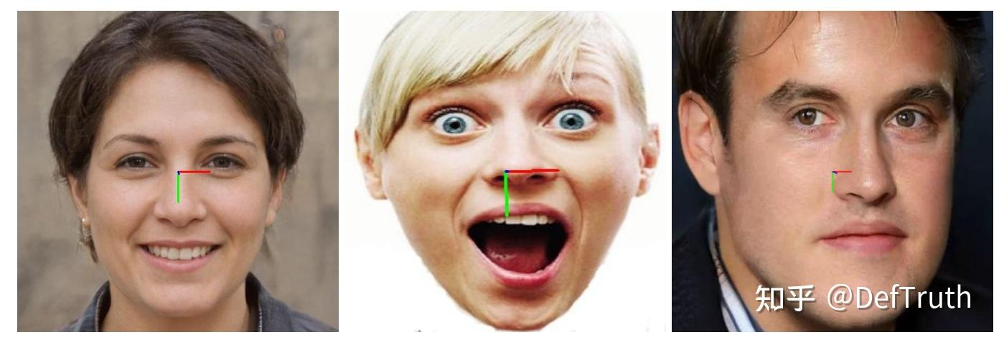

유용하다면 star로 지원할 수 있다.

### 6.1 C++ 버전 소스

FSANet C++ 버전 소스는 ONNXRuntime, MNN, TNN 세 버전을 포함한다. 소스는 `lite.ai.toolkit` 도구 상자에서 찾을 수 있다. 이 프로젝트는 주로 `lite.ai.toolkit` 도구 상자를 기반으로 FSANet을 직접 사용해 face detection을 실행하는 방법을 소개한다.

설명이 필요한 부분이 있다. 이 프로젝트는 MacOS에서 빌드한 `liblite.ai.toolkit.v0.1.0.dylib`를 기반으로 구현했다. MacOS 사용자는 이 프로젝트에 포함된 `liblite.ai.toolkit.v0.1.0` dynamic library와 다른 dependency library를 바로 내려받아 사용할 수 있다. MacOS가 아닌 사용자는 `lite.ai.toolkit`에서 source를 내려받아 직접 빌드해야 한다. `lite.ai.toolkit` C++ 도구 상자는 현재 80개 이상의 인기 open-source model을 포함한다. 평소 손 가는 대로 만든 것이고, 학습 과정에서 접한 모델들을 통합한 것이므로 여기서 길게 소개하지 않는다. 관심이 있으면 직접 보면 된다.

- fsanet.cpp
- fsanet.h
- mnn_fsanet.cpp
- mnn_fsanet.h
- tnn_fsanet.cpp
- tnn_fsanet.h

ONNXRuntime C++, MNN, TNN 버전의 추론 구현은 모두 테스트를 통과했다.

### 6.2 모델 파일

- ONNX 모델 파일

제공한 링크에서 내려받을 수 있다. Baidu Drive code는 `8gin`이다. 또는 이 repository에서 직접 내려받을 수도 있다.

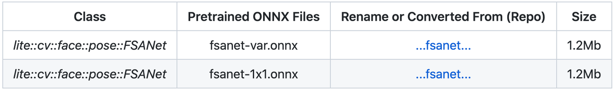

- MNN 모델 파일

MNN 모델 파일 다운로드 주소다. Baidu Drive code는 `9v63`이다. 또는 이 repository에서 직접 내려받을 수도 있다.

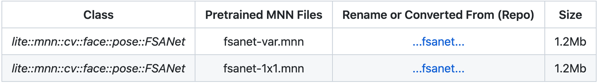

- TNN 모델 파일

TNN 모델 파일 다운로드 주소다. Baidu Drive code는 `6o6k`이다. 또는 이 repository에서 직접 내려받을 수도 있다.

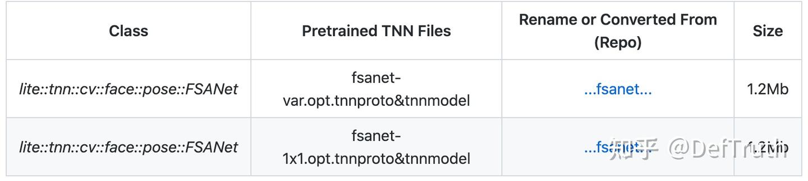

### 6.3 Interface 문서

`lite.ai.toolkit`에서 FSANet 구현 class는 다음과 같다.

```cpp
class LITE_EXPORTS lite::cv::face::pose::FSANet;
class LITE_EXPORTS lite::mnn::cv::face::pose::FSANet;
class LITE_EXPORTS lite::tnn::cv::face::pose::FSANet;

```

이 type은 현재 head pose detection을 수행하는 public interface `detect` 하나를 포함한다.

```cpp
public:
  void detect(const cv::Mat &mat, types::EulerAngles &euler_angles);

```

`detect` interface의 입력 parameter 설명:

- `mat`: `cv::Mat` type, BGR format. 얼굴 머리를 포함한 이미지 한 장이며 배경이 지나치게 많지 않아야 한다.
- `euler_angles`: `types::EulerAngles` type. 검출된 오일러각 `(yaw,pitch,roll)`을 포함하며 값 범위는 `[-90,+90]`이다.

### 6.4 사용 예시

여기서는 `fsanet-var`와 `fsanet-1x1` 모델의 평균을 사용해 테스트한다. 둘 중 하나만 사용할 수도 있다.

ONNXRuntime 버전:

```cpp
#include "lite/lite.h"

static void test_default()
{
    std::string var_onnx_path = "../hub/onnx/cv/fsanet-var.onnx";
    std::string conv_onnx_path = "../hub/onnx/cv/fsanet-1x1.onnx";
    std::string test_img_path = "../resources/1.jpg";
    std::string save_img_path = "../logs/1.jpg";
    
    auto *var_fsanet = new lite::cv::face::pose::FSANet(var_onnx_path);
    auto *conv_fsanet = new lite::cv::face::pose::FSANet(conv_onnx_path);
    cv::Mat img_bgr = cv::imread(test_img_path);
    lite::types::EulerAngles var_euler_angles, conv_euler_angles;
    
    // 1. detect euler angles.
    var_fsanet->detect(img_bgr, var_euler_angles);
    conv_fsanet->detect(img_bgr, conv_euler_angles);
    
    lite::types::EulerAngles euler_angles;
    
    euler_angles.yaw = (var_euler_angles.yaw + conv_euler_angles.yaw) / 2.0f;
    euler_angles.pitch = (var_euler_angles.pitch + conv_euler_angles.pitch) / 2.0f;
    euler_angles.roll = (var_euler_angles.roll + conv_euler_angles.roll) / 2.0f;
    euler_angles.flag = var_euler_angles.flag && conv_euler_angles.flag;
    
    if (euler_angles.flag)
    {
        lite::utils::draw_axis_inplace(img_bgr, euler_angles);
        
        cv::imwrite(save_img_path, img_bgr);
        
        std::cout << "Default Version"
                  << " yaw: " << euler_angles.yaw
                  << " pitch: " << euler_angles.pitch
                  << " roll: " << euler_angles.roll << std::endl;
    }
    
    delete var_fsanet;
    delete conv_fsanet;
}

```

MNN 버전:

```cpp
#include "lite/lite.h"

static void test_mnn()
{
#ifdef ENABLE_MNN
    std::string var_mnn_path = "../hub/mnn/cv/fsanet-var.mnn";
    std::string conv_mnn_path = "../hub/mnn/cv/fsanet-1x1.mnn";
    std::string test_img_path = "../resources/2.jpg";
    std::string save_img_path = "../logs/2_mnn.jpg";
    
    auto *var_fsanet = new lite::mnn::cv::face::pose::FSANet(var_mnn_path);
    auto *conv_fsanet = new lite::mnn::cv::face::pose::FSANet(conv_mnn_path);
    cv::Mat img_bgr = cv::imread(test_img_path);
    lite::types::EulerAngles var_euler_angles, conv_euler_angles;
    
    // 1. detect euler angles.
    var_fsanet->detect(img_bgr, var_euler_angles);
    conv_fsanet->detect(img_bgr, conv_euler_angles);
    
    lite::types::EulerAngles euler_angles;
    
    euler_angles.yaw = (var_euler_angles.yaw + conv_euler_angles.yaw) / 2.0f;
    euler_angles.pitch = (var_euler_angles.pitch + conv_euler_angles.pitch) / 2.0f;
    euler_angles.roll = (var_euler_angles.roll + conv_euler_angles.roll) / 2.0f;
    euler_angles.flag = var_euler_angles.flag && conv_euler_angles.flag;
    
    if (euler_angles.flag)
    {
        lite::utils::draw_axis_inplace(img_bgr, euler_angles);
        cv::imwrite(save_img_path, img_bgr);
        
        std::cout << "MNN Version"
                  << " yaw: " << euler_angles.yaw
                  << " pitch: " << euler_angles.pitch
                  << " roll: " << euler_angles.roll << std::endl;
    }
    
    delete var_fsanet;
    delete conv_fsanet;
#endif
}

```

TNN 버전:

```cpp
#include "lite/lite.h"

static void test_tnn()
{
#ifdef ENABLE_TNN
    std::string var_proto_path = "../hub/tnn/cv/fsanet-var.opt.tnnproto";
    std::string var_model_path = "../hub/tnn/cv/fsanet-var.opt.tnnmodel";
    std::string conv_proto_path = "../hub/tnn/cv/fsanet-1x1.opt.tnnproto";
    std::string conv_model_path = "../hub/tnn/cv/fsanet-1x1.opt.tnnmodel";
    std::string test_img_path = "../resources/2.jpg";
    std::string save_img_path = "../logs/2_tnn.jpg";
    
    auto *var_fsanet = new lite::tnn::cv::face::pose::FSANet(var_proto_path, var_model_path);
    auto *conv_fsanet = new lite::tnn::cv::face::pose::FSANet(conv_proto_path, conv_model_path);
    cv::Mat img_bgr = cv::imread(test_img_path);
    lite::types::EulerAngles var_euler_angles, conv_euler_angles;
    
    // 1. detect euler angles.
    var_fsanet->detect(img_bgr, var_euler_angles);
    conv_fsanet->detect(img_bgr, conv_euler_angles);
    
    lite::types::EulerAngles euler_angles;
    
    euler_angles.yaw = (var_euler_angles.yaw + conv_euler_angles.yaw) / 2.0f;
    euler_angles.pitch = (var_euler_angles.pitch + conv_euler_angles.pitch) / 2.0f;
    euler_angles.roll = (var_euler_angles.roll + conv_euler_angles.roll) / 2.0f;
    euler_angles.flag = var_euler_angles.flag && conv_euler_angles.flag;
    
    if (euler_angles.flag)
    {
        lite::utils::draw_axis_inplace(img_bgr, euler_angles);
        cv::imwrite(save_img_path, img_bgr);
        
        std::cout << "TNN Version"
                  << " yaw: " << euler_angles.yaw
                  << " pitch: " << euler_angles.pitch
                  << " roll: " << euler_angles.roll << std::endl;
    }
    
    delete var_fsanet;
    delete conv_fsanet;
#endif
}

```

출력 결과는 다음과 같다.


### 6.5 빌드 및 실행

MacOS에서는 이 프로젝트를 바로 빌드하고 실행할 수 있으며 다른 dependency library를 내려받을 필요가 없다. 다른 시스템에서는 먼저 `lite.ai.toolkit`에서 source를 내려받아 `lite.ai.toolkit.v0.1.0` dynamic library를 빌드해야 한다.

```bash
git clone --depth=1 https://github.com/DefTruth/fsanet.lite.ai.toolkit.git
cd fsanet.lite.ai.toolkit 
sh ./build.sh
```

building 및 testing information:

```text
[ 50%] Building CXX object CMakeFiles/lite_fsanet.dir/examples/test_lite_fsanet.cpp.o
[100%] Linking CXX executable lite_fsanet
[100%] Built target lite_fsanet
Testing Start ...
LITEORT_DEBUG LogId: ../hub/onnx/cv/fsanet-var.onnx
=============== Input-Dims ==============
input_node_dims: 1
input_node_dims: 3
input_node_dims: 64
input_node_dims: 64
=============== Output-Dims ==============
Output: 0 Name: output Dim: 0 :1
Output: 0 Name: output Dim: 1 :3
========================================
LITEORT_DEBUG LogId: ../hub/onnx/cv/fsanet-1x1.onnx
=============== Input-Dims ==============
input_node_dims: 1
input_node_dims: 3
input_node_dims: 64
input_node_dims: 64
=============== Output-Dims ==============
Output: 0 Name: output Dim: 0 :1
Output: 0 Name: output Dim: 1 :3
========================================
Default Version yaw: -1.68474 pitch: -5.54399 roll: -0.131204
LITEORT_DEBUG LogId: ../hub/onnx/cv/fsanet-var.onnx
=============== Input-Dims =============
...
Testing Successful !
```

### 6.7 Open Source 주소

- fsanet.lite.ai.toolkit: https://github.com/DefTruth/fsanet.lite.ai.toolkit
- Lite.AI.ToolKit(**1.5k stars**): https://github.com/DefTruth/lite.ai.toolkit

### 7. 참고 문헌 및 코드

논문: [FSA-Net: Learning Fine-Grained Structure Aggregation for Head Pose Estimation from a Single Image](https://github.com/shamangary/FSA-Net/blob/master/0191.pdf)

저자 코드: [FSA-Net keras](https://github.com/shamangary/FSA-Net)

더 많은 모델의 C++ engineering 사례를 알고 싶으면 좋아요와 팔로우를 누르면 된다.
