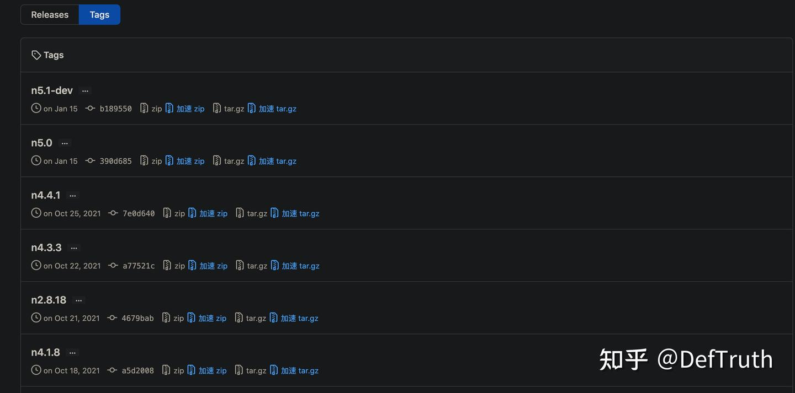

# OpenCV + FFmpeg 컴파일 및 패키징

> 원문: https://zhuanlan.zhihu.com/p/472115312

## 0. 서문

이 글은 거창한 내용을 다루지 않는다. 마주친 문제와 해결 방식을 간단히 기록해 나중에 다시 보기 위한 문서다. 최근 OpenCV source build를 조금 다뤘다. 오래된 주제라고 할 수 있다. 원래는 OpenCV를 source에서 빌드하고 따로 패키징해서 여러 machine에 배포하면 다시 컴파일하지 않고 바로 사용할 수 있게 만들 생각이었다.

처음에는 별일 아니라고 생각했다. OpenCV 패키징 정도는 금방 해결할 수 있을 줄 알았다. 그러나 실제로는 그렇지 않았다. 생각보다 몇 가지 문제가 있었다.

## 1. 마주친 문제

OSX 시스템을 예로 들면 주로 다음 문제들을 만났다.

- **OpenCV와 FFmpeg의 호환성 문제.** OpenCV의 `videoio` module은 mp4 format encoding/decoding에 FFmpeg를 의존한다. 완전한 OpenCV를 빌드하려면 FFmpeg도 함께 빌드해야 한다. 그런데 FFmpeg는 4.4 이후 상당히 큰 수정을 했고 API가 backward compatible하지 않다. 이로 인해 OpenCV와 FFmpeg 사이에 version conflict가 생긴다. 간단히 말해 지금 `apt-get install`이나 `brew install`로 최신 FFmpeg를 설치하면 OpenCV의 `videoio` module과 충돌하여 build가 실패한다. 결국 FFmpeg support가 없는 OpenCV만 빌드할 수 있다.

- **Dependency library 패키징 문제.** FFmpeg는 project management에 `make`를 사용하고 CMake를 사용하지 않는다. `./configure`에서 `--prefix`로 install path를 지정하면 path가 직접 hard-code된다. hard-code하지 않는 방법을 한참 찾았지만 찾지 못했다. 이러면 문제가 있다. 예를 들어 `--prefix=/usr/local/opt/ffmpeg` 같은 install path를 지정하면, FFmpeg에 의존하는 OpenCV를 다른 machine으로 패키징해서 옮겼을 때 바로 쓸 수 없다. 같은 방식으로 FFmpeg를 다시 빌드하고 `/usr/local/opt/ffmpeg`라는 같은 directory에 설치해야 한다. 사용성 측면에서 좋지 않다. 물론 `install_name_tool`로 dependency library path를 수정해 볼 수는 있다. 하지만 이것도 문제가 있다. `install_name_tool`은 dependency library는 수정할 수 있지만 library 자기 자신은 수정할 수 없다. OSX에서 컴파일된 dylib는 자기 자신으로도 link되는데, 이 path는 `-change`로 바꿀 수 없다는 뜻이다. 이 부분은 꽤 오래 시도했지만 자기 자신의 dependency path는 실제로 수정할 수 없고, 그 library가 의존하는 다른 library의 path만 수정할 수 있었다. 다른 성공 방법이 있는지는 나중에 더 파 볼 문제다. `install_name_tool`에 익숙한 사람이 이런 문제를 겪어 본 적이 있는지도 궁금하다.

최종 목적을 간단히 설명한다. OSX 시스템 기준이며, 다른 운영체제는 나중에 추가한다.

- OpenCV와 FFmpeg를 함께 패키징해서 다른 OSX machine에 배포할 때, FFmpeg를 따로 설치할 필요 없이 빌드된 OpenCV와 FFmpeg dynamic library를 한곳에 두기만 하면 사용할 수 있게 한다.
- 이를 위해 두 가지 조건을 만족해야 한다.
- (1) OpenCV가 system에 설치된 FFmpeg가 아니라 custom build한 FFmpeg에 link되어야 한다.
- (2) custom build한 FFmpeg의 서로 의존하는 library path는 relative여야 하며 hard-code되면 안 된다. 적어도 같은 directory에서 찾을 수 있어야 한다.

이제 내가 사용한 해결 방식을 설명한다. 방법의 우열을 말하려는 것은 아니고 기록용이다.

## 2. 문제 해결

### 2.1 OpenCV와 FFmpeg의 version compatibility

이 문제는 최근에 생긴 것이 아니라 어느 정도 시간이 지난 문제다. 구체적으로는 OpenCV repository의 `issues#20147`을 참고할 수 있다. 이전에는 내 machine에 설치된 오래된 FFmpeg와 OpenCV가 계속 잘 맞았다. 최근 OpenCV를 다시 컴파일하려고 brew로 FFmpeg를 최신 5.0 version으로 올렸고, 그 뒤 `videoio` module이 계속 error를 내면서 version incompatibility 문제를 알게 됐다. error message는 다음과 같다.

```text
cap_ffmpeg_impl.hpp:606:34: error: 'AVStream' {aka 'struct AVStream'} has no member named 'codec'
```

비슷한 error가 여러 군데 더 있지만 하나씩 나열하지 않는다. OpenCV issue에서도 이 문제를 설명한다. FFmpeg가 4.4보다 높은 version이면 API interface 변경이 너무 커서 OpenCV와 호환되지 않는다. OpenCV `videoio`의 update가 FFmpeg보다 뒤처진 것이다. OpenCV와 호환하려면 FFmpeg 4.3.x 또는 그 이하 version을 설치해야 한다. 내가 만든 `lite.ai.toolkit` 도구 상자를 사용하는 사람도 비슷한 문제를 겪었다. 자세한 논의는 `issues#203`을 보면 된다.

따라서 기능이 완전한 OpenCV를 순조롭게 빌드하려면 먼저 적절한 FFmpeg version을 선택하고, 특정 version의 source를 내려받아 컴파일해야 한다. Homebrew로 설치한 FFmpeg는 이미 최신 version이라 OpenCV와 호환되지 않는다. 특정 Formula를 지정해 brew로 낮은 version의 FFmpeg를 설치할 수도 있지만, 이렇게 하면 FFmpeg가 system directory에 직접 설치된다. 이것은 내가 원하는 방식이 아니다.

그렇다면 FFmpeg version은 어떻게 고를까. FFmpeg 공식 repository에는 상세한 version tag list가 있다. `FFmpeg/tags`에 있고 대략 다음과 같다.



`git clone`할 때 여기서 대응하는 version을 골라 source를 내려받으면 된다. 여기서는 4.2.2 version을 선택했다. clone할 때 `-b n4.2.2`로 특정 version source를 지정한다.

```bash
git clone --depth=1 https://git.ffmpeg.org/ffmpeg.git -b n4.2.2
```

### 2.2 FFmpeg 컴파일 및 dependency library path 설정

문제를 다시 반복한다. FFmpeg는 project management에 `make`를 사용하고 CMake를 사용하지 않는다. `./configure`에서 `--prefix`로 install path를 지정하면 path가 직접 hard-code된다. hard-code하지 않는 방법을 한참 찾았지만 찾지 못했다.

이러면 문제가 있다. 예를 들어 `--prefix=/usr/local/opt/ffmpeg` 같은 install path를 지정하면, FFmpeg에 의존하는 OpenCV를 다른 machine으로 패키징해서 옮긴 뒤 바로 사용할 수 없다. 같은 방식으로 FFmpeg를 다시 빌드하고 같은 directory인 `/usr/local/opt/ffmpeg`에 설치해야 한다. 사용성이 좋지 않다.

물론 `install_name_tool`로 dependency library path를 수정해 볼 수 있다. 하지만 이것도 문제가 있다. `install_name_tool`은 dependency library는 수정할 수 있지만 library 자기 자신은 수정할 수 없다. 즉 OSX에서 컴파일된 dylib는 자기 자신으로 link되는데, 이 path는 `-change`로 바꿀 수 없다. 이 부분은 꽤 오래 시도했고, 자기 자신의 dependency path는 수정할 수 없지만 그 library가 의존하는 다른 library의 path는 수정할 수 있었다. 다른 방법이 있는지는 나중에 더 파 볼 문제다.

내 해결책을 바로 말하면 다음과 같다. 우아하지는 않지만 문제는 간신히 해결했다. FFmpeg source root에서 `./configure -h`를 보면 사용할 수 있는 compile option을 확인할 수 있다. 가장 자주 쓰는 몇 가지 option만 간단히 나열하면 다음과 같다.

```text
ffmpeg git:(192d1d3) ./configure -h
Standard options:
  ...
  --prefix=PREFIX          install in PREFIX [/usr/local]
  --bindir=DIR             install binaries in DIR [PREFIX/bin]
  --datadir=DIR            install data files in DIR [PREFIX/share/ffmpeg]
  --docdir=DIR             install documentation in DIR [PREFIX/share/doc/ffmpeg]
  --libdir=DIR             install libs in DIR [PREFIX/lib]
  ...
```

`--prefix` 외에도 `--libdir` option이 있어 dynamic library install path를 custom 지정할 수 있다. 지정하지 않으면 기본값은 `[PREFIX/lib]`이다. FFmpeg를 컴파일할 때 `--prefix`와 `--libdir`에 무엇을 지정하든, `make install`은 그 path를 그대로 dynamic library 안에 써 넣는다.

그렇다면 `--prefix`와 `--libdir` 설정을 이용해 relative path를 흉내 낼 수 있다. 예를 들어 current directory `./`를 사용할 수 있다. 이것은 가장 흔한 `execution_path`에 가깝다. 보통 executable file, dependency library, dependency library의 dependency library를 같은 directory에 둬야 한다. 구체적인 방법은 `--prefix`와 `--libdir`을 모두 `./`로 설정하는 것이다.

```bash
cd ffmpeg
./configure --enable-shared --disable-x86asm --libdir=. --prefix=. --disable-static
make -j8
make install
```

이 방법은 보기에는 조금 ugly하지만 실제로는 가능했다. `make install` 뒤에는 빌드된 `lib`, `bin`, `include`가 FFmpeg root directory에 흩어진다. 하지만 괜찮다. 수동으로 정리하면 된다.

```bash
mkdir ffmpeg4.2.2
cd ffmpeg4.2.2 && mkdir lib && cd ..
mv *.dylib ffmpeg4.2.2/lib
mv bin ffmpeg4.2.2/
mv include ffmpeg4.2.2/
mv share ffmpeg4.2.2/
mv pkgconfig ffmpeg4.2.2/lib/
```

이제 FFmpeg library가 필요로 하는 것들을 한곳에 모았다. `otool`로 컴파일된 FFmpeg library의 dependency library path가 어떻게 되어 있는지 확인한다.

```bash
cd ffmpeg4.2.2/lib && ls 
libavcodec.58.54.100.dylib  libavdevice.58.8.100.dylib  libavfilter.7.57.100.dylib  libavformat.58.29.100.dylib 
...
# Check dependency library paths
otool -L libavcodec.58.dylib
libavcodec.58.dylib:
    ./libavcodec.58.dylib (compatibility version 58.0.0, current version 58.54.100)
    ./libswresample.3.dylib (compatibility version 3.0.0, current version 3.5.100)
    ./libavutil.56.dylib (compatibility version 56.0.0, current version 56.31.100)
    ...
```

FFmpeg dynamic library의 dependency path가 system directory가 아니라 "current directory"를 나타내는 것을 볼 수 있다. OpenCV가 이 library들에 의존한다면 FFmpeg dynamic library와 OpenCV dynamic library를 같은 directory에 두기만 하면 인식되고 link될 수 있다.

### 2.3 Custom FFmpeg support가 포함된 OpenCV 컴파일

잘 알려진 것처럼 FFmpeg support가 필요하면 OpenCV compile 시 `-DWITH_FFMPEG=ON`을 추가해야 한다. 불행히도 이 방식에서 OpenCV는 system directory에 설치된 FFmpeg를 찾는다. 찾으면 FFmpeg support를 추가하고, 찾지 못하면 skip하여 FFmpeg support가 없는 `videoio` module을 바로 컴파일한다.

system FFmpeg를 찾았는지 여부와 상관없이, 방금 직접 컴파일한 FFmpeg와는 관련이 없다. 따라서 OpenCV가 직접 컴파일한 FFmpeg에 link되도록 방법을 찾아야 한다. 감이 잡히지 않으면 OpenCV에서 FFmpeg와 관련된 CMake project source를 읽어 볼 수 있다. 주요 CMake file은 다음 두 개다.

- `opencv/3rdparty/ffmpeg/ffmpeg.cmake`
- `opencv/modules/videoio/cmake/detect_ffmpeg.cmake`

### 2.3.1 OpenCV의 FFmpeg 관련 CMake source 분석

여기서는 `detect_ffmpeg.cmake`를 간단히 분석한다. 뒤에서 제시하는 해결 방식은 주로 `detect_ffmpeg.cmake`에 대한 이해를 기반으로 한다. `detect_ffmpeg.cmake`에는 세 가지 core logic이 있다. 흐름은 다음과 같다.

- step 1: `OPENCV_FFMPEG_USE_FIND_PACKAGE` option이 지정되어 있는지 확인한다. 있으면 `find_package`로 대응하는 FFmpeg를 찾으려고 시도한다.

```cmake
if(NOT HAVE_FFMPEG AND OPENCV_FFMPEG_USE_FIND_PACKAGE)
  if(OPENCV_FFMPEG_USE_FIND_PACKAGE STREQUAL "1" OR OPENCV_FFMPEG_USE_FIND_PACKAGE STREQUAL "ON")
    set(OPENCV_FFMPEG_USE_FIND_PACKAGE "FFMPEG")
  endif()
  find_package(${OPENCV_FFMPEG_USE_FIND_PACKAGE}) # Required components: AVCODEC AVFORMAT AVUTIL SWSCALE
  if(FFMPEG_FOUND OR FFmpeg_FOUND)
    set(HAVE_FFMPEG TRUE)
  endif()
endif()
```

- step 2: step 1을 skip했거나 찾지 못했다면 system FFmpeg를 찾으려고 시도한다. 마지막까지 찾지 못하면 FFmpeg support를 skip한다.

```cmake
set(_required_ffmpeg_libraries libavcodec libavformat libavutil libswscale)
set(_used_ffmpeg_libraries ${_required_ffmpeg_libraries})
if(NOT HAVE_FFMPEG AND PKG_CONFIG_FOUND)
  ocv_check_modules(FFMPEG libavcodec libavformat libavutil libswscale)
  if(FFMPEG_FOUND)
    ocv_check_modules(FFMPEG_libavresample libavresample) # optional
    if(FFMPEG_libavresample_FOUND)
      list(APPEND FFMPEG_LIBRARIES ${FFMPEG_libavresample_LIBRARIES})
      list(APPEND _used_ffmpeg_libraries libavresample)
    endif()
    set(HAVE_FFMPEG TRUE)
  else()
    set(_missing_ffmpeg_libraries "")
    foreach (ffmpeg_lib ${_required_ffmpeg_libraries})
      if (NOT FFMPEG_${ffmpeg_lib}_FOUND)
        list(APPEND _missing_ffmpeg_libraries ${ffmpeg_lib})
      endif()
    endforeach ()
    message(STATUS "FFMPEG is disabled. Required libraries: ${_required_ffmpeg_libraries}."
            " Missing libraries: ${_missing_ffmpeg_libraries}")
    unset(_missing_ffmpeg_libraries)
  endif()
endif()
```

- step 3: FFmpeg를 찾았다면 찾은 FFmpeg에 대해 version check를 수행한다. 지정된 version보다 작으면 안 된다.

```cmake
# Versions check.
if(HAVE_FFMPEG AND NOT HAVE_FFMPEG_WRAPPER)
  set(_min_libavcodec_version 54.35.0)
  set(_min_libavformat_version 54.20.4)
  set(_min_libavutil_version 52.3.0)
  set(_min_libswscale_version 2.1.1)
  set(_min_libavresample_version 1.0.1)
  foreach(ffmpeg_lib ${_used_ffmpeg_libraries})
    if(FFMPEG_${ffmpeg_lib}_VERSION VERSION_LESS _min_${ffmpeg_lib}_version)
      message(STATUS "FFMPEG is disabled. Can't find suitable ${ffmpeg_lib} library"
              " (minimal ${_min_${ffmpeg_lib}_version}, found ${FFMPEG_${ffmpeg_lib}_VERSION}).")
      set(HAVE_FFMPEG FALSE)
    endif()
  endforeach()
  if(NOT HAVE_FFMPEG)
    message(STATUS "FFMPEG libraries version check failed "
            "(minimal libav release 9.20, minimal FFMPEG release 1.1.16).")
  endif()
  unset(_min_libavcodec_version)
  unset(_min_libavformat_version)
  unset(_min_libavutil_version)
  unset(_min_libswscale_version)
  unset(_min_libavresample_version)
endif()
```

핵심 logic은 이 세 단계다. 다른 부분은 core가 아니므로 자세히 다루지 않는다. 이를 보면 OpenCV가 직접 컴파일한 FFmpeg에 link되도록 하려면 step 1에서 시작해야 한다. 방법은 OpenCV compile 시 `-DOPENCV_FFMPEG_USE_FIND_PACKAGE=ON`을 지정해서 `find_package(FFMPEG)`가 직접 컴파일한 FFmpeg를 찾게 만드는 것이다.

`find_package()`로 library를 찾으려면 다음 두 조건을 만족해야 한다.

- `xxx_DIR`을 지정한다. 이 path는 찾으려는 library directory를 가리킨다. environment variable로 지정할 수도 있고 compile 시 `-D`로 지정할 수도 있다.
- library root directory에 대응하는 `xxx-config.cmake` 또는 `xxxConfig.cmake` file이 있어야 한다. 이 file은 기본 library information을 configure한다.

### 2.3.2 ffmpeg-config.cmake configuration file 작성

그렇다면 이 configuration file을 어떻게 작성할까. 관심이 있으면 따로 찾아볼 수 있다. 분량 때문에 여기서는 자세히 다루지 않고, 내가 작성한 file을 바로 둔다.

`ffmpeg-config.cmake`:

```cmake
set(ffmpeg_path "${CMAKE_CURRENT_LIST_DIR}")

message("ffmpeg_path: ${ffmpeg_path}")

set(FFMPEG_EXEC_DIR "${ffmpeg_path}/bin")
set(FFMPEG_LIBDIR "${ffmpeg_path}/lib")
set(FFMPEG_INCLUDE_DIRS "${ffmpeg_path}/include")

# library names
set(FFMPEG_LIBRARIES
    ${FFMPEG_LIBDIR}/libavformat.dylib
    ${FFMPEG_LIBDIR}/libavdevice.dylib
    ${FFMPEG_LIBDIR}/libavcodec.dylib
    ${FFMPEG_LIBDIR}/libavutil.dylib
    ${FFMPEG_LIBDIR}/libswscale.dylib
    ${FFMPEG_LIBDIR}/libswresample.dylib
    ${FFMPEG_LIBDIR}/libavfilter.dylib
)

# found status
set(FFMPEG_libavformat_FOUND TRUE)
set(FFMPEG_libavdevice_FOUND TRUE)
set(FFMPEG_libavcodec_FOUND TRUE)
set(FFMPEG_libavutil_FOUND TRUE)
set(FFMPEG_libswscale_FOUND TRUE)
set(FFMPEG_libswresample_FOUND TRUE)
set(FFMPEG_libavfilter_FOUND TRUE)

# library versions. These variables must be set as global CACHE variables.
set(FFMPEG_libavutil_VERSION 56.31.100 CACHE INTERNAL "FFMPEG_libavutil_VERSION") # info
set(FFMPEG_libavcodec_VERSION 58.54.100 CACHE INTERNAL "FFMPEG_libavcodec_VERSION") # info
set(FFMPEG_libavformat_VERSION 58.29.100 CACHE INTERNAL "FFMPEG_libavformat_VERSION") # info
set(FFMPEG_libavdevice_VERSION 58.8.100 CACHE INTERNAL "FFMPEG_libavdevice_VERSION") # info
set(FFMPEG_libavfilter_VERSION 7.57.100 CACHE INTERNAL "FFMPEG_libavfilter_VERSION") # info
set(FFMPEG_libswscale_VERSION 5.5.100 CACHE INTERNAL "FFMPEG_libswscale_VERSION") # info
set(FFMPEG_libswresample_VERSION 3.5.100 CACHE INTERNAL "FFMPEG_libswresample_VERSION") # info

set(FFMPEG_FOUND TRUE)
set(FFMPEG_LIBS ${FFMPEG_LIBRARIES})

status("    #################################### FFMPEG:"       FFMPEG_FOUND         THEN "YES (find_package)"                       ELSE "NO (find_package)")
status("      avcodec:"      FFMPEG_libavcodec_VERSION    THEN "YES (${FFMPEG_libavcodec_VERSION})"    ELSE NO)
status("      avformat:"     FFMPEG_libavformat_VERSION   THEN "YES (${FFMPEG_libavformat_VERSION})"   ELSE NO)
status("      avutil:"       FFMPEG_libavutil_VERSION     THEN "YES (${FFMPEG_libavutil_VERSION})"     ELSE NO)
status("      swscale:"      FFMPEG_libswscale_VERSION    THEN "YES (${FFMPEG_libswscale_VERSION})"    ELSE NO)
status("      avresample:"   FFMPEG_libavresample_VERSION THEN "YES (${FFMPEG_libavresample_VERSION})" ELSE NO)
```

주의할 부분은 version number 설정이다. 해당 변수들은 반드시 global `CACHE` variable로 설정해야 한다. global scope가 아니면 `detect_ffmpeg.cmake`의 version check에서 문제가 생긴다. global scope가 아니면 CMake flow가 `ffmpeg-config.cmake`를 빠져나간 뒤 이 변수들의 값이 OpenCV의 `detect_ffmpeg.cmake`로 전달되지 않는다. 그러면 `find_package()`가 FFmpeg를 찾았더라도 version check가 여전히 실패한다.

반면 다른 `xxx_FOUND`, `xxx_LIBS` 같은 변수들은 global로 전달된다. 이유는 다소 이상하지만, 아마 CMake가 이런 특수 변수들을 인식하기 때문인 것으로 보인다. `ffmpeg-config.cmake`를 작성한 뒤에는 이것을 `ffmpeg4.2.2` directory 아래에 둔다.

```text
ffmpeg4.2.2 ls
bin      ffmpeg-config.cmake       include         lib             share
```

### 2.3.4 Custom FFmpeg support가 포함된 OpenCV 컴파일

이제 드디어 OpenCV를 compile할 수 있다. compile option 몇 가지를 지정하는 shell script를 하나 작성한다. script는 OpenCV source root directory에 둔다.

`build_with_ffmpeg4.2.2_osx.sh`:

```bash
#!/bin/bash

BUILD_DIR=build_ffmpeg4.2.2
mkdir ${BUILD_DIR}
cd ${BUILD_DIR} || return

pwd

cmake .. \
  -D CMAKE_BUILD_TYPE=Release \
  -D CMAKE_INSTALL_PREFIX==/User/xxx/xxx/opencv/your-path-to-custom-install-dir \ # Create a custom directory and use an absolute path to it.
  -D BUILD_TESTS=OFF \
  -D BUILD_PERF_TESTS=OFF \
  -D WITH_CUDA=OFF \
  -D WITH_VTK=OFF \
  -D WITH_MATLAB=OFF \
  -D BUILD_DOCS=OFF \
  -D BUILD_opencv_python3=OFF \
  -D BUILD_opencv_python2=OFF \
  -D WITH_IPP=OFF \
  -D BUILD_SHARED_LIBS=ON \
  -D BUILD_opencv_apps=OFF \
  -D WITH_CUDA=OFF \
  -D WITH_OPENCL=OFF \
  -D WITH_VTK=OFF \
  -D WITH_MATLAB=OFF \
  -D BUILD_DOCS=OFF \
  -D BUILD_opencv_python3=OFF \
  -D BUILD_opencv_python2=OFF \
  -D BUILD_JAVA=OFF \
  -D BUILD_FAT_JAVA_LIB=OFF \
  -D WITH_PROTOBUF=OFF \
  -D WITH_QUIRC=OFF \
  -D WITH_FFMPEG=ON \
  -D OPENCV_GENERATE_PKGCONFIG=ON \
  -D OPENCV_FFMPEG_USE_FIND_PACKAGE=ON \  # Use find_package() to find FFmpeg.
  -D OPENCV_FFMPEG_SKIP_BUILD_CHECK=ON \
  -D FFMPEG_DIR=/Users/xxx/Desktop/third_party/library/build/ffmpeg4.2.2 # Specify FFmpeg search path.

make -j8

make install

cd ..
```

OpenCV compile:

```bash
sh ./build_with_ffmpeg4.2.2_osx.sh
```

컴파일이 끝나면 OpenCV `videoio`의 dependency library path를 확인한다.

```bash
cd your-path-to-custom-install-dir/lib && otool -L libopencv_videoio.4.5.dylib
libopencv_videoio.4.5.dylib:
    @rpath/libopencv_videoio.4.5.dylib (compatibility version 4.5.0, current version 4.5.2)
    @rpath/libopencv_imgcodecs.4.5.dylib (compatibility version 4.5.0, current version 4.5.2)
    @rpath/libopencv_imgproc.4.5.dylib (compatibility version 4.5.0, current version 4.5.2)
    @rpath/libopencv_core.4.5.dylib (compatibility version 4.5.0, current version 4.5.2)
    ./libavformat.58.dylib (compatibility version 58.0.0, current version 58.29.100)
    ./libavdevice.58.dylib (compatibility version 58.0.0, current version 58.8.100)
    ./libavcodec.58.dylib (compatibility version 58.0.0, current version 58.54.100)
    ./libavutil.56.dylib (compatibility version 56.0.0, current version 56.31.100)
    ./libswscale.5.dylib (compatibility version 5.0.0, current version 5.5.100)
    ./libswresample.3.dylib (compatibility version 3.0.0, current version 3.5.100)
    ./libavfilter.7.dylib (compatibility version 7.0.0, current version 7.57.100)
    ...
```

FFmpeg dynamic library의 dependency path가 system directory가 아니라 "current directory"를 나타내는 것을 볼 수 있다. FFmpeg dynamic library와 OpenCV dynamic library를 같은 directory에 두기만 하면 인식되고 link된다. 이로써 전체 작업은 끝났다. 이제 OpenCV와 FFmpeg를 패키징해서 다른 OSX computer에서 써 볼 수 있다.

## 3. 정리

이 글은 MacOS에서 OpenCV + FFmpeg를 패키징하는 과정을 소개했다. 주로 다음 부분을 포함한다.

- OpenCV와 FFmpeg의 version compatibility 문제 해결
- custom build FFmpeg의 dependency library path hard-coding 문제 해결
- custom FFmpeg support가 포함된 OpenCV를 compile하는 방법 해결

마지막으로 덧붙이면, 이번 OpenCV + FFmpeg 작업은 주로 `lite.ai.toolkit` 도구 상자 안의 FFmpeg compatibility bug를 해결하기 위한 것이었다. 이전에는 발견하지 못했다. 이번에는 차라리 FFmpeg도 함께 패키징하자는 생각이었다. 그러면 `lite.ai.toolkit`을 사용하는 사람이 OpenCV에 맞는 FFmpeg version을 따로 직접 빌드할 필요가 없다.

좋은 기억력보다 낡은 필기가 낫다. 쓰는 일은 output이기도 하고 더 많은 input이기도 하다. OSX 시스템에서 OpenCV + FFmpeg를 compile하고 package하는 내용은 여기까지다. Linux, Windows, Android는 나중에 보충한다.

더 많은 모델의 C++ engineering 사례를 알고 싶으면 좋아요와 칼럼 팔로우를 누르면 된다.
