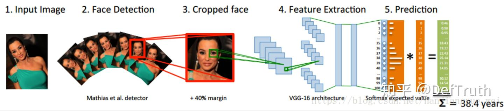
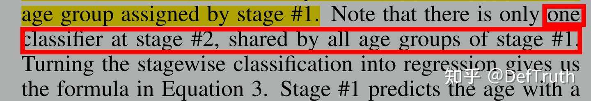
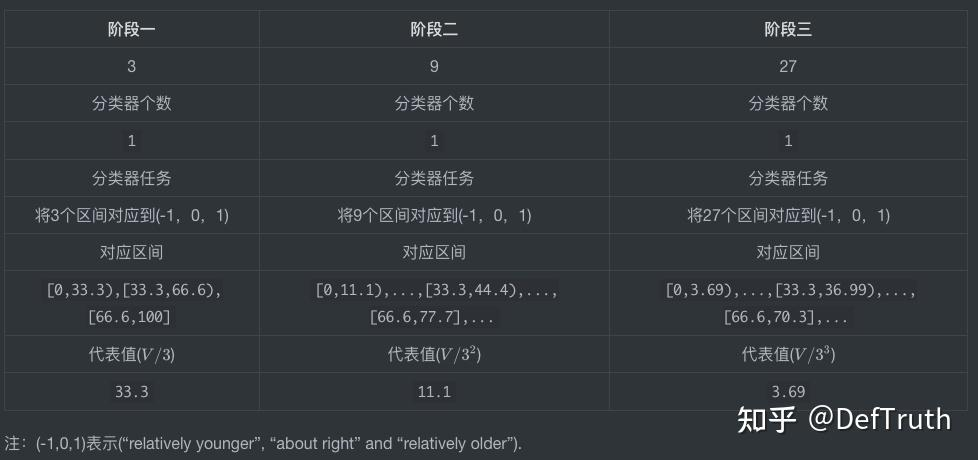
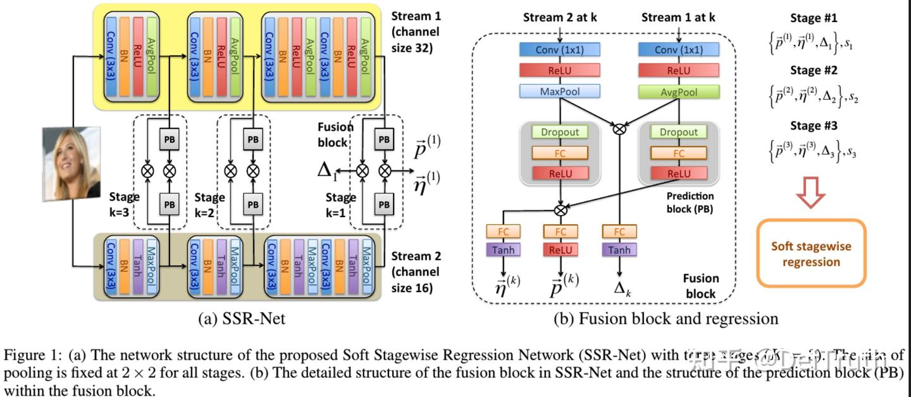
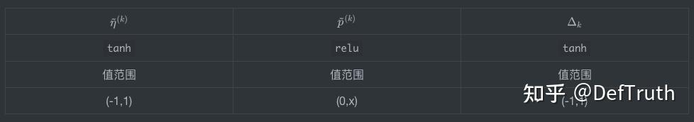
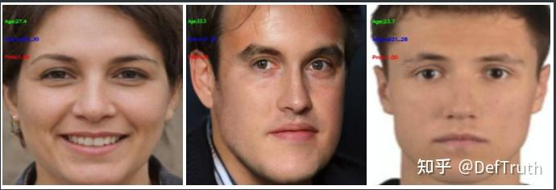
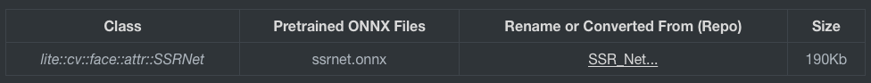
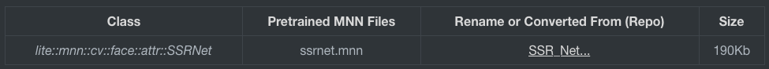
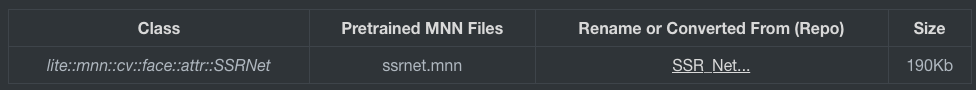

# SSRNet 나이 추정과 ONNXRuntime/MNN/TNN C++ 추론

> 원문: https://zhuanlan.zhihu.com/p/462762797

좋은 기억력보다 낡은 필기가 낫다. 이 문서를 쓰는 목적은 논문의 몇 가지 핵심과 내 이해를 기록하고, 다른 블로그의 해석도 참고하는 것이다. 따라서 이 글에는 내 정리와 선행 자료의 이해가 함께 들어 있다. 인용한 부분은 본문에 표시한다.

이전에 한동안 나이 인식을 다뤘다. 비교적 niche한 방향이다. SSRNet은 age estimation에서 SOTA급 모델 중 하나다. 모델이 차지하는 memory는 0.32MB도 되지 않지만 꽤 좋은 결과를 얻었다. 이 글에서는 SSRNet을 설명한다. 평소와 같이 직접 만든 C++ 추론 프로젝트도 함께 둔다.

## 1. 서문

SSRNet은 흥미로운 compact model이다. 특히 feature extraction branch 설계가 좋은 참고 가치가 있다. SSRNet은 저자가 real-time age detection 문제를 해결하기 위해 제안했지만, 이 구조는 transferability가 좋다. 예를 들어 emotion recognition, head pose estimation 같은 task로 옮길 수 있다.

SSRNet의 원래 구조는 regression problem을 대상으로 하지만, 약간만 수정하면 classification problem과 object detection problem으로도 옮길 수 있다. 또한 face analysis 관련 subtask, 예를 들어 emotion recognition, facial landmark detection, head pose estimation, gaze estimation의 model input은 age detection의 model input과 유사하다. 모두 face detector가 검출한 얼굴 이미지를 입력으로 받고, 일반 preprocessing 후에는 배경 정보가 거의 포함되지 않는다. 따라서 SSRNet의 multi-path parallel feature extraction 방식은 face analysis 계열 task 전반에 참고할 만하다.

## 2. DEX 모델 회고

참고 1: Age estimation - DEX

참고 2: Age recognition dataset 및 pretrained model - IMDB-WIKI

먼저 age estimation에서 나이 data type을 보통 세 종류로 나눈다는 점을 정리한다.

- `Actual age`: 실제 나이다. 일반적인 사람이 태어난 뒤 현재까지 연 단위로 계산한 나이다.
- `Apparent age`: 표면 나이다. 다른 사람이 외형을 보고 평가한 나이, 즉 타인이 추정한 나이다.
- `Estimated age`: 추정 나이다. 외형을 기반으로 algorithm이 계산한 나이다.

### 2.1 DEX의 기여와 모델 구조

### DEX의 기여

- IMDB-WIKI dataset을 공유했다. IMDB와 Wikipedia에서 crawl한 celebrity image 524,230장을 포함한다.
- age detection 문제를 classification problem으로 바꿨다. 본질적으로 0~100의 101개 age class를 classification하여 probability distribution을 얻고, 마지막에 이 probability distribution과 label value(0~100)를 weighted sum해 최종 prediction result를 얻는다.



### DEX 모델 구조

Network는 VGG16이다. 먼저 ImageNet에서 classification training을 수행한 뒤 IMDB-WIKI dataset에서 fine-tuning한다. 독립적인 regressor를 training할 때는 VGG16의 마지막 layer neuron을 1개로 바꿔 regression age를 얻는다. 독립적인 classifier를 training할 때는 마지막 layer neuron 수를 101개로 바꿔 classification하고, 각 class의 probability를 얻는다. 최종적으로 classifier의 각 class probability에 대응하는 age를 곱해 network가 prediction한 age를 얻는다.

```text
E(O)=\sum_{i=0}^{100} y_i o_i
```

DEX는 age를 `s`개 age segment로 균등하게 나눈다. 즉 `[0,V]`의 age span에 대해 각 age segment의 span은 `V/s`이고, 해당 segment의 representative age는 `\mu_i=i(V/s)`다. 그런 다음 `s` class classification model에 대해 각 class probability와 현재 class representative age의 합을 최종 prediction value로 사용한다.

```text
\tilde{y}=\vec{p} \cdot \vec{\mu}
=\sum_{i=0}^{s-1} p_i \cdot \mu_i
=\sum_{i=0}^{s-1} p_i \cdot i\left(\frac{V}{s}\right)

\vec{p}=\left(p_0,p_1,\dots,p_{s-1}\right)
```

Backbone network는 VGG19다. 이 부분은 단순하므로 자세히 말할 필요는 없다. 주의할 점은 마지막 prediction layer다. 논문 저자는 prediction layer의 구성을 자세히 설명하지 않았다. 개인적으로는 prediction layer가 `softmax classification + expectation regression(E(O))` 두 부분으로 구성된다고 이해한다. 두 부분은 serial이다.

Softmax layer는 서로 다른 age segment의 probability distribution을 얻는다. 여기에는 classification loss가 있고 `L_cls`로 쓴다. 이것은 age stage의 probability distribution training을 지도한다. 그러나 이 classification만으로는 충분하지 않다. 100처럼 극단적인 age는 작은 probability만 있어도 비교적 큰 값을 만들 수 있고, weighted sum에서 큰 비중을 차지할 수 있다. 따라서 `E(O)`에 대해 MSE regression loss를 설계해 probability distribution training을 지도해야 한다. 이를 `L_reg`로 쓴다. 그러면 마지막 loss function은 다음과 같아야 한다.

```text
L_dex = L_cls + lambda * L_reg
```

논문의 원문 표현은 다음과 같다.

```text
We pose the age regression problem as a deep classification problem followed by a softmax expected value refinement.
```

## 3. SSRNet 모델 구조

DEX algorithm은 age interval을 hard partition으로 나누고, fully-connected layer로 모든 class(101)를 한 번에 prediction한다. Backbone network도 VGG19이므로 모델이 크고 real-time application 요구를 만족하기 어렵다.

### 3.1 SSRNet의 기여

SSRNet model은 다음 몇 가지 innovation을 포함한다.

- Soft Stagewise Regression Network를 제안했다. age regression problem을 서로 다른 세 stage로 분해하고, 각 stage에는 하나의 regressor만 둔다. 직관적으로 classifier로 이해할 수도 있지만 실제로는 classification이 아니다. 각 regressor에는 "relatively younger", "about right", "relatively older" 세 구간에 대응하는 trainable parameter 세 개가 있다. 각 stage를 K개 구간으로 나누면 trainable parameter도 K개가 된다.
- 매우 compact한 model structure다. 크기는 0.32MB뿐이며 당시 SOTA보다 1500배 빠르고 real-time이다.
- dynamic range 방식을 제안했다. static range가 가져오는 유연성 부족 문제를 완화할 수 있다. 모델이 range offset과 scale variation을 자동으로 학습하여 prediction accuracy를 효과적으로 높인다.

### 3.2 SSRNet 모델 구조

### SSR Regression

SSRNet은 DEX를 stage-wise regression으로 개선했다. 즉 모든 age segment(0~100)를 한 번에 prediction하지 않고, 세 stage의 cascade regression을 사용한다.

```text
\tilde{y}
=\sum_{k=1}^{K} \vec{p}^{(k)} \cdot \vec{\mu}^{(k)}
=\sum_{k=1}^{K} \sum_{i=0}^{s_k-1} p_i^{(k)} \cdot i\left(\frac{V}{\prod_{j=1}^{k}s_j}\right)
```

`V=90`이라고 하자. 즉 age span이 0세부터 90세까지다. stage 수는 `K=2`, 각 stage의 age segment 수는 3, 즉 `s_1=s_2=s_3`라고 둔다. 그러면 `K=1` stage에서 각 age segment는 `(0~30)`, `(30~60)`, `(60~90)`이다. `K=2` stage에서는 각 segment가 다시 세 segment로 나뉘므로, 각 segment는 `(+0~10)`, `(+10~20)`, `(+20~30)`이 된다. 논문에서는 `K=3`이고 `s_1=s_2=s_3=3`이다.

SSR에는 주의할 세부 사항이 하나 있다.



의미는 각 stage에 classifier가 하나뿐이라는 것이다. 여기서는 잠시 classifier라고 표현하지만, 뒤에서 왜 실제로는 regressor인지 설명한다. 첫 stage에는 구간이 3개 있다. 다음이 성립하므로:

```text
s_1=s_2=s_3=3
```

두 번째 stage에는 실제로 9개 구간이 있고, 세 번째 stage에는 실제로 27개 구간이 있다. 하지만 두 번째 stage가 이전 stage의 3개 구간 각각에 classifier를 하나씩 만드는 것은 아니다. 하나의 classifier를 공유한다. 세 번째 stage도 마찬가지다.



계산식을 펼치면 다음과 같다.

```text
\tilde{y}_0=(p_0^1*0*33.3+p_1^1*1*33.3+p_2^1*2*33.3), 33.3+2*33.3=99.9

\tilde{y}_1=(p_0^2*0*11.1+p_1^2*1*11.1+p_2^2*2*11.1), 11.1+2*11.1=33.3

\tilde{y}_2=(p_0^3*0*3.69+p_1^3*1*3.69+p_2^3*2*3.69), 3.69+2*3.69=11.1

\tilde{y}=\tilde{y}_1+\tilde{y}_2+\tilde{y}_3
```

### Dynamic Range

저자는 age가 continuous하고 일정한 uncertainty가 있으므로, age를 평균적이고 겹치지 않는 영역으로 거칠게 나누는 방식은 flexible하지 않다고 말한다. 그래서 dynamic range를 사용한다. 의미는 각 age region이 shifted and scaled될 수 있다는 것이다. BatchNorm이 제안됐을 때도 보았던 익숙한 표현이다.

구체적으로 이 age dynamic range는 어떻게 구현할까. 분모로 사용되는 각 `s_k`를 입력 feature에 따라 동적으로 조정할 수 있게 한다.

```text
\bar{s}_k=s_k(1+\Delta_k)
```

마찬가지로 각 stage의 `s_k`개 representative value `(\mu_0^k,...,\mu_{s_k-1}^k)`도 입력 feature에 따라 smooth하게 조정할 수 있게 한다.

```text
\bar{i}=i+\eta_i^{(k)},\vec{\eta}^{(k)}=(\eta_0^{(k)},\eta_1^{(k)},\dots,\eta_{s_k-1}^{(k)})
```

`\tilde{p}^{(k)}`와 `\tilde{\eta}^{(k)}`는 모두 vector이며, component가 일대일로 대응한다.

```text
\tilde{p}^{(k)}=(p_0^{(k)},p_1^{(k)},\dots,p_{s_k-1}^{(k)})
```

반면 `\Delta_k`는 scalar이고, `K`번째 stage의 `s_k`개 representative value가 공유한다. 따라서 최종 SSR 계산식은 다음과 같다.

```text
\tilde{y}
=\sum_{k=1}^{K} \vec{p}^{(k)} \cdot \vec{\mu}^{(k)}
=\sum_{k=1}^{K} \sum_{i=0}^{s_k-1} p_i^{(k)} \cdot
\bar{i}\left(\frac{V}{\prod_{j=1}^{k} s_j}\right)
```

이제 남은 의문은 왜 사실상 classifier가 아니라 regressor냐는 것이다. SSRNet의 model structure와 code implementation을 보자.

```python
def merge_age(x, s1, s2, s3, lambda_local, lambda_d):
            a = x[0][:, 0] * 0  # (b,)
            b = x[0][:, 0] * 0  # (b,)
            c = x[0][:, 0] * 0  # (b,)
            # A = s1 * s2 * s3  # 3*3*3=27
            V = 101

            for i in range(0, s1):
                a = a + (i + lambda_local * x[6][:, i]) * x[0][:, i]
            a = K.expand_dims(a, -1)  # (b,1)
            a = a / (s1 * (1 + lambda_d * x[3]))  # (b,1)

            for j in range(0, s2):
                b = b + (j + lambda_local * x[7][:, j]) * x[1][:, j]
            b = K.expand_dims(b, -1)
            b = b / (s1 * (1 + lambda_d * x[3])) / (s2 * (1 + lambda_d * x[4]))

            for k in range(0, s3):
                c = c + (k + lambda_local * x[8][:, k]) * x[2][:, k]
            c = K.expand_dims(c, -1)
            c = c / (s1 * (1 + lambda_d * x[3])) / (s2 * (1 + lambda_d * x[4])) / (s3 * (1 + lambda_d * x[5]))

            age = (a + b + c) * V  # (b,1)  for regression
            return age
```

### 모델 구조



저자는 2-stream model을 사용해 가능한 한 서로 다른 feature를 추출한다. 그리고 layer 수는 매우 얕다. 두 branch는 서로 다른 activation function과 서로 다른 pooling layer를 사용하므로 서로 다른 feature information을 추출할 수 있다. 이 방식은 참고 가치가 있다. 주의해서 보면 `\tilde{p}^{(k)}`, `\tilde{\eta}^{(k)}`, `\Delta_k`의 activation function이 다음과 같다.



몇 가지 공식을 다시 보자.

```text
\bar{s}_k=s_k(1+\Delta_k)

\bar{i}=i+\eta_i^{(k)},\vec{\eta}^{(k)}=(\eta_0^{(k)},\eta_1^{(k)},\dots,\eta_{s_k-1}^{(k)})

\tilde{p}^{(k)}=(p_0^{(k)},p_1^{(k)},\dots,p_{s_k-1}^{(k)})
```

따라서 `\bar{s}_k>0`을 보장할 수 있고, 동시에 `\bar{i}`의 변화가 한 interval을 넘지 않도록 할 수 있다. 이어서 loss function을 보자.

```text
J(X)=\frac{1}{N} \sum_{n=1}^{N}\left|\tilde{y}_n-y_n\right|
```

이는 regression loss다. 또한 `\tilde{p}^{(k)}`의 activation function은 `softmax`가 아니라 `relu`이고, 합이 1이라는 constraint도 없다. 따라서 SSRNet은 사실 classification model이 아니라 regression model이다. `\tilde{p}^{(k)}`는 regression parameter일 뿐 probability distribution이 아니다.

저자 code에서도 이 점을 볼 수 있다.

```python
local_s2 = Dense(units=self.stage_num[1], activation='tanh', name='local_delta_stage2')(feat_a_s2)

        s_layer1 = Conv2D(10, (1, 1), activation='relu')(s_layer1)
        s_layer1 = MaxPooling2D(8, 8)(s_layer1)
        s_layer1 = Flatten()(s_layer1)
        s_layer1_mix = Dropout(0.2)(s_layer1)
        s_layer1_mix = Dense(self.stage_num[2], activation='relu')(s_layer1_mix)  # (b,3)

        x_layer1 = Conv2D(10, (1, 1), activation='relu')(x_layer1)
        x_layer1 = AveragePooling2D(8, 8)(x_layer1)
        x_layer1 = Flatten()(x_layer1)
        x_layer1_mix = Dropout(0.2)(x_layer1)
        x_layer1_mix = Dense(self.stage_num[2], activation='relu')(x_layer1_mix)  # (b,3)

        feat_a_s3_pre = Multiply()([s_layer1, x_layer1])
        delta_s3 = Dense(1, activation='tanh', name='delta_s3')(feat_a_s3_pre)

        feat_a_s3 = Multiply()([s_layer1_mix, x_layer1_mix])
        feat_a_s3 = Dense(2 * self.stage_num[2], activation='relu')(feat_a_s3)
        pred_a_s3 = Dense(units=self.stage_num[2], activation="relu", name='pred_age_stage3')(feat_a_s3)
        # feat_local_s3 = Lambda(lambda x: x/10)(feat_a_s3)
        # feat_a_s3_local = Dropout(0.2)(pred_a_s3)
        local_s3 = Dense(units=self.stage_num[2], activation='tanh', name='local_delta_stage3')(feat_a_s3)
```

## 4. C++ 추론 프로젝트

SSRNet 원리를 설명했으니 이제 직접 만든 SSRNet C++ 추론 프로젝트를 둔다. 이 추론 프로젝트는 PyTorch reimplementation model을 기반으로 한다. 최적 결과를 원하면 참고 문헌의 Keras 공식 구현으로 이동하면 된다. 이후 시간을 내서 Keras version도 만들어 둘 생각이다.

이 부분에서는 Lite.AI.ToolKit C++ 도구 상자로 SSRNet age estimation 예제를 실행하는 방법을 설명한다. ONNXRuntime C++, MNN, TNN version을 포함한다. SSRNet weight file 크기는 **190KB**뿐이며, 매우 가벼운 age estimation model이다.



유용하다면 star로 지원할 수 있다.

### 4.1 C++ 버전 소스

SSRNet C++ version source는 ONNXRuntime, MNN, TNN 세 version을 포함하며, source는 `lite.ai.toolkit` 도구 상자에서 찾을 수 있다. 이 프로젝트는 주로 `lite.ai.toolkit` 도구 상자를 기반으로 SSRNet을 직접 사용해 face detection을 실행하는 방법을 소개한다.

설명이 필요한 부분이 있다. 이 프로젝트는 MacOS에서 빌드한 `liblite.ai.toolkit.v0.1.0.dylib`를 기반으로 구현했다. MacOS 사용자는 이 프로젝트에 포함된 `liblite.ai.toolkit.v0.1.0` dynamic library와 다른 dependency library를 바로 내려받아 사용할 수 있다. MacOS가 아닌 사용자는 `lite.ai.toolkit`에서 source를 내려받아 직접 컴파일해야 한다.

`lite.ai.toolkit` C++ 도구 상자는 현재 80개 이상의 인기 open-source model을 포함하고 있고, star도 거의 **1k**에 가깝다. 평소 손 가는 대로 만든 것이고, 학습 과정에서 접한 모델들을 통합한 것이므로 여기서 길게 소개하지 않는다. 관심이 있으면 직접 보면 된다.

- ssrnet.cpp
- ssrnet.h
- mnn_ssrnet.cpp
- mnn_ssrnet.h
- tnn_ssrnet.cpp
- tnn_ssrnet.h

ONNXRuntime C++, MNN, TNN version의 추론 구현은 모두 테스트를 통과했다.

### 4.2 모델 파일

### ONNX 모델 파일

제공한 링크에서 내려받을 수 있다. Baidu Drive code는 `8gin`이다. 또는 이 repository에서 직접 내려받을 수도 있다.



### MNN 모델 파일

MNN 모델 파일 다운로드 주소다. Baidu Drive code는 `9v63`이다. 또는 이 repository에서 직접 내려받을 수도 있다.



### TNN 모델 파일

TNN 모델 파일 다운로드 주소다. Baidu Drive code는 `6o6k`이다. 또는 이 repository에서 직접 내려받을 수도 있다.



### 4.3 SSRNet C++ interface 문서

`lite.ai.toolkit`에서 SSRNet 구현 class는 다음과 같다.

```cpp
class LITE_EXPORTS lite::cv::face::attr::SSRNet;
class LITE_EXPORTS lite::mnn::cv::face::attr::SSRNet;
class LITE_EXPORTS lite::tnn::cv::face::attr::SSRNet;

```

이 type은 현재 age detection을 수행하는 public interface `detect` 하나를 포함한다.

```cpp
public:
  void detect(const cv::Mat &mat, types::Age &age);

```

`detect` interface의 입력 parameter 설명:

- `mat`: `cv::Mat` type, BGR format. 얼굴 머리를 포함한 이미지 한 장이며 배경이 지나치게 많지 않아야 한다.
- `age`: `types::Age`. 검출된 age를 포함한다.

### 4.4 사용 예시

### ONNXRuntime 버전

```cpp
#include "lite/lite.h"

static void test_default()
{
    std::string onnx_path = "../hub/onnx/cv/ssrnet.onnx";
    std::string test_img_path = "../resources/1.png";
    std::string save_img_path = "../logs/1.jpg";

    auto *ssrnet = new lite::cv::face::attr::SSRNet(onnx_path);

    lite::types::Age age;
    cv::Mat img_bgr = cv::imread(test_img_path);
    ssrnet->detect(img_bgr, age);

    lite::utils::draw_age_inplace(img_bgr, age);

    cv::imwrite(save_img_path, img_bgr);

    std::cout << "Default Version Done! Detected SSRNet Age: " << age.age << std::endl;

    delete ssrnet;
}

```

### MNN 버전

```cpp
#include "lite/lite.h"

static void test_mnn()
{
#ifdef ENABLE_MNN
    std::string mnn_path = "../hub/mnn/cv/ssrnet.mnn";
    std::string test_img_path = "../resources/3.png";
    std::string save_img_path = "../logs/3_mnn.jpg";

    auto *ssrnet = new lite::mnn::cv::face::attr::SSRNet(mnn_path);

    lite::types::Age age;
    cv::Mat img_bgr = cv::imread(test_img_path);
    ssrnet->detect(img_bgr, age);

    lite::utils::draw_age_inplace(img_bgr, age);

    cv::imwrite(save_img_path, img_bgr);

    std::cout << "MNN Version Done! Detected SSRNet Age: " << age.age << std::endl;

    delete ssrnet;
#endif
}

```

### TNN 버전

```cpp
#include "lite/lite.h"

static void test_tnn()
{
#ifdef ENABLE_TNN
    std::string proto_path = "../hub/tnn/cv/ssrnet.opt.tnnproto";
    std::string model_path = "../hub/tnn/cv/ssrnet.opt.tnnmodel";
    std::string test_img_path = "../resources/4.png";
    std::string save_img_path = "../logs/4_tnn.jpg";

    auto *ssrnet = new lite::tnn::cv::face::attr::SSRNet(proto_path, model_path);

    lite::types::Age age;
    cv::Mat img_bgr = cv::imread(test_img_path);
    ssrnet->detect(img_bgr, age);

    lite::utils::draw_age_inplace(img_bgr, age);

    cv::imwrite(save_img_path, img_bgr);

    std::cout << "TNN Version Done! Detected SSRNet Age: " << age.age << std::endl;

    delete ssrnet;
#endif
}

```

출력 결과는 다음과 같다.


### 4.5 빌드 및 실행

MacOS에서는 이 프로젝트를 바로 빌드하고 실행할 수 있으며 다른 dependency library를 내려받을 필요가 없다. 다른 system에서는 먼저 `lite.ai.toolkit`에서 source를 내려받아 `lite.ai.toolkit.v0.1.0` dynamic library를 빌드해야 한다.

```bash
git clone --depth=1 https://github.com/DefTruth/ssrnet.lite.ai.toolkit.git
cd ssrnet.lite.ai.toolkit 
sh ./build.sh
```

CMakeLists.txt 설정:

```cmake
cmake_minimum_required(VERSION 3.17)
project(ssrnet.lite.ai.toolkit)

set(CMAKE_CXX_STANDARD 11)

# setting up lite.ai.toolkit
set(LITE_AI_DIR ${CMAKE_SOURCE_DIR}/lite.ai.toolkit)
set(LITE_AI_INCLUDE_DIR ${LITE_AI_DIR}/include)
set(LITE_AI_LIBRARY_DIR ${LITE_AI_DIR}/lib)
include_directories(${LITE_AI_INCLUDE_DIR})
link_directories(${LITE_AI_LIBRARY_DIR})

set(OpenCV_LIBS
        opencv_highgui
        opencv_core
        opencv_imgcodecs
        opencv_imgproc
        opencv_video
        opencv_videoio
        )
# add your executable
set(EXECUTABLE_OUTPUT_PATH ${CMAKE_SOURCE_DIR}/examples/build)

add_executable(lite_ssrnet examples/test_lite_ssrnet.cpp)
target_link_libraries(lite_ssrnet
        lite.ai.toolkit
        onnxruntime
        MNN  # need, if built lite.ai.toolkit with ENABLE_MNN=ON,  default OFF
        ncnn # need, if built lite.ai.toolkit with ENABLE_NCNN=ON, default OFF
        TNN  # need, if built lite.ai.toolkit with ENABLE_TNN=ON,  default OFF
        ${OpenCV_LIBS})  # link lite.ai.toolkit & other libs.
```

building 및 testing information:

```text
[ 50%] Building CXX object CMakeFiles/lite_ssrnet.dir/examples/test_lite_ssrnet.cpp.o
[100%] Linking CXX executable lite_ssrnet
[100%] Built target lite_ssrnet
Testing Start ...
LITEORT_DEBUG LogId: ../hub/onnx/cv/ssrnet.onnx
=============== Input-Dims ==============
input_node_dims: 1
input_node_dims: 3
input_node_dims: 64
input_node_dims: 64
=============== Output-Dims ==============
Output: 0 Name: age Dim: 0 :1
========================================
Default Version Done! Detected SSRNet Age: 35.567
LITEORT_DEBUG LogId: ../hub/onnx/cv/ssrnet.onnx
=============== Input-Dims ==============
input_node_dims: 1
...
Output: age:    **Tensor shape**: 1, 
========================================
MNN Version Done! Detected SSRNet Age: 33.37
LITETNN_DEBUG LogId: ../hub/tnn/cv/ssrnet.opt.tnnproto
=============== Input-Dims ==============
input: [1 3 64 64 ]
Input Data Format: NCHW
=============== Output-Dims ==============
age: [1 ]
========================================
TNN Version Done! Detected SSRNet Age: 23.7442
Testing Successful !
```

## 5. 정리

- 이 글은 경량 age detection model SSRNet을 소개했다. model file 크기는 0.32MB뿐이고, PyTorch reimplementation version을 static model file로 변환하면 190KB뿐이다. SSRNet에는 다음 innovation이 있다.
- Soft Stagewise Regression Network를 제안했다. age regression problem을 서로 다른 세 stage로 분해하고, 각 stage에는 하나의 regressor만 둔다.
- 매우 compact한 model structure다. 0.32MB뿐이며 당시 SOTA보다 1500배 빨라 real-time에 부담이 없다.
- dynamic range 방식을 제안했고, 모델이 range offset과 scale variation을 자동으로 학습하여 prediction accuracy를 효과적으로 높일 수 있다.
- 동시에 이 글은 C++ 추론 예제 project도 제공하여 참고할 수 있게 했다. 최적 결과를 원하면 참고 문헌의 Keras 공식 구현으로 이동하면 된다.

## 6. 참고 문헌 및 open-source code

- 논문: SSR-Net: A Compact Soft Stagewise Regression Network for Age Estimation
- Keras 공식 repository: https://github.com/shamangary/SSR-Net
- PyTorch reimplementation: https://github.com/oukohou/SSR_Net_Pytorch
- C++ example project: https://github.com/DefTruth/ssrnet.lite.ai.toolkit
- lite.ai.toolkit 도구 상자(거의 **1k** stars): https://github.com/DefTruth/lite.ai.toolkit

더 많은 모델의 C++ engineering 사례를 알고 싶으면 좋아요와 팔로우를 누르면 된다.
