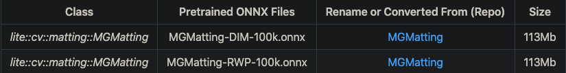
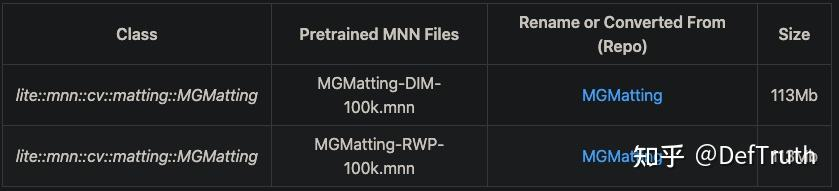
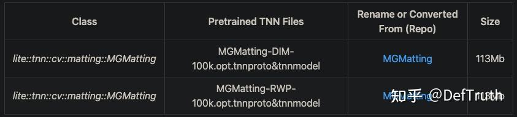

# [배포][CV] MGMatting 인물 배경제거 C++ 응용

> 원문: https://zhuanlan.zhihu.com/p/464732042

### 서문

한동안 글을 갱신하지 않았다. 최근 TNN, MNN, NCNN, ONNXRuntime 사용 시리즈 노트를 정리하려 한다. 좋은 기억력보다 엉성한 기록이 낫다. 기억력도 좋지 않으니, 나중에 같은 구덩이에 빠졌을 때 조금 더 빠르게 빠져나오기 위한 기록이다. 현재 **80개가 넘는 C++** inference example을 lib로 build해서 사용할 수 있게 정리해 두었다. 관심이 있으면 보면 된다. 길게 소개하지는 않는다.

프로젝트 설명:

GithubLite.AI.ToolKitA lite C++ toolkit of awesome AI models.

즉, 바로 사용할 수 있는 C++ AI model toolkit이다. 평소 새 algorithm을 공부할 때 손에 잡히는 대로 만든 것들이고, 현재 80개 이상의 인기 open source model을 포함한다. 어느새 800+ star에 가까워졌다. star와 issue는 언제나 환영한다.

https://github.com/DefTruth/lite.ai.toolkit

최근 관련 글을 계속 갱신할 예정이다.

글 자체로 돌아온다. 지난번에는 MGMatting algorithm principle과 핵심 C++ porting logic을 자세히 소개하는 글을 썼다. 하지만 실제로 어떻게 응용하는지에 대한 case가 부족했다. 이 짧은 글은 그 빈 부분을 메우기 위한 것이다. MGMatting portrait matting 원리를 알고 싶다면 이전 글을 보면 된다. 긴 글이다.


DefTruth: MGMatting(CVPR2021) MNN, TNN, ONNXRuntime C++ porting 상세 기록.

### 1. C++ project 소개

Lite.AI.ToolKit C++ toolkit으로 MGMatting portrait matting case를 실행한다. repository는 https://github.com/DefTruth/lite.ai.toolkit 이고, ONNXRuntime C++, MNN, TNN version을 포함한다.


example code는 repository에 있다. 유용하다고 느끼면 star로 지원해도 된다.

## 2. C++ version source

MGMatting C++ version source는 ONNXRuntime, MNN, TNN 세 version을 포함한다. source는 `lite.ai.toolkit` toolbox에서 찾을 수 있다. 이 project는 `lite.ai.toolkit` toolbox를 기반으로 MGMatting을 직접 사용해 portrait matting을 실행하는 방법을 소개한다.

설명할 점은, 이 project는 macOS에서 compile한 `liblite.ai.toolkit.v0.1.0.dylib`를 기반으로 구현했다는 것이다. macOS user는 이 project에 포함된 `liblite.ai.toolkit.v0.1.0` dynamic library와 다른 dependency library를 바로 download해서 사용할 수 있다. macOS가 아닌 user는 `lite.ai.toolkit`에서 source를 download해 compile해야 한다.

`lite.ai.toolkit` C++ toolbox는 현재 80개 이상의 인기 open source model을 포함한다. 여기서는 더 소개하지 않는다. 평소 공부하면서 만난 model을 통합한 것이므로 관심이 있으면 보면 된다.

- `mg_matting.cpp`
- `mg_matting.h`
- `mnn_mg_matting.cpp`
- `mnn_mg_matting.h`
- `tnn_mg_matting.cpp`
- `tnn_mg_matting.h`

ONNXRuntime C++, MNN, TNN version inference implementation은 모두 test를 통과했다.

## 3. model file

### 3.1 ONNX model file

제공한 link에서 download할 수 있다. Baidu Drive code: `8gin`.



### 3.2 MNN model file

MNN model file download address. Baidu Drive code: `9v63`.



### 3.3 TNN model file

TNN model file download address. Baidu Drive code: `6o6k`.



## 4. interface document

`lite.ai.toolkit`에서 MGMatting implementation class는 다음과 같다.

```cpp
class LITE_EXPORTS lite::cv::face::detect::MGMatting;
class LITE_EXPORTS lite::mnn::cv::face::detect::MGMatting;
class LITE_EXPORTS lite::tnn::cv::face::detect::MGMatting;
```

이 type은 현재 public interface `detect` 하나를 포함하며 target detection, 여기서는 matting을 수행한다.

```cpp
public:
    /**
     * Image Matting Using MGMatting(https://github.com/yucornetto/MGMatting)
     * @param mat: cv::Mat BGR HWC, source image
     * @param mask: cv::Mat Gray, guidance mask.
     * @param guidance_threshold: int, guidance threshold..
     * @param content: types::MattingContent to catch the detected results.
     */
    void detect(const cv::Mat &mat, cv::Mat &mask, types::MattingContent &content,
                bool remove_noise = false, unsigned int guidance_threshold = 128);
```

`detect` interface input parameter 설명:

- `mat`: `cv::Mat` type, BGR format.
- `mask`: `cv::Mat` type, Gray format. matting을 guide하는 mask다. `coarse-binary-map`, `trimap`, `coarse-matte` 중 아무 것이나 될 수 있다.
- `guidance_threshold`: guidance mask threshold. MGMatting paper와 official repository를 참고하면 default 128을 쓰면 된다.
- `remove_noise`: detected small connected component를 제거할지 여부. default는 `true`.
- `content`: `types::MattingContent` type. detection result를 저장한다. `cv::Mat` type의 세 member를 포함한다.
- `fgr_mat`: `cv::Mat (H,W,C=3) BGR` format, value range 0-255의 `CV_8UC3`. estimated foreground를 저장한다.
- `pha_mat`: `cv::Mat (H,W,C=1)`, value range 0-1의 `CV_32FC1`. estimated alpha(matte) value를 저장한다.
- `merge_mat`: `cv::Mat (H,W,C=3) BGR` format, value range 0-255의 `CV_8UC3`. `pha`를 기준으로 foreground/background를 merge한 composite image를 저장한다.
- `flag`: bool flag. detection 성공 여부를 나타낸다.

## 5. usage case

여기서는 MGMatting-DIM-100k version model로 test했다. 다른 version의 model도 시도할 수 있다.

### 5.1 ONNXRuntime version

```cpp
#include "lite/lite.h"

static void test_default()
{
    std::string onnx_path = "../hub/onnx/cv/MGMatting-DIM-100k.onnx";
    std::string test_img_path = "../resources/input.jpg";
    std::string test_mask_path = "../resources/mask.png";
    std::string save_fgr_path = "../logs/fgr.jpg";
    std::string save_pha_path = "../logs/pha.jpg";
    std::string save_merge_path = "../logs/merge.jpg";

    auto *mgmatting = new lite::cv::matting::MGMatting(onnx_path, 16); // 16 threads

    lite::types::MattingContent content;
    cv::Mat img_bgr = cv::imread(test_img_path);
    cv::Mat mask = cv::imread(test_mask_path, cv::IMREAD_GRAYSCALE);

    // 1. image matting.
    mgmatting->detect(img_bgr, mask, content, true);

    if (content.flag)
    {
        if (!content.fgr_mat.empty()) cv::imwrite(save_fgr_path, content.fgr_mat);
        if (!content.pha_mat.empty()) cv::imwrite(save_pha_path, content.pha_mat * 255.);
        if (!content.merge_mat.empty()) cv::imwrite(save_merge_path, content.merge_mat);
        std::cout << "Default Version MGMatting Done!" << std::endl;
    }

    delete mgmatting;
}
```

### 5.2 MNN version

```cpp
#include "lite/lite.h"

static void test_mnn()
{
#ifdef ENABLE_MNN
    std::string mnn_path = "../hub/mnn/cv/MGMatting-DIM-100k.mnn";
    std::string test_img_path = "../resources/input.jpg";
    std::string test_mask_path = "../resources/mask.png";
    std::string save_fgr_path = "../logs/fgr_mnn.jpg";
    std::string save_pha_path = "../logs/pha_mnn.jpg";
    std::string save_merge_path = "../logs/merge_mnn.jpg";

    auto *mgmatting = new lite::mnn::cv::matting::MGMatting(mnn_path, 16); // 16 threads

    lite::types::MattingContent content;
    cv::Mat img_bgr = cv::imread(test_img_path);
    cv::Mat mask = cv::imread(test_mask_path, cv::IMREAD_GRAYSCALE);

    // 1. image matting.
    mgmatting->detect(img_bgr, mask, content, true);

    if (content.flag)
    {
        if (!content.fgr_mat.empty()) cv::imwrite(save_fgr_path, content.fgr_mat);
        if (!content.pha_mat.empty()) cv::imwrite(save_pha_path, content.pha_mat * 255.);
        if (!content.merge_mat.empty()) cv::imwrite(save_merge_path, content.merge_mat);
        std::cout << "MNN Version MGMatting Done!" << std::endl;
    }

    delete mgmatting;
#endif
}
```

### 5.3 TNN version

```cpp
#include "lite/lite.h"

static void test_tnn()
{
#ifdef ENABLE_TNN
    std::string proto_path = "../hub/tnn/cv/MGMatting-DIM-100k.opt.tnnproto";
    std::string model_path = "../hub/tnn/cv/MGMatting-DIM-100k.opt.tnnmodel";
    std::string test_img_path = "../resources/input.jpg";
    std::string test_mask_path = "../resources/mask.png";
    std::string save_fgr_path = "../logs/fgr_tnn.jpg";
    std::string save_pha_path = "../logs/pha_tnn.jpg";
    std::string save_merge_path = "../logs/merge_tnn.jpg";

    auto *mgmatting = new lite::tnn::cv::matting::MGMatting(proto_path, model_path, 16); // 16 threads

    lite::types::MattingContent content;
    cv::Mat img_bgr = cv::imread(test_img_path);
    cv::Mat mask = cv::imread(test_mask_path, cv::IMREAD_GRAYSCALE);

    // 1. image matting.
    mgmatting->detect(img_bgr, mask, content, true);

    if (content.flag)
    {
        if (!content.fgr_mat.empty()) cv::imwrite(save_fgr_path, content.fgr_mat);
        if (!content.pha_mat.empty()) cv::imwrite(save_pha_path, content.pha_mat * 255.);
        if (!content.merge_mat.empty()) cv::imwrite(save_merge_path, content.merge_mat);
        std::cout << "TNN Version MGMatting Done!" << std::endl;
    }

    delete mgmatting;
#endif
}
```

- output result:


## 6. compile and run

macOS에서는 이 project를 직접 compile하고 실행할 수 있으며, 다른 dependency library를 download할 필요가 없다. 다른 system에서는 `lite.ai.toolkit`에서 source를 download하고 먼저 `lite.ai.toolkit.v0.1.0` dynamic library를 compile해야 한다.

```bash
git clone --depth=1 https://github.com/DefTruth/MGMatting.lite.ai.toolkit.git
cd MGMatting.lite.ai.toolkit
sh ./build.sh
```

- `CMakeLists.txt` setting

```cmake
cmake_minimum_required(VERSION 3.17)
project(MGMatting.lite.ai.toolkit)

set(CMAKE_CXX_STANDARD 11)

# setting up lite.ai.toolkit
set(LITE_AI_DIR ${CMAKE_SOURCE_DIR}/lite.ai.toolkit)
set(LITE_AI_INCLUDE_DIR ${LITE_AI_DIR}/include)
set(LITE_AI_LIBRARY_DIR ${LITE_AI_DIR}/lib)
include_directories(${LITE_AI_INCLUDE_DIR})
link_directories(${LITE_AI_LIBRARY_DIR})

set(OpenCV_LIBS
        opencv_highgui
        opencv_core
        opencv_imgcodecs
        opencv_imgproc
        opencv_video
        opencv_videoio
        )
# add your executable
set(EXECUTABLE_OUTPUT_PATH ${CMAKE_SOURCE_DIR}/examples/build)

add_executable(lite_mgmatting examples/test_lite_mgmatting.cpp)
target_link_libraries(lite_mgmatting
        lite.ai.toolkit
        onnxruntime
        MNN  # need, if built lite.ai.toolkit with ENABLE_MNN=ON,  default OFF
        ncnn # need, if built lite.ai.toolkit with ENABLE_NCNN=ON, default OFF
        TNN  # need, if built lite.ai.toolkit with ENABLE_TNN=ON,  default OFF
        ${OpenCV_LIBS})  # link lite.ai.toolkit & other libs.
```

- building and testing information:

```text
[ 50%] Building CXX object CMakeFiles/lite_mgmatting.dir/examples/test_lite_mgmatting.cpp.o
[100%] Linking CXX executable lite_mgmatting
[100%] Built target lite_mgmatting
Testing Start ...
LITEORT_DEBUG LogId: ../hub/onnx/cv/MGMatting-DIM-100k.onnx
=============== Inputs ==============
Dynamic Input: image Init [1,3,512,512]
Dynamic Input: mask Init [1,1,512,512]
=============== Outputs ==============
Dynamic Output 0: alpha_os1
Dynamic Output 1: alpha_os4
Dynamic Output 2: alpha_os8
Default Version MGMatting Done!
LITEORT_DEBUG LogId: ../hub/onnx/cv/MGMatting-DIM-100k.onnx
=============== Inputs ==============
Dynamic Input: image Init [1,3,512,512]
Dynamic Input: mask Init [1,1,512,512]
=============== Outputs ==============
Dynamic Output 0: alpha_os1
Dynamic Output 1: alpha_os4
Dynamic Output 2: alpha_os8
ONNXRuntime Version MGMatting Done!
Compute Shape Error for 598
LITEMNN_DEBUG LogId: ../hub/mnn/cv/MGMatting-DIM-100k.mnn
=============== Input-Dims ==============
        **Tensor shape**: 1, 3, 0, 0,
        **Tensor shape**: 1, 1, 0, 0,
Dimension Type: (CAFFE/PyTorch/ONNX)NCHW
=============== Output-Dims ==============
getSessionOutputAll done!
Output: alpha_os1:      **Tensor shape**: 0, 0, 0, 0,
Output: alpha_os4:      **Tensor shape**: 0, 0, 0, 0,
Output: alpha_os8:      **Tensor shape**: 0, 0, 0, 0,
========================================
MNN Version MGMatting Done!
LITETNN_DEBUG LogId: ../hub/tnn/cv/MGMatting-DIM-100k.opt.tnnproto
=============== Input-Dims ==============
image: [1 3 1024 1024 ]
mask: [1 1 1024 1024 ]
Input Data Format: NCHW
=============== Output-Dims ==============
alpha_os1: [1 1 1024 1024 ]
alpha_os4: [1 1 1024 1024 ]
alpha_os8: [1 1 1024 1024 ]
========================================
TNN Version MGMatting Done!
Testing Successful !
```

### 7. 정리

- 장점: MGMatting은 전통적인 trimap만이 아니라 arbitrary type의 guidance mask를 guide로 사용할 수 있다. `coarse-binary-map`, `trimap`, `coarse-matte` 중 아무 것이나 가능하다. trimap-based method보다 더 flexible하다.
- 단점: 여전히 guidance mask가 필요하다. application에서는 input image 자체 외에도 최소한 한 종류의 guidance mask를 input으로 얻어야 한다. 완전한 trimap-free는 아니다.
