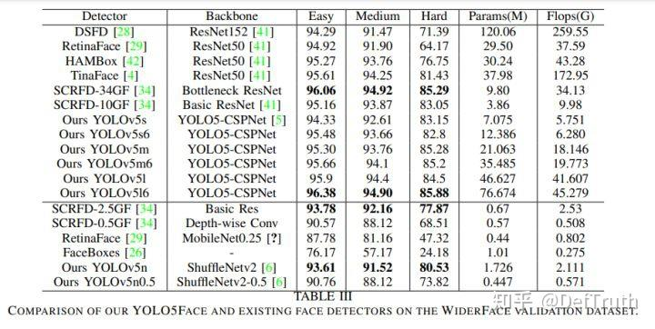
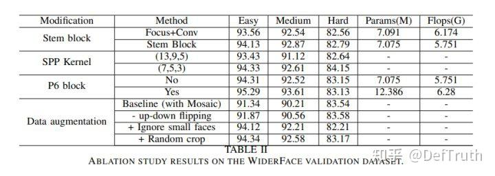
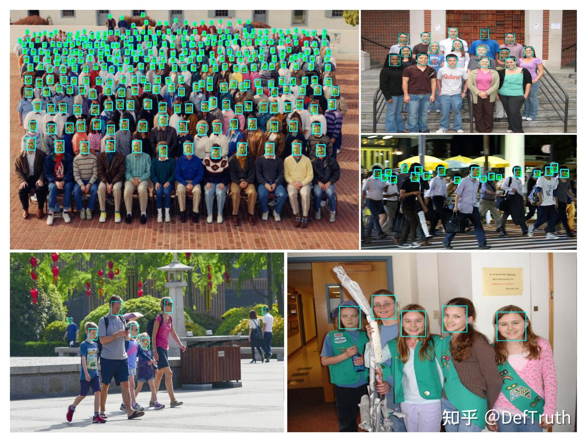
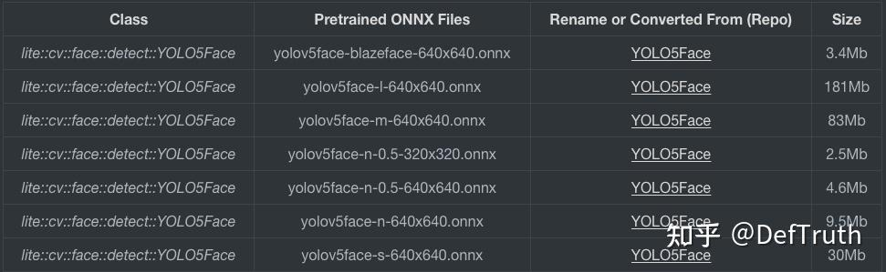
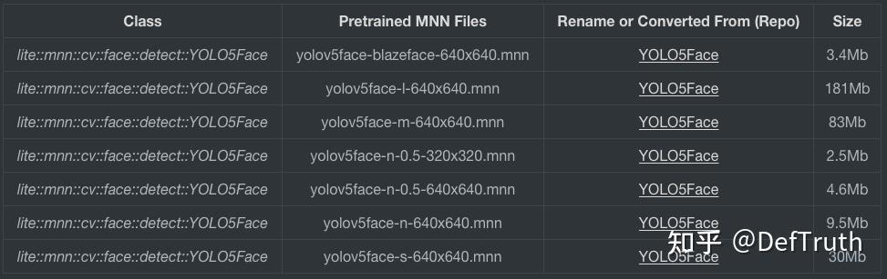
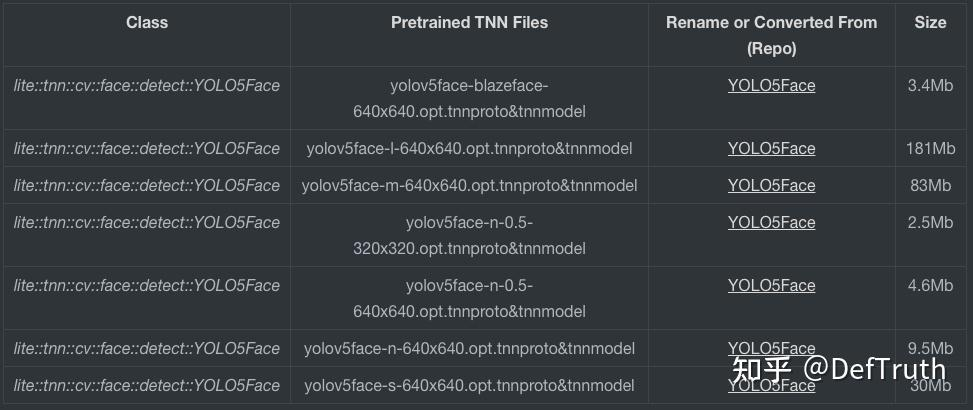
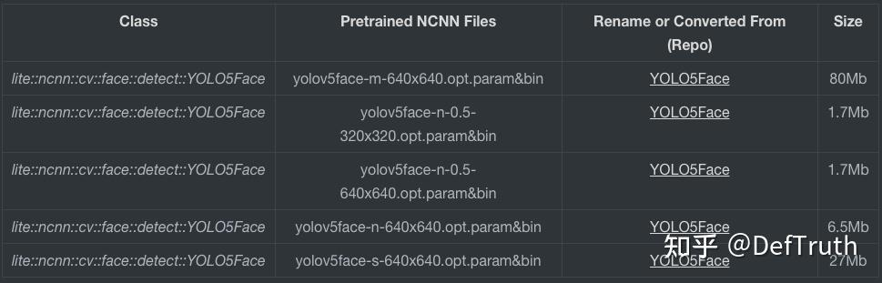
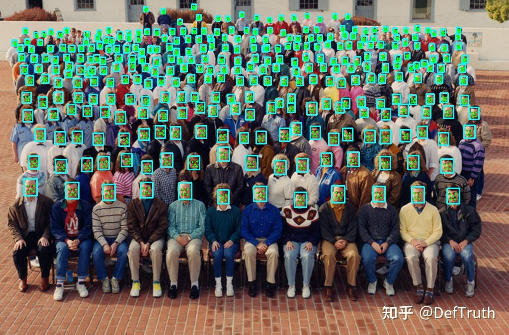

# YOLO5Face C++ 추론 배포 기록

> 원문: https://zhuanlan.zhihu.com/p/461878005

## 1. YOLO5Face 소개

Github: https://github.com/deepcam-cn/yolov5-face

ArXiv 2021: https://arxiv.org/abs/2105.1293

C++ 구현: https://github.com/DefTruth/YOLO5Face.lite.ai.toolkit

YOLO5Face는 Shenzhen DeepCam 및 LinkSprite Technologies가 공개한 새로운 SOTA급 face detector다. keypoint를 포함한다. YOLOv5 기반이며, YOLOv5 backbone을 face detection task에 더 적합하도록 개조했다. 또한 YOLOv5 network에 5개 keypoint를 예측하는 regression head를 추가하고, loss function으로 Wing loss를 사용한다.

논문에서 공개한 실험 결과를 보면 YOLO5Face는 average precision(mAP)과 speed 모두에서 매우 우수한 성능을 보인다. 모델 정확도와 속도 측면에서 논문은 최신 SOTA algorithm과 상세한 비교를 제시한다. 비교 대상에는 비교적 새로운 SCRFD(CVPR 2021), RetinaFace(CVPR 2020) 등이 포함된다.



또한 YOLO5Face는 Stem block structure를 사용해 YOLOv5의 Focus layer를 대체한다. 저자는 이렇게 하면 network generalization ability가 증가하고 computational complexity가 낮아진다고 본다. Focus layer 대체가 accuracy 향상에 미치는 영향에 대해서도 논문에서 ablation experiment 비교를 제시한다. 한편 Focus를 제거한 뒤에는 C++ engineering 난도도 조금 낮아진다. 적어도 NCNN을 사용할 때 `YoloV5FocusLayer` custom layer를 따로 만들 필요가 없다.



YOLO5Face 관련 algorithm detail이 필요하면 원 논문을 보거나 다음 글을 읽으면 된다.

- Shenzhen DeepCam "YOLO5Face": WIDER Face에서 face detection SOTA 구현

이 글은 주로 YOLO5Face C++ engineering 관련 문제를 기록하고, Lite.AI.ToolKit C++ 도구 상자를 사용해 YOLO5Face face detection(keypoint 포함)을 바로 실행하는 방법을 간단히 소개한다. 예제는 ONNXRuntime C++, MNN, TNN, NCNN version을 포함한다.



## 2. C++ 버전 소스

YOLO5Face C++ version source는 ONNXRuntime, MNN, TNN, NCNN 네 version을 포함하며, source는 `lite.ai.toolkit` 도구 상자에서 찾을 수 있다. 이 글은 주로 `lite.ai.toolkit` 도구 상자를 기반으로 YOLO5Face를 직접 사용해 face detection을 실행하는 방법을 소개한다.

설명이 필요한 부분이 있다. 이 글은 MacOS에서 빌드한 `liblite.ai.toolkit.v0.1.0.dylib`를 기반으로 구현했다. MacOS 사용자는 이 프로젝트에 포함된 `liblite.ai.toolkit.v0.1.0` dynamic library와 다른 dependency library를 바로 내려받아 사용할 수 있다. MacOS가 아닌 사용자는 `lite.ai.toolkit`에서 source를 내려받아 직접 빌드해야 한다.

`lite.ai.toolkit` C++ 도구 상자는 현재 80개 이상의 인기 open-source model을 포함한다. 평소 손 가는 대로 만든 것이고, 학습 과정에서 접한 모델들을 통합한 것이므로 여기서 길게 소개하지 않는다. 관심이 있으면 직접 보면 된다.

- yolo5face.cpp
- yolo5face.h
- mnn_yolo5face.cpp
- mnn_yolo5face.h
- tnn_yolo5face.cpp
- tnn_yolo5face.h
- ncnn_yolo5face.cpp
- ncnn_yolo5face.h

ONNXRuntime C++, MNN, TNN, NCNN version의 추론 구현은 모두 테스트를 통과했다. 모든 example code는 다음 repository에 있다.

- YOLO5Face.lite.ai.toolkit: YOLO5Face C++ test case code. ONNXRuntime, NCNN, MNN, TNN version을 포함한다. https://github.com/DefTruth/YOLO5Face.lite.ai.toolkit
- Lite.AI.ToolKit: 즉시 사용할 수 있는 C++ AI model toolkit. 평소 새 algorithm을 학습할 때 만든 것이며 현재 80개 이상의 open-source model을 포함한다. https://github.com/DefTruth/lite.ai.toolkit

유용하다면 star로 지원할 수 있다.

## 3. 모델 파일

### 3.1 ONNX 모델 파일

제공한 링크에서 내려받을 수 있다. Baidu Drive code는 `8gin`이다. 또는 이 repository에서 직접 내려받을 수도 있다.



### 3.2 MNN 모델 파일

MNN 모델 파일 다운로드 주소다. Baidu Drive code는 `9v63`이다. 또는 이 repository에서 직접 내려받을 수도 있다.



### 3.3 TNN 모델 파일

TNN 모델 파일 다운로드 주소다. Baidu Drive code는 `6o6k`이다. 또는 이 repository에서 직접 내려받을 수도 있다.



### 3.4 NCNN 모델 파일

NCNN 모델 파일 다운로드 주소다. Baidu Drive code는 `sc7f`이다. 또는 이 repository에서 직접 내려받을 수도 있다.



## 4. Interface 문서

`lite.ai.toolkit`에서 YOLO5Face 구현 class는 다음과 같다.

```cpp
class LITE_EXPORTS lite::cv::face::detect::YOLO5Face;
class LITE_EXPORTS lite::mnn::cv::face::detect::YOLO5Face;
class LITE_EXPORTS lite::tnn::cv::face::detect::YOLO5Face;
class LITE_EXPORTS lite::ncnn::cv::face::detect::YOLO5Face;

```

이 type은 현재 object detection을 수행하는 public interface `detect` 하나를 포함한다.

```cpp
public:
    /**
     * @param mat cv::Mat BGR format
     * @param detected_boxes_kps vector of BoxfWithLandmarks to catch detected boxes and landmarks.
     * @param score_threshold default 0.25f, only keep the result which >= score_threshold.
     * @param iou_threshold default 0.45f, iou threshold for NMS.
     * @param topk default 400, maximum output boxes after NMS.
     */
    void detect(const cv::Mat &mat, std::vector<types::BoxfWithLandmarks> &detected_boxes_kps,
                float score_threshold = 0.25f, float iou_threshold = 0.45f,
                unsigned int topk = 400);

```

`detect` interface의 입력 parameter 설명:

- `mat`: `cv::Mat` type, BGR format.
- `detected_boxes_kps`: `BoxfWithLandmarks` vector. 검출된 box `Boxf`를 포함하며, box에는 `x1`, `y1`, `x2`, `y2`, `label`, `score` 등의 member가 있다. 또한 landmarks는 얼굴 keypoint 5개를 포함한다. 그 안의 `points`는 keypoint를 나타내며 `cv::Point2f` vector다.
- `score_threshold`: classification score, 또는 quality score threshold. 기본값은 0.25이며 이 threshold보다 작은 box는 버린다.
- `iou_threshold`: NMS의 IoU threshold. 기본값은 0.45다.
- `topk`: 기본값은 400이며, detection result 중 상위 k개만 유지한다.

## 5. 사용 예시

여기서는 `yolov5face-n-640x640.onnx`, 즉 `yolov5n-face` nano version model을 사용해 테스트한다. 다른 version model도 사용해 볼 수 있다.

### 5.1 ONNXRuntime 버전

```cpp
#include "lite/lite.h"

static void test_default()
{
    std::string onnx_path = "../hub/onnx/cv/yolov5face-n-640x640.onnx"; // yolov5n-face
    std::string test_img_path = "../resources/4.jpg";
    std::string save_img_path = "../logs/4.jpg";

    auto *yolov5face = new lite::cv::face::detect::YOLO5Face(onnx_path);

    std::vector<lite::types::BoxfWithLandmarks> detected_boxes;
    cv::Mat img_bgr = cv::imread(test_img_path);
    yolov5face->detect(img_bgr, detected_boxes);

    lite::utils::draw_boxes_with_landmarks_inplace(img_bgr, detected_boxes);

    cv::imwrite(save_img_path, img_bgr);

    std::cout << "Default Version Done! Detected Face Num: " << detected_boxes.size() << std::endl;

    delete yolov5face;
}

```

### 5.2 MNN 버전

```cpp
#include "lite/lite.h"

static void test_mnn()
{
#ifdef ENABLE_MNN
    std::string mnn_path = "../hub/mnn/cv/yolov5face-n-640x640.mnn"; // yolov5n-face
    std::string test_img_path = "../resources/12.jpg";
    std::string save_img_path = "../logs/12.jpg";

    auto *yolov5face = new lite::mnn::cv::face::detect::YOLO5Face(mnn_path);

    std::vector<lite::types::BoxfWithLandmarks> detected_boxes;
    cv::Mat img_bgr = cv::imread(test_img_path);
    yolov5face->detect(img_bgr, detected_boxes);

    lite::utils::draw_boxes_with_landmarks_inplace(img_bgr, detected_boxes);

    cv::imwrite(save_img_path, img_bgr);

    std::cout << "MNN Version Done! Detected Face Num: " << detected_boxes.size() << std::endl;

    delete yolov5face;
#endif
}

```

### 5.3 TNN 버전

```cpp
#include "lite/lite.h"

static void test_tnn()
{
#ifdef ENABLE_TNN
    std::string proto_path = "../hub/tnn/cv/yolov5face-n-640x640.opt.tnnproto"; // yolov5n-face
    std::string model_path = "../hub/tnn/cv/yolov5face-n-640x640.opt.tnnmodel";
    std::string test_img_path = "../resources/9.jpg";
    std::string save_img_path = "../logs/9.jpg";

    auto *yolov5face = new lite::tnn::cv::face::detect::YOLO5Face(proto_path, model_path);

    std::vector<lite::types::BoxfWithLandmarks> detected_boxes;
    cv::Mat img_bgr = cv::imread(test_img_path);
    yolov5face->detect(img_bgr, detected_boxes);

    lite::utils::draw_boxes_with_landmarks_inplace(img_bgr, detected_boxes);

    cv::imwrite(save_img_path, img_bgr);

    std::cout << "TNN Version Done! Detected Face Num: " << detected_boxes.size() << std::endl;

    delete yolov5face;
#endif
}

```

### 5.4 NCNN 버전

```cpp
#include "lite/lite.h"

static void test_ncnn()
{
#ifdef ENABLE_NCNN
    std::string param_path = "../hub/ncnn/cv/yolov5face-n-640x640.opt.param"; // yolov5n-face
    std::string bin_path = "../hub/ncnn/cv/yolov5face-n-640x640.opt.bin";
    std::string test_img_path = "../resources/1.jpg";
    std::string save_img_path = "../logs/1.jpg";

    auto *yolov5face = new lite::ncnn::cv::face::detect::YOLO5Face(param_path, bin_path, 1, 640, 640);

    std::vector<lite::types::BoxfWithLandmarks> detected_boxes;
    cv::Mat img_bgr = cv::imread(test_img_path);
    yolov5face->detect(img_bgr, detected_boxes);

    lite::utils::draw_boxes_with_landmarks_inplace(img_bgr, detected_boxes);

    cv::imwrite(save_img_path, img_bgr);

    std::cout << "NCNN Version Done! Detected Face Num: " << detected_boxes.size() << std::endl;

    delete yolov5face;
#endif
}

```

출력 결과는 다음과 같다.


Nano version model이지만 결과는 매우 정확해 보인다. 5개 face keypoint도 함께 제공하므로 face alignment에 사용하기 편하다.

## 6. 빌드 및 실행

MacOS에서는 이 프로젝트를 바로 빌드하고 실행할 수 있으며 다른 dependency library를 내려받을 필요가 없다. 다른 system에서는 먼저 `lite.ai.toolkit`에서 source를 내려받아 `lite.ai.toolkit.v0.1.0` dynamic library를 빌드해야 한다.

```bash
git clone --depth=1 https://github.com/DefTruth/YOLO5Face.lite.ai.toolkit.git
cd YOLO5Face.lite.ai.toolkit 
sh ./build.sh
```

CMakeLists.txt 설정:

```cmake
cmake_minimum_required(VERSION 3.17)
project(YOLO5Face.lite.ai.toolkit)

set(CMAKE_CXX_STANDARD 11)

# setting up lite.ai.toolkit
set(LITE_AI_DIR ${CMAKE_SOURCE_DIR}/lite.ai.toolkit)
set(LITE_AI_INCLUDE_DIR ${LITE_AI_DIR}/include)
set(LITE_AI_LIBRARY_DIR ${LITE_AI_DIR}/lib)
include_directories(${LITE_AI_INCLUDE_DIR})
link_directories(${LITE_AI_LIBRARY_DIR})

set(OpenCV_LIBS
        opencv_highgui
        opencv_core
        opencv_imgcodecs
        opencv_imgproc
        opencv_video
        opencv_videoio
        )
# add your executable
set(EXECUTABLE_OUTPUT_PATH ${CMAKE_SOURCE_DIR}/examples/build)

add_executable(lite_yolo5face examples/test_lite_yolo5face.cpp)
target_link_libraries(lite_yolo5face
        lite.ai.toolkit
        onnxruntime
        MNN  # need, if built lite.ai.toolkit with ENABLE_MNN=ON,  default OFF
        ncnn # need, if built lite.ai.toolkit with ENABLE_NCNN=ON, default OFF
        TNN  # need, if built lite.ai.toolkit with ENABLE_TNN=ON,  default OFF
        ${OpenCV_LIBS})  # link lite.ai.toolkit & other libs.
```

building 및 testing information:

```text
[ 50%] Building CXX object CMakeFiles/lite_yolo5face.dir/examples/test_lite_yolo5face.cpp.o
[100%] Linking CXX executable lite_yolo5face
[100%] Built target lite_yolo5face
Testing Start ...
LITEORT_DEBUG LogId: ../hub/onnx/cv/yolov5face-n-640x640.onnx
=============== Input-Dims ==============
input_node_dims: 1
input_node_dims: 3
input_node_dims: 640
input_node_dims: 640
=============== Output-Dims ==============
Output: 0 Name: output Dim: 0 :1
Output: 0 Name: output Dim: 1 :25200
Output: 0 Name: output Dim: 2 :16
========================================
generate_bboxes_kps num: 2824
Default Version Done! Detected Face Num: 326
LITEMNN_DEBUG LogId: ../hub/mnn/cv/yolov5face-n-640x640.mnn
=============== Input-Dims ==============
        **Tensor shape**: 1, 3, 640, 640, 
Dimension Type: (CAFFE/PyTorch/ONNX)NCHW
=============== Output-Dims ==============
getSessionOutputAll done!
Output: output:         **Tensor shape**: 1, 25200, 16, 
========================================
generate_bboxes_kps num: 71
MNN Version Done! Detected Face Num: 5
LITENCNN_DEBUG LogId: ../hub/ncnn/cv/yolov5face-n-640x640.opt.param
generate_bboxes_kps num: 34
NCNN Version Done! Detected Face Num: 2
LITETNN_DEBUG LogId: ../hub/tnn/cv/yolov5face-n-640x640.opt.tnnproto
=============== Input-Dims ==============
input: [1 3 640 640 ]
Input Data Format: NCHW
=============== Output-Dims ==============
output: [1 25200 16 ]
========================================
generate_bboxes_kps num: 98
TNN Version Done! Detected Face Num: 7
Testing Successful !
```

테스트 결과 중 하나는 다음과 같다.



## 7. 모델 변환 과정 기록

여기까지 nano version model의 효과를 확인했다. 꽤 좋고, 640x640 input size에서도 작은 얼굴을 많이 검출한다. C++ version 추론 결과 정렬도 기본적으로 문제 없다. 이 절은 주로 여러 type, 즉 ONNX/MNN/TNN/NCNN model file 변환 문제를 기록한다. 중요한 단계이므로 간단히 공유한다. 개인 지식 범위가 제한적이므로 부족한 부분이 있을 수 있다.

### 7.1 Detect module 추론 source 분석(PyTorch)

```python
   def forward(self, x):
        # x = x.copy()  # for profiling
        z = []  # inference output
        if self.export_cat:
            for i in range(self.nl):
                x[i] = self.m[i](x[i])  # conv
                bs, _, ny, nx = x[i].shape  # YOLOv5: x(bs,255,20,20) to x(bs,3,20,20,85), YOLO5Face: x(bs,3,20,20,4+1+10+1=16)
                x[i] = x[i].view(bs, self.na, self.no, ny, nx).permute(0, 1, 3, 4, 2).contiguous()
                # x[i] = x[i].view(bs, 3, 16, -1).permute(0, 1, 3, 2).contiguous()  # e.g (b,3,20x20,16) for NCNN

                # if self.grid[i].shape[2:4] != x[i].shape[2:4]:
                #     # self.grid[i] = self._make_grid(nx, ny).to(x[i].device)
                #     self.grid[i], self.anchor_grid[i] = self._make_grid_new(nx, ny, i)  # Original YOLO5Face code
                self.grid[i], self.anchor_grid[i] = self._make_grid_new(nx, ny, i)
                # Modified code; removes jit Tracing(TracerWarning:)
                y = torch.full_like(x[i], 0)
                y = y + torch.cat((x[i][:, :, :, :, 0:5].sigmoid(),
                                   torch.cat((x[i][:, :, :, :, 5:15], x[i][:, :, :, :, 15:15 + self.nc].sigmoid()), 4)),
                                  4)
                box_xy = (y[:, :, :, :, 0:2] * 2. - 0.5 + self.grid[i].to(x[i].device)) * self.stride[i]  # xy
                box_wh = (y[:, :, :, :, 2:4] * 2) ** 2 * self.anchor_grid[i]  # wh
                # box_conf = torch.cat((box_xy, torch.cat((box_wh, y[:, :, :, :, 4:5]), 4)), 4)
                landm1 = y[:, :, :, :, 5:7] * self.anchor_grid[i] + self.grid[i].to(x[i].device) * self.stride[i]  # x1 y1
                landm2 = y[:, :, :, :, 7:9] * self.anchor_grid[i] + self.grid[i].to(x[i].device) * self.stride[i]  # x2 y2
                landm3 = y[:, :, :, :, 9:11] * self.anchor_grid[i] + self.grid[i].to(x[i].device) * self.stride[i]  # x3 y3
                landm4 = y[:, :, :, :, 11:13] * self.anchor_grid[i] + self.grid[i].to(x[i].device) * self.stride[i]  # x4 y4
                landm5 = y[:, :, :, :, 13:15] * self.anchor_grid[i] + self.grid[i].to(x[i].device) * self.stride[i]  # x5 y5
                # landm = torch.cat((landm1, torch.cat((landm2, torch.cat((landm3, torch.cat((landm4, landm5), 4)), 4)), 4)), 4)
                # y = torch.cat((box_conf, torch.cat((landm, y[:, :, :, :, 15:15+self.nc]), 4)), 4)
                y = torch.cat([box_xy, box_wh, y[:, :, :, :, 4:5], landm1, landm2, landm3, landm4, landm5,
                               y[:, :, :, :, 15:15 + self.nc]], -1)

                z.append(y.view(bs, -1, self.no))  # (bs,-1,16)
            return torch.cat(z, 1)  # (bs,?,16)
            # return x # for NCNN
```

주로 `Detect` module의 `forward` function을 본다. 새로 추가된 5개 keypoint는 YOLOv5 원래 output 위에 추가된 것이며, 나머지는 YOLOv5 output과 같다.

차이는 다음과 같다. 원래 YOLOv5는 multi-entity object detection이며 `nc=80(coco)`, `no=nc+5=85`다. 앞의 4개 값은 bbox offset prediction이고, 5번째 위치는 foreground/background classification probability이며, 뒤의 80개 값은 80개 specific class의 classification probability다.

YOLO5Face에서는 5개 keypoint가 추가됐고 실제 class가 하나, 즉 face 여부뿐이다. 그래서 `nc=1(face)`, `no=nc+5+10=16`이다. 앞 4개(index 0-3)는 face bbox offset prediction, 5번째(index 4)는 foreground/background classification probability, 중간 10개(index 5-14)는 5개 keypoint `(x,y)`의 offset, 마지막 1개 값(index 15)은 face class classification probability다.

또한 offset coordinate 계산 방식에서 YOLO5Face의 bbox 계산 방식은 YOLOv5와 동일하지만 keypoint offset 계산 방식은 다르다. keypoint는 점 `(x,y)` 하나뿐이고 width와 height가 없으므로 YOLOv5의 계산 방식을 재사용할 수 없다. YOLO5Face에서 keypoint offset은 stride와 anchor width/height에 대한 relative value이며 absolute value가 아니다. 계산 방식은 다음과 같다.

```text
landmark_x_offset = (landmark_x - x_anchor * stride) / anchor_w
landmark_y_offset = (landmark_y - y_anchor * stride) / anchor_h
```

역연산은 다음과 같다.

```text
landmark_x = landmark_x_offset * anchor_w + x_anchor * stride
landmark_y = landmark_y_offset * anchor_h + y_anchor * stride
```

또한 YOLO5Face에는 `_make_grid_new`라는 새 function이 있다. YOLOv5에서는 `_make_grid`를 사용한다. 이 function은 꽤 중요하므로 이해를 설명한다. 새 `_make_grid_new`에는 두 가지 특징이 있다.

- 현재 anchors에 따라 대응하는 `anchor_grid`를 다시 생성한다.
- `na(num anchors)` 값을 1이 아니라 명시적으로 지정한다.

```python
    @staticmethod
    def _make_grid(nx=20, ny=20):
        yv, xv = torch.meshgrid([torch.arange(ny), torch.arange(nx)])
        return torch.stack((xv, yv), 2).view((1, 1, ny, nx, 2)).float()  # original function

    def _make_grid_new(self, nx=20, ny=20, i=0):
        d = self.anchors[i].device
        if '1.10.0' in torch.__version__:  # torch>=1.10.0 meshgrid workaround for torch>=0.7 compatibility
            yv, xv = torch.meshgrid([torch.arange(ny).to(d), torch.arange(nx).to(d)], indexing='ij')
        else:
            yv, xv = torch.meshgrid([torch.arange(ny).to(d), torch.arange(nx).to(d)])
        grid = torch.stack((xv, yv), 2).expand((1, self.na, ny, nx, 2)).float()
        anchor_grid = (self.anchors[i].clone() * self.stride[i]).view((1, self.na, 1, 1, 2)).expand(
            (1, self.na, ny, nx, 2)).float()
        return grid, anchor_grid  # new function
```

왜 이렇게 할까. 먼저 `anchor_grid`와 `anchor`의 initial code를 보자.

```python
        self.grid = [torch.zeros(1)] * self.nl  # init grid
        a = torch.tensor(anchors).float().view(self.nl, -1, 2)
        self.register_buffer('anchors', a)  # shape(nl,na,2)
        self.register_buffer('anchor_grid', a.clone().view(self.nl, 1, -1, 1, 1, 2))  # shape(nl,1,na,1,1,2)
```

`Detect` module의 `init`에서는 `register_buffer`로 `anchors`와 `anchor_grid`를 register한다. 이렇게 하면 두 variable은 Torch가 인식할 수 있는 variable이 되고, `torch.save`로 model을 저장할 때 이 두 variable의 value도 model의 일부로 함께 저장된다.

YOLOv5를 사용할 때 pretrained `pth` weight만 바로 load하면 되는데, `yolov5xxx.yaml` config file을 어디서 쓰는지, anchor를 어디서 설정하는지 보이지 않는 이유가 이것이다. 저장할 때 모든 것을 이미 저장해 두었기 때문이다. 따라서 inference 시에는 `yolov5xxx.yaml` config file에서 분리될 수 있다.

실제로 사용할 때는 상황에 따라 새로운 anchors를 설정해야 할 수 있다. 예를 들어 YOLOv5에 저장된 anchors가 face detection에 적합하지 않거나, YOLOv5 weight를 pretrained weight로 사용하거나, 순수하게 새 anchors로 실험하고 싶을 수 있다. 그러면 weight file에 저장된 old anchors를 face detection에 적합한 새 anchors로 설정해야 한다. 동시에 `anchor_grid`는 `anchors`에 의존하므로 다시 생성해야 한다.

`na`를 fixed value로 설정하는 것은 아마 Torch의 broadcast 특성에 지나치게 의존하지 않기 위한 것으로 보인다. 이 특성은 engineering deployment 단계에서 문제가 될 수도 있다.

```python
                # if self.grid[i].shape[2:4] != x[i].shape[2:4]:
                #     # self.grid[i] = self._make_grid(nx, ny).to(x[i].device)
                #     self.grid[i], self.anchor_grid[i] = self._make_grid_new(nx, ny, i)  # Original YOLO5Face code
                self.grid[i], self.anchor_grid[i] = self._make_grid_new(nx, ny, i)
                # Modified code; removes jit Tracing(TracerWarning:)
```

YOLO5Face의 `Detect.forward` source에는 중요하지 않은 작은 수정을 했다. 원래 code는 ONNX export에 영향을 주지는 않지만 `Tracing(TracerWarning:)`이 나온다. `self.grid[i].shape[2:4] != x[i].shape[2:4]`의 결과가 True일 수도 있고 False일 수도 있어 deterministic value가 아니기 때문이다. 해결 방법은 이 condition을 제거하고 항상 현재 input dimension에 따라 새 grid를 구성하는 것이다. 논리적으로는 최종 forward inference result를 바꾸지 않는다.

### 7.2 ONNX/MNN/TNN 모델 파일 변환

`Detect` module의 새 logic을 정리했다면 ONNX로 변환하는 일은 비교적 간단하다. `export.py`를 바로 호출하면 된다. 예시는 다음과 같다.

```bash
PYTHONPATH=. python3 export.py --weights weights/yolov5n-0.5.pt --img_size 640 640 --batch_size 1 --simplify 
PYTHONPATH=. python3 export.py --weights weights/yolov5n-face.pt --img_size 640 640 --batch_size 1 --simplify
```

`self.grid[i].shape[2:4] != x[i].shape[2:4]` condition을 제거했다면 `Tracing(TracerWarning:)`도 더 이상 나타나지 않는다. MNN과 TNN model file로 변환하는 command는 다음과 같다.

```bash
MNNConvert -f ONNX --modelFile yolov5n-0.5-640x640.onnx --MNNModel yolov5n-0.5-640x640.mnn --bizCode MNN  # MNN model conversion
python3 ./converter.py onnx2tnn yolov5n-0.5-640x640.onnx -o ./YOLO5Face/ -optimize -v v1.0 -align # TNN model conversion
```

여기서 사용한 `MNNConvert`는 MNN 1.2.0 version에 대응하고, `tnn-convert` image는 최신 image다.

### 7.3 NCNN 모델 변환을 위한 custom 처리(5D tensor 미지원)

NCNN의 `Mat`은 3D tensor `(h,w,c)`이고 batch=1을 가정한다. 따라서 현재는 4D 이하 tensor에 비교적 잘 대응하는 것으로 보이며, 5D 이상 tensor는 NCNN으로 변환할 수 없는 듯하다. 개인적인 이해이므로 틀렸다면 지적해도 된다.

Export한 ONNX file을 바로 NCNN으로 변환하면 `Unsupported slice axes`를 만난다. 예를 들면 다음과 같다.

```text
onnx2ncnn YOLO5Face/yolov5n-face-640x640.onnx yolov5n-face-640x640.param yolov5n-face-640x640.bin
Unsupported slice axes !
Unsupported slice axes !
Unsupported slice axes !
Unsupported slice axes !
...
```

이후 ONNX를 NCNN으로 변환할 때 unsupported op를 해결하는 trick도 시도했지만 해결되지 않았다. 출력은 다음과 같다.

```text
onnx2ncnn YOLO5Face/yolov5n-face-640x640.opt.onnx yolov5n-face-640x640.param yolov5n-face-640x640.bin
Unsupported slice axes !
Unsupported slice axes !
Unsupported slice axes !
Unsupported slice axes !
...
```

그래서 원인은 NCNN이 5D tensor를 4D로 다루려 하기 때문일 수 있다고 생각했다. batch=1을 가정하면 그렇다. 그런데 YOLO5Face의 coordinate inverse calculation logic은 기본적으로 5D 위에서 slice를 수행한다. 그래서 NCNN이 이 inverse calculation logic을 변환할 때 slice error가 난다.

해결 방법은 5D tensor를 사용하지 않고, `Detect` 안의 coordinate inverse calculation 부분을 C++ 구현으로 옮기는 것이다. `Detect` detail과 tensor memory layout을 이해했다면 이 구현 자체는 어렵지 않다. 먼저 YOLO5Face에서 이 code를 어떻게 바꾸는지 보자.

```python
# x[i] = x[i].view(bs, self.na, self.no, ny, nx).permute(0, 1, 3, 4, 2).contiguous() original processing
x[i] = x[i].view(bs, 3, 16, -1).permute(0, 1, 3, 2).contiguous()  # e.g (b,3,20x20,16) for NCNN
# ... comment out coordinate inverse calculation logic
# return torch.cat(z, 1)  # (bs,?,16) original return
return x # modified return for NCNN
```

핵심은 마지막 `(ny,no)` 두 dimension을 펼치지 않고, 이 두 dimension을 flatten하여 하나의 dimension으로 만드는 것이다. 이후 처리는 모두 5D tensor 기반이므로 coordinate inverse calculation logic도 comment out하고, 수정된 4D tensor를 바로 return한다. coordinate inverse calculation은 C++ 쪽에서 구현한다.

ONNX file을 정상적으로 export하려면 `export.py`도 대응해서 수정해야 한다. 지금 output은 list이고, 그 안에는 dimension이 서로 다른 tensor 3개가 있다. 원래는 `torch.cat`으로 하나로 합쳐져 tensor가 하나뿐이었다.

```python
    # torch.onnx.export(model, img, f, verbose=False, opset_version=12,
    #                   input_names=input_names,
    #                   output_names=output_names,
    #                   dynamic_axes={'input': {0: 'batch'},
    #                                 'output': {0: 'batch'}
    #                                 } if opt.dynamic else None)
    torch.onnx.export(model, img, f,
                      verbose=False,
                      opset_version=12,
                      input_names=['input'],
                      output_names=["det_stride_8", "det_stride_16", "det_stride_32"],
                      )  # for ncnn
```

정상적으로 export한 뒤 NCNN file로 변환하고 `ncnnoptimize`를 한 번 실행하면 된다. 순조롭게 진행되며 더 이상 unsupported operator 문제가 나타나지 않았다.

```bash
PYTHONPATH=. python3 export.py --weights weights/yolov5n-face.pt --img_size 640 640 --batch_size 1 --simplify
ncnn_models onnx2ncnn yolov5n-face-640x640-for-ncnn.onnx yolov5n-face-640x640.param yolov5n-face-640x640.bin
ncnnoptimize yolov5n-face-640x640.param yolov5n-face-640x640.bin yolov5n-face-640x640.opt.param yolov5n-face-640x640.opt.bin 0
  Input layer input without shape info, shape_inference skipped
  Input layer input without shape info, estimate_memory_footprint skipped
```

이 방식에는 장점도 있다. `anchors`와 `anchor_grid`를 export할 필요가 없으므로 model file size가 작아진다. 예를 들어 원래 방식으로 export한 `yolov5face-n-640x640.onnx` file은 9.5MB memory를 차지하지만, 수정 후 `anchors`와 `anchor_grid`를 export하지 않는 model file은 6.5MB뿐이다.

마지막으로 YOLO5Face의 C++ preprocessing/postprocessing 및 NMS 구현은 repository source를 보는 것이 좋다. 여기서는 더 길게 설명하지 않는다.

- yolo5face.cpp
- yolo5face.h
- mnn_yolo5face.cpp
- mnn_yolo5face.h
- tnn_yolo5face.cpp
- tnn_yolo5face.h
- ncnn_yolo5face.cpp
- ncnn_yolo5face.h

유용하다면 팔로우, 좋아요, 저장을 누르면 된다.

더 많은 모델의 C++ engineering 사례를 알고 싶으면 팔로우하면 된다.
