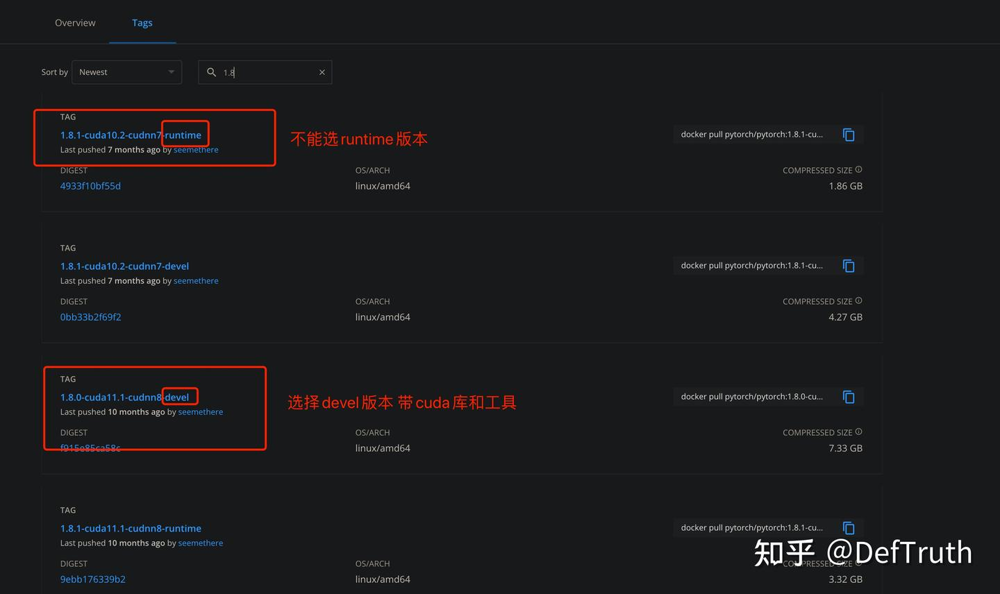

# [배포][ORT] ONNXRuntime Python GPU 배포 설정 기록

> 원문: https://zhuanlan.zhihu.com/p/457484536

목차

- 0. 서문
- 1. base image 선택
- 2. runtime과 devel 보충
- 3. Docker image를 올바르게 시작
- 4. `onnxruntime-gpu` version 설치
- 5. `TensorrtExecutionProvider`는 언제 유효한가
- 6. 사용 예시

최근 TNN, MNN, NCNN, ONNXRuntime 사용 시리즈 노트를 정리하려 한다. 좋은 기억력보다 엉성한 기록이 낫다. 기억력도 좋지 않으니, 나중에 같은 구덩이에 빠졌을 때 조금 더 빠르게 빠져나오기 위한 기록이다. 현재 **80개가 넘는 C++** 추론 예제를 lib로 빌드해서 사용할 수 있게 정리해 두었다. 관심이 있으면 보면 된다. 길게 소개하지는 않는다.

프로젝트 설명:

Github Lite.AI.ToolKitA lite C++ toolkit of awesome AI models.

즉, 바로 사용할 수 있는 C++ AI 모델 도구 상자다. 평소 새 알고리즘을 공부할 때 손에 잡히는 대로 만든 것들이고, 현재 80개 이상의 인기 오픈소스 모델을 포함한다. 어느새 거의 800 star에 가까워졌다. star와 issue는 언제나 환영한다.

https://github.com/DefTruth/lite.ai.toolkit

최근 관련 글을 계속 갱신할 예정이다.

업데이트: 2022/01/18. 먼저 글의 문제를 지적해 준 샤오바이에게 감사한다. 유용한 지식을 배웠고, 원문도 그에 맞게 보충하고 수정했다. 계속 배우는 태도가 중요하다.

### 0. 서문


최근 가끔 **onnxruntime-gpu(Python version)**의 **server-side deployment**를 만져 보았다. 그래서 몇 가지 **핵심 단계**를 간단히 기록한다. 나중에 잊지 않기 위해서다.

실제로 항상 모델을 MNN, ncnn, TNN으로 변환해서 mobile deployment 방식으로만 가야 하는 것은 아니다. server-side deployment도 중요한 scenario다. 자주 쓰는 server-side deployment solution으로는 TensorRT, `onnxruntime-gpu` 등이 있다.

`onnxruntime-gpu` version은 매우 쉽고 쓰기 편한 framework라고 할 수 있다. 보통 PyTorch로 학습한 모델은 deployment 전에 먼저 ONNX로 변환한다. ONNXRuntime과 ONNX는 같은 계열이므로 op support 측면에서는 당연히 가장 좋다. ONNXRuntime으로 ONNX model을 배포하면 별도의 2차 model conversion이 필요 없다. 물론 inference engine마다 장점이 다르므로 여기서 비교하지는 않는다. 이 짧은 글은 `onnxruntime-gpu` version 구성의 주요 단계를 기록한다.

### 1. base image 선택

이 단계는 중요하다. 올바른 base image를 선택해야 `onnxruntime-gpu` version을 순조롭게 사용할 수 있다. `onnxruntime-gpu` version은 CUDA library에 의존한다. 따라서 선택한 image 안에는 CUDA library(dynamic library)가 들어 있어야 한다. 그렇지 않으면 `onnxruntime-gpu` 설치 자체는 성공하더라도 실제로 GPU를 사용할 수 없다.

Docker Hub에서 PyTorch image를 검색하면 여러 선택지가 나온다. 예를 들어 1.8.0 version에는 cuda10.2, cuda11.1의 devel/runtime version이 있다. 아래 그림을 보면 된다. 여기서는 CUDA library가 포함된 devel version을 선택한다.



적절한 image를 다운로드한다. driver version의 높고 낮음에 따라 선택하면 된다.

```bash
docker pull pytorch/pytorch:1.8.0-cuda11.1-cudnn8-devel # nvidia driver가 비교적 높을 때
docker pull pytorch/pytorch:1.8.1-cuda10.2-cudnn7-devel # nvidia driver가 비교적 낮을 때
```

### 2. runtime과 devel 보충

업데이트: 2022/01/18. 위 1절은 runtime과 devel 선택에 관한 원래 설명이었다. 샤오바이의 지적을 받고 보니 이 부분의 이해에 일정한 오류가 있었다. 그래서 새로 배운 내용을 보충한다.

devel을 선택했던 이유는 두 가지였다. 하나는 이전에 runtime version을 사용했을 때 정상 사용이 되지 않았고 devel로 바꾸면 문제가 사라졌기 때문이다. 다른 하나는 관련 tutorial에서 CUDA library path를 `PATH`로 export해야 한다고 설명하는 내용을 보았고, 그렇다면 devel version 안의 CUDA library가 필요하다고 생각했기 때문이다.

샤오바이의 지적에 따르면 runtime version 자체의 문제라기보다는 “대략 dependency version 문제이며, 이런 문제는 version mismatch를 직접 알려 주지 않으니 스스로 파악해야 한다. devel은 compile용이고 runtime은 release용이다.” 공식 Docker build script도 따로 있다.

따라서 pip로만 설치한다면 PyTorch runtime image와 devel image 모두 가능하다. source에서 직접 build해야 한다면 devel version이 필요하다.

### 3. Docker image를 올바르게 시작

먼저 **nvidia-docker**로 PyTorch 1.8.0 container를 시작하고 login해야 한다. 일반 `docker`로 시작하면 GPU 정보를 얻을 수 없다.

```bash
GPU_ID=0
CONTAINER_NAME=onnxruntime_gpu_test

nvidia-docker run -idt -p ${PORT2}:${PORT1} \  # 설정하려는 port mapping 지정. idt의 d는 background 실행을 의미하고, d를 빼면 background 실행이 아니다.
  -v ${SERVER_DIR}:${CONTAINER_DIR} \  # 공유 directory mount. 필요 없으면 이 줄은 빼도 된다.
  --shm-size=16gb --env NVIDIA_VISIBLE_DEVICES="${GPU_ID}" \  # GPU_ID 지정
  --name="${CONTAINER_NAME}" pytorch/pytorch:1.8.0-cuda11.1-cudnn8-devel  # background로 시작할 image 지정
```

`nvidia-docker` 설치 참고 자료는 많으므로 여기서는 반복하지 않는다.

주의할 점은 host machine의 GPU driver 등이 정상이어야 한다는 것이다. 그렇지 않으면 container 안에서 GPU를 사용할 수 없다. 예를 들어:

```text
nvidia-smi  # GPU가 인식되는지 확인
+-----------------------------------------------------------------------------+
| NVIDIA-SMI 440.118.02   Driver Version: 440.118.02   CUDA Version: 10.2     |
|-------------------------------+----------------------+----------------------+
| GPU  Name        Persistence-M| Bus-Id        Disp.A | Volatile Uncorr. ECC |
| Fan  Temp  Perf  Pwr:Usage/Cap|         Memory-Usage | GPU-Util  Compute M. |
|===============================+======================+======================|
|   0  Tesla P40           Off  | 00000000:88:00.0 Off |                    0 |
| N/A   26C    P8    10W / 250W |     10MiB / 22919MiB |      0%      Default |
+-------------------------------+----------------------+----------------------+
```

NVIDIA driver 설치에 관한 글도 많으니 여기서는 반복하지 않는다.

### 4. `onnxruntime-gpu` version 설치

container에 들어간 뒤 pip로 GPU version ONNXRuntime을 설치한다. 앞 단계에 문제가 없다면 이 단계는 순조롭게 끝난다.

```bash
pip install onnxruntime-gpu # GPU version 설치
```

먼저 ONNXRuntime이 실제로 GPU를 사용할 수 있는지 확인한다. `TensorrtExecutionProvider`와 `CUDAExecutionProvider`를 얻을 수 있다면 정상이다. 이제 GPU inference deployment를 진행하면 된다.

```text
root@xxx:/workspace# python
Python 3.8.8 (default, Feb 24 2021, 21:46:12)
[GCC 7.3.0] :: Anaconda, Inc. on linux
Type "help", "copyright", "credits" or "license" for more information.
>>> import onnxruntime
>>> onnxruntime.get_device()
'GPU'
>>> onnxruntime.get_available_providers()
['TensorrtExecutionProvider', 'CUDAExecutionProvider', 'CPUExecutionProvider']
>>> exit()
```

GPU를 사용할 수 없다면 아래 설정을 추가해 볼 수 있다.

```bash
export PATH=/usr/local/cuda-11.1/bin:$PATH
export LD_LIBRARY_PATH=/usr/local/cuda-11.1/lib64:$LD_LIBRARY_PATH
```

### 5. `TensorrtExecutionProvider`는 언제 유효한가

업데이트: 2022/01/18. 위 4절은 `TensorrtExecutionProvider`와 `CUDAExecutionProvider` 사용에 관한 원래 설명이었다. 샤오바이의 지적에 따르면 `TensorrtExecutionProvider`가 반드시 실행되는 것은 아니다.

공식 문서에도 설명이 있다. pip로 설치한 `onnxruntime-gpu`는 `CUDAExecutionProvider`만 사용해 acceleration할 수 있다. source에서 compile한 `onnxruntime-gpu`만 `TensorrtExecutionProvider`를 사용해 acceleration할 수 있다. 이 부분은 아직 시도해 보지 않았고, 나중에 시간이 있으면 source build를 따로 정리한다. 공식 문서 내용은 다음과 같다.

```text
Official Python packages on Pypi only support the default CPU (MLAS)
and default GPU (CUDA) execution providers. For other execution providers,
you need to build from source. The recommended instructions build the
wheel with debug info in parallel. Tune performance
```

ONNXRuntime Python source code의 일부도 볼 수 있다.

```python
    def _create_inference_session(self, providers, provider_options):
        available_providers = C.get_available_providers()

        # validate providers and provider_options before other initialization
        providers, provider_options = check_and_normalize_provider_args(providers,
                                                                        provider_options,
                                                                        available_providers)

        # Tensorrt can fall back to CUDA. All others fall back to CPU.
        if 'TensorrtExecutionProvider' in available_providers:
            self._fallback_providers = ['CUDAExecutionProvider', 'CPUExecutionProvider']
        else:
            self._fallback_providers = ['CPUExecutionProvider']
```

그리고 `_fallback_providers`를 초기화해서 호출하는 logic도 있다.

```python
        try:
            self._create_inference_session(providers, provider_options)
        except RuntimeError:
            if self._enable_fallback:
                print("EP Error using {}".format(self._providers))
                print("Falling back to {} and retrying.".format(self._fallback_providers))
                self._create_inference_session(self._fallback_providers, None)
                # Fallback only once.
                self.disable_fallback()
            else:
                raise
```

여기서 볼 수 있듯 `TensorrtExecutionProvider`는 `CUDAExecutionProvider`로 fallback할 수 있다. `TensorrtExecutionProvider`를 설정하면 ONNXRuntime은 먼저 `TensorrtExecutionProvider`가 포함된 providers로 `InferenceSession`을 만들려고 시도한다. 실패하면 `['CUDAExecutionProvider','CPUExecutionProvider']`만 사용하는 방식으로 fallback하고, 아래 두 줄의 log를 출력한다.

```python
print("EP Error using {}".format(self._providers))
print("Falling back to {} and retrying.".format(self._fallback_providers))
```

다만 내 사용 환경, 즉 pip로 설치한 최신 `onnxruntime-gpu`에서는 이 두 줄의 log가 출력되지 않았다. 그래서 `TensorrtExecutionProvider`를 실제로 사용한 것인지 명확하지 않다. 새 version에서 이 문제가 최적화된 것인지도 확실하지 않다.

### 6. 사용 예시

사용법은 간단하다. **InferenceSession**을 새로 만들 때 `TensorrtExecutionProvider`와 `CUDAExecutionProvider`를 넣으면 된다. 아래 한 줄은 CPU deployment와 GPU deployment 모두에서 통용된다. inference 실행 중 GPU memory usage가 올라가는지 확인하면 된다. 올라간다면 정상이다.

```python
self.session = onnxruntime.InferenceSession(
     "YOUR-ONNX-MODEL-PATH",
     providers=onnxruntime.get_available_providers()
)
```

`onnxruntime-gpu` inference 성능을 간단히 정리하면 다음과 같다. CPU와 단순 비교한 것이며 엄밀한 benchmark는 아니다. 아직 다른 inference engine과 비교하지 않았다.

| 항목 | CPU | GPU | 횟수 | speedup |
| --- | ---: | ---: | ---: | ---: |
| inference | 2637ms(16 thread) | 131ms | 100 | 15-20x |

모델 engineering 사례를 더 보고 싶다면 관련 column을 보면 된다.
