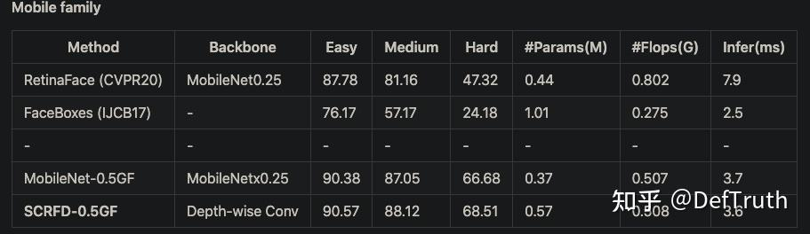
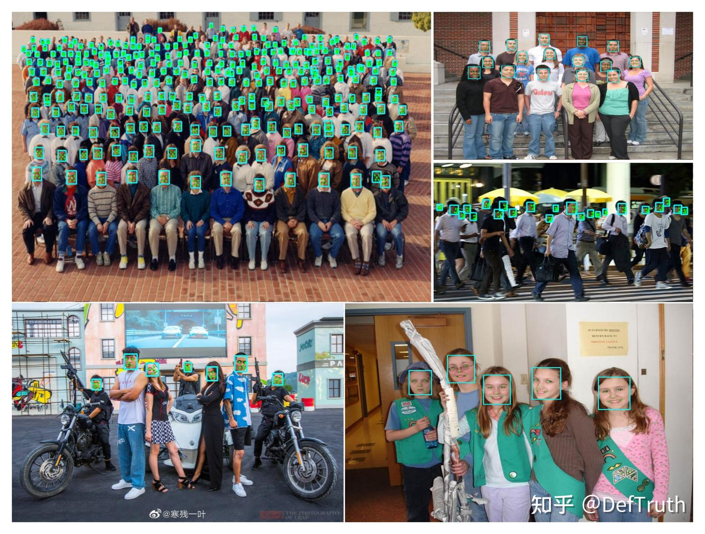
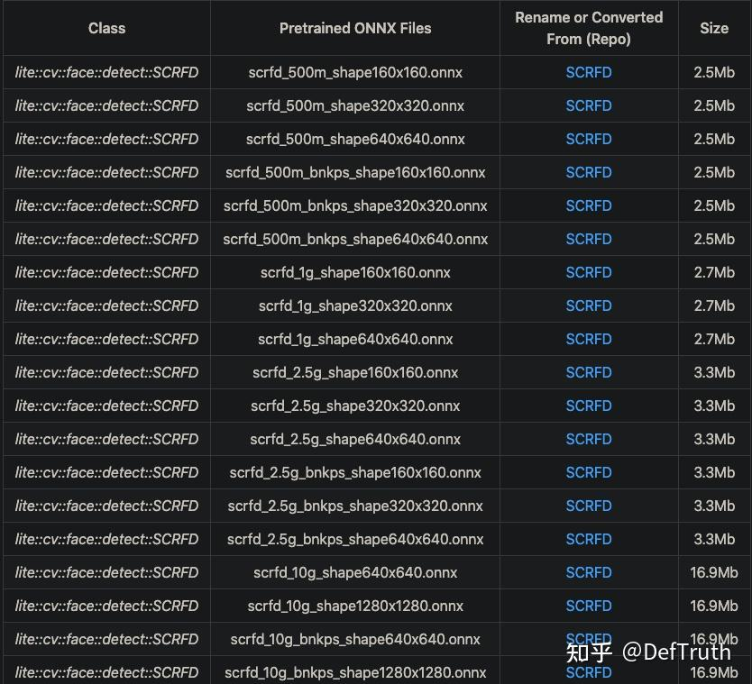
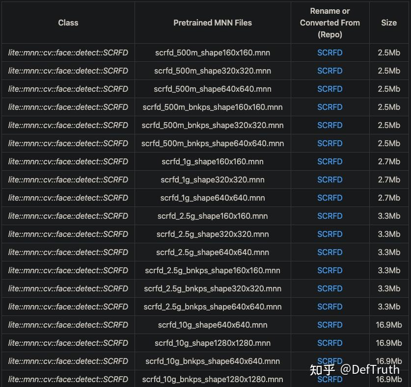
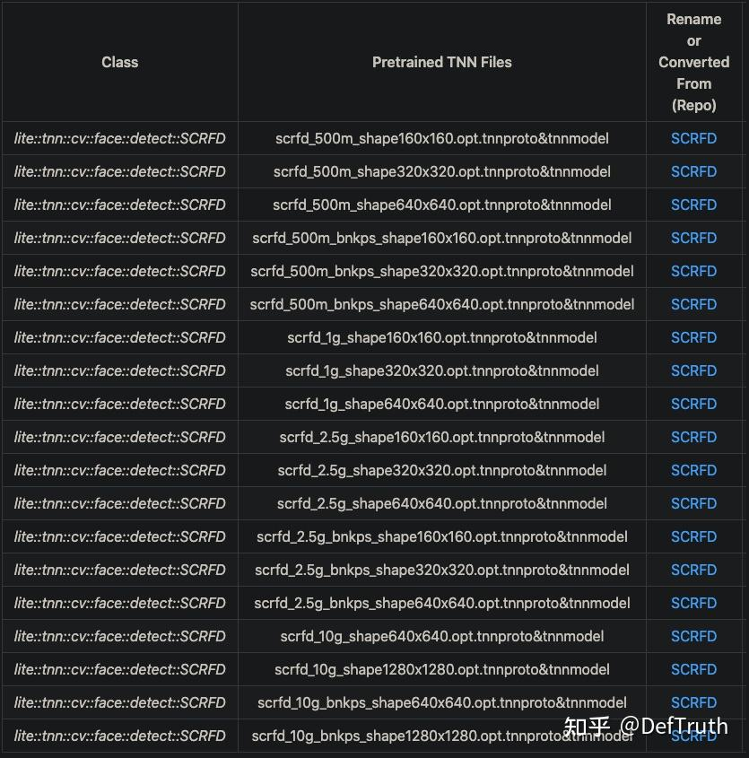
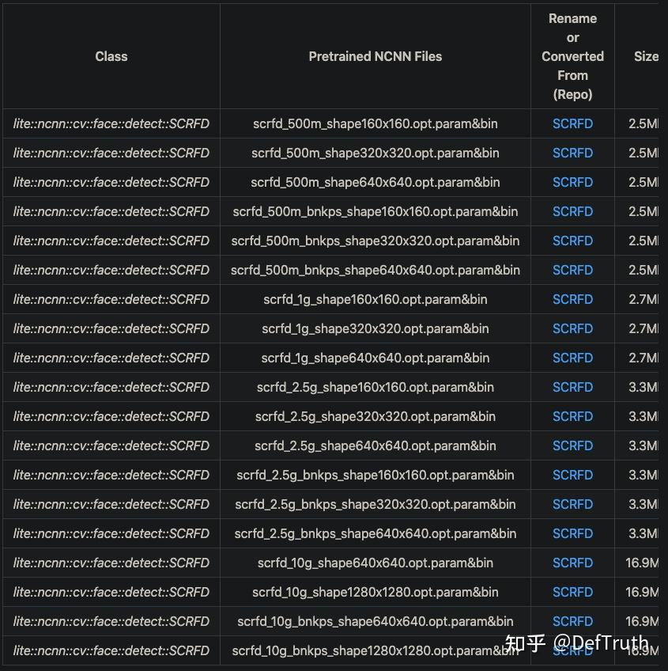
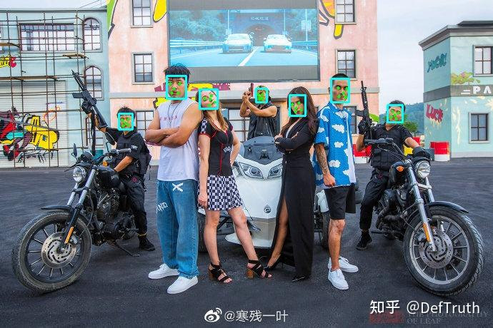

# SCRFD Docker 이미지와 C++ 추론 배포

> 원문: https://zhuanlan.zhihu.com/p/455165568

## 0. 서문



얼마 전 SCRFD, 즉 이전 강자인 RetinaFace를 크게 앞선 모델의 변환에 관한 글을 썼다. C++ engineering 부분은 아직 보충하지 않았으므로 이 글의 목적 중 하나는 그 빈칸을 채우는 것이다.


당시에는 다음 repository의 ONNX file을 사용해 NCNN, MNN, TNN model로 변환했고, 몇 가지 op conversion 문제를 만났다. 그래서 어쩔 수 없이 이전 글에 쓴 우회 trick을 사용했다.

https://github.com/ppogg/onnx-scrfd-flask

하지만 이 ONNX는 변환 시 각 output에 name을 지정하지 않았다. ONNX 안에서 output name이 `224`, `347`, `456` 같은 서로 다른 숫자로 randomize되고, ONNX file마다 이 숫자가 모두 달랐다. unified interface wrapping에는 좋지 않다. 그래서 SCRFD 공식 repository에서 다시 구체적으로 naming된 output을 가진 ONNX file을 export하기로 했다. 예를 들면 `score_8`, `score_16`, `score_32` 같은 이름이다.

## 1. SCRFD Docker 이미지

처음에는 Mac에 MMCV와 MMDetection을 설치하려 했지만 여러 이상한 compile 문제가 생겨 포기했다. 대신 Docker 방식으로 전환했다. MMCV는 Torch version과 대응되어야 하고, 현재 Torch 1.8.0까지 지원하므로 PyTorch 1.8.0 image를 base image로 사용했다. 나머지 SCRFD image 구축 과정은 이전 작업과 비슷하므로 여기서는 반복하지 않는다.

바로 구축해 둔 image를 둔다. pull해서 바로 사용하면 된다. SCRFD 원본 `pth` weight와 내가 변환한 ONNX file이 이미 포함되어 있다.

```bash
docker pull qyjdefdocker/onnx-scrfd-converter:v0.3
```

background로 container를 시작하는 script `run_scrfd_onnx_docker.sh`를 작성한다.

```bash
#!/bin/bash

PORT1=6004
PORT2=6006
SERVICE_DIR=/Users/xxx/Desktop/xxx/insightface/detection/scrfd/share  # create any shared folder
CONRAINER_DIR=/workspace/insightface/detection/scrfd/share
CONRAINER_NAME=onnx_scrfd_converter_d

docker run -idt -p ${PORT2}:${PORT1} -v ${SERVICE_DIR}:${CONRAINER_DIR} --shm-size=16gb --name ${CONRAINER_NAME} onnx-scrfd-converter:v0.3
```

그다음 container를 시작하고 들어간다.

```bash
sh ./run_scrfd_onnx_docker.sh
docker exec -it onnx_scrfd_converter_d /bin/bash
```

`weights` folder에는 `pth` weight가 있고, `onnx` folder에는 내가 변환한 ONNX file이 있다. container와 shared folder를 사용하는 방식으로 container 안의 file을 local로 복사할 수 있다.

```bash
cd /workspace/insightface/detection/scrfd 
cp onnx/* share/
```

## 2. SCRFD 프로젝트 소개

먼저 모든 example code는 다음 repository에 있다. Lite.AI.ToolKit 도구 상자에는 참고할 만한 C++ example이 몇 가지 들어 있다.

- scrfd.lite.ai.toolkit: SCRFD C++ test case code. ONNXRuntime, NCNN, MNN, TNN version을 포함한다. https://github.com/DefTruth/scrfd.lite.ai.toolkit
- Lite.AI.ToolKit: 즉시 사용할 수 있는 C++ AI model toolkit. 평소 새 algorithm을 학습할 때 만든 것이며 현재 80개 이상의 open-source model을 포함한다. https://github.com/DefTruth/lite.ai.toolkit

Lite.AI.ToolKit C++ 도구 상자로 SCRFD 예제를 실행한다. ONNXRuntime C++, MNN, TNN, NCNN version을 포함한다.



Star는 필요하면 누르면 된다.

## 3. SCRFD C++ 버전 소스

SCRFD C++ version source는 ONNXRuntime, MNN, TNN, NCNN 네 version을 포함하며, source는 `lite.ai.toolkit` 도구 상자에서 찾을 수 있다. 이 프로젝트는 주로 `lite.ai.toolkit` 도구 상자를 기반으로 SCRFD를 직접 사용해 face detection을 실행하는 방법을 소개한다.

설명이 필요한 부분이 있다. 이 프로젝트는 MacOS에서 빌드한 `liblite.ai.toolkit.v0.1.0.dylib`를 기반으로 구현했다. MacOS 사용자는 이 프로젝트에 포함된 `liblite.ai.toolkit.v0.1.0` dynamic library와 다른 dependency library를 바로 내려받아 사용할 수 있다. MacOS가 아닌 사용자는 `lite.ai.toolkit`에서 source를 내려받아 직접 빌드해야 한다.

`lite.ai.toolkit` C++ 도구 상자는 현재 70개 이상의 인기 open-source model을 포함한다. 평소 손 가는 대로 만든 것이고, 학습 과정에서 접한 모델들을 통합한 것이므로 관심이 있으면 직접 보면 된다.

- scrfd.cpp
- scrfd.h
- mnn_scrfd.cpp
- mnn_scrfd.h
- tnn_scrfd.cpp
- tnn_scrfd.h
- ncnn_scrfd.cpp
- ncnn_scrfd.h

ONNXRuntime C++, MNN, TNN, NCNN version의 추론 구현은 모두 테스트를 통과했다.

## 4. 모델 파일

### 4.1 ONNX 모델 파일

제공한 링크에서 내려받을 수 있다. Baidu Drive code는 `8gin`이다. 또는 이 repository에서 직접 내려받을 수도 있다.



### 4.2 MNN 모델 파일

MNN 모델 파일 다운로드 주소다. Baidu Drive code는 `9v63`이다. 또는 이 repository에서 직접 내려받을 수도 있다.



### 4.3 TNN 모델 파일

TNN 모델 파일 다운로드 주소다. Baidu Drive code는 `6o6k`이다. 또는 이 repository에서 직접 내려받을 수도 있다.



### 4.4 NCNN 모델 파일

NCNN 모델 파일 다운로드 주소다. Baidu Drive code는 `sc7f`이다. 또는 이 repository에서 직접 내려받을 수도 있다.



## 5. Interface 문서

`lite.ai.toolkit`에서 SCRFD 구현 class는 다음과 같다.

```cpp
class LITE_EXPORTS lite::cv::face::detect::SCRFD;
class LITE_EXPORTS lite::mnn::cv::face::detect::SCRFD;
class LITE_EXPORTS lite::tnn::cv::face::detect::SCRFD;
class LITE_EXPORTS lite::ncnn::cv::face::detect::SCRFD;

```

이 type은 현재 object detection을 수행하는 public interface `detect` 하나를 포함한다.

```cpp
public:
    /**
     * @param mat cv::Mat BGR format
     * @param detected_boxes_kps vector of BoxfWithLandmarks to catch detected boxes and landmarks.
     * @param score_threshold default 0.25f, only keep the result which >= score_threshold.
     * @param iou_threshold default 0.45f, iou threshold for NMS.
     * @param topk default 400, maximum output boxes after NMS.
     */
    void detect(const cv::Mat &mat, std::vector<types::BoxfWithLandmarks> &detected_boxes_kps,
                float score_threshold = 0.25f, float iou_threshold = 0.45f,
                unsigned int topk = 400);

```

`detect` interface의 입력 parameter 설명:

- `mat`: `cv::Mat` type, BGR format.
- `detected_boxes_kps`: `BoxfWithLandmarks` vector. 검출된 box `Boxf`를 포함하며, box에는 `x1`, `y1`, `x2`, `y2`, `label`, `score` 등의 member가 있다. 또한 landmarks는 얼굴 keypoint 5개를 포함한다. 그 안의 `points`는 keypoint를 나타내며 `cv::Point2f` vector다.
- `score_threshold`: classification score, 또는 quality score threshold. 기본값은 0.25이며 이 threshold보다 작은 box는 버린다.
- `iou_threshold`: NMS의 IoU threshold. 기본값은 0.3이다.
- `topk`: 기본값은 400이며, detection result 중 상위 k개만 유지한다.

## 6. 사용 예시

여기서는 `scrfd_2.5g_bnkps_shape640x640.onnx` version model을 사용해 테스트한다. 다른 version model도 사용해 볼 수 있다.

### 6.1 ONNXRuntime 버전

```cpp
#include "lite/lite.h"

static void test_default()
{
    std::string onnx_path = "../hub/onnx/cv/scrfd_2.5g_bnkps_shape640x640.onnx";
    std::string test_img_path = "../resources/4.jpg";
    std::string save_img_path = "../logs/4.jpg";

    auto *scrfd = new lite::cv::face::detect::SCRFD(onnx_path);

    std::vector<lite::types::BoxfWithLandmarks> detected_boxes;
    cv::Mat img_bgr = cv::imread(test_img_path);
    scrfd->detect(img_bgr, detected_boxes, 0.3f);

    lite::utils::draw_boxes_with_landmarks_inplace(img_bgr, detected_boxes);

    cv::imwrite(save_img_path, img_bgr);

    std::cout << "Default Version Done! Detected Face Num: " << detected_boxes.size() << std::endl;

    delete scrfd;
}

```

### 6.2 MNN 버전

```cpp
#include "lite/lite.h"

static void test_mnn()
{
#ifdef ENABLE_MNN
    std::string mnn_path = "../hub/mnn/cv/scrfd_2.5g_bnkps_shape640x640.mnn";
    std::string test_img_path = "../resources/12.jpg";
    std::string save_img_path = "../logs/12.jpg";

    auto *scrfd = new lite::mnn::cv::face::detect::SCRFD(mnn_path);

    std::vector<lite::types::BoxfWithLandmarks> detected_boxes;
    cv::Mat img_bgr = cv::imread(test_img_path);
    scrfd->detect(img_bgr, detected_boxes, 0.3f);

    lite::utils::draw_boxes_with_landmarks_inplace(img_bgr, detected_boxes);

    cv::imwrite(save_img_path, img_bgr);

    std::cout << "MNN Version Done! Detected Face Num: " << detected_boxes.size() << std::endl;

    delete scrfd;
#endif
}

```

### 6.3 TNN 버전

```cpp
#include "lite/lite.h"

static void test_tnn()
{
#ifdef ENABLE_TNN
    std::string proto_path = "../hub/tnn/cv/scrfd_2.5g_bnkps_shape640x640.opt.tnnproto";
    std::string model_path = "../hub/tnn/cv/scrfd_2.5g_bnkps_shape640x640.opt.tnnmodel";
    std::string test_img_path = "../resources/9.jpg";
    std::string save_img_path = "../logs/9.jpg";

    auto *scrfd = new lite::tnn::cv::face::detect::SCRFD(proto_path, model_path);

    std::vector<lite::types::BoxfWithLandmarks> detected_boxes;
    cv::Mat img_bgr = cv::imread(test_img_path);
    scrfd->detect(img_bgr, detected_boxes, 0.3f);

    lite::utils::draw_boxes_with_landmarks_inplace(img_bgr, detected_boxes);

    cv::imwrite(save_img_path, img_bgr);

    std::cout << "TNN Version Done! Detected Face Num: " << detected_boxes.size() << std::endl;

    delete scrfd;
#endif
}

```

### 6.4 NCNN 버전

```cpp
#include "lite/lite.h"

static void test_ncnn()
{
#ifdef ENABLE_NCNN
    std::string param_path = "../hub/ncnn/cv/scrfd_2.5g_bnkps_shape640x640.opt.param";
    std::string bin_path = "../hub/ncnn/cv/scrfd_2.5g_bnkps_shape640x640.opt.bin";
    std::string test_img_path = "../resources/1.jpg";
    std::string save_img_path = "../logs/1.jpg";

    auto *scrfd = new lite::ncnn::cv::face::detect::SCRFD(param_path, bin_path, 1, 640, 640);

    std::vector<lite::types::BoxfWithLandmarks> detected_boxes;
    cv::Mat img_bgr = cv::imread(test_img_path);
    scrfd->detect(img_bgr, detected_boxes, 0.3f);

    lite::utils::draw_boxes_with_landmarks_inplace(img_bgr, detected_boxes);

    cv::imwrite(save_img_path, img_bgr);

    std::cout << "NCNN Version Done! Detected Face Num: " << detected_boxes.size() << std::endl;

    delete scrfd;
#endif
}

```

출력 결과는 다음과 같다.


## 7. 빌드 및 실행

MacOS에서는 이 프로젝트를 바로 빌드하고 실행할 수 있으며 다른 dependency library를 내려받을 필요가 없다. 다른 system에서는 먼저 `lite.ai.toolkit`에서 source를 내려받아 `lite.ai.toolkit.v0.1.0` dynamic library를 빌드해야 한다.

```bash
git clone --depth=1 https://github.com/DefTruth/scrfd.lite.ai.toolkit.git
cd scrfd.lite.ai.toolkit 
sh ./build.sh
```

CMakeLists.txt 설정:

```cmake
cmake_minimum_required(VERSION 3.17)
project(scrfd.lite.ai.toolkit)

set(CMAKE_CXX_STANDARD 11)

# setting up lite.ai.toolkit
set(LITE_AI_DIR ${CMAKE_SOURCE_DIR}/lite.ai.toolkit)
set(LITE_AI_INCLUDE_DIR ${LITE_AI_DIR}/include)
set(LITE_AI_LIBRARY_DIR ${LITE_AI_DIR}/lib)
include_directories(${LITE_AI_INCLUDE_DIR})
link_directories(${LITE_AI_LIBRARY_DIR})

set(OpenCV_LIBS
        opencv_highgui
        opencv_core
        opencv_imgcodecs
        opencv_imgproc
        opencv_video
        opencv_videoio
        )
# add your executable
set(EXECUTABLE_OUTPUT_PATH ${CMAKE_SOURCE_DIR}/examples/build)

add_executable(lite_scrfd examples/test_lite_scrfd.cpp)
target_link_libraries(lite_scrfd
        lite.ai.toolkit
        onnxruntime
        MNN  # need, if built lite.ai.toolkit with ENABLE_MNN=ON,  default OFF
        ncnn # need, if built lite.ai.toolkit with ENABLE_NCNN=ON, default OFF
        TNN  # need, if built lite.ai.toolkit with ENABLE_TNN=ON,  default OFF
        ${OpenCV_LIBS})  # link lite.ai.toolkit & other libs.
```

building 및 testing information:

```text
[ 50%] Building CXX object CMakeFiles/lite_scrfd.dir/examples/test_lite_scrfd.cpp.o
[100%] Linking CXX executable lite_scrfd
[100%] Built target lite_scrfd
Testing Start ...
LITEORT_DEBUG LogId: ../hub/onnx/cv/scrfd_2.5g_bnkps_shape640x640.onnx
=============== Input-Dims ==============
input_node_dims: 1
input_node_dims: 3
input_node_dims: 640
input_node_dims: 640
=============== Output-Dims ==============
Output: 0 Name: score_8 Dim: 0 :1
Output: 0 Name: score_8 Dim: 1 :12800
Output: 0 Name: score_8 Dim: 2 :1
Output: 1 Name: score_16 Dim: 0 :1
Output: 1 Name: score_16 Dim: 1 :3200
Output: 1 Name: score_16 Dim: 2 :1
Output: 2 Name: score_32 Dim: 0 :1
Output: 2 Name: score_32 Dim: 1 :800
Output: 2 Name: score_32 Dim: 2 :1
Output: 3 Name: bbox_8 Dim: 0 :1
Output: 3 Name: bbox_8 Dim: 1 :12800
Output: 3 Name: bbox_8 Dim: 2 :4
Output: 4 Name: bbox_16 Dim: 0 :1
Output: 4 Name: bbox_16 Dim: 1 :3200
Output: 4 Name: bbox_16 Dim: 2 :4
Output: 5 Name: bbox_32 Dim: 0 :1
Output: 5 Name: bbox_32 Dim: 1 :800
Output: 5 Name: bbox_32 Dim: 2 :4
Output: 6 Name: kps_8 Dim: 0 :1
Output: 6 Name: kps_8 Dim: 1 :12800
Output: 6 Name: kps_8 Dim: 2 :10
Output: 7 Name: kps_16 Dim: 0 :1
Output: 7 Name: kps_16 Dim: 1 :3200
Output: 7 Name: kps_16 Dim: 2 :10
Output: 8 Name: kps_32 Dim: 0 :1
Output: 8 Name: kps_32 Dim: 1 :800
Output: 8 Name: kps_32 Dim: 2 :10
========================================
generate_bboxes_kps num: 52
Default Version Done! Detected Face Num: 9
LITEORT_DEBUG LogId: ../hub/onnx/cv/scrfd_2.5g_bnkps_shape640x640.onnx
=============== Input-Dims ==============
input_node_dims: 1
input_node_dims: 3
input_node_dims: 640
input_node_dims: 640
=============== Output-Dims ==============
Output: 0 Name: score_8 Dim: 0 :1
Output: 0 Name: score_8 Dim: 1 :12800
Output: 0 Name: score_8 Dim: 2 :1
Output: 1 Name: score_16 Dim: 0 :1
Output: 1 Name: score_16 Dim: 1 :3200
Output: 1 Name: score_16 Dim: 2 :1
Output: 2 Name: score_32 Dim: 0 :1
Output: 2 Name: score_32 Dim: 1 :800
Output: 2 Name: score_32 Dim: 2 :1
Output: 3 Name: bbox_8 Dim: 0 :1
Output: 3 Name: bbox_8 Dim: 1 :12800
Output: 3 Name: bbox_8 Dim: 2 :4
Output: 4 Name: bbox_16 Dim: 0 :1
Output: 4 Name: bbox_16 Dim: 1 :3200
Output: 4 Name: bbox_16 Dim: 2 :4
Output: 5 Name: bbox_32 Dim: 0 :1
Output: 5 Name: bbox_32 Dim: 1 :800
Output: 5 Name: bbox_32 Dim: 2 :4
Output: 6 Name: kps_8 Dim: 0 :1
Output: 6 Name: kps_8 Dim: 1 :12800
Output: 6 Name: kps_8 Dim: 2 :10
Output: 7 Name: kps_16 Dim: 0 :1
Output: 7 Name: kps_16 Dim: 1 :3200
Output: 7 Name: kps_16 Dim: 2 :10
Output: 8 Name: kps_32 Dim: 0 :1
Output: 8 Name: kps_32 Dim: 1 :800
Output: 8 Name: kps_32 Dim: 2 :10
========================================
generate_bboxes_kps num: 138
ONNXRuntime Version Done! Detected Face Num: 23
LITEMNN_DEBUG LogId: ../hub/mnn/cv/scrfd_2.5g_bnkps_shape640x640.mnn
=============== Input-Dims ==============
        **Tensor shape**: 1, 3, 640, 640, 
Dimension Type: (CAFFE/PyTorch/ONNX)NCHW
=============== Output-Dims ==============
getSessionOutputAll done!
Output: bbox_16:        **Tensor shape**: 1, 3200, 4, 
Output: bbox_32:        **Tensor shape**: 1, 800, 4, 
Output: bbox_8:         **Tensor shape**: 1, 12800, 4, 
Output: kps_16:         **Tensor shape**: 1, 3200, 10, 
Output: kps_32:         **Tensor shape**: 1, 800, 10, 
Output: kps_8:  **Tensor shape**: 1, 12800, 10, 
Output: score_16:       **Tensor shape**: 1, 3200, 1, 
Output: score_32:       **Tensor shape**: 1, 800, 1, 
Output: score_8:        **Tensor shape**: 1, 12800, 1, 
========================================
generate_bboxes_kps num: 34
MNN Version Done! Detected Face Num: 5
LITENCNN_DEBUG LogId: ../hub/ncnn/cv/scrfd_2.5g_bnkps_shape640x640.opt.param
=============== Output-Dims ==============
score_8: c=1,h=12800,w=1
score_16: c=1,h=3200,w=1
score_32: c=1,h=800,w=1
bbox_8: c=1,h=12800,w=4
bbox_16: c=1,h=3200,w=4
bbox_32: c=1,h=800,w=4
kps_8: c=1,h=12800,w=10
kps_16: c=1,h=3200,w=10
kps_32: c=1,h=800,w=10
generate_bboxes_kps num: 16
NCNN Version Done! Detected Face Num: 2
LITETNN_DEBUG LogId: ../hub/tnn/cv/scrfd_2.5g_bnkps_shape640x640.opt.tnnproto
=============== Input-Dims ==============
input.1: [1 3 640 640 ]
Input Data Format: NCHW
=============== Output-Dims ==============
bbox_16: [1 3200 4 ]
bbox_32: [1 800 4 ]
bbox_8: [1 12800 4 ]
kps_16: [1 3200 10 ]
kps_32: [1 800 10 ]
kps_8: [1 12800 10 ]
score_16: [1 3200 1 ]
score_32: [1 800 1 ]
score_8: [1 12800 1 ]
========================================
generate_bboxes_kps num: 49
TNN Version Done! Detected Face Num: 7
Testing Successful !
```



효과는 괜찮아 보인다. 더 많은 모델의 C++ engineering 사례를 알고 싶으면 팔로우하면 된다.
