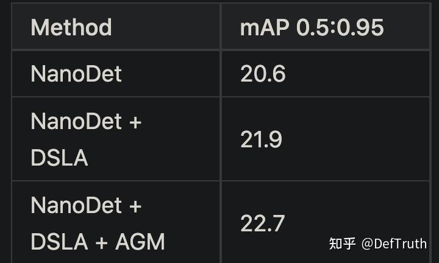
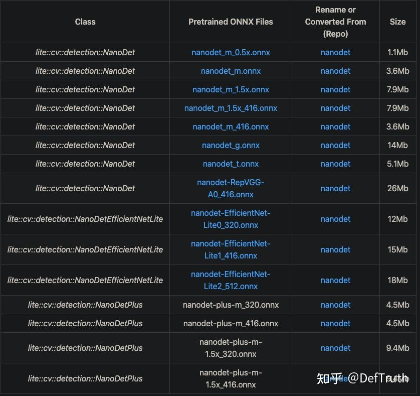
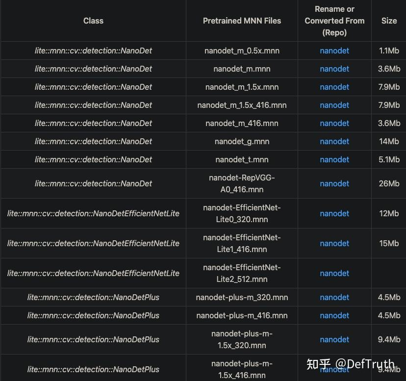
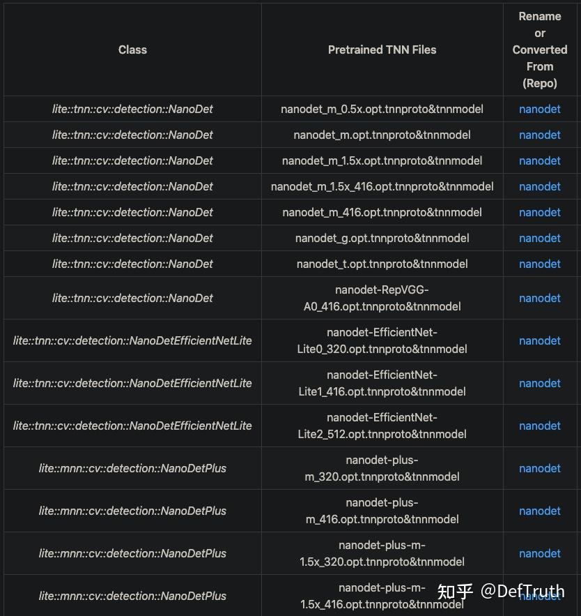
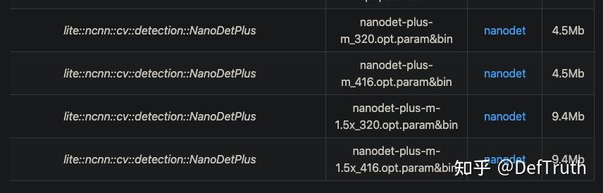

# NanoDet-Plus C++ Engineering 기록

> 원문: https://zhuanlan.zhihu.com/p/450586647

### 1. 서문

얼마 전 NanoDet C++ engineering note를 정리했다. MNN, NCNN, TNN, ONNXRuntime version의 C++ inference code를 통합한 글이다. 원문은 다음에 있다.


이틀 전 NanoDet 저자가 NanoDet을 NanoDet-Plus로 upgrade했다. 1ms 정도의 latency만 추가하면서 accuracy를 거의 30% 높였다.



NanoDet-Plus에서는 model output 수가 하나로 줄었다. 모든 output tensor를 미리 reshape한 뒤 concatenate하기 때문이다. 따라서 NanoDet-Plus에는 output이 하나뿐이고, 기존 deployment code는 더 이상 적용되지 않는다. 저자도 MNN, NCNN, OpenVINO, LibTorch를 포함해 C++ inference code를 다시 정리했다. 내가 이전에 repository에 통합해 둔 NanoDet C++ inference code도 더 이상 적용되지 않는다. 그래서 NanoDet-Plus를 대상으로 C++ inference code를 다시 만들기로 했다.

저자가 제공한 C++ inference implementation과 비교하면 내 구현에는 다음 두 framework가 더 포함되어 있다.

- **TNN C++ version NanoDet-Plus inference implementation**
- **ONNXRuntime C++ version NanoDet-Plus inference implementation**

이전 글에서 이미 설명한 내용은 여기서 반복하지 않는다. 이 글은 NanoDet-Plus C++ inference implementation만 간단히 기록한다. 먼저 모든 example code는 다음 repository에 있다.

- nanodet.lite.ai.toolkit: NanoDet/NanoDet-Plus C++ test case code. ONNXRuntime, NCNN, MNN, TNN version을 포함한다. https://github.com/DefTruth/nanodet.lite.ai.toolkit/
- Lite.AI.ToolKit: 즉시 사용할 수 있는 C++ AI model toolkit. 평소 새 algorithm을 학습할 때 만든 것이며 현재 80개 이상의 open-source model을 포함한다. https://github.com/DefTruth/lite.ai.toolkit

유용하다면 star로 지원할 수 있다.

## 2. C++ 버전 소스

NanoDet/NanoDet-Plus C++ version source는 ONNXRuntime, MNN, NCNN, TNN 네 version을 포함하며, `lite.ai.toolkit` 도구 상자에서 찾을 수 있다. 이 프로젝트는 주로 `lite.ai.toolkit` 도구 상자를 기반으로 NanoDet을 직접 사용해 object detection을 실행하는 방법을 소개한다.

설명이 필요한 부분이 있다. 이 프로젝트는 MacOS에서 빌드한 `liblite.ai.toolkit.v0.1.0.dylib`를 기반으로 구현했다. MacOS 사용자는 이 프로젝트에 포함된 `liblite.ai.toolkit.v0.1.0` dynamic library와 다른 dependency library를 바로 내려받아 사용할 수 있다. MacOS가 아닌 사용자는 `lite.ai.toolkit`에서 source를 내려받아 직접 빌드해야 한다. `lite.ai.toolkit` C++ 도구 상자는 현재 80개 이상의 인기 open-source model을 포함한다.

- nanodet.cpp
- nanodet.h
- mnn_nanodet.cpp
- mnn_nanodet.h
- tnn_nanodet.cpp
- tnn_nanodet.h
- ncnn_nanodet.cpp
- ncnn_nanodet.h
- nanodet_plus.cpp
- nanodet_plus.h
- mnn_nanodet_plus.cpp
- mnn_nanodet_plus.h
- tnn_nanodet_plus.cpp
- tnn_nanodet_plus.h
- ncnn_nanodet_plus.cpp
- ncnn_nanodet_plus.h

ONNXRuntime C++, MNN, TNN, NCNN version의 inference implementation은 모두 테스트를 통과했다.

## 3. 모델 파일

### 3.1 ONNX 모델 파일

제공한 링크에서 내려받을 수 있다. Baidu Drive code는 `8gin`이다. 또는 이 repository에서 직접 내려받을 수도 있다.



### 3.2 MNN 모델 파일

MNN 모델 파일 다운로드 주소다. Baidu Drive code는 `9v63`이다.



### 3.3 TNN 모델 파일

TNN 모델 파일 다운로드 주소다. Baidu Drive code는 `6o6k`이다.



### 3.4 NCNN 모델 파일

NCNN 모델 파일 다운로드 주소다. Baidu Drive code는 `sc7f`이다.



## 4. Interface 문서

`lite.ai.toolkit`에서 NanoDet 구현 class는 다음과 같다.

```cpp
class LITE_EXPORTS lite::cv::detection::NanoDet;
class LITE_EXPORTS lite::cv::detection::NanoDetEfficientNetLite;
class LITE_EXPORTS lite::mnn::cv::detection::NanoDet;
class LITE_EXPORTS lite::mnn::cv::detection::NanoDetEfficientNetLite;
class LITE_EXPORTS lite::tnn::cv::detection::NanoDet;
class LITE_EXPORTS lite::tnn::cv::detection::NanoDetEfficientNetLite;
class LITE_EXPORTS lite::ncnn::cv::detection::NanoDet;
class LITE_EXPORTS lite::ncnn::cv::detection::NanoDetEfficientNetLite;
// latest NanoDet-Plus 2021-12-25
class LITE_EXPORTS lite::cv::detection::NanoDetPlus;
class LITE_EXPORTS lite::mnn::cv::detection::NanoDetPlus;
class LITE_EXPORTS lite::tnn::cv::detection::NanoDetPlus;
class LITE_EXPORTS lite::ncnn::cv::detection::NanoDetPlus;

```

이 type은 현재 object detection을 수행하는 public interface `detect` 하나를 포함한다. EfficientNetLite version NanoDet의 preprocessing은 다른 version과 일치하지 않는다. Lite.AI.ToolKit의 initialization style을 일관되게 유지하기 위해 여기서는 두 class로 NanoDet C++ wrapper를 각각 구현했다.

```cpp
public:
    /**
     * @param mat cv::Mat BGR format
     * @param detected_boxes vector of Boxf to catch detected boxes.
     * @param score_threshold default 0.45f, only keep the result which >= score_threshold.
     * @param iou_threshold default 0.3f, iou threshold for NMS.
     * @param topk default 100, maximum output boxes after NMS.
     * @param nms_type the method.
     */
    void detect(const cv::Mat &mat, std::vector<types::Boxf> &detected_boxes,
                float score_threshold = 0.45f, float iou_threshold = 0.3f,
                unsigned int topk = 100, unsigned int nms_type = NMS::OFFSET);

```

`detect` interface의 입력 parameter 설명:

- `mat`: `cv::Mat` type, BGR format.
- `detected_boxes`: `Boxf` vector. 검출된 box를 포함하며, `Boxf`에는 `x1`, `y1`, `x2`, `y2`, `label`, `score` 등의 member가 있다.
- `score_threshold`: classification score, 또는 quality score threshold. 기본값은 0.45이며 이 threshold보다 작은 box는 버린다.
- `iou_threshold`: NMS의 IoU threshold. 기본값은 0.3이다.
- `topk`: 기본값은 100이며, detection result 중 상위 k개만 유지한다.
- `nms_type`: NMS algorithm type. 기본값은 class별 NMS다.

## 5. 사용 예시

여기서는 `nanodet_m.onnx` version model을 사용해 테스트한다. 다른 version model도 사용해 볼 수 있다.

### 5.1 ONNXRuntime 버전

```cpp
#include "lite/lite.h"

static void test_nanodet()
{
    std::string onnx_path = "../hub/onnx/cv/nanodet_m.onnx";
    std::string test_img_path = "../resources/9.jpg";
    std::string save_img_path = "../logs/9.jpg";

    auto *nanodet = new lite::cv::detection::NanoDet(onnx_path);

    std::vector<lite::types::Boxf> detected_boxes;
    cv::Mat img_bgr = cv::imread(test_img_path);
    nanodet->detect(img_bgr, detected_boxes, 0.3f);

    lite::utils::draw_boxes_inplace(img_bgr, detected_boxes);

    cv::imwrite(save_img_path, img_bgr);

    std::cout << "Detected Boxes Num: " << detected_boxes.size() << std::endl;

    delete nanodet;

}

static void test_nanodet_plus()
{
  std::string onnx_path = "../hub/onnx/cv/nanodet-plus-m-1.5x_416.onnx";
  std::string test_img_path = "../resources/9.jpg";
  std::string save_img_path = "../logs/9_plus.jpg";

  auto *nanodet_plus = new lite::cv::detection::NanoDetPlus(onnx_path);

  std::vector<lite::types::Boxf> detected_boxes;
  cv::Mat img_bgr = cv::imread(test_img_path);
  nanodet_plus->detect(img_bgr, detected_boxes);

  lite::utils::draw_boxes_inplace(img_bgr, detected_boxes);

  cv::imwrite(save_img_path, img_bgr);

  std::cout << "NanoDetPlus Detected Boxes Num: " << detected_boxes.size() << std::endl;

  delete nanodet_plus;

}


```

### 5.2 MNN 버전

```cpp
#include "lite/lite.h"

static void test_nanodet()
{
#ifdef ENABLE_MNN
    std::string mnn_path = "../hub/mnn/cv/nanodet_m.mnn";
    std::string test_img_path = "../examples/lite/resources/9.jpg";
    std::string save_img_path = "../logs/9_mnn_2.jpg";

    // 3. Test Specific Engine MNN
    lite::mnn::cv::detection::NanoDet *nanodet =
    new lite::mnn::cv::detection::NanoDet(mnn_path);

    std::vector<lite::types::Boxf> detected_boxes;
    cv::Mat img_bgr = cv::imread(test_img_path);
    nanodet->detect(img_bgr, detected_boxes);

    lite::utils::draw_boxes_inplace(img_bgr, detected_boxes);
    cv::imwrite(save_img_path, img_bgr);

    std::cout << "MNN Version Detected Boxes Num: " << detected_boxes.size() << std::endl;

    delete nanodet;
#endif
}

static void test_nanodet_plus()
{
#ifdef ENABLE_MNN
  std::string mnn_path = "../../../hub/mnn/cv/nanodet-plus-m-1.5x_320.mnn";
  std::string test_img_path = "../../../examples/lite/resources/test_lite_detection_2.jpg";
  std::string save_img_path = "../../../logs/test_lite_nanodet_plus_mnn_2.jpg";

  // 3. Test Specific Engine MNN
  lite::mnn::cv::detection::NanoDetPlus *nanodet_plus =
      new lite::mnn::cv::detection::NanoDetPlus(mnn_path);

  std::vector<lite::types::Boxf> detected_boxes;
  cv::Mat img_bgr = cv::imread(test_img_path);
  nanodet_plus->detect(img_bgr, detected_boxes);

  lite::utils::draw_boxes_inplace(img_bgr, detected_boxes);
  cv::imwrite(save_img_path, img_bgr);

  std::cout << "MNN Version Detected Boxes Num: " << detected_boxes.size() << std::endl;

  delete nanodet_plus;
#endif
}

```

### 5.3 TNN 버전

```cpp
#include "lite/lite.h"

static void test_nanodet()
{
#ifdef ENABLE_TNN
    std::string proto_path = "../hub/tnn/cv/nanodet_m.opt.tnnproto";
    std::string model_path = "../hub/tnn/cv/nanodet_m.opt.tnnmodel";
    std::string test_img_path = "../examples/lite/resources/9.jpg";
    std::string save_img_path = "../logs/9_tnn_2.jpg";

    // 4. Test Specific Engine TNN
    lite::tnn::cv::detection::NanoDet *nanodet =
    new lite::tnn::cv::detection::NanoDet(proto_path, model_path);

    std::vector<lite::types::Boxf> detected_boxes;
    cv::Mat img_bgr = cv::imread(test_img_path);
    nanodet->detect(img_bgr, detected_boxes);

    lite::utils::draw_boxes_inplace(img_bgr, detected_boxes);
    cv::imwrite(save_img_path, img_bgr);

    std::cout << "TNN Version Detected Boxes Num: " << detected_boxes.size() << std::endl;

    delete nanodet;
#endif
}

static void test_nanodet_plus()
{
#ifdef ENABLE_TNN
  std::string proto_path = "../../../hub/tnn/cv/nanodet-plus-m-1.5x_320.opt.tnnproto";
  std::string model_path = "../../../hub/tnn/cv/nanodet-plus-m-1.5x_320.opt.tnnmodel";
  std::string test_img_path = "../../../examples/lite/resources/test_lite_detection_2.jpg";
  std::string save_img_path = "../../../logs/test_lite_nanodet_plus_tnn_2.jpg";

  // 4. Test Specific Engine TNN
  lite::tnn::cv::detection::NanoDetPlus *nanodet_plus =
      new lite::tnn::cv::detection::NanoDetPlus(proto_path, model_path);

  std::vector<lite::types::Boxf> detected_boxes;
  cv::Mat img_bgr = cv::imread(test_img_path);
  nanodet_plus->detect(img_bgr, detected_boxes);

  lite::utils::draw_boxes_inplace(img_bgr, detected_boxes);
  cv::imwrite(save_img_path, img_bgr);

  std::cout << "TNN Version Detected Boxes Num: " << detected_boxes.size() << std::endl;

  delete nanodet_plus;
#endif
}


```

### 5.4 NCNN 버전

```cpp
#include "lite/lite.h"

static void test_nanodet()
{
#ifdef ENABLE_NCNN
    std::string param_path = "../hub/ncnn/cv/nanodet_m-opt.param";
    std::string bin_path = "../hub/ncnn/cv/nanodet_m-opt.bin";
    std::string test_img_path = "../examples/lite/resources/9.jpg";
    std::string save_img_path = "../logs/9_ncnn_2.jpg";

    // 4. Test Specific Engine NCNN
    lite::ncnn::cv::detection::NanoDet *nanodet =
    new lite::ncnn::cv::detection::NanoDet(
    param_path, bin_path,1, 320, 320);

    std::vector<lite::types::Boxf> detected_boxes;
    cv::Mat img_bgr = cv::imread(test_img_path);
    nanodet->detect(img_bgr, detected_boxes);

    lite::utils::draw_boxes_inplace(img_bgr, detected_boxes);
    cv::imwrite(save_img_path, img_bgr);

    std::cout << "NCNN Version Detected Boxes Num: " << detected_boxes.size() << std::endl;

    delete nanodet;
#endif
}

static void test_nanodet_plus()
{
#ifdef ENABLE_NCNN
  std::string param_path = "../../../hub/ncnn/cv/nanodet-plus-m-1.5x_320.opt.param";
  std::string bin_path = "../../../hub/ncnn/cv/nanodet-plus-m-1.5x_320.opt.bin";
  std::string test_img_path = "../../../examples/lite/resources/test_lite_detection_2.jpg";
  std::string save_img_path = "../../../logs/test_lite_nanodet_plus_ncnn_2.jpg";

  // 4. Test Specific Engine NCNN
  lite::ncnn::cv::detection::NanoDetPlus *nanodet_plus =
      new lite::ncnn::cv::detection::NanoDetPlus(
          param_path, bin_path, 1, 320, 320);

  std::vector<lite::types::Boxf> detected_boxes;
  cv::Mat img_bgr = cv::imread(test_img_path);
  nanodet_plus->detect(img_bgr, detected_boxes);

  lite::utils::draw_boxes_inplace(img_bgr, detected_boxes);
  cv::imwrite(save_img_path, img_bgr);

  std::cout << "NCNN Version Detected Boxes Num: " << detected_boxes.size() << std::endl;

  delete nanodet_plus;
#endif
}


```

출력 결과는 다음과 같다.


## 6. 빌드 및 실행

MacOS에서는 이 프로젝트를 바로 빌드하고 실행할 수 있으며 다른 dependency library를 내려받을 필요가 없다. 다른 system에서는 먼저 `lite.ai.toolkit`에서 source를 내려받아 `lite.ai.toolkit.v0.1.0` dynamic library를 빌드해야 한다.

```bash
git clone --depth=1 https://github.com/DefTruth/nanodet.lite.ai.toolkit.git
cd nanodet.lite.ai.toolkit 
sh ./build.sh
```

CMakeLists.txt 설정:

```cmake
cmake_minimum_required(VERSION 3.17)
project(nanodet.lite.ai.toolkit)

set(CMAKE_CXX_STANDARD 11)

# setting up lite.ai.toolkit
set(LITE_AI_DIR ${CMAKE_SOURCE_DIR}/lite.ai.toolkit)
set(LITE_AI_INCLUDE_DIR ${LITE_AI_DIR}/include)
set(LITE_AI_LIBRARY_DIR ${LITE_AI_DIR}/lib)
include_directories(${LITE_AI_INCLUDE_DIR})
link_directories(${LITE_AI_LIBRARY_DIR})

set(OpenCV_LIBS
        opencv_highgui
        opencv_core
        opencv_imgcodecs
        opencv_imgproc
        opencv_video
        opencv_videoio
        )
# add your executable
set(EXECUTABLE_OUTPUT_PATH ${CMAKE_SOURCE_DIR}/examples/build)

add_executable(lite_nanodet examples/test_lite_nanodet.cpp)
target_link_libraries(lite_nanodet
        lite.ai.toolkit
        onnxruntime
        MNN  # need, if built lite.ai.toolkit with ENABLE_MNN=ON,  default OFF
        ncnn # need, if built lite.ai.toolkit with ENABLE_NCNN=ON, default OFF
        TNN  # need, if built lite.ai.toolkit with ENABLE_TNN=ON,  default OFF
        ${OpenCV_LIBS})  # link lite.ai.toolkit & other libs.
```

building 및 testing information:

```text
--- Build files have been written to: /Users/xxx/Desktop/xxx/nanodet.lite.ai.toolkit/examples/build
[ 50%] Building CXX object CMakeFiles/lite_nanodet.dir/examples/test_lite_nanodet.cpp.o
[100%] Linking CXX executable lite_nanodet
[100%] Built target lite_nanodet
Testing Start ...
LITEORT_DEBUG LogId: ../hub/onnx/cv/nanodet_m.onnx
=============== Input-Dims ==============
input_node_dims: 1
input_node_dims: 3
input_node_dims: 320
input_node_dims: 320
=============== Output-Dims ==============
Output: 0 Name: cls_pred_stride_8 Dim: 0 :1
Output: 0 Name: cls_pred_stride_8 Dim: 1 :1600
Output: 0 Name: cls_pred_stride_8 Dim: 2 :80
Output: 1 Name: cls_pred_stride_16 Dim: 0 :1
Output: 1 Name: cls_pred_stride_16 Dim: 1 :400
Output: 1 Name: cls_pred_stride_16 Dim: 2 :80
Output: 2 Name: cls_pred_stride_32 Dim: 0 :1
Output: 2 Name: cls_pred_stride_32 Dim: 1 :100
Output: 2 Name: cls_pred_stride_32 Dim: 2 :80
Output: 3 Name: dis_pred_stride_8 Dim: 0 :1
Output: 3 Name: dis_pred_stride_8 Dim: 1 :1600
Output: 3 Name: dis_pred_stride_8 Dim: 2 :4
Output: 4 Name: dis_pred_stride_16 Dim: 0 :1
Output: 4 Name: dis_pred_stride_16 Dim: 1 :400
Output: 4 Name: dis_pred_stride_16 Dim: 2 :4
Output: 5 Name: dis_pred_stride_32 Dim: 0 :1
Output: 5 Name: dis_pred_stride_32 Dim: 1 :100
Output: 5 Name: dis_pred_stride_32 Dim: 2 :4
========================================
generate_bboxes num: 50
NanoDet Detected Boxes Num: 9
LITEORT_DEBUG LogId: ../hub/onnx/cv/nanodet-plus-m-1.5x_416.onnx
=============== Input-Dims ==============
input_node_dims: 1
input_node_dims: 3
input_node_dims: 416
input_node_dims: 416
=============== Output-Dims ==============
Output: 0 Name: output Dim: 0 :1
Output: 0 Name: output Dim: 1 :3598
Output: 0 Name: output Dim: 2 :112
========================================
generate_bboxes num: 70
NanoDetPlus Detected Boxes Num: 9
Testing Successful !
```


이전 글 모음은 계속 업데이트한다. 팔로우하면 된다.
