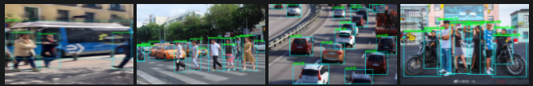
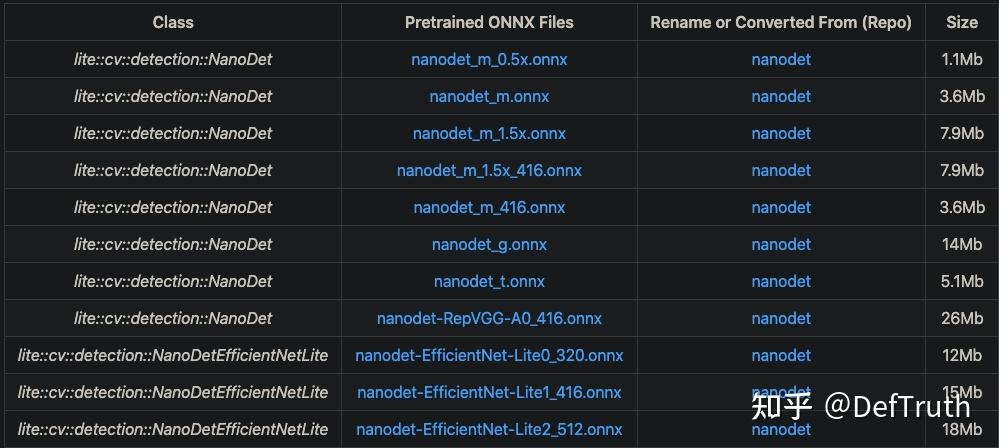
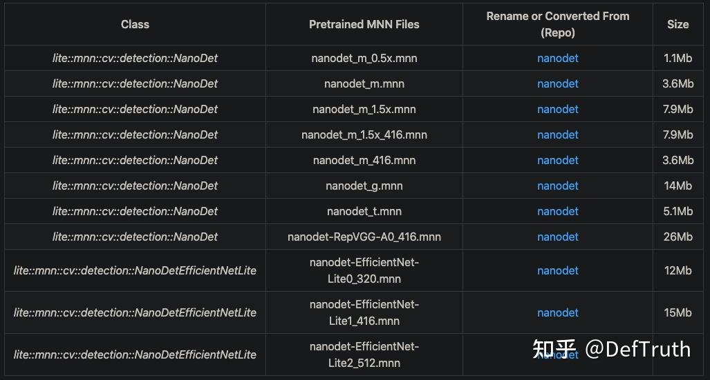
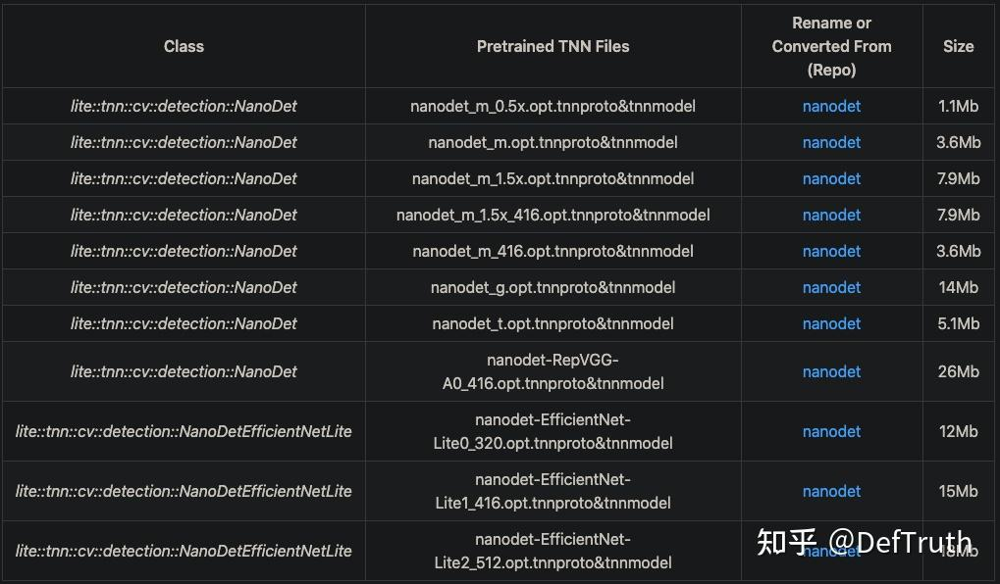
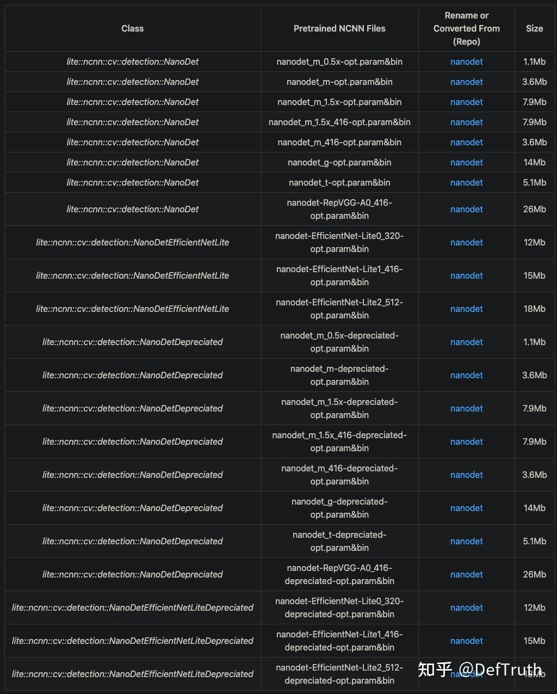
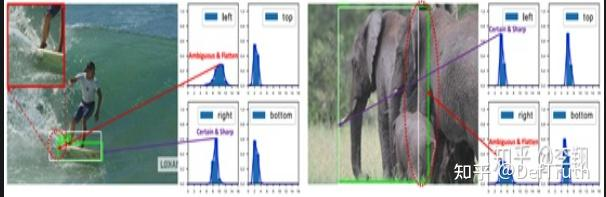
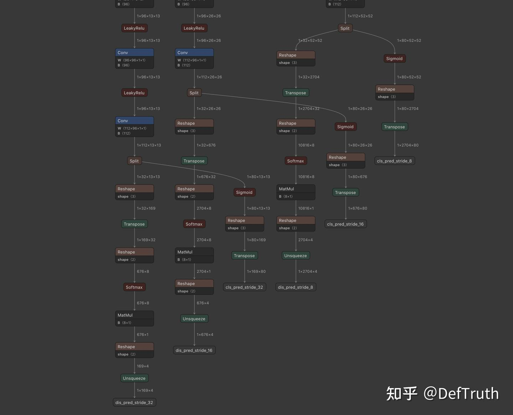
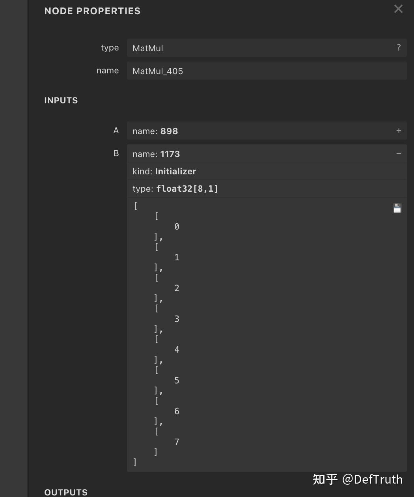
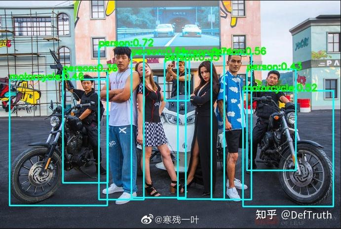

# NanoDet MNN/TNN/NCNN/ONNXRuntime C++ Engineering 기록

> 원문: https://zhuanlan.zhihu.com/p/443419387

## 1. 서문

Lite.AI.ToolKit C++ 도구 상자로 NanoDet 예제를 실행한다. ONNXRuntime, MNN, NCNN, TNN 네 version을 포함한다.



먼저 모든 example code는 다음 repository에 있다. Lite.AI.ToolKit 도구 상자에는 참고할 만한 C++ example이 몇 가지 들어 있다.

- nanodet.lite.ai.toolkit: NanoDet C++ test case code. ONNXRuntime, NCNN, MNN, TNN version을 포함한다. https://github.com/DefTruth/nanodet.lite.ai.toolkit
- Lite.AI.ToolKit: 즉시 사용할 수 있는 C++ AI model toolkit. 평소 새 algorithm을 학습할 때 만든 것이며 현재 80개 이상의 open-source model을 포함한다. https://github.com/DefTruth/lite.ai.toolkit

유용하다면 star로 지원할 수 있다.

### 2. C++ 버전 소스

NanoDet C++ version source는 ONNXRuntime, MNN, NCNN, TNN 네 version을 포함하며, `lite.ai.toolkit` 도구 상자에서 찾을 수 있다. 이 프로젝트는 주로 `lite.ai.toolkit` 도구 상자를 기반으로 NanoDet을 직접 사용해 object detection을 실행하는 방법을 소개한다.

설명이 필요한 부분이 있다. 이 프로젝트는 MacOS에서 빌드한 `liblite.ai.toolkit.v0.1.0.dylib`를 기반으로 구현했다. MacOS 사용자는 이 프로젝트에 포함된 `liblite.ai.toolkit.v0.1.0` dynamic library와 다른 dependency library를 바로 내려받아 사용할 수 있다. MacOS가 아닌 사용자는 `lite.ai.toolkit`에서 source를 내려받아 직접 빌드해야 한다. `lite.ai.toolkit` C++ 도구 상자는 현재 80개 이상의 인기 open-source model을 포함한다.

- nanodet.cpp
- nanodet.h
- mnn_nanodet.cpp
- mnn_nanodet.h
- tnn_nanodet.cpp
- tnn_nanodet.h
- ncnn_nanodet.cpp
- ncnn_nanodet.h

ONNXRuntime C++, MNN, TNN, NCNN version의 inference implementation은 모두 테스트를 통과했다.

## 3. 모델 파일

### 3.1 ONNX 모델 파일

제공한 링크에서 내려받을 수 있다. Baidu Drive code는 `8gin`이다. 또는 이 repository에서 직접 내려받을 수도 있다. 주의할 점은 C++ engineering 구현을 편하게 하기 위해 NanoDet 공식 `nanodet_head.py`와 `gfl_head.py` source를 일부 수정했다는 것이다. 직접 ONNX file을 변환하려면 내가 fork한 branch `DefTruth/nanodet`을 사용할 수 있다.



### 3.2 MNN 모델 파일

MNN 모델 파일 다운로드 주소다. Baidu Drive code는 `9v63`이다.



### 3.3 TNN 모델 파일

TNN 모델 파일 다운로드 주소다. Baidu Drive code는 `6o6k`이다.



### 3.4 NCNN 모델 파일

NCNN 모델 파일 다운로드 주소다. Baidu Drive code는 `sc7f`이다.



## 4. Source 수정

### 4.1 Internal 수정

`DefTruth/nanodet`에서는 `distribution_project` 부분의 operation도 ONNX로 export했다. 이를 위해 `Internal` 원래 구현을 수정해 ONNX operator와 호환되도록 했다. `Internal`의 전체 아이디어는 변하지 않는다. 수정한 부분은 `project` buffer registration이다. 원래 `project` registration code는 다음과 같다.

```python
self.register_buffer(
      "project", torch.linspace(0, self.reg_max, self.reg_max + 1)
 )
```

이 code에는 ONNX export 뒤 ONNXRuntime이 load하지 못하게 만드는 작은 문제가 두 가지 있다. 첫째, `torch.linspace`는 `torch.onnx.export`가 직접 지원하지 않아 export 뒤 error가 날 수 있다. 둘째, `project`가 명시적으로 2D matrix로 register되지 않고 1D vector로 register된다. 이 때문에 변환된 ONNX file load가 실패할 수 있다. tensor dimension이 align되지 않기 때문이다.

`Internal`의 `forward`에서는 `F.linear`를 사용한다.

```python
x = F.softmax(x.reshape(-1, self.reg_max + 1), dim=1)
x = F.linear(x, self.project.type_as(x)).reshape(-1, 4)
```

`F.linear` 문서를 보면 실제로는 두 matrix multiplication을 수행한다.

```python
def linear(input: Tensor, weight: Tensor, bias: Optional[Tensor] = None) -> Tensor:
    r"""
    Applies a linear transformation to the incoming data: :math:`y = xA^T + b`.

    This operator supports :ref:`TensorFloat32<tf32_on_ampere>`.

    Shape:

        - Input: :math:`(N, *, in\_features)` N is the batch size, `*` means any number of
          additional dimensions
        - Weight: :math:`(out\_features, in\_features)`
        - Bias: :math:`(out\_features)`
        - Output: :math:`(N, *, out\_features)`
    """
```

`Internal`의 `project`는 `linear`에 사용되는 parameter `Weight`이고 matrix 형태여야 한다. PyTorch에서는 1D vector로 곱해도 error가 나지 않는다. 이는 주로 PyTorch의 automatic broadcast 기능 덕분이다. PyTorch가 dimension을 자동으로 맞춘다. 하지만 이런 broadcast behavior는 ONNX에서 잘 지원되지 않고, ONNX file로 변환한 뒤 문제가 생긴다. 따라서 가장 좋은 방식은 `Internal`을 수정하는 것이다. 학습 가능한 parameter가 없는 operation이므로 직접 바꿔도 된다.

- `torch.linspace`를 `torch.arange`로 대체한다. `torch.arange`는 `torch.onnx.export`가 직접 지원한다.
- `project`를 buffer로 register할 때 implicit dimension 설정이 아니라 explicit dimension 설정을 사용한다.

수정한 buffer registration code는 다음과 같다.

```python
self.register_buffer(
    "project",
    torch.arange(0, self.reg_max + 1).reshape(1, self.reg_max + 1)
)
```

### 4.2 distribution_project export

`distribution_project`가 무엇인지는 NanoDet 저자의 상세 해석과 "Generalized Focal Loss" 설명 글을 보는 것이 좋다. 간단히 말하면 일반 object detection은 bbox가 지정된 길이에 대해 갖는 offset 또는 relative quantity를 직접 regression한다. 하지만 GFL과 NanoDet은 이렇게 하지 않는다. 복잡한 장면에서는 bounding box 표현에 강한 uncertainty가 있는데, 기존 box regression은 본질적으로 매우 단일한 Dirac distribution만 model한다. GFL 저자는 더 general한 distribution으로 bounding box representation을 model하고자 했다.

Engineering 구현은 bbox size가 `(0,1,2,...,n=7|8|9|...)` 위에서 갖는 probability distribution을 prediction한 뒤, summation formula로 최종 result를 얻는 방식이다. 아래 그림처럼 물에 흐려진 skateboard나 심하게 occluded된 elephant 같은 경우를 생각하면 된다.




NanoDet 원래 구현에서는 ONNX export 시 `distribution_project` 부분을 export하지 않는다. 원래 code는 다음과 같다.

```python
# Original nanodet_head.py ONNX export part
if torch.onnx.is_in_onnx_export():
  cls_score = (
    torch.sigmoid(cls_score)
      .reshape(1, self.num_classes, -1)
      .permute(0, 2, 1)
  )
  bbox_pred = bbox_pred.reshape(1, (self.reg_max + 1) * 4, -1).permute(
    0, 2, 1
  )
return cls_score, bbox_pred
```

또 원래 `Internal` implementation을 그대로 사용하면 export해도 사용할 수 없다. 그러면 C++ 쪽에서 Softmax와 MatMul logic을 직접 구현해야 한다. 이런 작업은 번거롭다. Python으로 처리할 수 있는 일은 C++로 옮기지 않는 편이 낫다.

`Internal`을 수정한 뒤에는 이제 `distribution_project` operation을 성공적으로 export할 수 있다. 이렇게 하면 inference engine 자체가 구현한 Softmax와 MatMul operator를 바로 사용할 수 있다. 수정 후 code는 다음과 같다.

```python
if torch.onnx.is_in_onnx_export():
  cls_score = (
    torch.sigmoid(cls_score)
      .reshape(1, self.num_classes, -1)
      .permute(0, 2, 1)
  )
  bbox_pred = bbox_pred.reshape(1, (self.reg_max + 1) * 4, -1).permute(
    0, 2, 1
  )
  # Only this line needs to be added.
  bbox_pred = self.distribution_project(bbox_pred).unsqueeze(0)
return cls_score, bbox_pred
```

그러면 export된 `bbox_pred` dimension은 `(1,?=1600|400|100|...,4)`가 된다. 여기서 `?`는 box 수를 나타내고, `4`는 `(l,t,r,b)` 즉 box의 네 edge가 center로부터 떨어진 distance, left, top, right, bottom을 뜻한다. export된 ONNX model file structure는 다음과 같다.



`distribution_project` operation이 Softmax와 MatMul 두 operator로 변환된 것을 볼 수 있다. `Internal`에 register된 `project`도 constant로 MatMul operator input이 된다.



## 5. Interface 문서

`lite.ai.toolkit`에서 NanoDet 구현 class는 다음과 같다.

```cpp
class LITE_EXPORTS lite::cv::detection::NanoDet;
class LITE_EXPORTS lite::cv::detection::NanoDetEfficientNetLite;
class LITE_EXPORTS lite::mnn::cv::detection::NanoDet;
class LITE_EXPORTS lite::mnn::cv::detection::NanoDetEfficientNetLite;
class LITE_EXPORTS lite::tnn::cv::detection::NanoDet;
class LITE_EXPORTS lite::tnn::cv::detection::NanoDetEfficientNetLite;
class LITE_EXPORTS lite::ncnn::cv::detection::NanoDet;
class LITE_EXPORTS lite::ncnn::cv::detection::NanoDetEfficientNetLite;

```

이 type은 현재 object detection을 수행하는 public interface `detect` 하나를 포함한다. EfficientNetLite version NanoDet의 preprocessing은 다른 version과 일치하지 않는다. Lite.AI.ToolKit의 initialization style을 일관되게 유지하기 위해 여기서는 두 class로 NanoDet C++ wrapper를 각각 구현했다.

```cpp
public:
    /**
     * @param mat cv::Mat BGR format
     * @param detected_boxes vector of Boxf to catch detected boxes.
     * @param score_threshold default 0.45f, only keep the result which >= score_threshold.
     * @param iou_threshold default 0.3f, iou threshold for NMS.
     * @param topk default 100, maximum output boxes after NMS.
     * @param nms_type the method.
     */
    void detect(const cv::Mat &mat, std::vector<types::Boxf> &detected_boxes,
                float score_threshold = 0.45f, float iou_threshold = 0.3f,
                unsigned int topk = 100, unsigned int nms_type = NMS::OFFSET);

```

`detect` interface의 입력 parameter 설명:

- `mat`: `cv::Mat` type, BGR format.
- `detected_boxes`: `Boxf` vector. 검출된 box를 포함하며, `Boxf`에는 `x1`, `y1`, `x2`, `y2`, `label`, `score` 등의 member가 있다.
- `score_threshold`: classification score, 또는 quality score threshold. 기본값은 0.45이며 이 threshold보다 작은 box는 버린다.
- `iou_threshold`: NMS의 IoU threshold. 기본값은 0.3이다.
- `topk`: 기본값은 100이며, detection result 중 상위 k개만 유지한다.
- `nms_type`: NMS algorithm type. 기본값은 class별 NMS다.

## 6. 사용 예시

여기서는 `nanodet_m.onnx` version model을 사용해 테스트한다. 다른 version model도 사용해 볼 수 있다.

### 6.1 ONNXRuntime 버전

```cpp
#include "lite/lite.h"

static void test_nanodet()
{
    std::string onnx_path = "../hub/onnx/cv/nanodet_m.onnx";
    std::string test_img_path = "../resources/9.jpg";
    std::string save_img_path = "../logs/9.jpg";

    auto *nanodet = new lite::cv::detection::NanoDet(onnx_path);

    std::vector<lite::types::Boxf> detected_boxes;
    cv::Mat img_bgr = cv::imread(test_img_path);
    nanodet->detect(img_bgr, detected_boxes, 0.3f);

    lite::utils::draw_boxes_inplace(img_bgr, detected_boxes);

    cv::imwrite(save_img_path, img_bgr);

    std::cout << "Detected Boxes Num: " << detected_boxes.size() << std::endl;

    delete nanodet;

}

```

### 6.2 MNN 버전

```cpp
#include "lite/lite.h"

static void test_nanodet()
{
#ifdef ENABLE_MNN
    std::string mnn_path = "../hub/mnn/cv/nanodet_m.mnn";
    std::string test_img_path = "../examples/lite/resources/9.jpg";
    std::string save_img_path = "../logs/9_mnn_2.jpg";

    // 3. Test Specific Engine MNN
    lite::mnn::cv::detection::NanoDet *nanodet =
    new lite::mnn::cv::detection::NanoDet(mnn_path);

    std::vector<lite::types::Boxf> detected_boxes;
    cv::Mat img_bgr = cv::imread(test_img_path);
    nanodet->detect(img_bgr, detected_boxes);

    lite::utils::draw_boxes_inplace(img_bgr, detected_boxes);
    cv::imwrite(save_img_path, img_bgr);

    std::cout << "MNN Version Detected Boxes Num: " << detected_boxes.size() << std::endl;

    delete nanodet;
#endif
}

```

### 6.3 TNN 버전

```cpp
#include "lite/lite.h"

static void test_nanodet()
{
#ifdef ENABLE_TNN
    std::string proto_path = "../hub/tnn/cv/nanodet_m.opt.tnnproto";
    std::string model_path = "../hub/tnn/cv/nanodet_m.opt.tnnmodel";
    std::string test_img_path = "../examples/lite/resources/9.jpg";
    std::string save_img_path = "../logs/9_tnn_2.jpg";

    // 4. Test Specific Engine TNN
    lite::tnn::cv::detection::NanoDet *nanodet =
    new lite::tnn::cv::detection::NanoDet(proto_path, model_path);

    std::vector<lite::types::Boxf> detected_boxes;
    cv::Mat img_bgr = cv::imread(test_img_path);
    nanodet->detect(img_bgr, detected_boxes);

    lite::utils::draw_boxes_inplace(img_bgr, detected_boxes);
    cv::imwrite(save_img_path, img_bgr);

    std::cout << "TNN Version Detected Boxes Num: " << detected_boxes.size() << std::endl;

    delete nanodet;
#endif
}

```

### 6.4 NCNN 버전

```cpp
#include "lite/lite.h"

static void test_nanodet()
{
#ifdef ENABLE_NCNN
    std::string param_path = "../hub/ncnn/cv/nanodet_m-opt.param";
    std::string bin_path = "../hub/ncnn/cv/nanodet_m-opt.bin";
    std::string test_img_path = "../examples/lite/resources/9.jpg";
    std::string save_img_path = "../logs/9_ncnn_2.jpg";

    // 4. Test Specific Engine NCNN
    lite::ncnn::cv::detection::NanoDet *nanodet =
    new lite::ncnn::cv::detection::NanoDet(
    param_path, bin_path,1, 320, 320);

    std::vector<lite::types::Boxf> detected_boxes;
    cv::Mat img_bgr = cv::imread(test_img_path);
    nanodet->detect(img_bgr, detected_boxes);

    lite::utils::draw_boxes_inplace(img_bgr, detected_boxes);
    cv::imwrite(save_img_path, img_bgr);

    std::cout << "NCNN Version Detected Boxes Num: " << detected_boxes.size() << std::endl;

    delete nanodet;
#endif
}

```

출력 결과는 다음과 같다.


## 7. 빌드 및 실행

MacOS에서는 이 프로젝트를 바로 빌드하고 실행할 수 있으며 다른 dependency library를 내려받을 필요가 없다. 다른 system에서는 먼저 `lite.ai.toolkit`에서 source를 내려받아 `lite.ai.toolkit.v0.1.0` dynamic library를 빌드해야 한다.

```bash
git clone --depth=1 https://github.com/DefTruth/nanodet.lite.ai.toolkit.git
cd nanodet.lite.ai.toolkit 
sh ./build.sh
```

CMakeLists.txt 설정:

```cmake
cmake_minimum_required(VERSION 3.17)
project(nanodet.lite.ai.toolkit)

set(CMAKE_CXX_STANDARD 11)

# setting up lite.ai.toolkit
set(LITE_AI_DIR ${CMAKE_SOURCE_DIR}/lite.ai.toolkit)
set(LITE_AI_INCLUDE_DIR ${LITE_AI_DIR}/include)
set(LITE_AI_LIBRARY_DIR ${LITE_AI_DIR}/lib)
include_directories(${LITE_AI_INCLUDE_DIR})
link_directories(${LITE_AI_LIBRARY_DIR})

set(OpenCV_LIBS
        opencv_highgui
        opencv_core
        opencv_imgcodecs
        opencv_imgproc
        opencv_video
        opencv_videoio
        )
# add your executable
set(EXECUTABLE_OUTPUT_PATH ${CMAKE_SOURCE_DIR}/examples/build)

add_executable(lite_nanodet examples/test_lite_nanodet.cpp)
target_link_libraries(lite_nanodet
        lite.ai.toolkit
        onnxruntime
        MNN  # need, if built lite.ai.toolkit with ENABLE_MNN=ON,  default OFF
        ncnn # need, if built lite.ai.toolkit with ENABLE_NCNN=ON, default OFF
        TNN  # need, if built lite.ai.toolkit with ENABLE_TNN=ON,  default OFF
        ${OpenCV_LIBS})  # link lite.ai.toolkit & other libs.
```

building 및 testing information:

```text
--- Build files have been written to: /Users/xxx/Desktop/xxx/nanodet.lite.ai.toolkit/examples/build
[ 50%] Building CXX object CMakeFiles/lite_nanodet.dir/examples/test_lite_nanodet.cpp.o
[100%] Linking CXX executable lite_nanodet
[100%] Built target lite_nanodet
Testing Start ...
LITEORT_DEBUG LogId: ../hub/onnx/cv/nanodet_m.onnx
=============== Input-Dims ==============
input_node_dims: 1
input_node_dims: 3
input_node_dims: 320
input_node_dims: 320
=============== Output-Dims ==============
Output: 0 Name: cls_pred_stride_8 Dim: 0 :1
Output: 0 Name: cls_pred_stride_8 Dim: 1 :1600
Output: 0 Name: cls_pred_stride_8 Dim: 2 :80
Output: 1 Name: cls_pred_stride_16 Dim: 0 :1
Output: 1 Name: cls_pred_stride_16 Dim: 1 :400
Output: 1 Name: cls_pred_stride_16 Dim: 2 :80
Output: 2 Name: cls_pred_stride_32 Dim: 0 :1
Output: 2 Name: cls_pred_stride_32 Dim: 1 :100
Output: 2 Name: cls_pred_stride_32 Dim: 2 :80
Output: 3 Name: dis_pred_stride_8 Dim: 0 :1
Output: 3 Name: dis_pred_stride_8 Dim: 1 :1600
Output: 3 Name: dis_pred_stride_8 Dim: 2 :4
Output: 4 Name: dis_pred_stride_16 Dim: 0 :1
Output: 4 Name: dis_pred_stride_16 Dim: 1 :400
Output: 4 Name: dis_pred_stride_16 Dim: 2 :4
Output: 5 Name: dis_pred_stride_32 Dim: 0 :1
Output: 5 Name: dis_pred_stride_32 Dim: 1 :100
Output: 5 Name: dis_pred_stride_32 Dim: 2 :4
generate_bboxes num: 50
Detected Boxes Num: 9
Testing Successful !
```



이전 글 모음은 계속 업데이트한다. 팔로우하면 된다.
