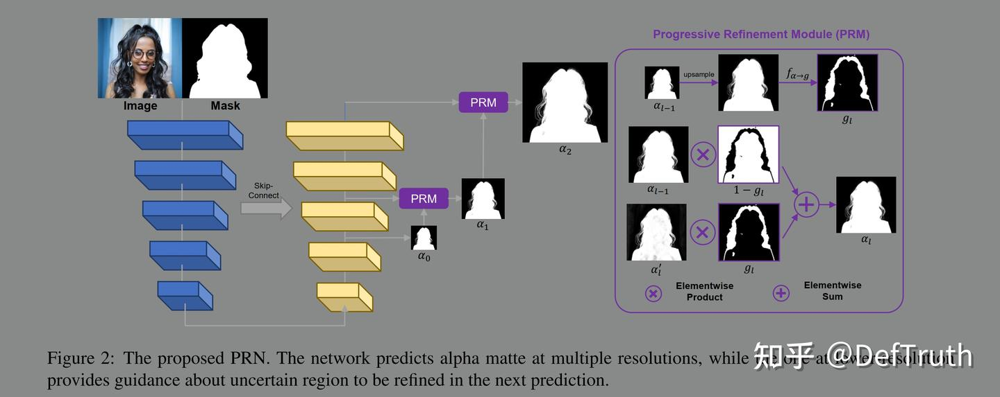
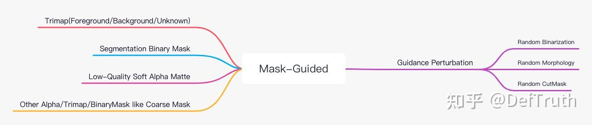
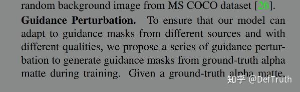
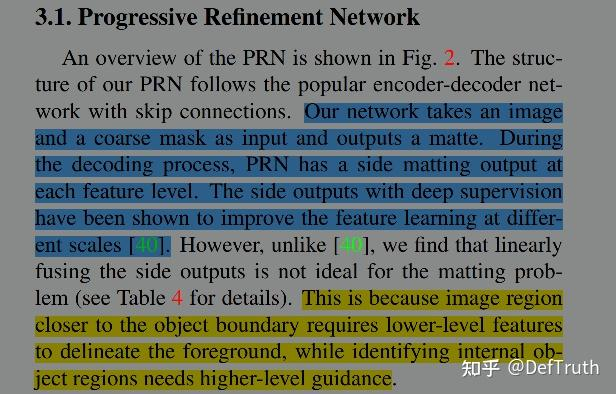
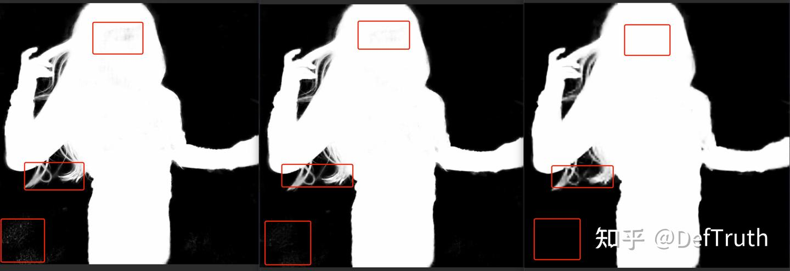
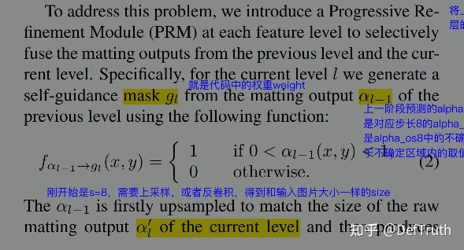
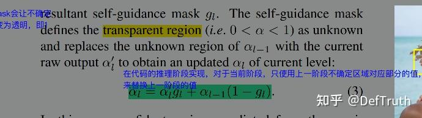
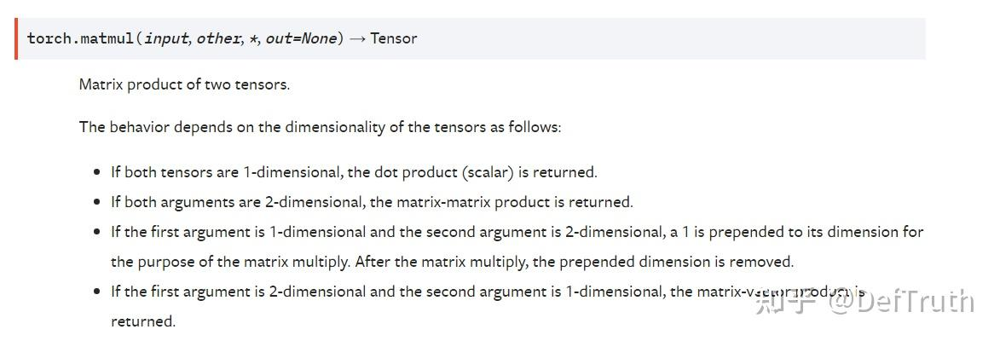
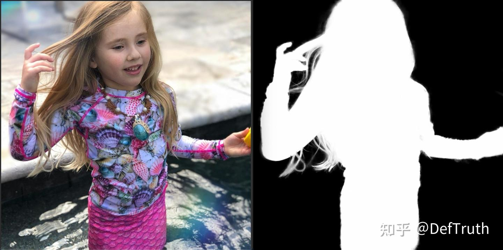

# [추론 배포] MGMatting MNN/TNN/ONNXRuntime C++ 이식 기록

> 원문: https://zhuanlan.zhihu.com/p/442949027

### 이 글은 꽤 길다. 알고리즘 설명과 C++ 엔지니어링 구현을 함께 다룬다. 이 글을 통해 다음 요점을 확인할 수 있다.

- MGMatting 논문 해석
- Mask Guided 이해
- PRM 모듈 이해
- ONNX 모델 파일 변환, 동적 차원
- ONNXRuntime Python 추론 구현
- MNN/TNN 모델 파일 변환
- ONNXRuntime/MNN/TNN C++ 추론 구현
- 동적 차원 추론(32 정렬)
- PRM 모듈 C++ 구현(불확실 영역 판정 및 dilate 팽창)
- 최대 연결 영역을 구해 노이즈를 제거하는 C++ 구현(Matting 또는 segmentation에서 자주 쓰는 후처리 전략)

### 서문

한동안 글을 갱신하지 않았다. 최근에는 TNN, MNN, NCNN, ONNXRuntime 사용과 관련된 일련의 노트를 정리하려 한다. 기억력은 기록을 이기지 못한다. 나중에 같은 구덩이에 빠졌을 때 빠르게 기어 나오기 위한 용도다. 현재 `Lite.AI.ToolKit`에는 C++ 추론 예제가 80개 넘게 있고, 라이브러리 형태로 빌드해 사용할 수 있다. 관심 있으면 살펴보면 된다.

오픈소스 프로젝트 설명:

Github Lite.AI.ToolKit

A lite C++ toolkit of awesome AI models.

바로 사용할 수 있는 C++ AI 모델 도구상자다. 새 알고리즘을 공부할 때 곁들여 만든 것이고, 현재 80개 이상의 인기 오픈소스 모델을 포함한다. 어느새 star가 거의 800개가 됐다. star와 issue는 환영한다.

https://github.com/DefTruth/lite.ai.toolkit

최근 관련 글을 차례로 갱신할 예정이다.

### 1. MGMatting 논문 해석

얼마 전 Adobe Research와 Johns Hopkins University가 《MGMatting: Mask Guided Matting via Progressive Refinement Network》의 코드와 모델을 공개했다. 공식 홈페이지의 Demo를 보니 효과가 괜찮아 보여 원문 논문을 찾아 읽었다. 여기서는 개인적인 이해를 간단히 기록한다. 이해가 틀린 부분이 있을 수 있다. 뒤에서는 일부 소스 코드와 함께 추가로 설명한다.



이 논문 제목을 보면 몇 가지 의문이 생긴다.

- "Mask Guided"는 무슨 뜻인가? 여기서 Mask는 trimap을 말하는가, 아니면 semantic segmentation으로 얻은 segmentation mask를 말하는가? 여기서 Mask Guided와 일반적인 trimap 기반 또는 segmentation mask 기반 Matting 알고리즘은 무엇이 다른가?
- "Progressive Refinement Network"는 구체적으로 어떤 모듈인가? 이름만 보면 단계적으로 정교하게 refine하는 연산처럼 보인다.

### Mask Guided 이해



Trimap-Based 방법은 foreground, background, unknown region을 포함하는 trimap을 모델 입력의 guide로 사용해 더 세밀한 alpha matte 예측을 얻는다. 그러나 trimap은 일반적으로 얻기 쉽지 않다. 이후에는 점차 trimap에 의존하지 않는 방법이 등장했다. segmentation binary mask나 배경 이미지(Background Matting V1/V2)를 사용해 alpha matte 예측을 안내하려는 시도도 있었다. 이런 방법은 Trimap-Free지만 Guidance-Free는 아니다. 여전히 보조 입력이 필요하다.

물론 최근에는 추가 입력에 전혀 의존하지 않는 Guidance-Free Matting 방법도 이어서 등장했다. MODNet이 한 예이고 효과도 괜찮다. MGMatting은 Guidance-Based 방법에 속하지만, 특이한 점은 특정 Guidance에 의존하지 않는다는 것이다. Guidance는 Trimap일 수도 있고, Segmentation Binary Mask일 수도 있으며, 저품질 Alpha Matte일 수도 있다. Guidance-Based 방법의 범용성을 조금 끌어올린 셈이다. 더 이상 특정 종류의 Guidance에 묶이지 않는다.



그렇다면 어떻게 구현했는가? 사실 단순하다. 데이터 증강을 사용한다. 주의할 점은 입력 Guidance, 예를 들어 Trimap이나 Binary Mask 자체를 증강하는 것이 아니라 Ground Truth Alpha를 증강한다는 것이다. Guidance Perturbation으로 Ground Truth Alpha에 교란을 주고, 다양한 Guidance를 생성해 서로 다른 보조 정보를 모사한다. 예를 들어 Trimap, Binary Mask, Low Quality Soft Alpha Matte를 만든다.

논문에서 언급하는 Guidance Perturbation은 세 가지 작업으로 구성된다. Random Binarization(무작위 이진화), Random Morphology(무작위 형태학 연산, erosion/dilation/open/close), Random CutMask(서로 다른 guidance 입력 모사)다. 세부 작업이 궁금하면 논문의 실험 부분을 보면 된다.

### PRM 모듈 이해

Progressive Refinement Module(PRM)은 MGMatting의 핵심 혁신점 중 하나다. 여기서는 직관적인 이해를 적는다. MGMatting의 모델 구조에는 다중 계층, 단계적 정교화 모듈인 PRM이 설계되어 있다. PRM은 지정된 downsample stride에서 대응하는 Alpha Matte를 각각 예측한다. 예를 들어 `s=8`, `s=4`, `s=1`에서 모두 Alpha Matte를 예측하고, `s=8`과 `s=4`의 Alpha Matte를 각각 `s=1` Alpha Matte와 같은 크기로 resize한다. 이는 소스 코드 구현 방식이다.

저자는 이런 다중 계층 예측 출력이 모델이 더 효과적인 multi-scale feature를 추출하는 데 도움이 된다고 본다. 생각해 보면 그럴 수 있다. 각 stride에서 예측한 alpha가 모두 실제 alpha로 supervision을 받기 때문이다.



동시에 저자는 서로 다른 stride의 예측을 단순 선형 융합하는 것은 적절하지 않다고 보았다. 서로 다른 stride의 feature가 보는 정보가 다르고, 따라서 예측 결과도 일치하지 않기 때문이다. 예를 들어 stride가 8일 때 feature-map은 더 추상적인 semantic 정보를 얻지만, 일부 detail 정보는 잃는다.

일반적으로 convolutional neural network의 얕은 layer는 더 많은 detail 정보를 보존한다. 이 정보는 edge 위치를 결정하는 데 유리하다. 반대로 깊은 layer의 정보는 더 추상적이고, 분류처럼 세부 위치를 강하게 보지 않아도 되는 작업에 유리하다. stride 8 feature는 detail 처리에서 부족할 수밖에 없다. 그러나 장점도 있다. 어떤 큰 덩어리가 foreground이고 어떤 큰 덩어리가 background인지 더 잘 판단할 수 있다. 더 깊은 semantic 정보와 더 큰 receptive field를 사용해 덩어리 단위로 foreground/background를 판단하므로 noise 수를 줄이는 데 유리하다.

여기서는 MGMatting의 `alpha_os1`과 `alpha_os4/8`을 직접 비교해 볼 수 있다. 왼쪽 아래 박스 영역을 보면 `alpha_os1`만 사용했을 때 noise가 많이 생긴다. `alpha_os4`는 noise가 훨씬 적고, `alpha_os8`은 background 영역에 흩어진 noise가 거의 생기지 않는다. 모델이 더 깊은 추상 정보를 사용해 `alpha_os1`의 noise 영역을 background로 성공적으로 나눈 것이다. 반대로 팔꿈치 위치의 박스를 보면 `alpha_os4`와 `alpha_os1`의 alpha 예측값은 `alpha_os8`보다 detail을 더 잘 복원한다. 이 논리에서 보면 `alpha_os1`과 `alpha_os4/8`은 서로의 장점을 보완하는 관계다.



왼쪽부터 각각 `alpha_os1(s=1)`, `alpha_os4(s=4)`, `alpha_os8(s=8)`이다.

이런 상황을 기반으로 PRM은 decoder에서 각 단계가 예측한 alpha의 불확실 영역을 다음 단계의 더 정밀한 예측으로 대체한다. 논문은 두 개의 수식을 제시한다. 이해하기 어렵지 않다.



여기서 함수 `f(x)`는 특별한 것이 아니라 기호에 가깝다. 신경 쓰지 않아도 된다. 소스 구현에서는 convolution 같은 학습 가능한 parameter를 가진 연산을 사용하지 않는다. 핵심은 `(0, 1)` 사이의 불확실 영역을 찾아내고, 그 weight를 1로 설정하는 것이다. 이것이 수식의 `g`이고 소스 코드의 `weight`다.

```python
def get_unknown_tensor_from_pred(pred, rand_width=30, train_mode=True):
    ### pred: N, 1 ,H, W
    N, C, H, W = pred.shape

    pred = pred.data.cpu().numpy()
    uncertain_area = np.ones_like(pred, dtype=np.uint8)
    uncertain_area[pred < 1.0 / 255.0] = 0
    uncertain_area[pred > 1 - 1.0 / 255.0] = 0

    for n in range(N):
        uncertain_area_ = uncertain_area[n, 0, :, :]  # H, W
        if train_mode:
            width = np.random.randint(1, rand_width)
        else:
            width = rand_width // 2
        uncertain_area_ = cv2.dilate(uncertain_area_, Kernels[width])  # dilation
        uncertain_area[n, 0, :, :] = uncertain_area_

    weight = np.zeros_like(uncertain_area)
    weight[uncertain_area == 1] = 1
    weight = torch.from_numpy(weight).cuda() # change to .cpu() when GPU is not used

    return weight
```

이 영역에서 예측된 alpha 값은 더 작은 stride에서 예측된 alpha 값으로 교체되어야 한다. 예를 들어 `alpha_os8(s=8)`의 어떤 불확실 영역은 보통 사람 edge 주변에 나타난다. 깊은 feature는 edge 예측이 충분히 정확하지 않아 edge의 불확실 영역이 더 커진다. `alpha_os8`의 이 불확실 영역은 `alpha_os4`의 대응 영역이 예측한 alpha 값으로 교체된다. `alpha_os4`는 `s=4` stride의 feature로 예측되므로 detail 정보가 더 많고, 일반적으로 edge 예측도 더 정확하다.



같은 원리로 `s=1`과 `s=4`에서 예측한 alpha도 이 방법으로 단계적으로 refine한다. 최종적으로 noise를 제거하고 edge detail 정확도를 높인다.

```python
def single_inference(model, image_dict, post_process=False):
    with torch.no_grad():
        image, mask = image_dict['image'], image_dict['mask']
        alpha_shape = image_dict['alpha_shape']
        image = image.cuda()
        mask = mask.cuda()
        pred = model(image, mask)
        alpha_pred_os1, alpha_pred_os4, alpha_pred_os8 = pred['alpha_os1'], pred['alpha_os4'], pred['alpha_os8']

        ### refinement
        alpha_pred = alpha_pred_os8.clone().detach()
        weight_os4 = utils.get_unknown_tensor_from_pred(alpha_pred, rand_width=CONFIG.model.self_refine_width1,
                                                        train_mode=False)
        alpha_pred[weight_os4 > 0] = alpha_pred_os4[weight_os4 > 0]
        weight_os1 = utils.get_unknown_tensor_from_pred(alpha_pred, rand_width=CONFIG.model.self_refine_width2,
                                                        train_mode=False)
        alpha_pred[weight_os1 > 0] = alpha_pred_os1[weight_os1 > 0]

        h, w = alpha_shape
        alpha_pred = alpha_pred[0, 0, ...].data.cpu().numpy()
        if post_process:
            alpha_pred = utils.postprocess(alpha_pred)
        alpha_pred = alpha_pred * 255
        alpha_pred = alpha_pred.astype(np.uint8)
        alpha_pred = alpha_pred[32:h + 32, 32:w + 32]

        return alpha_pred
```

### 전경 색상 예측

아쉽게도 공식 공개 모델에는 foreground prediction 모델이 포함되어 있지 않다. 논문에서는 foreground prediction을 별도의 다른 모델로 처리한다고 언급한다. alpha matte와 함께 한 모델에서 예측하지 않는다. MGMatting은 이런 decoupling 방식을 사용한다. 실험에서 두 작업을 한데 묶으면 오히려 alpha matte 예측 품질이 낮아진다는 결과를 얻었다.

특히 foreground color prediction에 대해서 MGMatting은 RAB(Random Alpha Blending) 방법을 제안한다. 현재 자주 쓰이는 dataset에서 foreground annotation이 부정확한 문제를 완화하기 위한 방법이다.

이제 추론 부분으로 넘어간다. 새 알고리즘을 공부할 때 보통 이 모델을 C++로 한 번 추론해 본다. 그러면 더 많은 세부 사항을 알 수 있다. 예를 들어 이 모델에 추론 엔진이 지원하지 않는 이상한 op가 있는지, C++에서 재현하기 어려운 전처리/후처리 작업이 있는지 확인할 수 있다. 모르는 third-party library를 끼워 넣은 경우도 여기서 드러난다. 이렇게 해두면 이 모델을 참고해 학습이나 배포를 진행할 때 밟을 수 있는 문제를 줄일 수 있다. 엔지니어링 팀과 모델 변환 문제로 계속 맞붙을 일도 줄어든다. 이 부분은 길게 말하지 않고, 문제를 던지고 해결하는 방식으로 설명한다.

### 2. ONNX 모델 파일 변환(동적 차원)

ONNX 모델 변환 코드는 내가 fork한 branch에 이미 갱신해 두었다. 해당 코드를 참고하면 된다.

### 지원하지 않는 연산자 수정

MGMatting 소스의 `code-base/networks/ops.py`에서 `SpectralNorm`의 원래 구현은 `torch.onnx.export`가 지원하지 않는 연산자를 사용한다. 이 때문에 ONNX 파일을 바로 export할 수 없다.

```python
          # in _update_u_v
          for _ in range(self.power_iterations):
                v.data = l2normalize(torch.mv(torch.t(w.view(height, -1).data), u.data))
                u.data = l2normalize(torch.mv(w.view(height, -1).data, v.data))
           # in _update_u_v and _noupdate_u_v
          sigma = u.dot(w.view(height, -1).mv(v))
```

Tensor에서 직접 호출하는 `dot`(dot product)과 `mv`(matrix x vector)는 지원되지 않는다. `torch.matmul`로 대체할 수 있다.



특히 입력이 모두 1차원 vector일 때는 dot 연산과 동등하다. 수정 후 `SpectralNorm` 코드는 다음과 같다.

```python
class SpectralNorm(nn.Module):
    """
    Based on https://github.com/heykeetae/Self-Attention-GAN/blob/master/spectral.py
    and add _noupdate_u_v() for evaluation
    """
    def __init__(self, module, name='weight', power_iterations=1):
       # ...

    def _update_u_v(self):
        # ...
        height = w.data.shape[0]
        # Replace with ONNX-export-compatible operators
        if torch.onnx.is_in_onnx_export():
            for _ in range(self.power_iterations):
                v.data = l2normalize(torch.matmul(torch.t(w.view(height, -1).data), u.data.view(-1, 1)).view(-1))
                u.data = l2normalize(torch.matmul(w.view(height, -1).data, v.data.view(-1, 1)).view(-1))
        else:
            for _ in range(self.power_iterations):
                v.data = l2normalize(torch.mv(torch.t(w.view(height, -1).data), u.data))
                u.data = l2normalize(torch.mv(w.view(height, -1).data, v.data))
        # Replace with ONNX-export-compatible operators
        if torch.onnx.is_in_onnx_export():
            wv = torch.matmul(w.view(height, -1), v.data.view(-1, 1)).view(-1)
            sigma = torch.sum(torch.matmul(u, wv))
        else:
            sigma = u.dot(w.view(height, -1).mv(v))
        setattr(self.module, self.name, w / sigma.expand_as(w))

    def _noupdate_u_v(self):
        # ...
        height = w.data.shape[0]
        # Replace with ONNX-export-compatible operators
        if torch.onnx.is_in_onnx_export():
            wv = torch.matmul(w.view(height, -1), v.data.view(-1, 1)).view(-1)
            sigma = torch.sum(torch.matmul(u, wv))
        else:
            sigma = u.dot(w.view(height, -1).mv(v))
        setattr(self.module, self.name, w / sigma.expand_as(w))
    # ...
```

동시에 ONNX를 정상적으로 export하려면 decoder의 `res_shortcut_dec.py`도 일부 수정해야 한다.

```python
class ResShortCut_D_Dec(ResNet_D_Dec):

    def __init__(self, block, layers, norm_layer=None, large_kernel=False, late_downsample=False):
        super(ResShortCut_D_Dec, self).__init__(block, layers, norm_layer, large_kernel,
                                                late_downsample=late_downsample)

    def forward(self, x, mid_fea):
        ret = {}
        fea1, fea2, fea3, fea4, fea5 = mid_fea['shortcut']
        x = self.layer1(x) + fea5
        x = self.layer2(x) + fea4
        x_os8 = self.refine_OS8(x)

        x = self.layer3(x) + fea3
        x_os4 = self.refine_OS4(x)

        x = self.layer4(x) + fea2
        x = self.conv1(x)
        x = self.bn1(x)
        x = self.leaky_relu(x) + fea1
        x_os1 = self.refine_OS1(x)

        x_os4 = F.interpolate(x_os4, scale_factor=4.0, mode='bilinear', align_corners=False)
        x_os8 = F.interpolate(x_os8, scale_factor=8.0, mode='bilinear', align_corners=False)

        x_os1 = (torch.tanh(x_os1) + 1.0) / 2.0
        x_os4 = (torch.tanh(x_os4) + 1.0) / 2.0
        x_os8 = (torch.tanh(x_os8) + 1.0) / 2.0
        # Compatible with ONNX export
        if torch.onnx.is_in_onnx_export():
            return x_os1, x_os4, x_os8
        else:
            ret['alpha_os1'] = x_os1
            ret['alpha_os4'] = x_os4
            ret['alpha_os8'] = x_os8
            return ret
```

### ONNX 파일 export

수정을 거치면 더 이상 호환되지 않는 연산자는 없다. 다음 `export_onnx.py`를 사용해 ONNX 모델 파일을 export할 수 있고, 동적 차원 추론도 지원한다.

- `export_onnx.py`

```python
import toml
import argparse
import torch
import utils
import networks
from utils import CONFIG

if __name__ == '__main__':
    import onnx
    import onnxruntime as ort
    from onnxsim import simplify

    print('Torch Version: ', torch.__version__, "ONNX Version: ", onnx.__version__)

    parser = argparse.ArgumentParser()
    parser.add_argument('--config', type=str, default='./config/MGMatting-DIM-100k.toml')
    parser.add_argument('--checkpoint', type=str, default='./checkpoints/MGMatting-DIM-100k/latest_model.pth',
                        help="path of checkpoint")
    parser.add_argument('--output_path', type=str, default='./checkpoints/MGMatting-DIM-100k/latest_model.onnx',
                        help="output path")
    parser.add_argument("--dynamic", action="store_true", help="export ONNX with dynamic shape")
    parser.add_argument("--simplify", action="store_true", help="export ONNX with simplify")
    # Parse configuration
    args = parser.parse_args()
    print(args)
    with open(args.config) as f:
        utils.load_config(toml.load(f))

    # Check if toml config file is loaded
    if CONFIG.is_default:
        raise ValueError("No .toml config loaded.")

    # build model
    model = networks.get_generator(encoder=CONFIG.model.arch.encoder, decoder=CONFIG.model.arch.decoder)
    model.cpu()
    print("Generate Model Done.")

    # load checkpoint
    checkpoint = torch.load(args.checkpoint, map_location=torch.device('cpu'))
    model.load_state_dict(utils.remove_prefix_state_dict(checkpoint['state_dict']), strict=True)
    print(f"Load {args.checkpoint} Done.")

    # inference
    model = model.eval()

    image = torch.randn((1, 3, 512, 512), requires_grad=False)
    mask = torch.randn((1, 1, 512, 512), requires_grad=False)
    onnx_file_name = args.output_path
    dynamic_axes = {
        "image": {2: 'height', 3: 'width'},
        "mask": {2: 'height', 3: 'width'},
        "alpha_os1": {2: 'height', 3: 'width'},
        "alpha_os4": {2: 'height', 3: 'width'},
        "alpha_os8": {2: 'height', 3: 'width'},
    }

    # Export the model
    if args.dynamic:
        print('Export the dynamic onnx model ...')
        torch.onnx.export(model,
                          (image, mask),
                          onnx_file_name,
                          export_params=True,
                          opset_version=12,
                          do_constant_folding=True,
                          input_names=["image", "mask"],
                          output_names=["alpha_os1", "alpha_os4", "alpha_os8"],
                          dynamic_axes=dynamic_axes)
    else:
        print('Export the static onnx model ...')
        torch.onnx.export(model,
                          (image, mask),
                          onnx_file_name,
                          export_params=True,
                          opset_version=12,
                          do_constant_folding=True,
                          input_names=["image", "mask"],
                          output_names=["alpha_os1", "alpha_os4", "alpha_os8"])

    print("export onnx done.")
    onnx_model = onnx.load(onnx_file_name)
    onnx.checker.check_model(onnx_model)
    print(onnx.helper.printable_graph(onnx_model.graph))

    if args.dynamic:
        model_simp, check = simplify(onnx_model,
                                     check_n=3,
                                     dynamic_input_shape=True,
                                     input_shapes={"image": [1, 3, 512, 512],
                                                   "mask": [1, 1, 512, 512]}
                                     )
    else:
        model_simp, check = simplify(onnx_model,
                                     check_n=3)

    onnx.save(model_simp, onnx_file_name)
    print(onnx.helper.printable_graph(model_simp.graph))
    print("export onnx sim done.")

    # test onnxruntime
    ort_session = ort.InferenceSession(onnx_file_name)

    for o in ort_session.get_inputs():
        print(o)

    for o in ort_session.get_outputs():
        print(o)

    """
    PYTHONPATH=. python3 ./export_onnx.py --dynamic --simplify --config ./config/MGMatting-DIM-100k.toml --checkpoint ./checkpoints/MGMatting-DIM-100k/latest_model.pth --output_path ./checkpoints/MGMatting-DIM-100k/latest_model.onnx
    """
```

log:

```text
Torch Version:  1.8.1 ONNX Version:  1.8.0
Namespace(checkpoint='./checkpoints/MGMatting-DIM-100k/latest_model.pth', config='./config/MGMatting-DIM-100k.toml', dynamic=True, output_path='./checkpoints/MGMatting-DIM-100k/latest_model.onnx', simplify=True)
Generate Model Done.
Load ./checkpoints/MGMatting-DIM-100k/latest_model.pth Done.
Export the dynamic onnx model ...
export onnx done.
graph torch-jit-export (
  %image[FLOAT, 1x3xheightxwidth]
  %mask[FLOAT, 1x1xheightxwidth]
) initializers (
  %encoder.conv1.module.weight_u[FLOAT, 32]
...
export onnx sim done.
NodeArg(name='image', type='tensor(float)', shape=[1, 3, 'height', 'width'])
NodeArg(name='mask', type='tensor(float)', shape=[1, 1, 'height', 'width'])
NodeArg(name='alpha_os1', type='tensor(float)', shape=[1, 1, None, None])
NodeArg(name='alpha_os4', type='tensor(float)', shape=[1, 1, None, None])
NodeArg(name='alpha_os8', type='tensor(float)', shape=[1, 1, None, None])
```

ONNX 모델 파일 export가 성공했다. 먼저 Python 버전 추론을 작성해 결과를 검증한다.

### ONNXRuntime Python 버전 추론

- `infer_onnx.py`

```python
import cv2
import argparse
import numpy as np
import torch
import utils
import onnxruntime as ort


def single_inference(onnx_session: ort.InferenceSession, image_dict, post_process=False):
    image, mask = image_dict['image'], image_dict['mask']
    alpha_shape = image_dict['alpha_shape']
    alpha_pred_os1, alpha_pred_os4, alpha_pred_os8 = onnx_session.run(
        None, input_feed={"image": image, "mask": mask})
    ### refinement
    alpha_pred_os1, alpha_pred_os4, alpha_pred_os8 = \
        torch.from_numpy(alpha_pred_os1), \
        torch.from_numpy(alpha_pred_os4), \
        torch.from_numpy(alpha_pred_os8)

    # alpha_pred = alpha_pred_os1.clone()
    alpha_pred = alpha_pred_os8.clone()
    weight_os4 = utils.get_unknown_tensor_from_pred(alpha_pred,
                                                    rand_width=30,
                                                    train_mode=False)
    alpha_pred[weight_os4 > 0] = alpha_pred_os4[weight_os4 > 0]
    weight_os1 = utils.get_unknown_tensor_from_pred(alpha_pred,
                                                    rand_width=15,
                                                    train_mode=False)
    alpha_pred[weight_os1 > 0] = alpha_pred_os1[weight_os1 > 0]

    h, w = alpha_shape
    alpha_pred = alpha_pred[0, 0, ...].data.cpu().numpy()
    if post_process:
        alpha_pred = utils.postprocess(alpha_pred)
    alpha_pred = alpha_pred * 255
    alpha_pred = alpha_pred.astype(np.uint8)
    alpha_pred = alpha_pred[32:h + 32, 32:w + 32]

    return alpha_pred


def generator_tensor_dict(image_path, mask_path, args):
    # read images
    image = cv2.imread(image_path)
    mask = cv2.imread(mask_path, 0)

    # to 0~1
    mask = (mask >= args.guidance_thres).astype(np.float32)  ### only keep FG part of trimap

    # mask = mask.astype(np.float32) / 255.0 ### soft trimap

    sample = {'image': image, 'mask': mask, 'alpha_shape': mask.shape}

    # reshape
    h, w = sample["alpha_shape"]

    if h % 32 == 0 and w % 32 == 0:
        padded_image = np.pad(sample['image'], ((32, 32), (32, 32), (0, 0)), mode="reflect")
        padded_mask = np.pad(sample['mask'], ((32, 32), (32, 32)), mode="reflect")
        sample['image'] = padded_image
        sample['mask'] = padded_mask
    else:
        target_h = 32 * ((h - 1) // 32 + 1)
        target_w = 32 * ((w - 1) // 32 + 1)
        pad_h = target_h - h
        pad_w = target_w - w
        padded_image = np.pad(sample['image'], ((32, pad_h + 32), (32, pad_w + 32), (0, 0)), mode="reflect")
        padded_mask = np.pad(sample['mask'], ((32, pad_h + 32), (32, pad_w + 32)), mode="reflect")
        sample['image'] = padded_image
        sample['mask'] = padded_mask

    # ImageNet mean & std
    mean = torch.tensor([0.485, 0.456, 0.406]).view(3, 1, 1)
    std = torch.tensor([0.229, 0.224, 0.225]).view(3, 1, 1)
    # convert GBR images to RGB
    image, mask = sample['image'][:, :, ::-1], sample['mask']
    # swap color axis
    image = image.transpose((2, 0, 1)).astype(np.float32)

    mask = np.expand_dims(mask.astype(np.float32), axis=0)

    # normalize image
    image /= 255.

    # to tensor
    sample['image'], sample['mask'] = torch.from_numpy(image), torch.from_numpy(mask)
    sample['image'] = sample['image'].sub_(mean).div_(std)

    # add first channel
    sample['image'], sample['mask'] = sample['image'][None, ...], sample['mask'][None, ...]

    sample['image'], sample['mask'] = sample['image'].cpu().numpy(), sample['mask'].cpu().numpy()

    print(sample["mask"].min(), sample["mask"].max())  # 0, 1.

    return sample


if __name__ == '__main__':
    print('ONNXRuntime Version: ', ort.__version__)

    parser = argparse.ArgumentParser()
    parser.add_argument('--onnx', type=str, default='./checkpoints/MGMatting-DIM-100k/latest_model.onnx',
                        help="path of onnx model")
    parser.add_argument('--image_path', type=str, default='./test_input.jpg', help="input image path")
    parser.add_argument('--mask_path', type=str, default='./test_mask.png', help="input mask path")
    parser.add_argument('--output_path', type=str, default='./test_onnx_output.jpg', help="output path")
    parser.add_argument('--guidance-thres', type=int, default=128, help="guidance input threshold")
    parser.add_argument('--post-process', action='store_true', default=False,
                        help='post process to keep the largest connected component')

    # Parse configuration
    args = parser.parse_args()
    print(args)

    onnx_session = ort.InferenceSession(args.onnx)
    print(f"Load {args.onnx} Done!")

    # assume image and mask have the same file name
    print(f'Image: {args.image_path}\n', f'Mask: {args.mask_path}')
    image_dict = generator_tensor_dict(args.image_path, args.mask_path, args)

    alpha_pred = single_inference(onnx_session, image_dict, post_process=args.post_process)

    cv2.imwrite(args.output_path, alpha_pred)
    print(f"Inference ONNX Done! Saved to {args.output_path} !")

    """
    PYTHONPATH=. python3 ./infer_onnx.py --post-process --onnx ./checkpoints/MGMatting-DIM-100k/latest_model.onnx --image_path ./test_input.jpg --mask_path test_mask.png --output_path ./test_onnx_output.jpg
    """

```



결과도 문제 없어 보인다. 계속 진행한다. MNN/TNN/ONNXRuntime에서 모두 추론해 보고 싶으므로 먼저 MNN과 TNN 모델을 변환한다.

### 3. MNN/TNN 모델 변환

이 부분은 특별히 말할 것이 없다. 바로 변환하면 된다.

- MNN 모델 변환

```bash
MNNConvert -f ONNX --modelFile MGMatting/MGMatting-RWP-100k.onnx --MNNModel MGMatting/MGMatting-RWP-100k.mnn --bizCode MNN
```

- TNN 모델 변환

```bash
python3 ./converter.py onnx2tnn ./tnn_models/MGMatting/MGMatting-RWP-100k.onnx -o ./tnn_models/MGMatting -in image:1,3,1024,1024 mask:1,1,1024,1024 -v v1.0 -align
```

TNN 모델 변환 환경 구축은 이전 글을 참고하면 된다.

### 4. ONNXRuntime/MNN/TNN C++ 추론 구현

### 동적 차원 추론(32 정렬)

MGMatting 전처리에서는 먼저 입력을 32에 맞춰 정렬하고, `numpy.pad`의 `mode="reflect"` 모드로 padding이 필요한 영역을 채운다. Python 추론 소스는 앞의 `infer_onnx.py`에서 확인할 수 있으므로 다시 붙이지 않는다. C++에서는 OpenCV를 사용해 이 pad와 32 정렬 작업을 재현해야 한다.

다행히 `cv::copyMakeBorder`는 `cv::BORDER_REFLECT` 유형의 pad를 제공한다. 전처리와 pad의 C++ 구현은 다음과 같다.

```cpp
cv::Mat MNNMGMatting::padding(const cv::Mat &unpad_mat)
{
  const unsigned int h = unpad_mat.rows;
  const unsigned int w = unpad_mat.cols;

  // aligned
  if (h % align_val == 0 && w % align_val == 0)
  {
    unsigned int target_h = h + 2 * align_val;
    unsigned int target_w = w + 2 * align_val;
    cv::Mat pad_mat(target_h, target_w, unpad_mat.type());

    cv::copyMakeBorder(unpad_mat, pad_mat, align_val, align_val,
                       align_val, align_val, cv::BORDER_REFLECT);
    return pad_mat;
  } // un-aligned
  else
  {
    // align & padding
    unsigned int align_h = align_val * ((h - 1) / align_val + 1);
    unsigned int align_w = align_val * ((w - 1) / align_val + 1);
    unsigned int pad_h = align_h - h; // >= 0
    unsigned int pad_w = align_w - w; // >= 0
    unsigned int target_h = h + align_val + (pad_h + align_val);
    unsigned int target_w = w + align_val + (pad_w + align_val);

    cv::Mat pad_mat(target_h, target_w, unpad_mat.type());

    cv::copyMakeBorder(unpad_mat, pad_mat, align_val, pad_h + align_val,
                       align_val, pad_w + align_val, cv::BORDER_REFLECT);
    return pad_mat;
  }
}
```

### PRM 모듈 C++ 구현(불확실 영역 판정 및 dilate 팽창)

PRM 모듈 구현은 핵심적인 부분이다. Python 소스에서는 `get_unknown_tensor_from_pred`로 현재 불확실 영역을 얻고, 불확실 영역의 weight를 1로 둔다. 이후 더 작은 stride의 feature가 예측한 alpha로 현재 불확실 영역에 해당하는 예측값을 대체해 단계적으로 refine한다.

C++ 구현도 두 단계로 나뉜다. 먼저 `get_unknown_tensor_from_pred`로 불확실 영역 weight를 얻고, 다음으로 `update_alpha_pred`에서 현재 alpha 값을 갱신한다.

- `get_unknown_tensor_from_pred`

```cpp
// https://github.com/yucornetto/MGMatting/issues/11
// https://github.com/yucornetto/MGMatting/blob/main/code-base/utils/util.py#L225
cv::Mat MGMatting::get_unknown_tensor_from_pred(const cv::Mat &alpha_pred, unsigned int rand_width)
{
  const unsigned int h = alpha_pred.rows;
  const unsigned int w = alpha_pred.cols;
  const unsigned int data_size = h * w;
  cv::Mat uncertain_area(h, w, CV_32FC1, cv::Scalar(1.0f)); // continuous
  const float *pred_ptr = (float *) alpha_pred.data;
  float *uncertain_ptr = (float *) uncertain_area.data;
  // threshold
  if (alpha_pred.isContinuous() && uncertain_area.isContinuous())
  {
    for (unsigned int i = 0; i < data_size; ++i)
      if ((pred_ptr[i] < 1.0f / 255.0f) || (pred_ptr[i] > 1.0f - 1.0f / 255.0f))
        uncertain_ptr[i] = 0.f;
  } //
  else
  {
    for (unsigned int i = 0; i < h; ++i)
    {
      const float *pred_row_ptr = alpha_pred.ptr<float>(i);
      float *uncertain_row_ptr = uncertain_area.ptr<float>(i);
      for (unsigned int j = 0; j < w; ++j)
      {
        if ((pred_row_ptr[j] < 1.0f / 255.0f) || (pred_row_ptr[j] > 1.0f - 1.0f / 255.0f))
          uncertain_row_ptr[j] = 0.f;
      }
    }
  }
  // dilate
  unsigned int size = rand_width / 2;
  auto kernel = cv::getStructuringElement(cv::MORPH_ELLIPSE, cv::Size(size, size));
  cv::dilate(uncertain_area, uncertain_area, kernel);

  // weight
  cv::Mat weight(h, w, CV_32FC1, uncertain_area.data); // ref only, zero copy.
  float *weight_ptr = (float *) weight.data;
  if (weight.isContinuous())
  {
    for (unsigned int i = 0; i < data_size; ++i)
      if (weight_ptr[i] != 1.0f) weight_ptr[i] = 0;
  } //
  else
  {
    for (unsigned int i = 0; i < h; ++i)
    {
      float *weight_row_ptr = weight.ptr<float>(i);
      for (unsigned int j = 0; j < w; ++j)
        if (weight_row_ptr[j] != 1.0f) weight_row_ptr[j] = 0.f;

    }
  }

  return weight;
}
```

- `update_alpha_pred`

```cpp
void MGMatting::update_alpha_pred(cv::Mat &alpha_pred, const cv::Mat &weight, const cv::Mat &other_alpha_pred)
{
  const unsigned int h = alpha_pred.rows;
  const unsigned int w = alpha_pred.cols;
  const unsigned int data_size = h * w;
  const float *weight_ptr = (float *) weight.data;
  float *mutable_alpha_ptr = (float *) alpha_pred.data;
  const float *other_alpha_ptr = (float *) other_alpha_pred.data;

  if (alpha_pred.isContinuous() && weight.isContinuous() && other_alpha_pred.isContinuous())
  {
    for (unsigned int i = 0; i < data_size; ++i)
      if (weight_ptr[i] > 0.f) mutable_alpha_ptr[i] = other_alpha_ptr[i];
  } //
  else
  {
    for (unsigned int i = 0; i < h; ++i)
    {
      const float *weight_row_ptr = weight.ptr<float>(i);
      float *mutable_alpha_row_ptr = alpha_pred.ptr<float>(i);
      const float *other_alpha_row_ptr = other_alpha_pred.ptr<float>(i);
      for (unsigned int j = 0; j < w; ++j)
        if (weight_row_ptr[j] > 0.f) mutable_alpha_row_ptr[j] = other_alpha_row_ptr[j];
    }
  }
}
```

### 최대 연결 영역을 구해 noise를 제거하는 C++ 구현(Matting 또는 segmentation의 일반적인 후처리 전략)

이는 Matting에서 매우 흔한 후처리 작업이다. erosion, dilation, open/close, connected component 판정을 사용하면 예측 alpha map의 작은 noise를 효과적으로 제거할 수 있다. 가장 큰 연결 영역의 주체만 남긴다. 구체적인 원리는 관련 글을 읽으면 된다.

- `remove_small_connected_area`

```cpp
// https://github.com/yucornetto/MGMatting/blob/main/code-base/utils/util.py#L208
void MGMatting::remove_small_connected_area(cv::Mat &alpha_pred)
{
  cv::Mat gray, binary;
  alpha_pred.convertTo(gray, CV_8UC1, 255.f);
  // 255 * 0.05 ~ 13
  // https://github.com/yucornetto/MGMatting/blob/main/code-base/utils/util.py#L209
  cv::threshold(gray, binary, 13, 255, cv::THRESH_BINARY);
  // morphologyEx with OPEN operation to remove noise first.
  auto kernel = cv::getStructuringElement(cv::MORPH_ELLIPSE, cv::Size(3, 3), cv::Point(-1, -1));
  cv::morphologyEx(binary, binary, cv::MORPH_OPEN, kernel);
  // Computationally connected domain
  cv::Mat labels = cv::Mat::zeros(alpha_pred.size(), CV_32S);
  cv::Mat stats, centroids;
  int num_labels = cv::connectedComponentsWithStats(binary, labels, stats, centroids, 8, 4);
  if (num_labels <= 1) return; // no noise, skip.
  // find max connected area, 0 is background
  int max_connected_id = 1; // 1,2,...
  int max_connected_area = stats.at<int>(max_connected_id, cv::CC_STAT_AREA);
  for (int i = 1; i < num_labels; ++i)
  {
    int tmp_connected_area = stats.at<int>(i, cv::CC_STAT_AREA);
    if (tmp_connected_area > max_connected_area)
    {
      max_connected_area = tmp_connected_area;
      max_connected_id = i;
    }
  }
  const int h = alpha_pred.rows;
  const int w = alpha_pred.cols;
  // remove small connected area.
  for (int i = 0; i < h; ++i)
  {
    int *label_row_ptr = labels.ptr<int>(i);
    float *alpha_row_ptr = alpha_pred.ptr<float>(i);
    for (int j = 0; j < w; ++j)
    {
      if (label_row_ptr[j] != max_connected_id)
        alpha_row_ptr[j] = 0.f;
    }
  }
}

```

### 통합 호출

```cpp
  // https://github.com/yucornetto/MGMatting/blob/main/code-base/infer.py
  auto output_dims = alpha_os1.GetTypeInfo().GetTensorTypeAndShapeInfo().GetShape();
  const unsigned int out_h = output_dims.at(2);
  const unsigned int out_w = output_dims.at(3);
  float *alpha_os1_ptr = alpha_os1.GetTensorMutableData<float>();
  float *alpha_os4_ptr = alpha_os4.GetTensorMutableData<float>();
  float *alpha_os8_ptr = alpha_os8.GetTensorMutableData<float>();

  cv::Mat alpha_os1_pred(out_h, out_w, CV_32FC1, alpha_os1_ptr);
  cv::Mat alpha_os4_pred(out_h, out_w, CV_32FC1, alpha_os4_ptr);
  cv::Mat alpha_os8_pred(out_h, out_w, CV_32FC1, alpha_os8_ptr);

  cv::Mat alpha_pred(out_h, out_w, CV_32FC1, alpha_os8_ptr);
  cv::Mat weight_os4 = this->get_unknown_tensor_from_pred(alpha_pred, 30);
  this->update_alpha_pred(alpha_pred, weight_os4, alpha_os4_pred);
  cv::Mat weight_os1 = this->get_unknown_tensor_from_pred(alpha_pred, 15);
  this->update_alpha_pred(alpha_pred, weight_os1, alpha_os1_pred);
  // post process
  if (remove_noise) this->remove_small_connected_area(alpha_pred);
```

이 코드는 ONNXRuntime C++ 호출 버전이다. MNN과 TNN의 로직도 기본적으로 동일하다. 사용하는 추론 인터페이스만 다르다.

### 전체 C++ 추론 코드

전체 C++ 코드는 다음과 같다.

- ONNXRuntime C++ 버전
- MNN C++ 버전
- TNN C++ 버전

유용하다면 Star로 지원해도 좋다.

이전 글은 계속 갱신한다.
