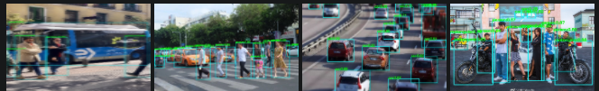
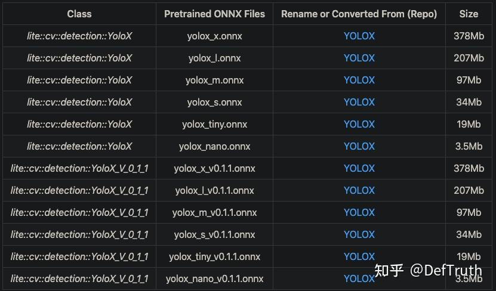
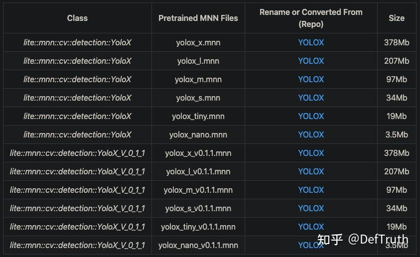
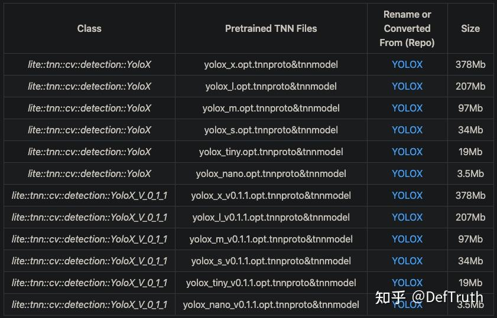
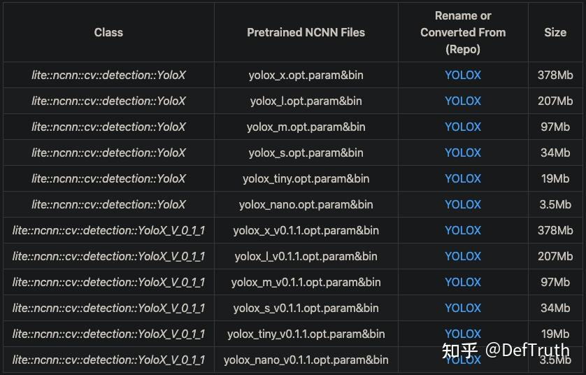

# [추론 배포] YOLOX NCNN/MNN/TNN/ONNXRuntime C++ 프로젝트 기록

> 원문: https://zhuanlan.zhihu.com/p/447364122

**목차**
- 1. 서문
- 2. C++ version source
- 3. 모델 파일
- 4. Interface 문서
- 5. 사용 사례
- 6. Compile과 실행

## 1. 서문

`Lite.AI.ToolKit` C++ toolbox로 YOLOX를 실행하는 사례다. ONNXRuntime C++, MNN, TNN, NCNN version을 포함한다.



모든 예제 코드는 아래 repository에 있다.

- YOLOX.lite.ai.toolkit: YOLOX C++ test code. ONNXRuntime, NCNN, MNN, TNN version 포함  
  https://github.com/DefTruth/YOLOX.lite.ai.toolkit
- Lite.AI.ToolKit: C++ AI model toolbox  
  https://github.com/DefTruth/lite.ai.toolkit

## 2. C++ version source

YOLOX C++ version source는 ONNXRuntime, MNN, TNN, NCNN 네 version을 포함한다. 구버전 YOLOX model과 새 version model(YOLOX-v0.1.1) inference가 모두 들어 있다.

YOLOX-v0.1.1과 구버전 YOLOX model은 preprocessing, model input/output node name이 다르다. source는 `lite.ai.toolkit` toolbox에서 확인할 수 있다. 이 project는 `lite.ai.toolkit`을 기반으로 YOLOX를 직접 호출해 object detection을 수행하는 방법을 다룬다.

이 project는 macOS에서 compile한 `liblite.ai.toolkit.v0.1.0.dylib` 기반이다. macOS 사용자는 project에 포함된 `liblite.ai.toolkit.v0.1.0` dynamic library와 다른 dependency를 바로 사용할 수 있다. macOS가 아닌 환경에서는 `lite.ai.toolkit` source를 받아 compile해야 한다.

관련 source file:

- `yolox.cpp`
- `yolox.h`
- `mnn_yolox.cpp`
- `mnn_yolox.h`
- `tnn_yolox.cpp`
- `tnn_yolox.h`
- `ncnn_yolox.cpp`
- `ncnn_yolox.h`
- `yolox_v0.1.1.cpp`
- `yolox_v0.1.1.h`
- `mnn_yolox_v0.1.1.cpp`
- `mnn_yolox_v0.1.1.h`
- `tnn_yolox_v0.1.1.cpp`
- `tnn_yolox_v0.1.1.h`
- `ncnn_yolox_v0.1.1.cpp`
- `ncnn_yolox_v0.1.1.h`

ONNXRuntime C++, MNN, TNN, NCNN version inference implementation은 모두 테스트되어 있다.

## 3. 모델 파일

### 3.1 ONNX model file

제공된 링크(Baidu Drive code: `8gin`)에서 받을 수 있고, 이 repository에서도 받을 수 있다.



### 3.2 MNN model file

MNN model file download address는 Baidu Drive code `9v63`이며, 이 repository에서도 받을 수 있다.



### 3.3 TNN model file

TNN model file download address는 Baidu Drive code `6o6k`이며, 이 repository에서도 받을 수 있다.



### 3.4 NCNN model file

NCNN model file download address는 Baidu Drive code `sc7f`이며, 이 repository에서도 받을 수 있다.



## 4. Interface 문서

`lite.ai.toolkit`에서 YOLOX 구현 class는 다음과 같다.

```cpp
class LITE_EXPORTS lite::cv::detection::YoloX;
class LITE_EXPORTS lite::mnn::cv::detection::YoloX;
class LITE_EXPORTS lite::tnn::cv::detection::YoloX;
class LITE_EXPORTS lite::ncnn::cv::detection::YoloX;
class LITE_EXPORTS lite::cv::detection::YoloX_V_0_1_1;  // YOLOX-v0.1.1 (latest)
class LITE_EXPORTS lite::mnn::cv::detection::YoloX_V_0_1_1;
class LITE_EXPORTS lite::tnn::cv::detection::YoloX_V_0_1_1;
class LITE_EXPORTS lite::ncnn::cv::detection::YoloX_V_0_1_1;
```

이 type은 현재 object detection을 수행하는 public interface `detect` 하나를 포함한다.

```cpp
public:
    /**
     * @param mat cv::Mat BGR format
     * @param detected_boxes vector of Boxf to catch detected boxes.
     * @param score_threshold default 0.45f, only keep the result which >= score_threshold.
     * @param iou_threshold default 0.3f, iou threshold for NMS.
     * @param topk default 100, maximum output boxes after NMS.
     * @param nms_type the method.
     */
    void detect(const cv::Mat &mat, std::vector<types::Boxf> &detected_boxes,
                float score_threshold = 0.45f, float iou_threshold = 0.3f,
                unsigned int topk = 100, unsigned int nms_type = NMS::OFFSET);
```

`detect` interface input parameter:

- `mat`: `cv::Mat`, BGR format.
- `detected_boxes`: `Boxf` vector. 검출된 box를 담는다. `Boxf`에는 `x1`, `y1`, `x2`, `y2`, `label`, `score` 등이 포함된다.
- `score_threshold`: classification score 또는 quality score threshold. default `0.45`. 이 threshold보다 작은 box는 버린다.
- `iou_threshold`: NMS의 IoU threshold. default `0.3`.
- `topk`: default `100`. NMS 뒤 최대 output box 수.
- `nms_type`: NMS algorithm type. default는 class별 NMS.

## 5. 사용 사례

여기서는 2021-08-19 이전의 `yolox_s.onnx` version model을 사용한다. YOLOX-v0.1.1 model도 사용할 수 있다.

### 5.1 ONNXRuntime version

```cpp
#include "lite/lite.h"

static void test_default()
{
    std::string onnx_path = "../hub/onnx/cv/yolox_s.onnx";
    std::string test_img_path = "../resources/5.jpg";
    std::string save_img_path = "../logs/5.jpg";

    // 1. Test Default Engine ONNXRuntime
    auto *yolox = new lite::cv::detection::YoloX(onnx_path); // default

    std::vector<lite::types::Boxf> detected_boxes;
    cv::Mat img_bgr = cv::imread(test_img_path);
    yolox->detect(img_bgr, detected_boxes);

    lite::utils::draw_boxes_inplace(img_bgr, detected_boxes);

    cv::imwrite(save_img_path, img_bgr);

    std::cout << "Default Version Detected Boxes Num: " << detected_boxes.size() << std::endl;

    delete yolox;
}
```

### 5.2 MNN version

```cpp
#include "lite/lite.h"

static void test_mnn()
{
#ifdef ENABLE_MNN
    std::string mnn_path = "../hub/mnn/cv/yolox_s.mnn";
    std::string test_img_path = "../resources/7.jpg";
    std::string save_img_path = "../logs/7.jpg";

    // 3. Test Specific Engine MNN
    auto *yolox = new lite::mnn::cv::detection::YoloX(mnn_path);

    std::vector<lite::types::Boxf> detected_boxes;
    cv::Mat img_bgr = cv::imread(test_img_path);
    yolox->detect(img_bgr, detected_boxes);

    lite::utils::draw_boxes_inplace(img_bgr, detected_boxes);

    cv::imwrite(save_img_path, img_bgr);

    std::cout << "MNN Version Detected Boxes Num: " << detected_boxes.size() << std::endl;

    delete yolox;
#endif
}
```

### 5.3 TNN version

```cpp
#include "lite/lite.h"

static void test_tnn()
{
#ifdef ENABLE_TNN
    std::string proto_path = "../hub/tnn/cv/yolox_s.opt.tnnproto";
    std::string model_path = "../hub/tnn/cv/yolox_s.opt.tnnmodel";
    std::string test_img_path = "../resources/9.jpg";
    std::string save_img_path = "../logs/9.jpg";

    // 5. Test Specific Engine TNN
    auto *yolox = new lite::tnn::cv::detection::YoloX(proto_path, model_path);

    std::vector<lite::types::Boxf> detected_boxes;
    cv::Mat img_bgr = cv::imread(test_img_path);
    yolox->detect(img_bgr, detected_boxes);

    lite::utils::draw_boxes_inplace(img_bgr, detected_boxes);

    cv::imwrite(save_img_path, img_bgr);

    std::cout << "TNN Version Detected Boxes Num: " << detected_boxes.size() << std::endl;

    delete yolox;
#endif
}
```

### 5.4 NCNN version

```cpp
#include "lite/lite.h"

static void test_ncnn()
{
#ifdef ENABLE_NCNN
    std::string param_path = "../hub/ncnn/cv/yolox_s.opt.param";
    std::string bin_path = "../hub/ncnn/cv/yolox_s.opt.bin";
    std::string test_img_path = "../resources/5.jpg";
    std::string save_img_path = "../logs/5.jpg";

    // 4. Test Specific Engine NCNN
    auto *yolox = new lite::ncnn::cv::detection::YoloX(param_path, bin_path);

    std::vector<lite::types::Boxf> detected_boxes;
    cv::Mat img_bgr = cv::imread(test_img_path);
    yolox->detect(img_bgr, detected_boxes);

    lite::utils::draw_boxes_inplace(img_bgr, detected_boxes);

    cv::imwrite(save_img_path, img_bgr);

    std::cout << "NCNN Version Detected Boxes Num: " << detected_boxes.size() << std::endl;

    delete yolox;
#endif
}
```

출력 결과:


## 6. Compile과 실행

macOS에서는 이 project를 바로 compile/run할 수 있고 별도 dependency를 받을 필요가 없다. 다른 OS에서는 `lite.ai.toolkit` source를 받아 먼저 `liblite.ai.toolkit.v0.1.0` dynamic library를 compile해야 한다.

```bash
git clone --depth=1 https://github.com/DefTruth/yolox.lite.ai.toolkit.git
cd yolox.lite.ai.toolkit
sh ./build.sh
```

CMakeLists.txt 설정:

```cmake
cmake_minimum_required(VERSION 3.17)
project(yolox.lite.ai.toolkit)

set(CMAKE_CXX_STANDARD 11)

# setting up lite.ai.toolkit
set(LITE_AI_DIR ${CMAKE_SOURCE_DIR}/lite.ai.toolkit)
set(LITE_AI_INCLUDE_DIR ${LITE_AI_DIR}/include)
set(LITE_AI_LIBRARY_DIR ${LITE_AI_DIR}/lib)
include_directories(${LITE_AI_INCLUDE_DIR})
link_directories(${LITE_AI_LIBRARY_DIR})

set(OpenCV_LIBS
        opencv_highgui
        opencv_core
        opencv_imgcodecs
        opencv_imgproc
        opencv_video
        opencv_videoio
        )
# add your executable
set(EXECUTABLE_OUTPUT_PATH ${CMAKE_SOURCE_DIR}/examples/build)

add_executable(lite_yolox examples/test_lite_yolox.cpp)
target_link_libraries(lite_yolox
        lite.ai.toolkit
        onnxruntime
        MNN
        ncnn
        TNN
        ${OpenCV_LIBS})
```

Build와 test 정보:

```text
[ 50%] Building CXX object CMakeFiles/lite_yolox.dir/examples/test_lite_yolox.cpp.o
[100%] Linking CXX executable lite_yolox
[100%] Built target lite_yolox
Testing Start ...
LITEORT_DEBUG LogId: ../hub/onnx/cv/yolox_s.onnx
=============== Input-Dims ==============
input_node_dims: 1
input_node_dims: 3
input_node_dims: 640
input_node_dims: 640
=============== Output-Dims ==============
Output: 0 Name: outputs Dim: 0 :1
Output: 0 Name: outputs Dim: 1 :8400
Output: 0 Name: outputs Dim: 2 :85
========================================
detected num_anchors: 8400
generate_bboxes num: 96
Default Version Detected Boxes Num: 11
```

