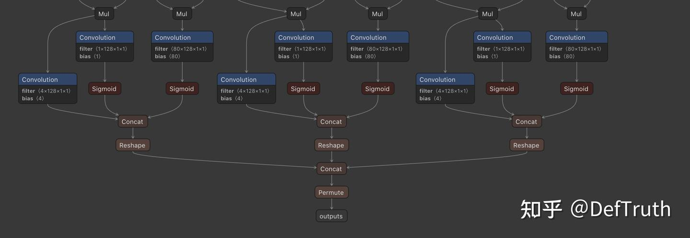
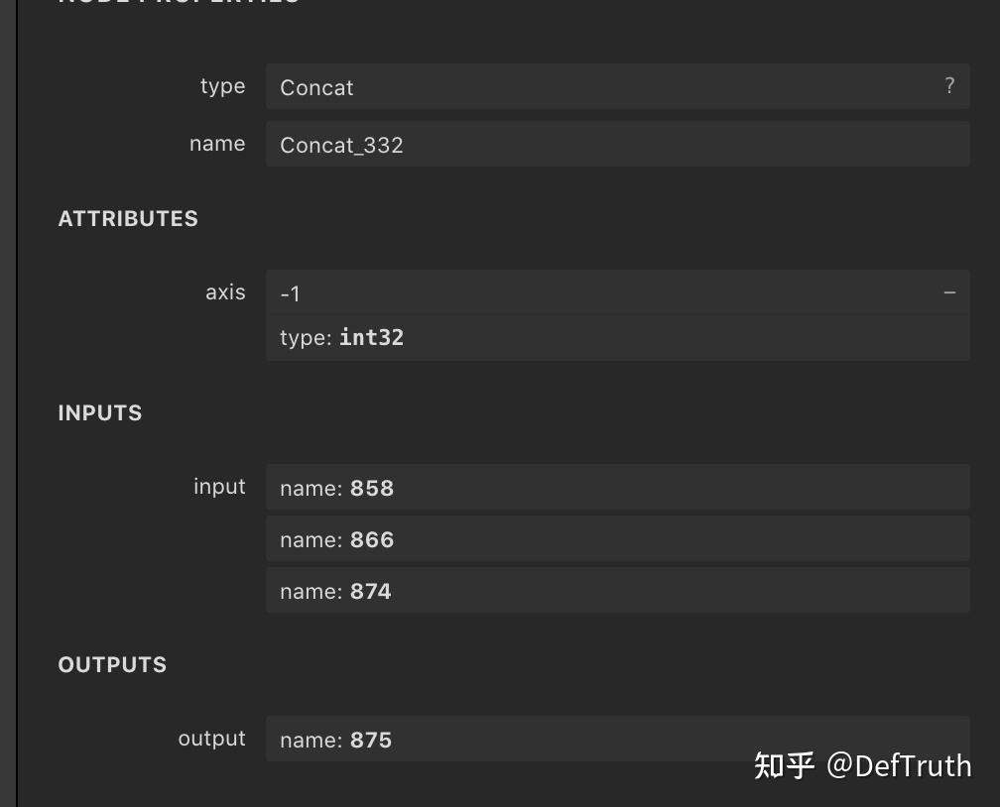
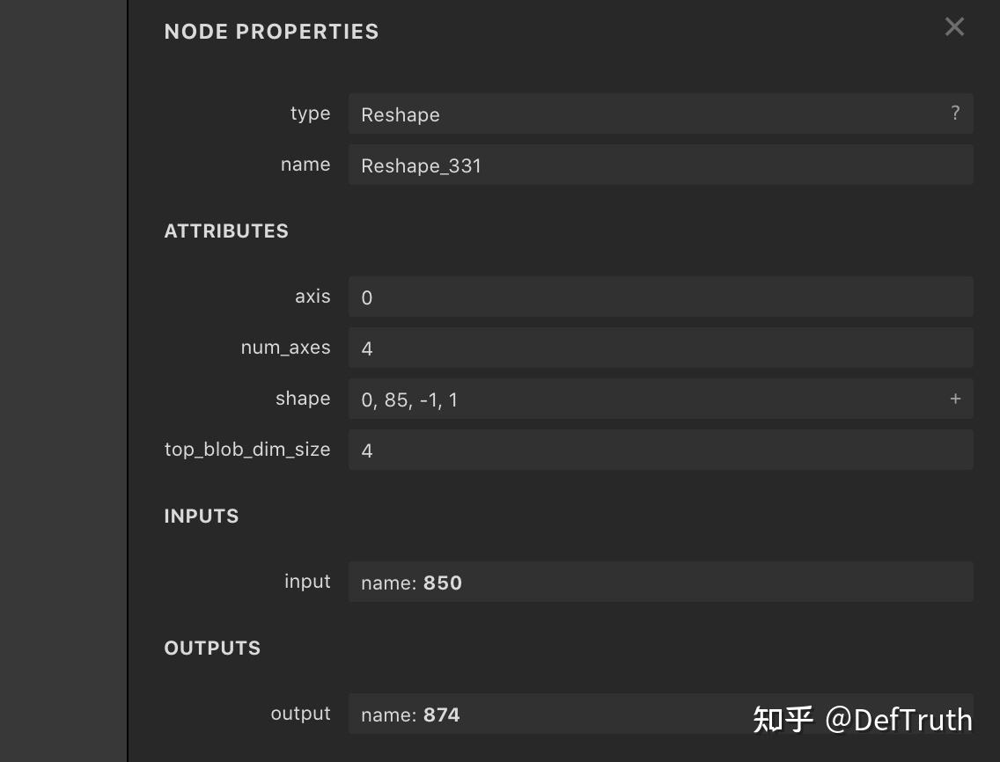
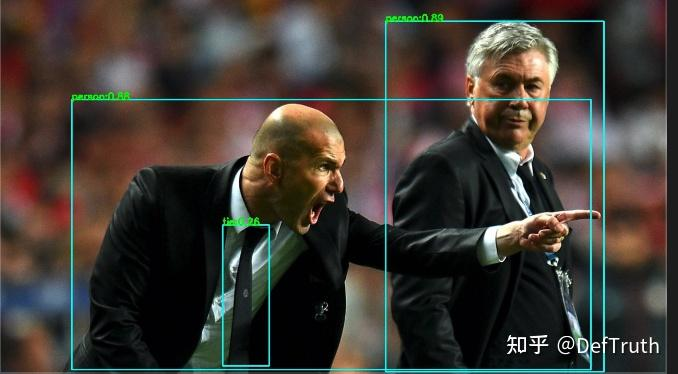
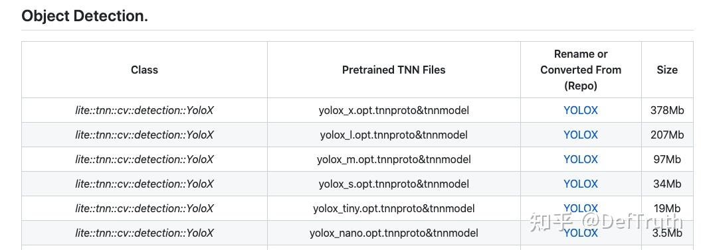

# [추론 배포] YOLOX tnnproto 수동 수정 기록

> 원문: https://zhuanlan.zhihu.com/p/425668734

**목차**
- YOLOX tnnproto 수동 수정 기록
- 1. Inference 오류
- 2. 문제 위치 찾기
- 3. tnnproto 수정
- 4. TNN version inference code
- 5. YOLOX TNN model file

## YOLOX tnnproto 수동 수정 기록

최근 TNN, MNN, NCNN 사용 기록을 정리하고 있다. 나중에 같은 문제를 다시 만났을 때 빨리 확인하기 위한 기록이다. 관련 C++ inference example은 `Lite.AI.ToolKit`에 있다.

## 1. Inference 오류

YOLOX에서 변환한 `tnnproto`, `tnnmodel`을 C++ inference에서 실행하면 다음 오류가 발생한다.

```text
E/tnn: ConcatLayerCheckShape [File /Users/xxx/Desktop/third_party/library/TNN/source/tnn/layer/concat_layer.cc][Line 33] dim[2] not match (shape1:6400, shape2:1600)
E/tnn: InferOutputShape [File /Users/xxx/Desktop/third_party/library/TNN/source/tnn/layer/concat_layer.cc][Line 79] Error: ConcatLayer's (layer name: Concat_332) inputs can not be concatenated with axis=3
E/tnn: InferOutputShape [File /Users/xxx/Desktop/third_party/library/TNN/source/tnn/layer/permute_layer.cc][Line 47] Permute param got wrong size.
E/tnn: ConcatLayerCheckShape [File /Users/xxx/Desktop/third_party/library/TNN/source/tnn/layer/concat_layer.cc][Line 33] dim[2] not match (shape1:6400, shape2:1600)
E/tnn: InferOutputShape [File /Users/xxx/Desktop/third_party/library/TNN/source/tnn/layer/concat_layer.cc][Line 79] Error: ConcatLayer's (layer name: Concat_332) inputs can not be concatenated with axis=3
E/tnn: Init [File /Users/xxx/Desktop/third_party/library/TNN/source/tnn/layer/base_layer.cc][Line 57] InferOutputShape failed
E/tnn: InitLayers [File /Users/xxx/Desktop/third_party/library/TNN/source/tnn/core/default_network.cc][Line 318] Error Init layer Concat_332 (err: 4096 or 0x1000)
CreateInst failed!code: 0x1000 msg: ConcatLayer's inputs can not be concatenated
lite_yolox(69084,0x11595bdc0) malloc: can't allocate region
:*** mach_vm_map(size=1104500708888576, flags: 100) failed (error code=3)
lite_yolox(69084,0x11595bdc0) malloc: *** set a breakpoint in malloc_error_break to debug
```

## 2. 문제 위치 찾기

TNN 오류 메시지는 어떤 operator에서 문제가 생겼는지 알려 준다. 메시지에 따르면 `Concat` operator가 변환되지 못했다. `Concat`은 `axis=3`에서 합치려고 하지만 shape check 중 `axis=2`, 즉 `dim[2]`에서 dimension이 맞지 않는다.

`concat_layer.cc`의 관련 source:

```cpp
inline bool ConcatLayerCheckShape(DimsVector shape1, DimsVector shape2, int exclude_axis, bool ignore_error) {
    if (shape1.size() != shape2.size()) {
        LOGE_IF(!ignore_error, "shape1 dim size %d  shape2 dim size %d\n", (int)shape1.size(), (int)shape2.size());
        return false;
    }

    int i = 0;
    for (; i < shape1.size(); i++) {
        // support shape1[i] == 0 for empty blob in yolov5
        if ((i != exclude_axis && shape1[i] != shape2[i]) || (shape1[i] < 0 || shape2[i] < 0)) {
            LOGE_IF(!ignore_error, "dim[%d] not match (shape1:%d, shape2:%d)\n", i, shape1[i], shape2[i]);
            return false;
        }
    }

    if (exclude_axis >= shape1.size()) {
        LOGE_IF(!ignore_error, "exclude_axis:%d out of shape size:%d\n", exclude_axis, (int)shape1.size());
        return false;
    }
    return true;
}
```

`ConcatLayerCheckShape`는 dimension을 검사한다. `Concat_332` operator는 `axis=3`에서 concat하려고 하므로, concat axis가 아닌 dimension은 모두 같아야 한다. 하나라도 다르면 log를 내고 `false`를 반환한다.

오류 메시지는 `axis=2` dimension이 맞지 않으며 각각 `(shape1:6400, shape2:1600)`이라고 말한다. 명백히 마지막 output concat이 잘못 변환된 것이다. 이 부분은 YOLOX source의 아래 코드와 대응된다.

```python
self.hw = [x.shape[-2:] for x in outputs]
# [batch, n_anchors_all, 85]
# [b,85,h,w] -> [b,85,h*w] -> [b,N,85]
outputs = torch.cat(
    [x.flatten(start_dim=2) for x in outputs], dim=2).permute(0, 2, 1)
```

Netron으로 `yolox_s.tnnproto`를 열어 보면 마지막 output node는 다음과 같다.



`Concat_332` node는 reshape된 tensor 3개를 input으로 받는다. 따라서 문제는 `Reshape`, `Concat_332`, 또는 둘 모두에 있다.

`Concat_332`:



그중 하나의 `Reshape`:



## 3. tnnproto 수정

`tnnproto` 파일을 text로 열어 해당 node를 찾는다.

```text
"Convolution Conv_303 1 1 845 846 1 128 4 1 1 1 1 0 0 1 -1 1 1 ,"
"Convolution Conv_304 1 1 845 847 1 128 1 1 1 1 1 0 0 1 -1 1 1 ,"
"Sigmoid Sigmoid_305 1 1 847 848 ,"
"Sigmoid Sigmoid_306 1 1 837 849 ,"
"Concat Concat_307 3 1 846 848 849 850 1 ,"
"Reshape Reshape_315 1 1 798 858 0 4 4 0 85 -1 1 ,"
"Reshape Reshape_323 1 1 824 866 0 4 4 0 85 -1 1 ,"
"Reshape Reshape_331 1 1 850 874 0 4 4 0 85 -1 1 ,"
"Concat Concat_332 3 1 858 866 874 875 -1 ,"
"Permute Transpose_333 1 1 875 outputs 3 0 2 1 ,"
```

문제가 보인다. PyTorch에서는 `x.flatten` 뒤 3D tensor를 기대하지만, TNN으로 변환된 뒤에는 4D가 되었고 마지막 dimension `1`이 추가되었다. 이때 `Concat_332`의 `axis=-1`은 마지막 dimension, 즉 `axis=3`을 의미한다.

하지만 실제로 합쳐야 할 dimension은 `Reshape` parameter에서 `-1`인 axis, 즉 `axis=2`다. 그래서 shape check에서 오류가 난다. 해결은 `Concat_332`의 `axis=-1`을 `axis=2`로 고정하는 것이다.

또 `Reshape`의 첫 parameter가 `0`인 것도 보인다. TNN source를 보면 `0`은 input dimension을 그대로 사용한다.

```cpp
DimsVector DimsFunctionUtils::Reshape(const DimsVector input_dims, const DimsVector shape,
                                    const int axis, const int num_axes, Status *status) {

    int output_size = shape.size() + axis;
    DimsVector output_dims(output_size, 1);

    for(int i = 0; i < axis; ++i) {
        output_dims[i] = input_dims[i];
    }

    int infer_dim_count = 0;
    int infer_dim_pos   = -1;
    for (int i = axis, j = 0; j < num_axes; i++, j++) {
        if (shape[j] == -1) {
            infer_dim_count += 1;
            infer_dim_pos  = i;
            output_dims[i] = 1;
        } else if (shape[j] == 0) {
            output_dims[i] = input_dims[i];
        } else {
            output_dims[i] = shape[j];
        }
    }
    // ...
}
```

핵심은 다음 분기다.

```cpp
else if (shape[j] == 0) {
  output_dims[i] = input_dims[i];
}
```

즉 `Reshape` parameter가 `0`이면 input의 같은 dimension 값을 그대로 사용한다. 이 값은 TNN 내부에서 처리되므로 괜찮다. 다만 ONNX export 때 batch가 `1`이었으므로 원문에서는 이 값도 `1`로 바꾸었다.

수정 후 `tnnproto`:

```text
"Convolution Conv_303 1 1 845 846 1 128 4 1 1 1 1 0 0 1 -1 1 1 ,"
"Convolution Conv_304 1 1 845 847 1 128 1 1 1 1 1 0 0 1 -1 1 1 ,"
"Sigmoid Sigmoid_305 1 1 847 848 ,"
"Sigmoid Sigmoid_306 1 1 837 849 ,"
"Concat Concat_307 3 1 846 848 849 850 1 ,"
"Reshape Reshape_315 1 1 798 858 0 4 4 1 85 -1 1 ,"
"Reshape Reshape_323 1 1 824 866 0 4 4 1 85 -1 1 ,"
"Reshape Reshape_331 1 1 850 874 0 4 4 1 85 -1 1 ,"
"Concat Concat_332 3 1 858 866 874 875 2 ,"
"Permute Transpose_333 1 1 875 outputs 3 0 2 1 ,"
```

이렇게 수정한 뒤 바로 inference를 실행한다.



`yolox_m`, `yolox_x`, `yolox_l`, `yolox_nano`, `yolox_tiny`의 `.tnnproto`도 같은 방식으로 수정하면 실행할 수 있다.

tnnproto 각 line의 의미를 어떻게 알았냐는 질문이 나올 수 있다. 실제로는 상당 부분 추측이다. tnnproto 구조가 ncnn의 param과 매우 비슷하고, 이전에 param을 수동 수정해 본 경험이 있어서 각 op의 parameter 의미를 추정하기 쉬웠다.

## 4. TNN version inference code

여기부터는 TNN version inference code를 붙이는 부분이다. 핵심은 수정된 `tnnproto`와 `tnnmodel`을 사용해 YOLOX TNN wrapper를 생성하고, detection 결과를 그리는 것이다.

## 5. YOLOX TNN model file



사용한 것은 YOLOX old version model이다. 새 version도 비슷한 문제가 생길 수 있으니 같은 방식으로 고치면 된다.

