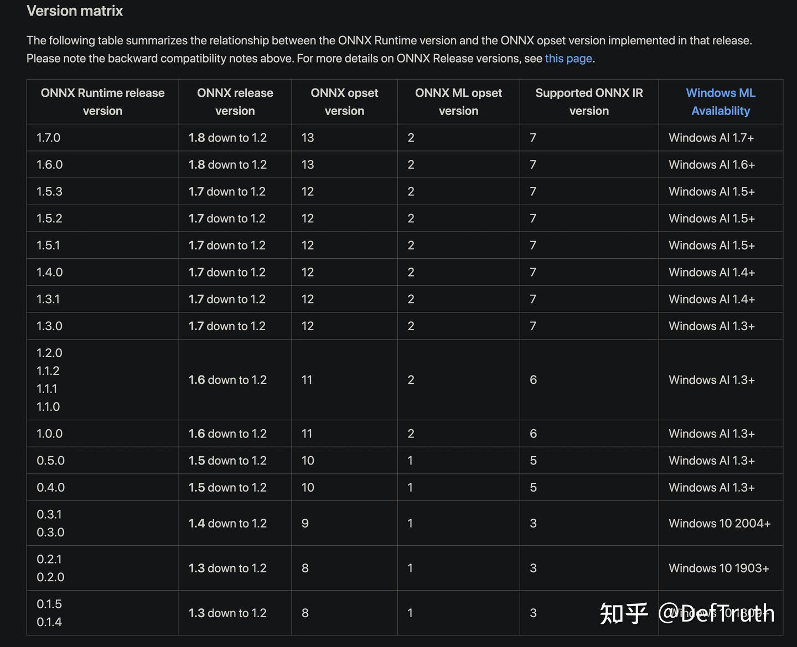
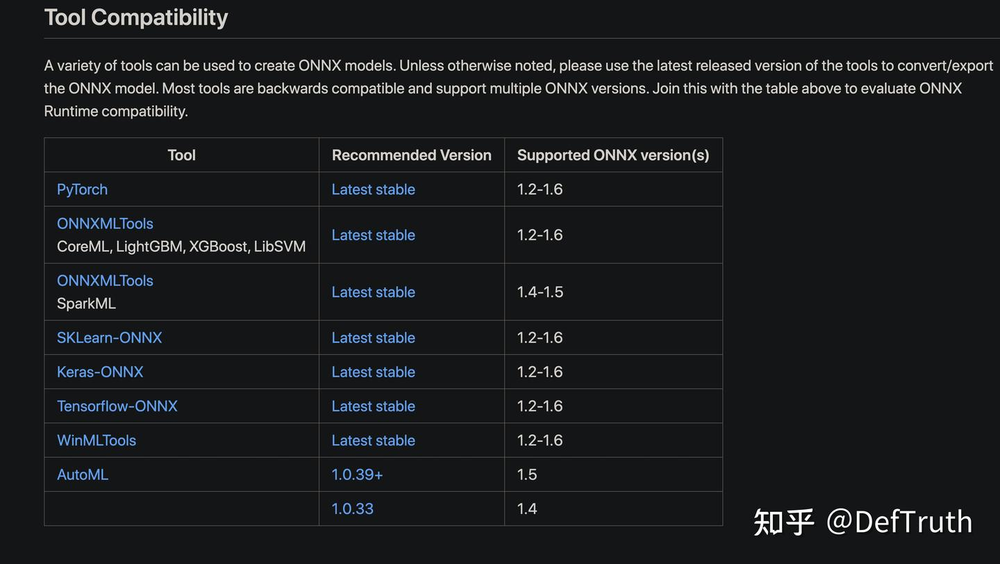

# [배포][ORT] ONNXRuntime C++/Java/Python 참고 자료

> 원문: https://zhuanlan.zhihu.com/p/414317269

## 서문

한동안 글을 갱신하지 않았다. 최근 TNN, MNN, NCNN, ONNXRuntime 사용 시리즈 노트를 정리하려 한다. 좋은 기억력보다 엉성한 기록이 낫다. 기억력도 좋지 않으니, 나중에 같은 구덩이에 빠졌을 때 조금 더 빠르게 빠져나오기 위한 기록이다. 현재 **80개가 넘는 C++** inference example을 lib로 build해서 사용할 수 있게 정리해 두었다. 관심이 있으면 보면 된다. 길게 소개하지는 않는다.

프로젝트 설명:

GithubLite.AI.ToolKitA lite C++ toolkit of awesome AI models.

즉, 바로 사용할 수 있는 C++ AI model toolkit이다. 평소 새 algorithm을 공부할 때 손에 잡히는 대로 만든 것들이고, 현재 80개 이상의 인기 open source model을 포함한다. 어느새 거의 800 star에 가까워졌다. star와 issue는 언제나 환영한다.

https://github.com/DefTruth/lite.ai.toolkit

이 문서는 ONNXRuntime 관련 참고 자료를 기록한다. C++/Java/Python 자료와 사용 과정에서 얻은 경험을 포함한다.

정리는 계속 갱신한다.

## 1. ONNXRuntime official resources

- [1] ONNXRuntime official site learning resources.
- [2] ONNXRuntime custom op.
- [3] `onnxruntime-gpu`와 CUDA version 대응.
- [4] ONNXRuntime OpenMP.
- [5] ONNXRuntime과 CUDA version 대응. 매우 상세하다.
- [6] ONNXRuntime API document.
- [7] ONNXRuntime Python API docs.
- [8] ONNXRuntime Java API docs.

## 2. ONNXRuntime C++ 참고

- [1] `onnx_runtime_cpp` GitHub.
- [2] ONNXRuntime Python/C/C++/Java usage case.
- [3] ONNXRuntime official examples for multiple languages.
- [4] ONNXRuntime C++ usage.
- [5] ONNXRuntime CXX official example.
- [6] ONNXRuntime FAQ.
- [7] ONNXRuntime C++ multi-input multi-output case.
- [8] ONNXRuntime에 특정 data type 전달. 예: fp16, int8.

## 3. ONNXRuntime Java 참고

- [1] ONNXRuntime MNIST Java.
- [2] Java에서 ONNXRuntime 사용.
- [3] ONNXRuntime `build.gradle`.

## 4. ONNXRuntime Docker image

- [1] Dockerfile for ONNXRuntime.

## 5. ONNXRuntime source compile

- [1] ONNXRuntime source compile.
- [2] Linux에서 ONNXRuntime compile.
- [3] ONNXRuntime compile option 해석.
- [4] ONNXRuntime의 CMake guide와 ABI dev notes.
- [5] ONNXRuntime `cmake_guideline.md`.
- [6] macOS compile 중 `has no symbols` prompt가 나오는 문제.

## 6. open source project

- [1] `chineseocr_lite`: ONNXRuntime, ncnn 등 여러 language application.
- [2] ONNXRuntime projects.
- [3] 괜찮은 ORT C++ application project.

## 7. ONNX Opset compatibility

- [1] ONNXRuntime과 ONNX 각 opset의 대응 관계.



각 conversion tool과의 compatibility.



## 8. `Ort::Value` value 얻기

### 8.1 `At<>`로 얻기

```cpp
TEST(CApiTest, access_tensor_data_elements) {
  /**
   * Create a 2x3 data blob that looks like:
   *
   *  0 1 2
   *  3 4 5
   */
  std::vector<int64_t> shape = {2, 3};
  int element_count = 6;  // 2*3
  std::vector<float> values(element_count);
  for (int i = 0; i < element_count; i++)
    values[i] = static_cast<float>(i);

  Ort::MemoryInfo info("Cpu", OrtDeviceAllocator, 0, OrtMemTypeDefault);

  Ort::Value tensor = Ort::Value::CreateTensor<float>(info, values.data(), values.size(), shape.data(), shape.size());

  float expected_value = 0;
  for (int64_t row = 0; row < shape[0]; row++) {
    for (int64_t col = 0; col < shape[1]; col++) {
      ASSERT_EQ(expected_value++, tensor.At<float>({row, col}));
    }
  }
}
```

### 8.2 raw pointer로 얻기

```cpp
const float *var_angles = output_var_tensors.front().GetTensorMutableData<float>();
  const float *conv_angles = output_conv_tensors.front().GetTensorMutableData<float>();
  const float mean_yaw = (var_angles[0] + conv_angles[0]) / 2.0f;
  const float mean_pitch = (var_angles[1] + conv_angles[1]) / 2.0f;
  const float mean_roll = (var_angles[2] + conv_angles[2]) / 2.0f;
```

### 8.3 reference `&`와 `At`으로 얻기

`Ort::Value`는 copy를 허용하지 않으므로 `=`로 output result를 사용할 수 없다. 하지만 reference `&`와 `At<>`을 결합해 값을 얻을 수 있다. 사용 방식은 다음과 같다.

```cpp
ort::Value &var_angles_tensor = output_var_tensors.at(0);
  ort::Value &conv_angles_tensor = output_conv_tensors.at(0);
  const float mean_ref_yaw =
      (var_angles_tensor.At<float>({0}) + conv_angles_tensor.At<float>({0})) / 2.0f;
  const float mean_ref_pitch =
      (var_angles_tensor.At<float>({1}) + conv_angles_tensor.At<float>({1})) / 2.0f;
  const float mean_ref_roll =
      (var_angles_tensor.At<float>({2}) + conv_angles_tensor.At<float>({2})) / 2.0f;
```

`At<>` source는 다음과 같다.

```cpp
inline T& Value::At(const std::vector<int64_t>& location) {
  static_assert(!std::is_same<T, std::string>::value, "this api does not support std::string");
  T* out;
  ThrowOnError(GetApi().TensorAt(p_, location.data(), location.size(), (void**)&out));
  return *out;
}
```

실제로는 pointer `p_`로 data를 얻는다. 다만 `At`이 data position 계산을 대신 처리한다. 이 method가 return하는 것은 실제로 `non-const` reference다. 즉 이 reference를 통해 memory 안의 value를 직접 수정할 수 있다.

### 8.4 기타 usage 참고

```cpp
std::vector<OrtSessionHandler::DataOutputType> OrtSessionHandler::OrtSessionHandlerIml::
operator()(const std::vector<float*>& inputData)
{
    if (m_numInputs != inputData.size()) {
        throw std::runtime_error("Mismatch size of input data\n");
    }

    Ort::MemoryInfo memoryInfo = Ort::MemoryInfo::CreateCpu(OrtArenaAllocator, OrtMemTypeDefault);

    std::vector<Ort::Value> inputTensors;
    inputTensors.reserve(m_numInputs);

    for (int i = 0; i < m_numInputs; ++i) {
        inputTensors.emplace_back(std::move(
            Ort::Value::CreateTensor<float>(memoryInfo, const_cast<float*>(inputData[i]), m_inputTensorSizes[i],
                                            m_inputShapes[i].data(), m_inputShapes[i].size())));
    }

    auto outputTensors = m_session.Run(Ort::RunOptions{nullptr}, m_inputNodeNames.data(), inputTensors.data(),
                                       m_numInputs, m_outputNodeNames.data(), m_numOutputs);

    assert(outputTensors.size() == m_numOutputs);
    std::vector<DataOutputType> outputData;
    outputData.reserve(m_numOutputs);

    int count = 1;
    for (auto& elem : outputTensors) {
        DEBUG_LOG("type of input %d: %s", count++, toString(elem.GetTensorTypeAndShapeInfo().GetElementType()).c_str());
        outputData.emplace_back(
            std::make_pair(std::move(elem.GetTensorMutableData<float>()), elem.GetTensorTypeAndShapeInfo().GetShape()));
    }

    return outputData;
}
```

## 9. source application case

- [1] ONNXRuntime C++ multi-input multi-output case.

```cpp
#include <assert.h>
#include <vector>
#include <onnxruntime_cxx_api.h>

int main(int argc, char* argv[]) {
  Ort::Env env(ORT_LOGGING_LEVEL_WARNING, "test");
  Ort::SessionOptions session_options;
  session_options.SetIntraOpNumThreads(1);
  session_options.SetGraphOptimizationLevel(GraphOptimizationLevel::ORT_ENABLE_EXTENDED);

#ifdef _WIN32
  const wchar_t* model_path = L"model.onnx";
#else
  const char* model_path = "model.onnx";
#endif

  Ort::Session session(env, model_path, session_options);
  // print model input layer (node names, types, shape etc.)
  Ort::AllocatorWithDefaultOptions allocator;

  // print number of model input nodes
  size_t num_input_nodes = session.GetInputCount();
  std::vector<const char*> input_node_names = {"input","input_mask"};
  std::vector<const char*> output_node_names = {"output","output_mask"};

  std::vector<int64_t> input_node_dims = {10, 20};
  size_t input_tensor_size = 10 * 20;
  std::vector<float> input_tensor_values(input_tensor_size);
  for (unsigned int i = 0; i < input_tensor_size; i++)
    input_tensor_values[i] = (float)i / (input_tensor_size + 1);
  // create input tensor object from data values
  auto memory_info = Ort::MemoryInfo::CreateCpu(OrtArenaAllocator, OrtMemTypeDefault);
  Ort::Value input_tensor = Ort::Value::CreateTensor<float>(memory_info, input_tensor_values.data(), input_tensor_size, input_node_dims.data(), 2);
  assert(input_tensor.IsTensor());

  std::vector<int64_t> input_mask_node_dims = {1, 20, 4};
  size_t input_mask_tensor_size = 1 * 20 * 4;
  std::vector<float> input_mask_tensor_values(input_mask_tensor_size);
  for (unsigned int i = 0; i < input_mask_tensor_size; i++)
    input_mask_tensor_values[i] = (float)i / (input_mask_tensor_size + 1);
  // create input tensor object from data values
  auto mask_memory_info = Ort::MemoryInfo::CreateCpu(OrtArenaAllocator, OrtMemTypeDefault);
  Ort::Value input_mask_tensor = Ort::Value::CreateTensor<float>(mask_memory_info, input_mask_tensor_values.data(), input_mask_tensor_size, input_mask_node_dims.data(), 3);
  assert(input_mask_tensor.IsTensor());

  std::vector<Ort::Value> ort_inputs;
  ort_inputs.push_back(std::move(input_tesor));
  ort_inputs.push_back(std::move(input_mask_tensor));
  // score model & input tensor, get back output tensor
  auto output_tensors = session.Run(Ort::RunOptions{nullptr}, input_node_names.data(), ort_inputs.data(), ort_inputs.size(), output_node_names.data(), 2);

  // Get pointer to output tensor float values
  float* floatarr = output_tensors[0].GetTensorMutableData<float>();
  float* floatarr_mask = output_tensors[1].GetTensorMutableData<float>();

  printf("Done!\n");
  return 0;
}
```

## 10. ONNXRuntime dynamic dimension inference

- [1] ONNXRuntime C++ dynamic dimension model inference.

## 11. ONNXRuntime source study

- [0] ONNXRuntime source reading: model inference process overview.
- [1] ONNXRuntime source analysis: engine runtime process overview.
- [2] PyTorch ONNX operator export type setting.
- [3] ONNXRuntime and PyTorch integration methods.
- [4] ONNXRuntime design philosophy.
- [5] ONNXRuntime: adding a new operator and kernel.
- [6] ONNX model에서 node를 modify/delete하는 방법, 즉 graph modification method.
- [7] ONNXRuntime에 새 execution provider 추가.
- [8] ONNXRuntime graph optimization method description.
- [9] ONNX structure analysis.

## 12. C++ API usage case

### 12.1 object detection

- [0] YOLOv5 object detection ONNXRuntime C++ implementation.
- [1] YOLOv3 object detection ONNXRuntime C++ implementation.
- [2] TinyYOLOv3 object detection ONNXRuntime C++ implementation.
- [3] YOLOv4 object detection ONNXRuntime C++ implementation.
- [4] SSD object detection ONNXRuntime C++ implementation.
- [5] SSDMobileNetV1 object detection ONNXRuntime C++ implementation.
- [6] YOLOX 2021 latest object detection ONNXRuntime C++ implementation.
- [7] TinyYOLOv4VOC object detection ONNXRuntime C++ implementation.
- [8] TinyYOLOv4COCO object detection ONNXRuntime C++ implementation.
- [9] YOLO-R 2021 latest object detection ONNXRuntime C++ implementation.
- [10] ScaledYOLOv4 CVPR2021 object detection ONNXRuntime C++ implementation.
- [11] EfficientDet object detection ONNXRuntime C++ implementation.
- [12] EfficientDetD7 object detection ONNXRuntime C++ implementation.
- [13] EfficientDetD8 object detection ONNXRuntime C++ implementation.
- [14] YOLOP 2021 latest autonomous driving panoptic perception ONNXRuntime C++ implementation.

### 12.2 face recognition

- [0] GlintArcFace face recognition ONNXRuntime C++ implementation.
- [1] GlintCosFace face recognition ONNXRuntime C++ implementation.
- [2] GlintPartialFC face recognition ONNXRuntime C++ implementation.
- [3] FaceNet face recognition ONNXRuntime C++ implementation.
- [4] FocalArcFace face recognition ONNXRuntime C++ implementation.
- [5] FocalAsiaArcFace face recognition ONNXRuntime C++ implementation.
- [6] TencentCurricularFace face recognition ONNXRuntime C++ implementation.
- [7] TencentCifpFace face recognition ONNXRuntime C++ implementation.
- [8] CenterLossFace face recognition ONNXRuntime C++ implementation.
- [9] SphereFace face recognition ONNXRuntime C++ implementation.
- [10] PoseRobustFace face recognition ONNXRuntime C++ implementation.
- [11] NaivePoseRobustFace face recognition ONNXRuntime C++ implementation.
- [12] MobileFaceNet 3.8MB face recognition ONNXRuntime C++ implementation.
- [13] CavaGhostArcFace face recognition ONNXRuntime C++ implementation.
- [14] CavaCombinedFace face recognition ONNXRuntime C++ implementation.
- [15] MobileSEFocalFace 4.5MB face recognition ONNXRuntime C++ implementation.

### 12.3 matting

- [0] RobustVideoMatting, ByteDance, 2021 latest video matting ONNXRuntime C++ implementation.

### 12.4 face detection

- [0] UltraFace 1MB ultra-lightweight face detection ONNXRuntime C++ implementation.
- [1] RetinaFace CVPR2020 face detection ONNXRuntime C++ implementation.
- [2] FaceBoxes 1.6MB face detection ONNXRuntime C++ implementation.

### 12.5 face landmark detection

- [0] PFLD 1.0MB, 106-point face landmark detection ONNXRuntime C++ implementation.
- [1] PFLD98 4.8MB, 98-point face landmark detection ONNXRuntime C++ implementation.
- [2] MobileNetV268 9.4MB, 68-point face landmark detection ONNXRuntime C++ implementation.
- [3] MobileNetV2SE68 11MB, 68-point face landmark detection ONNXRuntime C++ implementation.
- [4] PFLD68 2.8MB, 68-point face landmark detection ONNXRuntime C++ implementation.
- [5] FaceLandmark1000, 2.0MB, 1000-point face landmark detection ONNXRuntime C++ implementation.

### 12.6 head pose estimation

- [0] FSANet 1.2MB head pose estimation ONNXRuntime C++ implementation.

### 12.7 face attribute recognition

- [0] AgeGoogleNet age estimation ONNXRuntime C++ implementation.
- [1] GenderGoogleNet gender recognition ONNXRuntime C++ implementation.
- [2] EmotionFerPlus emotion recognition ONNXRuntime C++ implementation.
- [3] VGG16Age age estimation ONNXRuntime C++ implementation.
- [4] VGG16Gender gender recognition ONNXRuntime C++ implementation.
- [5] SSRNet 190KB age estimation ONNXRuntime C++ implementation.
- [6] EfficientEmotion7 seven-class emotion recognition ONNXRuntime C++ implementation.
- [7] EfficientEmotion8 eight-class emotion recognition ONNXRuntime C++ implementation.
- [8] MobileEmotion7 seven-class emotion recognition ONNXRuntime C++ implementation.
- [9] ReXNetEmotion7 seven-class emotion recognition ONNXRuntime C++ implementation.

### 12.8 image classification

- [0] EfficientNetLite4 1000-class image classification ONNXRuntime C++ implementation.
- [1] ShuffleNetV2 1000-class image classification ONNXRuntime C++ implementation.
- [2] DenseNet121 1000-class image classification ONNXRuntime C++ implementation.
- [3] GhostNet 1000-class image classification ONNXRuntime C++ implementation.
- [4] HdrDNet 1000-class image classification ONNXRuntime C++ implementation.
- [5] IBNNet 1000-class image classification ONNXRuntime C++ implementation.
- [6] MobileNetV2 1000-class image classification ONNXRuntime C++ implementation.
- [7] ResNet 1000-class image classification ONNXRuntime C++ implementation.
- [8] ResNeXt 1000-class image classification ONNXRuntime C++ implementation.

### 12.9 semantic segmentation

- [0] DeepLabV3ResNet101 semantic segmentation ONNXRuntime C++ implementation.
- [1] FCNResNet101 semantic segmentation ONNXRuntime C++ implementation.

### 12.10 style transfer

- [0] FastStyleTransfer, eight natural style transfer models, ONNXRuntime C++ implementation.

### 12.11 image colorization

- [0] Colorizer, grayscale image to color image, ONNXRuntime C++ implementation.

### 12.12 super resolution

- [0] SubPixelCNN super resolution ONNXRuntime C++ implementation.

New model cases will continue to be added.

이 문서의 markdown version은 내 repository에서 download할 수 있다.

## 12. recommended reading

- [1] YOLOP ONNXRuntime C++ engineering record.
- [2] Lite.AI.ToolKit: ready-to-use C++ AI model toolkit.
- [3] ONNXRuntime C++ CMake project analysis and compile.
- [4] RobustVideoMatting 2021 ONNXRuntime C++ engineering record, implementation part.
- [5] RobustVideoMatting 2021 latest video matting, C++ engineering record, application part.
