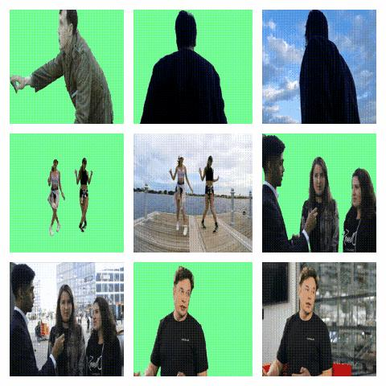
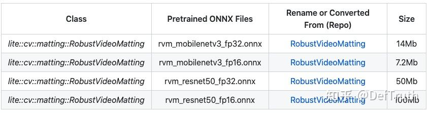
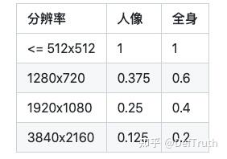

# [추론 배포] RobustVideoMatting C++ 프로젝트 기록: 응용편

> 원문: https://zhuanlan.zhihu.com/p/412491918

최근 TNN, MNN, NCNN, ONNXRuntime 사용 기록을 정리하고 있다. 나중에 같은 문제를 다시 만났을 때 빨리 확인하기 위한 기록이다. 관련 C++ inference example은 `Lite.AI.ToolKit`에 있다.

## 1. 소개

최근 ByteDance가 새 generation video matting model인 **RobustVideoMatting**을 공개했고, 며칠 전 official code와 model을 다시 release했다. 결과가 좋아 보여서 이 model을 직접 작성한 C++ toolbox `Lite.AI.ToolKit`에 통합했다. RobustVideoMatting에서 제공하는 MobileNetV3 version model을 사용해 demo를 실행했고 결과는 괜찮았다.



이 글은 RobustVideoMatting C++ version의 **응용편**이다. `Lite.AI.ToolKit`을 기반으로 RobustVideoMatting을 직접 사용해 **video matting**과 **image matting**을 수행하는 방법을 설명한다. 구현에는 video matting과 image matting 기능이 모두 포함되어 있다. 다음 구현편에서는 구체적인 engineering implementation을 설명한다.

RobustVideoMatting C++ version source는 ONNXRuntime C++ API로 구현되었고 `Lite.AI.ToolKit` toolbox에서 확인할 수 있다. 이 사례는 macOS에서 compile한 `liblite.ai.toolkit.v0.1.0.dylib` 기반이다. macOS 사용자는 project에 포함된 `liblite.ai.toolkit.v0.1.0` dynamic library와 다른 dependency를 바로 사용할 수 있다.

macOS가 아닌 사용자는 `Lite.AI.ToolKit` source를 받아 compile해야 한다. `Lite.AI.ToolKit` C++ toolbox는 macOS/Linux/Windows에서 compile test를 통과했고, CPU/GPU 환경을 지원하며, 70개 이상의 open source model을 포함한다.

## 2. C++ version source

RobustVideoMatting C++ version implementation source는 아래에서 확인할 수 있다.

- https://github.com/DefTruth/lite.ai.toolkit/blob/main/lite/ort/cv/rvm.cpp
- https://github.com/DefTruth/lite.ai.toolkit/blob/main/lite/ort/cv/rvm.h

## 3. 모델 파일

제공된 링크(Baidu Drive code: `8gin`)에서 받을 수 있고, RobustVideoMatting official repository에서도 받을 수 있다.



## 4. Interface 문서

`Lite.AI.ToolKit`에서 RobustVideoMatting 구현 class는 다음과 같다.

```cpp
class LITE_EXPORTS lite::cv::matting::RobustVideoMatting;
```

이 type은 현재 public interface 두 개를 포함한다. `detect`는 image matting에 사용하고, `detect_video`는 video matting에 사용한다.

```cpp
/**
     * Image Matting Using RVM(https://github.com/PeterL1n/RobustVideoMatting)
     * @param mat: cv::Mat BGR HWC
     * @param content: types::MattingContent to catch the detected results.
     * @param downsample_ratio: 0.25 by default.
     * See https://github.com/PeterL1n/RobustVideoMatting/blob/master/documentation/inference_zh_Hans.md
     */
    void detect(const cv::Mat &mat, types::MattingContent &content,
                float downsample_ratio = 0.25f);
    /**
     * Video Matting Using RVM(https://github.com/PeterL1n/RobustVideoMatting)
     * @param video_path: eg. xxx/xxx/input.mp4
     * @param output_path: eg. xxx/xxx/output.mp4
     * @param contents: vector of MattingContent to catch the detected results.
     * @param save_contents: false by default, whether to save MattingContent.
     * @param downsample_ratio: 0.25 by default.
     * See https://github.com/PeterL1n/RobustVideoMatting/blob/master/documentation/inference_zh_Hans.md
     * @param writer_fps: FPS for VideoWriter, 20 by default.
     */
    void detect_video(const std::string &video_path,
                      const std::string &output_path,
                      std::vector<types::MattingContent> &contents,
                      bool save_contents = false,
                      float downsample_ratio = 0.25f,
                      unsigned int writer_fps = 20);
```

`detect` interface input parameter:

- `mat`: `cv::Mat`, BGR format image.
- `content`: `types::MattingContent`. detection result를 저장한다. `cv::Mat` type member 세 개를 포함한다.
- `fgr_mat`: `cv::Mat (H,W,C=3) BGR`, value range `0~255`, `CV_8UC3`. 추정 foreground 저장.
- `pha_mat`: `cv::Mat (H,W,C=1)`, value range `0.~1.`, `CV_32FC1`. 추정 alpha 또는 matte 값 저장.
- `merge_mat`: `cv::Mat (H,W,C=3) BGR`, value range `0~255`, `CV_8UC3`. `pha`로 foreground/background를 합성한 image 저장.
- `flag`: bool flag. detection 성공 여부.
- `downsample_ratio`: float downsample ratio. default `0.25f`. 값 설정은 official 문서를 참고한다.



model은 내부적으로 high-resolution input을 줄여 rough processing을 하고, 다시 upsample해 refinement를 수행한다. `downsample_ratio`는 축소 후 resolution이 256~512 pixel 사이에 들어오도록 설정하는 것이 권장된다. 예를 들어 `1920x1080` input에 `downsample_ratio=0.25`를 쓰면 축소 후 resolution이 `480x270`이므로 256~512 범위에 있다. video content에 따라 `downsample_ratio`를 조정한다. 상반신 인물 영상이면 낮은 `downsample_ratio`로 충분하고, 전신 인물 영상이면 더 높은 `downsample_ratio`를 시도할 수 있다. 단 너무 높은 `downsample_ratio`는 오히려 효과를 낮춘다.

`detect_video` interface input parameter:

- `video_path`: input video path.
- `output_path`: output video path.
- `contents`: `MattingContent` vector. 각 frame의 detection result 저장.
- `save_contents`: bool. 각 frame result 저장 여부. default `false`. resolution이 클 때 모든 result를 저장하면 memory를 많이 사용한다.
- `downsample_ratio`: float downsample ratio. default `0.25f`. 위와 같다.
- `writer_fps`: output video FPS. default `20`.

## 5. 사용 사례

여기서는 MobileNetV3 version RVM model을 사용한다. ResNet50 version model을 쓰면 더 높은 accuracy를 얻을 수 있다.

### 5.1 Image matting 사례

```cpp
#include "lite/lite.h"

// Image Matting Interface
static void test_image()
{
  std::string onnx_path = "../hub/onnx/cv/rvm_mobilenetv3_fp32.onnx";
  std::string img_path = "../examples/lite/resources/test.jpg";
  std::string save_fgr_path = "../logs/test_lite_rvm_fgr.jpg";
  std::string save_pha_path = "../logs/test_rvm_pha.jpg";
  std::string save_merge_path = "../logs/test_lite_rvm_merge.jpg";

  auto *rvm = new lite::cv::matting::RobustVideoMatting(onnx_path, 16); // 16 threads
  lite::cv::types::MattingContent content;
  cv::Mat img_bgr = cv::imread(img_path);

  // 1. image matting.
  rvm->detect(img_bgr, content, 0.25f);

  if (content.flag)
  {
    if (!content.fgr_mat.empty()) cv::imwrite(save_fgr_path, content.fgr_mat); // predicted foreground fgr
    if (!content.pha_mat.empty()) cv::imwrite(save_pha_path, content.pha_mat * 255.); // predicted foreground pha
    if (!content.merge_mat.empty()) cv::imwrite(save_merge_path, content.merge_mat); // composite image
  }

  delete rvm;
}
```

출력 결과는 차례대로 원본 image, predicted `pha`, predicted foreground `fgr`, composite image다.


### 5.2 Video matting 사례

```cpp
#include "lite/lite.h"

// Video Matting Interface
static void test_video()
{
  std::string onnx_path = "../hub/onnx/cv/rvm_mobilenetv3_fp32.onnx";
  std::string video_path = "../examples/lite/resources/tesla.mp4";
  std::string output_path = "../logs/tesla_onnx.mp4";

  auto *rvm = new lite::cv::matting::RobustVideoMatting(onnx_path, 16); // 16 threads
  std::vector<lite::cv::types::MattingContent> contents;

  // 1. video matting.
  rvm->detect_video(video_path, output_path, contents, false, 0.4f);

  delete rvm;
}
```

출력 결과:


더 많은 video demo 결과:


## 6. Compile과 실행

이번 사례에 사용한 모든 code는 아래 project에 있다.

macOS에서는 `RobustVideoMatting.lite.ai.toolkit.git`를 받아 바로 compile/run할 수 있고 별도 dependency download가 필요 없다. 다른 system에서는 `Lite.AI.ToolKit` source를 받아 먼저 `liblite.ai.toolkit.v0.1.0` dynamic library를 compile해야 한다.

```bash
git clone --depth=1 https://github.com/DefTruth/RobustVideoMatting.lite.ai.toolkit.git
cd RobustVideoMatting.lite.ai.toolkit
sh ./build.sh
```

Build와 test 정보:

```text
-- Generating done
-- Build files have been written to: /Users/xxx/Desktop/xxx/RobustVideoMatting.lite.ai.toolkit/examples/build
[ 50%] Building CXX object CMakeFiles/lite_rvm.dir/examples/test_lite_rvm.cpp.o
[100%] Linking CXX executable lite_rvm
[100%] Built target lite_rvm
Testing Start ...
Load ../hub/onnx/cv/rvm_mobilenetv3_fp32.onnx done!
write done! 1/774 done!
write done! 2/774 done!
write done! 3/774 done!
write done! 4/774 done!
write done! 5/774 done!
write done! 6/774 done!
...
write done! 724/774 done!
Testing Successful !
```

추천 글:

- [1]
- [2] YOLOP ONNXRuntime C++ engineering record
- [3] YOLOX ONNXRuntime C++ demo
- [4] YOLOv5 ONNXRuntime C++ demo
- [5] YOLOR ONNXRuntime C++ demo
- [6] YOLOv4 ONNXRuntime C++ demo
- [7] ONNXRuntime C++ CMake project analysis and compile
- [8] RobustVideoMatting 2021 ONNXRuntime C++ engineering record, implementation part
- [9] RobustVideoMatting 2021 latest video matting, C++ engineering record, application part

