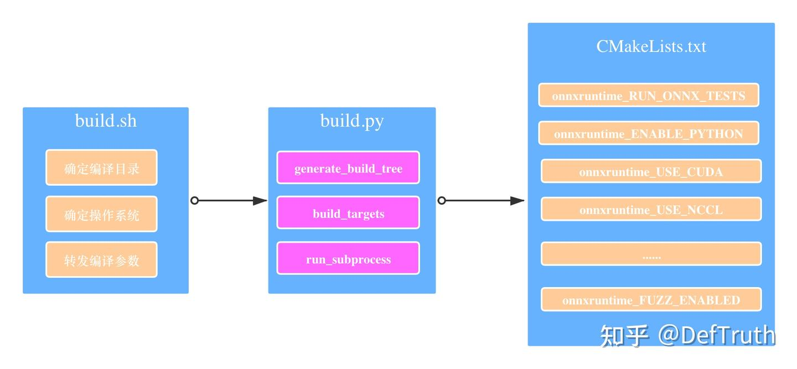
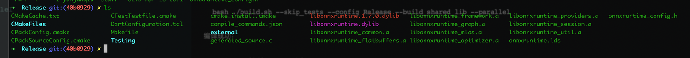
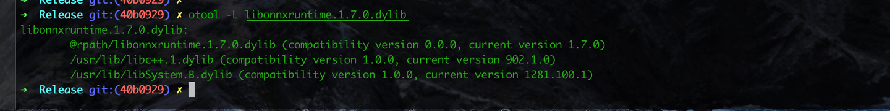

# MacOS에서 ONNXRuntime을 소스에서 컴파일하기

> 원문: https://zhuanlan.zhihu.com/p/411887386

한동안 업데이트가 없었다. 최근 TNN, MNN, NCNN, ONNXRuntime 사용 note를 정리하려 한다. 좋은 기억력보다 낡은 필기가 낫다. 기억력도 좋지 않으니, 나중에 같은 구덩이에 빠졌을 때 더 빨리 기어 나오기 위한 기록이다.

Lite.AI.ToolKit에는 현재 80개가 넘는 C++ inference example이 있고, library로 build해 사용할 수 있다. 관심이 있으면 보면 된다.

- Lite.AI.ToolKit: 즉시 사용할 수 있는 C++ AI model toolkit. 평소 새 algorithm을 학습할 때 만든 것이며 현재 80개 이상의 open-source model을 포함한다. https://github.com/DefTruth/lite.ai.toolkit

최근 몇 편의 글을 이어서 업데이트할 예정이다.

## MacOS 소스 컴파일 ONNXRuntime

## 1. git branch 가져오기

```bash
git clone --depth=1 --branch v1.7.0 https://github.com.cnpmjs.org/microsoft/onnxruntime.git
```

`--depth=1 --branch v1.7.0`은 branch `v1.7.0`의 최신 commit만 가져온다는 뜻이다. 이 parameter를 지정하지 않으면 모든 history version을 가져온다. `.cnpmjs.org` suffix는 `github.com.cnpmjs.org`를 이용해 GitHub repository download를 빠르게 하는 방법을 참고한 것이다. `~/.gitconfig` file을 직접 수정해 같은 목적을 달성할 수도 있다.

## 2. build.sh compile option 해석

### 2.1 build.sh source 분석

먼저 이 script가 어떻게 생겼는지 본다.

```bash
#!/bin/bash
# Get directory this script is in
DIR="$( cd "$( dirname "${BASH_SOURCE[0]}" )" && pwd )"
OS=$(uname -s)
if [ "$OS" = "Darwin" ]; then
    DIR_OS="MacOS"
else
    DIR_OS="Linux"
fi

if [[ "$*" == *"--ios"* ]]; then
    DIR_OS="iOS"
elif [[ "$*" == *"--android"* ]]; then
    DIR_OS="Android"
fi
#requires python3.6 or higher
python3 $DIR/tools/ci_build/build.py --build_dir $DIR/build/$DIR_OS "$@"
```

`build.sh`가 하는 일은 사실 operation system type을 판단하고 current directory를 얻은 뒤, compile parameter `"$@"`를 그대로 `build.py` script에 넘기는 것뿐이다. 따라서 실제 build process는 모두 이 script 안에 있다.

```text
onnxruntime git:(40b0929) DIR="$( cd "$( dirname "${BASH_SOURCE[0]}" )" && pwd )"
onnxruntime git:(40b0929) echo ${DIR}
/Users/xxx/xxx/third_party/library/onnxruntime
onnxruntime git:(40b0929) OS=$(uname -s)
onnxruntime git:(40b0929) echo ${OS}
Darwin
```

### 2.2 build.py script 및 compile option

`tools/ci_build/build.py`를 열어 보면 code가 꽤 많다. 여러 platform build 설정을 모두 처리한다. 세부 내용은 직접 읽으면 되고, 여기서는 key option만 나열한다. MacOS CPU(x86_64) version만 compile한다면 주로 다음 parameter를 보면 된다.

```python
    # Main arguments
    parser.add_argument(
        "--build_dir", required=True, help="Path to the build directory.")
    parser.add_argument(
        "--config", nargs="+", default=["Debug"],
        choices=["Debug", "MinSizeRel", "Release", "RelWithDebInfo"],
        help="Configuration(s) to build.")
    parser.add_argument(
        "--update", action='store_true', help="Update makefiles.")
    parser.add_argument("--build", action='store_true', help="Build.")
    parser.add_argument(
        "--parallel", nargs='?', const='0', default='1', type=int,
        help="Use parallel build. The optional value specifies the maximum number of parallel jobs. "
             "If the optional value is 0 or unspecified, it is interpreted as the number of CPUs.")
    parser.add_argument(
        "--skip_tests", action='store_true', help="Skip all tests.")
    # Build a shared lib
    parser.add_argument(
        "--build_shared_lib", action='store_true',
        help="Build a shared library for the ONNXRuntime.")
```

Parameter 설명:

- `--build_dir`: compile된 library file을 저장할 path를 지정한다. 비워 둘 수 없다.
- `--config`: compile할 library type을 지정한다. `Debug`, `MinSizeRel`, `Release`, `RelWithDebInfo` 네 가지를 고를 수 있다. `MinSizeRel`은 target file size를 줄이는 데 사용할 수 있다. 최종적으로는 `MinSizeRel` version dynamic library를 사용했다.
- `--update`: makefile file을 update할지 여부다. `action='store_true'`는 command line에 `--update`를 지정하면 `args.update`가 `True`로 설정되고, 지정하지 않으면 `False`라는 뜻이다. 따라서 `action='store_true'`가 지정된 parameter의 default는 모두 `False`다.
- `--parallel`: multi-core parallel build를 사용할지 여부다. 그냥 사용하면 된다.
- `--skip_tests`: unit test를 skip할지 여부다. skip하지 않으면 compile process가 훨씬 느려지므로 skip하는 것을 권장한다.
- `--build_shared_lib`: dynamic library를 compile하려면 이 parameter를 지정해야 한다. 지정하지 않으면 static library가 compile된다.

이 몇 가지 방식으로 compile한 target file size는 다음과 같다. Debug version은 compile하지 않았다.

```text
RelWithDebInfo  19MB
Release         15MB
MinSizeRel      12MB
```

다음 문제는 이 compile option들이 어떻게 CMake와 연결되어 전체 build process를 이어 주느냐다. 이는 주로 `generate_build_tree` function을 통해 이뤄진다. function이 너무 길기 때문에 핵심 부분만 발췌한다.

```python
def generate_build_tree(cmake_path, source_dir, build_dir, cuda_home, cudnn_home, rocm_home,
                        mpi_home, nccl_home, tensorrt_home, migraphx_home, acl_home, acl_libs, armnn_home, armnn_libs,
                        path_to_protoc_exe, configs, cmake_extra_defines, args, cmake_extra_args):
    log.info("Generating CMake build tree")
    # This line is important. It determines the path of CMakeLists.txt used to initialize the CMake build.
    # That is your-path-to/onnxruntime/cmake/CMakeLists.txt
    cmake_dir = os.path.join(source_dir, "cmake")
    # Only part of the options is shown.
    cmake_args = [
        cmake_path, cmake_dir,
        "-Donnxruntime_RUN_ONNX_TESTS=" + ("ON" if args.enable_onnx_tests else "OFF"),
        "-Donnxruntime_BUILD_WINML_TESTS=" + ("OFF" if args.skip_winml_tests else "ON"),
        "-Donnxruntime_GENERATE_TEST_REPORTS=ON",
        # Need to use 'is not None' with minimal_build check as it could be an empty list.
        "-Donnxruntime_MINIMAL_BUILD=" + ("ON" if args.minimal_build is not None else "OFF"),
        "-Donnxruntime_EXTENDED_MINIMAL_BUILD=" + ("ON" if args.minimal_build and 'extended' in args.minimal_build
                                                   else "OFF"),
        "-Donnxruntime_MINIMAL_BUILD_CUSTOM_OPS=" + ("ON" if args.minimal_build and 'custom_ops' in args.minimal_build
                                                     else "OFF"),
        "-Donnxruntime_REDUCED_OPS_BUILD=" + ("ON" if args.include_ops_by_config else "OFF"),
        "-Donnxruntime_MSVC_STATIC_RUNTIME=" + ("ON" if args.enable_msvc_static_runtime else "OFF"),
        # enable pyop if it is nightly build
        "-Donnxruntime_ENABLE_LANGUAGE_INTEROP_OPS=" + ("ON" if args.enable_language_interop_ops else "OFF"),
        "-Donnxruntime_USE_DML=" + ("ON" if args.use_dml else "OFF"),
        "-Donnxruntime_USE_WINML=" + ("ON" if args.use_winml else "OFF"),
        "-Donnxruntime_BUILD_MS_EXPERIMENTAL_OPS=" + ("ON" if args.ms_experimental else "OFF"),
        "-Donnxruntime_USE_TELEMETRY=" + ("ON" if args.use_telemetry else "OFF"),
        "-Donnxruntime_ENABLE_LTO=" + ("ON" if args.enable_lto else "OFF"),
        "-Donnxruntime_USE_ACL=" + ("ON" if args.use_acl else "OFF"),
        "-Donnxruntime_USE_ACL_1902=" + ("ON" if args.use_acl == "ACL_1902" else "OFF"),
        "-Donnxruntime_USE_ACL_1905=" + ("ON" if args.use_acl == "ACL_1905" else "OFF"),
        "-Donnxruntime_USE_ACL_1908=" + ("ON" if args.use_acl == "ACL_1908" else "OFF"),
        "-Donnxruntime_USE_ACL_2002=" + ("ON" if args.use_acl == "ACL_2002" else "OFF"),
        "-Donnxruntime_USE_ARMNN=" + ("ON" if args.use_armnn else "OFF"),
        "-Donnxruntime_ARMNN_RELU_USE_CPU=" + ("OFF" if args.armnn_relu else "ON"),
        "-Donnxruntime_ARMNN_BN_USE_CPU=" + ("OFF" if args.armnn_bn else "ON"),
        # Many options are omitted. Read build.py source if interested.
        "-Donnxruntime_USE_MPI=" + ("ON" if args.use_mpi else "OFF"),
        "-Donnxruntime_ENABLE_MEMORY_PROFILE=" + ("ON" if args.enable_memory_profile else "OFF"),
    ]
    # A large block is omitted.
    for config in configs:
        config_build_dir = get_config_build_dir(build_dir, config)
        os.makedirs(config_build_dir, exist_ok=True)
        if args.use_nuphar:
            os.environ["PATH"] = os.path.join(
                config_build_dir, "external", "tvm",
                config) + os.pathsep + os.path.dirname(sys.executable) + os.pathsep + os.environ["PATH"]
        # The compile command is executed here.
        run_subprocess(
            cmake_args + [
                "-Donnxruntime_ENABLE_MEMLEAK_CHECKER=" +
                ("ON" if config.lower() == 'debug' and not args.use_nuphar and not
                 args.use_openvino and not
                 args.enable_msvc_static_runtime
                 else "OFF"), "-DCMAKE_BUILD_TYPE={}".format(config)],
            cwd=config_build_dir)
```

위에서 가장 중요한 부분은 두 가지다. 첫 번째는 `CMakeLists.txt` project file path를 결정한다는 점이다. 이 file이 전체 build의 entry다. 두 번째는 다른 function을 호출해 build process를 실행한다는 점이다.

```python
def run_subprocess(args, cwd=None, capture_stdout=False, dll_path=None,
                   shell=False, env={}):
    if isinstance(args, str):
        raise ValueError("args should be a sequence of strings, not a string")

    my_env = os.environ.copy()
    if dll_path:
        if is_windows():
            my_env["PATH"] = dll_path + os.pathsep + my_env["PATH"]
        else:
            if "LD_LIBRARY_PATH" in my_env:
                my_env["LD_LIBRARY_PATH"] += os.pathsep + dll_path
            else:
                my_env["LD_LIBRARY_PATH"] = dll_path

    my_env.update(env)

    return run(*args, cwd=cwd, capture_stdout=capture_stdout, shell=shell, env=my_env)
```

모든 detail을 제쳐 두면 이 긴 code가 하는 일은 결국 다음과 같다.

```bash
cmake your-path-to/onnxruntime/cmake -Donnxruntime_RUN_ONNX_TESTS=OFF -Donnxruntime_BUILD_WINML_TESTS=OFF ...
```

즉 일반적인 CMake project build information initialization 과정이다. 그런데 여기까지는 build information만 initialize했을 뿐, 구체적인 build는 아직 없다. `build.py`의 `main` function을 더 파 보면 된다.

```python
def main():
    # A large block is omitted.
    # This is a code fragment from build.py main.
        if args.enable_pybind and is_windows():
            install_python_deps(args.numpy_version)
        if args.enable_onnx_tests:
            setup_test_data(build_dir, configs)
        # Initialize build information.
        generate_build_tree(
            cmake_path, source_dir, build_dir, cuda_home, cudnn_home, rocm_home, mpi_home, nccl_home,
            tensorrt_home, migraphx_home, acl_home, acl_libs, armnn_home, armnn_libs,
            path_to_protoc_exe, configs, cmake_extra_defines, args, cmake_extra_args)

    if args.build:
        if args.parallel < 0:
            raise BuildError("Invalid parallel job count: {}".format(args.parallel))
        num_parallel_jobs = os.cpu_count() if args.parallel == 0 else args.parallel
        # The build process is here.
        build_targets(args, cmake_path, build_dir, configs, num_parallel_jobs, args.target)
```

마지막 build는 `build_targets` function 안에 있다. 이 function은 다음과 같다.

```python
def build_targets(args, cmake_path, build_dir, configs, num_parallel_jobs, target=None):
    for config in configs:
        log.info("Building targets for %s configuration", config)
        build_dir2 = get_config_build_dir(build_dir, config)
        cmd_args = [cmake_path,
                    "--build", build_dir2,
                    "--config", config]
        if target:
            cmd_args.extend(['--target', target])

       # omitted
        run_subprocess(cmd_args, env=env)
```

전체적으로 이 function은 다음과 비슷한 command를 실행한다.

```bash
cmake --build your-path-to/onnxruntime/build/MacOS/Release --config Release
```

이로써 process가 끝난다. 정리하면 다음과 같다.



## 3. CMakeLists project file 소개

### 3.1 CMakeLists의 compile option

앞 절에서 `build.py`가 실제로는 일련의 project initialization과 build 문제를 처리한다고 설명했다. `generate_build_tree` 안의 모든 compile option은 이 `CMakeLists.txt`에서 preset value를 찾을 수 있다. 예시는 다음과 같다.

```cmake
if(NOT CMAKE_BUILD_TYPE)
  message(STATUS "Build type not set - using RelWithDebInfo")
  set(CMAKE_BUILD_TYPE "RelWithDebInfo" CACHE STRING "Choose build type: Debug Release RelWithDebInfo MinSizeRel." FORCE)
endif()

# Options
option(onnxruntime_RUN_ONNX_TESTS "Enable ONNX Compatibility Testing" OFF)
option(onnxruntime_GENERATE_TEST_REPORTS "Enable test report generation" OFF)
option(onnxruntime_ENABLE_STATIC_ANALYSIS "Enable static analysis" OFF)
option(onnxruntime_ENABLE_PYTHON "Enable python buildings" OFF)
# Enable it may cause LNK1169 error
option(onnxruntime_ENABLE_MEMLEAK_CHECKER "Experimental: Enable memory leak checker in Windows debug build" OFF)
option(onnxruntime_USE_CUDA "Build with CUDA support" OFF)
option(onnxruntime_ENABLE_CUDA_LINE_NUMBER_INFO "When building with CUDA support, generate device code line number information." OFF)
option(onnxruntime_USE_OPENVINO "Build with OpenVINO support" OFF)
option(onnxruntime_USE_COREML "Build with CoreML support" OFF)
option(onnxruntime_USE_NNAPI_BUILTIN "Build with builtin NNAPI lib for Android NNAPI support" OFF)
option(onnxruntime_USE_RKNPU "Build with RKNPU support" OFF)
option(onnxruntime_USE_DNNL "Build with DNNL support" OFF)
option(onnxruntime_USE_FEATURIZERS "Build ML Featurizers support" OFF)
option(onnxruntime_DEV_MODE "Enable developer warnings and treat most of them as error." OFF)
option(onnxruntime_MSVC_STATIC_RUNTIME "Compile for the static CRT" OFF)
option(onnxruntime_GCC_STATIC_CPP_RUNTIME "Compile for the static libstdc++" OFF)
option(onnxruntime_BUILD_UNIT_TESTS "Build ONNXRuntime unit tests" ON)
option(onnxruntime_BUILD_CSHARP "Build C# library" OFF)
option(onnxruntime_USE_PREINSTALLED_EIGEN "Use pre-installed EIGEN. Need to provide eigen_SOURCE_PATH if turn this on." OFF)
option(onnxruntime_BUILD_BENCHMARKS "Build ONNXRuntime micro-benchmarks" OFF)
# Many options are omitted.
```

`generate_build_tree`는 runtime에 우리가 전달한 실제 parameter에 따라 `CMakeLists.txt`의 preset value를 수정한다.

### 3.2 PRIVATE link에 대한 이해

```cmake
# In case we are building static libraries, link also the runtime library statically
    # so that MSVCR*.DLL is not required at runtime.
    # https://msdn.microsoft.com/en-us/library/2kzt1wy3.aspx
    # This is achieved by replacing msvc option /MD with /MT and /MDd with /MTd
    # https://gitlab.kitware.com/cmake/community/wikis/FAQ#how-can-i-build-my-msvc-application-with-a-static-runtime
```

이 부분은 아직 완전히 이해한 것은 아니다. 대략적인 이해는 다음과 같다. 지정된 `onnxruntime` dynamic library에 많은 `PRIVATE` dependency를 추가한다. 그리고 모든 dependency는 static이다. `add_library`는 기본적으로 static library를 추가하고, dependency library가 추가될 때 `SHARED`가 지정되지 않았기 때문이다.

`PRIVATE`는 이 dependency library들이 `onnxruntime` link stage에서만 필요하다는 뜻이다. `onnxruntime` source 안의 cpp file은 dependency library header를 include하지만, `onnxruntime`이 user에게 노출하는 header file은 dependency library header를 include하지 않는다. 따라서 compile과 link가 끝난 뒤에는 `onnxruntime` 자체 header만 있으면 되고, third-party library header는 신경 쓰지 않아도 된다. `PRIVATE`, `PUBLIC`, `INTERFACE`의 의미와 생성된 so library의 관계를 참고하면 된다.

```cmake
# From onnxruntime.cmake
if(WIN32)
    onnxruntime_add_shared_library(onnxruntime
      ${SYMBOL_FILE}
      "${ONNXRUNTIME_ROOT}/core/dll/dllmain.cc"
      "${ONNXRUNTIME_ROOT}/core/dll/onnxruntime.rc"
    )
else()
    onnxruntime_add_shared_library(onnxruntime ${CMAKE_CURRENT_BINARY_DIR}/generated_source.c)
endif()
# From CMakeLists.txt
function(onnxruntime_add_shared_library target_name)
  add_library(${target_name} SHARED ${ARGN})
  target_link_directories(${target_name} PRIVATE ${onnxruntime_LINK_DIRS})
  if (MSVC)
    target_compile_options(${target_name} PRIVATE "$<$<COMPILE_LANGUAGE:CUDA>:SHELL:--compiler-options /utf-8>" "$<$<NOT:$<COMPILE_LANGUAGE:CUDA>>:/utf-8>")
    target_compile_options(${target_name} PRIVATE "$<$<COMPILE_LANGUAGE:CUDA>:SHELL:--compiler-options /sdl>" "$<$<NOT:$<COMPILE_LANGUAGE:CUDA>>:/sdl>")
    set_target_properties(${target_name} PROPERTIES VS_CA_EXCLUDE_PATH "${CMAKE_CURRENT_SOURCE_DIR}")
  else()
    target_compile_definitions(${target_name} PUBLIC -DNSYNC_ATOMIC_CPP11)
    target_include_directories(${target_name} PRIVATE "${CMAKE_CURRENT_SOURCE_DIR}/external/nsync/public")
  endif()
  target_include_directories(${target_name} PRIVATE ${CMAKE_CURRENT_BINARY_DIR} ${ONNXRUNTIME_ROOT})
  if(onnxruntime_ENABLE_LTO)
    set_target_properties(${target_name} PROPERTIES INTERPROCEDURAL_OPTIMIZATION_RELEASE TRUE)
    set_target_properties(${target_name} PROPERTIES INTERPROCEDURAL_OPTIMIZATION_RELWITHDEBINFO TRUE)
    set_target_properties(${target_name} PROPERTIES INTERPROCEDURAL_OPTIMIZATION_MINSIZEREL TRUE)
  endif()
endfunction()
# From onnxruntime.cmake
target_link_libraries(onnxruntime PRIVATE
    onnxruntime_session
    ${onnxruntime_libs}
    ${PROVIDERS_CUDA}
    ${PROVIDERS_NNAPI}
    ${PROVIDERS_RKNPU}
    ${PROVIDERS_MIGRAPHX}
    ${PROVIDERS_NUPHAR}
    ${PROVIDERS_VITISAI}
    ${PROVIDERS_DML}
    ${PROVIDERS_ACL}
    ${PROVIDERS_ARMNN}
    ${PROVIDERS_INTERNAL_TESTING}
    ${onnxruntime_winml}
    ${PROVIDERS_ROCM}
    ${PROVIDERS_COREML}
    onnxruntime_optimizer
    onnxruntime_providers
    onnxruntime_util
    ${onnxruntime_tvm_libs}
    onnxruntime_framework
    onnxruntime_graph
    onnxruntime_common
    onnxruntime_mlas
    onnxruntime_flatbuffers
    ${onnxruntime_EXTERNAL_LIBRARIES})
```

## 4. Source compile과 brew install의 차이

관련 참고 항목:

- `@rpath` 관련 지식
- Mac dynamic library path 문제 정리
- Mac dylib dynamic library load path 문제
- `otool`의 몇 가지 용도
- iOS reverse engineering - `otool` command 입문

길게 설명했지만 MacOS에서는 사실 brew 한 줄이면 설치할 수 있다.

```bash
brew update
brew install onnxruntime
```

하지만 `onnxruntime` Formula source를 보면 brew install 후에는 `make install`을 실행해 default system directory에 설치한다. dynamic library dependency path도 absolute path, 즉 `usr/local/...` 같은 형태다. `install_name_tool`로 수정하려고 시도했지만 성공하지 못했다. `onnxruntime` Formula source를 일부 붙인다.

```ruby
def install
    cmake_args = %W[
      -Donnxruntime_RUN_ONNX_TESTS=OFF
      -Donnxruntime_GENERATE_TEST_REPORTS=OFF
      -DPYTHON_EXECUTABLE=#{Formula["python@3.9"].opt_bin}/python3
      -Donnxruntime_BUILD_SHARED_LIB=ON
      -Donnxruntime_BUILD_UNIT_TESTS=OFF
    ]

    mkdir "build" do
      system "cmake", "../cmake", *std_cmake_args, *cmake_args
      system "make", "install"
    end
  end
```

## 5. Compile process

남은 일은 compile command를 실행하는 것이다. 물론 여기에도 문제가 하나 있을 수 있다. Compile 전에 ONNXRuntime third-party library를 먼저 sync해야 한다. 그렇지 않으면 compile이 실패한다. ONNXRuntime official `onnxruntime-MacOS CI Pipeline`을 참고할 수 있다.

먼저 compile에 필요한 third-party library를 sync한다.

```bash
git  submodule update --init --force --recursive
```

network 접근 문제가 있으면 `github.com.cnpmjs.org`를 이용한 GitHub repository download 가속 방법을 참고하면 된다. dependency library의 dependency library도 있으므로 꽤 많은 third-party library를 내려받아야 한다. 그래도 수는 셀 수 있는 정도다. 나는 직접 `github.com` 뒤에 `cnpmjs.org`를 추가했다. 예시는 다음과 같다.

```bash
cd .git
vim config
```

다음과 같이 수정한다.

```text
[core]
    repositoryformatversion = 0
    filemode = true
    bare = false
    logallrefupdates = true
    ignorecase = true
    precomposeunicode = true
[remote "origin"]
    url = https://github.com.cnpmjs.org/microsoft/onnxruntime.git
    fetch = +refs/tags/v1.7.0:refs/tags/v1.7.0
```

Compile한다.

```bash
bash ./build.sh --skip_tests --config RelWithDebInfo --build_shared_lib --parallel

bash ./build.sh --skip_tests --config MinSizeRel --build_shared_lib --parallel

bash ./build.sh --skip_tests --config Release --build_shared_lib --parallel
```

Compile success:

```text
[ 98%] Building CXX object CMakeFiles/onnxruntime_providers.dir/Users/xxx/Desktop/third_party/library/onnxruntime/onnxruntime/contrib_ops/cpu/skip_layer_norm.cc.o
[ 98%] Building CXX object CMakeFiles/onnxruntime_providers.dir/Users/xxx/Desktop/third_party/library/onnxruntime/onnxruntime/contrib_ops/cpu/tokenizer.cc.o
[100%] Building CXX object CMakeFiles/onnxruntime_providers.dir/Users/xxx/Desktop/third_party/library/onnxruntime/onnxruntime/contrib_ops/cpu/trilu.cc.o
[100%] Building CXX object CMakeFiles/onnxruntime_providers.dir/Users/xxx/Desktop/third_party/library/onnxruntime/onnxruntime/contrib_ops/cpu/unique.cc.o
[100%] Building CXX object CMakeFiles/onnxruntime_providers.dir/Users/xxx/Desktop/third_party/library/onnxruntime/onnxruntime/contrib_ops/cpu/word_conv_embedding.cc.o
[100%] Linking CXX static library libonnxruntime_providers.a
/Library/Developer/CommandLineTools/usr/bin/ranlib: file: libonnxruntime_providers.a(dft.cc.o) has no symbols
/Library/Developer/CommandLineTools/usr/bin/ranlib: file: libonnxruntime_providers.a(window_functions.cc.o) has no symbols
/Library/Developer/CommandLineTools/usr/bin/ranlib: file: libonnxruntime_providers.a(dft.cc.o) has no symbols
/Library/Developer/CommandLineTools/usr/bin/ranlib: file: libonnxruntime_providers.a(window_functions.cc.o) has no symbols
[100%] Built target onnxruntime_providers
[100%] Building C object CMakeFiles/onnxruntime.dir/generated_source.c.o
[100%] Linking CXX shared library libonnxruntime.dylib
[100%] Built target onnxruntime
2021-04-15 22:39:10,495 util.run [DEBUG] - Subprocess completed. Return code: 0
2021-04-15 22:39:10,496 build [INFO] - Build complete
```

파일은 다음과 같다.



`otool`로 `libonnxruntime`의 dependency library path를 확인한다.



보기에는 정상이다. 내가 compile한 dynamic library `libonnxruntime.1.7.0.dylib`와 몇 가지 C++ interface 사용 예제 `onnxruntime-c++-examples`는 해당 repository에서 찾을 수 있다. 문서 내용은 `onnxruntime-mac-x86_64-build.zh.md`에 있다.

## 6. 참고 자료

- [1] onnxruntime-MacOS CI Pipeline
- [2] Homebrew Formula for onnxruntime
- [3] ONNXRuntime source compile
- [4] ONNXRuntime compile option analysis

## 7. 추천 글

- [1] YOLOP ONNXRuntime C++ engineering record
- [2] YOLOX ONNXRuntime C++ Demo
- [3] YOLOv5 ONNXRuntime C++ Demo
- [4] YOLOR ONNXRuntime C++ Demo
- [5] YOLOv4 ONNXRuntime C++ Demo
- [6] Lite.AI.ToolKit: 즉시 사용할 수 있는 C++ AI model toolkit
- [7] RobustVideoMatting 2021 ONNXRuntime C++ engineering record - implementation
- [8] RobustVideoMatting 2021 최신 video matting, C++ engineering record - application

정리는 쉽지 않다. 계속 업데이트한다. 팔로우, 좋아요, 저장을 누르면 된다.
