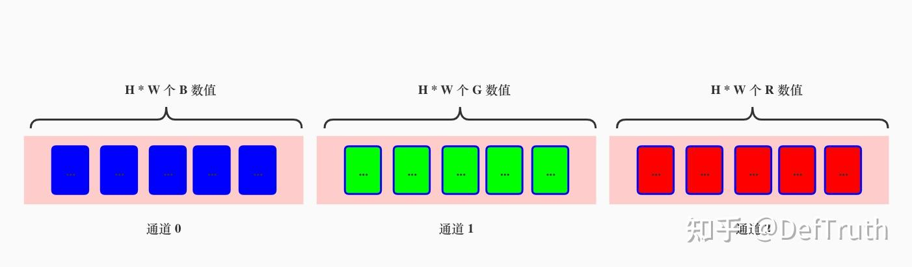
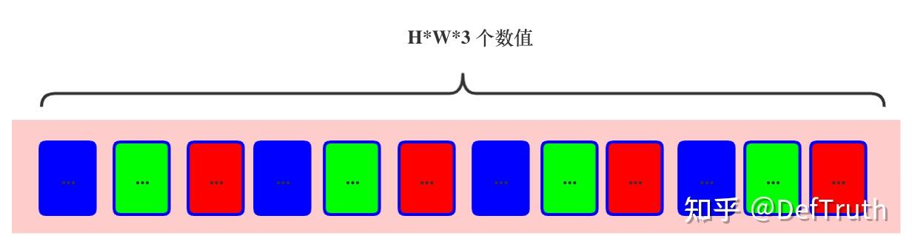

# [배포][ORT] ONNXRuntime C++에서 NCHW와 NHWC 입력 처리

> 원문: https://zhuanlan.zhihu.com/p/524230808

목차

- 0. 서문
- 1. data preprocessing에서 ONNXRuntime과 다른 framework의 차이
- 2. ONNXRuntime C++에서 NCHW와 NHWC input 처리
- 3. NCHW와 NHWC 실제 사용 예시
- 4. 정리

### 0. 서문

단오 연휴를 틈타 이전 노트를 기록한다. 여전히 같은 말이다. 좋은 기억력보다 엉성한 기록이 낫다. 가벼운 글을 쓰는 것도 output이자 input이다.

### 1. data preprocessing에서 ONNXRuntime과 다른 framework의 차이

preprocessing만 놓고 보면 ONNXRuntime의 C++ API는 그렇게 완전하지 않다. MNN에는 `MNN::CV` module이 있고, ncnn에는 `from_pixels` 같은 풍부한 preprocessing function이 있으며, TNN도 `Mat`을 구성할 때 data conversion format을 지정할 수 있다.

하지만 ONNXRuntime의 C++ interface는 자체 data processing interface를 제공하지 않는 것처럼 보인다. NCHW든 NHWC든 모두 직접 처리한 뒤 넣어야 한다. ONNXRuntime을 자주 사용해야 한다면 통일된 interface를 하나 감싸 두는 것이 매우 편하다. 이 글은 그 function 구현을 간단히 기록한다. 내용은 많지 않다.

### 2. ONNXRuntime C++에서 NCHW와 NHWC input 처리

- 먼저 function signature를 정의한다.

```cpp
namespace ortcv
{
  // specific utils for ONNXRuntime
  namespace utils
  {
    namespace transform
    {
      enum
      {
        CHW = 0, HWC = 1
      };

      /**
       * @param mat CV:Mat with type 'CV_32FC3|2|1'
       * @param tensor_dims e.g {1,C,H,W} | {1,H,W,C}
       * @param memory_info It needs to be a global variable in a class
       * @param tensor_value_handler It needs to be a global variable in a class
       * @param data_format CHW | HWC
       * @return
       */
      LITE_EXPORTS Ort::Value create_tensor(const cv::Mat &mat, const std::vector<int64_t> &tensor_dims,
                                            const Ort::MemoryInfo &memory_info_handler,
                                            std::vector<float> &tensor_value_handler,
                                            unsigned int data_format = CHW)
                                            throw(std::runtime_error);
     // ...
    }

  } // NAMESPACE UTILS
} // NAMESPACE ORTCV
```

먼저 `cv::Mat`에 의존해 간단히 구현한다. `tensor_value_handler`는 실제 data를 보유하는 `vector`다. ONNXRuntime에서 `Ort::Value::CreateTensor<float>(...)`로 새 tensor를 만들 때 실제 data를 보유하거나 copy하지 않는다. 이해가 틀렸다면 지적해도 된다. 이 함수는 실제 data에 대한 reference를 보유하고, memory의 linear layout data가 tensor(`Ort::Value`)의 dimension에 어떻게 mapping되는지 기록한다.

따라서 실제 data를 유지할 `tensor_value_handler` 같은 변수를 넘기지 않으면, custom function을 빠져나갈 때 `Ort::Value`가 가리키는 실제 data가 이미 release된다. 그러면 memory access error가 발생할 수 있다.

이제 NCHW와 NHWC 처리가 어떻게 구현되는지 본다. 사실 매우 단순하다.

- `create_tensor`에서 NCHW와 NHWC 처리

```cpp
#include "ort_utils.h"

//*************************************** ortcv::utils **********************************************//
Ort::Value ortcv::utils::transform::create_tensor(const cv::Mat &mat,
                                                  const std::vector<int64_t> &tensor_dims,
                                                  const Ort::MemoryInfo &memory_info_handler,
                                                  std::vector<float> &tensor_value_handler,
                                                  unsigned int data_format)
throw(std::runtime_error)
{
  const unsigned int rows = mat.rows;
  const unsigned int cols = mat.cols;
  const unsigned int channels = mat.channels();

  cv::Mat mat_ref;
  if (mat.type() != CV_32FC(channels)) mat.convertTo(mat_ref, CV_32FC(channels));
  else mat_ref = mat; // reference only. zero-time cost. support 1/2/3/... channels

  if (tensor_dims.size() != 4) throw std::runtime_error("dims mismatch.");
  if (tensor_dims.at(0) != 1) throw std::runtime_error("batch != 1");

  // CXHXW
  if (data_format == transform::CHW)
  {

    const unsigned int target_height = tensor_dims.at(2);
    const unsigned int target_width = tensor_dims.at(3);
    const unsigned int target_channel = tensor_dims.at(1);
    const unsigned int target_tensor_size = target_channel * target_height * target_width;
    if (target_channel != channels) throw std::runtime_error("channel mismatch.");

    tensor_value_handler.resize(target_tensor_size);

    cv::Mat resize_mat_ref;
    if (target_height != rows || target_width != cols)
      cv::resize(mat_ref, resize_mat_ref, cv::Size(target_width, target_height));
    else resize_mat_ref = mat_ref; // reference only. zero-time cost.

    std::vector<cv::Mat> mat_channels;
    cv::split(resize_mat_ref, mat_channels);
    // CXHXW
    for (unsigned int i = 0; i < channels; ++i)
      std::memcpy(tensor_value_handler.data() + i * (target_height * target_width),
                  mat_channels.at(i).data,target_height * target_width * sizeof(float));

    return Ort::Value::CreateTensor<float>(memory_info_handler, tensor_value_handler.data(),
                                           target_tensor_size, tensor_dims.data(),
                                           tensor_dims.size());
  }

  // HXWXC
  const unsigned int target_height = tensor_dims.at(1);
  const unsigned int target_width = tensor_dims.at(2);
  const unsigned int target_channel = tensor_dims.at(3);
  const unsigned int target_tensor_size = target_channel * target_height * target_width;
  if (target_channel != channels) throw std::runtime_error("channel mismatch!");
  tensor_value_handler.resize(target_tensor_size);

  cv::Mat resize_mat_ref;
  if (target_height != rows || target_width != cols)
    cv::resize(mat_ref, resize_mat_ref, cv::Size(target_width, target_height));
  else resize_mat_ref = mat_ref; // reference only. zero-time cost.

  std::memcpy(tensor_value_handler.data(), resize_mat_ref.data, target_tensor_size * sizeof(float));

  return Ort::Value::CreateTensor<float>(memory_info_handler, tensor_value_handler.data(),
                                         target_tensor_size, tensor_dims.data(),
                                         tensor_dims.size());
}
```

먼저 한 가지 사용법을 명확히 해야 한다. `cv::Mat`의 assignment constructor, 즉 `=`는 overload되어 있다. 이 연산은 오른쪽 값의 내용을 실제로 copy하지 않고, 왼쪽 값을 이미 존재하는 오른쪽 값으로 가리키게 할 뿐이다. `O(1)` complexity의 zero-copy operation이다.

```cpp
    /** @brief assignment operators

    These are available assignment operators. Since they all are very different, make sure to read the
    operator parameters description.
    @param m Assigned, right-hand-side matrix. Matrix assignment is an O(1) operation. This means that
    no data is copied but the data is shared and the reference counter, if any, is incremented. Before
    assigning new data, the old data is de-referenced via Mat::release .
     */
    Mat& operator = (const Mat& m);
```

따라서 input `cv::Mat`과 만들려는 tensor의 dimension이 일치할 때 아래 operation은 거의 시간이 들지 않는다.

```cpp
resize_mat_ref = mat_ref; // reference only. zero-time cost.
```

하지만 dimension이 일치하지 않으면 resize를 다시 수행해야 한다. `cv::resize`는 당연히 새 결과를 만들고 일정한 시간이 든다. 이때 생성된 결과의 scope는 function scope다. function을 빠져나가면 사라진다. 이것이 앞에서 실제 data를 유지할 `tensor_value_handler`를 넘겨야 한다고 한 이유 중 하나다.

또한 `tensor_value_handler`는 계산된 `target_tensor_size`에 맞춰 먼저 고정 크기 memory를 allocate할 수 있다. 이렇게 하면 여러 번의 automatic memory allocation을 피할 수 있다. 실제로 여기서는 `push_back` 같은 interface를 쓰지는 않는다.

```cpp
tensor_value_handler.resize(target_tensor_size);
```

이제 NCHW와 NHWC data가 어떻게 처리되는지 본다.

- NCHW input format 처리

```cpp
    std::vector<cv::Mat> mat_channels;
    cv::split(resize_mat_ref, mat_channels);
    // CXHXW
    for (unsigned int i = 0; i < channels; ++i)
      std::memcpy(tensor_value_handler.data() + i * (target_height * target_width),
                  mat_channels.at(i).data,target_height * target_width * sizeof(float));
```

여기서는 `cv::split()` function을 사용했다. 먼저 `cv::Mat`을 channel별로 나눈 뒤 channel마다 `std::memcpy`를 수행하면 channel-first 순서로 배열된 data, 즉 `C x (H x W)`를 얻을 수 있다. row-major order 관점에서 CHW data의 memory layout은 다음과 같아야 한다.



따라서 입력 `cv::Mat`의 data를 이런 memory layout으로 먼저 변환해야 한다. `cv::Mat` 안의 data memory layout은 `H x W x C`이며, 다음과 같다.



물론 `cv::split()`으로 처리하는 방식이 반드시 가장 효율적인 것은 아니다. 이 함수는 새 memory allocation을 유발할 수 있다. pointer로 대응하는 memory 위치를 직접 계산하는 방식으로 `cv::Mat`을 CHW data distribution으로 변환할 수도 있다. 이 부분은 나중에 다시 개선할 수 있다.

```cpp
/** @overload
@param m input multi-channel array.
@param mv output vector of arrays; the arrays themselves are reallocated, if needed.
*/
CV_EXPORTS_W void split(InputArray m, OutputArrayOfArrays mv);
```

- NHWC input format 처리

NHWC input format 처리는 훨씬 간단하다. `cv::Mat` 자체가 HWC format이므로 추가 data reorder가 필요 없다. data를 그대로 copy하면 된다.

```cpp
std::memcpy(tensor_value_handler.data(), resize_mat_ref.data, target_tensor_size * sizeof(float));
```

### 3. NCHW와 NHWC 실제 사용 예시

- `ortcv::utils::transform::create_tensor`로 NCHW input 처리

```cpp
Ort::Value transform(const cv::Mat &mat_rs)
{
  cv::Mat canvas;
  cv::cvtColor(mat_rs, canvas, cv::COLOR_BGR2RGB);
  ortcv::utils::transform::normalize_inplace(canvas, mean_vals, scale_vals); // float32
  return ortcv::utils::transform::create_tensor(
      canvas, input_node_dims, memory_info_handler,
      input_values_handler, ortcv::utils::transform::CHW);
}
```

- `ortcv::utils::transform::create_tensor`로 NHWC input 처리

```cpp
Ort::Value transform(const cv::Mat &mat_rs)
{
  cv::Mat canvas;
  cv::cvtColor(mat_rs, canvas, cv::COLOR_BGR2RGB);
  // (1,192,192,3) 1xHXWXC
  ortcv::utils::transform::normalize_inplace(canvas, mean_val, scale_val); // float32
  return ortcv::utils::transform::create_tensor(
      canvas, input_node_dims, memory_info_handler,
      input_values_handler, ortcv::utils::transform::HWC);
}
```

### 4. 정리

이 글은 ONNXRuntime C++ API로 NCHW와 NHWC라는 두 가지 흔한 model input format을 처리하는 방법을 소개하고, 사용하기 편한 function을 하나 구현했다. 효율 측면에서는 반드시 최고는 아니다. 예를 들어 NCHW 처리는 직접 memory position을 계산하는 방식으로 바꿀 수 있다.

마지막으로 source code 주소를 남긴다.
