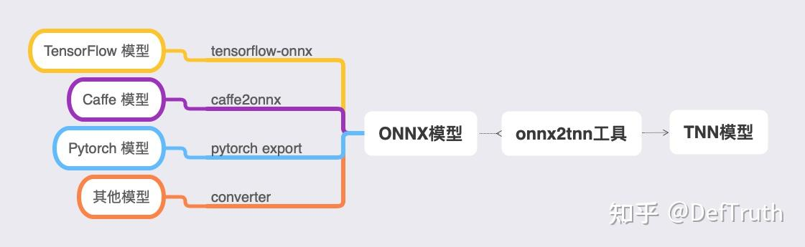
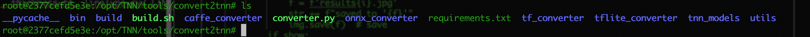

# [배포][TNN] tnn-convert 구축 기록

> 원문: https://zhuanlan.zhihu.com/p/431418709

## tnn-convert 구축 기록

한동안 글을 갱신하지 않았다. 최근 TNN, MNN, NCNN 사용 시리즈 노트를 정리하려 한다. 좋은 기억력보다 엉성한 기록이 낫다. 기억력도 좋지 않으니, 나중에 같은 구덩이에 빠졌을 때 조금 더 빠르게 빠져나오기 위한 기록이다. 현재 **80개가 넘는 C++** 추론 예제를 lib로 빌드해서 사용할 수 있게 정리해 두었다. 관심이 있으면 보면 된다. 길게 소개하지는 않는다.

프로젝트 설명:

GithubLite.AI.ToolKitA lite C++ toolkit of awesome AI models.

즉, 바로 사용할 수 있는 C++ AI 모델 도구 상자다. 평소 새 알고리즘을 공부할 때 손에 잡히는 대로 만든 것들이고, 현재 80개 이상의 인기 오픈소스 모델을 포함한다. 어느새 거의 800 star에 가까워졌다. star와 issue는 언제나 환영한다.

https://github.com/DefTruth/lite.ai.toolkit

최근 관련 글을 계속 갱신할 예정이다.



TNN 공식 FAQ의 모델 변환 문서에서는 최신 TNN이 이미 YOLOv5의 5차원 tensor 변환을 지원한다고 설명한다. 최근 YOLOP를 TNN에서 한번 돌려 보려고 했다. 처음에는 게으른 방식으로 바로 변환했지만, 변환된 모델이 마지막 5차원 tensor 처리에서 오류를 냈다.

```python
bs, _, ny, nx = x[i].shape
# x(bs,255,20,20) to x(bs,3,20,20,85=80+5) (bs,na,ny,nx,no=nc+5=4+1+nc)
x[i] = x[i].view(bs, self.na, self.no, ny, nx).permute(0, 1, 3, 4, 2).contiguous()
```

여기서는 YOLOv5의 처리 방식을 사용했다. 공식 문서에서 최신 TNN이 5차원 tensor를 지원한다고 했으니, 새 `tnn-convert`로 다시 시도한다.

### 최신 이미지 다운로드

```bash
docker pull ccr.ccs.tencentyun.com/qcloud/tnn-convert
```

마찬가지로 잠시 기다린 뒤 `docker images`로 build 또는 pull이 성공했는지 확인할 수 있다. 성공했다면 아래와 비슷한 출력이 나온다.

```text
REPOSITORY                                  TAG                 IMAGE ID            CREATED             SIZE
ccr.ccs.tencentyun.com/qcloud/tnn-convert   latest              66605e128277        2 hours ago         3.54GB
```

pull한 Docker image의 `REPOSITORY` 이름이 너무 길다. 아래 명령으로 이름을 바꿀 수 있다.

```bash
docker tag ccr.ccs.tencentyun.com/qcloud/tnn-convert tnn-convert:latest
docker rmi ccr.ccs.tencentyun.com/qcloud/tnn-convert
```

### 이미지 수정

매번 실행할 때 local directory mount 명령을 다시 쓰는 것은 꽤 번거롭다. `tnn-convert:latest` image 안에 `tnn_models` folder를 새로 만들고, local에도 `tnn_models` directory를 만든다. 이 두 같은 이름의 folder를 모델 파일 전용 공유 directory로 사용한다.

- 먼저 image를 수정해서 `tnn_models` folder를 추가한다.

```bash
docker run  -it tnn-convert:latest /bin/bash
# container에 들어간 뒤 tnn_models folder 추가
mkdir tnn_models
```



- container에서 나와 새 image로 저장한다.

```bash
docker commit e17dd61808ba tnn-convert:v0.1
```

### local folder mount 공유

간단한 script를 작성해서 `tnn-convert:v0.1`을 Docker background mode로 시작하고, local의 `tnn_models` folder를 공유한다.

- `run_tnn_convert.sh`

```bash
PORT1=6001
PORT2=6002
SERVICE_DIR=/Users/xxx/Desktop/tnn_models
CONRAINER_DIR=/opt/TNN/tools/convert2tnn/tnn_models
CONRAINER_NAME=tnn_converter_d
# idt의 d는 background 실행을 의미한다.
docker run -idt -p ${PORT2}:${PORT1} -v ${SERVICE_DIR}:${CONRAINER_DIR} --shm-size=8gb --name ${CONRAINER_NAME} tnn-convert:v0.1
```

- `run_tnn_convert.sh` 실행

```bash
➜  tnn_models sh ./run_dockerd.sh
2377cefd5e3e257f4ead52d951d448b3fae91a69cc3861bc874d24abb3e5ef51
```

- container에 로그인해서 YOLOP 변환을 시작한다. 여기서는 이전에 변환해 둔 ONNX file을 사용한다.

```bash
docker exec -it CONTAINER_ID /bin/bash
root@2377cefd5e3e:/opt/TNN/tools/convert2tnn# python3 ./converter.py onnx2tnn ./tnn_models/YOLOP/yolop-320-320.onnx -o ./tnn_models/YOLOP/ -optimize -v v1.0 -align

----------  convert model, please wait a moment ----------

Converter ONNX to TNN Model...

Converter ONNX to TNN check_onnx_dim...

Converter ONNX to TNN check_onnx_dim...

Converter ONNX to TNN model succeed!

----------  align model (tflite or ONNX vs TNN),please wait a moment ----------

images: input shape of onnx and tnn is aligned!

Run tnn model_check...
----------  Congratulations!   ----------
The onnx model is aligned with tnn model
```

여기까지 하면 변환이 성공한다.

이전 글 모음은 계속 갱신한다.
