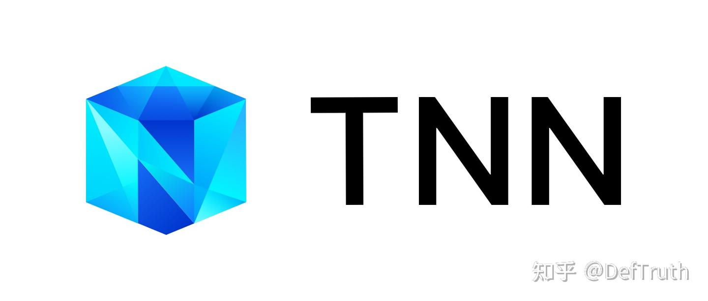

# [추론 배포] TNN 참고 자료

> 원문: https://zhuanlan.zhihu.com/p/449769615

## TNN 참고 자료

최근 TNN, MNN, NCNN, ONNXRuntime 사용 기록을 정리하고 있다. 나중에 같은 문제를 다시 만났을 때 빨리 확인하기 위한 자료 모음이다. 관련 C++ 추론 예제는 `Lite.AI.ToolKit`에 있다.

## TNN 공식 문서

- [1] TNN repository
- [2] TNN model converter
- [3] TNN 지원 op
- [4] TNN custom operator 추가
- [5] TNN/NCNN/MNN/TFLite 비교
- [6] TNN API 문서
- [7] TNN Android demo, 매우 상세하고 유용

## Dynamic dimension 처리

- [1] TNN variable shape input 처리
- [2] Chinese-OCR에서 TNN reshape로 dynamic input 처리
- [3] TNN reshape 주의점

## TNN open source project

- [1] TNN Android demo, 매우 상세하고 유용

나중에 시간이 나면 계속 업데이트한다.

지난 글 모음도 계속 업데이트한다.

