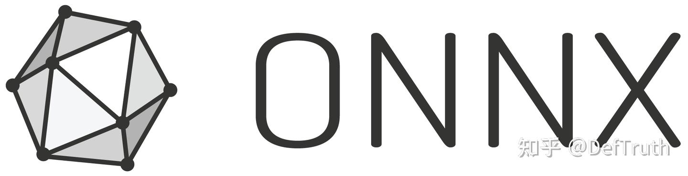
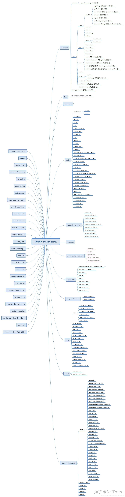

# [추론 배포] ONNX 모델 구조 참고 자료

> 원문: https://zhuanlan.zhihu.com/p/449775926

## ONNX 모델 구조 참고 자료



최근 TNN, MNN, NCNN, ONNXRuntime 사용 기록을 정리하고 있다. 나중에 같은 문제를 다시 만났을 때 빨리 확인하기 위한 자료 모음이다. 관련 C++ 추론 예제는 `Lite.AI.ToolKit`에 있다.

## ONNX 파일 형식

- [1] Model conversion과 ONNX format 분석
- [2] `onnx.proto`
- [3] ONNX 구조 분석
- [4] ONNX 분할
- [5] ONNX 내부 node 수정 방법
- [6] PyTorch -> ONNX: `F.interpolate`
- [7] ONNX 내부 구조
- [8] ONNX source 구조
- [9] ONNX 수정 튜토리얼, 유용
- [10] ONNX 기반 network pruning
- [11] ONNX graph 수정 방법
- [12] Python에서 ONNX model을 다루는 몇 가지 작업
- [13] ONNX 파일 구조 상세 분석
- [14] ONNX 재탐색
- [15] Protobuf 소개
- [16] Protobuf 문법 가이드
- [17] Protobuf C++ API 개발 문서
- [18] Protobuf application 사례
- [19] ONNX의 일상적인 사용에 대해
- [20] Google open source protocol Protobuf 소개와 serialization 원리

## 유용한 operator

- [1] ONNX model에 `NonMaxSuppression` operator node 추가

## Community project

- [1] onnx-surgery, 매우 유용, ONNX를 다양하게 수정하는 사례
- [2] onnx-learn

## 적용 예시

### ONNX model을 분할해 단일 node model 만들기

- [1] ONNX 분할

```python
# ONNX 구조를 이해한 뒤에는 전체 model을 여러 single-node ONNX model로 분할할 수 있다.
# 이렇게 하면 전체 model의 특정 node를 독립적으로 테스트하고 분석하기 쉽다.
import onnx
from onnx import helper
import sys, getopt

# model load
def loadOnnxModel(path):
    model = onnx.load(path)
    return model

# node와 node의 input/output name list 획득.
# 일반적으로 node input은 앞쪽에 이전 layer output, 뒤쪽에 parameter가 온다.
def getNodeAndIOname(nodename, model):
    for i in range(len(model.graph.node)):
        if model.graph.node[i].name == nodename:
            Node = model.graph.node[i]
            input_name = model.graph.node[i].input
            output_name = model.graph.node[i].output
    return Node, input_name, output_name

# input 정보 획득
def getInputTensorValueInfo(input_name, model):
    in_tvi = []
    for name in input_name:
        for params_input in model.graph.input:
            if params_input.name == name:
               in_tvi.append(params_input)
        for inner_output in model.graph.value_info:
            if inner_output.name == name:
                in_tvi.append(inner_output)
    return in_tvi

# output 정보 획득
def getOutputTensorValueInfo(output_name, model):
    out_tvi = []
    for name in output_name:
        out_tvi = [inner_output for inner_output in model.graph.value_info if inner_output.name == name]
        if name == model.graph.output[0].name:
            out_tvi.append(model.graph.output[0])
    return out_tvi

# hyper-parameter 값 획득
def getInitTensorValue(input_name, model):
    init_t = []
    for name in input_name:
        init_t = [init for init in model.graph.initializer if init.name == name]
    return init_t

# 단일 node ONNX model 구성
def createSingelOnnxModel(ModelPath, nodename, SaveType="", SavePath=""):
    model = loadOnnxModel(str(ModelPath))
    Node, input_name, output_name = getNodeAndIOname(nodename, model)
    in_tvi = getInputTensorValueInfo(input_name, model)
    out_tvi = getOutputTensorValueInfo(output_name, model)
    init_t = getInitTensorValue(input_name, model)

    graph_def = helper.make_graph(
                [Node],
                nodename,
                inputs=in_tvi,
                outputs=out_tvi,
                initializer=init_t,
            )
    model_def = helper.make_model(graph_def, producer_name='onnx-example')
    print(nodename + " ONNX model generated")

# 전체 ONNX model 정보 획득
def getNodeNum(model):
    return len(model.graph.node)

def getNodetype(model):
    op_name = []
    for i in range(len(model.graph.node)):
        if model.graph.node[i].op_type not in op_name:
            op_name.append(model.graph.node[i].op_type)
    return op_name

def getNodeNameList(model):
    NodeNameList = []
    for i in range(len(model.graph.node)):
        NodeNameList.append(model.graph.node[i].name)
    return NodeNameList

def getModelInputInfo(model):
    return model.graph.input[0]

def getModelOutputInfo(model):
    return model.graph.output[0]
```

- [2] ONNX source 구조



## ONNX dynamic input을 static으로 바꾸기

```python
import cv2
import onnx
import numpy as np
import onnxmltools
import onnxruntime as ort
from tensorflow.keras.models import load_model

def convert_h5_to_onnx(pretrained_path="./models/affectnet_emotions/mobilenet_7.h5",
                       output_path=".models/affectnet_emotions/face-emotion-recognition-mobilenet_7.onnx",
                       do_simplify=True, emotions_num=7):
    model = load_model(pretrained_path)
    model.summary()

    test_path = "./test.png"
    img = cv2.imread(test_path, cv2.IMREAD_COLOR)
    img = cv2.cvtColor(img, cv2.COLOR_BGR2RGB)
    img = cv2.resize(img, (224, 224)).astype(np.float32)
    face = img.astype(np.float32)
    face[..., 0] -= 103.939
    face[..., 1] -= 116.779
    face[..., 2] -= 123.68
    face = np.expand_dims(face, axis=0)
    scores = model.predict(face)
    print(scores.shape)
    print(scores)
    idx = np.argmax(scores[0])
    print(idx)
    if emotions_num == 7:
        print(affectnet_7_labels[idx])
    else:
        print(affectnet_8_labels[idx])

    print(f"Converting h5 to ONNX ...")
    model_onnx = onnxmltools.convert_keras(model, target_opset=11, default_batch_size=1)
    onnx.save(model_onnx, output_path)
    model_onnx = onnx.load(output_path)
```

원문은 뒤이어 ONNX graph의 shape와 node를 직접 조작하는 예시를 계속 정리한다. 핵심은 ONNX model을 protobuf graph로 보고, input/output/value_info/initializer를 직접 읽고 고치는 것이다.

