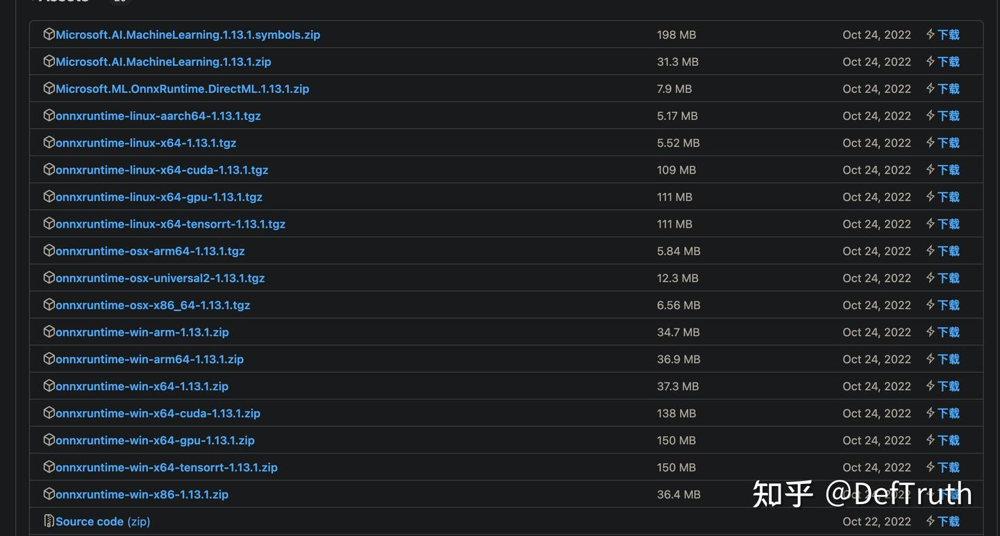

# [에세이][C++] 정적 링크와 정적 라이브러리 원리

> 원문: https://zhuanlan.zhihu.com/p/595527528

## 0x00 서문

최근 작업에서 정적 라이브러리와 동적 라이브러리를 처리할 일이 있었다. 그 과정에서 C++ static linking과 static library에 대한 이해를 다시 정리할 필요가 생겼다. 한동안 글을 쓰지 않았으니 이번에는 개인적인 혼란과 생각을 기록해 둔다. 이후 비슷한 문제를 만나면 빠르게 찾아보기 위한 목적이다.

늘 같은 말이지만, 쓰는 것은 출력이면서 입력이다. 2023년 첫 글이니 제대로 써 보려 한다. static linking과 static library는 익숙하면서도 낯설다. 이 글을 읽고 나면 적어도 application layer에서 static linking과 static library에 대한 이해는 더 명확해질 것이다.

## 0x01 무엇을 분명히 하고 싶은가

이 글은 독자가 기본적인 compile/link 과정에 대한 기본 인식이 있고, 최소한 업무에서 C/C++를 사용한 경험이 있다고 가정한다. 따라서 기본 개념은 반복 설명하지 않고, 내가 관심 있는 문제인 **static linking과 static library**에 집중한다. 이 글을 통해 다음 문제를 정리하려 한다.

- 문제 1: linking이란 무엇이고, linking은 무엇을 하는가? compile 산물이 **"유효한"** linking을 거쳤는지 어떻게 판단하는가?
- 문제 2: static library를 compile하는 것과 dynamic library를 compile하는 것의 **차이**는 무엇인가? 이 차이는 **cmake에서 어떻게 드러나는가**?
- 문제 3: static linking과 static library compile은 같은 개념인가? 차이가 있는가?
- 문제 4: 같은 이름의 object file `.o` 두 개가 `ar`로 static library를 만들 때 하나가 덮어써지는가?
- 문제 5: dynamic library compile은 static library를 link할 수 있고, static library compile도 static library를 link할 수 있다. 둘은 차이가 있는가?
- 문제 6: **static library compile 시 dynamic library를 link할 수 있는가**? 그런 static library는 사용할 수 있는가?
- 문제 7: 내가 compile한 static library를 사용할 때 왜 여러 `undefined` crash가 계속 발생하는가?
- 문제 8: 내가 compile한 static library를 사용할 때 왜 이상하게 global variable이 초기화되지 않는가?
- 문제 9: static library 사용 중 만나는 symbol redefinition error를 어떻게 처리하는가?
- 문제 10: static library를 어떻게 깔끔하게 compile하는가? onnxruntime을 예로 든다.

## 0x02 이야기의 출발점

지식점을 반복해서 길게 나열하면 졸리기 쉽다. 여기서는 구체적인 사례에서 시작해 위 문제들을 하나씩 답한다. 먼저 이 문제들을 대체로 덮을 수 있는 간단한 사례를 만든다. cmake는 업무에서 자주 쓰는 도구이므로, 이 간단한 사례도 cmake 기반으로 구성한다. 전체 directory 구조는 다음과 같다.

```text
tree .
.
├── CMakeLists.txt
├── liba
│   ├── funca.cc
│   ├── funca.h
│   ├── func.cc
│   └── func.h
├── libb
│   ├── funcb.cc
│   ├── funcb.h
│   ├── func.cc
│   └── func.h
├── libc
│   ├── funcc.cc
│   └── funcc.h
└── test.cc
```

여기에는 `liba`, `libb`, `libc` 세 directory가 있고, 각 directory에는 1~2개의 source/header file이 있다. source file 내용은 단순하며 sum function 하나만 포함한다. 최상위에는 이 sum function들을 테스트하는 `test.cc`가 있다. 각 source file 코드는 다음과 같다.

- `liba/func.cc`

```cpp
#include "liba/func.h"
int AddFuncA(int a, int b) {return a + b;}
```

- `liba/funca.cc`

```cpp
#include "liba/funca.h"
int AddFuncAV2(int a, int b) {return a + b;}
```

- `libb/func.cc`: `liba/func.cc`와 source file 이름이 같지만 함수는 다르다. 문제 4를 검증하기 위한 용도다.

```cpp
#include "libb/func.h"
float AddFuncB(float a, float b) {return a + b;}
```

- `libb/funcb.cc`

```cpp
#include "libb/funcb.h"
float AddFuncBV2(float a, float b) {return a + b;}
```

- `libc/funcc.cc`: `liba/func.h`의 `AddFuncA`를 참조한다. 문제 5, 6, 7 검증용이다.

```cpp
#include "libc/funcc.h"
#include "liba/func.h"
int AddFuncC(int a, int b) {return AddFuncA(a, a) + AddFuncA(b, b);}
```

코드 구성은 우선 여기까지 둔다. 뒤에서 필요한 것은 해당 문제를 설명할 때 추가한다. 다음은 주요 문제를 덮을 수 있는 간단한 `CMakeLists.txt`다.

```cmake
PROJECT(staticlib_demo C CXX)
CMAKE_MINIMUM_REQUIRED(VERSION 3.12)

include_directories(${PROJECT_SOURCE_DIR})

set(LIB_ADD_SRCS
        ${PROJECT_SOURCE_DIR}/liba/func.cc
        ${PROJECT_SOURCE_DIR}/liba/funca.cc
        ${PROJECT_SOURCE_DIR}/libb/func.cc
        ${PROJECT_SOURCE_DIR}/libb/funcb.cc)

set(LIB_OTHER_ADD_SRCS
        ${PROJECT_SOURCE_DIR}/libc/funcc.cc)

add_library(addfunc_static STATIC ${LIB_ADD_SRCS}) # compile static library
add_library(addfunc_shared SHARED ${LIB_ADD_SRCS}) # compile dynamic library
add_library(other_addfunc_static_link_static STATIC ${LIB_OTHER_ADD_SRCS})
add_library(other_addfunc_static_link_shared STATIC ${LIB_OTHER_ADD_SRCS})
add_library(other_addfunc_shared_link_static SHARED ${LIB_OTHER_ADD_SRCS})
add_library(other_addfunc_shared_link_shared SHARED ${LIB_OTHER_ADD_SRCS})

target_link_libraries(other_addfunc_static_link_static addfunc_static) # compile static library linking static library
target_link_libraries(other_addfunc_static_link_shared addfunc_shared) # compile static library linking dynamic library
target_link_libraries(other_addfunc_shared_link_static addfunc_static) # compile dynamic library linking static library
target_link_libraries(other_addfunc_shared_link_shared addfunc_shared) # compile dynamic library linking dynamic library

add_executable(test_static ${PROJECT_SOURCE_DIR}/test.cc)
add_executable(test_shared ${PROJECT_SOURCE_DIR}/test.cc)
target_link_libraries(test_static addfunc_static)
target_link_libraries(test_shared addfunc_shared)
```

compile and run:

```bash
mkdir build && cd build && cmake .. && make -j
# output:
[ 40%] Building CXX object CMakeFiles/addfunc_static.dir/liba/funca.cc.o
[ 45%] Building CXX object CMakeFiles/addfunc_static.dir/liba/func.cc.o
[ 50%] Linking CXX static library libother_addfunc_static_link_shared.a
[ 54%] Linking CXX static library libother_addfunc_static_link_static.a
[ 63%] Linking CXX shared library libaddfunc_shared.so
[ 63%] Linking CXX static library libaddfunc_static.a
...
[ 68%] Building CXX object CMakeFiles/test_static.dir/test.cc.o
[ 72%] Building CXX object CMakeFiles/other_addfunc_shared_link_static.dir/libc/funcc.cc.o
[ 77%] Linking CXX shared library libother_addfunc_shared_link_static.so
...
[ 90%] Linking CXX shared library libother_addfunc_shared_link_shared.so
[ 95%] Linking CXX executable test_static
[100%] Linking CXX executable test_shared
```

이 사례 코드는 GitHub에서 받을 수 있다.

```bash
git clone https://github.com/DefTruth/simd-notebook.git
cd cpp/how_to_build_cpp_static_lib/test_staticlib
mkdir build && cd build
cmake ..
make -j
```

## 0x03 문제 1: linking이란 무엇이고, linking은 무엇을 하는가? compile 산물이 "유효한" linking을 거쳤는지 어떻게 판단하는가?

이 문제에 답하려면 먼저 linking이 무엇을 하는지 알아야 하고, compile 과정에서 유효한 linking이 발생했는지 판단하는 방법도 알아야 한다. 이 문제를 분명히 하려고 최근 《Programmer's Self-Cultivation: Linking, Loading and Libraries》의 linking 장을 다시 읽었다. 잘 쓴 책이고 읽어 볼 만하다. 이 내용 자체는 매우 방대하므로 한 글에서 다 설명할 수 없다. 여기서는 기본적인 점만 뽑는다. 예시는 Linux x86_64 system 기준이다.

linking은 무엇인가. linking은 무엇을 하는가.

해당 책에서는 Linux의 ELF file type에 **relocatable file**이 포함된다고 말한다. 이 file은 code와 data를 포함하며 executable file이나 shared object file로 link될 수 있다. object file `.o`와 static library `.a`는 이 범주에 들어간다. executable file을 compile하는 과정에서는 먼저 여러 `.o` file을 얻는다. 예를 들어 이 글의 사례에서는 `test.cc.o`, `liba/func.cc.o` 등이 있다. 이 `.o` file들은 relocatable file이고 서로 독립적이다.

예를 들어 `test.cc.o`는 `AddFuncA()` function을 참조하지만, `.o` file 안에서 이 `AddFuncA()`는 undefined external symbol일 뿐이다. `test.cc.o`는 `AddFuncA()`의 실제 정의가 어디 있는지 모른다. 실행 가능한 executable file을 얻으려면 linker `ld`가 이 독립적인 `.o` file들을 조립해야 한다. 이 조립 과정이 "linking"이다. linking 과정에서 `ld` linker는 먼저 object file `.o`의 유사 section을 merge하고, 각 section과 symbol에 공간 주소를 할당하며, symbol resolution과 relocation을 수행한다.

그러면 compile 과정에서 **유효한** linking이 발생했는지는 어떻게 판단할까. 여기서는 `objdump`를 사용한다.

linking 설명에서 핵심을 뽑으면 이렇다. linking은 **relocatable** object file `.o`에 대해 유사 section merge를 수행하고, 각 section과 symbol에 공간 주소를 할당하며, symbol resolution과 relocation을 수행한다. 이를 다음 두 가지로 나눌 수 있다.

**Relocatable file의 특징**: relocatable이며 `.rel.text`, `.rel.data` 같은 relocation table을 포함한다. VMA(virtual address)와 LMA(load address)는 아직 알 수 없으므로 모두 `0`(`0x0000000000000000`)이다.

**Linking 이후의 변화**: 얻어진 executable file이나 shared library는 이미 relocated되었으므로 relocation table이 더 이상 필요하지 않다. 따라서 `.rel.text`, `.rel.data`가 존재하지 않는다. 동시에 VMA와 LMA에는 구체적인 값이 할당되어 더 이상 0이 아니다.

이 관점을 바탕으로 `objdump` 도구로 link 전후 file을 분석해 linking이 "유효하게" 수행되었는지 판단할 수 있다. `objdump`의 일부 사용법은 다음과 같다.

- `-h`: section header 정보를 본다.
- `-j`: 특정 section만 지정해 본다.
- `-r`: library의 relocation table을 본다. static library 안의 각 `.o` file에는 보통 `.rel.text`, `.rel.data` 같은 relocation table이 있다.
- `-d`: disassembly 정보를 본다.

이 글에서 `-h`, `-r`, `-j`의 주요 역할은 dynamic/static library 또는 executable file의 VMA virtual address 정보와 relocation table 포함 여부를 판단하는 것이다. 먼저 static library 안 object file의 VMA와 LMA를 본다.

```bash
objdump -h -j .text libaddfunc_static.a
# output:
func.cc.o:     file format elf64-x86-64
Sections:
Idx Name          Size      VMA               LMA               File off  Algn
  0 .text         00000014  0000000000000000  0000000000000000  00000040  2**0
                  CONTENTS, ALLOC, LOAD, READONLY, CODE

funca.cc.o:     file format elf64-x86-64
Sections:
Idx Name          Size      VMA               LMA               File off  Algn
  0 .text         00000014  0000000000000000  0000000000000000  00000040  2**0
                  CONTENTS, ALLOC, LOAD, READONLY, CODE
```

static library 안의 각 `.o` file에서 `.text` code section의 VMA와 LMA가 모두 `0x0`임을 볼 수 있다. 이는 static library가 실제로 아직 `ld` linking에 참여하지 않았음을 의미한다. static library는 relocatable object file `.o`들의 집합이고, 실제 상태는 link 대기 상태다. static library의 relocation information table도 본다.

```bash
objdump -r libaddfunc_static.a
# output:
func.cc.o:     file format elf64-x86-64

RELOCATION RECORDS FOR [.eh_frame]:
OFFSET           TYPE              VALUE
0000000000000020 R_X86_64_PC32     .text
# ...
```

예제가 단순하므로 relocation table도 단순하다. static library의 각 `.o` 사이에 reference 관계가 없으므로 여기서는 `.text` relocation table도 나타나지 않는다. `test.cc`로 생성된 `test.o`를 직접 본다. 이 file은 static library의 symbol을 참조한다.

```bash
objdump -r CMakeFiles/test_static.dir/test.cc.o
# output:
CMakeFiles/test_static.dir/test.cc.o:     file format elf64-x86-64

RELOCATION RECORDS FOR [.text]:  # relocation table of .text code section
OFFSET           TYPE              VALUE
000000000000000a R_X86_64_32       .rodata+0x0000000000000001
000000000000000f R_X86_64_32       _ZSt4cout
0000000000000014 R_X86_64_PLT32    _ZStlsISt11char_traitsIcEERSt13basic_ostreamIcT_ES5_PKc-0x0000000000000004
0000000000000026 R_X86_64_PLT32    _Z8AddFuncAii-0x0000000000000004  # reference to AddFuncA
# ...
0000000000000064 R_X86_64_PLT32    _Z8AddFuncBff-0x0000000000000004 # reference to AddFuncB
000000000000006c R_X86_64_PLT32    _ZNSolsEf-0x0000000000000004
# ...
```

아직 linking이 수행되지 않았기 때문에 `test.cc.o`에는 필요한 relocation information table이 남아 있다. 예를 들어 `_Z8AddFuncAii`는 `AddFuncA`에 대한 reference이고, `_Z8AddFuncBff`는 `AddFuncB`에 대한 reference다. 이 이상한 symbol name은 C++ function signature rule에 따라 mapping된 것이다. 세부 규칙은 여기서 다루지 않는다.

이제 link 후의 `test_static` executable file에 relocation table이 남아 있는지 본다.

```bash
# view relocation table
objdump -r test_static
# output:
test_static:     file format elf64-x86-64 # only file header; no .rel.text or .rel.data

# view VMA and LMA of .text code section
objdump -h -j .text test_static
# output:
test_static:     file format elf64-x86-64
Sections:     # VMA and LMA have concrete values and are aligned by 16 bytes
Idx Name          Size      VMA               LMA               File off  Algn
 15 .text         000002b5  0000000000001100  0000000000001100  00001100  2**4
                  CONTENTS, ALLOC, LOAD, READONLY, CODE
```

실제로 link된 executable file은 relocatable table을 더 이상 포함하지 않는다. VMA와 LMA에도 구체적인 값이 할당되었고, start address는 16-byte aligned다. dynamic library도 본다. 실제 `ld` linking이 발생한 뒤 dynamic library와 executable file은 relocation table이 없고 VMA virtual address가 구체적인 값을 가진다.

```bash
objdump -r libaddfunc_shared.so
# output:
libaddfunc_shared.so:     file format elf64-x86-64 # only file header; no .rel.text or .rel.data
objdump -h -j .text libaddfunc_shared.so
# output:
libaddfunc_shared.so:     file format elf64-x86-64
Sections:     # VMA and LMA have concrete values and are aligned by 16 bytes
Idx Name          Size      VMA               LMA               File off  Algn
 10 .text         00000111  0000000000001040  0000000000001040  00001040  2**4
                  CONTENTS, ALLOC, LOAD, READONLY, CODE
```

주의할 점이 있다. 위 분석은 **"linking view"** 관점이다. 다른 분석 방식으로는 **"loading view"** 관점이 있다. 이 경우 `readelf` 도구를 사용할 수 있다. linking과 loading의 전체 내용은 매우 복잡하고 방대하므로 이 글에서 다 덮을 수 없다. 여기서는 일부만 설명한다. 다시 linking view로 돌아오면 dynamic library와 executable file에 대해 오해를 피하기 위한 보충이 필요하다.

먼저 dynamic library와 executable file의 VMA 값 의미다. dynamic library는 shared library 특성상 "shared object는 compile time에 process virtual address space에서 자신의 위치를 가정할 수 없다." 따라서 shared library의 이 address는 library file "start"에 대한 offset이다. `objdump` 출력에서 dynamic library `libaddfunc_shared.so`의 `.text` code section VMA는 `0x0000000000001040`이고, file offset도 `0x00001040`이다. 따라서 이 VMA는 진짜 virtual memory의 valid address를 의미하지 않는다. shared library의 진짜 linking(relocation)은 compile time이 아니라 "loading" 시점에 발생한다. 이 linking은 dynamic linker `ld-xxx.so`가 수행한다. `ld`는 실제로 static linker이며 compile time에 relocation을 수행한다.

executable file은 조금 특별하다. 책의 설명에 따르면 "executable file은 process virtual space에서 자신의 start position을 기본적으로 확정할 수 있다. executable file은 보통 가장 먼저 load되는 file이므로 고정된 free address를 선택할 수 있다." 예를 들면 `0x08040000` 또는 `0x0040000`이다. 하지만 방금 `objdump` 결과는 이 설명과 맞지 않았다. 나는 Ubuntu 20.04, GCC 9 환경에서 compile했다.

```bash
objdump -h -j .text test_static
# output:
test_static:     file format elf64-x86-64
Sections:     # VMA and LMA have concrete values and are aligned by 16 bytes
Idx Name          Size      VMA               LMA               File off  Algn
 15 .text         000002b5  0000000000001100  0000000000001100  00001100  2**4
                  CONTENTS, ALLOC, LOAD, READONLY, CODE
```

여기 VMA 값과 file offset이 모두 `0x00001100`으로 같다. 여전히 relative offset일 뿐 virtual memory의 valid address가 아니다. 왜 그럴까. 아마 높은 버전의 GCC를 사용하면서 compiler 동작이 바뀐 것과 관련 있을 것이라고 추측한다. `readelf`로 검증할 수 있다.

```bash
readelf -l test_static
# output:
Elf file type is DYN (Shared object file)
Entry point 0x1100
There are 13 program headers, starting at offset 64

Program Headers:
  Type           Offset             VirtAddr           PhysAddr
                 FileSiz            MemSiz              Flags  Align
  PHDR           0x0000000000000040 0x0000000000000040 0x0000000000000040
                 0x00000000000002d8 0x00000000000002d8  R      0x8
  INTERP         0x0000000000000318 0x0000000000000318 0x0000000000000318
                 0x000000000000001c 0x000000000000001c  R      0x1
      [Requesting program interpreter: /lib64/ld-linux-x86-64.so.2]
  LOAD           0x0000000000000000 0x0000000000000000 0x0000000000000000
```

이때 executable file과 shared library는 같은 file format, 즉 **DYN (Shared object file)**이다. 아마 executable file `test_static`은 `libaddfunc_static.a`를 static link했지만, system library `libc`에 대해서는 여전히 **dynamic linking**을 사용했기 때문일 것이다. `ldd`로 확인하면 된다.

```bash
ldd test_static
	linux-vdso.so.1 (0x00007fff72f3b000)
	libstdc++.so.6 => /lib/x86_64-linux-gnu/libstdc++.so.6 (0x00007f9fe85e9000)
	libc.so.6 => /lib/x86_64-linux-gnu/libc.so.6 (0x00007f9fe83f7000)  # depends on many system .so files
	libm.so.6 => /lib/x86_64-linux-gnu/libm.so.6 (0x00007f9fe82a8000)
	/lib64/ld-linux-x86-64.so.2 (0x00007f9fe87da000)  # dynamic linker ld-xxx.so handles runtime relocation
	libgcc_s.so.1 => /lib/x86_64-linux-gnu/libgcc_s.so.1 (0x00007f9fe828d000)
```

이 executable file은 **/lib64/ld-linux-x86-64.so.2**에 의존한다. 이것이 dynamic linker다. 참고로 dynamic linker도 shared library다. `/usr/bin/ld`는 우리가 가장 자주 만나는 linker이고 실제로는 static linker다. dynamic linker는 load time relocation을 담당하고, static linker는 compile time relocation을 담당한다. 물론 static linker는 유사 section merge와 address allocation 같은 기본 기능도 수행한다.

따라서 이 executable file은 load time relocation 방식을 사용한다고 볼 수 있다. 이 이유로 GCC가 이 executable file을 DYN (Shared object file)로 저장했고, `objdump`에서 본 VMA는 dynamic library와 마찬가지로 relative offset으로 보이는 것 같다. 그렇다면 system library까지 static link하면 VMA는 virtual memory address가 될까. 바로 시도해 본다.

```bash
g++ -static test.cc -o test -L./build/ -laddfunc_static  # static link system libraries with -static
```

`objdump`와 `readelf`로 확인한다.

```bash
objdump -h -j .text test
# output:
test:     file format elf64-x86-64
Sections:
Idx Name          Size      VMA               LMA               File off  Algn
  6 .text         0016f8db  0000000000401230  0000000000401230  00001230  2**4
                  CONTENTS, ALLOC, LOAD, READONLY, CODE

readelf -l test
# output:
Elf file type is EXEC (Executable file)
Entry point 0x404ad0
There are 10 program headers, starting at offset 64

Program Headers:
  Type           Offset             VirtAddr           PhysAddr
                 FileSiz            MemSiz              Flags  Align
  LOAD           0x0000000000000000 0x0000000000400000 0x0000000000400000
                 0x00000000000005f0 0x00000000000005f0  R      0x1000
  LOAD           0x0000000000001000 0x0000000000401000 0x0000000000401000
                 0x000000000017180d 0x000000000017180d  R E    0x1000
  LOAD           0x0000000000173000 0x0000000000573000 0x0000000000573000

ldd test
# output:
	not a dynamic executable
```

답이 나왔다. `objdump` 결과에서 VMA는 `0x0000000000401230`이고 file offset은 `0x00001230`이다. 두 값은 다르다. VMA 값은 program start address `0x0000000000400000` + `0x0000000000001230`으로, absolute virtual memory address이며 더 이상 relative offset이 아니다. `readelf` 결과도 이 file format이 **EXEC (Executable file)**임을 보여 준다. dynamic system library에 의존하던 executable file의 format은 **DYN (Shared object file)**이었다.

마지막으로 `.rel.text` 같은 relocation table에 대해 보충한다. dynamic library와 executable file은 `.rel.text`, `.rel.data`를 포함하지 않는다. 이것들은 object file에 포함된다. 하지만 load time relocation에 필요한 `.rel.dyn`, PLT, GOT 같은 table section은 포함할 수 있다. 이는 dynamic linking의 load time relocation 원리와 관련되어 있으므로 여기서는 펼치지 않는다. `objdump -R`(대문자 R), `objdump -h`, `readelf -l`로 볼 수 있다.

```bash
# dynamic library
objdump -R libaddfunc_shared.so

libaddfunc_shared.so:     file format elf64-x86-64

DYNAMIC RELOCATION RECORDS  # relocation table of dynamic library
OFFSET           TYPE              VALUE
0000000000003e70 R_X86_64_RELATIVE  *ABS*+0x00000000000010f0
0000000000003e78 R_X86_64_RELATIVE  *ABS*+0x00000000000010b0
0000000000004018 R_X86_64_RELATIVE  *ABS*+0x0000000000004018
0000000000003fe0 R_X86_64_GLOB_DAT  __cxa_finalize
0000000000003fe8 R_X86_64_GLOB_DAT  _ITM_registerTMCloneTable
0000000000003ff0 R_X86_64_GLOB_DAT  _ITM_deregisterTMCloneTable
0000000000003ff8 R_X86_64_GLOB_DAT  __gmon_start__

# executable file
objdump -R test_shared

test_shared:     file format elf64-x86-64

DYNAMIC RELOCATION RECORDS
OFFSET           TYPE              VALUE
# ...
0000000000003fc8 R_X86_64_GLOB_DAT  __cxa_finalize@GLIBC_2.2.5
0000000000003fd0 R_X86_64_GLOB_DAT  _ZSt4endlIcSt11char_traitsIcEERSt13basic_ostreamIT_T0_ES6_@GLIBCXX_3.4
0000000000003fd8 R_X86_64_GLOB_DAT  _ITM_deregisterTMCloneTable
0000000000003fe0 R_X86_64_GLOB_DAT  __libc_start_main@GLIBC_2.2.5
0000000000003fe8 R_X86_64_GLOB_DAT  __gmon_start__
0000000000003ff0 R_X86_64_GLOB_DAT  _ITM_registerTMCloneTable
0000000000003ff8 R_X86_64_GLOB_DAT  _ZNSt8ios_base4InitD1Ev@GLIBCXX_3.4
0000000000004040 R_X86_64_COPY     _ZSt4cout@@GLIBCXX_3.4
0000000000003f88 R_X86_64_JUMP_SLOT  _Z8AddFuncAii
0000000000003f90 R_X86_64_JUMP_SLOT  _ZNSolsEf@GLIBCXX_3.4
0000000000003f98 R_X86_64_JUMP_SLOT  __cxa_atexit@GLIBC_2.2.5
0000000000003fa0 R_X86_64_JUMP_SLOT  _ZStlsISt11char_traitsIcEERSt13basic_ostreamIcT_ES5_PKc@GLIBCXX_3.4
0000000000003fa8 R_X86_64_JUMP_SLOT  _ZNSolsEPFRSoS_E@GLIBCXX_3.4
0000000000003fb0 R_X86_64_JUMP_SLOT  _Z8AddFuncBff
0000000000003fb8 R_X86_64_JUMP_SLOT  _ZNSt8ios_base4InitC1Ev@GLIBCXX_3.4
0000000000003fc0 R_X86_64_JUMP_SLOT  _ZNSolsEi@GLIBCXX_3.4
```

여기까지 이미 많은 내용이 등장했다. 이 글에서는 이 정도면 충분하다. 더 많은 내용은 관련 자료를 직접 확인하면 된다. 마지막으로 이 문제를 표로 정리한다.

| File format | 단계 | 특징 | 판단 방식 |
| --- | --- | --- | --- |
| static library | link 대기 상태, relocatable `.o` file의 집합 | `.a` file 안의 각 object file `.o`는 `.rel.text`, `.rel.data` 같은 relocation table을 포함하고, 각 section의 VMA와 LMA가 `0x0`이다. | `objdump -r libxxx.a`; `objdump -h -j .text libxxx.a` |
| dynamic library | link 이후 생성. 유사 section merge와 address relative offset 계산이 끝났고, 진짜 relocation은 compile time이 아니라 load time에 발생한다. | `.rel.text`, `.rel.data` 같은 relocation table은 더 이상 포함하지 않는다. VMA와 LMA는 `0x0`이 아니며, 이 address는 shared library 자체에 대한 offset이다. 하지만 runtime relocation에 필요한 `.rel.dyn`, GOT, PLT 등을 포함한다. | `objdump -r libxxx.so`; `objdump -h -j .text libxxx.so`; `readelf -l libxxx.so`; `objdump -R libxxx.so` |
| executable file | 가능성 1: link 이후 생성되고 유사 section merge와 address relative offset 계산이 끝났으며 진짜 relocation은 load time에 발생한다. 가능성 2: 모든 dependency library가 static link되면 link 이후 생성된 executable file은 유사 section merge와 address relocation이 끝나고 VMA가 absolute virtual memory address가 된다. | `libc.so`를 dynamic link하면 본질적으로 output file format은 DYN (Shared object file)이며 shared library와 비슷하다. runtime relocation에 필요한 `.rel.dyn`, GOT, PLT 등을 포함하고 dynamic linker `ld-xxx.so`에 의존한다. `-static`으로 compile하고 dynamic library에 의존하지 않으면 file format은 EXEC (Executable file)이 된다. 이때 `.rel.dyn`, `.rel.text`, `.rel.data` relocation table을 포함하지 않고, VMA와 LMA는 `0x0`이 아니며 사용 가능한 virtual memory에 할당된 absolute address를 나타낸다. | `objdump -r xxx_exe`; `objdump -h -j .text xxx_exe`; `readelf -l xxx_exe`; `ldd xxx_exe`; `objdump -R xxx_exe` |

문제 1에 답하기 위해 꽤 많은 분량을 썼다. 하지만 이 문제는 중요하다. 다른 문제를 이해하는 기반이다.

## 0x04 문제 2: static library compile과 dynamic library compile의 차이는 무엇인가? 이 차이는 cmake에서 어떻게 드러나는가?

사실 문제 1의 답에는 문제 2의 일부 답도 포함되어 있다. 그래도 cmake와 함께 더 분석한다. 그래야 업무에서의 실제 적용에 더 가깝다. 먼저 개인적인 혼란부터 말한다. 우리는 `cmake .. && make -j` 이후 이런 메시지를 자주 본다.

```text
[ 63%] Linking CXX shared library libaddfunc_shared.so
[ 63%] Linking CXX static library libaddfunc_static.a
```

static library 하나와 dynamic library 하나를 link하고 있다. 출력만 보면 비슷하다. 하지만 static library를 link해서 생성하는 것과 dynamic library를 link해서 생성하는 것에서 **실제로 발생하는 linking 과정이 정말 같은가?** 답은 **다르다**.

- **`link.txt`**: linking process 분석에 매우 유용한 도구

`link.txt`란 무엇인가. cmake로 project를 관리하고 `cmake .. && make -j`를 실행하면 생기는 부산물이다. 보통 무시하지만, cmake 이후 compile 마지막 단계의 "Linking xxx ..."가 실제로 무엇을 했는지 이해하는 데 매우 도움이 된다. cmake가 생성한 산물을 자세히 보면 `CMakeFiles`라는 directory가 있고, 그 안에 각 sub-project 관련 정보가 있다. 각 sub-project의 file은 보통 `xxx.dir` folder 안에 저장된다.

```bash
ls CMakeFiles/ | grep "dir"
addfunc_shared.dir/
addfunc_static.dir/
test_shared.dir/
test_static.dir/
```

핵심은 각 `dir` 안에 `link.txt`라는 file이 있다는 점이다. 이 file은 실제 linking process가 어떻게 발생했는지 설명한다.

```bash
find . -name "link.txt"
./CMakeFiles/addfunc_static.dir/link.txt
./CMakeFiles/addfunc_shared.dir/link.txt
./CMakeFiles/test_static.dir/link.txt
./CMakeFiles/test_shared.dir/link.txt
# ...
```

이 file은 "Linking xxx ..." 과정에서 실제로 무엇이 일어났는지 분석하는 데 도움이 된다. executable file과 dynamic library의 linking process도 비슷하므로 함께 본다.

```bash
# "linking" when compiling a static library
cat ./CMakeFiles/addfunc_static.dir/link.txt
# output:
/usr/bin/ar qc libaddfunc_static.a  CMakeFiles/addfunc_static.dir/liba/func.cc.o CMakeFiles/addfunc_static.dir/liba/funca.cc.o CMakeFiles/addfunc_static.dir/libb/func.cc.o CMakeFiles/addfunc_static.dir/libb/funcb.cc.o
/usr/bin/ranlib libaddfunc_static.a
```

여기서 알 수 있다. static library는 **ar**로 직접 만든다. `.o` file을 함께 package해서 `.a` file을 만들 뿐이고, 실제로 **ld linker를 호출하지 않는다**. 즉 static library를 생성하는 linking에는 ar가 쓰이고 ld linker가 쓰이지 않는다.

다시 말해 static library를 compile할 때 cmake는 실제로 `.o` file을 merge할 뿐이다. 진정한 의미의 "linking"은 발생하지 않는다. 정확히 말하면 static library compile 과정에서 cmake 출력은 "Linking xxx.a ..."지만, "Merging xxx.a ..."라고 이해하는 편이 더 적절하다. 이어서 dynamic library와 executable file의 linking process를 본다.

```bash
# linking when compiling a dynamic library
cat ./CMakeFiles/addfunc_shared.dir/link.txt
# output:
/usr/bin/c++ -fPIC   -shared -Wl,-soname,libaddfunc_shared.so -o libaddfunc_shared.so CMakeFiles/addfunc_shared.dir/liba/func.cc.o CMakeFiles/addfunc_shared.dir/liba/funca.cc.o CMakeFiles/addfunc_shared.dir/libb/func.cc.o CMakeFiles/addfunc_shared.dir/libb/funcb.cc.o

# compiling executable file and linking a dynamic library
cat ./CMakeFiles/test_shared.dir/link.txt
# output:
/usr/bin/c++     CMakeFiles/test_shared.dir/test.cc.o  -o test_shared  -Wl,-rpath,/home/tmp/test_staticlib/build libaddfunc_shared.so

# compiling executable file and linking a static library
cat ./CMakeFiles/test_static.dir/link.txt
# output:
/usr/bin/c++     CMakeFiles/test_static.dir/test.cc.o  -o test_static  libaddfunc_static.a
```

dynamic library와 executable file의 linking process는 모두 **/usr/bin/c++**를 호출한다. 이는 ld linker를 감싼 것이다. 여기서는 진정한 의미의 linking이 발생하고, 유사 section merge, address allocation, symbol relocation 등이 수행된다. 다만 dynamic library 또는 dynamic library를 link한 executable file에 대해서 여기서의 relocation은 address offset 계산만 수행한다. dynamic library의 진짜 relocation은 compile time이 아니라 load time에 `ld-xxx.so` dynamic linker가 수행한다.

앞의 `objdump` 분석도 executable file과 dynamic library에는 `.rel.text`, `.rel.data` relocation table이 없고, 각 section과 symbol에 VMA/LMA가 할당되었음을 보여 준다.

따라서 중요한 사실을 얻는다. **가짜 linking(static library compile)과 유효한 linking이 존재한다.** dynamic library와 executable file compile의 경우 compile time linking이 진짜 relocation을 수행하지 않고 relative address만 할당하는 경우가 많지만, 여기서는 설명을 단순하게 하기 위해 "유효한" linking이라고 부른다.

static library compile과 dynamic library compile의 가장 큰 차이는 static library compile에서는 실제 "linking"이 발생하지 않는다는 점이다. 단지 object file `.o`를 하나의 `.a` library로 merge한다. 유사 section merge도 없고 symbol relocation도 없다. 반면 dynamic library compile에서는 "유효한" linking process가 발생한다. 유사 section merge와 address allocation을 거친다. 유사 section merge 과정에서 반드시 필요한 `.o`가 합쳐진다.

이 관점에서, dynamic library를 compile하면서 static library를 link한다는 것은 실제로는 많은 `.o` file을 link하는 것과 같다. `ld` linker가 이 `.o`들도 끌어와 merge하므로, 해당 dynamic library를 compile한 뒤에는 link된 static library가 없어도 되는 경우가 생긴다. 그러나 static library compile에서는 이런 linking process가 발생하지 않는다.

요약하면 다음과 같다.

| 작업 | cmake가 수행하는 "linking" | 특징 |
| --- | --- | --- |
| static library compile | `ar`로 `.o` file을 merge | 가짜 linking. `.o` file을 merge할 뿐이다. |
| dynamic library compile | `ld` linker로 유사 section merge와 address offset 계산 수행 | "유효한" linking이 발생한다. 하지만 진짜 relocation은 load time에 일어난다. |
| executable file compile | `ld` linker로 유사 section merge와 address offset 계산 수행. 경우에 따라 진짜 relocation도 발생 | "유효한" linking이 발생한다. relocation 수행 여부는 dynamic library dependency가 있는지에 따라 다르다. |

주의: dynamic library와 dynamic library에 의존하는 executable file의 경우 `ld` linker는 address offset 계산만 수행한다. 진짜 relocation은 load time에 `ld-xxx.so` dynamic linker가 수행한다.

## 0x05 문제 3: static linking과 static library compile은 같은 개념인가? 차이가 있는가?

문제 1과 2를 정리하면 문제 3은 쉽게 답할 수 있다. 답은 같지 않다. 명확히 다른 개념이다.

"static linking"은 executable file 또는 dynamic library를 compile할 때 static library `.a`를 link하는 것을 말한다. 실제로는 이미 compile된 `.o` file들의 묶음을 link하는 것과 같다. 그리고 `ld`가 유사 section merge, address allocation, relocation을 수행한다. executable file과 dynamic library compile에서 "static linking"은 반드시 진짜 linking을 일으킨다.

반면 static library compile에서의 "linking"은 허울에 가깝다. static library compile의 본질은 `.o` file을 package/merge하는 것이다. 진짜 linking process와는 별 관계가 없다고 볼 수 있다.

## 0x06 문제 4: 같은 이름의 object file `.o` 두 개가 `ar`로 static library를 만든 뒤 하나가 덮어써지는가?

이 문제를 제기한 이유는 실제 개발에서 서로 다른 directory에 같은 이름의 source file이 생기기 쉽기 때문이다. 예를 들어 서로 다른 directory마다 `utils.cc`가 있을 수 있다. `ar`가 `.o`를 merge해 static library `.a`를 만들 때 같은 이름의 object file을 어떻게 처리하는지 알 필요가 있다.

수동으로 `ar` command를 실행해 검증할 수 있다. `liba`와 `libb`에는 같은 이름의 source file `func.cc`가 있고, compile 후 모두 `func.cc.o`가 된다. `ar`로 두 같은 이름의 `.o` file을 포함한 모든 object file을 하나의 `.a` static library로 merge한다.

- `ar`로 object file `.o`에서 static library `.a` 만들기

```bash
# create static library. s means creating an index table; current ar adds s by default.
ar -qcs libaddfunc_static.a \
  CMakeFiles/addfunc_static.dir/liba/func.o \
  CMakeFiles/addfunc_static.dir/liba/funca.o \
  CMakeFiles/addfunc_static.dir/libb/func.o \
  CMakeFiles/addfunc_static.dir/libb/funcb.o
# If unsure, call ranlib again to update the static library symbol table index.
ranlib libaddfunc_static.a
# cmake static library compile is usually ar -qc + ranlib, for compatibility with old ar versions.
# Older ar did not have the -s option.
```

- `ar`로 static library에 포함된 object file `.o` 보기

```bash
# view object files in static library
ar -tvO libaddfunc_static.a # -tv | -tvO | -t are all usable
# output:
rw-r--r-- 0/0   1216 Jan  1 00:00 1970 func.cc.o 0xd2
rw-r--r-- 0/0   1224 Jan  1 00:00 1970 funca.cc.o 0x5ce
rw-r--r-- 0/0   1224 Jan  1 00:00 1970 func.cc.o 0xad2
rw-r--r-- 0/0   1232 Jan  1 00:00 1970 funcb.cc.o 0xfd6
```

서로 다른 directory에 같은 이름의 `.o` file, 예를 들어 `liba/func.o`와 `libb/func.o`가 있어도 `ar`는 static library를 만들 때 두 object file을 모두 보존한다. `ar`의 구체적인 구현 메커니즘은 지금 자세히 알지 못한다. 아마 비슷한 index 기능을 구현해 같은 file name이라도 실제로는 서로 다른 file로 표시하는 것 같다.

실제 개발에서는 서로 다른 directory에 같은 이름의 source file이 생기기 쉽다. 예를 들어 여러 directory에 `utils.cc`가 있을 수 있다. 하지만 static library를 compile할 때 이 문제는 걱정하지 않아도 된다. `ar`가 처리해 준다.

- `nm`으로 static library의 symbol table이 정상인지 보기: `nm -s`로 library의 symbol table 정보를 볼 수 있다.

```bash
# nm -s can view symbol table information in static library.
nm -s libaddfunc_static.a
# output:
Archive index:
_Z8AddFuncAii in func.cc.o
_Z10AddFuncAV2ii in funca.cc.o
_Z8AddFuncBff in func.cc.o
_Z10AddFuncBV2ff in funcb.cc.o
func.cc.o:
0000000000000000 T _Z8AddFuncAii
funca.cc.o:
0000000000000000 T _Z10AddFuncAV2ii
func.cc.o:
0000000000000000 T _Z8AddFuncBff
funcb.cc.o:
0000000000000000 T _Z10AddFuncBV2ff
```

merge된 static library에는 두 같은 이름의 `func.cc.o`가 가진 function symbol이 각각 보존되어 있다. 따라서 답은 이렇다. 같은 이름의 `.o` file은 직접 덮어써지지 않는다. `ar`로 static library를 만들어도 된다.

## 0x07 문제 5: dynamic library compile도 static library를 link할 수 있고, static library compile도 static library를 link할 수 있다. 둘은 차이가 있는가?

먼저 답부터 말하면 **차이가 있다**. 문제 1과 2의 기반 위에서 이 문제를 이해할 수 있다.

**dynamic library가 static library를 link하는 경우**: **"유효한"** linking이다. dynamic library compile 시 `ld` linker가 진짜 relocation을 수행하지는 않더라도, 유사 section merge와 address allocation 등 linking process의 다른 단계를 수행한다. dynamic library를 compile하면서 static library를 link하는 경우, 예를 들어 `libA.so`를 compile하면서 `libB.a`를 link하면, `libB.a` 안의 `.o` file을 `ld` linker가 순회하며 찾고, `libA.so`에 반드시 필요한 일부 `.o`를 유사 section merge 과정에 넣는다.

**static library가 static library를 link하는 경우**: **"가짜"** linking이다. 이른바 linking이지만 실제로는 가짜다. 문제 1과 2의 분석에 따르면 static library compile은 linking을 전혀 수행하지 않는다. `libA.a`를 compile하면서 `libB.a`를 link하면, `libA.a`를 생성할 때 linker가 `libA.a`와 `libB.a`의 symbol dependency를 책임지고 검사할 것이라고 생각할 수 있다. 그래서 자신 있게 이런 cmake를 작성한다.

```cmake
add_library(A STATIC ${LIB_A_SRCS}) # compile static library
target_link_libraries(A B) # compile static library A and link static library B
```

하지만 실제로 `ld` linker는 등장하지 않는다. `ar`는 symbol dependency를 처리하지 않는다. `libB.a`가 있든 없든 결과는 같다. `libA.a`가 실제로 `libB.a`의 symbol을 사용하더라도 마찬가지다. `target_link_libraries(A B)`를 쓰는 순간, 이미 착각에 빠진 것이다.

cmake로 구체적으로 본다. 먼저 "dynamic library를 compile하고 static library를 link"하는 경우의 `link.txt`다.

```bash
cat CMakeFiles/other_addfunc_shared_link_static.dir/link.txt
# output:
/usr/bin/c++ -fPIC   -shared -Wl,-soname,libother_addfunc_shared_link_static.so -o \
libother_addfunc_shared_link_static.so CMakeFiles/other_addfunc_shared_link_static.dir/libc/funcc.cc.o  \
libaddfunc_static.a
```

`libaddfunc_static.a` static library가 dynamic library 생성 과정에 실제로 참여했다. link되어 다른 `.o` file과 함께 최종 dynamic library `libother_addfunc_shared_link_static.so`를 만든다.

이제 "static library를 compile하고 static library를 link"하는 경우의 `link.txt`를 본다.

```bash
cat CMakeFiles/other_addfunc_static_link_static.dir/link.txt
# output:
/usr/bin/ar qc libother_addfunc_static_link_static.a  \
CMakeFiles/other_addfunc_static_link_static.dir/libc/funcc.cc.o
/usr/bin/ranlib libother_addfunc_static_link_static.a  # no libaddfunc_static.a
```

`CMakeLists.txt`의 link 관계는 다음과 같다.

```cmake
set(LIB_OTHER_ADD_SRCS
        ${PROJECT_SOURCE_DIR}/libc/funcc.cc)
add_library(addfunc_static STATIC ${LIB_ADD_SRCS}) # compile static library
add_library(other_addfunc_static_link_static STATIC ${LIB_OTHER_ADD_SRCS})
target_link_libraries(other_addfunc_static_link_static addfunc_static) # compile static library linking static library
```

`libaddfunc_static.a` static library는 `ar`가 static library를 만드는 과정에 참여하지 않았다. 직접 무시되었다. static library compile은 linking이 발생하지 않는다. symbol dependency를 검사할 필요가 없으므로 `libaddfunc_static.a`가 있든 없든 `libother_addfunc_static_link_static.a` 생성에는 영향이 없다. cmake의 전략은 이를 무시하는 것이다.

이 관찰에 기반해 더 과감히 추측해 볼 수 있다. `target_link_libraries`를 제거해도 `libother_addfunc_static_link_static.a`는 똑같이 compile될 것이다. `libc/funcc.cc`는 실제로 `libaddfunc_static.a`의 symbol을 사용한다.

```cpp
#include "libc/funcc.h"
#include "liba/func.h"
int AddFuncC(int a, int b) {return AddFuncA(a, a) + AddFuncA(b, b);}
```

검증을 위해 `CMakeLists.txt`를 수정한다.

```cmake
set(LIB_OTHER_ADD_SRCS
        ${PROJECT_SOURCE_DIR}/libc/funcc.cc)
add_library(other_addfunc_static_link_static STATIC ${LIB_OTHER_ADD_SRCS})
# target_link_libraries(other_addfunc_static_link_static addfunc_static) # comment out this line
```

compile 결과는 추측과 같다. 정상 compile된다. 다시 `link.txt`를 보면 `target_link_libraries`를 주석 처리하기 전과 완전히 동일하다.

```text
[ 54%] Linking CXX static library libother_addfunc_static_link_static.a
```

결론은 이렇다. static library를 compile하면서 static library를 link하는 작업은 실제 의미가 없다. 대부분의 경우 자기기만에 가깝다.

## 0x08 문제 6: static library compile 시 dynamic library를 link할 수 있는가? 그런 static library는 사용할 수 있는가?

앞의 내용을 이어 보면 문제 6은 쉽게 답할 수 있다. 먼저 앞 질문부터 답한다. static library를 compile할 때 dynamic library를 link할 수는 있다. 하지만 이런 link는 환상일 뿐 실제 의미가 없다. 이 dynamic library를 link하든 하지 않든 static library 생성에는 영향이 없다. 사례의 `link.txt`를 직접 보면 된다.

```bash
cat CMakeFiles/other_addfunc_static_link_shared.dir/link.txt
/usr/bin/ar qc libother_addfunc_static_link_shared.a CMakeFiles/other_addfunc_static_link_shared.dir/libc/funcc.cc.o
/usr/bin/ranlib libother_addfunc_static_link_shared.a
```

`CMakeLists.txt`에는 이렇게 썼다.

```cmake
target_link_libraries(other_addfunc_static_link_shared addfunc_shared) # compile static library linking dynamic library
```

그러나 `link.txt` 정보를 보면 `libaddfunc_shared.so` 역시 `libother_addfunc_static_link_shared.a` 생성 과정에 참여하지 않는다.

뒤 질문, 이런 static library를 사용할 수 있는가. 답은 사용할 수 있다. 그냥 정상 static library일 뿐 특별한 것은 없다. 다만 주의할 점이 있다. 이 static library가 다른 library(dynamic 또는 static)의 symbol을 사용한다면, 예를 들어 `libother_addfunc_static_link_shared.a`가 `libaddfunc_shared.so`의 `AddFuncA` function을 사용한다면, 실제 사용할 때 static library 자체뿐 아니라 그가 참조한 symbol을 포함하는 library도 link해야 한다.

```cmake
add_executable(test_exe test_exe.cc);
target_link_libraries(test_exe libother_addfunc_static_link_shared.a);
target_link_libraries(test_exe libaddfunc_shared.so);
```

이 static library가 의존하는 library도 static library라면, 이 static library들을 수동으로 하나의 전체 static library `.a`로 merge할 수도 있다. 사용할 때는 이 전체 library만 link하면 된다.

```bash
ar crsT libmerge.a libother_addfunc_static_link_static.a libaddfunc_static.a
```

`CMakeLists.txt`에서는 이렇게 쓸 수 있다.

```cmake
add_executable(test_exe test_exe.cc);
target_link_libraries(test_exe libmerge.a);
```

## 0x09 문제 7: 내가 compile한 static library를 사용할 때 왜 여러 undefined crash가 계속 발생하는가?

문제 5와 6을 이해했다면 문제 7은 스스로도 결론을 유추할 수 있다.

실제 적용에서는 이런 상황이 자주 있다. cmake로 `libA.a` static library를 compile한다. 이 `libA.a`는 다른 `libB.a` 또는 `libB.so` library에 의존할 수 있다. 이 `libA.a`를 사용할 때 가장 흔한 error가 발생한다. 바로 symbol undefined다.

원인은 `libA.a`를 compile할 때 실제 linking이 발생하지 않았기 때문이다. `libA.a` 자신의 `.o` file 일부만 package했을 뿐 `libB.a`의 `.o`가 함께 merge되지 않았다. 실제 linking이 없으므로 유사 section merge 과정도 없다. 하지만 `libA.a`는 `libB.a`에 의존하고, `libB.a`의 일부 symbol을 참조한다. 그래서 `libA.a`를 사용해 다른 executable file이나 library를 compile할 때 여러 undefined 문제가 발생한다. 예전에 onnxruntime static library를 compile해 사용하려 할 때도 이 문제가 있었다.

해결 방법은 최소 두 가지가 있다. 문제 6에서 이미 답했다. 하나는 `CMakeLists.txt`에서 필요한 모든 library를 명시적으로 하나씩 link하는 것이다. 다른 하나는 compile된 `libA.a`와 그 dependency `libB.a`를 하나의 library로 merge해 third-party에 제공하는 것이다.

```bash
ar crsT libmerge.a libxxx.a libxxxb.a  # parameter T is required
ar -tvO libmerge.a # view merged file
```

parameter `T`는 뒤따르는 모든 static library의 `.o` file을 첫 번째 parameter로 지정한 static library file에 package한다는 뜻이다. 이 parameter를 붙이지 않으면 뒤의 여러 `.a` file의 collection이 된다. `ar -tv`로 package 내용을 볼 수 있다.

## 0x0a 문제 8: 내가 compile한 static library에서 왜 이상하게 global variable이 초기화되지 않는가?

솔직히 문제 8은 답하기 쉽지 않다. 그렇게 명백하지 않기 때문이다. 직접 이 문제를 밟지 않았다면 나도 주의하지 못했을 것이다. dynamic library로 compile하면 정상 사용되는데 static library로 compile하면 문제가 생긴다. 해결 방법을 찾는 과정에서 비슷한 글 몇 개를 보았다.

- static library에서 global variable initialization 문제
- Issues with static variables in static libraries

이 문제를 최대한 단순히 설명하기 위해 예제를 구성한다. 기존 `liba` directory 아래에 `global.cc`를 추가하고 `add_func` library에 넣는다. 코드 자체는 매우 단순하다.

```cpp
#include <iostream>
class ACls {
public:
 ACls() {std::cout << "Create an ACls instance and do some things!" << std::endl;}
};
// create a global instance.
ACls* a_inst = new ACls();
```

실제 적용에서는 이와 비슷하지만 더 복잡한 factory class가 있을 수 있다. global variable을 `new`할 때 필요한 initialization 작업도 함께 수행하기를 바란다. 예를 들어 특정 op나 product id의 registration을 구현하는 경우다. 이런 방식은 dynamic library 방식에서는 보통 정상 동작한다. 하지만 안타깝게도 위와 비슷한 logic이 static library로 compile되면 "이상한 global variable이 초기화되지 않는" 문제가 발생한다.

간단히 검증한다. 먼저 `CMakeLists.txt`를 수정한다.

```cmake
set(LIB_ADD_SRCS
        ${PROJECT_SOURCE_DIR}/liba/func.cc
        ${PROJECT_SOURCE_DIR}/liba/funca.cc
        ${PROJECT_SOURCE_DIR}/liba/global.cc  # add global.cc
        ${PROJECT_SOURCE_DIR}/libb/func.cc
        ${PROJECT_SOURCE_DIR}/libb/funcb.cc)

set(LIB_OTHER_ADD_SRCS ${PROJECT_SOURCE_DIR}/libc/funcc.cc)

add_library(addfunc_static STATIC ${LIB_ADD_SRCS}) # compile static library
add_library(addfunc_shared SHARED ${LIB_ADD_SRCS}) # compile dynamic library

add_executable(test_static ${PROJECT_SOURCE_DIR}/test.cc)
add_executable(test_shared ${PROJECT_SOURCE_DIR}/test.cc)
target_link_libraries(test_static addfunc_static) # use static library
target_link_libraries(test_shared addfunc_shared) # use dynamic library
```

compile 후 `test_static`과 `test_shared` 두 executable file을 얻는다. 각각 static/dynamic `add_func` library를 link해 생성한 것이다. 두 file을 직접 실행하면 동작이 다르다.

```bash
root@b99fab697c9e:build# ./test_shared
Create an ACls instance and do some things!  # ACls* a_inst global variable initialization was executed.
AddFuncA(2, 3): 5
AddFuncB(2.0f, 3.0f): 5
root@b99fab697c9e:build# ./test_static
AddFuncA(2, 3): 5  # ACls* a_inst initialization was not executed.
AddFuncB(2.0f, 3.0f): 5
```

결과를 보면 `test_shared` 실행 후 `ACls* a_inst`가 성공적으로 초기화된다. 이것이 원하는 동작이다. 하지만 `test_static`에서는 global variable `ACls* a_inst` 초기화가 실행되지 않는다. 왜 그럴까.

먼저 library와 executable file에서 `a_inst` symbol이 어떤 상태인지 본다.

```bash
root@b99fab697c9e:build# objdump -t libaddfunc_shared.so | grep a_inst
0000000000004070 g     O .bss	0000000000000008              a_inst
root@b99fab697c9e:build# objdump -t libaddfunc_static.a | grep a_inst
0000000000000093 l     F .text	0000000000000019 _GLOBAL__sub_I_a_inst
0000000000000000 g     O .bss	0000000000000008 a_inst
root@b99fab697c9e:build# objdump -t test_shared | grep a_inst  # no output
root@b99fab697c9e:build# objdump -t test_static | grep a_inst  # no output
```

dynamic library와 static library 모두 8-byte 크기의 `a_inst` symbol을 포함한다. 왜 `.bss` section에 있는지는 《Programmer's Self-Cultivation》 7.3.4 shared module global variable 문제 장을 참고하면 된다. 하지만 두 executable file에는 모두 `a_inst` symbol이 없다. executable file이 library를 사용하는 방식에 따라 다음 동작이 발생한다.

- `test_shared`: `libaddfunc_shared.so`를 dynamic link했다. `test_shared` 자체에는 `a_inst` symbol이 없지만 `libaddfunc_shared.so`에는 이 symbol이 있다. runtime에 process는 전체 `libaddfunc_shared.so`를 memory에 load하고 initialization을 수행한다. 실제로는 library 전체를 한 번에 load하는 것이 아니지만, 여기서는 MMU, paging, page fault 같은 logic은 잠시 무시해 이해를 단순화한다. 이 과정에서 `a_inst` global variable이 초기화된다. `test_shared`가 이를 직접 사용하지 않아도 dynamic library의 runtime loading 특성 때문에 `a_inst`가 성공적으로 초기화된다.
- `test_static`: static library `libaddfunc_static.a`를 link했다. 이것은 다르다. `libaddfunc_static.a`에는 `a_inst` symbol이 있지만 `test_static`은 이를 사용하지 않는다. `ld` linker는 dependency 관계를 찾을 때 서로 참조하는 global symbol에만 관심을 두고, 이를 접착제로 삼아 executable file 생성을 완료한다. `a_inst`가 compile 대상 `test_static`에 필요하지 않으므로 `ld` linker는 이를 불필요하다고 보고 최종 executable file에 보존하지 않는다. 따라서 `test_static` 실행 시 이 `a_inst` symbol은 초기화되지 않는다. `test_static`의 section table에 이 symbol 자체가 없기 때문이다. 또한 static link된 `libaddfunc_static.a`는 runtime에 memory로 load되지 않으므로 dynamic library와 같은 특성을 구현할 수도 없다.

거칠게 이해하면 위와 같다. 물론 여기에 관련된 원리와 세부사항은 많다. 관심 있으면 관련 내용을 직접 찾아보면 된다.

기본 원인을 정리했으니 해결 방법이 있는가. 있다. 여기서는 두 가지 사고 방향을 제시한다.

- 방향 1: `test.cc`를 수정해 `a_inst` variable을 사용하게 한다. `a_inst`가 어디에서도 reference되지 않아 발생한 문제이므로, 이를 사용하는 logic을 두면 된다. 실제 적용은 더 복잡할 수 있지만 여기서는 사고방식을 설명하기 위한 것이다.
- 방향 2: `CMakeLists.txt`의 link option을 수정한다. GCC 기준으로 `-Wl,--whole-archive`를 추가해 static library의 linking property를 지정한다. 전체 static library를 executable file에 link하면 executable file이 static library에 정의된 global variable `a_inst`를 자연스럽게 포함한다.

방향 1에 따라 `test_a_inst.cc`를 추가한다.

```cpp
#include "liba/func.h"
#include "libb/func.h"
#include <iostream>

class ACls;
extern ACls* a_inst; // declare external symbol

int main(int argc, char* argv[]) {
  std::cout << "a_inst: " << a_inst << std::endl;  // use external symbol a_inst
  std::cout << "AddFuncA(2, 3): " << AddFuncA(2, 3) << std::endl;
  std::cout << "AddFuncB(2.0f, 3.0f): " << AddFuncB(2.0f, 3.0f) << std::endl;
}
```

`CMakeLists.txt`에 새 case를 추가한다.

```cmake
add_executable(test_a_inst_static ${PROJECT_SOURCE_DIR}/test_a_inst.cc)
add_executable(test_a_inst_shared ${PROJECT_SOURCE_DIR}/test_a_inst.cc)
target_link_libraries(test_a_inst_static addfunc_static)
target_link_libraries(test_a_inst_shared addfunc_shared)
```

compile 후 executable file을 실행한다.

```bash
root@b99fab697c9e:build# ./test_a_inst_static
Create an ACls instance and do some things!  # a_inst initialized successfully.
a_inst: 0x5599fcb3deb0
AddFuncA(2, 3): 5
AddFuncB(2.0f, 3.0f): 5
root@b99fab697c9e:build# ./test_a_inst_shared
Create an ACls instance and do some things!
a_inst: 0x55e3287aaeb0
AddFuncA(2, 3): 5
AddFuncB(2.0f, 3.0f): 5
```

`test_a_inst_static`은 `libaddfunc_static.a` static library를 link했지만 `a_inst`를 reference하므로 `a_inst`가 성공적으로 초기화되었다. `objdump`로 분석하면 `test_a_inst_static`의 section table에는 실제로 `a_inst` symbol이 포함되어 있다. `ld` linker가 필수 symbol로 판단해 executable file에 merge했다는 뜻이다.

```bash
root@b99fab697c9e:build# objdump -t test_a_inst_static | grep a_inst
test_a_inst_static:     file format elf64-x86-64
0000000000000000 l    df *ABS*	0000000000000000              test_a_inst.cc
0000000000001463 l     F .text	0000000000000019              _GLOBAL__sub_I_a_inst
0000000000004158 g     O .bss	0000000000000008              a_inst
```

이제 방향 2를 시도한다. 기존 `test_static` executable file의 link property를 직접 수정한다. `CMakeLists.txt`에 한 줄을 추가한다.

```cmake
target_link_libraries(test_static addfunc_static)
set_target_properties(test_static PROPERTIES LINK_FLAGS
                      "-Wl,--whole-archive libaddfunc_static.a -Wl,-no-whole-archive")  # add this line
```

`-Wl,--whole-archive libaddfunc_static.a`의 의미는 `libaddfunc_static.a` 전체 library를 executable file에 link한다는 뜻이다. 뒤의 `-Wl,-no-whole-archive`는 whole-archive linking 방식을 취소한다는 뜻이며 반드시 추가해야 한다. 그렇지 않으면 모든 library가 whole-archive 방식으로 link된다. 뒤 절을 붙이면 `libaddfunc_static.a`에만 whole-archive linking 방식이 적용된다.

compile 후 `test_static`을 바로 실행한다.

```bash
root@b99fab697c9e:build# ./test_static
Create an ACls instance and do some things!  # a_inst initialized successfully.
AddFuncA(2, 3): 5
AddFuncB(2.0f, 3.0f): 5
# view symbol information
objdump -t test_static | grep a_inst
000000000000130c l     F .text	0000000000000019              _GLOBAL__sub_I_a_inst
0000000000004158 g     O .bss	0000000000000008              a_inst
```

성공했다. `a_inst`가 초기화되었고, `objdump` 결과도 `a_inst` symbol이 executable file `test_static` 안에 존재함을 보여 준다. 이 문제도 답하기 쉽지는 않지만 기본 사고방식은 정리할 수 있었다.

## 0x0b 문제 9: static library 사용 시 만나는 symbol redefinition error를 어떻게 처리하는가?

다음 상황을 생각해 보자. dynamic library 또는 executable file을 compile해야 한다. 이때 서로 다른 static library `libnna.a`와 `libnnb.a`를 link해야 한다. 그런데 이 두 static library가 모두 `libonnx.a`를 포함하고 있다. 실제로 이런 상황은 만날 수 있다. 예를 들어 서로 다른 두 inference engine의 static library가 모두 onnx를 사용하고, 각자 static library를 package할 때 `libonnx.a`를 inference engine static library 안에 함께 package했다. business layer에서는 이 두 inference engine을 모두 사용해야 한다. 그러면 link 단계에서 symbol redefinition error가 발생한다.

이 문제는 어떻게 해결할까. redefined symbol의 구현이 완전히 동일하다고 확신한다면 다음 방식을 참고할 수 있다. GCC에서는 `-Wl,-allow-multiple-definition`을 추가해 duplicate symbol 존재를 허용할 수 있다. link할 때 `ld` linker는 해당 symbol의 첫 번째 definition만 사용한다. MSVC에서는 `/FORCE:MULTIPLE`을 추가할 수 있다.

최근 OpenBLAS를 다루다가 그 `CMakeLists.txt` source를 봤는데, OpenBLAS도 이런 방식으로 symbol redefinition 문제를 처리한다.

```cmake
if (NOT MSVC)
    target_link_libraries(${OpenBLAS_LIBNAME}_shared "-Wl,-allow-multiple-definition")
else()
    set(CMAKE_SHARED_LINKER_FLAGS "${CMAKE_SHARED_LINKER_FLAGS} /FORCE:MULTIPLE")
endif()
```

## 0x0c 문제 10: static library를 어떻게 깔끔하게 compile하는가? onnxruntime을 예로 든다

**TODO:** 이 onnxruntime 예제는 아직 쓰는 중이다. 필요하면 나중에 시간을 내서 보충한다.

이 문제는 글 처음의 간단한 사례가 아니라 더 실용적인 예로 답하려 한다. 예를 들어 사용할 수 있는 onnxruntime Android static library를 어떻게 compile할 것인가. onnxruntime의 최근 release를 보면 공식적으로 Android static library를 배포하지 않는다. 하지만 때로는 dynamic library가 아니라 static library를 쓰고 싶을 수 있다. 따라서 onnxruntime을 예로 삼아 사용 가능한 Android version static library를 compile할 수 있는지 시도한다. Android cross compile과 NDK 설정은 이 글에서 다루지 않는다. 이 글은 static linking과 static library에만 집중한다.



늘 그렇듯 구체적인 실험 전에 사고방식을 분석한다. 앞에서 static linking과 static library에 대한 9개 문제를 분석했다. 그 결과를 바탕으로 빠르게 두 가지 scheme을 만들 수 있다.

- 방안 1: `link.txt`와 `ar`를 사용해 모든 static library를 수동으로 하나의 static library로 merge한다. static library merge의 전제는 어떤 static library를 merge해야 하는지 알아야 한다는 점이다. 이 정보를 먼저 얻어야 `ar`로 merge해 usable static library를 만들 수 있다.
- 방안 2: dynamic library를 기반으로 cmake에서 dynamic library target의 모든 dependency library를 recursively 가져오고, 그중 static library를 merge한다. 이 방식은 꽤 영리하다. dynamic library compile 시 cmake target properties와 linking의 특성을 활용해 dependency library 정보를 얻는다. 앞서 봤듯이 dynamic library compile에서 linking은 "유효"하다. `ld` linker가 dynamic library의 dependency 관계를 읽고, cmake에서도 target properties의 일부 속성으로 dynamic library의 dependency library를 얻을 수 있다.

먼저 방안 1이다. onnxruntime dynamic library를 cross compile한 뒤 `CMakeFiles` 안에서 `onnxruntime.dir`를 찾을 수 있다. 여기에도 `link.txt`가 있다. 다시 이 file이다. 이 file을 보면 onnxruntime dynamic library 생성에 필요한 dependency library를 알 수 있다.

```bash
cat link.txt  # 일부 내용 생략
/Users/xxx/Library/Android/sdk/ndk/25.1.8937393/toolchains/llvm/prebuilt/darwin-x86_64/bin/clang++
 -shared -Wl,-soname,libonnxruntime.so -o libonnxruntime.so CMakeFiles/onnxruntime.dir/generated_source.c.o  \
libonnxruntime_session.a libonnxruntime_optimizer.a libonnxruntime_providers.a \
libonnxruntime_framework.a libonnxruntime_graph.a libonnxruntime_util.a \
libonnxruntime_mlas.a libonnxruntime_common.a libonnxruntime_flatbuffers.a \
external/onnx/libonnx.a external/onnx/libonnx_proto.a external/protobuf/cmake/libprotobuf-lite.a \
external/re2/libre2.a external/abseil-cpp/absl/base/libabsl_base.a \
external/abseil-cpp/absl/base/libabsl_throw_delegate.a \
external/abseil-cpp/absl/container/libabsl_raw_hash_set.a \
external/abseil-cpp/absl/hash/libabsl_hash.a \
external/abseil-cpp/absl/hash/libabsl_city.a \
external/abseil-cpp/absl/hash/libabsl_low_level_hash.a \
external/abseil-cpp/absl/base/libabsl_raw_logging_internal.a \
external/flatbuffers/libflatbuffers.a external/pytorch_cpuinfo/libcpuinfo.a \
external/pytorch_cpuinfo/deps/clog/libclog.a -llog external/nsync/libnsync_cpp.a\
 -ldl external/abseil-cpp/absl/hash/libabsl_hash.a external/abseil-cpp/absl/hash/libabsl_city.a\
external/abseil-cpp/absl/hash/libabsl_low_level_hash.a \
external/abseil-cpp/absl/types/libabsl_bad_variant_access.a \
external/abseil-cpp/absl/strings/libabsl_cord.a \
external/abseil-cpp/absl/strings/libabsl_cordz_info.a \
external/abseil-cpp/absl/strings/libabsl_cord_internal.a \
external/abseil-cpp/absl/strings/libabsl_cordz_functions.a \
external/abseil-cpp/absl/strings/libabsl_cordz_handle.a \
external/abseil-cpp/absl/container/libabsl_raw_hash_set.a \
external/abseil-cpp/absl/types/libabsl_bad_optional_access.a \
external/abseil-cpp/absl/container/libabsl_hashtablez_sampler.a \
external/abseil-cpp/absl/profiling/libabsl_exponential_biased.a \
external/abseil-cpp/absl/synchronization/libabsl_synchronization.a \
external/abseil-cpp/absl/synchronization/libabsl_graphcycles_internal.a \
external/abseil-cpp/absl/debugging/libabsl_stacktrace.a \
external/abseil-cpp/absl/debugging/libabsl_symbolize.a \
external/abseil-cpp/absl/base/libabsl_malloc_internal.a \
external/abseil-cpp/absl/debugging/libabsl_debugging_internal.a \
external/abseil-cpp/absl/debugging/libabsl_demangle_internal.a \
external/abseil-cpp/absl/time/libabsl_time.a external/abseil-cpp/absl/strings/libabsl_strings.a \
external/abseil-cpp/absl/base/libabsl_throw_delegate.a \
external/abseil-cpp/absl/numeric/libabsl_int128.a \
external/abseil-cpp/absl/strings/libabsl_strings_internal.a \
external/abseil-cpp/absl/base/libabsl_base.a \
external/abseil-cpp/absl/base/libabsl_raw_logging_internal.a \
-pthread external/abseil-cpp/absl/base/libabsl_log_severity.a \
external/abseil-cpp/absl/base/libabsl_spinlock_wait.a \
external/abseil-cpp/absl/time/libabsl_civil_time.a \
external/abseil-cpp/absl/time/libabsl_time_zone.a -latomic -lm
```

onnxruntime은 매우 많은 third-party library에 의존한다. 이 `link.txt`가 없으면 dependency를 직접 분석하는 것은 매우 고통스럽다. onnxruntime에 필요한 모든 `.a`를 알게 되면 `.mri` script를 작성해 이 library들을 merge할 수 있다. 이는 `ar`로 static library를 merge하는 또 다른 방식이다.

- `merge.mri`

```text
create libonnxruntime_static.a
addlib libonnxruntime_session.a
addlib libonnxruntime_optimizer.a
addlib libonnxruntime_providers.a
addlib libonnxruntime_framework.a
addlib libonnxruntime_graph.a
addlib libonnxruntime_util.a
addlib libonnxruntime_mlas.a
addlib libonnxruntime_common.a
addlib libonnxruntime_flatbuffers.a
addlib external/onnx/libonnx.a external/onnx/libonnx_proto.a
addlib external/protobuf/cmake/libprotobuf-lite.a
// ... many other libraries
save
end
```

- NDK의 `ar`로 static library merge(cross compile이므로 NDK tool을 사용)

```bash
$ANDROID_NDK/toolchains/llvm/prebuilt/darwin-x86_64/bin/llvm-ar -M < merge.mri
```

방안 2의 경우, 사고방식에 따라 onnxruntime의 cmake file에 patch를 넣어 onnxruntime dynamic library target에서 dependency library 정보를 얻은 뒤, 그중 static library를 `libonnxruntime_static.a`로 merge해야 한다. 전체 과정은 cmake 안에서 완료한다. onnxruntime dynamic library를 compile한 뒤 static library를 자동 생성한다.

이 방식은 아직 완전히 구현하지 않았다. 다만 참고할 수 있는 구현이 있다. Paddle Lite는 static library를 이런 식으로 처리한다. 전체 logic은 Paddle-Lite의 `lite.cmake`를 참고하면 된다. 여기서는 핵심 logic만 발췌한다.

- `bundle_static_library` 구현

```cmake
function(bundle_static_library tgt_name bundled_tgt_name fake_target)
  list(APPEND static_libs ${tgt_name})
  add_dependencies(lite_compile_deps ${fake_target})
  # Recursively collect all dependency libraries. LINK_LIBRARIES and
  # INTERFACE_LINK_LIBRARIES are target properties supported by cmake by default.
  function(_recursively_collect_dependencies input_target)
    set(_input_link_libraries LINK_LIBRARIES) # direct dependency libraries
    get_target_property(_input_type ${input_target} TYPE)
    if (${_input_type} STREQUAL "INTERFACE_LIBRARY")
      set(_input_link_libraries INTERFACE_LINK_LIBRARIES) # indirect dependency libraries
    endif()
    get_target_property(public_dependencies ${input_target} ${_input_link_libraries})
    foreach(dependency IN LISTS public_dependencies)
      if(TARGET ${dependency})  # handle library alias
        get_target_property(alias ${dependency} ALIASED_TARGET)
        if (TARGET ${alias})
          set(dependency ${alias})
        endif()
        get_target_property(_type ${dependency} TYPE)
        # Check whether it is a static library.
        if (${_type} STREQUAL "STATIC_LIBRARY")
          list(APPEND static_libs ${dependency})
        endif()

        get_property(library_already_added
          GLOBAL PROPERTY _${tgt_name}_static_bundle_${dependency})
        if (NOT library_already_added)  # mark visited libraries to avoid infinite recursion
          set_property(GLOBAL PROPERTY _${tgt_name}_static_bundle_${dependency} ON)
          _recursively_collect_dependencies(${dependency})
        endif()
      endif()
    endforeach()
    set(static_libs ${static_libs} PARENT_SCOPE)
  endfunction()
  _recursively_collect_dependencies(${tgt_name})

  list(REMOVE_DUPLICATES static_libs) # remove duplicates, otherwise ar will merge them repeatedly
  set(bundled_tgt_full_name
    ${PADDLE_BINARY_DIR}/${CMAKE_STATIC_LIBRARY_PREFIX}${bundled_tgt_name}${CMAKE_STATIC_LIBRARY_SUFFIX})
  message(STATUS "bundled_tgt_full_name:  ${PADDLE_BINARY_DIR}/${CMAKE_STATIC_LIBRARY_PREFIX}${bundled_tgt_name}${CMAKE_STATIC_LIBRARY_SUFFIX}")

  # omit some code ...
  add_custom_target(${fake_target})
  add_dependencies(${fake_target} ${tgt_name})

  # different OS uses different static-library processing tools.
  if(NOT IOS AND NOT APPLE)
    # Linux processing
    file(WRITE ${PADDLE_BINARY_DIR}/${bundled_tgt_name}.ar.in # generate merge script, similar to merge.mri
      "CREATE ${bundled_tgt_full_name}\n" )
    # omit some code ...
    add_custom_command(
      TARGET ${fake_target} PRE_BUILD
      COMMAND rm -f ${bundled_tgt_full_name}
      COMMAND ${ar_tool} -M < ${PADDLE_BINARY_DIR}/${bundled_tgt_name}.ar  # call ar to merge static libraries
      COMMENT "Bundling ${bundled_tgt_name}"
      DEPENDS ${tgt_name}
      VERBATIM)
  else()
    # ...
  endif()
  # ...
endfunction()
```

이 custom cmake function은 하나의 dynamic library에서 모든 dependency library 정보를 읽어 온다. 사용법은 다음과 같다.

```cmake
bundle_static_library(paddle_api_full paddle_api_full_bundled bundle_full_api)
```

dynamic library의 특성과 cmake target property를 교묘하게 활용해 static library merge를 완료하는 방식이다.

## 0x0d 정리

여기까지 오면 이 글에서 말하려던 내용은 거의 끝났다. 너무 복잡하거나 어렵지 않았기를 바란다. 이 글은 실제 사례를 기반으로, 실전에서 만난 10개 문제를 이어 설명하고, 각 문제에 대한 이해나 해결 방법을 제시했다. 글의 내용은 대부분 직접 밟은 문제다. 기록해 두는 이유는 같은 문제를 헛되이 밟지 않기 위해서다.

마지막으로 2023년 새해 복 많이 받기를 바란다. 남은 TODO는 시간이 날 때 보충한다.

- **TODO1:** onnxruntime 예제는 아직 쓰는 중이다. 필요하면 나중에 보충한다.
- **TODO2:** cmake target properties 내용도 시간을 내서 보충해야 한다.

마지막으로 사례 코드를 첨부한다.

## 0x0e 참고 문헌

- CMake 적용: static library merge best practice
- dynamic library/static library linking process 관련 자료
- C++ static library와 dynamic library 이해 자료
- static library가 dynamic library를 link할 때 static library 사용 방법 관련 자료
- C++ static library와 dynamic library 심층 연구, static library 편
- Linux static library와 shared(dynamic) library 생성 및 사용 설명
- Linux `ar` command 상세 설명
- cmake-properties(7) - CMake 3.25.1 Documentation
- get_target_property - CMake 3.25.1 Documentation
- LINK_LIBRARIES - CMake 3.25.1 Documentation
- INTERFACE_LINK_LIBRARIES - CMake 3.25.1 Documentation
- TYPE - CMake 3.25.1 Documentation
- Recursive list of LINK_LIBRARIES in CMake
- Possibility to get all link libraries for a target? (#12435) · Issues · CMake / CMake · GitLab
- [cmake-developers] Add property to get all linked libraries including transitive ones
