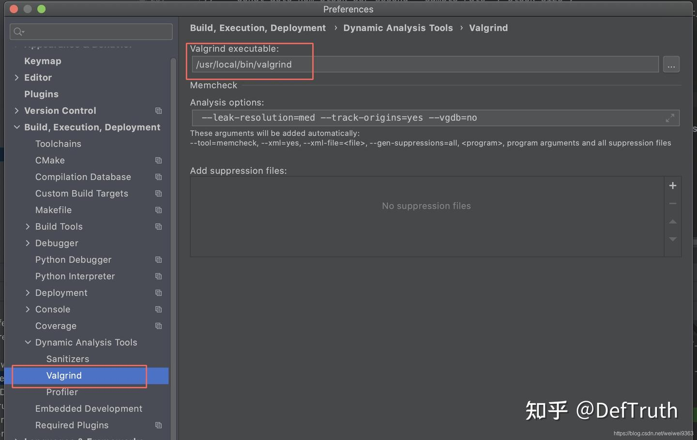
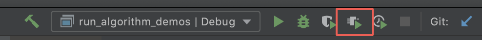
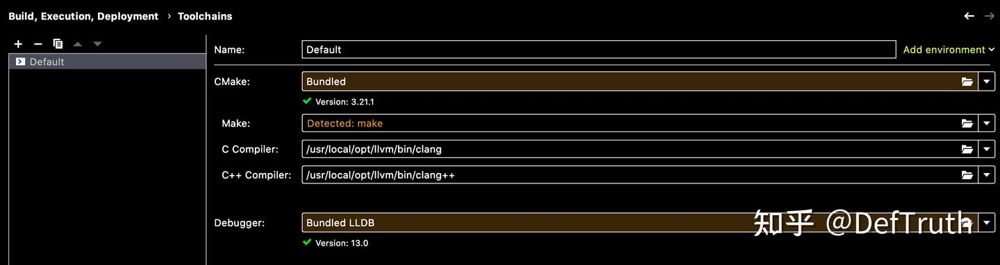
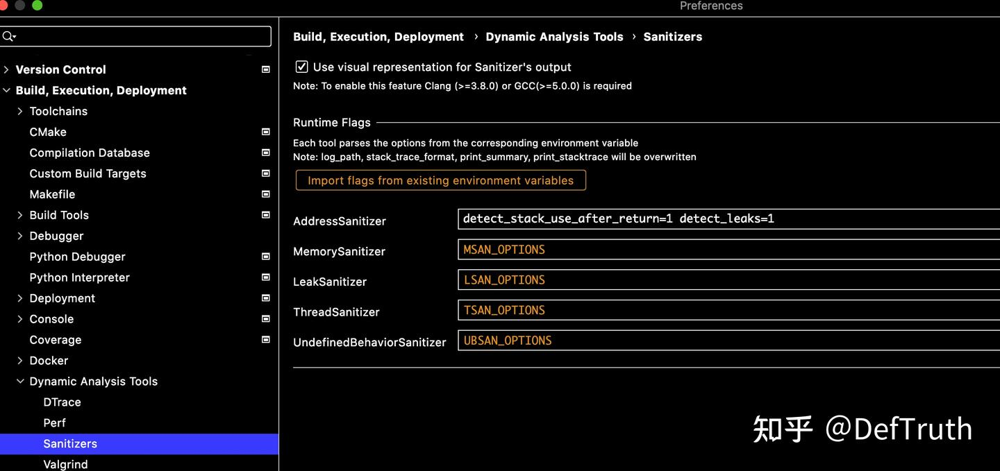
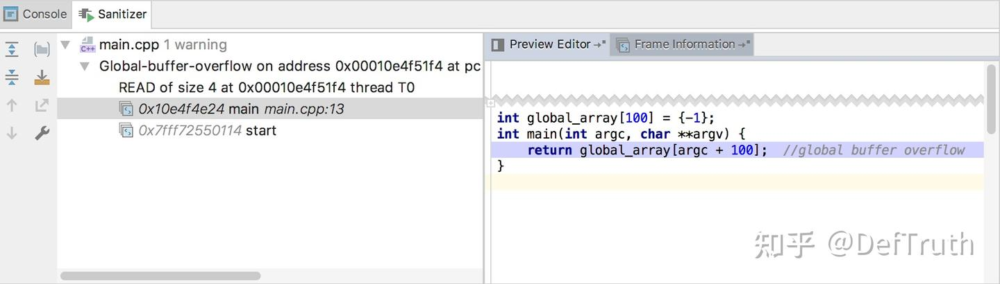
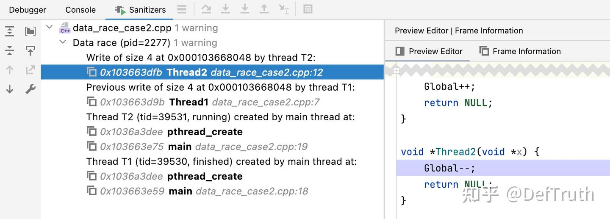
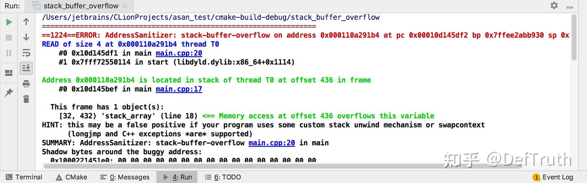
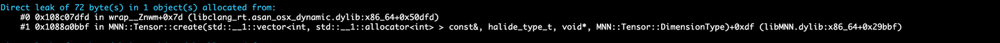

# [에세이][C++] macOS에서 C++ memory check 구성: Valgrind와 ASan

> 원문: https://zhuanlan.zhihu.com/p/508470880

목차

- 0. 서문
- 1. macOS에서 Valgrind 구성
- 1.1 Valgrind 설치
- 1.2 Xcode version 문제
- 1.3 CLion에서 Valgrind 사용
- 1.4 command line에서 Valgrind 사용
- 2. macOS에서 AddressSanitizer와 LeakSanitizer 구성
- 2.1 AddressSanitizer와 LeakSanitizer 소개
- 2.1 LLVM을 먼저 설치하고 clang compiler 정보 확인
- 2.2 CLion 방식으로 사용
- 2.3 CMake와 command line 방식으로 사용
- 3. Sanitizer 참고 자료
- 4. 정리

### 0. 서문

대략 한 달 정도 글을 쓰지 않았다. 최근 비교적 급한 project를 처리하고 있었다. boss가 급하다고 했으니 아마 급한 일이 맞을 것이다. 원래 쓰려던 글 계획은 뒤로 밀릴 수밖에 없었다. 이 한 달 동안 7천 줄이 넘는 code를 꽤 빠르게 밀어 넣었다.

code 자체가 특별히 어렵지는 않았다. OpenCV와 MNN을 기반으로 몇 가지 추론과 pipeline을 이어 붙이는 작업이었다. code를 다 쓴 뒤에는 당연히 기본적인 memory check를 해서 명백한 memory error를 피해야 한다. 이 글은 macOS에서 Valgrind와 ASan tool을 구성하고 간단히 적용한 기록이다.

새로운 내용은 없다. 좋은 기억력보다 엉성한 기록이 낫다. 기록은 output이기도 하고 input이기도 하다. 나중에 비슷한 문제를 다시 만나면 빠르게 참고하기 위한 note다. 오류가 있으면 지적해도 된다.

### 1. macOS에서 Valgrind 구성

Valgrind는 비교적 자주 쓰는 memory check tool이다. Linux에서는 설치가 매우 간단하지만 macOS에서는 상대적으로 번거롭다.

### 1.1 Valgrind 설치

- Linux 설치:

```bash
sudo apt install valgrind
```

- macOS 설치:

Valgrind를 macOS에 맞게 호환 처리한 사람이 있다. 설치 방법은 다음과 같다.

```bash
brew tap LouisBrunner/valgrind
brew install --HEAD LouisBrunner/valgrind/valgrind
```

GitHub 주소: https://github.com/LouisBrunner/valgrind-macos

이 방법으로 Valgrind 설치에 성공했다. 다만 설치 과정에서 몇 가지 작은 문제가 있었고, 그 부분도 간단히 기록한다.

### 1.2 Xcode version 문제

`brew install`로 Valgrind를 설치할 때 설치 과정에서 local Xcode version을 검사한다. 사용하던 compiler는 Xcode 10.14에 포함된 compiler였고, 최신 Valgrind를 설치하려면 더 높은 Xcode version이 필요했다. 따라서 설치 과정에서 Xcode version이 낮다는 문제가 발생했고 Xcode 12 설치를 요구했다.

문제는 Xcode version과 macOS version이 대응된다는 점이다. 내 Mac의 OS version이 높지 않아 Xcode 12를 설치할 수 없었다. 해결 방법은 안내대로 Xcode를 제거하고, Xcode를 설치하지 않은 상태에서 CommandLineTool을 설치하는 것이다. 그러면 Valgrind 설치 과정에서 Xcode 검사를 건너뛰고, 감지된 compiler로 local compile을 진행한다.

- 먼저 Xcode를 깨끗하게 제거한다. 이 단계는 자료가 많으니 길게 쓰지 않는다.

Xcode를 깨끗하게 제거하는 방법 참고: Xcode 완전 제거.

```bash
# app 삭제
sudo rm -rf /Applications/Xcode.app
sudo rm -rf /Library/Preferences/com.apple.dt.Xcode.plist

# user directory 관련 파일 삭제
rm -rf ~/Library/Preferences/com.apple.dt.Xcode.plist
rm -rf ~/Library/Caches/com.apple.dt.Xcode
rm -rf ~/Library/Application\ Support/Xcode

# developer 관련 파일 삭제
rm -rf ~/Library/Developer/Xcode
rm -rf ~/Library/Developer/CoreSimulator
rm -rf ~/Library/Developer/XCPGDevices
```

- CommandLineTool 설치

```bash
xcode-select --install
```

아래 오류가 나오면:

```text
xcode-select: error: command line tools are already installed, use "Software Update" to install updates
```

이미 CommandLineTool이 설치되어 있다는 뜻이다. 덧붙이면 Xcode를 제거했기 때문에 `git`, `cmake` 같은 다른 command tool을 실행할 때 `"active developer path ... dose not exist"` 오류가 날 수 있다. CommandLineTool을 제대로 설정해야 정상 실행된다. 이때는 reset을 수행한다.

```bash
sudo xcode-select -r
```

- Valgrind 다시 설치

```bash
install --HEAD LouisBrunner/valgrind/valgrind
```

### 1.3 CLion에서 Valgrind 사용



CLion에서 executable을 compile한다. compile이 끝나면 아래 그림의 빨간 box를 클릭한다.



program 실행이 끝난 뒤 Run panel에서 Valgrind를 클릭하면 결과를 볼 수 있다.

### 1.4 command line에서 Valgrind 사용

compile된 executable에 대해 command line 방식으로 memory check를 수행할 수 있다. 예를 들어 face detection program에 문제가 있는지 확인하려면 다음 명령을 사용한다.

```bash
valgrind --tool=memcheck ./TestFaceDetection --leak-check=full
```

Valgrind 실행에는 시간이 조금 걸린다. 이후 아래와 비슷한 log가 출력된다.

```text
==44971== Thread 2:
==44971== Invalid read of size 4
==44971==    at 0x101EBCC10: _pthread_wqthread_setup (in /usr/lib/system/libsystem_pthread.dylib)
==44971==    by 0x101EBC942: _pthread_wqthread (in /usr/lib/system/libsystem_pthread.dylib)
==44971==    by 0x101EBBB76: start_wqthread (in /usr/lib/system/libsystem_pthread.dylib)
==44971==  Address 0x18 is not stack'd, malloc'd or (recently) free'd
==44971==
==44971==
==44971== Process terminating with default action of signal 11 (SIGSEGV)
==44971==  Access not within mapped region at address 0x18
==44971==    at 0x101EBCC10: _pthread_wqthread_setup (in /usr/lib/system/libsystem_pthread.dylib)
==44971==    by 0x101EBC942: _pthread_wqthread (in /usr/lib/system/libsystem_pthread.dylib)
==44971==    by 0x101EBBB76: start_wqthread (in /usr/lib/system/libsystem_pthread.dylib)
==44971==  If you believe this happened as a result of a stack
==44971==  overflow in your program's main thread (unlikely but
==44971==  possible), you can try to increase the size of the
==44971==  main thread stack using the --main-stacksize= flag.
==44971==  The main thread stack size used in this run was 8388608.
==44971==
==44971== HEAP SUMMARY:
==44971==     in use at exit: 1,468,413 bytes in 1,149 blocks
==44971==   total heap usage: 1,578 allocs, 429 frees, 2,794,430 bytes allocated
==44971==
==44971== LEAK SUMMARY:
==44971==    definitely lost: 11,796 bytes in 200 blocks
==44971==    indirectly lost: 5,480 bytes in 110 blocks
==44971==      possibly lost: 4,634 bytes in 84 blocks
==44971==    still reachable: 49,061 bytes in 167 blocks
==44971==         suppressed: 1,397,442 bytes in 588 blocks
==44971== Rerun with --leak-check=full to see details of leaked memory
==44971==
==44971== For lists of detected and suppressed errors, rerun with: -s
==44971== ERROR SUMMARY: 1 errors from 1 contexts (suppressed: 68 from 4)
```

Tips: 여기서는 `libsystem_pthread` system library에 문제가 있다고 나온다. 무시해도 된다. macOS system에서 알려진 문제이고, 구체적인 내용은 `pthread-bug-osx`를 보면 된다. 직접 작성한 program에서 보고된 문제가 아니라면, 적어도 code에 아주 명백한 memory leak 문제는 없다는 뜻이다.

Valgrind의 구체적인 사용법은 아래 자료를 참고할 수 있다.

- Linux에서 memory 문제를 검출하는 도구: Valgrind.
- Valgrind 기본 기능 소개와 기본 사용법 설명.
- Install Valgrind on Mac.
- Multithreading in OS X: Pthread Bug Investigation.
- Linux 성능 분석 Valgrind(1): memcheck 사용.
- `pthread_create`가 일으키는 memory leak을 Valgrind로 debug.

### 2. macOS에서 AddressSanitizer와 LeakSanitizer 구성

Valgrind 외에도 compiler에 딸려 있는 가벼운 memory check tool을 사용할 수 있다. AddressSanitizer, ThreadSanitizer, LeakSanitizer 등이 여기에 속한다.

### 2.1 AddressSanitizer와 LeakSanitizer 소개

- AddressSanitizer(ASan): memory address out-of-bounds 검사. 사실 memory leak 검사도 포함한다.
- LeakSanitizer(LSan): memory leak 검사. 단독으로 사용할 수 있다.
- ThreadSanitizer(TSan): thread safety 검사.
- UndefinedBehaviorSanitizer(UBSsan): undefined behavior 검사.
- MemorySanitizer(MSan): memory allocation 검사.

이 도구들은 모두 clang/clang++ compiler에 포함되어 있고, LLVM project의 Sanitizer subproject에 위치한다. 따라서 clang compiler를 사용하면 이 기능들을 비교적 쉽게 사용할 수 있다. 주의할 점은 macOS 기본 clang compiler와 LLVM clang compiler가 조금 다르다는 것이다. macOS 기본 clang은 LeakSanitizer의 memory leak check 기능을 지원하지 않는다. 이는 community에서 보고된 known issue다.

그래서 개인적으로는 LLVM clang compiler 사용을 더 추천한다. 그러면 LeakSanitizer로 memory leak을 검사할 수 있다. 자주 쓰는 것은 주로 AddressSanitizer와 LeakSanitizer다. 나머지는 아직 써 보지 않았으니 여기서는 더 설명하지 않는다. 사용법은 비슷할 것이다.

실사용 기준으로 이 도구들의 장점은 세 가지다.

- 추가 설치가 필요 없다. macOS에서 Valgrind를 설치하는 것은 별로 편하지 않다.
- CMake에 자연스럽게 붙일 수 있다. `CMakeLists.txt`에서 compile option을 바로 설정하면 된다.
- 실행 속도가 빠르다. 실제 사용 체감으로는 Valgrind보다 훨씬 빠르다.

이제 AddressSanitizer와 LeakSanitizer 구성 과정을 간단히 기록한다.

### 2.1 LLVM을 먼저 설치하고 clang compiler 정보 확인

```bash
➜  ~ brew install llvm
➜  ~ which clang
/usr/local/opt/llvm/bin/clang
➜  ~ which clang++
/usr/local/opt/llvm/bin/clang++
➜  ~ clang++ -v
Homebrew clang version 13.0.1
Target: x86_64-apple-darwin19.6.0
Thread model: posix
InstalledDir: /usr/local/opt/llvm/bin
```

### 2.2 CLion 방식으로 사용

- 먼저 compile toolchain을 구성하고 compiler를 LLVM clang으로 설정한다.



- 그다음 Sanitizer를 구성한다. `Settings / Preferences | Build, Execution, Deployment | Dynamic Analysis Tools | Sanitizers`에서 설정한다.



`detect_stack_use_after_return=1`은 program이 return한 뒤에도 검사를 수행한다는 의미다. 예를 들어 memory가 release되지 않았는지 확인할 수 있다. `detect_leaks=1`은 memory leak을 검사한다는 뜻이고, `0`이면 memory leak 문제를 검사하지 않는다.

AddressSanitizer 내부에는 LeakSanitizer가 포함되어 있지만, 기본적으로 memory leak check가 켜져 있지는 않다. 기본적으로는 address out-of-bounds와 illegal read/write만 검사한다. `detect_leaks=1`을 설정해야 AddressSanitizer가 memory leak check를 켠다.

- AddressSanitizer 사용 예시

```cpp
int global_array[100] = {-1};

int main(int argc, char **argv) {
    return global_array[argc + 100];  // global buffer overflow
}
```

그다음 오른쪽 위의 Debugger를 클릭해 compile하고, Debug console을 보면 Sanitizer window가 나타난다.





CLion은 문제가 발생한 cpp file과 해당 문제의 file line number를 알려 준다. 사용 경험은 꽤 괜찮다.



또 CLion은 Sanitizer 구성 tutorial도 제공한다.

LeakSanitizer만 사용하고 싶다면 별도로 구성할 수도 있다. 설정 방법은 AddressSanitizer와 거의 같다.

### 2.3 CMake와 command line 방식으로 사용

CMake를 선호하는 입장에서는 `CMakeLists`에서 직접 구성하는 쪽이 더 좋다. 장점은 간단한 `option`으로 production library와 test library의 compile mode를 제어할 수 있다는 점이다. test library를 compile할 때 AddressSanitizer와 LeakSanitizer를 link해서 test case 실행 시 memory 문제를 검사한다. production library를 compile할 때는 자연스럽게 AddressSanitizer와 LeakSanitizer를 link하지 않는다. 구체적인 방식은 사람마다 다르니 여기서는 작업 취향 문제를 더 다루지 않는다.

- `CMakeLists`에 compiler option 추가: AddressSanitizer, LeakSanitizer 등은 아래 방식으로 지정할 수 있다.

```cmake
set(CMAKE_CXX_FLAGS "${CMAKE_CXX_FLAGS} -fsanitize=[sanitizer_name] [additional_options] [-g] [-OX]")
```

`-fsanitize=adddress`는 compile 시 AddressSanitizer를 사용한다는 의미이고, link 시 `libclang_rt.asan_osx_dynamic.dylib`라는 dynamic library를 link한다. Linux에서는 so다. macOS에서는 `otool`로 compile된 executable의 dependency가 어떻게 바뀌었는지 확인할 수 있다. Linux에서는 `ldd`를 쓴다.

```bash
~ otool -L TestAddressSanitizer
TestAddressSanitizer:
        ...
        @rpath/libMNN.dylib (compatibility version 0.0.0, current version 0.0.0)
        /usr/local/opt/llvm/lib/libc++.1.dylib (compatibility version 1.0.0, current version 1.0.0)
        /usr/local/opt/llvm/lib/clang/13.0.1/lib/darwin/libclang_rt.asan_osx_dynamic.dylib (compatibility version 0.0.0, current version 0.0.0)
        /usr/lib/libSystem.B.dylib (compatibility version 1.0.0, current version 1281.100.1)
```

다른 종류의 Sanitizer를 사용하고 싶다면 `-fsanitize` 값만 바꾸면 된다. 예를 들어 `-fsanitize=leak`를 사용한다. 다음은 `CMakeLists`에서 실제 사용한 예시다.

```cmake
option(ENABLE_FSANITIZE "Build lib with ASAN/TSAN/USAN checking." ON)
# Address Illegal Checks
if (NOT DEFINED FSANITIZE_TYPE)
    set(FSANITIZE_TYPE address)  # memory out-of-bounds check
    # address leak memory for linux; (AddressSanitizer, ThreadSanitizer,
    # and UndefinedBehaviorSanitizer) for MacOS. Only llvm/clang support
    # all AddressSanitizer and LeakSanitizer etc.
endif ()
if (ENABLE_FSANITIZE)
    set(CMAKE_CXX_FLAGS "${CMAKE_CXX_FLAGS} -fsanitize=${FSANITIZE_TYPE} -fno-omit-frame-pointer -g -O1")
    message(STATUS "PERFORMING FSANITIZE CHECK, FSANITIZE TYPE: [${FSANITIZE_TYPE}]")
    message(STATUS "PERFORMING FSANITIZE CHECK, CMAKE_CXX_FLAGS: [${CMAKE_CXX_FLAGS}]")
endif ()
# Use [-g] to have file names and line numbers included in warning messages.
```

- AddressSanitizer 사용 사례

새 cpp file을 만들고 아래와 비슷한 code를 작성한다.

```cpp
int main(int argc, char *argv[])
{
  char p[5] = "";
  uint8_t tmp = 5;
  p[-1] = 7; // address illegal
  std::cout << (void *) p << std::endl;
  std::cout << (void *) &tmp << std::endl;
  std::cout << (uint32_t) tmp << std::endl;
  return 0;
}
```

위 방식으로 `CMakeLists`에서 AddressSanitizer memory check 사용을 지정한 뒤 compile하면 executable을 얻는다. 이때는 해당 executable을 직접 실행하면 된다.

```bash
./TestAddressSanitizer
```

test code 안에 address out-of-bounds를 일으키는 illegal read/write가 있으므로, `TestAddressSanitizer` 실행 시 오류가 출력된다.

```text
=================================================================
==58057==ERROR: AddressSanitizer: stack-buffer-overflow on address 0x7ffee383043f at pc 0x00010c3d5db4 bp 0x7ffee38303b0 sp 0x7ffee38303a8
WRITE of size 1 at 0x7ffee383043f thread T0
    #0 0x10c3d5db3 in main TestAddressSanitizer.cpp:45
    #1 0x7fff69cbfcc8 in start+0x0 (libdyld.dylib:x86_64+0x1acc8)

Address 0x7ffee383043f is located in stack of thread T0 at offset 127 in frame
    #0 0x10c3d524f in main TestAddressSanitizer.cpp:43

  This frame has 14 object(s):
    [32, 40) 'ref.tmp.i.i22.i'
    [64, 72) 'ref.tmp.i.i8.i'
    [96, 104) 'ref.tmp.i.i.i'
    [128, 133) 'p.i' (line 29) <== Memory access at offset 127 underflows this variable
    [160, 161) 'tmp.i' (line 30)
    ...
    [688, 712) 'ref.tmp.i' (line 22)
    [752, 776) 'ref.tmp16.i' (line 22)
    [816, 824) 'tt.i' (line 23)
HINT: this may be a false positive if your program uses some custom stack unwind mechanism, swapcontext or vfork
      (longjmp and C++ exceptions *are* supported)
SUMMARY: AddressSanitizer: stack-buffer-overflow TestAddressSanitizer.cpp:45 in main
Shadow bytes around the buggy address:
  0x1fffdc706030: 00 00 00 00 00 00 00 00 00 00 00 00 00 00 00 00
  0x1fffdc706040: 00 00 00 00 00 00 00 00 00 00 00 00 00 00 00 00
  0x1fffdc706050: 00 00 00 00 00 00 00 00 00 00 00 00 00 00 00 00
  0x1fffdc706060: 00 00 00 00 00 00 00 00 00 00 00 00 00 00 00 00
  0x1fffdc706070: 00 00 00 00 00 00 00 00 f1 f1 f1 f1 f8 f2 f2 f2
=>0x1fffdc706080: f8 f2 f2 f2 f8 f2 f2[f2]05 f2 f2 f2 01 f2 f8 f8
  0x1fffdc706090: f8 f2 f2 f2 f2 f2 f8 f8 f8 f2 f2 f2 f2 f2 f8 f8
  0x1fffdc7060a0: f8 f8 f8 f2 f2 f2 f2 f2 f8 f8 f8 f2 f2 f2 f2 f2 f8 f8
  0x1fffdc7060b0: f8 f8 f8 f8 f8 f8 f8 f8 f8 f8 f2 f2 f2 f2 f8 f8
  0x1fffdc7060c0: f8 f8 f8 f8 f8 f8 f8 f8 f8 f8 f2 f2 f2 f2 f8 f8
  0x1fffdc7060d0: f8 f2 f2 f2 f2 f2 f8 f8 f8 f2 f2 f2 f2 f2 f8 f3
Shadow byte legend (one shadow byte represents 8 application bytes):
  Addressable:           00
  Partially addressable: 01 02 03 04 05 06 07
  Heap left redzone:       fa
  Freed heap region:       fd
  Stack left redzone:      f1
  Stack mid redzone:       f2
  Stack right redzone:     f3
  Stack after return:      f5
  Stack use after scope:   f8
  Global redzone:          f9
  Global init order:       f6
  Poisoned by user:        f7
  Container overflow:      fc
  Array cookie:            ac
  Intra object redzone:    bb
  ASan internal:           fe
  Left alloca redzone:     ca
  Right alloca redzone:    cb
==58057==ABORTING
[1]    58057 abort      ./TestAddressSanitizer
```

command line 방식에서 memory leak check를 수행하고 싶다면 executable 실행 전에 `ASAN_OPTIONS=detect_leaks=1`을 지정하면 된다.

```bash
ASAN_OPTIONS=detect_leaks=1 ./TestAddressSanitizer
```

실제 사용 중 이 방식으로 내 MNN 사용법 하나가 부적절해서 작은 memory leak을 일으킨다는 것을 발견했다. 나중에 안전을 위해 더 안전한 방식으로 되돌렸다. 적어도 program 안에 명백한 memory problem은 남기지 않는 편이 낫다.



compiler의 Sanitizer를 이용한 memory check 사용법은 여기까지다. 나중에 새로운 시도가 있으면 계속 보충한다.

### 3. Sanitizer 참고 자료

Sanitizer 사용법 참고 자료도 몇 가지 정리해 둔다.

- Address Sanitizer(ASan) 원리와 관련 GCC option list.
- macOS와 Linux에서 ASan memory detection 사용.
- AddressSanitizer로 code memory 문제 찾기: compile instrumentation과 runtime check.
- AddressSanitizer로 memory analysis 하기(1): intro.
- Address Sanitizer(ASan) 원리와 실전 위치 추적.
- memory detection tool sanitizer: memory leak, memory out-of-bounds vs Valgrind.
- Google sanitizers CLion 설정.
- AddressSanitizer 사용 소개: 사용 방식.
- macOS LLVM이 memory leak check를 지원하지 않는 문제 해결: 최신 LLVM clang++ compiler 사용.
- Mac OS X Sierra: `detect_leaks` is not supported on this platform. Use LLVM clang++.
- clang의 LeakSanitizer.
- Mac OS: Leaks Sanitizer.
- How to use clang's LeakSanitizer on macOS?

### 4. 정리

이 글은 macOS에서 C++ memory check를 수행하는 두 가지 기본 방식, Valgrind와 AddressSanitizer를 소개하고, 두 방식의 구성과 사용 방법을 자세히 설명했다. Valgrind가 더 좋은지 compiler built-in AddressSanitizer가 더 좋은지는 여기서 논하지 않는다. macOS에서 C++ program의 memory를 검사하는 내용은 여기까지 정리하고, 나중에 새로운 시도가 있으면 계속 보충한다.

C++ model engineering 사례를 더 보고 싶다면 관련 column을 보면 된다.
