# [기술 에세이][CV] torchlm 얼굴/인체/손 keypoint 데이터 증강

> 원문: https://zhuanlan.zhihu.com/p/467211561

### 이 글은 Jishi Platform에 허가된 글이다. 허가 없이 2차 전재하지 말 것. 필요하면 저자에게 개인 메시지를 보내면 된다.

## 0. 서문


keypoint detection 칼럼을 하나 쓰려 한다. 최근 2년 작업은 이 작업을 계속 비켜 가지 못했다. 이름은 "keypoint만 말하기"로 정했다. 이 글은 "keypoint만 말하기"(얼굴/인체/손 keypoint detection) 시리즈의 첫 번째 글이다.

첫 글이라면 기본적이면서 실용적인 내용을 말해야 한다고 봤다. keypoint detection에서 "기본적이고 실용적인" 지식은 무엇인가. 답은 당연히 **data augmentation**이다. 지금 연구하거나 해결해야 하는 작업이 얼굴 keypoint, 인체 keypoint, 손 keypoint 중 무엇이든 data augmentation은 필요하다. 손에 단순하고 쓰기 쉬운 data augmentation 도구가 있으면 시간을 꽤 아낄 수 있다.

이 글은 이 칼럼의 모든 글 중 실용성이 가장 강한 편일 가능성이 높다. 그래서 첫 글로 적합하다. 이 글은 기존 data augmentation 도구를 소개하고, 내가 통합한 작은 도구 **torchlm**도 소개한다. torchlm은 **100+** 종류의 keypoint detection 방법과 호환되고, 사용이 단순하며, pip로 한 번에 설치할 수 있다. 아래 내용은 모두 개인적인 이해다. 오류가 있으면 지적하면 된다.

GitHub(star와 PR 환영): https://github.com/DefTruth/torchlm

## 1. 기존 data augmentation 도구는 어떤가

현재 어떤 data augmentation 도구가 있는가. 유명한 것은 imgaug와 albumentations다. torchvision에도 자주 쓰는 image data augmentation 방법이 일부 포함되어 있다. imgaug와 albumentations는 매우 많은 기본 data augmentation 방법을 포함한다. noise 추가, affine transform, crop, flip, rotate 등을 구현할 수 있고, bounding box와 keypoint 같은 data type의 변환도 지원한다. 효과는 다음 그림과 같다.


또한 Albumentations는 《Albumentations: fast and flexible image augmentations》라는 논문도 냈다. 현재 albumentations에는 70개가 넘는 data augmentation 방법이 포함되어 있고, image, bounding box, keypoint, segmentation 등 여러 data type의 변환을 포괄한다.

이 오픈소스 라이브러리들의 특징은 매우 포괄적이라는 점이다. 다양한 data type의 변환을 지원한다. 나도 일상 업무에서 자주 사용한다. 그러나 많이 쓰다 보니 사용 경험 면에서 몇 가지 문제가 보이기 시작했다.

예를 들어 imgaug, albumentations, torchvision을 함께 쓰려 하면 각자 data type 정의가 다르다. 서로 다른 규격을 맞추기 위해 변환 함수를 자주 만들어야 하고, 전체 pipeline이 지저분해진다.

또 다른 예로 albumentations 스타일로 keypoint transform을 하나 작성하려 하면, albumentations는 `apply_to_keypoints`만 구현하라고 요구하지 않는다. `apply_to_bboxes`, `apply_to_mask` 같은 방법도 함께 맞춰 다른 data type 변환과 호환되게 해야 한다. 하지만 실제로는 keypoint 변환 기능 하나만 필요하고, 그것을 Compose pipeline에 비교적 깔끔하게 넣고 싶을 뿐이다. 결국 외부에 함수를 하나 작성해 처리하게 된다. 이 방식은 그다지 pythonic하지 않다.

또 imgaug와 albumentations는 "data safety"를 충분히 잘 검사하지 않는다. albumentations에서 `remove_invisible=True`로 설정하면 이미지 밖으로 나간 점을 자동 삭제한다. `False`로 두면 점이 이미지 밖에 있어도 보존한다. 실제 적용에서 keypoint detection 작업에는 둘 다 그다지 합리적이지 않다. 이미지 밖 점을 삭제하면 일련의 data augmentation 뒤 원래 10개였던 점이 8개가 될 수 있다. 이 8개 점은 인덱스가 맞지 않으므로 대체로 사용할 수 없다. 반대로 이미지 밖의 점을 보존하면 training data에 추가 오차를 도입할 수 있다.

물론 이들은 매우 뛰어난 오픈소스 도구다. 다만 keypoint detection 작업만 놓고 보면 더 단순하고 일관적인 data augmentation 도구가 필요했다. 지나친 추상화가 필요 없고, one-line code 스타일이면 충분하다.

- imgaug repository(12k+ star): https://github.com/aleju/imgaug
- albumentations repository(9k+ star): https://github.com/albumentations-team/albumentations

## 2. 원하는 data augmentation 도구는 어떤 모습인가

내가 상상한 도구는 "minimalism" 성격을 가진 toolkit이다. 다음 조건을 만족해야 한다.

- 한 가지 일, 즉 keypoint detection에만 집중한다.
- 선택 가능한 방법은 충분히 많지만 사용법은 충분히 단순하다.
- 다른 mainstream library의 방법을 `one-line code`로 호환한다.
- 가능하면 추가 추상화를 들이지 않고, 사용자 정의 방법 binding을 지원한다.
- data augmentation에 `safety`가 있어야 하며, 안전하지 않은 augmentation transform은 자동 rollback할 수 있어야 한다.
- `zero-code로 numpy와 Tensor data type을 자동 호환`해야 하며, 사용자가 어떤 변환도 직접 할 필요가 없어야 한다.

현재 기존 오픈소스 도구 중 위 요구를 모두 만족하는 것은 없어 보였다. 그래서 직접 하나 작성했다. 그렇게 **torchlm**의 transforms 모듈이 나왔다.

물론 강조해야 한다. 이것은 유용한 혁신을 한 것이 아니며, 성숙한 오픈소스 프로젝트들과 비교하려는 것도 아니다. 단지 keypoint data augmentation 방법들을 더 쓰기 쉽게 만들기 위해 나온 것이다.

**torchlm**은 직접 구현한 거의 **30**가지 keypoint data augmentation 방법을 제공한다. 또한 **torchlm.bind**를 통해 torchvision과 albumentations에서 온 **80+** 종류의 data augmentation 방법을 one-line-code style로 호환할 수 있다. 사용자 정의 방법도 한 줄로 binding할 수 있다. numpy와 Tensor data type을 자동 호환하므로 사용자가 어떤 변환도 할 필요가 없다. 그리고 torchlm이 제공하는 약 30가지 keypoint data augmentation 방법과 **torchlm.bind**로 binding된 torchvision/albumentations의 80+ 방법은 모두 "safe"하다. 안전하지 않은 augmentation transform은 자동 rollback한다.

## 3. torchlm transforms 모듈 소개

- **Data format 요구사항**:

모든 transform은 통일해서 `(img, landmarks)`를 입력과 출력으로 사용한다. 실제로 점 위치를 바꾸는지와 상관없다. 점을 바꾸지 않는 image-only transform은 원래 landmark를 그대로 반환한다.

`np.ndarray`와 `torch.Tensor`를 모두 사용할 수 있다. 둘이 가장 흔히 쓰이기 때문이다. albumentations의 list 형식은 오히려 자주 쓰지 않는다. landmarks에 수학 연산을 자주 해야 하므로 list는 불편하다. `img`는 RGB 형식으로 입력/출력하며 shape은 **(H,W,3)**이다. `landmarks`는 `xy` 형식으로 입력/출력하며 shape은 `(N,2)`다. `N`은 점의 수다.

- **Type naming style**:

명명 스타일은 `LandmarksXXX` 또는 `LandmarksRandomXXX`로 통일한다. torchvision과 albumentations의 naming style을 따른다. `Random`은 해당 type이 random transform class이며, 초기화 시 확률을 지정할 수 있음을 의미한다. torchlm이 제공하는 non-Random type은 torchlm pipeline에서 반드시 실행된다. 다만 다른 mainstream library에서 bind한 것은 반드시 실행된다는 뜻은 아니다. 예를 들어 albumentations에서는 non-Random type에도 확률을 지정할 수 있다.

- **Automatic data type conversion, autodtype**:

이 문제는 흔하다. landmarks를 numpy array로 기분 좋게 처리한 뒤 torchvision의 image-only transforms와 albumentations를 함께 쓰려는 순간, torchvision은 Tensor 입력을 요구하고 albumentations는 landmarks 입력으로 list를 요구한다. numpy 입장에서는 억울하다.

해결 방법은 복잡하지 않다. Python decorator를 사용해 함수나 bind된 transform에 자동 data type 변환 표시를 붙이면 된다. 나는 **autodtype** decorator를 작성했다. 이런 지루한 일을 전담한다. 함수가 필요로 하는 입력 type으로 data type을 변환하고, augmentation이 끝난 뒤 다시 원래 type으로 되돌린다.

- **Data augmentation의 safety와 simplicity**:

keypoint detection 작업에서는 보통 일련의 data augmentation 이후에도 점이 완전하기를 바란다. 예를 들어 98-point face keypoint detection을 한다면, data augmentation 때문에 점 수가 줄거나 추가 오차가 생기는 것은 좋은 선택이 아니다. 그래서 data augmentation의 "safety"가 중요하다.

**torchlm.bind**는 bind된 type이나 method에 대해 이런 safety check를 자동으로 수행한다. **torchlm** transforms 모듈의 모든 method도 이 safety check를 지원한다. 이상한 점 위치가 나오지 않는다. 변환 전후 점 수가 일치하지 않는 것을 발견하면 안전하지 않은 augmentation transform을 자동 rollback한다.

- **torchlm.bind method 설명**:

여기서는 **torchlm.bind**를 따로 설명한다. torchvision, albumentations, 사용자 정의 method는 **torchlm.bind**로 binding되면 자동으로 autodtype과 safety 특성을 갖는다. 사용자는 keypoint data augmentation 함수를 정상적으로 정의하기만 하면 된다. 나머지 주변 처리는 **torchlm.bind**가 맡는다.

또 **torchlm.bind**는 유용한 parameter인 **prob**를 제공한다. 이 parameter를 지정하면 binding된 모든 transform 또는 callable method를 random style로 만든다. 지정한 확률에 따라 실행된다. torchvision의 일부 transform은 random이 아니다. 이 방식으로 random transform처럼 만들 수 있다. 사용자 정의 함수도 마찬가지다. 수동으로 random logic을 작성하지 않아도 **torchlm.bind**의 `prob` 설정으로 random version이 된다.

이렇게 하면 torchvision, albumentations, 사용자 정의 method 어디에서 온 것이든 Compose pipeline에 비교적 깔끔하게 넣을 수 있다. 다음은 혼합 사용 예시다.

```python
import torchvision
import albumentations
import torchlm
transform = torchlm.LandmarksCompose([
        # use native torchlm transforms
        torchlm.LandmarksRandomScale(prob=0.5),
        # bind torchvision image only transforms, bind with a given prob
        torchlm.bind(torchvision.transforms.GaussianBlur(kernel_size=(5, 25)), prob=0.5),  # no manual data conversion needed
        torchlm.bind(torchvision.transforms.RandomAutocontrast(p=0.5)),
        # bind albumentations image only transforms
        torchlm.bind(albumentations.ColorJitter(p=0.5)), # no external landmark-count check needed
        torchlm.bind(albumentations.GlassBlur(p=0.5)),
        # bind albumentations dual transforms
        torchlm.bind(albumentations.RandomCrop(height=200, width=200, p=0.5)),
        torchlm.bind(albumentations.Rotate(p=0.5)),
        # bind custom callable array functions
        torchlm.bind(callable_array_noop, bind_type=torchlm.BindEnum.Callable_Array),
        # bind custom callable Tensor functions with a given prob, turn it into a random version
        torchlm.bind(callable_tensor_noop, bind_type=torchlm.BindEnum.Callable_Tensor, prob=0.5),
        # ...
    ])
 new_img, new_landmarks = transform(img, landmarks) # img and landmarks can be np.ndarray or Tensor
```

이 사용법은 훨씬 깔끔하다. **torchlm.bind**가 주변 처리를 대신 해준다.

## 4. torchlm one-click 설치

**torchlm**은 이미 pypi에 배포되어 있다. 따라서 pip로 한 번에 설치할 수 있다.

```bash
pip3 install torchlm
# install from specific pypi mirrors use '-i'
pip3 install torchlm -i https://pypi.org/simple/
```

또는 github 소스에서 내려받아 설치할 수 있다.

```bash
# clone torchlm repository locally
git clone --depth=1 https://github.com/DefTruth/torchlm.git
cd torchlm
# install in editable mode
pip install -e .
```

## 5. torchlm native data augmentation methods

- `LandmarksNormalize`: `img`를 normalize한다. `x = (x - mean) / std`다. `landmarks`는 처리하지 않는다. 초기화 parameter: `mean: float`, 평균, 기본값 `127.5`; `std: float`, 표준편차, 기본값 `128.0`.

```python
class LandmarksNormalize(LandmarksTransform):
   def __init__(
            self,
            mean: float = 127.5,
            std: float = 128.
   ):
```

- `LandmarksUnNormalize`: `img`를 inverse normalize한다. `x = x * std + std`다. `landmarks`는 처리하지 않는다. 초기화 parameter: `mean: float`, 평균, 기본값 `127.5`; `std: float`, 표준편차, 기본값 `128.0`.

```python
class LandmarksUnNormalize(LandmarksTransform):
    def __init__(
            self,
            mean: float = 127.5,
            std: float = 128.
    ):
```

- `LandmarksToTensor`: `img`와 `landmarks`를 numpy array에서 Tensor로 변환한다. 초기화 parameter는 없다.

```python
class LandmarksToTensor(LandmarksTransform):
    def __init__(self):
```

- `LandmarksToNumpy`: `img`와 `landmarks`를 Tensor에서 numpy array로 변환한다. 초기화 parameter는 없다.

```python
class LandmarksToNumpy(LandmarksTransform):
    def __init__(self):
```

- `LandmarksResize`: `img`를 resize하고 landmarks 좌표도 조정한다. 초기화 parameter: `size: Union[Tuple[int, int], int]`, resize 후 target image size, 순서는 `(w,h)`; `keep_aspect: bool`, aspect ratio를 유지할지 여부, 기본값 `False`. `True`로 설정하면 입력 `img`의 aspect ratio를 유지하고 빈 영역은 zero padding한다.

```python
class LandmarksResize(LandmarksTransform):
    def __init__(
            self,
            size: Union[Tuple[int, int], int],
            keep_aspect: bool = False
    ):
```

- `LandmarksClip`: landmarks의 bounding rectangle을 중심으로 `img`를 crop한다. 일반적으로 불필요한 background 영역을 제거하고 landmarks bounding rectangle의 확장 영역 안에서만 점 위치를 추정하려 할 때 사용한다. 초기화 parameter: `width_pad: float`, 기본값 `0.2`, landmarks width에 대한 확장 비율. 확장 후 box width는 landmarks bounding rectangle의 `(width_pad + 1. + width_pad)`배다. `height_pad: float`, 기본값 `0.2`, landmarks height에 대한 확장 비율. 확장 후 box height는 `(height_pad + 1. + height_pad)`배다. `target_size: Union[Tuple[int, int], int]`, 기본값 `None`, clip 이후 특정 size로 다시 resize할지 여부를 나타낸다. clip된 `img`를 지정한 `target_size`로 다시 resize하려면 `kwargs`를 넘기며, 이는 `LandmarksResize`에 전달된다. 그렇지 않으면 이 parameter는 의미가 없다.

```python
class LandmarksClip(LandmarksTransform):
    def __init__(
            self,
            width_pad: float = 0.2,
            height_pad: float = 0.2,
            target_size: Union[Tuple[int, int], int] = None,
            **kwargs
    ):
```

- `LandmarksRandomCenterCrop`: random center crop. `img`의 중심점 `(cx,cy)`를 중심으로 지정된 width/height ratio range에서 무작위 비율을 선택해 crop한다. 이 transform은 실제 image crop 비율에 맞춰 landmarks 좌표를 바꾸고, 점 좌표가 out-of-bounds인지 자동으로 safety check한다. crop 영역이 반드시 모든 점을 포함하도록 보장한다.

일반적으로 random center crop은 **face detector가 만드는 흔들림을 모사하는 데 유용하다**. 고정된 face bounding box size ratio에 overfit되는 것을 피할 수 있다. 실제 적용에서는 upstream face detector가 바뀌지 않는다고 보장하기 어렵다. 그래서 face box jitter는 거의 필연적으로 존재한다. random center crop으로 이런 상황을 모사할 수 있다.

초기화 parameter: `width_range: Tuple[float, float]`, width ratio 선택 범위, 기본값 `(0.8, 1.0)`. 무작위로 `w_r`을 선택하고 원본 image width가 `img_w`라면 최종 crop width는 `(w_r * img_w)`다. 이 crop은 `(cx,cy)`를 중심으로 대칭인 것이 아니라, 모든 점을 포함한다는 조건에서 좌우로 무작위 offset된다. `height_range: Tuple[float, float]`, height ratio 선택 범위, 기본값 `(0.8, 1.0)`. 무작위로 `h_r`을 선택하고 원본 image height가 `img_h`라면 최종 crop height는 `(h_r * img_h)`다. 모든 점을 포함하는 조건에서 위아래로 무작위 offset된다. `prob: float`, 기본값 `0.5`, 발생 확률.

```python
class LandmarksRandomCenterCrop(LandmarksTransform):
    def __init__(
            self,
            width_range: Tuple[float, float] = (0.8, 1.0),
            height_range: Tuple[float, float] = (0.8, 1.0),
            prob: float = 0.5
    ):
# usage
transform = torchlm.LandmarksCompose([
        torchlm.LandmarksRandomCenterCrop(width_range=(0.5, 0.1), height_range=(0.5, 0.1), prob=1.),
        torchlm.LandmarksResize((256, 256))
    ])
```

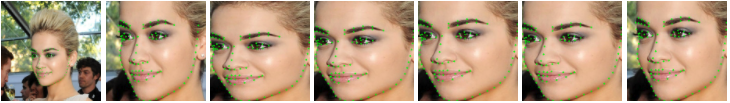

- `LandmarksHorizontalFlip`: horizontal mirror flip. 초기화 parameter는 없다. 이 방법은 점의 index order를 바꾼다. 따라서 보통 사용하지 않는 편이 낫다. task가 mirror를 허용하는 경우가 아니면 loss가 계속 수렴하지 않을 수 있다. 실제로 밟아 본 함정이다. 그래도 이 method는 구현해 두었다.

```python
class LandmarksHorizontalFlip(LandmarksTransform):
    """WARNING: HorizontalFlip augmentation mirrors the input image. When you apply
     that augmentation to keypoints that mark the side of body parts (left or right),
     those keypoints will point to the wrong side (since left on the mirrored image
     becomes right). So when you are creating an augmentation pipeline look carefully
     which augmentations could be applied to the input data. Also see:
     https://albumentations.ai/docs/getting_started/keypoints_augmentation/
    """
    def __init__(self):
```

- `LandmarksRandomHorizontalFlip`: horizontal mirror flip의 random version. 초기화 parameter: `prob: float`, 기본값 `0.5`, 발생 확률. 이건 random version의 함정이라 더 찾기 어렵다. task 본질상 mirror가 허용되지 않는데 이 augmentation을 사용하면, loss가 내려가다 올라가거나, 그럴듯한 위치로 수렴한 뒤 더 내려가지 않을 수 있다. mirror 발생 확률이 작으면 더 발견하기 어렵다.

```python
class LandmarksRandomHorizontalFlip(LandmarksTransform):
    """WARNING: HorizontalFlip augmentation mirrors the input image. When you apply
     that augmentation to keypoints that mark the side of body parts (left or right),
     those keypoints will point to the wrong side (since left on the mirrored image
     becomes right). So when you are creating an augmentation pipeline look carefully
     which augmentations could be applied to the input data. Also see:
     https://albumentations.ai/docs/getting_started/keypoints_augmentation/
    """
    def __init__(
            self,
            prob: float = 0.5
    ):
```

- `LandmarksAlign`: face alignment. 주로 face keypoint detection task에 사용하며, 반드시 data augmentation은 아니다. aligned face와 aligned keypoint를 얻기 위한 용도에 가깝다. 초기화 parameter: `eyes_index: Union[Tuple[int, int], List[int]]`, landmarks에서 left/right eye center point의 index를 반드시 지정해야 한다.

```python
class LandmarksAlign(LandmarksTransform):
    def __init__(
            self,
            eyes_index: Union[Tuple[int, int], List[int]] = None
    ):
# usage
transform = torchlm.LandmarksCompose([
        torchlm.LandmarksRandomRotate(80, prob=1.),  # add rotation first
        torchlm.LandmarksRandomAlign(eyes_index=(96, 97), prob=1.),  # then align to inspect the effect
        torchlm.LandmarksResize((256, 256))
    ])
```

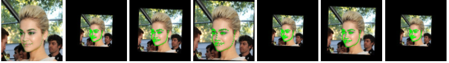

- `LandmarksRandomAlign`: face alignment의 random version. 주로 face keypoint detection task에 사용하며 data augmentation으로 사용할 수 있다. 어떤 이유에서든 일부 face를 keypoint 기준으로 무작위 align한 뒤 training data로 쓰고 싶다면 이 augmentation method를 사용할 수 있다. 초기화 parameter: `eyes_index: Union[Tuple[int, int], List[int]]`, landmarks에서 left/right eye center point index를 반드시 지정해야 한다. `prob: float`, 기본값 `0.5`, 발생 확률.

```python
class LandmarksRandomAlign(LandmarksTransform):
    def __init__(
            self,
            eyes_index: Union[Tuple[int, int], List[int]] = None,
            prob: float = 0.5
    ):
```

- `LandmarksRandomScale`: random scale transform. 지정된 scale value range에서 ratio를 선택해 입력 image를 scale transform, stretch deformation하고 landmarks 좌표도 함께 조정한다. 초기화 parameter: `scale: Union[Tuple[float, float], float]`, 원본 image width/height 대비 scale 변화 범위 ratio; `prob: float`, 기본값 `0.5`, 발생 확률; `diff: bool`, width/height ratio를 서로 다르게 random하게 둘지 여부, 기본값 `True`. `False`이면 image width/height에 같은 ratio를 선택해 stretch한다.

```python
class LandmarksRandomScale(LandmarksTransform):
    def __init__(
            self,
            scale: Union[Tuple[float, float], float] = 0.4,
            prob: float = 0.5,
            diff: bool = True
    ):
# usage
transform = torchlm.LandmarksCompose([
        torchlm.LandmarksRandomScale(scale=(-0.5, 1.5), prob=1.),
        torchlm.LandmarksResize((256, 256), keep_aspect=True)
    ])
```

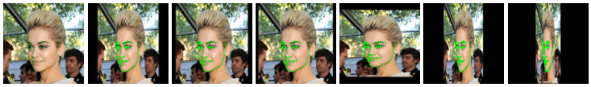

- `LandmarksRandomShear`: random shear transform. image에 shear transform을 적용하고 landmarks 좌표도 함께 조정한다. 초기화 parameter: `shear_factor: Union[Tuple[float, float], List[float], float]`, random shear ratio range, 보통 `(-1.,1)` 사이; `prob: float`, 기본값 `0.5`, 발생 확률.

```python
class LandmarksRandomShear(LandmarksTransform):
    def __init__(
            self,
            shear_factor: Union[Tuple[float, float], List[float], float] = 0.2,
            prob: float = 0.5
    ):
# usage
transform = torchlm.LandmarksCompose([
        torchlm.LandmarksRandomShear(prob=1.),
        torchlm.LandmarksResize((256, 256))
    ])
```

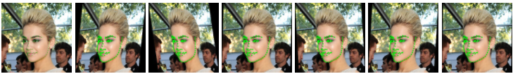

- `LandmarksRandomHSV`: random HSV color space transform. image의 HSV color space에서 pixel을 random하게 조정한다. image-only transform이므로 landmarks 좌표는 바꾸지 않는다. 초기화 parameter: `hue: Union[Tuple[int, int], int]`, hue/color temperature 변화 범위, `(-20,+20)` 사이를 권장; `saturation: Union[Tuple[int, int], int]`, saturation 변화 범위, `(-20,+20)` 권장; `brightness: Union[Tuple[int, int], int]`, brightness 변화 범위, `(-20,+20)` 권장; `prob: float`, 기본값 `0.5`, 발생 확률.

```python
class LandmarksRandomHSV(LandmarksTransform):
    def __init__(
            self,
            hue: Union[Tuple[int, int], int] = 20,
            saturation: Union[Tuple[int, int], int] = 20,
            brightness: Union[Tuple[int, int], int] = 20,
            prob: float = 0.5
    ):
# usage
transform = torchlm.LandmarksCompose([
        torchlm.LandmarksRandomHSV(prob=1.),
        torchlm.LandmarksResize((256, 256))
    ])
```

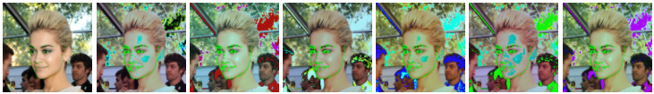

- `LandmarksRandomTranslate`: random translation transform. 입력 image에 대해 주어진 translation ratio range에서 ratio를 무작위 선택해 translation하고, landmarks 좌표도 대응해서 바꾼다. translation은 일부 landmarks를 out-of-bounds로 만들 수 있다. 내부에서 data "safety" 판정을 수행해 안전하지 않은 transform을 자동 취소하고, transform 전후 landmarks 수의 일관성을 보장한다. 초기화 parameter: `translate: Union[Tuple[float, float], float]`, translation ratio range, `(-0.2,0.2)` 권장; `prob: float`, 기본값 `0.5`, 발생 확률; `diff: bool`, width/height 방향에 서로 다른 translation ratio를 사용할지 여부, 기본값 `False`.

```python
class LandmarksRandomTranslate(LandmarksTransform):
    def __init__(
            self,
            translate: Union[Tuple[float, float], float] = 0.2,
            prob: float = 0.5,
            diff: bool = False
    ):
# usage
transform = torchlm.LandmarksCompose([
        torchlm.LandmarksRandomTranslate(prob=1.),
        torchlm.LandmarksResize((256, 256))
    ])
```

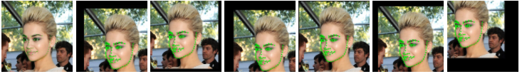

- `LandmarksRandomRotate`: random rotation transform. 입력 image에 대해 주어진 angle range에서 angle을 무작위 선택해 rotation하고, landmarks 좌표도 대응해서 바꾼다. rotation은 일부 landmarks를 out-of-bounds로 만들 수 있다. 내부에서 data "safety" 판정을 수행해 안전하지 않은 transform을 자동 취소하고, transform 전후 landmarks 수의 일관성을 보장한다. 초기화 parameter: `angle: Union[Tuple[int, int], List[int], int]`, angle 변화 범위, `(-90,+90)` 권장; `prob: float`, 기본값 `0.5`, 발생 확률; `bins: Optional[int]`, `angle` range 안의 angle을 몇 개 bin으로 등간격 분할할지 지정할 수 있다.

```python
class LandmarksRandomRotate(LandmarksTransform):
    def __init__(
            self,
            angle: Union[Tuple[int, int], List[int], int] = 10,
            prob: float = 0.5,
            bins: Optional[int] = None
    ):
# usage
transform = torchlm.LandmarksCompose([
        torchlm.LandmarksRandomRotate(angle=80, prob=1.),
        torchlm.LandmarksResize((256, 256))
    ])
```

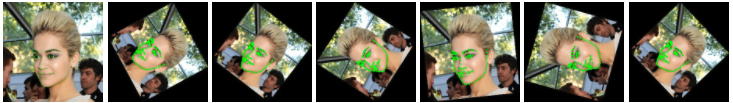

- `LandmarksRandomBlur`: random Gaussian blur. 입력 image에 대해 주어진 kernel range에서 kernel을 무작위 선택해 Gaussian blur를 적용한다. image-only transform이므로 landmarks 좌표는 바꾸지 않는다. 이 transform은 blur scene을 모사하는 데 사용할 수 있고, 모델 generalization을 높일 수 있다. keypoint detector를 모두 선명한 이미지로만 학습하면 실제 blur scene에서 문제가 생길 수 있다. blur는 흔한 scene이다. 초기화 parameter: `kernel_range: Tuple[int, int]`, Gaussian kernel 선택 범위, 값이 클수록 더 흐려진다. 기본값 `(3, 11)`; `prob: float`, 기본값 `0.5`, 발생 확률; `sigma_range: Tuple[int, int]`, variance 선택 범위, 기본값 `(0, 4)`, 기본값을 쓰면 된다.

```python
class LandmarksRandomBlur(LandmarksTransform):
    def __init__(
            self,
            kernel_range: Tuple[int, int] = (3, 11),
            prob: float = 0.5,
            sigma_range: Tuple[int, int] = (0, 4)
    ):
# usage
transform = torchlm.LandmarksCompose([
        torchlm.LandmarksResize((256, 256)),
        torchlm.LandmarksRandomBlur(kernel_range=(5, 35), prob=1.)
    ])
```

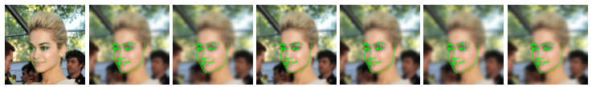

- `LandmarksRandomBrightness`: random brightness and contrast transform. 입력 image에 대해 주어진 brightness/contrast 변화 range에서 값을 무작위 선택해 brightness와 contrast를 바꾼다. image-only transform이므로 landmarks 좌표는 바꾸지 않는다. 초기화 parameter: `brightness: Tuple[float, float]`, brightness 변화 범위, 기본값 `(-30., 30.)`; `contrast: Tuple[float, float]`, contrast 변화 범위, 기본값 `(0.5, 1.5)`; `prob: float`, 기본값 `0.5`, 발생 확률.

```python
class LandmarksRandomBrightness(LandmarksTransform):
    def __init__(
            self,
            brightness: Tuple[float, float] = (-30., 30.),
            contrast: Tuple[float, float] = (0.5, 1.5),
            prob: float = 0.5
    ):
# usage
transform = torchlm.LandmarksCompose([
        torchlm.LandmarksRandomBrightness(prob=1.),
        torchlm.LandmarksResize((256, 256))
    ])
```

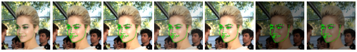

- `LandmarksRandomMask`: random occlusion transform. 주어진 mask area ratio range에서 area ratio를 무작위 선택하고, 원본 image에서 해당 면적 크기의 임의 직사각형 영역을 선택해 mask한다. mask value도 random이다. image-only transform이므로 landmarks 좌표는 바꾸지 않는다. 초기화 parameter: `mask_ratio: float`, occlusion max ratio, 기본값 `0.1`, occluded area가 입력 image area에서 차지하는 ratio; `prob: float`, 기본값 `0.5`, 발생 확률; `trans_ratio: float`, 기본값 `0.5`, mask 영역의 random shape를 제어하며 기본값을 쓰면 된다.

```python
class LandmarksRandomMask(LandmarksTransform):
    def __init__(
            self,
            mask_ratio: float = 0.1,
            prob: float = 0.5,
            trans_ratio: float = 0.5
    ):
# usage
transform = torchlm.LandmarksCompose([
        torchlm.LandmarksRandomMask(prob=1.),
        torchlm.LandmarksResize((256, 256))
    ])
```

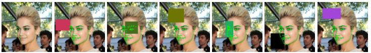

- `LandmarksRandomMaskMixUp`: alpha blending이 있는 random occlusion transform. torchlm 특유의 method다. 주어진 mask area ratio range에서 area ratio를 무작위 선택하고, 원본 image에서 해당 면적 크기의 임의 직사각형 영역을 선택한 뒤, random alpha ratio로 alpha blending을 수행해 shadow와 비슷한 효과를 만든다. mask value도 random이다. image-only transform이므로 landmarks 좌표는 바꾸지 않는다. 초기화 parameter: `mask_ratio: float`, occlusion max ratio, 기본값 `0.1`, occluded area가 입력 image area에서 차지하는 ratio; `prob: float`, 기본값 `0.5`, 발생 확률; `trans_ratio: float`, 기본값 `0.5`, mask 영역의 random shape를 제어하며 기본값을 쓰면 된다. `alpha: float`, mask의 selectable max alpha value, 기본값 `0.9`.

```python
class LandmarksRandomMaskMixUp(LandmarksTransform):
    def __init__(
            self,
            mask_ratio: float = 0.25,
            prob: float = 0.5,
            trans_ratio: float = 0.5,
            alpha: float = 0.9
    ):
# usage
transform = torchlm.LandmarksCompose([
        torchlm.LandmarksRandomMaskMixUp(prob=1.),
        torchlm.LandmarksResize((256, 256))
    ])
```

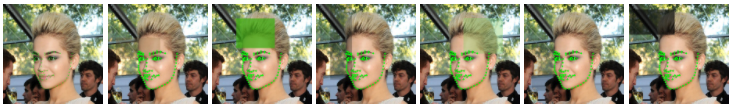

- `LandmarksRandomPatches`: random patch transform. torchlm 특유의 method다. 이 버전은 random mask와 유사하며, 사실상 가짜 MixUp이다. 여기서는 alpha blending을 사용하지 않는다. random하게 선택한 patch image block을 원본 image의 한 영역에 무작위로 채운다. 이 type은 patches image set을 지정해야 한다. 다만 직접 patches image set path를 지정하는 것 외에 기본값도 사용할 수 있다. **torchlm에는 random background image 100장이 내장되어 있다**. 따라서 별도의 image set을 준비하지 않아도 된다. 초기화 parameter: `patch_dirs: List[str]`, 사용할 patches image set 지정, 지정하지 않으면 torchlm 내장 이미지를 사용한다. `patch_ratio: float`, max patch area, 기본값 `0.15`; `prob: float`, 기본값 `0.5`, 발생 확률; `trans_ratio: float`, 기본값 `0.5`, patch 영역의 random shape를 제어하며 기본값을 쓰면 된다.

```python
class LandmarksRandomPatches(LandmarksTransform):
    def __init__(
            self,
            patch_dirs: List[str] = None,
            patch_ratio: float = 0.15,
            prob: float = 0.5,
            trans_ratio: float = 0.5
    ):
# usage
transform = torchlm.LandmarksCompose([
        torchlm.LandmarksRandomPatches(prob=1.),
        torchlm.LandmarksResize((256, 256))
    ])
```

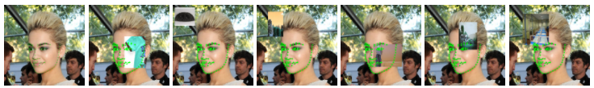

- `LandmarksRandomPatchesMixUp`: alpha blending이 있는 random patch transform. torchlm 특유의 method이며, keypoint detection에 맞게 고친 MixUp version이다. classification과 object detection에서 유명한 MixUp을 keypoint detection에 맞게 수정해 쓸 수 있다. 이 type은 random하게 선택한 patch image block을 random alpha ratio에 따라 원본 image의 한 영역에 무작위로 채운다. patches image set을 지정해야 하지만, 직접 path를 지정하지 않으면 **torchlm에 내장된 random background image 100장**을 사용할 수 있다. 초기화 parameter: `patch_dirs: List[str]`, 사용할 patches image set 지정, 지정하지 않으면 torchlm 내장 이미지를 사용한다. `patch_ratio: float`, max patch area, 기본값 `0.15`; `prob: float`, 기본값 `0.5`, 발생 확률; `trans_ratio: float`, 기본값 `0.5`, patch 영역의 random shape를 제어하며 기본값을 쓰면 된다. `alpha: float`, patch의 selectable max alpha value, 기본값 `0.9`.

```python
class LandmarksRandomPatchesMixUp(LandmarksTransform):
    def __init__(
            self,
            patch_dirs: List[str] = None,
            patch_ratio: float = 0.2,
            prob: float = 0.5,
            trans_ratio: float = 0.5,
            alpha: float = 0.9
    ):
# usage
transform = torchlm.LandmarksCompose([
        torchlm.LandmarksRandomPatchesMixUp(alpha=0.5, prob=1.),
        torchlm.LandmarksResize((256, 256))
    ])
```

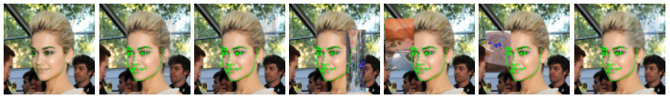

- `LandmarksRandomBackground`: random background replacement transform. torchlm 특유의 method다. 지정된 background image set에서 background image 하나를 무작위로 선택하고, 그 안에서 한 영역을 무작위 crop한 뒤, padding 방식으로 입력 image를 선택한 background 위에 채운다. 이 transform은 landmarks 좌표를 바꾼다. 초기화 parameter: `background_dirs: List[str]`, 사용할 backgrounds image set 지정, 지정하지 않으면 torchlm 내장 이미지를 사용한다. `prob: float`, 기본값 `0.5`, 발생 확률.

```python
class LandmarksRandomBackground(LandmarksTransform):
    def __init__(
            self,
            background_dirs: List[str] = None,
            prob: float = 0.5
    ):
# usage
transform = torchlm.LandmarksCompose([
        torchlm.LandmarksRandomBackground(prob=1.),
        torchlm.LandmarksResize((256, 256))
    ])
```

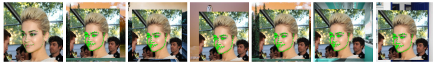

- `LandmarksRandomBackgroundMixUp`: alpha blending이 있는 random background replacement transform. torchlm 특유의 method다. 내가 구현한 keypoint detection용 MixUp의 특수한 경우다. 지정된 background image set에서 background image 하나를 무작위 선택하고, 그 안에서 한 영역을 무작위 crop한 뒤, random alpha ratio로 입력 image에 blend한다. image-only transform이므로 landmarks 좌표는 바꾸지 않는다. 이 방법은 training sample이 적을 때 모델이 소수 face에 overfit되는 것을 막는 데 사용할 수 있다. 초기화 parameter: `background_dirs: List[str]`, 사용할 backgrounds image set 지정, 지정하지 않으면 torchlm 내장 이미지를 사용한다. `prob: float`, 기본값 `0.5`, 발생 확률; `alpha: float`, background의 selectable max alpha value, 기본값 `0.3`. 이 값은 너무 크면 안 된다.

```python
class LandmarksRandomBackgroundMixUp(LandmarksTransform):
    def __init__(
            self,
            background_dirs: List[str] = None,
            alpha: float = 0.3,
            prob: float = 0.5
    ):
# usage
transform = torchlm.LandmarksCompose([
        torchlm.LandmarksRandomBackgroundMixUp(alpha=0.5, prob=1.),
        torchlm.LandmarksResize((256, 256))
    ])
```

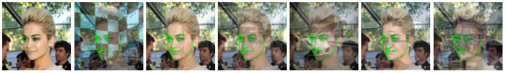

- `BindAlbumentationsTransform`: albumentations data augmentation method를 binding하는 wrapper class. 직접 사용하는 것은 권장하지 않는다. 초기화 parameter: `transform`, albumentations transform 지정; `prob`, 발생 확률, `torchlm.bind`의 `prob` parameter와 의미가 같다.

```python
class BindAlbumentationsTransform(LandmarksTransform):
    def __init__(
            self,
            transform: Albumentations_Transform_Type,
            prob: float = 1.0
    ):
```

- `BindTorchVisionTransform`: torchvision data augmentation method를 binding하는 wrapper class. 직접 사용하는 것은 권장하지 않는다. 초기화 parameter: `transform`, torchvision transform 지정; `prob`, 발생 확률, `torchlm.bind`의 `prob` parameter와 의미가 같다.

```python
class BindTorchVisionTransform(LandmarksTransform):
    def __init__(
            self,
            transform: TorchVision_Transform_Type,
            prob: float = 1.0
    ):
```

- `BindArrayCallable`: 사용자 정의 numpy 입력/출력 data augmentation method를 binding하는 wrapper class. 직접 사용하는 것은 권장하지 않는다. 초기화 parameter: `call_func`, numpy 입력/출력의 사용자 정의 data augmentation function 지정; `prob`, 발생 확률, `torchlm.bind`의 `prob` parameter와 의미가 같다.

```python
class BindArrayCallable(LandmarksTransform):
    def __init__(
            self,
            call_func: Callable_Array_Func_Type,
            prob: float = 1.0
    ):
```

- `BindTensorCallable`: 사용자 정의 Tensor 입력/출력 data augmentation method를 binding하는 wrapper class. 직접 사용하는 것은 권장하지 않는다. 초기화 parameter: `call_func`, Tensor 입력/출력의 사용자 정의 data augmentation function 지정; `prob`, 발생 확률, `torchlm.bind`의 `prob` parameter와 의미가 같다.

```python
class BindTensorCallable(LandmarksTransform):
    def __init__(
            self,
            call_func: Callable_Tensor_Func_Type,
            prob: float = 1.0
    ):
```

- `LandmarksCompose`: keypoint data augmentation pipeline. 초기화 parameter: `transforms`, data augmentation type list 지정.

```python
class LandmarksCompose(object):

    def __init__(
            self,
            transforms: List[LandmarksTransform]
    ):
```

## 6. torchlm의 data augmentation method 사용

예시 pipeline은 다음과 같다. 사용법은 단순하다.

```python
import torchlm
transform = torchlm.LandmarksCompose([
        # use native torchlm transforms
        torchlm.LandmarksRandomScale(prob=0.5),
        torchlm.LandmarksRandomTranslate(prob=0.5),
        torchlm.LandmarksRandomShear(prob=0.5),
        torchlm.LandmarksRandomMask(prob=0.5),
        torchlm.LandmarksRandomBlur(kernel_range=(5, 25), prob=0.5),
        torchlm.LandmarksRandomBrightness(prob=0.),
        torchlm.LandmarksRandomRotate(40, prob=0.5, bins=8),
        torchlm.LandmarksRandomCenterCrop((0.5, 1.0), (0.5, 1.0), prob=0.5),
        # ...
    ])
```

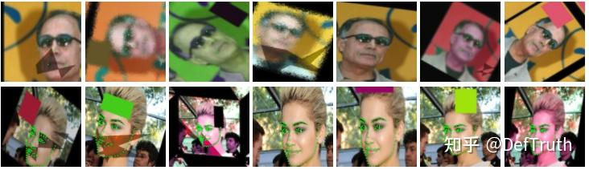

## 7. torchvision과 albumentations의 data augmentation method binding

**torchlm.bind**를 통해 torchvision과 albumentations의 **80+** 가지 data augmentation method를 한 줄 코드로 호환할 수 있다. data type 변환과 data "safety" check도 자동 처리한다.

```python
import torchvision
import albumentations
import torchlm
transform = torchlm.LandmarksCompose([
        # use native torchlm transforms
        torchlm.LandmarksRandomScale(prob=0.5),
        # bind torchvision image only transforms, bind with a given prob
        torchlm.bind(torchvision.transforms.GaussianBlur(kernel_size=(5, 25)), prob=0.5),
        torchlm.bind(torchvision.transforms.RandomAutocontrast(p=0.5)),
        # bind albumentations image only transforms
        torchlm.bind(albumentations.ColorJitter(p=0.5)),
        torchlm.bind(albumentations.GlassBlur(p=0.5)),
        # bind albumentations dual transforms
        torchlm.bind(albumentations.RandomCrop(height=200, width=200, p=0.5)),
        torchlm.bind(albumentations.Rotate(p=0.5)),
        # ...
    ])
```

## 8. 사용자 정의 data augmentation method binding

**torchlm.bind**를 통해 사용자 정의 data augmentation method도 한 줄 코드로 binding할 수 있다. data type 변환과 data "safety" check도 자동 처리한다.

```python
# First, defined your custom functions
def callable_array_noop(img: np.ndarray, landmarks: np.ndarray) -> Tuple[np.ndarray, np.ndarray]:
    # do some transform here ...
    return img.astype(np.uint32), landmarks.astype(np.float32)

def callable_tensor_noop(img: Tensor, landmarks: Tensor) -> Tuple[Tensor, Tensor]:
    # do some transform here ...
    return img, landmarks

# Then, bind your functions and put it into the transforms pipeline.
transform = torchlm.LandmarksCompose([
        # use native torchlm transforms
        torchlm.LandmarksRandomScale(prob=0.5),
        # bind custom callable array functions
        torchlm.bind(callable_array_noop, bind_type=torchlm.BindEnum.Callable_Array),
        # bind custom callable Tensor functions with a given prob
        torchlm.bind(callable_tensor_noop, bind_type=torchlm.BindEnum.Callable_Tensor, prob=0.5),
        # ...
    ])
```

## 9. torchlm global debug setting

torchlm은 global debug setting을 제공한다. 일부 global option을 설정하면 data augmentation을 디버깅하기 쉽고, 어디에서 문제가 났는지 찾기 편하다.

```python
import torchlm
# some global setting
torchlm.set_transforms_debug(True)
torchlm.set_transforms_logging(True)
torchlm.set_autodtype_logging(True)
```

이 global option을 `True`로 설정하면, data augmentation pipeline이 실행될 때마다 판단과 검사에 도움이 되는 정보를 출력한다.

```text
LandmarksRandomScale() AutoDtype Info: AutoDtypeEnum.Array_InOut
LandmarksRandomScale() Execution Flag: False
BindTorchVisionTransform(GaussianBlur())() AutoDtype Info: AutoDtypeEnum.Tensor_InOut
BindTorchVisionTransform(GaussianBlur())() Execution Flag: True
BindAlbumentationsTransform(ColorJitter())() AutoDtype Info: AutoDtypeEnum.Array_InOut
BindAlbumentationsTransform(ColorJitter())() Execution Flag: True
BindTensorCallable(callable_tensor_noop())() AutoDtype Info: AutoDtypeEnum.Tensor_InOut
BindTensorCallable(callable_tensor_noop())() Execution Flag: False
Error at LandmarksRandomTranslate() Skip, Flag: False Error Info: LandmarksRandomTranslate() have 98 input landmarks, but got 96 output landmarks!
LandmarksRandomTranslate() Execution Flag: False
```

- **Execution Flag**: `True`는 transform이 성공적으로 실행되었음을 뜻한다. `False`는 성공적으로 실행되지 않았음을 뜻한다. random probability 때문에 skip되었을 수도 있고, runtime exception이 발생했을 수도 있다. debug mode가 `True`이면 torchlm은 pipeline을 중단하고 자세한 exception 정보를 던진다.
- **AutoDtype Info**:
- `Array_InOut`은 현재 transform이 `np.ndarray`를 입력으로 요구하고 `np.ndarray`를 출력한다는 뜻이다.
- `Tensor_InOut`은 현재 transform이 Tensor를 입력으로 요구하고 Tensor를 출력한다는 뜻이다.
- `Array_In`은 현재 transform이 `np.ndarray`를 입력으로 요구하고 Tensor를 출력한다는 뜻이다.
- `Tensor_In`은 현재 transform이 Tensor를 입력으로 요구하고 `np.ndarray`를 출력한다는 뜻이다.

numpy array 입력이 필요한 transform에 실수로 Tensor를 넘겨도 문제 없다. **torchlm**은 **autodtype** decorator를 통해 서로 다른 data type을 자동 호환하고, transform이 끝난 뒤 output data를 원래 type으로 자동 변환한다.

## 10. torchlm keypoint data augmentation 전체 사례

```python
import cv2
import numpy as np
import torchvision
import albumentations
from torch import Tensor
from typing import Tuple

import torchlm

def callable_array_noop(
        img: np.ndarray,
        landmarks: np.ndarray
) -> Tuple[np.ndarray, np.ndarray]:
    # Do some transform here ...
    return img.astype(np.uint32), landmarks.astype(np.float32)


def callable_tensor_noop(
        img: Tensor,
        landmarks: Tensor
) -> Tuple[Tensor, Tensor]:
    # Do some transform here ...
    return img, landmarks


def test_torchlm_transforms_pipeline():
    print(f"torchlm version: {torchlm.__version__}")
    seed = np.random.randint(0, 1000)
    np.random.seed(seed)

    img_path = "./2.jpg"
    anno_path = "./2.txt"
    save_path = f"./logs/2_wflw_{seed}.jpg"
    img = cv2.imread(img_path)[:, :, ::-1].copy()  # RGB
    with open(anno_path, 'r') as fr:
        lm_info = fr.readlines()[0].strip('\n').split(' ')

    landmarks = [float(x) for x in lm_info[:196]]
    landmarks = np.array(landmarks).reshape(98, 2)  # (5,2) or (98, 2) for WFLW

    # some global setting will show you useful details
    torchlm.set_transforms_debug(True)
    torchlm.set_transforms_logging(True)
    torchlm.set_autodtype_logging(True)

    transform = torchlm.LandmarksCompose([
        # use native torchlm transforms
        torchlm.LandmarksRandomScale(prob=0.5),
        torchlm.LandmarksRandomTranslate(prob=0.5),
        torchlm.LandmarksRandomShear(prob=0.5),
        torchlm.LandmarksRandomMask(prob=0.5),
        torchlm.LandmarksRandomBlur(kernel_range=(5, 25), prob=0.5),
        torchlm.LandmarksRandomBrightness(prob=0.),
        torchlm.LandmarksRandomRotate(40, prob=0.5, bins=8),
        torchlm.LandmarksRandomCenterCrop((0.5, 1.0), (0.5, 1.0), prob=0.5),
        # bind torchvision image only transforms with a given bind prob
        torchlm.bind(torchvision.transforms.GaussianBlur(kernel_size=(5, 25)), prob=0.5),
        torchlm.bind(torchvision.transforms.RandomAutocontrast(p=0.5)),
        torchlm.bind(torchvision.transforms.RandomAdjustSharpness(sharpness_factor=3, p=0.5)),
        # bind albumentations image only transforms
        torchlm.bind(albumentations.ColorJitter(p=0.5)),
        torchlm.bind(albumentations.GlassBlur(p=0.5)),
        torchlm.bind(albumentations.RandomShadow(p=0.5)),
        # bind albumentations dual transforms
        torchlm.bind(albumentations.RandomCrop(height=200, width=200, p=0.5)),
        torchlm.bind(albumentations.RandomScale(p=0.5)),
        torchlm.bind(albumentations.Rotate(p=0.5)),
        # bind custom callable array functions with a given bind prob
        torchlm.bind(callable_array_noop, bind_type=torchlm.BindEnum.Callable_Array, prob=0.5),
        # bind custom callable Tensor functions
        torchlm.bind(callable_tensor_noop, bind_type=torchlm.BindEnum.Callable_Tensor, prob=0.5),
        torchlm.LandmarksResize((256, 256)),
        torchlm.LandmarksNormalize(),
        torchlm.LandmarksToTensor(),
        torchlm.LandmarksToNumpy(),
        torchlm.LandmarksUnNormalize()
    ])

    trans_img, trans_landmarks = transform(img, landmarks)
    new_img = torchlm.draw_landmarks(trans_img, trans_landmarks, circle=2)
    cv2.imwrite(save_path, new_img[:, :, ::-1])

    # unset the global status when you are in training process
    torchlm.set_transforms_debug(False)
    torchlm.set_transforms_logging(False)
    torchlm.set_autodtype_logging(False)
```

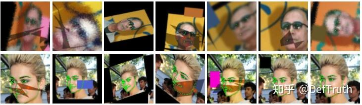

이제 전체 data augmentation pipeline이 훨씬 깔끔해졌다. **torchlm** native transforms든 torchvision과 albumentations에서 온 transforms든 자연스럽게 하나의 흐름에 넣을 수 있다. 입력이 numpy array인지 Tensor인지도 신경 쓸 필요가 없다. 사용자 정의 keypoint data augmentation method를 전체 pipeline에 넣고 싶을 때도 method만 정의하면 된다. **torchlm.bind**가 주변 처리를 대신 맡는다.

## 11. 정리

- (1) 이 글은 자주 쓰는 data augmentation 오픈소스 도구를 소개하고, keypoint detection 작업의 특성에 맞춰 **100+** 종류의 keypoint data augmentation method와 동시에 호환되는 작은 도구 **torchlm**을 다시 통합했다. 특징은 다음과 같다.
- 한 가지 일, 즉 keypoint detection에만 집중한다.
- 선택 가능한 방법은 충분히 많지만 사용법은 충분히 단순하다.
- 다른 mainstream library의 방법을 `one-line code`로 호환한다.
- 가능하면 추가 추상화를 들이지 않고, 사용자 정의 방법 binding을 지원한다.
- data augmentation에 `safety`가 있어야 하며, 안전하지 않은 augmentation transform은 자동 rollback할 수 있다.
- `zero-code로 numpy와 Tensor data type을 자동 호환`하므로 사용자가 어떤 변환도 직접 할 필요가 없다.
- (2) torchlm을 배포한 지 시간이 좀 지났다. pip 설치량은 이유를 잘 모르겠지만 1천에 가까워졌다. 그다지 fancy한 물건은 아닌데 통계가 이상할 수도 있다. 어쨌든 이 도구가 도움이 되기를 바란다. 이후 더 많은 method를 추가하거나 imgaug와도 호환할 수 있다.
- (3) torchlm은 data augmentation만 다루지 않는다. 이후 시간이 나면 일부 알고리즘을 재현하거나 작은 도구들을 torchlm에 통합할 생각이다. 오픈소스에서 얻고 오픈소스에 돌려준다. 유용하다고 느끼면 star로 지원해도 된다. 유용한 keypoint detection data augmentation method PR도 환영한다. 함수 하나 작성하는 정도의 일이다.
- (4) 반드시 강조한다. **torchlm**은 어떤 혁신을 만든 것이 아니다. 개인적인 흥미의 모음이며, 여가에 작성한 코드를 저장하는 공간이다. 어떤 말을 본 적이 있다. 출력을 결정했다는 것은 보통 더 많은 입력을 얻어야 함을 의미한다. 따라서 글 한 편, 코드 한 줄을 신경 써서 쓰는 것은 출력이면서 동시에 더 많은 입력이다. 누군가 보고 유용하다고 느낀다면 그것이 가장 좋다.
- (5) data augmentation 사용에 관한 여담: **많다고 반드시 좋은 것은 아니고, 적당함이 가장 중요하다**. 실제 작업에서 발견한 현상이 있다. data augmentation은 많을수록 좋은 것이 아니다. 과도한 data augmentation은 성능을 올리지 못하고 오히려 떨어뜨릴 수 있다. data augmentation 사용으로 전체 data distribution이 바뀔 수 있기 때문이다. 수십 가지 augmentation을 쌓으면 최종적으로 모델에 들어가는 data는 거의 모두 augmented data가 되고, real data 비중은 매우 작아진다. 그러면 실제 scene에서 모델 정확도가 오히려 낮아지는 등 잠재 문제가 생길 수 있다. 따라서 data augmentation은 많을수록 좋은 것이 아니라 적당히 사용해야 한다.

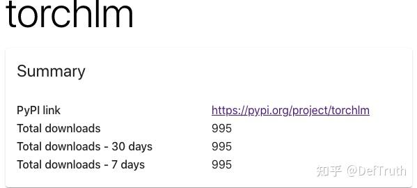

더 많은 문서는 torchlm homepage를 보면 된다.

GitHub(star와 PR 환영): https://github.com/DefTruth/torchlm

pypi download stats: https://pepy.tech/project/torchlm

"keypoint만 말하기" 시리즈에서는 이후 keypoint detection 관련 논문을 차례로 설명할 예정이다.
