# [InternLM/VL 시리즈] InternLM, InternVL1.5, InternVL2.0 핵심 노트

> 원문: https://zhuanlan.zhihu.com/p/702481058

**목차**
- 0x00 서문
- 0x01 InternLM2 간단 분석
- 0x02 InternLM2.5 간단 분석
- 0x03 InternViT 간단 분석
- 0x04 InternVL1.5 간단 분석
- 0x05 InternVL2.0 간단 분석
- 0x06 정리

### 0x00 서문

이 글은 멀티모달 대형 모델 InternLM/InternVL 시리즈의 핵심 포인트를 정리한 개인 노트다. 초점은 InternVL 1.5다. InternVL 1.5는 LLM backbone으로 InternLM2를, vision encoder로 InternViT-6B를 사용하므로 InternLM2와 InternViT부터 간단히 본다.

LeetCUDA에는 LLM/VLM 글 정리와 FlashAttention, SGEMM, HGEMM, GEMV 등 CUDA Kernel 예제 구현이 포함되어 있다.


*CUDA Learn Notes with PyTorch*

이 글의 주요 내용은 다음과 같다.

- InternLM2 모델 구조: LLaMA + GQA
- Wq, Wk, Wv interleaving
- TensorRT-LLM, LMDeploy, vLLM의 InternLM2 weight de-interleaving
- InternLM2.5 업데이트와 benchmark
- InternViT 구조
- InternVL1.5의 Pixel Shuffle과 Dynamic High Resolution
- InternVL2.0 업데이트

### 0x01 InternLM2 간단 분석

#### InternLM2 모델 구조: LLaMA + GQA

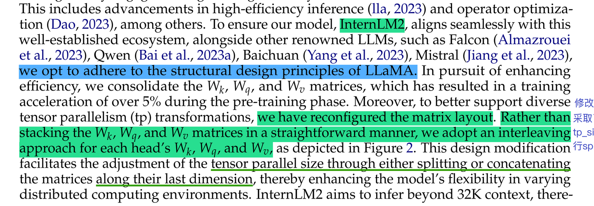
*InternLM2 모델 구조*

InternLM2는 LLaMA 계열 구조를 사용하고, LLaMA처럼 GQA를 사용한다. 흥미로운 차이는 Tensor Parallel 효율을 높이기 위해 Wqkv weight를 interleaving reorder한다는 점이다.

#### Interleaving Wq, Wk, Wv

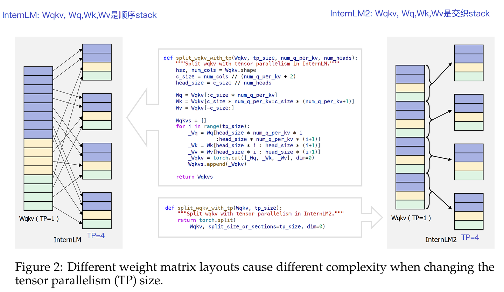
*InternLM2 weight interleaving*

InternLM2가 InternLM 대비 크게 바꾼 점 중 하나는 Wqkv stacked weight matrix의 interleaving reorder다. 논문 설명에 따르면 이 조작은 Tensor Parallel에서 weight matrix 분배 복잡도를 낮춘다.

InternLM은 LLaMA와 마찬가지로 Wq, Wk, Wv를 순서대로 stack한다. 이 방식은 Tensor Parallel에서 여러 slice, cat 등을 거쳐야 각 GPU에 weight를 올바르게 나눌 수 있다. 그 결과 forward/backward graph가 조각나고 효율이 떨어질 수 있다.

InternLM2의 Wqkv matrix는 세 matrix를 단순 stack하지 않고 interleaving reorder한다. Tensor Parallel에서는 split 한 번으로 matrix partition을 끝낼 수 있어 불필요한 조작을 줄인다. 논문 기준으로 이 작업은 훈련 효율을 약 5% 높인다.

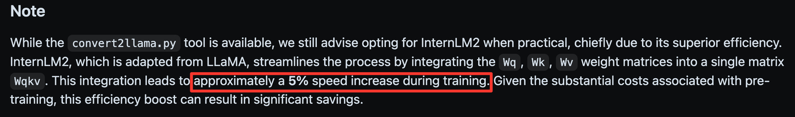
*weight interleaving의 영향*

다만 이 interleaving은 추론 배포에는 불편하다. InternLM2는 구조상 LLaMA 계열이지만 Wqkv가 interleaved format이면 일반 LLaMA 배포 방식에 바로 넣기 어렵다. 현재 커뮤니티 지원 방식은 대략 두 가지다.

- LMDeploy가 InternLM2를 native로 지원한다.
- Wq, Wk, Wv를 de-interleaving해 표준 LLaMA weight format으로 되돌린 뒤 일반 framework로 배포한다.

de-interleaving의 핵심은 GQA 구조에 맞춰 `[num_key_value_groups, 1, 1]` 비율로 split한 뒤 Wq, Wk, Wv를 원래 2D matrix shape으로 reshape하는 것이다. 여기서 `num_key_value_groups`는 같은 KV head를 공유하는 query head 수를 뜻한다.

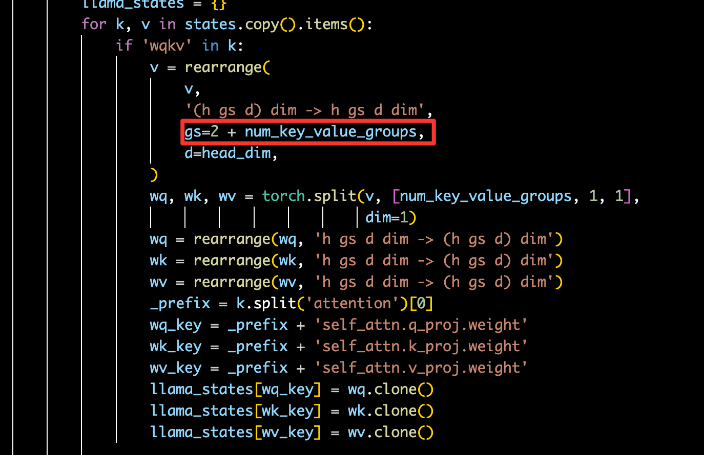
*weight de-interleaving logic*

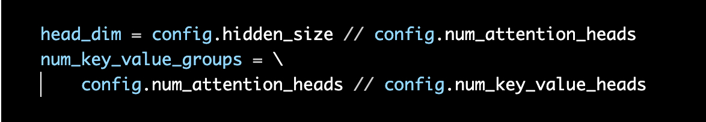
*num_key_value_groups 계산*

#### TensorRT-LLM의 InternLM2 de-interleaving

TensorRT-LLM은 InternLM2 native model에서 checkpoint 변환, engine build, inference를 직접 지원한다. `convert_checkpoint.py` 내부에서 weight de-interleaving을 수행하고, TensorRT-LLM API로 weight assignment와 network construction을 진행한다. 구현은 `tensorrt_llm.models.llama`의 convert component도 활용한다.

다만 원문 작성 시점에는 FP8/SQ quantization을 지원하지 않고 Weight Only만 지원했다. FP8 quantization 배포가 필요하면 Wq/Wk/Wv를 LLaMA format으로 de-interleaving한 뒤 배포하는 경로가 더 적합하다.

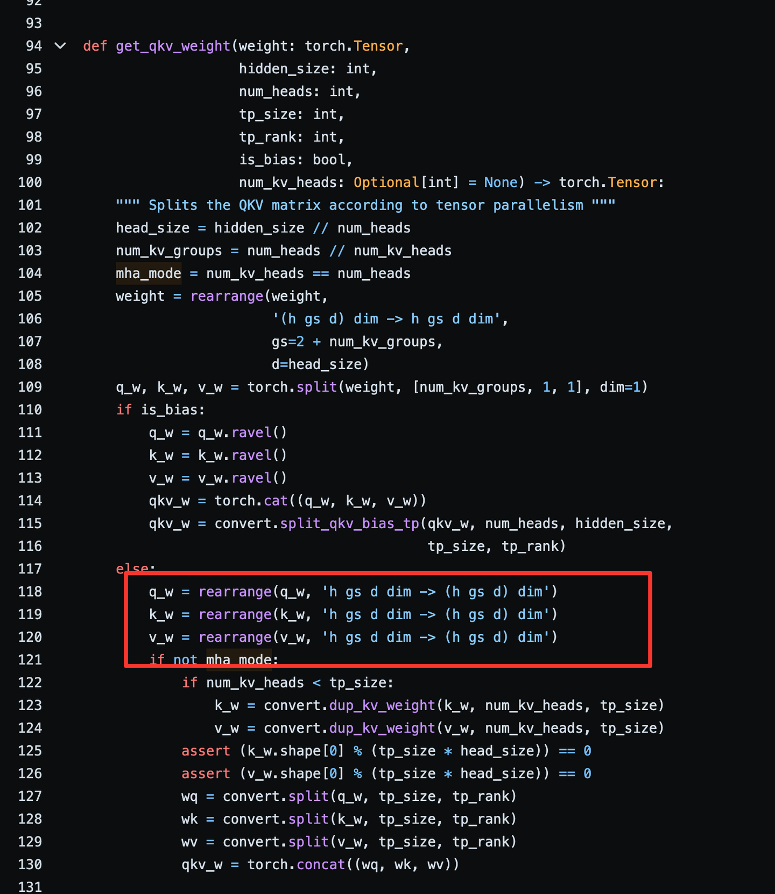
*TensorRT-LLM InternLM2 weight de-interleaving*

#### LMDeploy의 InternLM2 de-interleaving

LMDeploy도 먼저 interleaved weight를 de-interleaving하고, name별로 weight를 매칭한 뒤 LLaMA 구조로 변환한다. `InternLM2Reader`는 `LlamaReader`를 상속한다.

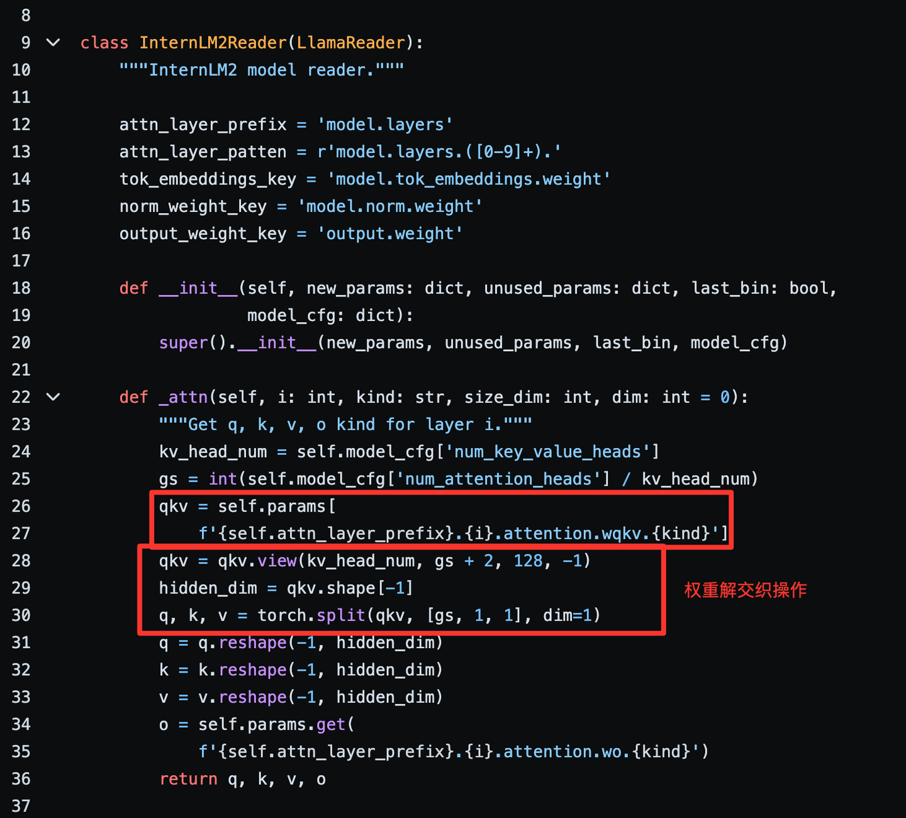
*LMDeploy weight de-interleaving*

#### vLLM의 InternLM2 de-interleaving

vLLM도 InternLM2 배포를 지원한다. weight de-interleaving 처리는 TensorRT-LLM, LMDeploy와 같은 흐름이다. 결국 weight interleaving은 훈련에는 유리하지만, 추론 framework 입장에서는 먼저 de-interleaving해야 하는 부담이 된다.

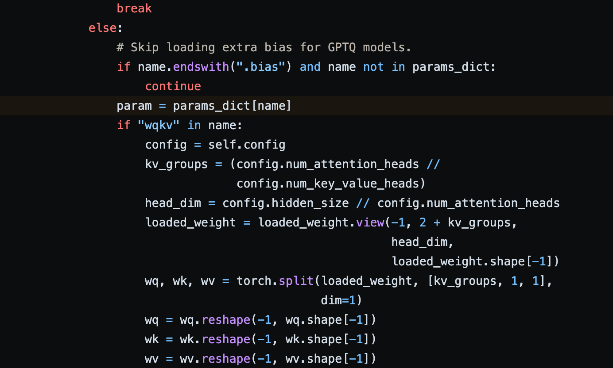
*vLLM weight de-interleaving*

### 0x02 InternLM2.5 간단 분석

#### InternLM2.5 업데이트

2024년 7월 3일 InternLM 팀은 InternLM2.5를 발표했다. 모델 구조는 InternLM2와 같고 성능이 개선됐다. 주요 업데이트는 7B Chat 계열이다. `InternLM2.5-7B-Chat-1M`은 백만 길이 context window를 지원한다.

핵심은 세 가지다.

- 모델 추론 능력 개선. 수학 추론 task에서 같은 규모의 LLaMA3-8B, Gemma-9B를 넘어서는 성능을 보인다.
- 백만 길이 context inference 지원. LMDeploy로 바로 배포할 수 있다.
- 더 많은 application tool 지원. 대량 웹 정보 aggregation 같은 작업을 지원하고 Agent 도구로 통합할 계획이다.

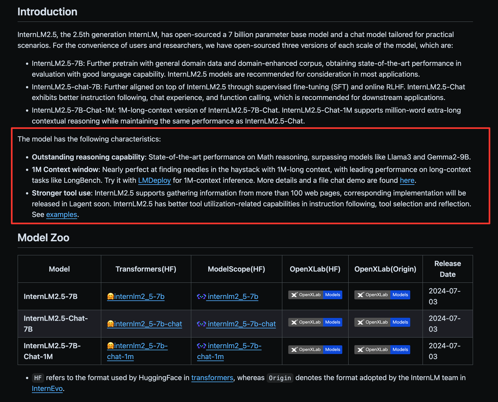
*InternLM2.5*

#### InternLM2.5 Benchmark

InternLM2.5 7B Chat은 여러 task에서 같은 parameter scale의 SOTA 수준을 보인다. 특히 Math task에서 LLaMA3-8B-Instruct와 Gemma2-9B-IT보다 큰 폭으로 높다.

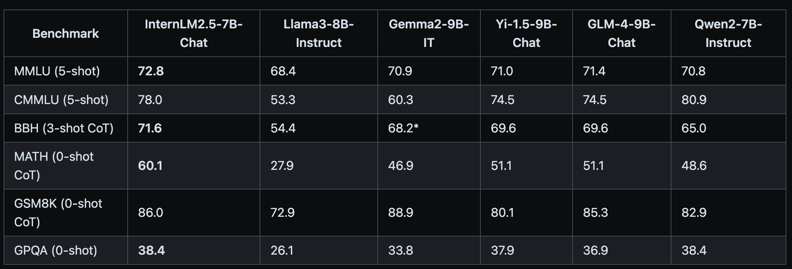
*InternLM2.5 Benchmark*

### 0x03 InternViT 간단 분석

#### InternViT 모델 구조

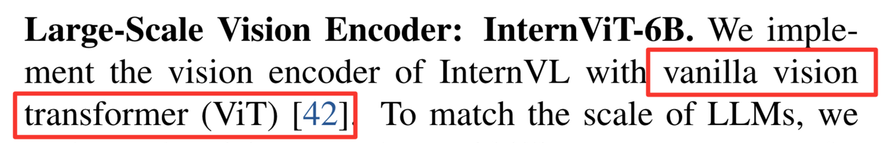
*InternViT-6B*

InternViT-6B는 classic ViT 구조를 사용하며 InternVL의 vision module로 쓰인다. 단독 모델로 쓰기보다는 VLM의 시각 feature extractor 역할을 한다.

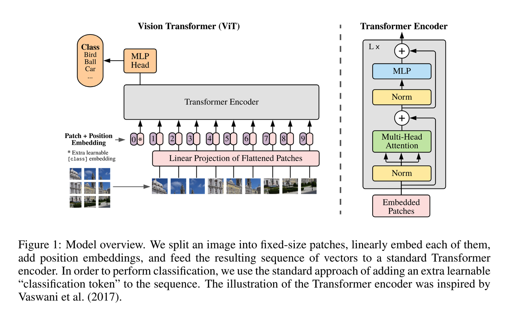
*ViT 구조*

구현상 InternViT는 크게 `VisionEmbeddings`와 `VisionEncoder`로 구성된다. `VisionEmbeddings`는 이미지를 patch embedding으로 바꾸고, learnable position embedding을 더해 ViT 입력을 만든다. 이후 `VisionEncoder`가 여러 표준 Transformer layer(`InternVisionEncoderLayer`)로 feature를 추출한다.

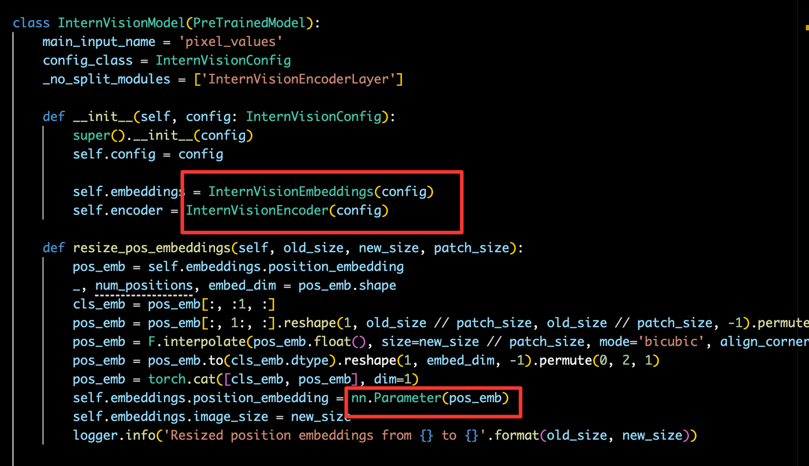
*InternViT source*


*position embedding*

### 0x04 InternVL1.5 간단 분석

#### InternVL1.5 전체 구조

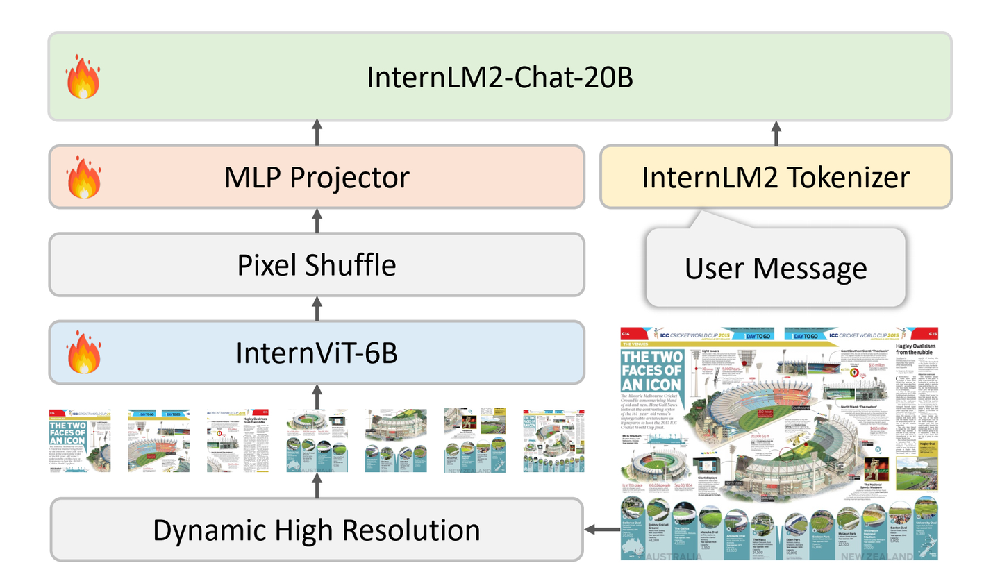
*InternVL1.5 전체 구조*

InternVL 1.5는 세 부분으로 구성된다.

- ViT: InternViT-6B. 강한 visual feature extractor로 사용된다.
- MLP Projector: vision feature를 language model feature space로 맞춘다.
- LLM backbone: InternLM2-Chat-20B.

InternLM2-Chat-20B의 embedding dimension은 6144이므로 MLP Projector는 vision feature를 6144 차원으로 변환한다. 전체 parameter 수는 약 26B다.

구조에서 중요한 기술은 Pixel Shuffle과 Dynamic High Resolution이다. Pixel Shuffle은 ViT가 추출한 pixel feature를 재배열해 visual token 수를 줄인다. Dynamic High Resolution은 ViT가 더 세밀한 이미지 정보를 볼 수 있게 입력 이미지를 동적으로 crop한다.

#### Pixel Shuffle: visual token 수 줄이기

Pixel Shuffle은 super-resolution에서 흔히 쓰는 조작이다. PyTorch에는 `nn.PixelShuffle(upscale_factor)`가 있다. 기본적으로 `[B, C*r*r, H, W]`를 `[B, C, H*r, W*r]`로 바꾼다. 즉 공간 해상도를 키우고 channel 수를 줄인다.

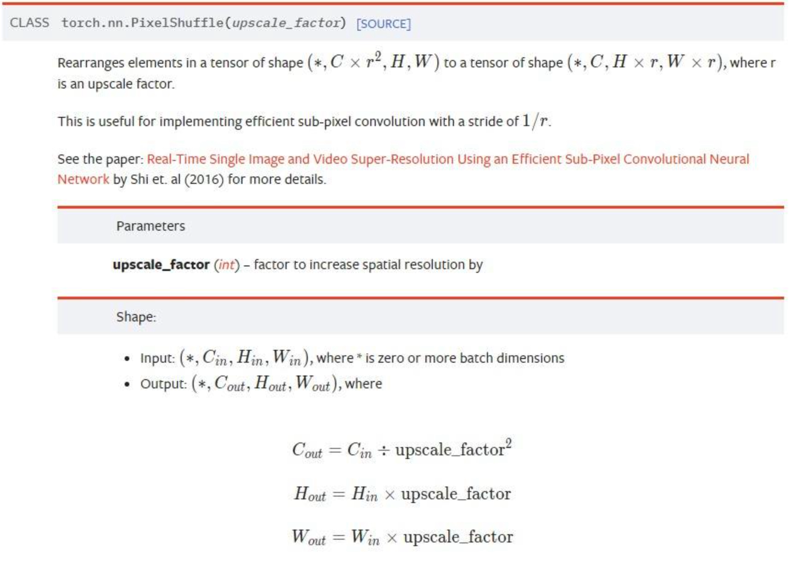
*nn.PixelShuffle*

InternVL 1.5의 pixel shuffle은 같은 원리지만 방향이 반대다. `scale_factor=0.5`를 사용해 공간 해상도를 낮추고 channel 수를 늘린다. 즉 더 많은 pixel 정보를 channel dimension에 담는다. 입력 `[N, H, W, C]`는 대략 `[N, H*scale, W*scale, C/(scale^2)]`로 바뀐다.

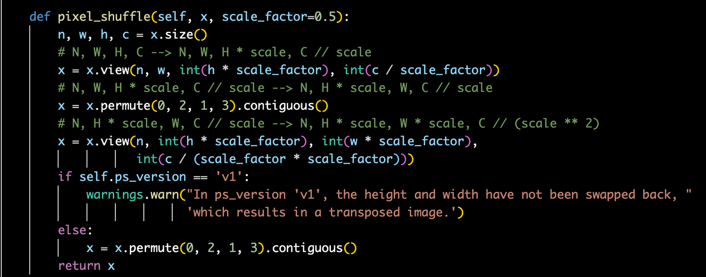
*pixel shuffle*

InternVL-Chat-V1.5의 실제 호출 흐름을 보면, `pixel_values`는 예를 들어 `[5, 3, 448, 448]`다. `select_layer=-1`로 마지막 hidden state를 feature map으로 뽑고, 그 feature map에 pixel shuffle을 적용한다.

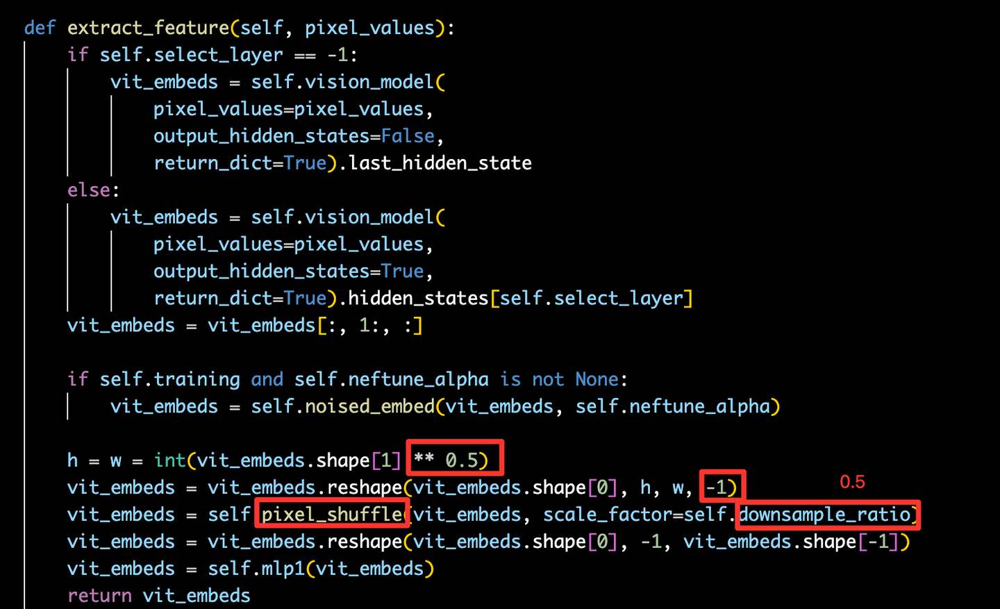
*extract_feature의 pixel shuffle*

shape 변화는 다음과 같다.

```text
pixel_values: [5, 3, 448, 448]
vit_embeds: [5, 1025, 3200]
vit_embeds[:, 1:, :]: [5, 1024, 3200]
after reshape: [5, 32, 32, 3200]
after pixel_shuffle: [5, 16, 16, 12800]
before mlp1: [5, 256, 12800]
after mlp1: [5, 256, 6144]
input_embeds: [1, 2596, 6144]
```

즉 448x448 이미지 하나에 대해 ViT는 `32x32=1024` visual token을 만들고, pixel shuffle 이후 `16x16=256` token이 된다. token 수가 1/4로 줄어든다. 이후 MLP가 channel을 InternLM2-20B hidden size인 6144로 맞춘다.

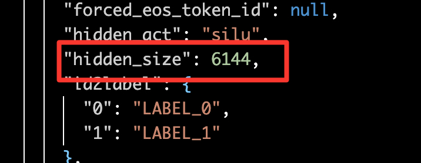
*InternLM2-20B hidden_size*

#### Dynamic High Resolution

Dynamic High Resolution은 입력 이미지를 448의 배수 크기로 resize하고, 미리 정의된 aspect ratio에 따라 crop block을 만드는 방식이다. 예를 들어 비율이 2:3이면 이미지를 `896 x 1344`로 resize하고 2x3 block으로 나눈다. 여기에 전역 정보를 유지하기 위해 원본 전체를 448x448 thumbnail로 resize해 crop block들과 함께 입력한다.

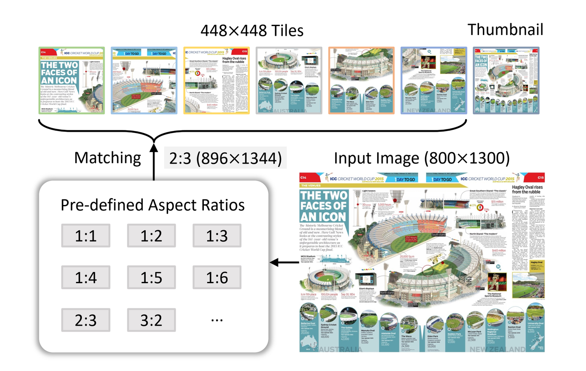
*Dynamic High Resolution*

전처리 코드는 `max_num`으로 가능한 ratio 후보를 만들고, 입력 이미지의 aspect ratio에 가장 가까운 target aspect ratio를 찾는다. 예를 들어 800x1300 이미지는 2:3에 가깝고, image size 448을 곱해 896x1344로 resize된다.

```python
target_ratios = set(
    (i, j)
    for n in range(min_num, max_num + 1)
        for i in range(1, n + 1)
            for j in range(1, n + 1)
                if i * j <= max_num and i * j >= min_num
)
```

`i * j <= max_num` 제한 때문에 crop block 수는 항상 `max_num` 이하가 된다. `max_num`이 작으면 더 작은 resize/crop 조합을 쓰므로 세부 정보를 덜 본다. `max_num`이 크면 더 큰 resize와 더 많은 crop을 사용해 세부 정보를 더 많이 본다.

InternVL 1.5의 훈련에서는 자원 제한 때문에 `max_num=12`를 사용했다. thumbnail까지 더하면 총 13 block이고, visual token 수는 `256 * 13 = 3328`이다. 추론에서는 `max_num=40`까지 가능하므로 `256 * 41 = 10496` visual token까지 늘어날 수 있다.

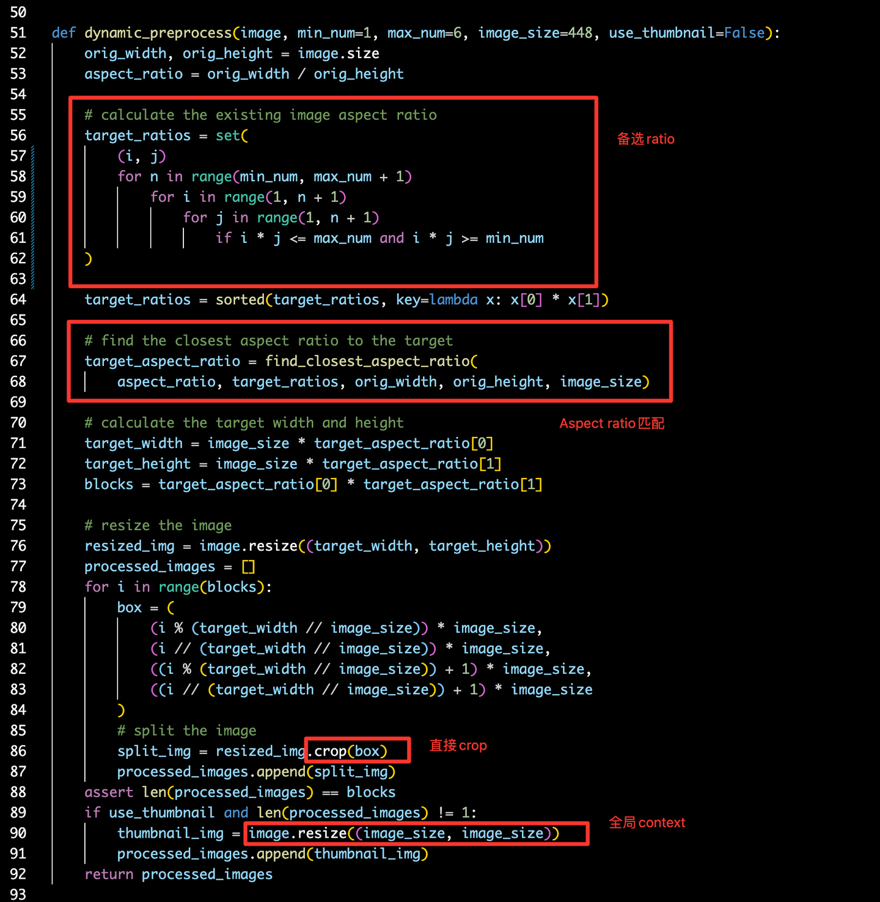
*dynamic preprocess source*

#### 모델 훈련, prompt 연결, 실험 결과

InternVL 1.5 훈련은 두 단계다.

- 1단계: MLP Projector와 InternViT-6B를 pretrain한다. LLM backbone은 freeze한다.
- 2단계: InternViT-6B, MLP Projector, InternLM2-20B 전체 26B parameter를 함께 학습한다. context length는 4096이고 prompt format은 LLaVA와 유사하다.

Prompt 연결은 단순하다. image token을 user prompt 앞에 붙이고 chat template에 넣는다.

```python
image_tokens = IMG_START_TOKEN + IMG_CONTEXT_TOKEN * self.num_image_token * image_bs + IMG_END_TOKEN
question = image_tokens + '\n' + question
template.append_message(template.roles[0], question)
template.append_message(template.roles[1], None)
query = template.get_prompt()
```

`img_token_id`는 fake special token으로 먼저 채워진다. Vision Model이 실제 feature를 뽑은 뒤 해당 위치를 real image feature로 교체한다.

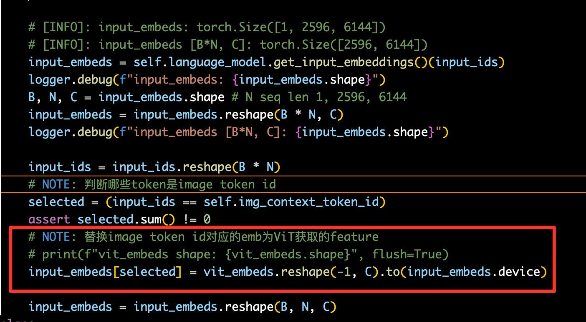
*real image feature 채우기*

실제 LLM 입력 prompt는 chat template이 적용된 뒤 다음처럼 된다.

```text
<|im_start|>system
You are an AI assistant whose name is InternLM (书生·浦语).<|im_end|><|im_start|>user
<IMG_CONTEXT><IMG_CONTEXT>...<IMG_CONTEXT></img>
describe this image<|im_end|><|im_start|>assistant
```

InternVL 1.5는 여러 task와 benchmark에서 SOTA 수준 결과를 낸다.

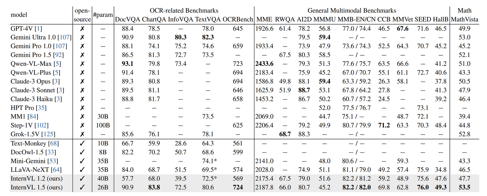
*InternVL 1.5 Benchmark*

#### LMDeploy 배포와 성능 병목

InternVL 시리즈 배포는 LMDeploy가 가장 매끄럽다. 이전에는 greedy sampling에서도 출력 random성이 커지는 문제가 있었지만 이후 수정됐다.

실제 테스트에서는 batch size가 커질수록 병목이 LLM이 아니라 최적화되지 않은 InternViT-6B vision model에 있을 가능성이 보인다.

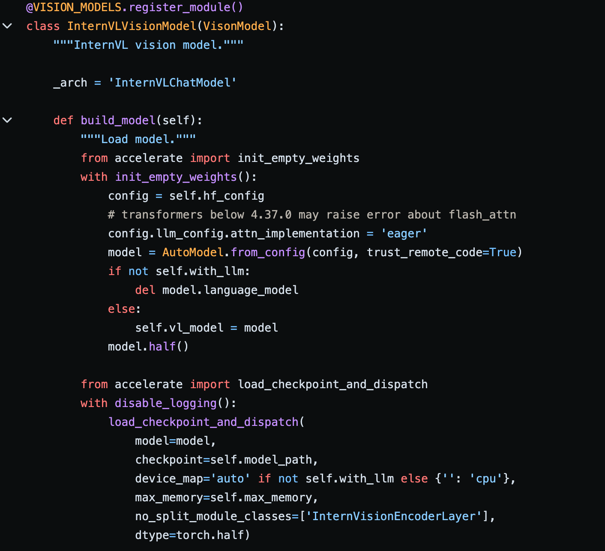
*LMDeploy VL vision inference*

InternViT-6B는 HF + accelerate로 추론한다. weight가 두 GPU에 나뉘어 올라가도 inference는 layer-wise serial로 진행되며 Tensor Parallel로 두 GPU의 계산력을 제대로 활용하지 않는다. 미래 VLM에서 10B, 20B급 vision module이 일반화되면 vision module과 LLM backbone을 함께 깊게 최적화하는 일이 필요해진다.

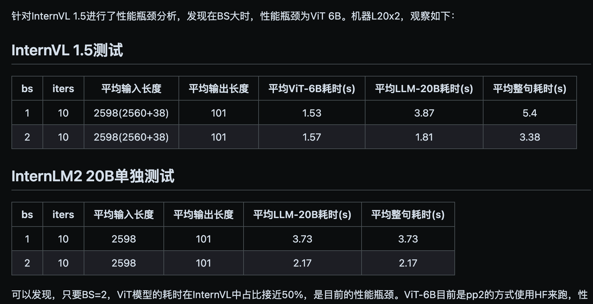
*InternVL deployment performance*

### 0x05 InternVL2.0 간단 분석

#### InternVL2.0 업데이트

2024년 7월 InternVL 팀은 InternVL 2.0을 발표했다. 전체 network 구조는 InternVL 1.5와 같고, Pixel Shuffle과 Dynamic High Resolution도 계승한다. 주요 변화는 의료 이미지와 비디오 입력까지 지원한다는 점이다.

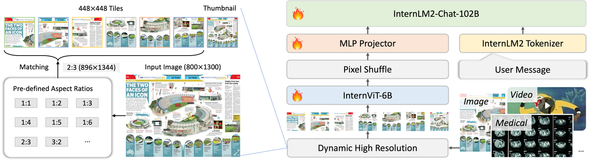
*InternVL2 전체 구조*

InternVL 2.0의 주요 변화는 세 가지다.

- Progressive alignment training strategy: LLM과 native alignment된 vision foundation model을 만든다. 작은 모델에서 큰 모델로, coarse data에서 fine data로 점진적으로 훈련해 낮은 비용으로 좋은 성능을 얻는다.
- Multimodal input: 하나의 통합 parameter set으로 text, image, video, medical data를 지원한다.
- Multitask output: VisionLLMv2 기반으로 image, bounding box, mask 등 다양한 출력 형식을 지원한다. 여러 downstream task decoder와 연결해 수백 개 vision-language task로 확장할 수 있다.

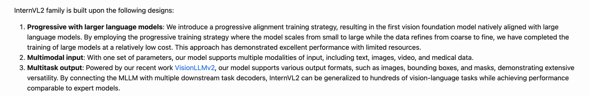
*InternVL 2.0 innovation*

#### InternVL2.0 Benchmark

InternVL 2.0은 여러 benchmark에서 SOTA를 기록한다. 108B parameter 모델도 공개해 open-source multimodal model의 scale 상한을 다시 올렸다.

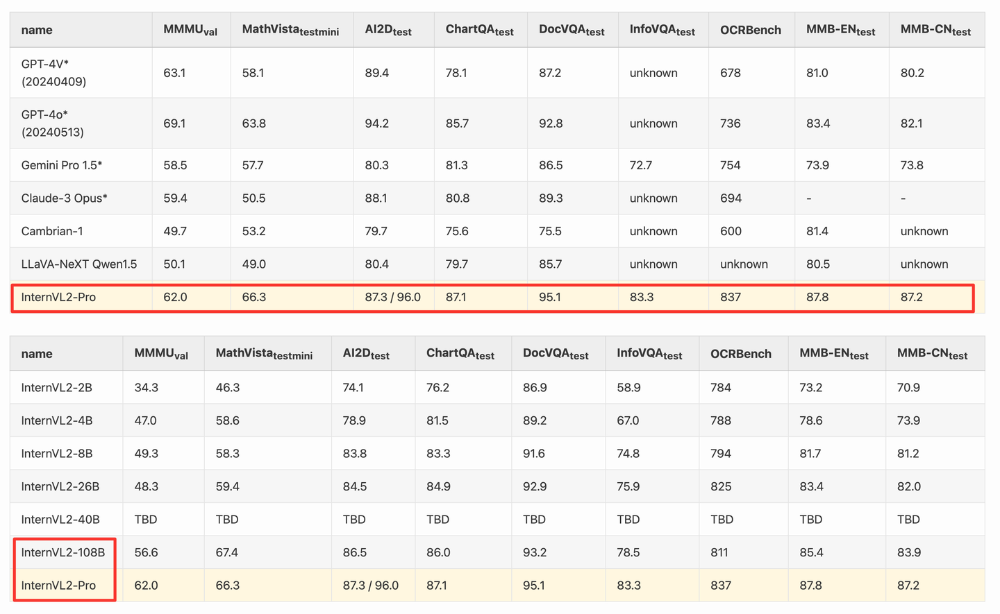
*InternVL 2.0 Benchmark*

### 0x06 정리

이 글은 InternLM/InternVL 시리즈의 구조를 정리했다. 핵심은 InternLM2의 **weight interleaving**, InternVL1.5의 **Pixel Shuffle**, **Dynamic High Resolution**이다.

InternLM2의 interleaving은 Tensor Parallel 훈련 효율을 높이지만, 추론 배포에서는 대부분 de-interleaving이 필요하다. InternVL1.5는 강한 vision encoder와 token 수를 줄이는 pixel shuffle, 고해상도 crop 전략으로 성능을 끌어올린다. InternVL2.0은 같은 큰 틀을 유지하면서 입력 modality와 task 범위를 넓힌다.

Awesome-LLM-Inference도 참고할 만하다.

```text
https://github.com/xlite-dev/Awesome-LLM-Inference
```

### 참고 문헌

- [0] InternVL2: Better than the Best—Expanding Performance Boundaries of Open-Source Multimodal Models with the Progressive Scaling Strategy
- [1] InternVL: Scaling up Vision Foundation Models and Aligning for Generic Visual-Linguistic Tasks
- [2] How Far Are We to GPT-4V? Closing the Gap to Commercial Multimodal Models with Open-Source Suites
- [3] InternLM2 Technical Report
- [4] InternLM2.5-7B Model Card
- [5] LMDeploy is a toolkit for compressing, deploying, and serving LLMs.
