# [LLaVA 시리즈] CLIP/LLaVA/LLaVA1.5/VILA 노트: 핵심 포인트 해석

> 원문: https://zhuanlan.zhihu.com/p/683137074

**목차**
- 0x00 서문
- 0x01 CLIP 모델 구조
- 0x02 CLIP 손실 함수
- 0x03 CLIP 실습 관점
- 0x04 LLaVA 모델 구조
- 0x05 LLaVA에서 CLIP의 활용
- 0x06 LLaVA 2단계 학습
- 0x07 LLaVA 1.5
- 0x08 OCR 태스크에 대한 영향
- 0x09 LLaVA 1.6
- 0x0a TinyLLaVA
- 0x0b VILA
- 0x0c TensorRT-LLM 배포
- 0x0d 정리

### 0x00 서문

이 글은 CLIP과 LLaVA 계열 모델의 핵심 포인트를 기록한 노트입니다. 이후 복습하거나 찾아볼 때 편하게 쓰기 위한 목적입니다.

더 많은 기술 노트와 CUDA 학습 노트는 LeetCUDA를 참고해 주세요. LeetCUDA에는 **LLM/VLM** 글 정리와 **FlashAttention, SGEMM, HGEMM, GEMV** 등 흔히 쓰이는 **CUDA Kernel**의 **예제 구현**이 포함되어 있으며, 현재 누적 **3k+ stars**를 달성했습니다. 링크: xlite-dev/LeetCUDA

### 0x01 CLIP 모델 구조

paper: https://arxiv.org/pdf/2103.00020.pdf

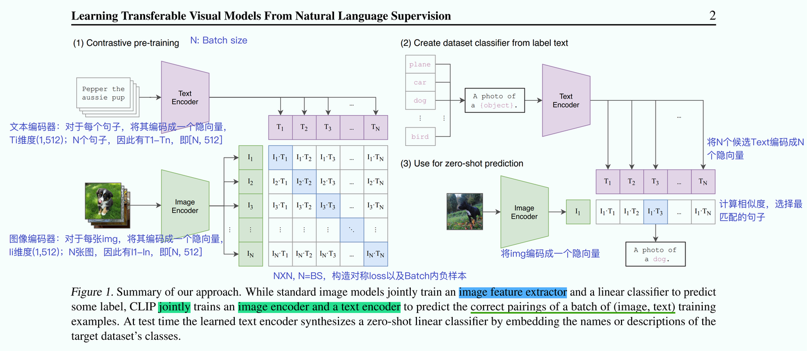
*CLIP 모델 구조*

CLIP 모델은 전형적인 two-tower 구조입니다. 하나는 Text Encoder이고, 다른 하나는 Image Encoder입니다. 학습 데이터셋은 `(image, text)` 쌍으로 구성되며, 올바르게 매칭된 image와 text에서 text는 image를 설명하는 문장입니다. CLIP은 `(image, text)` 쌍이 서로 매칭되는지 예측합니다. 매칭되면 1, 매칭되지 않으면 0입니다.

- Text Encoder: 각 문장을 hidden vector `T_i`로 인코딩하며 차원은 `(1, 512)`입니다. 문장 N개가 있으므로 `T_1`부터 `T_N`까지, 즉 `[N, 512]`가 됩니다.
- Image Encoder: 각 이미지를 hidden vector `I_i`로 인코딩하며 차원은 `(1, 512)`입니다. 이미지 N장이 있으므로 `I_1`부터 `I_N`까지, 즉 `[N, 512]`가 됩니다.

Text Encoder와 Image Encoder의 최종 출력은 모두 `[N, 512]` Tensor이므로, images와 texts 사이의 pairwise similarity를 계산하기 쉽습니다. CLIP은 Backbone으로 ResNet 또는 ViT를 선택할 수 있습니다. 실험 결과에서는 ViT가 ResNet보다 더 좋은 효과를 보입니다.

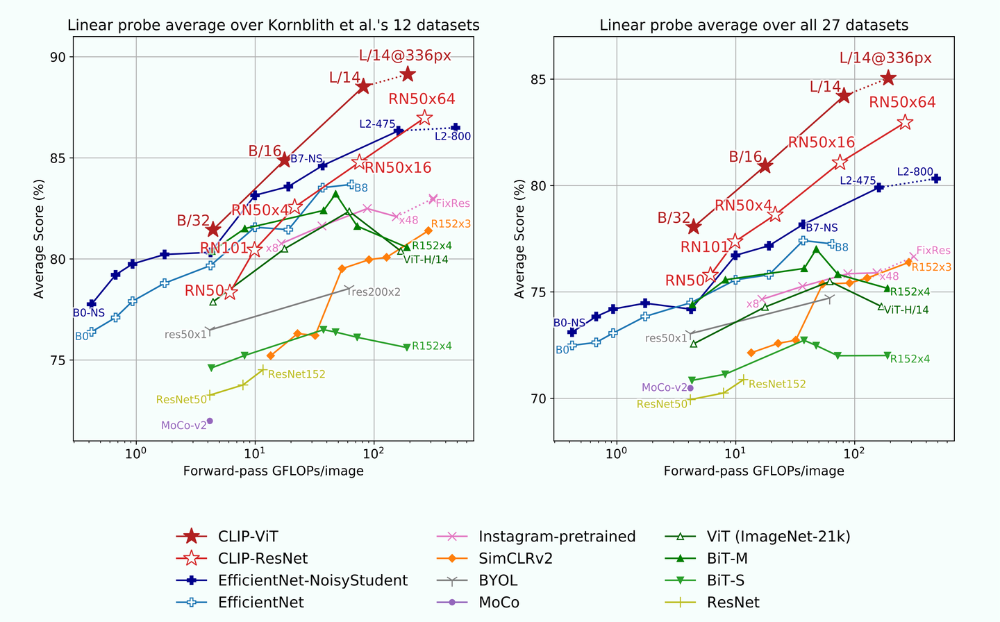
*CLIP ViT vs CLIP ResNet*

### 0x02 CLIP 손실 함수

CLIP은 대칭 손실 함수를 사용합니다. 간단히 말해 similarity matrix에 대해 행 방향과 열 방향에서 각각 loss를 계산하고, 마지막에 두 loss의 평균을 취합니다.

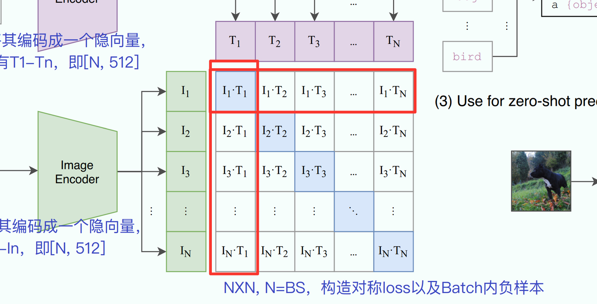
*CLIP 손실 함수*

의사코드는 다음과 같습니다.

```python
# image_encoder - ResNet or Vision Transformer
# text_encoder - CBOW or Text Transformer
# I[n, h, w, c] - minibatch of aligned images
# T[n, l] - minibatch of aligned texts
# W_i[d_i, d_e] - learned proj of image to embed
# W_t[d_t, d_e] - learned proj of text to embed
# t - learned temperature parameter
# extract feature representations of each modality
I_f = image_encoder(I) #[n, d_i]
T_f = text_encoder(T) #[n, d_t]
# joint multimodal embedding [n, d_e]
I_e = l2_normalize(np.dot(I_f, W_i), axis=1)
T_e = l2_normalize(np.dot(T_f, W_t), axis=1)
# scaled pairwise cosine similarities [n, n]
logits = np.dot(I_e, T_e.T) * np.exp(t)
# symmetric loss function
labels = np.arange(n)
loss_i = cross_entropy_loss(logits, labels, axis=0)
loss_t = cross_entropy_loss(logits, labels, axis=1)
loss = (loss_i + loss_t)/2
```

### 0x03 CLIP 실습 관점

코드로 이해를 검증해 봅니다. 먼저 CLIP을 설치합니다. CLIP 공식 문서를 참고하면 됩니다.

```bash
$ conda install --yes -c pytorch pytorch torchvision cudatoolkit
$ pip install ftfy regex tqdm
$ pip install git+https://github.com/openai/CLIP.git
```

테스트 스크립트:

```python
import torch
import clip
from PIL import Image

device = "cuda" if torch.cuda.is_available() else "cpu"
model, preprocess = clip.load("ViT-B/32", device=device)

image = preprocess(Image.open("CLIP.png")).unsqueeze(0).to(device)
text = clip.tokenize(["a diagram", "a dog", "a cat"]).to(device)

with torch.no_grad():
    image_features = model.encode_image(image)
    print("image_features shape:", image_features.shape) # [1, 512]
    text_features = model.encode_text(text)
    print("text_features shape:", text_features.shape) # [3, 512]
    
    logits_per_image, logits_per_text = model(image, text)
    print("logits_per_image shape:", logits_per_image.shape) # [1, 3]
    print("logits_per_text shape:", logits_per_text.shape) # [3, 1]
    probs = logits_per_image.softmax(dim=-1).cpu().numpy()

print("Label probs:", probs)  # prints: [[0.9927937  0.00421068 0.00299572]]
print("      Label: {}".format(["a diagram", "a dog", "a cat"]))
```

### 0x04 LLaVA 모델 구조

paper: https://arxiv.org/pdf/2304.08485.pdf

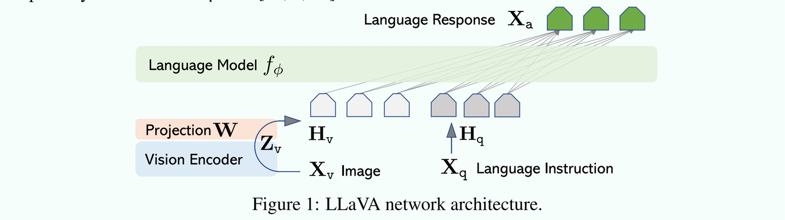
*LLaVA 모델 구조*

LLaVA의 모델 구조는 매우 단순합니다. 본질적으로 CLIP + LLM(Vicuna, LLaMA 구조)입니다. Vision Encoder를 사용해 이미지를 `[N=1, grid_H x grid_W, hidden_dim]` 형태의 feature map으로 바꾼 뒤, Projection W라는 투영층을 붙여 이미지 feature와 text feature의 차원을 맞춥니다. Projection을 거치면 `[N=1, grid_H x grid_W=image_seqlen, emb_dim]`이 됩니다. 이후 image token embedding과 text token embedding을 합쳐 언어 모델의 입력으로 넣고, 설명 텍스트를 생성합니다.

### 0x05 LLaVA에서 CLIP의 활용

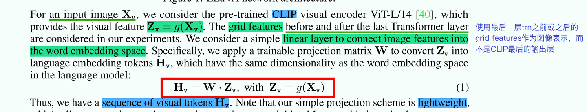

LLaVA에서 Vision Encoder는 CLIP-ViT-L/14를 사용합니다. 주의할 점은 LLaVA가 CLIP의 최종 출력층이 아니라, 마지막 Transformer layer 전후의 grid features를 이미지 표현으로 사용한다는 것입니다.

### 0x06 LLaVA 2단계 학습

- 1단계: feature alignment pretraining. CLIP에서 추출한 feature와 word embedding은 같은 의미 표현 공간에 있지 않습니다. 따라서 pretraining을 통해 image token embedding을 text word embedding의 의미 표현 공간에 정렬해야 합니다. 이 단계에서는 Vision Encoder와 LLM 모델의 가중치를 freeze하고, Projection W의 가중치만 학습합니다.

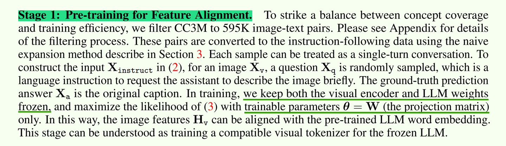

- 2단계: end-to-end training. 이 단계에서도 Vision Encoder의 가중치는 freeze합니다. 학습 과정에서는 Projection W와 LLM 언어 모델의 가중치를 동시에 업데이트하며, Multimodal Chatbot과 Science QA라는 두 가지 대표 태스크를 고려합니다.

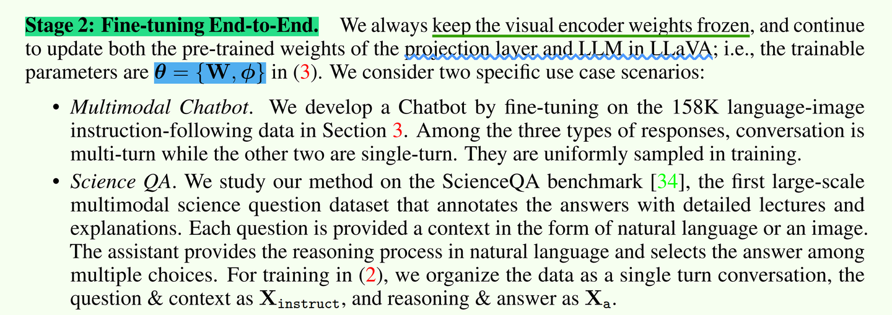

- 실험 결론: 실험 결과에 따르면 LLaVA는 대화, 세부 묘사, 복잡한 추론 등의 태스크에서 BLIP-2보다 우수합니다.

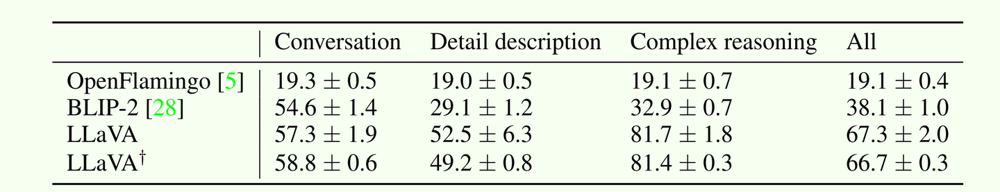

### 0x07 LLaVA 1.5

paper: https://arxiv.org/pdf/2310.03744.pdf

LLaVA 1.5와 LLaVA는 모델 아키텍처가 기본적으로 같습니다. 다만 LLM 모델과 projection layer를 수정했고, 모델 성능이 점점 강해지기 시작했습니다.

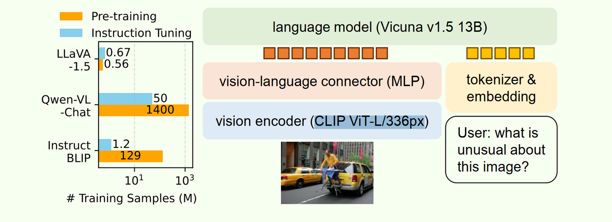

- LLM 모델: LLM 언어 모델을 Vicuna v1.5 13B로 업그레이드했습니다. 언어 모델 파라미터 수가 더 크고 효과도 더 좋습니다.
- Connector: projection layer입니다. 기존의 단일 linear layer를 MLP layer, 즉 여러 linear layer를 쌓은 구조로 교체했습니다.
- Vision Encoder: 입력 이미지 해상도를 224에서 336으로 키우고, CLIP ViT-L/336px를 사용해 이미지 세부 정보 이해 능력을 높였습니다.
- 더 높은 품질의 데이터: 말 그대로 Data is All you need입니다.

아래는 LLaVA 1.5 논문의 radar chart입니다. 이후 LLaVA 계열 논문들은 기본적으로 이 그림을 baseline으로 삼습니다. 경쟁이 점점 치열해졌습니다.

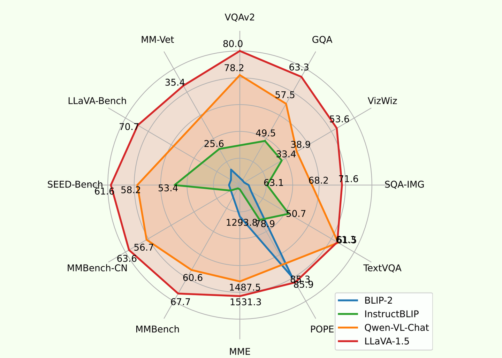

### 0x08 OCR 태스크에 대한 영향

LLaVA 모델은 in-context learning과 zero-shot multilingual capability를 갖고 있습니다. 예를 들어 OCR 태스크를 보면, 기존 딥러닝 OCR 알고리즘은 OCR 전용 모델을 별도로 학습해야 했습니다. 반면 LLaVA 자체는 적절한 prompt만 지정하면 이미지에서 문자를 추출할 수 있습니다. 달리 말하면, 범용 multimodal image-to-text 대형 모델은 대체로 이런 능력을 갖고 있습니다.

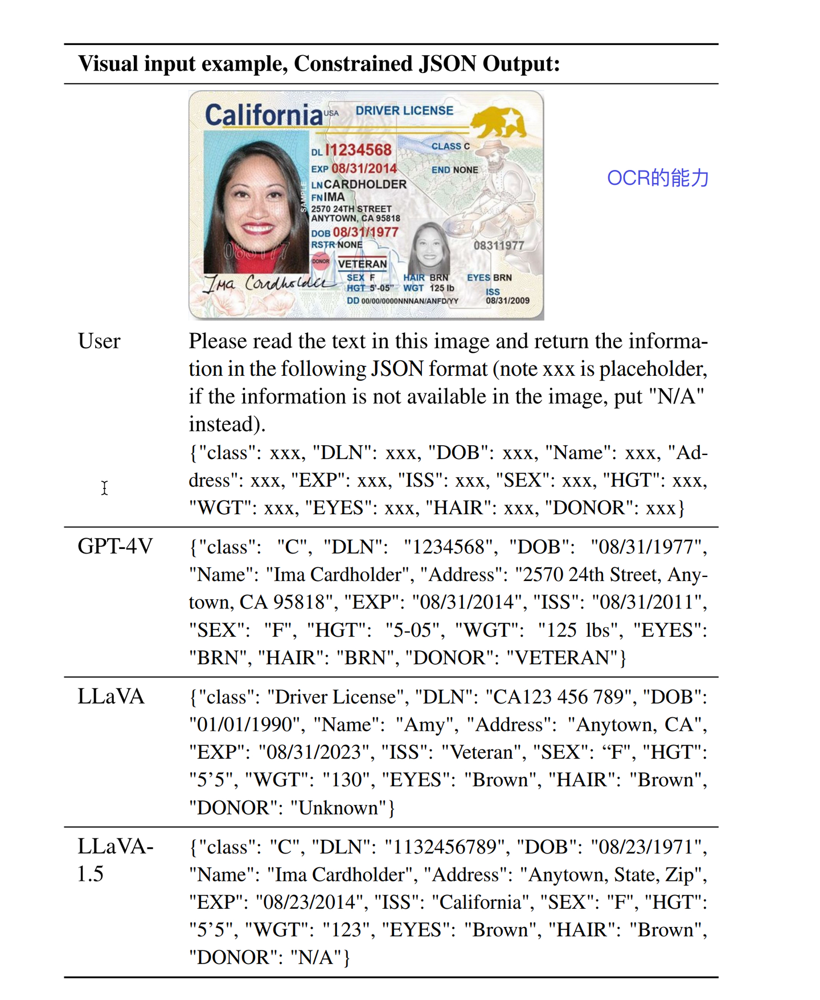

### 0x09 LLaVA 1.6

blog: https://llava-vl.github.io/blog/2024-01-30-llava-next/

2024년 1월 30일, LLaVA는 1.6 버전을 발표했습니다. 모델 성능이 한 단계 더 향상되었고, reasoning, OCR, world knowledge 능력이 강화되었습니다. 모델 파라미터 수는 34B까지 올라갔습니다. 1.5 버전의 13B와 비교하면 크게 증가한 셈이며, 여러 지표에서 10점 이상 성능이 상승했습니다. 역시 규모의 힘이 큽니다. 주요 변화는 다음과 같습니다.

- Vision Encoder 해상도: 더 큰 해상도를 지원합니다. 입력 해상도는 672x672, 336x1344, 1344x336 등을 포함하며, 이미지 crop, encoding, merge를 통해 구현합니다.

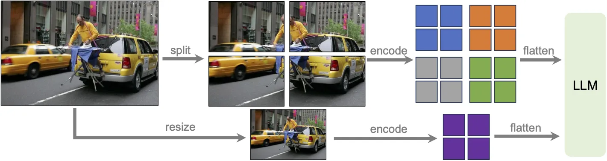

- LLM 모델 파라미터 대규모 업그레이드: LLaVA 1.5의 13B에서 최대 34B로 증가했습니다.
- OCR 능력 향상: instruction dataset 수정으로 더 나은 reasoning 및 OCR 능력을 얻었습니다.
- 더 나은 시각 대화: 일부 장면에서는 더 좋은 world knowledge를 보여줍니다.

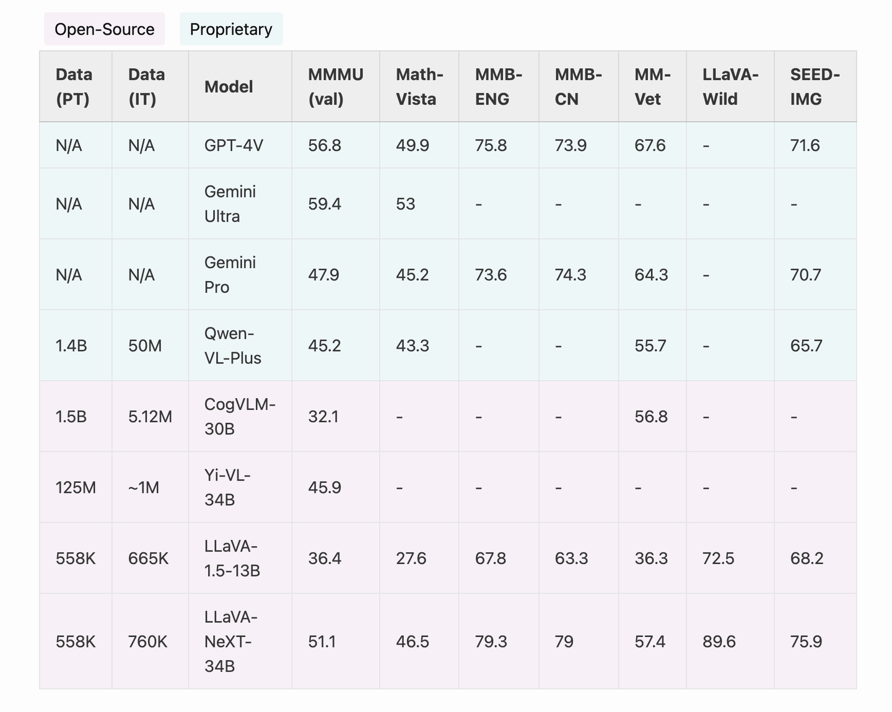

### 0x0a TinyLLaVA

paper: https://arxiv.org/pdf/2402.14289.pdf

TinyLLaVA는 3B 모델로 7B 모델과 경쟁하기 시작한 사례입니다. 논문 결과에서는 TinyLLaVA 3.1B가 전체적으로 LLaVA-1.5-7B보다도 더 좋습니다. 모델 파라미터는 절반 수준인데 효과는 오히려 더 좋습니다.

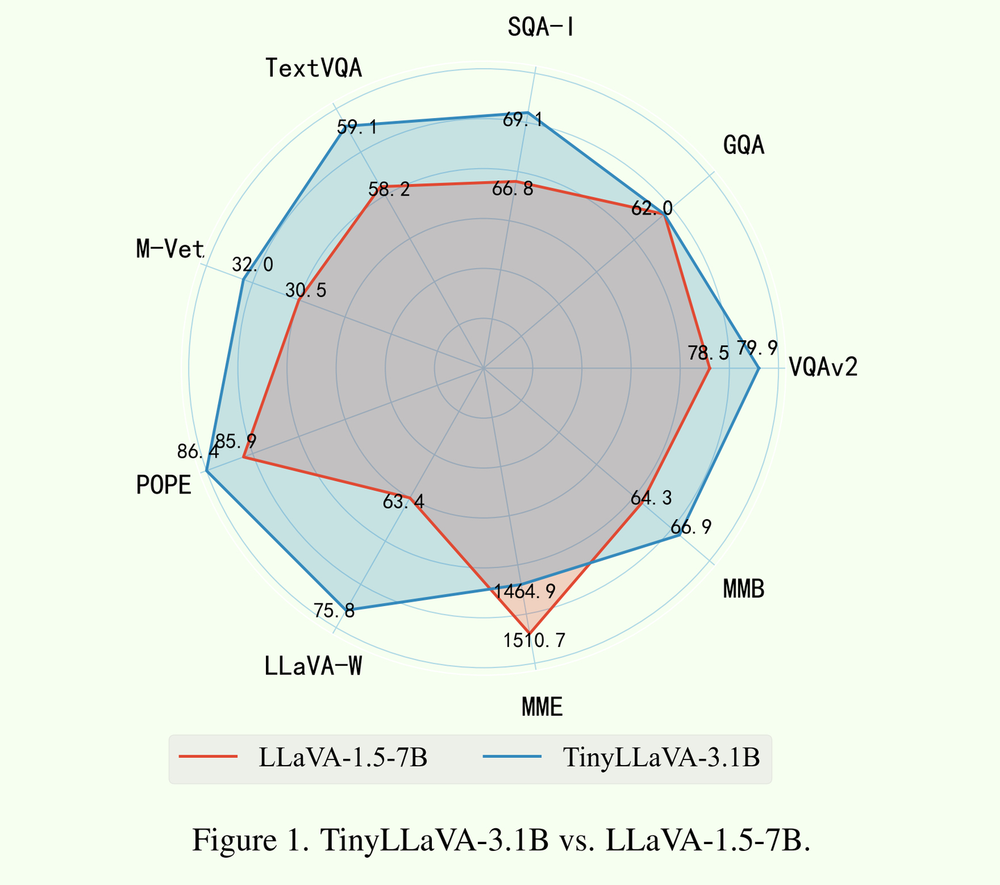

### 0x0b VILA

paper: https://arxiv.org/pdf/2312.07533.pdf (NVIDIA 작품)

VILA는 NVIDIA의 작품입니다. 비교 baseline은 LLaVA-1.5이며, 여러 지표에서 개선이 있습니다. 다만 LLaVA 1.6과 비교하면 약간 밀리는 듯합니다.

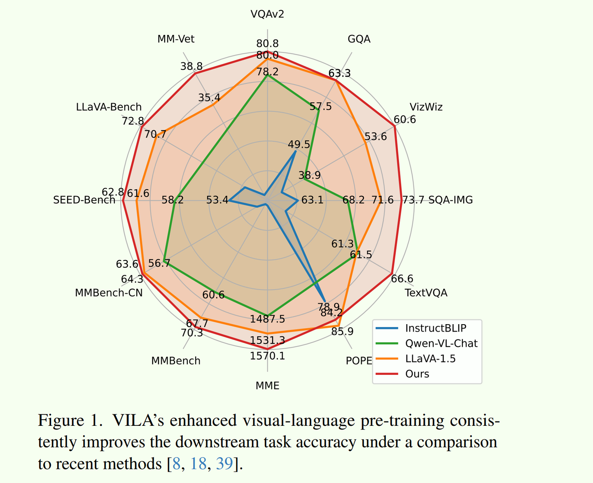

### 0x0c TensorRT-LLM 배포

현재 LLaVA 계열과 VILA 모델 배포는 TensorRT-LLM 최신 버전에서 이미 지원됩니다. 링크는 원문을 참고하면 됩니다.

제가 작성한 TensorRT-LLM 배포 튜닝 글도 함께 읽어 보기를 추천합니다.

### 0x0d 정리

이 글에서는 LLaVA와 CLIP의 모델 구조를 간단히 정리하고, CLIP이 LLaVA에서 어떻게 사용되는지 설명했습니다. 덧붙여 LLM 추론 배포 각 방향의 최신 진전은 제가 정리한 Awesome-LLM-Inference를 추천합니다. 링크: https://github.com/xlite-dev/Awesome-LLM-Inference


*Awesome-LLM-Inference*

더 많은 기술 노트와 CUDA 학습 노트는 LeetCUDA를 참고해 주세요. LeetCUDA에는 **LLM/VLM** 글 정리와 **FlashAttention, SGEMM, HGEMM, GEMV** 등 흔히 쓰이는 **CUDA Kernel**의 **예제 구현**이 포함되어 있으며, 현재 누적 **3k+ stars**를 달성했습니다. 링크: xlite-dev/LeetCUDA

계속 업데이트 중입니다.
