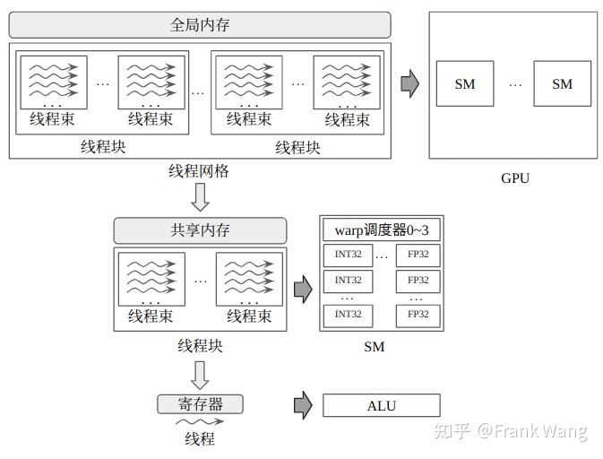
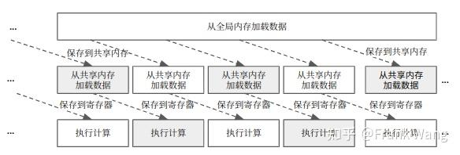
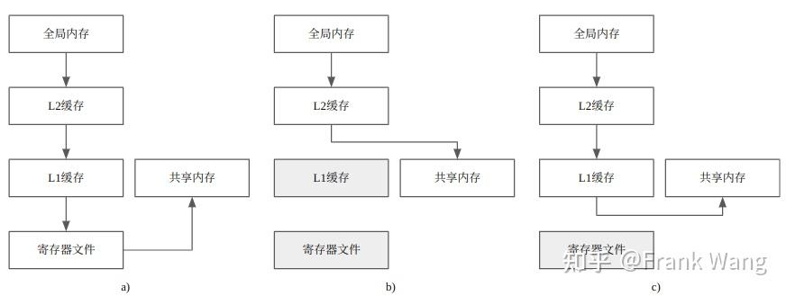
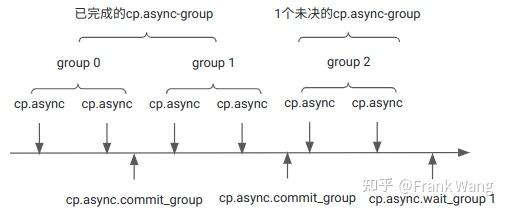
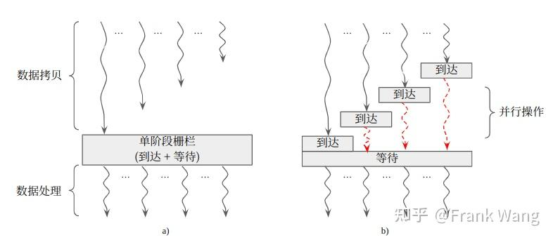

# Async Copy 및 Memory Barrier 명령어의 기능과 구현

> 원문: https://zhuanlan.zhihu.com/p/685168850

본 글은 주로 NVIDIA 공식 문서를 참고했습니다.

CUDA는 NVIDIA GPU용 C 계열 프로그래밍 모델입니다. CUDA 스레드는 스레드 계층 구조로 조직되며, 메모리 계층 구조의 각 레벨이 스레드 계층 구조와 대응합니다. CUDA는 세 단계의 프로그래밍 추상을 제공합니다: thread, thread block, grid. 하드웨어 계층과 CUDA 프로그래밍 모델의 매핑 관계에서는 세 단계의 자원이 존재합니다: ALU, SM(streaming multiprocessor), GPU.

thread는 가장 기본적인 프로그래밍 추상이자 실행 단위입니다. 한 thread block 내의 thread 수는 아키텍처가 제약합니다. 같은 block의 thread는 같은 SM에서 실행되어 자원 분할(공유 메모리 등)을 공유하고, 공유 메모리·배리어 동기화로 통신할 수 있습니다. 런타임에는 한 thread block은 한 SM에서만 동작하지만, SM은 block 단위가 아니라 warp 단위로 관리합니다. 한 block은 여러 warp로 나뉘고 각 warp는 보통 32 thread를 포함합니다. 같은 warp의 thread는 SIMT(Single Instruction Multiple Threads) 방식으로 같은 명령을 다른 데이터에 대해 실행합니다. warp scheduler는 매 사이클 준비된 명령 하나를 골라 전용 산술 명령 유닛에 발사합니다. 레지스터 파일·데이터 캐시·공유 메모리는 block 사이에서 분할되므로 warp 전환 비용이 없습니다. 여러 block이 모여 grid가 됩니다. grid는 디바이스의 활성 CUDA 커널 프로그램에 해당하며, 같은 grid의 모든 block은 thread 수가 같습니다. CUDA 런타임은 block을 SM에, grid를 GPU에 스케줄합니다. 한 grid가 여러 SM을 점유할 수 있습니다. 디바이스의 모든 thread는 소속 block과 무관하게 global memory에 접근할 수 있습니다. global memory는 용량이 가장 크지만 지연이 높고 처리량은 낮습니다. CUDA의 스레드 계층, 메모리 계층, 하드웨어 자원 계층의 대응 관계는 아래와 같습니다.


*CUDA 스레드/메모리/하드웨어 자원 계층 대응*

커널 프로그램은 보통 copy-and-compute 패턴으로 실행합니다. 즉 global memory에서 데이터를 가져와 공유 메모리에 저장한 뒤 계산하고, 결과(있다면)를 global memory에 다시 씁니다. NVIDIA Ampere부터 CUDA 프로그래밍 모델은 비동기 프로그래밍 모델로 메모리 연산을 가속합니다. 비동기 모델은 CUDA 스레드와 관련된 비동기 연산(스레드 간 동기를 위한 비동기 배리어와, global memory에서 비동기로 데이터를 옮기는 비동기 copy)을 정의합니다.

비동기 연산이란, 어떤 CUDA 스레드가 시작한 연산을 또 다른 스레드처럼 비동기로 실행할 수 있다는 뜻입니다. 데이터 가시성을 보장하기 위해 비동기 연산은 동기 객체로 완료 결과를 동기화합니다. CUDA는 다양한 동기 객체를 제공하며, 각 객체는 다양한 스레드 범위에서 사용됩니다. CUDA가 정의하는 스레드 범위는 thread, thread block, device, system입니다.

비동기 복사 명령어를 쓰지 않으면, `shared[local_idx] = global[global_idx]` 같은 문장은 구현 시 global memory → register → shared memory 두 단계로 확장됩니다. 계산 단계 전에 공유 메모리 쓰기가 끝나지 않았을 수 있으므로 그 후 동기화로 복사를 기다려야 합니다. 또 계산 후에도 다시 동기화해 모든 thread의 계산이 끝나기 전에 다른 연산이 공유 메모리를 덮어쓰지 않게 해야 합니다.

비동기 복사 없이 쓰는 예:

```cpp
for (size_t batch = 0; batch < batch_sz; ++batch) {
    shared[block.thread_rank()] = global_in[batch * block.size() + block.thread_rank()];
    block.sync();
    compute(shared);
    block.sync();
}
```

NVIDIA가 2020년 5월 Ampere에서 도입한 새로운 비동기 복사(Async Copy) 명령어는 global 데이터를 (보통 L2 캐시·DRAM에서) SM의 공유 메모리로 직접 적재할 수 있습니다. 비동기 복사는 SM이 다른 계산을 할 때 백그라운드로 끝낼 수 있습니다. Volta에선 global 데이터를 먼저 L1 캐시를 거쳐 레지스터 파일에 적재한 뒤 store-shared로 레지스터 → 공유 메모리, 그리고 load-shared로 공유 메모리 → 레지스터로 옮겨야 했습니다. 새 비동기 복사는 L1 캐시를 우회해 레지스터 파일을 오가는 비용을 줄이고 SM 내부 대역폭을 절약하며, 전송 중 데이터에 레지스터를 할당할 필요도 없습니다. 대량의 연속적인 global → shared 복사에 비동기 복사를 쓰면 성능이 크게 향상됩니다.

효율적 데이터 이동을 위해 Ampere는 공유 메모리 비동기 배리어(Asynchronous Barrier, 이하 *mbarrier*) 명령어도 도입했습니다. mbarrier는 메모리 배리어 명령어로, 배리어의 arrive와 wait 동작을 분리해 비동기 복사와 협동하게 합니다. 이로써 global → shared 비동기 복사와 SM 내 계산을 겹쳐 실행할 수 있습니다. 비동기 배리어는 유연한 다양한 granularity의 스레드 동기화 메커니즘을 제공하며, 동기 범위가 warp나 block에 한정되지 않습니다. 비동기 복사는 새로운 mbarrier로 커널에 복사 완료를 알릴 수 있습니다.

## 1. 비동기 복사의 기능

비동기 복사를 사용하는 커널은 보통 소프트웨어 파이프라이닝과 협력합니다. 소프트웨어 파이프라이닝은 copy-and-compute 메인 루프를 여러 파이프라인 단계로 나눕니다. 상류 단계가 데이터를 적재하는 동안 하류 단계는 (이전 상류 단계가 적재해 둔 피연산자로) 계산을 수행할 수 있습니다. 이 구조에서 SM이 현재 계산을 위해 공유 메모리 데이터를 쓰는 동안 thread block은 다음 배치(batch) 계산용 데이터를 global memory에서 읽어야 합니다. 따라서 공유 메모리 레벨에서 double buffering을 두어 상류 단계가 공유 메모리에 쓰는 동시에 하류 단계가 공유 메모리에서 적재할 수 있게 합니다. block의 각 thread는 현재 배치 데이터에서 1개 이상의 원소를 복사하고, 모든 thread가 동기화(`_syncthreads` 또는 `cooperative_group::sync`)로 복사 완료를 기다립니다.


*소프트웨어 파이프라인*

이 구조에서 각 thread는 `cuda::memcpy_async`를 1회 이상 호출해 현재 배치의 비동기 복사를 제출하고, 모든 thread가 이미 제출된 복사 완료를 기다립니다. 이 방식으로 여러 배치를 동시에 이동·계산할 수 있어, AI 모델의 대형 데이터 구조에 매우 유리합니다. 대형 구조를 N개 배치로 나누면, block은 N단계의 비동기 복사를 제출해 N개 배치를 파이프라인 반복 처리할 수 있고, 컴파일러의 동적 루프 언롤도 피할 수 있습니다. 비동기 복사 사용 예:

```cpp
for (size_t batch = 0; batch < batch_sz; ++batch) {
    cooperative_groups::memcpy_async(block, shared,
                                     &global_in1[batch * block.size()], sizeof(T) * block.size());
    cooperative_groups::memcpy_async(block, shared + block.size(),
                                     &global_in2[batch * block.size()], sizeof(T) * block.size());
    cooperative_groups::wait(block);
    compute(shared);
    block.sync();
}
```

여기서 `memcpy_async()`/`wait()`이 기존 `memcpy()`/`sync()`를 대체합니다. compute capability 8.0 이상이면 `cp.async` 명령으로 `memcpy_async()` API를 구현할 수 있습니다. `cp.async` 문법:

```
cp.async.ca.shared.global{.level::cache_hint}{.level::prefetch_size}
                         [dst], [src], cp-size{, src-size}{, cache-policy} ;
cp.async.cg.shared.global{.level::cache_hint}{.level::prefetch_size}
                         [dst], [src], 16{, src-size}{, cache-policy} ;
cp.async.ca.shared.global{.level::cache_hint}{.level::prefetch_size}
                         [dst], [src], cp-size{, ignore-src}{, cache-policy} ;
cp.async.cg.shared.global{.level::cache_hint}{.level::prefetch_size}
                         [dst], [src], 16{, ignore-src}{, cache-policy} ;
```

`cp.async`는 메모리 복사를 시작하고, 완료 전 실행 스레드에 제어를 반환합니다. 실행 스레드는 `cp.async.wait_all`, `cp.async.wait_group`, 또는 `mbarrier` 명령으로 비동기 복사 완료를 기다리며, 서로 다른 비동기 복사 사이의 순서를 보장합니다.

L1 캐시 접근 여부에 따라 비동기 복사는 두 가지 모드로 나뉩니다. 회색 박스는 복사 시 우회되는 모듈을 나타냅니다.

- (a) 비동기 복사 없는 기존 흐름. global 데이터가 L1 캐시·레지스터 파일을 임시 거쳐 갑니다.
- (b) BYPASS 모드. global 데이터가 L1·레지스터를 우회해 global → L2 → shared로 직접 복사.
- (c) ACCESS 모드. global 데이터를 L1 캐시에 보관해 재사용성을 확보한 뒤 shared로 복사.


*비동기 복사 모드*

- `.cg`: L2에서만 캐시, L1 캐시는 사용하지 않음
- `.ca`: L1 포함 모든 단계 캐시
- `.level::cache_hint`: `.global` 상태 공간과 `.global` 상태로 가는 일반 주소에 대해 `.L2::cache_hint` 사용 가능
- `.level::prefetch_size`: 해당 캐시 레벨로 추가 데이터 프리페치. 허용값 `.L2::64B`, `.L2::128B`, `.L2::256B`
- `src`/`dst`: 각각 global, shared 상태 공간의 주소
- `cp-size`: 정수 상수. 복사 바이트 수. 4, 8, 16 중 하나
- `src-size`: 32-bit 정수. `src-size < cp-size`여야 함. 초과분은 0으로 채움
- `ignore-src`: True면 src 데이터를 완전히 무시하고 0을 복사
- `cache-policy`: 캐시 추방 정책. 지정 시 `.level::cache_hint`도 함께 지정

PTX에서 비동기 복사 완료를 기다리는 방법은 두 가지: `cp.async-group`을 호출하거나 `mbarrier`를 쓰는 것입니다.

`cp.async-group` 사용 시 `cp.async`가 시작한 복사는 `cp.async-group`에 제출되고, 제출은 `cp.async.commit_group`이 수행합니다. 한 스레드가 시작한 복사들을 묶을 수 있습니다. `cp.async.commit_group`은 실행 스레드용으로 새 group을 만들며, 이 group에는 commit 전에 시작한 복사들만 포함되고 commit 후 시작된 것은 포함되지 않습니다. 예:

```
cp.async.ca.shared.global [shrd1],   [gbl1],   8;
cp.async.cg.shared.global [shrd1+8], [gbl1+8], 8;
cp.async.commit_group ;
```

제출된 비동기 복사는 단 하나의 group에 속합니다. 실행 스레드는 `cp.async.wait_all` 또는 `cp.async.wait_group`으로 group 완료를 기다린 뒤에야 복사된 데이터를 접근할 수 있습니다. group 완료 순서는 제출 순서로 결정됩니다.

```
cp.async.wait_group N;
cp.async.wait_all ;
```

`cp.async.wait_group N`은 실행 스레드를 대기 상태로 두며, 가장 최근의 group 호출 시점 기준 미완료 group이 N개 이하가 될 때까지 기다립니다. `N = 0`이면 이전의 모든 group이 완료될 때까지 기다립니다.

예: 세 group이 있고 `N = 1`이면 앞의 두 group이 끝날 때까지 기다리고, 마지막 group은 아직 완료될 필요 없음:

```
cp.async.ca.shared.global [shrd0], [gbl0], 4;
cp.async.ca.shared.global [shrd1], [gbl1], 16;
cp.async.commit_group;  // End of group 0

cp.async.cg.shared.global [shrd2], [gbl2], 8;
cp.async.cg.shared.global [shrd3], [gbl3], 16;
cp.async.commit_group;  // End of group 1

cp.async.cg.shared.global [shrd4], [gbl4], 8;
cp.async.cg.shared.global [shrd5], [gbl5], 16;
cp.async.commit_group;  // End of group 2

cp.async.wait_group 1;  // group 0과 1 완료 대기
```


*명령 실행 순서*

`cp.async.wait_all`은 `cp.async.commit_group + cp.async.wait_group 0`을 합친 것에 해당:

```
cp.async.ca.shared.global [shrd0], [gbl0], 4;
cp.async.cg.shared.global [shrd1], [gbl1], 16;
cp.async.wait_all;
```

`cp.async.wait_all` 또는 해당 group의 `wait_group`이 끝나야 `cp.async`가 쓴 데이터가 실행 스레드에 가시화됩니다.

`mbarrier`로 비동기 복사 완료를 기다릴 때는 mbarrier 객체가 복사를 추적하며, `mbarrier.test_wait`가 True를 반환한 후에야 데이터에 접근할 수 있습니다.

비동기 복사 명령어의 동작은 분리된 load-global + store-shared와 비슷하지만 데이터 임시 저장용 레지스터를 소비하지 않으므로, 더 많은 레지스터를 계산용으로 풀어 줍니다. 또한 block을 복사 작업에서 해방시킵니다. 레지스터 소비 감소는 GPU occupancy 향상으로 이어집니다. 한 번에 4·8·16 바이트를 복사할 수 있고, 각 thread가 독립적으로 global·shared 주소를 지정할 수 있습니다. 따라서 비동기 배리어로 올바른 쓰기 순서와 block 내 thread 간 데이터 가시성을 보장할 수 있습니다.

비동기 배리어로 데이터 전송을 동기화하는 예:

```cpp
for (size_t batch = 0; batch < batch_sz; ++batch) {
    cooperative_groups::memcpy_async(block, shared,
                                     &global_in1[batch * block.size()], sizeof(T) * block.size());
    cooperative_groups::memcpy_async(block, shared + block.size(),
                                     &global_in2[batch * block.size()], sizeof(T) * block.size());
    barrier.arrive_and_wait();
    compute(shared);
    barrier.arrive_and_wait();
}
```

복잡한 알고리즘에서는 다양한 단계의 동기화가 필요합니다. CUDA에서는 보통 block 동기화와 device 전역 동기화 두 종류를 씁니다. `cuda::memcpy_async`와 `cudaMemcpyAsync` API를 혼동하지 마세요. 후자는 커널 시작 후 CPU의 암묵적 배리어로 device-wide 동기화를 구현하며, CPU 메모리와 GPU global memory 사이의 데이터 이동을 GPU 커널 실행과 겹치게 합니다.

## 2. 비동기 배리어 명령어의 기능

비동기 배리어는 메모리 배리어 명령어(`membar`/`memory fence`/`fence`)의 일종입니다. 멀티스레드 프로그램은 보통 동기 프리미티브로 자원 접근을 동기화하며, 이는 보통 mbarrier로 구현됩니다. 고수준 언어 개발자는 mbarrier를 직접 쓸 일이 거의 없고, 공유 메모리 연산의 저수준 기계 코드 구현에서 주로 사용됩니다. mbarrier로 프로세서는 배리어 전후의 메모리 연산에 순서 제약을 강제할 수 있습니다. 즉 mbarrier 이전에 발사된 연산을 모두 끝낸 뒤에야 이후 연산을 시작합니다.

비동기 배리어는 단일 단계(single-stage) 배리어와 동일한 기능을 제공하지만, 어떤 스레드의 *arrive*(도착) 통지와 다른 스레드의 *wait*(대기)가 분리돼 있다는 점이 다릅니다. 분리 덕분에 도착 후 배리어와 무관한 다른 일을 할 수 있어 대기 시간을 더 효율적으로 활용하고 실행 효율을 높입니다.


*단일 vs 비동기 배리어*

(a) 단일 단계 배리어는 arrive와 wait이 합쳐져 있어, 데이터 복사 단계의 지연이 block 내 가장 느린 스레드에 종속됩니다. 도착한 스레드는 가장 느린 스레드를 기다리는 동안 다른 명령을 못 합니다. (b) 비동기 배리어는 arrive와 wait이 분리돼 있어, 일찍 도착한 스레드가 데이터가 준비됐다고 비동기 배리어에 통지한 뒤 SM이 동기와 무관한 다른 병렬 작업을 계속 수행할 수 있습니다. 이런 파이프라인 방식의 비동기 처리로 고지연 연산을 가릴 수 있습니다. 비동기 배리어의 wait 동작은 단일 단계 배리어와 비슷하게 하드웨어에 통지해 다른 참가 스레드와 동기화해야 하지만, 비동기 배리어의 wait에는 태그가 붙습니다. 어떤 배리어 종류든 block 내 모든 warp의 동기는 SM이 제어합니다.

또 비동기 배리어는 단일 단계 배리어와 동기 granularity가 다릅니다. 단일 단계 배리어는 warp나 block 레벨에서만 하드웨어 가속 동기를 제공하지만, 비동기 배리어는 block 내 임의의 스레드 부분 집합에 대해 하드웨어 가속 동기를 제공합니다.

비동기 배리어 메커니즘에선 서로 다른 스레드·warp가 서로 다른 배리어 포인트(barrier point)에 참여할 수 있으므로, SM은 각 포인트별로 참가 스레드·warp를 담은 태그를 여러 개 유지해야 합니다. 예를 들어 n+1개의 배리어 포인트가 있을 때 포인트 0의 참가 스레드 id는 `x₀ ~ y₀`, 포인트 1은 `x₁ ~ y₁` 처럼 각자 태그에 기록됩니다.


*배리어 포인트와 태그*

(미완성)
