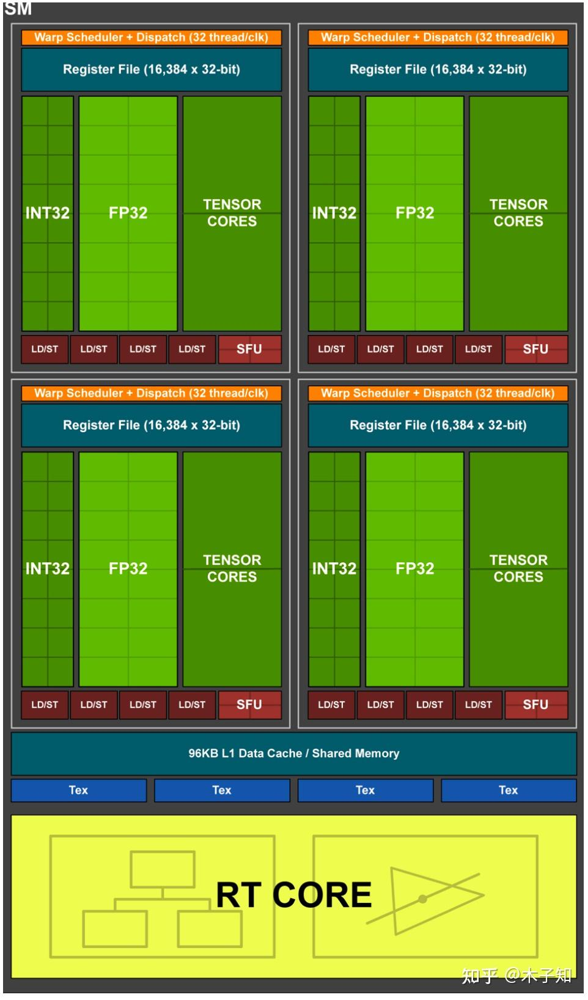
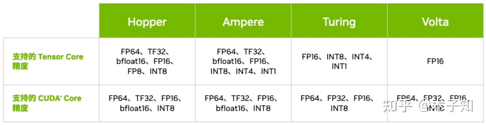
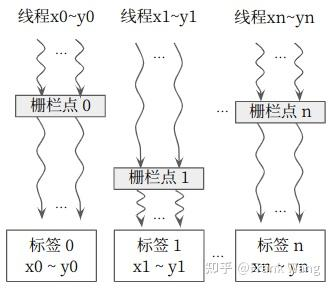
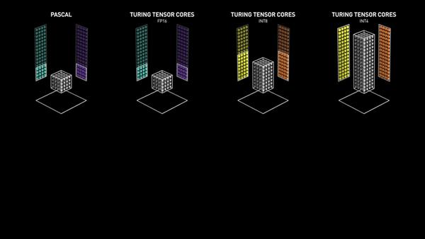
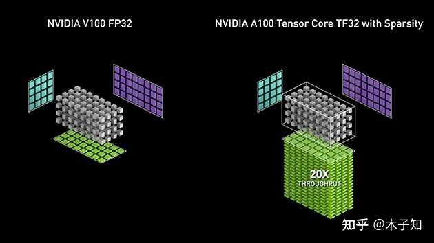
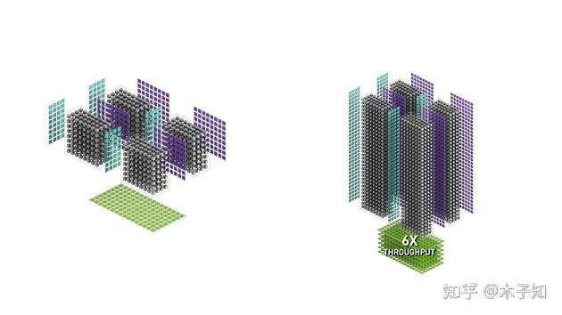

# Nvidia Tensor Core 초탐

> 원문: https://zhuanlan.zhihu.com/p/620185229

## 1. 배경

딥러닝 합성곱 네트워크 기반 이미지 처리 분야에서 연산 집약적인 convolution 연산자는 줄곧 엔지니어링 최적화의 핵심이었습니다. convolution 연산은 일반적으로 행렬 곱(matrix multiplication)으로 변환되므로, 행렬 곱 연산 최적화는 자연스럽게 딥러닝 프레임워크가 가장 관심을 두는 최적화 방향 중 하나가 되었습니다. 이에 따라 NVIDIA는 하드웨어 차원의 해결책인 **Tensor Core**를 제시했습니다. Tensor Core는 행렬 곱 연산을 가속하고 혼합 정밀도(mixed-precision) 계산을 구현하여, 정확도를 유지하면서도 처리량을 향상시킵니다.

## 2. 하드웨어 유닛

CUDA Core와 마찬가지로 Tensor Core도 연산 유닛이며, 행렬 곱 연산을 전담합니다. 아래 그림은 Turing TU102/TU104/TU106의 SM 내부 구조로, 4개의 processing block으로 나뉘며 각 processing block은 16개 FP32 Core, 16개 INT32 Core, 2개 Tensor Core, 1개 Warp Scheduler, 1개 Dispatch Unit을 포함합니다.



## 3. 아키텍처

Volta에서 1세대 Tensor Core가 등장한 이후, 매 세대 아키텍처 업그레이드마다 Tensor Core는 크게 개선되었고 지원 데이터 타입도 점점 늘어났습니다.



### 3.1 Volta Tensor Core

1세대 Tensor Core는 FP16·FP32 혼합 정밀도 행렬 곱을 지원하며, 초당 100 TFLOPS 이상의 딥러닝 성능을 제공합니다. Pascal 아키텍처 대비 5배 이상입니다. Pascal과 비교하면 학습용 최고 TFLOPS 성능은 최대 12배, 추론용 최고 TFLOPS 성능은 최대 6배, 학습·추론 성능 전반이 3배 향상되었습니다.



### 3.2 Turing Tensor Core

2세대 Tensor Core는 딥러닝 학습·추론을 위한 다양한 정밀도(FP32에서 FP16, INT8, INT4까지)를 제공하며, 초당 최대 500조 회의 텐서 연산을 수행할 수 있습니다.



### 3.3 Ampere Tensor Core

3세대 Tensor Core는 **Tensor Float 32(TF32)** 정밀도 표준과 64비트 부동소수점(FP64)을 새롭게 채택하여, AI 애플리케이션을 가속·단순화하며 최대 20배까지 AI 속도를 끌어올립니다.



### 3.4 Hopper Tensor Core

4세대 Tensor Core는 새로운 **8비트 부동소수점 정밀도(FP8)** 를 사용하여 조(trillion) 단위 파라미터 모델 학습에서 FP16 대비 6배의 성능을 제공합니다. FP8은 Transformer engine에 적용되어 FP8·FP16 혼합 정밀도 모드를 활용할 수 있으며, Transformer 학습을 크게 가속하면서도 정확도를 유지합니다. FP8은 대규모 언어 모델 추론 속도도 대폭 끌어올려, Ampere 대비 최대 30배의 성능 향상을 보입니다.



## 4. 호출 방법

cuBLAS, cuDNN 등 CUDA 생태계 라이브러리 API로 Tensor Core를 호출하는 것 외에도, NVIDIA는 아래와 같은 방식을 제공합니다.

### 4.1 WMMA (Warp-level Matrix Multiply Accumulate) API

Compute Capability 7.0 이상의 CUDA 장치에서는 CUDA C++ API로 Tensor Core를 호출할 수 있으며, `D = A*B + C` 형태의 혼합 정밀도 행렬 곱을 지원합니다.

```cpp
template<typename Use, int m, int n, int k, typename T, typename Layout=void> class fragment;

void load_matrix_sync(fragment<...> &a, const T* mptr, unsigned ldm);
void load_matrix_sync(fragment<...> &a, const T* mptr, unsigned ldm, layout_t layout);
void store_matrix_sync(T* mptr, const fragment<...> &a, unsigned ldm, layout_t layout);
void fill_fragment(fragment<...> &a, const T& v);
void mma_sync(fragment<...> &d, const fragment<...> &a, const fragment<...> &b, const fragment<...> &c, bool satf=false);
```

- **fragment**: Tensor Core의 데이터 저장 클래스. `matrix_a`, `matrix_b`, `accumulator`를 지원
- **load_matrix_sync**: Tensor Core 데이터 로드 API. global/shared memory에서 fragment로 로드
- **store_matrix_sync**: Tensor Core 결과 저장 API. fragment에서 global/shared memory로 저장
- **fill_fragment**: fragment를 상수로 채우는 API
- **mma_sync**: Tensor Core 행렬 곱 계산 API. `D = A*B + C` 또는 `C = A*B + C` 지원

### 4.2 WMMA PTX (Parallel Thread Execution)

Compute Capability 7.0 이상의 CUDA 장치에서는 WMMA PTX 명령어로 Tensor Core를 호출할 수도 있으며, 마찬가지로 `D = A*B + C` 형태의 혼합 정밀도 행렬 곱을 지원합니다.

```
wmma.load.a.sync.aligned.layout.shape{.ss}.atype r, [p] {, stride};
wmma.load.b.sync.aligned.layout.shape{.ss}.btype r, [p] {, stride};
wmma.load.c.sync.aligned.layout.shape{.ss}.ctype r, [p] {, stride};

wmma.store.d.sync.aligned.layout.shape{.ss}.type [p], r {, stride};

wmma.mma.sync.aligned.alayout.blayout.shape.dtype.ctype d, a, b, c;
```

- **wmma.load**: Tensor Core 데이터 로드 명령. global/shared memory에서 Tensor Core 레지스터로 로드
- **wmma.store**: Tensor Core 결과 저장 명령. Tensor Core 레지스터에서 global/shared memory로 저장
- **wmma.mma**: Tensor Core 행렬 곱 계산 명령. `D = A*B + C` 또는 `C = A*B + C` 지원

### 4.3 MMA (Matrix Multiply Accumulate) PTX

Compute Capability 7.0 이상 장치에서는 MMA PTX 명령어로도 Tensor Core를 호출할 수 있으며, `D = A*B + C` 형태의 혼합 정밀도 행렬 곱을 지원합니다.

```
ldmatrix.sync.aligned.shape.num{.trans}{.ss}.type r, [p];

mma.sync.aligned.m8n8k4.alayout.blayout.dtype.f16.f16.ctype  d, a, b, c;
mma.sync.aligned.m16n8k8.row.col.dtype.f16.f16.ctype  d, a, b, c;
mma.sync.aligned.m16n8k16.row.col.dtype.f16.f16.ctype d, a, b, c;
```

- **ldmatrix**: Tensor Core 데이터 로드 명령. shared memory에서 Tensor Core 레지스터로 로드
- **mma**: Tensor Core 행렬 곱 계산 명령. `D = A*B + C` 또는 `C = A*B + C` 지원

### 4.4 SASS

SASS 명령어 세트 학습으로 확장.
