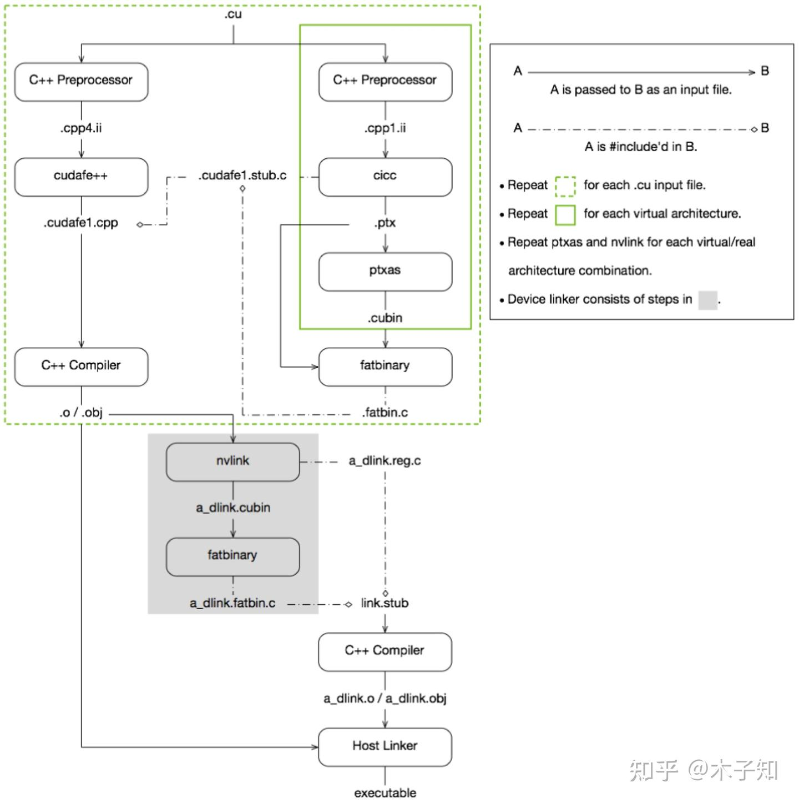
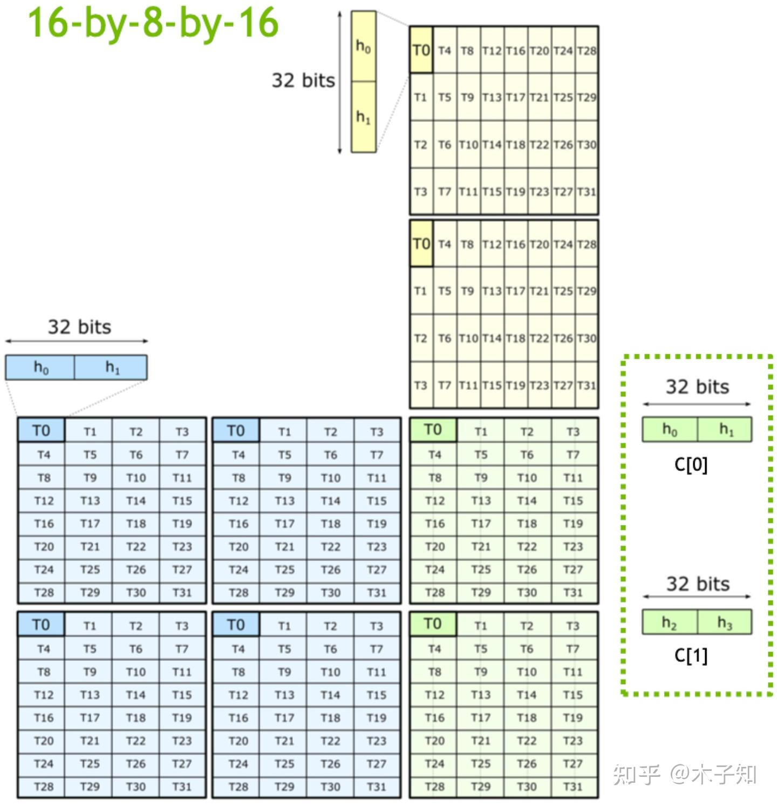
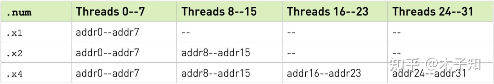
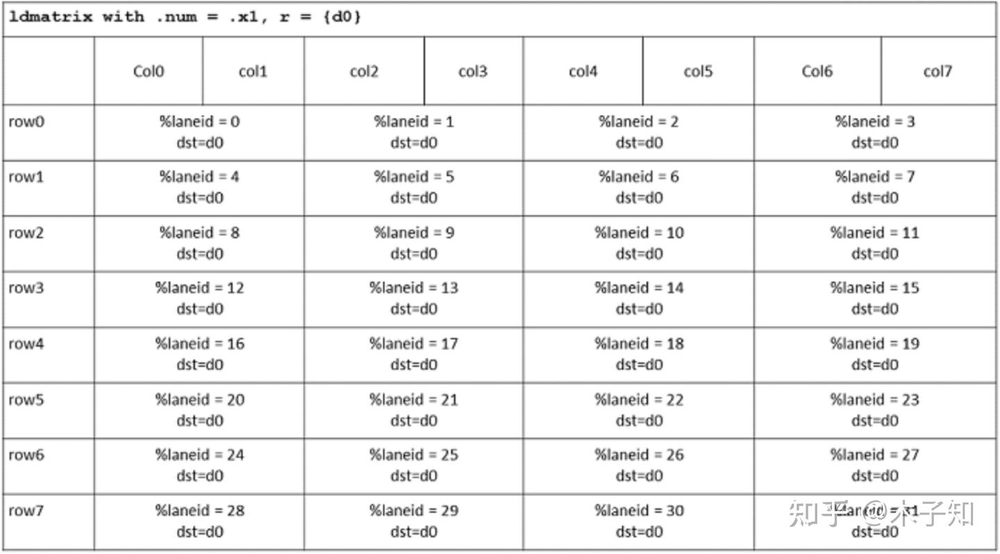

# Nvidia Tensor Core - MMA PTX 프로그래밍 입문

> 원문: https://zhuanlan.zhihu.com/p/621855199

## 1. PTX (Parallel Thread Execution)

PTX란 무엇일까요? NVIDIA 공식 설명은 "a low-level parallel thread execution virtual machine and instruction set architecture (ISA)", 직역하면 **저수준 병렬 스레드 실행 가상 머신 및 명령어 세트 아키텍처**입니다.

이해하는 방법은 두 가지입니다.

한 가지는 LLVM에 비유하는 것입니다. LLVM을 아는 사람은 그 풀네임이 Low Level Virtual Machine임을 알 것입니다(LLVM 본 프로젝트가 현재 원래의 "저수준 가상 머신"이라는 명명에서 점점 멀어지고 있다는 점은 접어두고). LLVM의 핵심 개념인 **IR(Intermediate Representation)** 은 PTX의 성격과 상당히 유사합니다. IR은 프런트엔드 프로그래밍 언어와 백엔드 목적 코드를 잇고, 새로운 프로그래밍 언어 구현도 상대적으로 쉽게 하며 다양한 하드웨어 플랫폼의 목적 코드 생성도 용이합니다. 그리고 컴파일·런타임의 범용 최적화도 가능합니다. PTX는 위로는 GPU 프로그래밍 언어 CUDA C++을, 아래로는 GPU 하드웨어 SASS 명령어를 잇고, NVRTC를 통해 런타임 최적화도 할 수 있어서 **어떤 의미에서는 GPU 장치 독립 코드(device-independent code)** 라고도 할 수 있습니다. 따라서 PTX는 **"CUDA IR"** 로 이해할 수 있습니다.

다른 한 가지는 너무 깊게 이해하지 않는 것입니다. 어차피 NVIDIA의 클로즈드 소스 전략은 개발자를 "적당히 모르는 상태"로 두려는 출발점에서 시작합니다.

다시 PTX 자체로 돌아가면, CUDA C++ 프로그래밍에 익숙한 사람도 PTX를 한 번도 본 적이 없을 수 있지만, 사실 PTX는 항상 그 자리에 있습니다. 아래 그림은 NVCC가 CUDA를 컴파일하는 과정으로, `.cu` 파일의 컴파일이 두 부분으로 나뉨을 알 수 있습니다. 한 부분은 호스트 코드 컴파일, 다른 한 부분은 디바이스 코드 컴파일이며, 디바이스 코드 컴파일 과정에서 `.ptx` 파일이 생성됩니다. 일반적으로 우리가 관심 갖는 것은 최종 산출물입니다. NVCC의 자세한 컴파일 흐름은 여기서 다루지 않고, 후속 기회에 설명합니다.



## 2. MMA (Matrix Multiply Accumulate) PTX

Compute Capability 7.0 이상의 CUDA 장치에서는 MMA PTX 명령으로 Tensor Core를 호출할 수 있으며, `D = A*B + C` 형태의 혼합 정밀도 행렬 곱을 지원합니다.

```
mma.sync.aligned.m8n8k4.alayout.blayout.dtype.f16.f16.ctype  d, a, b, c;
mma.sync.aligned.m16n8k8.row.col.dtype.f16.f16.ctype  d, a, b, c;
mma.sync.aligned.m16n8k16.row.col.dtype.f16.f16.ctype d, a, b, c;
```

m16n8k16 FP16을 예로, 각 타일의 원소가 warp 내 스레드에서 어떻게 분산 계산되는지는 아래 그림과 같습니다. 각 스레드가 계산하는 **fragment는 연속적이지 않다**는 점이 분명히 드러납니다.



행렬 A fragment의 행·열 인덱스는 다음과 같이 계산합니다.

```
groupID           = %laneid >> 2
threadID_in_group = %laneid % 4

row = groupID      for ai where 0 <= i < 2 || 4 <= i < 6
      groupID + 8  Otherwise

col = (threadID_in_group * 2) + (i & 0x1)      for ai where i < 4
      (threadID_in_group * 2) + (i & 0x1) + 8  for ai where i >= 4
```

행렬 B fragment의 행·열 인덱스:

```
groupID           = %laneid >> 2
threadID_in_group = %laneid % 4

row = (threadID_in_group * 2) + (i & 0x1)      for bi where i < 2
      (threadID_in_group * 2) + (i & 0x1) + 8  for bi where i >= 2

col = groupID
```

행렬 C 또는 D fragment의 행·열 인덱스:

```
groupID           = %laneid >> 2
threadID_in_group = %laneid % 4

row = groupID      for ci where i < 2
      groupID + 8  for ci where i >= 2

col = (threadID_in_group * 2) + (i & 0x1)  for ci where i = {0,..,3}
```

## 3. LDMATRIX PTX

MMA PTX가 타일을 계산할 때 warp 내 스레드가 담당하는 fragment가 연속적이지 않고 인덱스 계산이 복잡하므로, NVIDIA는 MMA PTX와 함께 사용하는 **LDMATRIX PTX** 명령을 제공합니다.

```
ldmatrix.sync.aligned.shape.num{.trans}{.ss}.type r, [p];

.shape  = {.m8n8};
.num    = {.x1, .x2, .x4};
.ss     = {.shared};
.type   = {.b16};
```

LDMATRIX PTX는 **warp 레벨 데이터 로드 명령**이며, 읽어 들일 연속된 행들이 메모리에서 연속적으로 저장되어 있을 필요가 없습니다. 각 행렬에 필요한 8개 주소는 8개 스레드가 제공하며 구체적 매핑은 `.num` 값에 따라 달라집니다. 각 주소는 한 행렬 행의 시작을 가리킵니다. `addr0-addr7`은 첫 번째 행렬의 행에, `addr8-addr15`는 두 번째 행렬의 행에 대응합니다.



8×8 행렬을 읽을 때, 연속된 네 스레드 한 그룹이 16바이트를 로드합니다. 행렬 주소는 그에 맞춰 정렬되어야 합니다. warp 내 각 스레드는 한 행의 fragment를 로드하고, 스레드 0이 레지스터 `r`의 첫 번째 fragment를 받는 식입니다. 네 스레드로 구성된 한 그룹이 한 행렬 행 전체를 로드합니다. **LDMATRIX PTX 명령의 warp 내 스레드별 데이터 분포는 MMA PTX와 일치**합니다.



주의할 점:

- LDMATRIX PTX 명령은 **shared memory에서만** 데이터를 로드할 수 있음
- Compute Capability sm_75 이하 장치에서는 LDMATRIX PTX의 **모든 스레드가 유효한 주소를 포함해야 함**. 아니면 동작이 정의되지 않음. `.num`이 `.x1`·`.x2`일 때 저번호 스레드의 주소를 고번호 스레드에 복제해 기대 동작을 달성할 수 있음

## 4. 예제

Talk is cheap, show me the code. [WMMA API 입문](../B67_wmma_api/README.md)과 유사하게, m16n8k16을 예로 HGEMM(`C = A*B`)을 구현합니다. 행렬 A(M×K, row-major), B(K×N, col-major), C(M×N, row-major) 모두 FP16입니다.

MMA PTX의 프로그래밍 방식은 WMMA API와 유사하게, **각 warp이 행렬 C 타일 하나를 처리**하도록 naive 커널을 구성합니다. 현재 warp이 처리할 C 타일 좌표를 정하고, 타일 계산에 필요한 shared memory와 레지스터를 선언한 뒤, `MMA_K` 간격으로 K를 순회하며 global memory → shared memory 경로로 데이터를 놓고 LDMATRIX PTX로 A·B 타일을 레지스터에 로드해 계산합니다. 마지막으로 계산 결과를 레지스터 → shared memory → C로 써냅니다. 이 예제는 난이도가 있지만 감당할 만합니다. 소스는 `cuda_hgemm`에 있습니다.

```cpp
#define MMA_M 16
#define MMA_N 8
#define MMA_K 16

#define WARP_SIZE 32

__global__ void mmaNaiveKernel(const half *__restrict__ A, const half *__restrict__ B, half *__restrict__ C, size_t M,
                               size_t N, size_t K) {
    const size_t K_tiles = div_ceil(K, MMA_K);

    const size_t warp_row = blockIdx.y * MMA_M;
    const size_t warp_col = blockIdx.x * MMA_N;

    if (warp_row >= M || warp_col >= N) {
        return;
    }

    __shared__ half A_shmem[MMA_M][MMA_K];
    __shared__ half B_shmem[MMA_N][MMA_K];
    __shared__ half C_shmem[MMA_M][MMA_N];

    const size_t lane_id = threadIdx.x % WARP_SIZE;

    uint32_t RC[2] = {0, 0};

#pragma unroll
    for (size_t i = 0; i < K_tiles; ++i) {
        *((int4 *)(&A_shmem[lane_id / 2][0]) + lane_id % 2) =
            *((int4 *)(&A[(warp_row + lane_id / 2) * K + i * MMA_K]) + lane_id % 2);

        if (lane_id < MMA_N * 2) {
            *((int4 *)(&B_shmem[lane_id / 2][0]) + lane_id % 2) =
                *((int4 *)(&B[i * MMA_K + (warp_col + lane_id / 2) * K]) + lane_id % 2);
        }

        __syncthreads();

        uint32_t RA[4];
        uint32_t RB[2];

        uint32_t A_shmem_lane_addr = __cvta_generic_to_shared(&A_shmem[lane_id % 16][(lane_id / 16) * 8]);
        LDMATRIX_X4(RA[0], RA[1], RA[2], RA[3], A_shmem_lane_addr);

        uint32_t B_shmem_lane_addr = __cvta_generic_to_shared(&B_shmem[lane_id % 8][((lane_id / 8) % 2) * 8]);
        LDMATRIX_X2(RB[0], RB[1], B_shmem_lane_addr);

        HMMA16816(RC[0], RC[1], RA[0], RA[1], RA[2], RA[3], RB[0], RB[1], RC[0], RC[1]);

        __syncthreads();
    }

    *((uint32_t *)(&C_shmem[lane_id / 4][0]) + lane_id % 4) = RC[0];
    *((uint32_t *)(&C_shmem[lane_id / 4 + 8][0]) + lane_id % 4) = RC[1];

    __syncthreads();

    if (lane_id < MMA_M) {
        *((int4 *)(&C[(warp_row + lane_id) * N + warp_col])) = *((int4 *)(&C_shmem[lane_id][0]));
    }
}

void mmaNaive(half *A, half *B, half *C, size_t M, size_t N, size_t K) {
    dim3 block(WARP_SIZE);
    dim3 grid(div_ceil(N, MMA_N), div_ceil(M, MMA_M));

    mmaNaiveKernel<<<grid, block>>>(A, B, C, M, N, K);
}
```

## 5. 하위 레벨 코드

위 MMA naive 커널을 RTX A6000(sm_86, CUDA 11.3)에서 컴파일했을 때 대응하는 SASS를 살펴봅니다(핵심 부분만 발췌).

```
        Function : _Z14mmaNaiveKernelPK6__halfS1_PS_mmm
    .headerflags    @"EF_CUDA_SM86 EF_CUDA_PTX_SM(EF_CUDA_SM86)"
        /*0000*/                   IMAD.MOV.U32 R1, RZ, RZ, c[0x0][0x28] ;
        /*0010*/                   S2R R2, SR_CTAID.X ;
        /*0020*/                   S2R R0, SR_CTAID.Y ;
        /*0030*/                   IMAD.SHL.U32 R2, R2, 0x8, RZ ;
        /*0040*/                   IMAD.SHL.U32 R0, R0, 0x10, RZ ;
        ...
        /*04c0*/                   STS.128 [R21], R4 ;
        /*04d0*/              @!P0 STS.128 [R21+0x200], R8 ;
        /*04e0*/                   BAR.SYNC 0x0 ;
        /*04f0*/                   LDSM.16.M88.2 R28, [R25+0x200] ;
        /*0500*/                   LDSM.16.M88.4 R12, [R23] ;
        /*0510*/                   BAR.SYNC 0x0 ;
        ...
        /*0560*/                   HMMA.16816.F16 R16, R12, R28, R16 ;
        /*0570*/               @P0 BRA 0x420 ;
        ...
        /*0590*/                   STS [R18+0x300], R16 ;
        /*05a0*/                   STS [R18+0x380], R17 ;
        /*05b0*/                   BAR.SYNC 0x0 ;
        ...
        /*0680*/                   STG.E.128 [R8.64], R4 ;
        /*0690*/                   EXIT ;
```

**WMMA161616 API와 유사하게, MMA16816 PTX 명령의 하위 구현 또한 `HMMA.16816` 명령**임을 확인할 수 있습니다. 또한 shared memory에서 읽는 `LDSM.16.M88` 명령이 LDMATRIX PTX의 실제 SASS 구현에 해당합니다.

## 6. 기타

### 6.1 HGEMM 최적화

WMMA API와 마찬가지로 MMA PTX 학습 목표는 Tensor Core를 호출해 HGEMM을 최적화하는 것입니다. cuBLAS 대비 MMA 기반 구현의 성능은 오픈소스 `cuda_hgemm` 코드를 참고하세요.
