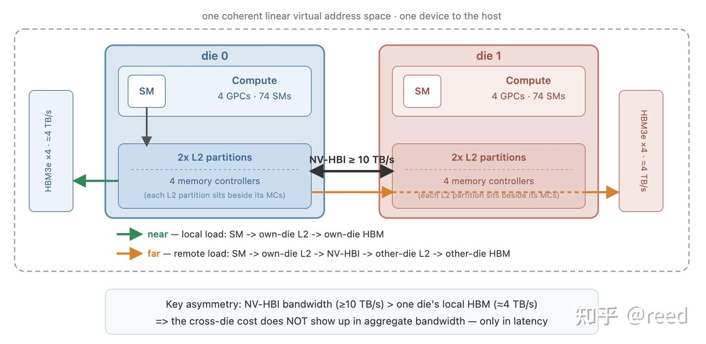
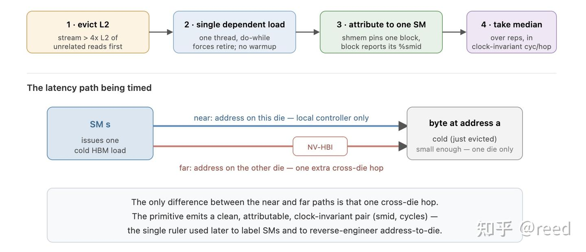
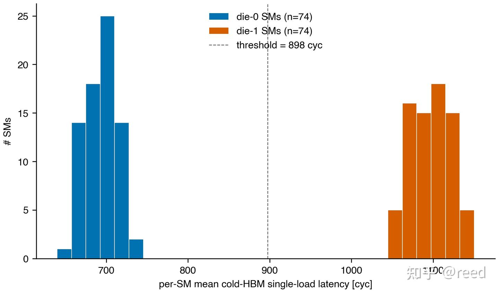
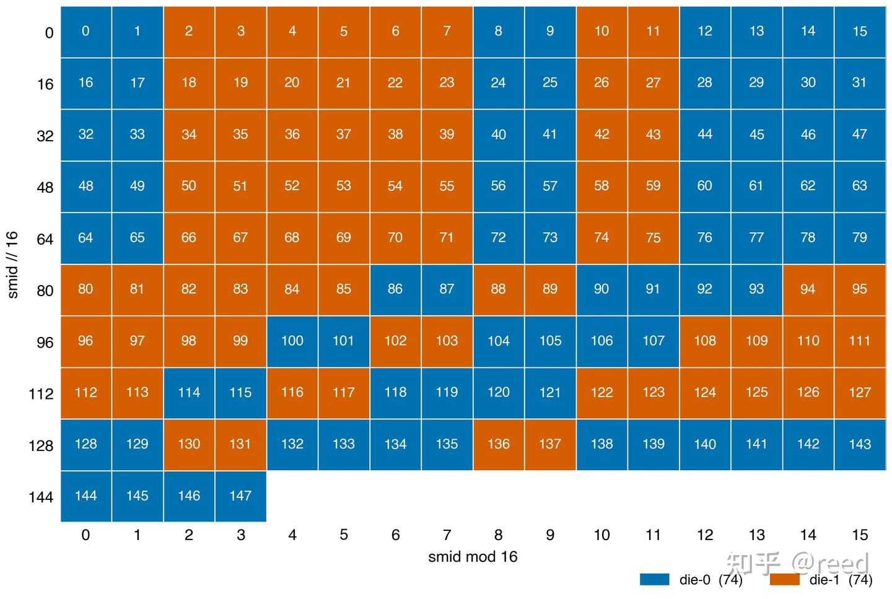
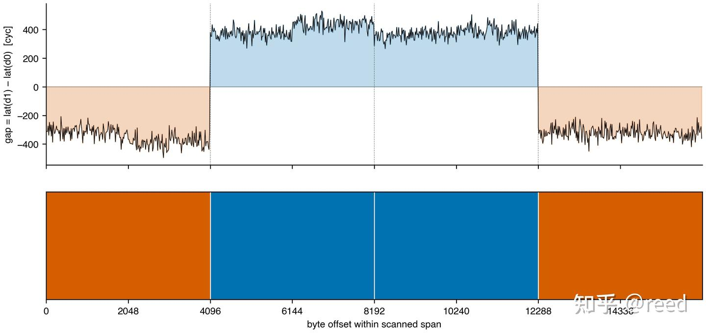
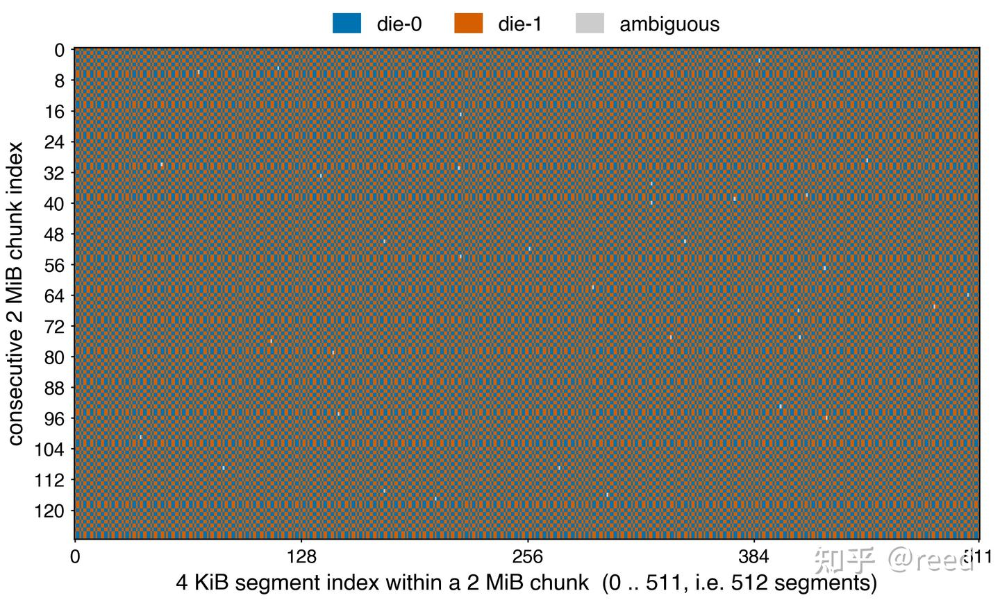
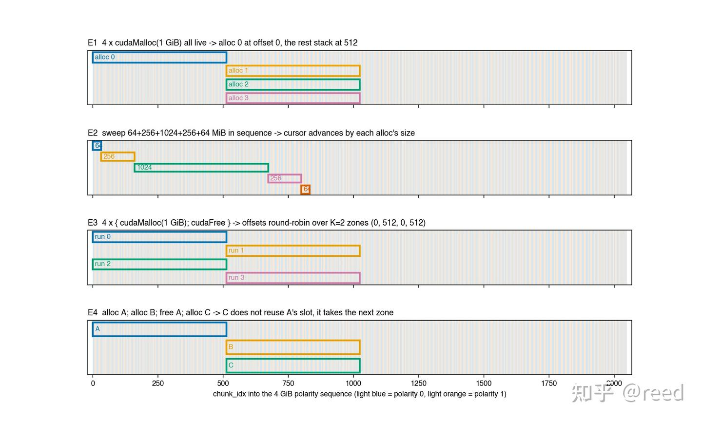
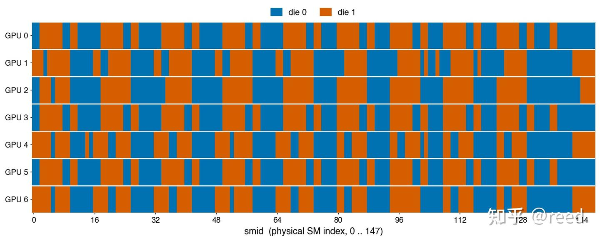
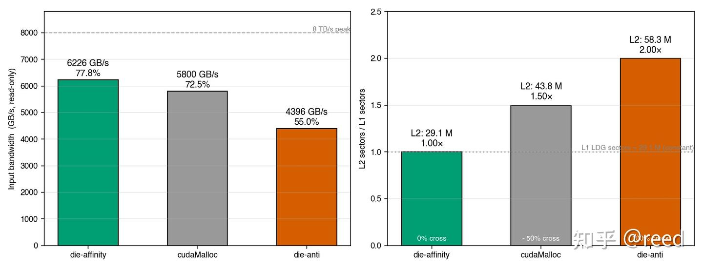

# Blackwell 듀얼 die 토폴로지 - SM과 주소의 die 매핑 및 die 간 메모리 접근 비용

> 원문: https://zhuanlan.zhihu.com/p/2051639750541546085

단일 die 면적에는 두 가지 강한 제약이 있습니다 — 노광기가 한 번에 노광할 수 있는 reticle limit(약 800 mm²)이 면적의 벽을 긋고, 수율은 면적에 대해 초선형으로 떨어져 큰 die의 비용을 가파르게 만듭니다. 큰 칩 하나를 더 작은 die 두 개로 쪼갠 뒤 고대역폭 interconnect로 이어 붙이는 것은 이 두 제약을 우회하는 표준적인 방법이며, 그 대가로 die 경계가 하나 생깁니다: 원래 칩 내부에서 균일하던 메모리 접근이 "로컬"과 "경계를 넘는" 두 종류로 나뉩니다.

Blackwell은 NVIDIA가 이 노선을 따라 여러 die를 하나의 논리적 GPU로 패키징한 첫 세대 데이터센터 아키텍처입니다. Blackwell GPU 하나의 내부에는 reticle 크기의 die 두 개가 들어 있고, NVIDIA의 die 간 고대역폭 interconnect인 NV-HBI(**NV**IDIA **H**igh-**B**andwidth **I**nterface)로 연결되어 호스트에는 단일 device, 단일 주소 공간, 단일 논리 L2로 보입니다. 이 패키지 내부 구조는 다중 소켓 CPU 서버의 NUMA(**N**on-**U**niform **M**emory **A**ccess)와 동형입니다: die 하나와 그에 로컬한 HBM이 하나의 socket에 대응하고, NV-HBI는 socket 간 UPI / Infinity Fabric에 대응합니다 — 어떤 SM이 자기 die의 HBM에 접근하는 것과 다른 die의 HBM에 접근하는 것의 비용이 같을 수는 없습니다.

이 글은 세 가지를 중심으로 전개됩니다: 각 SM(**S**treaming **M**ultiprocessor)이 어느 die에 속하는지 확정하기, 임의의 가상 주소 뒤에 있는 바이트를 어느 die가 보유하는지 확정하기, 그리고 이 둘이 어긋나 접근이 die 경계를 넘을 때 치르는 비용을 정량화하기입니다. 여기서 사용하는 수단은 전부 일반적인 CUDA 코드이며, 어떠한 특권 인터페이스나 하드웨어 문서 밖의 정보에도 의존하지 않습니다.

글의 순서는 다음과 같습니다. 먼저 듀얼 die 토폴로지와 그 하드웨어 특성을 소개합니다. 다음으로 단일 cold HBM 접근 latency를 측정하는 프리미티브를 제시하고, 이를 사용해 먼저 각 SM을 자신이 속한 die에 교정합니다. 이어서 반대로 교정이 끝난 SM을 자로 삼아 주소에서 die로 가는 3계층 결정론적 구조를 역으로 추론하는데, 이 구조는 가상 주소로부터 닫힌 형태로 풀 수 있습니다. 그다음 카드 간 일반화 가능성을 살펴봅니다. 마지막으로 SM과 주소라는 두 가지 die 귀속 정보를 바탕으로 친화(affinity) 접근과 반친화(anti-affinity) 접근을 구성하여 둘의 read-only bandwidth 차이를 측정하고 그 증폭 기제를 설명한 뒤, 실제 엔지니어링으로 가는 적용 범위와 한계를 논의하고 전체를 정리합니다.

## 1. Blackwell 듀얼 die의 토폴로지와 하드웨어 특성

Blackwell의 듀얼 die 토폴로지는 그림 1과 같습니다. 대칭인 두 die는 각각 4개의 GPC(**G**raphics **P**rocessing **C**luster), 약 74개의 SM, 2개의 L2 partition, 4개의 memory controller를 갖고, 각자 4개의 HBM3e(**H**igh **B**andwidth **M**emory) 스택에 연결되어 약 4 TB/s의 로컬 bandwidth를 제공합니다. 두 die 사이는 NV-HBI로 연결되며 집계 bandwidth는 10 TB/s 이상이고, 칩 전체의 peak bandwidth는 약 8 TB/s입니다(HGX 모델 7.7TB/s, NVL72 모델 8TB/s). 이 글의 측정은 B200에서 수행했으며, 그 사양은 총 148개 SM, 8개 GPC, 4개 L2 partition(Hopper의 두 배), 8개 HBM3e 스택입니다.



강조할 만한 것은 L2의 위치입니다: 4개의 L2 partition은 한곳에 모여 있지 않고 각 die가 두 개씩 차지하며, 해당 die의 memory controller와 같은 쪽에 있습니다 — 즉 **L2는 die 단위로 쪼개져 있습니다**. 한 die 위의 접근이 다른 die가 캐시하고 있거나 소유하고 있는 데이터를 필요로 할 때는, 데이터를 가져오는 것 자체든 양쪽 L2의 일관성을 유지하는 것이든 관련 트래픽이 모두 NV-HBI를 거쳐야 합니다. 따라서 NV-HBI가 나르는 것은 원격 HBM의 읽기·쓰기만이 아니라 die 간 캐시 일관성 통신까지 포함하며, 이것이 이 패키지 내부 NUMA의 유일한 도메인 간 통로입니다.

이 토폴로지에는 직관에 어긋나는 bandwidth 관계가 하나 있습니다: NV-HBI의 집계 bandwidth(≥ 10 TB/s)가 단일 die의 로컬 HBM bandwidth(≈ 4 TB/s)보다 높다는 점이며, **이 때문에 Blackwell에서는 bandwidth가 편리한 관측량이 되지 못합니다**. CPU NUMA에서는 socket을 넘는 접근이 latency도 늘리고 bandwidth도 떨어뜨리므로, 데이터를 원격 socket에 묶어 두고 bandwidth 테스트를 돌리면 원격임이 바로 드러납니다. 그런데 Blackwell에서는 NV-HBI가 단일 die의 로컬 bandwidth보다도 넓기 때문에, 메모리 접근이 대체로 두 die에 고르게 분산되기만 하면 두 memory controller 그룹이 각각 절반씩 일을 할 뿐이고 "die를 넘었다"는 이유로 집계 bandwidth가 뚜렷이 떨어지지는 않습니다. bandwidth로 die 경계를 드러내려면 매 접근이 어느 die에 떨어지는지를 인위적으로 제어해야 하는데, CUDA는 die 단위로 메모리를 요청하는 인터페이스를 제공하지 않습니다 — 이 장애물은 다음 절에서야 다루기 시작합니다. 이에 비해 단일 접근의 latency에는 로컬과 원격 사이에 측정 가능한 차이, 즉 die를 넘을 때 추가되는 그 한 hop이 존재합니다 — **따라서 이 글은 bandwidth가 아니라 latency를 주 신호로 삼으며**, 이것이 전체 방법론의 출발점입니다.

덧붙이자면, NVIDIA는 듀얼 die의 세부 사항을 드라이버 안에 봉인해 두고 프로그래머에게는 "하나의 논리적 GPU"라는 추상만 노출하며, SM에서 die로 또는 주소에서 die로의 조회 인터페이스를 제공하지 않습니다. 이 글의 모든 die 귀속 정보는 사용자 공간 microbenchmark로 역추론한 것입니다.

## 2. 측정 프리미티브: 깨끗한 단일 cold HBM 접근 latency

관측 가능한 신호가 latency인 이상, 방법론 전체는 하나의 프리미티브 위에 세워집니다: 지정한 SM에서 발행되어 지정한 주소로 향하는 **단일 cold HBM 접근 latency**를 정확히 측정하는 것입니다. 이 프리미티브 자체가 이후 모든 결론의 측정 도구이며, 그림 2와 같습니다. 이것이 진짜로 "정확히 측정"되게 하려면 다음 세 가지가 동시에 해결되어야 합니다.

1.  **cold 접근.** 측정 대상은 캐시 히트가 아니라 진짜 cold HBM 접근이어야 합니다. 매 계측 직전에 L2 용량을 크게 넘는 무관한 데이터를 스트리밍으로 훑어 캐시를 축출하고, 계측 kernel은 접근을 단 한 번만 수행하며 워밍업을 하지 않게 하여 첫 hop이 cold 접근이 되도록 보장합니다.
2.  **프리페치나 접근 중첩에 가려지지 않기.** 단일 thread가 의존적 접근을 직렬로 수행하게 합니다 — 매 단계의 주소가 이전 단계의 반환값에 의존하므로, 측정된 cycle이 곧 실제 load-to-use latency입니다.
3.  **특정 물리 SM으로의 귀속.** 단일 SM 용량의 절반을 넘는 dynamic shared memory를 요청하여 한 SM에 thread block이 하나만 상주하도록 보장하고, 그 block이 자신의 `%smid`를 읽어 보고하게 하면 latency가 그 SM에 귀속됩니다.

네 번째는 단위의 안정성입니다: GPU 주파수는 DVFS(**D**ynamic **V**oltage and **F**requency **S**caling)에 따라 변동하므로, 주 측정값으로는 항상 주파수에 불변인 cycles/hop을 쓰고, 각 측정 구간 전후로 실제 clock을 한 번씩 측정해 의심스러운 샘플을 걸러냅니다.

계측의 핵심부는 다음과 같이 요약할 수 있습니다.

```cpp
int v = 0;
int64_t t0 = clock64();
do {
  v = ldg_cv(input);
} while (v < 0);          // load가 완료(retire)된 뒤에야 루프를 빠져나가도록 강제
int64_t t1 = clock64();
output[0] = v;            // sink 쓰기, 컴파일러가 계측을 제거하지 못하게 함
```

여기서 `do-while`과 sink 쓰기가 핵심입니다. 이것들이 없으면 `ptxas`는 두 번째 `clock64`를 LDG 발행 직후에 바로 실행되도록 배치하는데, LDG는 비동기적으로 retire되므로 계측은 LDG가 *발행(issue)* 된 시점만 포착하고 데이터가 실제로 *반환(retire)* 된 시점은 잡지 못합니다. 이 둘을 더해야 `t1 - t0`가 cycle 수준의 cold HBM latency를 깨끗하게 보고합니다.



## 3. SM에서 die로: 깔끔한 74/74 분할

역추론의 출발점은 충분히 작은 주소 하나입니다. 16 B짜리 접근 하나라면 그 뒤에 있는 바이트는 반드시 어느 한 die에 온전히 떨어지고 die 경계를 걸치지 않습니다. 이런 주소 하나를 고정해 두고 148개 SM 전부가 각각 한 번씩 접근하게 하면, 각 SM에서 측정되는 cold latency는 그 SM이 이 주소와 같은 die에 있는지 여부에만 의존합니다 — 같은 die의 SM은 로컬 경로를 타고, die를 넘는 SM은 NV-HBI를 한 번 더 지나야 합니다.

148개의 latency를 히스토그램으로 그리면 그림 3과 같은 결과가 나옵니다: **겹치지 않는 두 개의 band가 나타나며, die를 넘는 쪽이 같은 die인 쪽보다 약 +400 cyc(약 +220 ns) 더 크고, 각 band에 74개씩의 SM이 들어갑니다**. 빠른 쪽은 "SM이 그 주소와 같은 die에 있는" 경우이고, 느린 쪽은 "SM이 NV-HBI를 넘어야 데이터를 가져올 수 있는" 경우입니다. 겹침이 0이라는 것은 **이 특정 주소**에 대해서는 die 귀속이 확정적이며 이진 판정이 가능하다는 뜻입니다.



주소 하나가 한 번의 두 그룹 분할을 주었다고 해서 이 이분법이 SM의 고유 속성이라고 단정하기에는 아직 부족합니다 — 그 주소에서만 우연히 그랬을 가능성이 있습니다. 그래서 서로 독립적이고 서로 다른 die에 떨어지는 주소들을 새로 골라 각각 같은 탐침을 반복했습니다. 모든 주소가 똑같이 선명한 두 band를 보여 주었고, 같은 SM은 모든 주소에서 언제나 그에 대응하는 같은 그룹에 떨어졌습니다(자기 die의 주소에는 빠르고 다른 die의 주소에는 느리며, 결코 흔들리지 않았습니다). 이는 탐침으로 드러난 이분법이 특정 주소에 딸린 것이 아니라 SM 자체의 안정적인 속성, 즉 그 SM이 속한 die임을 뜻합니다. 따라서 이 SM-to-die 라벨 표는 확정적이며 재사용 가능합니다 — 새로운 주소 하나에 대해서도 단일 SM cold load 탐침을 한 번만 수행하면 그 주소가 어느 die에 있는지 읽어낼 수 있고, 나아가 모든 SM이 자신의 die 라벨을 얻게 됩니다.

SM-to-die 번호를 물리 `smid` 순으로 배열하면 그림 4의 매핑을 얻습니다. 이 매핑은 확정적이고 주기적이며 아키텍처에 의해 고정되어 있습니다: 앞쪽 몇 개의 `smid` 구간에서는 16개 SM이 한 행을 이루고 행마다 패턴이 일치하며, 중간 경계를 넘어가면 패턴이 규칙적으로 회전합니다. 이 매핑은 한 번에 추출해 둘 수 있고, 상수 표 하나의 형태로 이후 kernel이 진입부에서 곧바로 조회해 쓸 수 있습니다.



## 4. 주소에서 die로: 3계층 결정론적 구조

SM-to-die 라벨 표가 생기면 자와 측정 대상이 서로 뒤바뀝니다: 이제는 반대로 **die를 이미 아는** SM으로 메모리를 탐침합니다 — 어떤 주소에 대한 latency가 어느 band에 떨어지는지가 곧 그 주소가 어느 die에 있는지를 바로 읽어 줍니다. 이 자를 연속된 주소를 따라 미끄러뜨리면 메모리의 die 귀속이 주소에 따라 어떻게 변하는지 윤곽을 그릴 수 있습니다. 결과는 무질서하지 않고 **3계층의 완전히 확정적인** 구조이며, 주소와 per-allocation 상수 하나로부터 닫힌 형태로 풀 수 있습니다: 가장 아래 계층은 die 할당의 원자적 granularity이고, 중간 계층은 2 MiB 블록 안에서 주소 bit의 패리티로 결정되는 무늬이며, 가장 위 계층은 블록의 극성이 할당에 따라 어떻게 배열되는가입니다. 아래에서는 이 세 granularity를 G0, G1, G2(G는 granularity)로 표기하고 아래에서 위로 한 계층씩 풀어 보겠습니다.

**G0: 4 KiB가 die 할당의 원자 단위입니다.** die를 아는 SM으로 16 B 간격으로 주소 구간을 세밀하게 스캔하면(그림 5) die 라벨의 경계가 정확히 4 KiB 지점에 떨어지며, 그것도 단 한 스텝 만에 뒤집힙니다 — 오프셋 4095와 4096 사이에서 latency 차가 +400 cyc에서 −400 cyc로 곧바로 건너뛰며 전이 구간이 없습니다. 각 4 KiB 구간은 통째로 같은 die에 속하고, 4 KiB 경계를 넘으면 곧 die가 바뀝니다.



**G1: 2 MiB polarity tile, 8개 주소 bit의 패리티로 결정됩니다.** 스케일을 256 MiB로 키우고 4 KiB마다 샘플 하나를 취하면 그림 6을 얻습니다: 가로축은 그 샘플이 2 MiB 블록 안에서 차지하는 위치(512개의 4 KiB 구간)이고, 세로축은 연속된 128개의 2 MiB 블록입니다. 그림에서 두 가지를 동시에 볼 수 있습니다 — **4 KiB 구간의 die 무늬가 실제로 2 MiB를 주기로 반복된다는 것**(각 행 내부가 동일한 형태의 촘촘한 교차 무늬를 보입니다), 그리고 **인접한 행 사이에서는 서로 보완적인 두 가지 무늬만 번갈아 나타난다는 것**입니다. 이런 2 MiB 블록 하나를 **chunk**라고 부르겠습니다. 각 chunk 안에는 정확히 256개 구간이 die-0에, 256개가 die-1에 속하며, 그 귀속은 확정적인 8 bit hash를 따릅니다.

```text
mask 0x1EF000 = bits {12,13,14,15, 17,18,19,20}  (bit 16은 건너뜀)
die_intra(addr) = popcount(addr & 0x1EF000) & 1
```

128개 chunk, 65 376개의 깨끗한 샘플에서 검증했으며 **일치율 100%** 입니다. 한 chunk 안 512개 구간의 번호를 따라가 보면 die 라벨은 곧 그 번호의 해당 8 bit에 대한 popcount 패리티 — Thue-Morse와 유사한 교대 수열입니다. 주소 bit의 패리티로 이런 세밀한 인터리빙을 하는 효과는(그리고 이런 부류의 인터리빙 hash가 통상 쓰이는 용도는) 규칙적인 stride의 접근을 가능한 한 두 die에 고르게 분산시키는 것입니다: 고정된 접근 stride가 die 분할과 공진하여 접근을 체계적으로 한쪽 die에 몰아넣는 일이 없게 하고, 그 결과 특정 pattern 때문에 두 die 사이에 부하가 심하게 기우는 것을 피합니다. 같은 "흩뿌리기" 발상은 더 큰 스케일에서 G2로 이어집니다: G1은 chunk 안에서 4 KiB 구간을 흩뿌리고 G2는 chunk 사이에서 polarity를 흩뿌려, 두 계층이 겹치면 어떤 stride의 접근도 한쪽 die로 계속 치우치기 어렵게 됩니다. 이 비대칭적인 mask — 연속된 4 bit, bit 16 건너뛰기, 다시 연속된 4 bit — 에는 뚜렷한 결과가 하나 있습니다: 64 KiB 떨어진 두 주소는 **같은 die**에 있고(popcount가 변하지 않음), 128 KiB는 떨어져야 die가 뒤집힙니다(bit 17이 반전). bit 16을 건너뛴다는 것 자체는 아직 완전히 설명되지 않은 현상이며, 기껏해야 "어떤 HBM / FBPA 스트라이프 hash가 64 KiB에서 상쇄되는 것으로 보인다" 정도로만 말할 수 있습니다. 각 chunk는 내부 배치가 두 가지뿐이고 둘은 정확히 서로 비트 반전 관계입니다 — 각 chunk가 어느 쪽인지는 1-bit **polarity**(극성)로 기록합니다: polarity = 0은 chunk 안의 seg 0이 die-0에 있고 블록 전체가 base 무늬를 따른다는 뜻이며, polarity = 1은 그 반전 사본입니다. 블록 전체의 die 무늬는 곧 `die_intra(addr) ^ tile_polarity`입니다.



**G2: chunk의 polarity는 고정된 수열에서 가져오며, 할당은 어디서부터 진입하는지만 결정합니다.** G0와 G1이 이미 chunk 내부의 die 무늬를 `popcount(addr & 0x1EF000) & 1`로 확정했으므로 남은 것은 각 chunk의 polarity 한 비트뿐입니다. 큰 구간을 `cudaMalloc`으로 할당해 chunk마다 polarity를 탐침해 보면, 이 비트는 할당할 때마다 새로 던지는 동전이 아니라 **이미 정해져 있는 고정된 수열**임을 알 수 있습니다(이하 canonical 수열이라 부릅니다. 뒤에서 보겠지만 판정식에서는 4096 bit짜리 `chunk_polarity[]` 표에 8 GiB 역위상 확장을 더한 것입니다): `cudaMalloc(4 GiB)`로 얻은 2048 bit polarity는 `cuMemCreate(2 MiB)`로 2048개 블록을 차례로 요청해 얻은 2048 bit와 비트 단위로 일치합니다. 이는 polarity가 특정 할당에 속한 것이 아니라 **물리 chunk 풀 자체의 속성**임을 뜻합니다 — 풀 안 각 물리 블록의 polarity는 고정되어 있고, 할당은 풀에서 순서대로 블록을 가져갈 뿐이므로 필연적으로 풀의 polarity 배열을 그대로 복제합니다. **"순서대로"라는 점이 핵심입니다**: 같은 VA 구간이라도 두 번의 할당에서 같은 물리 chunk를 받는다는 보장이 없으므로 polarity 수열도 같지 않을 수 있습니다(구체적인 규칙은 그림 7 참고).

남은 유일한 자유도는 한 번의 할당이 이 수열의 어디서부터 진입하는가입니다. 이는 그 할당이 풀에서 **몇 번째 블록부터 가져가는지**로만 결정되며, 이 시작점이 곧 전역 cursor입니다. 그림 7은 몇 가지 할당 패턴으로 이 모델을 검증합니다: 순차 할당에서는 cursor가 매번 할당 크기만큼 전진하고(E1, E2), `cudaFree`는 가져갔던 블록을 풀에 되돌려 놓아 다음번 같은 크기의 할당이 방금 비워진 자리를 우선 재사용하므로, alloc/free를 반복하면 소수의 시작점 사이를 돌게 됩니다 — ≥ 1 GiB 할당에 대해서는 두 개의 zone이 교대하는 것으로 실측되었습니다(E3, E4). 바꿔 말하면, 한 할당의 시작 offset만 얻으면 그 구간 전체의 polarity를 canonical 수열에서 그대로 조회할 수 있습니다.



세 계층을 합치면 임의의 주소에 대해 성립하는 닫힌 형태의 판정식이 됩니다. 먼저 몇 가지 표기를 정합니다: 메모리를 2 MiB 단위로 연속하게 자르고, `k`번째 2 MiB 블록의 위치를 `chunk_idx = k`로 적습니다(즉 할당 base 주소에서부터 센 2 MiB 오프셋 번호이며, 주소 `addr`에 대해서는 `((addr - alloc_base) >> 21) + O`입니다. 여기서 `O`는 그 할당이 수열에 진입하는 시작점입니다). 판정식은 다음과 같습니다.

```text
die(addr) = popcount(addr & 0x1EF000) & 1       // G0+G1: 8비트 주소 패리티
          ^ chunk_polarity[chunk_idx mod 4096]  // G2: 512바이트 상수
          ^ (chunk_idx >> 12) & 1               // G2: 8 GiB 역위상
```

세 항은 각각 출처가 다릅니다.

첫 번째 항은 G0와 G1이 8개 주소 bit 위에서 갖는 닫힌 형태의 산술이며, 임의의 VA에 대해 즉시 계산할 수 있습니다.

두 번째 항 `chunk_polarity[]`는 이 polarity 수열의 핵심입니다. 이것은 **4096 bit(= 512 바이트)밖에 되지 않는 상수 표**로, 각 비트가 2 MiB chunk 하나의 극성을 기술하며 연속된 8 GiB(= 4096개 chunk)를 덮습니다. G1의 `tile_polarity`는 c번째 chunk가 여기서 조회되는 그 비트를 8 GiB 역위상과 XOR한 것이며, `chunk_polarity[c mod 4096] ^ ((c >> 12) & 1)`과 같습니다. 이 표에는 더 짧은 닫힌 형태의 기술이 없습니다 — 4096 bit의 구체적인 내용은 측정으로 얻어야 합니다. 그러나 **더 큰 스케일의 구조는 전부 이 4096 bit에서 유도됩니다**: 100 GiB 실측 결과 `pol[c] == chunk_polarity[c mod 4096] ^ ((c >> 12) & 1)`이 51200개 chunk 중 51182개에서 일치했고(나머지 18 bit는 탐침 노이즈), 즉 100 GiB 구간 전체가 이 공식을 엄격히 따릅니다.

세 번째 항이 바로 위 공식의 `(chunk_idx >> 12) & 1`입니다: 8 GiB 경계를 하나 넘을 때마다 chunk_polarity 표 전체가 "한 번 뒤집힙니다" — 앞 8 GiB는 base, 뒤 8 GiB는 `~base`, 그다음 8 GiB는 다시 base로, 이렇게 정/역이 번갈아 가며 메모리 공간 전체를 채웁니다. 그래서 4096 bit짜리 base 표에 패리티 한 비트만 더하면 B200의 192 GiB 메모리 전체에 있는 모든 chunk의 극성을 기술하기에 충분합니다.

이 4096 bit 상수는 **per-arch**입니다: 카드 간 측정에서 8191⁄8192가 일치했으며(남은 1 bit는 탐침 노이즈) per-card가 아닙니다. 본 저장소의 `polarity_scan` 도구로 한 번 스캔해 두면 코드 내 상수로 영구히 사용할 수 있습니다. 반면 각 할당이 수열에 진입하는 시작점 `O`는 per-allocation입니다: 할당 진입부에서 buffer의 앞쪽 ~32개 chunk에 대해 단일 SM 탐침을 한 번씩 수행하고 상수 표와 최적 매칭하면 정해지며, 전 과정이 1초도 걸리지 않습니다.

여기까지 오면 주소에서 die로의 매핑이 완전히 확정됩니다: 먼저 8비트 mask의 popcount를 구하고, 다음으로 512 바이트 표에서 한 비트를 조회하고, 마지막으로 8 GiB 패리티 비트와 XOR합니다. 이 세 단계 연산의 결과가 곧 그 주소가 속한 die입니다.

이로써 SM에서 die로, 주소에서 die로 가는 두 매핑이 모두 세워졌습니다. 다음 절에서는 먼저 이들의 카드 간 일반화 가능성을 검증하고, 6절에서 이들을 사용해 실측을 수행합니다.

## 5. 카드 간: 구조는 보편적이고 번호는 카드마다 다름

이 구조를 카드 간에 재사용할 수 있는지 여부는 매핑 도출 비용을 한 번에 상각할 수 있는지와 직결됩니다. 같은 카드에서 측정을 반복하면 매번 완전히 동일한 SM-to-die 매핑을 얻으며, 고정된 device에 대해서는 결정론적입니다. 여러 장의 B200에서 동일한 smid_map 탐침을 각각 돌려 보면 다음을 알 수 있습니다: **듀얼 die의 구조 자체는 보편적입니다** — 모든 카드가 엄밀한 74⁄74 분할과 동일한 오더의 die 간 latency 차이를 보입니다. 그러나 구체적인 `smid`에서 die로의 번호 부여는 **카드마다 다르며**, 그림 8과 같이 그 차이는 아주 작을 수도 있고 대다수 SM에 걸칠 수도 있습니다.



이는 직관적으로도 납득할 만합니다: 듀얼 die 분할은 실리콘 수준의 하드웨어 상수인 반면, `smid`는 런타임에 물리 SM을 노출하는 논리 번호에 불과하며, 제조나 펌웨어 단계에서 수율과 binning(예컨대 고장 난 개별 SM의 차단)을 위해 정해졌을 가능성이 높고 NVIDIA는 이를 문서화하지 않았습니다. 그 엔지니어링적 귀결은 분명합니다: **SM-to-die 매핑은 카드 간에 동일하다고 가정해서는 안 되며 device마다 각자 도출해야 합니다** — 설령 두 카드가 우연히 일치하더라도 그것을 근거로 일반화해서는 안 됩니다. 다행히 같은 카드 안에서는 한 번 도출하면 안정적이므로, 멀티 GPU 작업에서는 각 프로세스가 자신의 로컬 매핑을 각각 도출하면 됩니다.

## 6. die 친화 배치와 read-only bandwidth

앞의 두 가지 die 귀속 정보 — SM이 어느 die에 있는지, 어떤 주소 구간이 어느 die에 있는지 — 를 합쳐서 최적화에 쓰는 가장 직접적인 형태는 각 thread block이 자기가 있는 die 위의 데이터만 접근하게 하는 것입니다.

이를 깔끔하게 검증하려면 die 귀속이 알려져 있고, 가급적이면 어디서나 일관된 메모리 구간이 필요합니다. 4절의 닫힌 형태 판정식을 쓰면 이를 바로 구성할 수 있습니다: VMM(**V**irtual **M**emory **M**anagement) 인터페이스로 2 MiB 물리 블록을 하나씩 요청해 그 polarity를 탐침하고, polarity = 0인 블록만 남겨 하나의 global 메모리 구간으로 이어 붙입니다. 이렇게 하면 구간 전체의 polarity가 항상 0이 되어 닫힌 형태 판정식이 `die(addr) = popcount(addr & 0x1EF000) & 1`로 축약됩니다 — 표를 조회하지 않고도 임의의 주소가 어느 die에 있는지 계산할 수 있고, 각 4 KiB 구간의 die 귀속이 메모리 구간 전체에서 동일한 규칙으로 배열됩니다.

이 메모리 위에서 read-only 집계 kernel을 돌립니다: 각 thread가 자신에게 배정된 4 KiB 구간들을 스트리밍으로 훑어 읽은 바이트를 레지스터에 누적하며, working set이 L2를 크게 넘고 write-back이 없으므로 bandwidth가 포화되고 GB/s가 곧바로 read bandwidth를 반영합니다. kernel은 `<<<148, 1024>>>`로 구성합니다(200 KiB dynamic shared memory로 SM을 채워 SM당 block이 1개만 상주하도록 강제하고, 그 결과 148개 block이 148개 SM을 채웁니다). 우리는 "어느 block이 어느 구간을 읽는가"라는 대응 표 하나만 바꾸어 세 가지 구성을 만듭니다.

```text
die-affinity: 각 SM이 자기 die의 구간만 읽음(3절의 SM-to-die 표 + 닫힌 형태 판정식으로 짝지음)
cudaMalloc:   메모리를 기본 cudaMalloc으로 교체(polarity가 더 이상 항상 0이 아님), block은 여전히
              자기 몫의 구간을 읽으므로 약 절반의 구간이 무작위로 die를 넘게 됨
die-anti:     각 SM이 반대편 die의 구간만 읽음, 모든 LDG가 NV-HBI를 넘음
```

세 구성은 같은 kernel 바이너리를 공유하며 grid, block, 레지스터 수, 명령어 수, 전송 바이트 수가 모두 동일하고, 유일한 변수는 각 LDG가 실제로 자기 die에 떨어지는지 반대편 die에 떨어지는지입니다. 결과는 그림 9와 아래 표와 같습니다.

| 매핑 | 입력 bandwidth | 8 TB/s peak 대비(\*실제 7.7TB/s) |
|--------------|-----------|-------------------------------|
| die-affinity | 6226 GB/s | 77.8% |
| cudaMalloc | 5800 GB/s | 72.5% |
| die-anti | 4396 GB/s | 55.0% |

**affinity 대 anti = +42% bandwidth**이며, cudaMalloc은 깔끔하게 중간에 떨어집니다. 이는 무작위 극성이 구간 수준에서 같은 die 접근과 die를 넘는 접근을 뒤섞을 때 예상되는 바로 그 위치입니다. 이 이득은 전적으로 계산과 데이터를 같은 die에 두는 데서 나오며, 비용은 kernel 진입부에서 SM-to-die 표를 한 번 조회하는 것뿐입니다.

이 차이는 단일 접근이 빨라져서 생긴 것이 아닙니다. 1절에서 이미 지적했듯이 메모리 접근이 두 die에 고르게 분산되면 집계 bandwidth에서는 die 경계가 보이지 않습니다. affinity와 anti의 차이가 나타나는 것은 둘이 지나가는 경로가 다르기 때문입니다. **두 구성은 HBM 컨트롤러 쪽 부하가 대등합니다** — affinity는 각 die의 SM이 자기 die의 구간을 읽게 하고 anti는 각 die의 SM이 전부 반대편 die의 구간을 읽게 하지만, 양쪽 HBM 컨트롤러 그룹은 각각 전체 트래픽의 절반씩을 담당합니다. 차이는 중간의 이 한 hop에만 있습니다: anti 구성에서는 모든 LDG가 NV-HBI를 거쳐야 하고, 요청 측 die와 소유 측 die 두 곳의 L2에서 각각 한 번씩 sector 조회를 합니다(아래 ncu 문단의 1.5×/2× 증폭이 바로 이 경로의 직접적인 지문입니다).

포화 throughput을 결정하는 것은 단일 latency가 아니라 각 자원에서의 큐잉입니다. Little의 법칙에 따라 throughput ≈ in-flight 요청 수 ÷ 유효 서비스 시간입니다. anti 구성에서는 요청 하나당 유효 서비스 시간이 die를 넘는 추가 hop과 여분의 L2 조회 때문에 늘어나고, NV-HBI의 집계 bandwidth(공칭 ≥ 10 TB/s)는 단일 die의 로컬 bandwidth를 넘기는 하지만 양방향 트래픽에 동시에 점유됩니다. 이 둘이 겹쳐서, 무부하 상태에서는 눈에 잘 띄지 않던 단일 latency 차이가 포화 상태에서는 상당한 bandwidth 차이로 증폭됩니다. die를 넘는 페널티의 본질은 단일 접근이 얼마나 느려지는가가 아니라 같은 요청 하나가 경로상의 자원을 두 번 점유한다는 데 있습니다. 어느 단계(NV-HBI 링크, 양쪽 L2 partition, 아니면 더 하류)가 먼저 병목이 되는지는 이 글에서 남김없이 비교하지는 않았습니다. bandwidth 이득은 latency 탐침이 제공한 die 매핑을 이 점유를 회피하는 데 사용한 결과입니다.



ncu의 지표는 NV-HBI의 역할을 한층 더 확인해 줍니다. 세 구성에서 SM 쪽 지표(명령어 수, warp 점유율, scoreboard 압력)는 완전히 동일하고 DRAM의 실제 읽기 바이트도 같습니다. die를 넘는 비율에 따라 변하는 유일한 값은 **L2 sector 증폭**입니다: L1은 어느 구성에서나 동일한 수의 sector 읽기를 발행하지만, L2가 서비스하는 sector 수는 정확히 **1× / 1.5× / 2×** 입니다.

```text
L2 sectors / L1 sectors = 1 + cross_die_fraction
  affinity ( 0% cross-die): 1.00×
  cudaMalloc (~50%)       : 1.50×
  anti (100%)             : 2.00×
```

가장 자연스러운 해석은 이렇습니다: die 경계를 넘는 LDG는 **두 die 각각의 L2 partition**에서 한 번씩 sector 조회를 해야 한다는 것입니다 — 요청 측 die의 L2(미스, 전달)와 소유 측 die의 L2(미스, HBM으로 내려감)입니다. 이는 **SM에서 메모리까지의 경로를 "SM이 붙어 있는 것은 자기 die의 L2다"라고 규정합니다**. "이 line은 내 것이 아니니 밖으로 전달한다"를 판정하는 단위가 바로 L2입니다. 달리 말하면 die를 넘는 접근 한 번은 "SM → 자기 die의 L2 → NV-HBI → 원격 die의 L2 → HBM"이라는 사슬을 끝까지 따라가야 합니다 — NV-HBI는 옆에 달려 있는 버스가 아니라 두 die의 L2를 하나의 분산 캐시로 꿰매는 링크입니다. 한 가지 덧붙이면, 이 절에서는 "각 SM에 block이 정확히 하나 대응하고 자기 die의 몫을 읽는다"는 것이 깨끗하게 성립하도록, 그리고 모든 차이를 die 경계 자체에 귀속시키기 위해 148 × 1024 + 200 KiB dynamic shared memory라는 "SM당 block 1개만 상주" 형태를 선택했습니다. 이것은 bandwidth 최적 구성이 아니며, occupancy를 높이거나 TMA를 사용하면 절대 bandwidth를 더 끌어올릴 수 있습니다. 그러나 이 절의 설명 기제(NV-HBI 경로상의 두 L2 partition 점유, L2 sector 1× / 1.5× / 2× 증폭)는 그런 형태들에도 똑같이 성립합니다.

## 7. 엔지니어링 적용 가능성과 한계

배치 자체는 스케줄러에 의존하지 않습니다: 각 block이 진입부에서 자신의 `%smid`를 읽어 소속 die를 조회하고 그에 대응하는 die의 데이터 영역을 고르므로, 스케줄 순서를 예측할 수 없어도 문제가 되지 않습니다. 세밀한 block별 친화를 하지 않고 데이터를 두 die에 균등하게 나눠 번갈아 쓰기만 해도, **모든 접근이 한쪽 die로 기우는 퇴화된 경우**보다는 이미 뚜렷하게 낫습니다(이런 상황은 누가 일부러 만들 필요도 없습니다 — die 토폴로지를 모르는 allocator에 polarity와 마침 공진하는 접근 stride가 겹치면 그것으로 충분합니다). 균등 분배는 두 die의 HBM이 동시에 힘을 쓰게 하지만, 치우침은 단일 die의 bandwidth에 묶입니다. 세밀한 친화는 그 위에서 peak에 더 가까이 다가가는 작업입니다.

실제 엔지니어링에 적용하려면 해결해야 할 지점이 두 군데 있습니다. 첫째는 할당 측입니다: 앞에서 측정한 것은 `cudaMalloc` / `cuMemCreate`인데, 실제 업무 코드는 보통 프레임워크의 메모리 풀(예: PyTorch caching allocator), `cudaMallocAsync`, 또는 unified memory를 통해 디바이스 메모리를 받습니다 — 이런 인터페이스에서도 polarity 수열과 cursor가 동일하게 확정적인지는 이 글에서 따로 검증하지 않았습니다. 실행 가능한 절충안은 die 인식을 allocator로 내리는 것입니다 — 하위에서 die별로 메모리 풀을 두 개 유지하고 상위에는 여전히 일반적인 인터페이스를 노출한 뒤, 할당 시 호출자가 속한 die에 따라 풀을 고르는 방식입니다. 둘째는 주소 측입니다: 주소에서 die로는 닫힌 형태로 풀 수 있지만, 그래도 어떤 데이터 구간이 어느 die에 있는지를 먼저 확정해야 합니다 — allocator가 할당 시점에 기록해 두거나, canonical 수열과 오프셋 탐침으로 추산하거나, 6절처럼 VMM으로 polarity가 항상 0인 메모리를 이어 붙이는 방법이 있습니다. 어떻게 하면 최소 비용으로 주소의 귀속을 얻을 수 있는가가 범용화로 가는 핵심 고리입니다.

이 글이 **다루지 않았고** 해결되었다고 간주해서는 안 되는 지점이 몇 군데 있습니다: 1 GiB 미만 할당에서의 zone 개수 K, 메모리 압박 상황과 다중 프로세스에서의 동작, 그리고 7절에서 언급한 `cudaMalloc` 이외의 할당 경로(PyTorch caching allocator, `cudaMallocAsync`, unified memory)에서도 polarity / cursor가 동일하게 확정적인지 여부입니다. 마지막으로, 이 방법론 전체가 성립하는 전제는 하드웨어가 실제로 충분히 굵은 granularity로 메모리를 die 단위로 나눈다는 것입니다. 앞으로 어떤 세대가 더 미세한 granularity로 인터리빙하여 die를 넘는 페널티가 분해 가능한 임계값 아래로 내려간다면 die 인식 배치는 더 이상 의미가 없어지며, 대신 집계 bandwidth를 최적화 목표로 삼아야 합니다 — 이 글의 측정 절차 자체가 그런 상황도 식별할 수 있습니다.

## 정리

이 글은 "Blackwell에서 die를 넘는 접근의 비용이 정확히 무엇인가"라는 직접 관측하기 어려운 문제를 측정 가능하고 반증 가능한 하나의 사슬로 구성했습니다.

- 단일 cold HBM 접근 latency를 정확히 재는 프리미티브를 측정 도구로 삼아, 먼저 반드시 하나의 die에 떨어지는 작은 주소를 고정하고 148개 SM이 각각 한 번씩 탐침하게 하여 각 SM을 소속 die에 교정했습니다. 그다음 반대로 die를 아는 SM을 자로 삼아 주소를 스캔하여 메모리의 die 귀속을 역추론했습니다 — 이 부트스트랩 사슬이 방법론 전체의 골격입니다.
- SM에서 die로는 깔끔한 **74⁄74** 분할입니다: 겹침이 전혀 없는 두 개의 latency band가 나타나고, 독립적인 주소 여러 개로 다시 측정해도 분할이 항상 일치하므로, 이것이 주소 지정의 착시가 아니라 SM의 안정적인 물리 속성임을 보여 줍니다.
- 주소에서 die로는 **3계층 결정론적 구조** `die(addr) = popcount(addr & 0x1EF000) & 1 ^ chunk_polarity[chunk_idx mod 4096] ^ (chunk_idx >> 12) & 1` 입니다 — 4 KiB 원자 구간, 2 MiB polarity tile(bit 16을 건너뛰므로 64 KiB는 같은 die / 128 KiB에서 die가 뒤집힘), 그리고 4096 bit(512 바이트) per-arch 상수에 8 GiB 역위상을 더한 것으로, 192 GiB 메모리 전체의 die 귀속이 이것으로 완전히 기술됩니다.
- 듀얼 die 구조는 카드 간에 보편적이지만 `smid` 번호는 카드마다 다르므로, **SM에서 die로의 매핑은 device마다 도출해야 합니다**.
- 무부하 상태에서 약 +220 ns였던 단일 latency 차이가 포화 상태에서는 큐잉 효과로 증폭되어 **+42%** 의 집계 read bandwidth 차이가 됩니다. ncu에서는 L2 sector 증폭 **1× / 1.5× / 2× = 1 + die를 넘는 비율**로 나타나며, 이는 NV-HBI가 L2 fabric 위에 위치함을 보여 줍니다.

방법론 측면에서 가장 중요한 두 가지는 이렇습니다: 이 패키지 내부 NUMA에서 관측 가능한 주 신호는 **bandwidth가 아니라 latency**라는 점, 그리고 SM에서 die로의 매핑은 **device마다 도출해야 한다**는 점입니다. 실제 적용 측면에서는 할당 granularity와 주소 귀속이 아직 다듬어야 할 두 고리입니다. 여기에 더해 이 글에서 측정하지 못한 2차 이득이 하나 있습니다: 벤치마크는 전 구간이 cold였고(L2 히트율 ≈ 0), die를 넘는 접근은 순간적으로 두 die의 L2에 각각 line 하나씩을 점유합니다. 극단적으로 보면 모든 접근이 die를 넘을 때 각 cache line이 양쪽에 슬롯을 하나씩 차지하므로, **die 친화는 L2 유효 용량을 두 배로 만드는 것과 같습니다** — working set이 상주하는 kernel로 정량화해 볼 여지가 남아 있습니다.

## 참고

- [Dissecting the NVIDIA Volta GPU Architecture via Microbenchmarking](https://arxiv.org/abs/1804.06826)
- [Microbenchmarking NVIDIA's Blackwell Architecture: An in-depth Architectural Analysis](https://arxiv.org/abs/2512.02189)
- [John L. Hennessy, David A. Patterson. Computer Architecture: A Quantitative Approach](https://dl.acm.org/doi/book/10.5555/1999263)
- [NVIDIA Blackwell Architecture Technical Brief](https://resources.nvidia.com/en-us-blackwell-architecture)
- [NVIDIA Blackwell Datasheet](https://www.primeline-solutions.com/media/categories/server/nach-gpu/nvidia-hgx-h200/nvidia-blackwell-b200-datasheet.pdf)
- [CUDA C++ Programming Guide — Virtual Memory Management](https://docs.nvidia.com/cuda/cuda-c-programming-guide/index.html#virtual-memory-management)
- [Nsight Compute — Metrics Reference(ltst_sectors / drambytes_read)](https://docs.nvidia.com/nsight-compute/ProfilingGuide/index.html)
- [Non-uniform memory access — Wikipedia](https://en.wikipedia.org/wiki/Non-uniform_memory_access)
- [Little's law — Wikipedia](https://en.wikipedia.org/wiki/Little's_law)
- [Thue-Morse Sequence](https://mathworld.wolfram.com/Thue-MorseSequence.html)
