# GPU 계산과 프로그래밍 모델 발전：비동기 계산 프로그래밍에서의 처리량과 지연 균형

> Slides는 BiliBili NVIDIA 영인다 채널에 업로드된 NVIDIA AI 기술 공개일 2025 초여름 《GPU 计算与编程模型演进：异步计算编程中的吞吐与延迟平衡》 영상 강의에서 가져왔다. 영상을 참고하여 각 Slides 페이지의 요점을 더 상세하게 기록하였으며, 학습 자료로 활용한다.

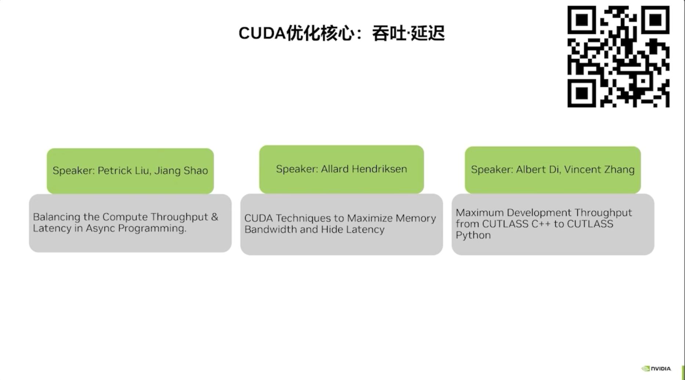

여기서는 세 가지 중요한 기술 공유 주제를 보여준다. 첫 번째는 Petrick Liu(류빙)와 Jiang Shao가 발표하며, 비동기 프로그래밍에서 계산 처리량과 지연 균형 기술에 초점을 맞춘다. 두 번째는 Allard Hendriksen이 발표하며, 메모리 대역폭 이용률 극대화와 지연 숨기기 CUDA 기술을 소개한다. 세 번째는 Albert Di와 Vincent Zhang이 발표하며, CUTLASS C++에서 CUTLASS Python으로 개발 처리량을 극대화하는 방법을 탐구한다. 두 번째 강연 노트는 이전 글에서 기록하였으며, 현재 이 강의는 첫 번째 강연 내용이다.

## GPU 계산과 프로그래밍 모델 발전：비동기 계산 프로그래밍에서의 처리량과 지연 균형

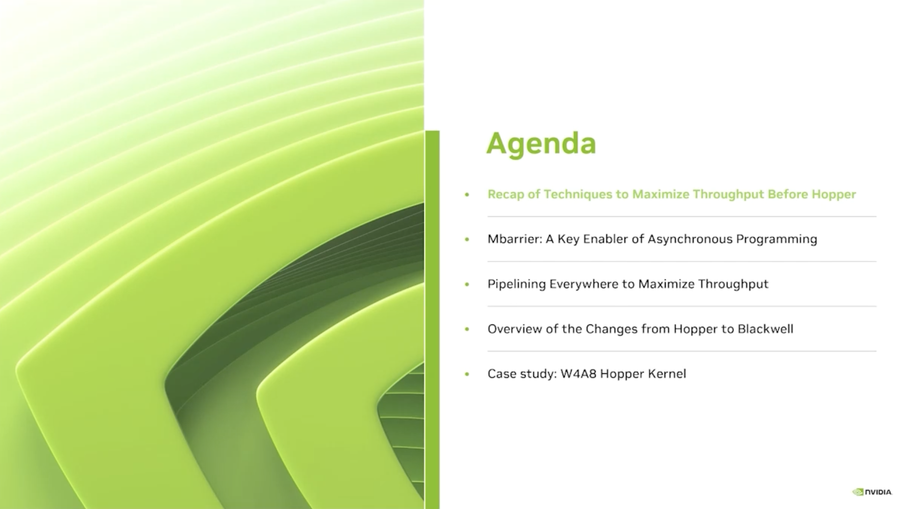

이 Slides는 현재 Talk의 목차이다. 먼저 Hopper 아키텍처 이전에 처리량 극대화를 위해 사용된 다양한 기술 수단을 복습하고, 다음으로 비동기 프로그래밍의 핵심 구현 기술인 Mbarrier를 심층적으로 소개한다. 이어서 파이프라인 기술을 활용하여 처리량을 극대화하는 방법을 탐구하고, 그런 다음 Hopper에서 Blackwell 아키텍처로의 발전 과정에서 중요한 변화를 개괄한다. 마지막으로 W4A8 Hopper 커널의 구체적인 사례 연구를 통해 이러한 이론 기술의 실제 적용 효과를 보여준다.

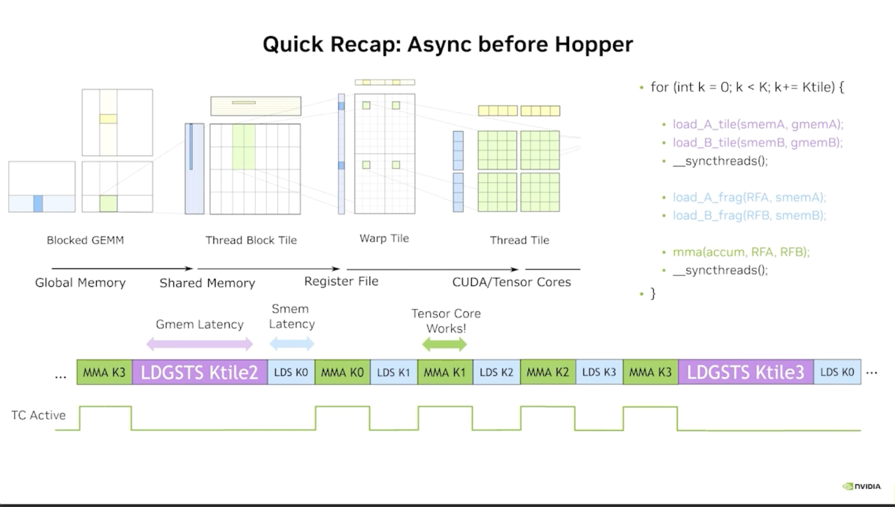

이 Slides는 Hopper 아키텍처 이전 GPU 비동기 프로그래밍에서의 전통적인 최적화 기술과 실행 모드를 보여준다. 이 Slides는 최적화가 없는 상황을 보여준다는 점에 주의하라. 그림 상단은 CUTLASS GEMM 계산의 완전한 메모리 계층 구조를 보여준다. global memory에서 shared memory, register file을 거쳐 CUDA/Tensor Core에 이르는 데이터 흐름 경로와, 서로 다른 입도의 블로킹 전략(Blocked GEMM, Thread Block Tile, Warp Tile, Thread Tile)이 데이터 처리 단위를 단계적으로 세분화하는 방식을 나타낸다. 오른쪽 코드 조각은 전통적인 동기 프로그래밍 모드의 전형적인 구조를 보여준다. 데이터 Tile 로드(load_A_tile, load_B_tile), thread 동기화(syncthreads()), fragment 로드(load_A_frag, load_B_frag), 행렬 곱셈 누산(mma)의 순차 실행 흐름을 포함한다. 그림 하단은 타임라인 그래프로 MMA(행렬 곱셈 누산) 연산과 LDGSTS(global memory에서 shared memory로의 데이터 전송) 연산이 여러 Ktile 주기에서의 스케줄링 배치와 Tensor Core 활성 상태를 보여준다. 데이터 로드 지연으로 인해 Tensor Core에 주기적인 유휴 상태가 발생하며, 이때 처리량을 극대화할 수 없다.

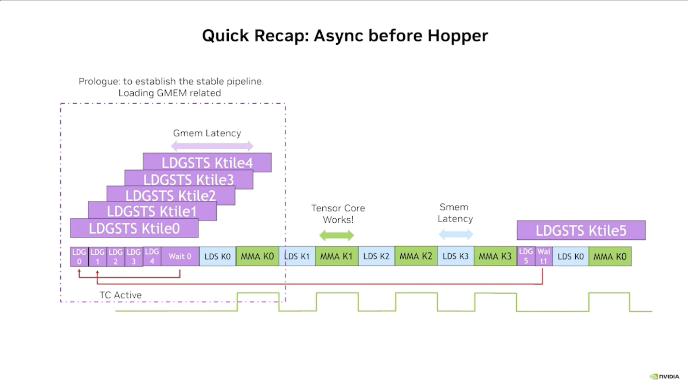

이 Slides는 Ampere 아키텍처에서 GPU 비동기 프로그래밍의 파이프라인 최적화 전략을 보여준다. 정교하게 설계된 Prologue 단계로 안정적인 계산 파이프라인을 구축하는 방법에 중점을 둔다. 그림은 GEMM 계산의 완전한 실행 흐름을 상세히 묘사한다. Ktile0에서 Ktile5까지의 연속적인 데이터 프리페치 과정을 보여주는데, 여러 LDGSTS(global memory에서 shared memory로의 로드) 연산을 일찍 시작하여 global memory 접근 지연을 효과적으로 숨긴다. 타임라인 그래프는 LDG(global memory 로드), Wait(대기), LDS(shared memory 로드), MMA(행렬 곱셈 누산) 연산 사이의 정확한 스케줄링 관계와 Tensor Core 활성화 주기를 명확하게 보여준다. 이 설계의 핵심 아이디어는 소프트웨어 파이프라인 기술로 데이터 프리페치 연산과 계산 연산을 overlap하여 실행하는 것이다. 이렇게 하면 Tensor Core가 현재 Ktile을 계산하는 동안 다음 Ktile의 데이터가 병렬로 로드된다. 그러나 Shared Memory의 Load 지연이 여전히 전체 파이프라인에 노출되어 TensorCore 실행에 여전히 bubble이 존재한다.

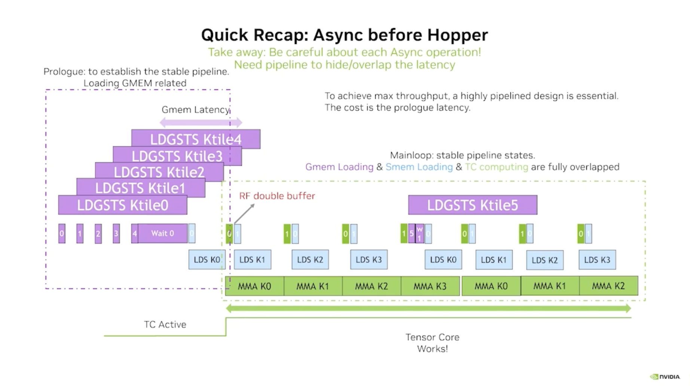

더 나아가, Shared Memory 로드도 파이프라인화하여 지연을 더욱 숨길 수 있다. 왼쪽은 Prologue 단계에서 안정적인 파이프라인을 구축하는 과정을 보여주며, 오른쪽은 최대 처리량 달성을 위해서는 고도로 파이프라인화된 설계가 필수임을 강조하지만, 이 설계의 대가는 prologue 지연이 증가한다는 것이다. 그림 하단은 Main Loop에서의 안정적인 파이프라인 상태를 상세히 묘사하며, global memory 로드(Gmem Loading), shared memory 로드(Smem Loading), Tensor Core 계산(TC Computing) 세 가지 핵심 연산이 완전히 overlap되어 실행된다. 타임라인 그래프는 RF 이중 버퍼 메커니즘의 작동 원리와 LDS(shared memory 로드) 및 MMA(행렬 곱셈 누산) 연산의 정밀한 스케줄링 배치를 정확하게 보여준다.

위의 그림들의 핵심 아이디어는 지연이 있는 모든 곳에서 지연을 숨기는 방법을 찾아 최대 처리량에 도달하는 것이다.

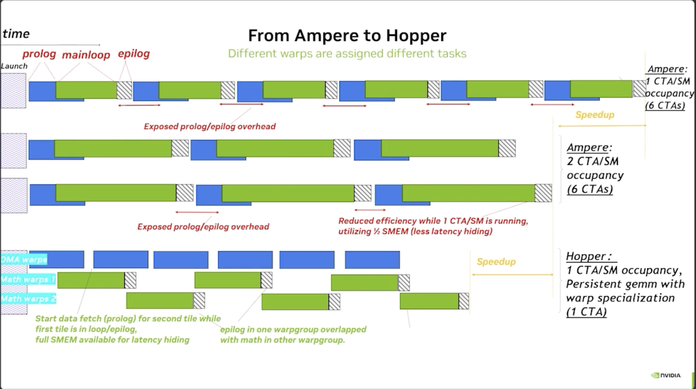

Hopper 아키텍처에서는 Tensor Core 계산이 더 빠르다. 모든 지연에서 Tensor Core가 작동하기를 원한다면, 태스크 수준에서 하나의 CTA가 더 많은 일을 하도록 하고 MainLoop와 Prologue/Epilogue 단계를 overlap해야 한다.

이 Slides는 CUTLASS 2.x에서 CUTLASS 3.x로의 발전 과정을 보여주며, 주로 서로 다른 GPU 아키텍처(Ampere와 Hopper)에서 GEMM 연산의 실행 효율을 비교하여 설명한다.

- Ampere 아키텍처(1 CTA/SM, 6 CTAs):
    - prolog(전도부), mainloop(주 루프), epilog(후처리)의 실행 타임라인을 보여준다.
    - prolog/epilog 오버헤드가 노출되어 전체 효율에 영향을 준다.
- Ampere 아키텍처(2 CTA/SM, 6 CTAs):
    - 노출된 prolog/epilog 오버헤드가 여전히 존재한다. 하지만 위의 경우보다는 이미 가속되었다.
    - 1 CTA/SM만 실행될 때 효율이 떨어지며, SMEM(shared memory)의 1/2만 이용하여 지연 숨기기 능력이 감소한다.
- Hopper 아키텍처(1 CTA/SM, Persistent GEMM과 warp 전문화):
    - 새로운 실행 모델을 도입한다.
    - Persistent GEMM 기술을 사용하여 하나의 CTA가 SM을 지속적으로 점유할 수 있다.
    - warp 전문화를 구현하여 서로 다른 warp 그룹이 서로 다른 작업을 실행한다.
    - 첫 번째 tile이 아직 loop/epilog 단계에 있을 때, 이미 두 번째 tile을 위한 데이터 프리페치(prolog)를 시작할 수 있다.
    - SMEM을 충분히 이용하여 지연 숨기기를 구현한다.
    - 하나의 warp 그룹의 epilog가 다른 warp 그룹의 수학 계산과 overlap될 수 있다.

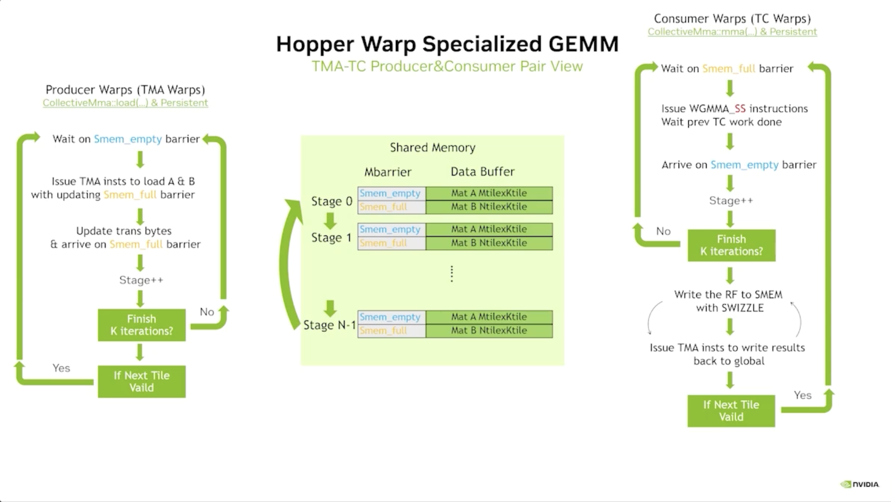

이 Slides는 Hopper 아키텍처에서 Warp Specialized GEMM 구현을 소개하며, 생산자-소비자 모델을 채택한다. 내용은 다음과 같다:
- 전체 아키텍처는 `Producer Warps`(TMA Warps)와 `Consumer Warps`(TC Warps)로 나뉘며, shared memory를 통해 데이터를 교환한다.
- `Producer Warps`(TMA Warps):
    - `CollectiveMma::load(...) & Persistent` 방법 사용
    - `smem_empty barrier` 대기
    - TMA 명령어 발사하여 A와 B 행렬 로드, `smem_full barrier` 업데이트
    - 전송 바이트 수 업데이트 및 `smem_full barrier` 도착
    - K 반복 루프
- `Consumer Warps`(TC Warps):
    - `CollectiveMma::mma(...) & Persistent` 방법 사용
    - `smem_full barrier` 대기
    - `WGMMA_SS` 명령어 발사 및 이전 TC 작업 완료 대기
    - `smem_empty barrier` 도착
    - K 반복 루프
    - `SWIZZLE`로 레지스터 파일(RF)을 shared memory(SMEM)에 씀
    - TMA 명령어 발사하여 결과를 global memory에 다시 씀
- Shared memory 구조:
    - `Mbarrier`와 `Data Buffer` 두 부분 포함
    - 각 stage에 두 개의 buffer: `Mat A MtilexKtile`과 `Mat B NtilexKtile`
    - `smem_empty`와 `smem_full` 플래그를 사용하여 Producer와 Consumer 동기화
- 실행 흐름:
    - `Producer`와 `Consumer`가 교대로 작업하며 shared memory와 barrier 메커니즘으로 동기화
    - 여러 stage(0에서 N-1)가 파이프라인 연산에 사용됨
    - 모든 tile 계산이 완료될 때까지 루프 실행

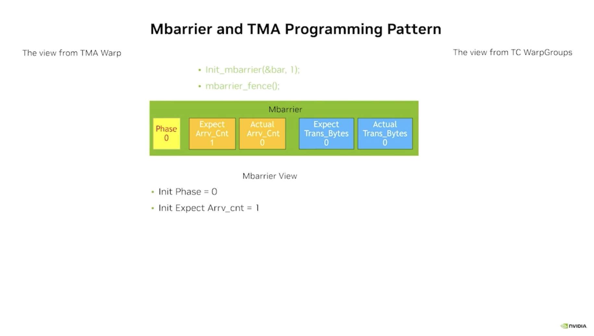

이 Slides는 Hopper 아키텍처에서 Mbarrier와 TMA 프로그래밍 모드의 핵심 메커니즘과 작동 원리를 소개한다. 그림은 두 가지 다른 관점에서 이 프로그래밍 모드를 관찰한다: 왼쪽은 TMA Warp의 시각, 오른쪽은 TC WarpGroups의 시각이다. 중앙 부분에서는 Mbarrier(메모리 배리어)의 데이터 구조를 중점적으로 묘사하는데, Phase(단계, 초기값 0), Expected Arrival Count(예상 도착 카운트, 초기값 1), Actual Arrival Count(실제 도착 카운트, 초기값 0), Expected Transfer Bytes(예상 전송 바이트 수, 초기값 0), Actual Transfer Bytes(실제 전송 바이트 수, 초기값 0) 다섯 가지 핵심 필드를 포함한다. 상단의 코드 조각은 `init_mbarrier(&bar, 1)` 함수로 배리어 파라미터를 설정하고 `mbarrier_fence()`로 메모리 배리어를 설정하는 Mbarrier 초기화 과정을 보여준다.

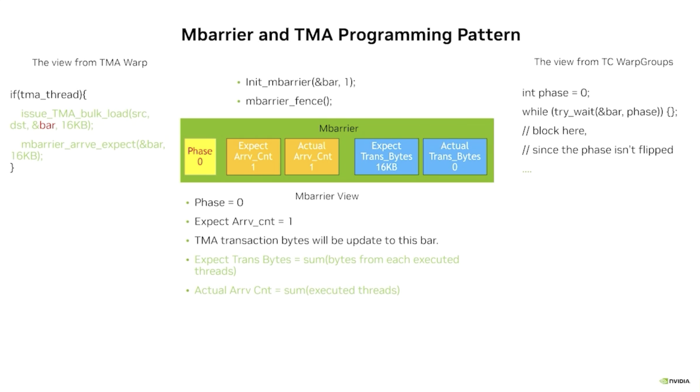

이 Slides는 계속해서 Hopper 아키텍처에서 Mbarrier와 TMA 프로그래밍 모드의 구체적인 구현 메커니즘과 실행 흐름을 보여준다. 그림은 두 가지 핵심 시각에서 비동기 데이터 전송의 협력 모드를 상세히 설명한다. 왼쪽은 TMA Warp의 연산 로직을 보여주는데, `tma_thread` 조건 판단을 통해 `issue_TMA_bulk_load` 비동기 일괄 로드 연산(16KB 데이터 전송)을 실행하고, 이어서 `mbarrier_arrive_expect` 함수를 호출하여 배리어에 예상 데이터 전송량을 알린다. 오른쪽은 TC WarpGroups의 대기 로직을 보여주는데, `while` 루프와 `try_wait` 함수를 통해 배리어 상태를 계속 확인하며, `phase`가 전환되지 않으면 여기서 블로킹되어 대기한다. 중앙의 Mbarrier 데이터 구조는 동기화 메커니즘의 핵심 상태를 명확하게 보여준다: Phase는 0을 유지하고, Expected와 Actual 도착 카운트가 모두 1이며, Expected 전송 바이트 수는 16KB로 설정되어 있지만 Actual 전송 바이트 수는 여전히 0으로, 데이터 전송이 진행 중임을 나타낸다. 그림 하단의 주석은 각 필드의 의미를 추가로 설명한다: TMA 트랜잭션 바이트가 이 배리어에 업데이트되고, 예상 전송 바이트 수는 실행된 모든 thread의 바이트 합과 같으며, 실제 도착 카운트는 실행된 thread의 총 수와 같다. 이 설계는 TMA 하드웨어 유닛과 Tensor Core 계산 유닛 사이의 정확한 비동기 조정을 구현하여, 데이터가 완전히 전송 준비된 후에야 계산이 이루어지도록 보장한다. 이는 Hopper 아키텍처 비동기 프로그래밍의 핵심 혁신이다.

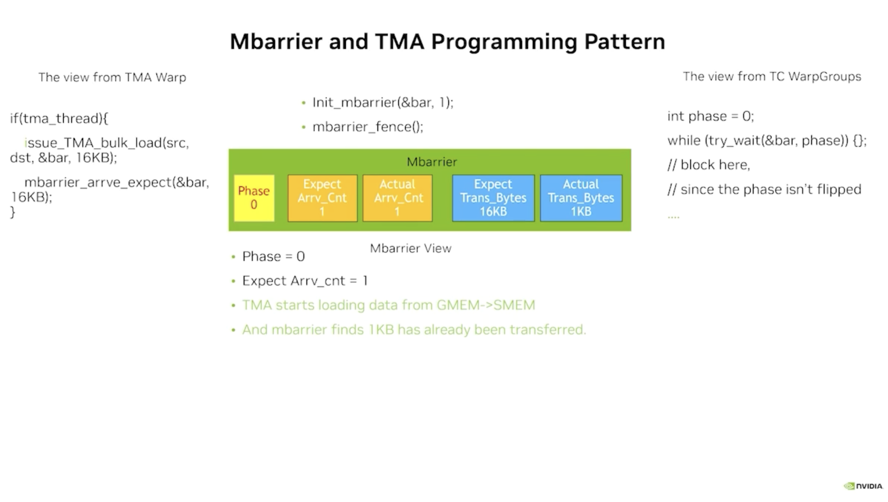

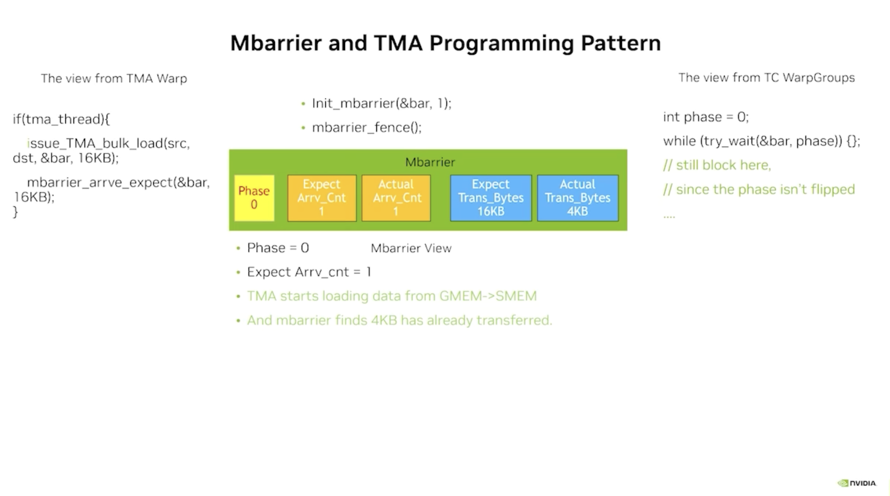

이 두 Slides는 TMA Warp의 데이터 전송이 계속되어 각각 1KB와 4KB까지 전송된 상황을 보여주며, 이때 MBarrier의 상태는 변하지 않았다.

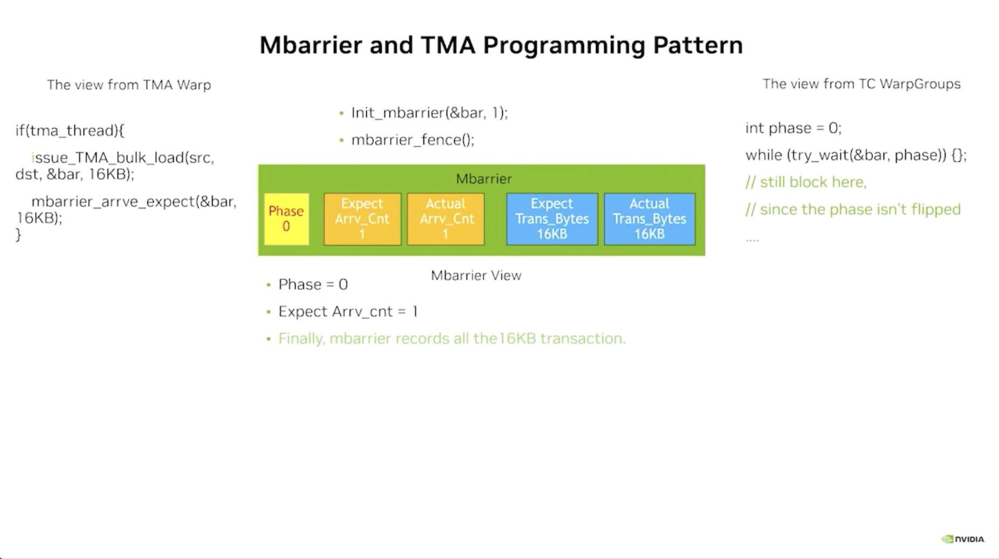

이전 그림과 비교하면, 여기서는 중요한 상태 변화가 보인다: TMA Warp가 16KB 일괄 데이터 전송을 성공적으로 완료하였고, Mbarrier의 Actual 도착 카운트가 0에서 1로 업데이트되었으며, Actual 전송 바이트 수도 0에서 16KB로 업데이트되어 데이터 전송 연산이 완료되었음을 나타낸다. 그러나 핵심 Phase 필드는 여전히 0으로 전환되지 않았는데, 이는 mbarrier가 완전한 16KB 트랜잭션을 기록했지만 동기화 조건이 아직 완전히 충족되지 않았음을 의미한다. 따라서 오른쪽 TC WarpGroups의 thread들은 여전히 while 루프에서 계속 대기하며, try_wait 함수는 계속 블로킹 상태를 반환한다. phase가 아직 예상 상태로 전환되지 않았기 때문이다.

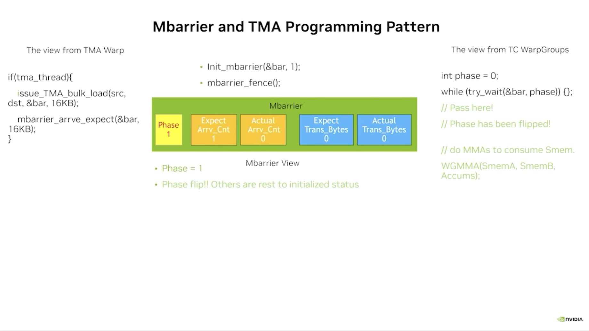

이 Slides는 Mbarrier와 TMA 프로그래밍 모드의 최종 동기화 완료 상태를 보여준다. 이는 완전한 동기화 주기의 종료와 계산 단계의 시작을 나타낸다. 그림에서 가장 핵심적인 변화는 Mbarrier의 Phase 필드가 0에서 1로 성공적으로 전환된 것으로, 모든 동기화 조건이 충족되고 동기화 배리어가 공식적으로 트리거되었음을 나타낸다. 동시에 다른 필드들은 모두 초기 상태로 재설정된다: Actual 도착 카운트는 1에서 0으로 재설정되고, Expected와 Actual 전송 바이트 수는 모두 16KB에서 0으로 재설정되어 다음 동기화 주기를 준비한다. 오른쪽 TC WarpGroups의 실행 흐름에 근본적인 변화가 발생했다: while 루프가 phase 전환을 감지하고 블로킹 상태에서 성공적으로 빠져나왔으며, 주석에 "Pass here! Phase has been flipped!"라고 명확히 표시되어 대기하던 thread들이 이제 계속 실행할 수 있음을 나타낸다. 이어서 실제 계산 작업이 시작되며, WGMMA(WarpGroup Matrix Multiply-Accumulate) 연산으로 shared memory의 데이터(SmemA와 SmemB)를 소비하고 결과를 Accums에 누산한다.

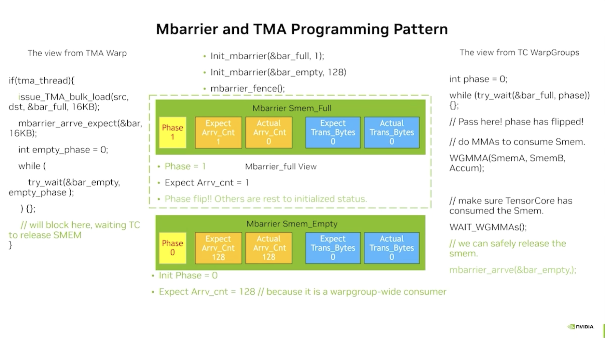

이 Slides는 bar_full(데이터 만 배리어)과 bar_empty(데이터 빈 배리어)를 보여주며, 정밀한 동기화 제어 시스템을 형성한다. 왼쪽 TMA Warp는 먼저 bar_empty 배리어(예상 도착 카운트가 128인데, 이는 warpgroup 수준의 소비자이기 때문)를 대기하여 shared memory가 사용 가능한지 확인한 후에야 데이터 전송 연산을 실행할 수 있다. 오른쪽 TC WarpGroups는 먼저 bar_full 배리어를 대기하여 데이터 준비를 확인하고, WGMMA 계산을 실행하여 shared memory 데이터를 소비하며, 계산 완료 후 WAIT_WGMMAs()로 Tensor Core가 데이터를 완전히 소비했음을 확인하고, 마지막으로 `mbarrier_arrive(&bar_empty)`를 호출하여 shared memory 리소스를 해제하여 다음 라운드에 사용할 수 있도록 한다. 두 Mbarrier의 상태는 이 양방향 동기화 메커니즘을 보여준다: Smem_Full 배리어의 Phase가 1로 전환되어 데이터 준비를 나타내고, Smem_Empty 배리어의 Expected와 Actual 도착 카운트가 모두 128로 모든 관련 thread가 동기화에 참여했음을 나타낸다. 이 설계는 shared memory의 안전한 재사용을 구현하여, 데이터가 완전히 소비되기 전에 새 데이터로 덮어쓰이지 않도록 보장한다. 이는 Hopper 아키텍처 비동기 프로그래밍에서의 리소스 관리와 동기화 제어의 고도로 정밀한 특성을 구현하며, 효율적인 파이프라인 계산을 위한 하드웨어 수준의 신뢰할 수 있는 보장을 제공한다.

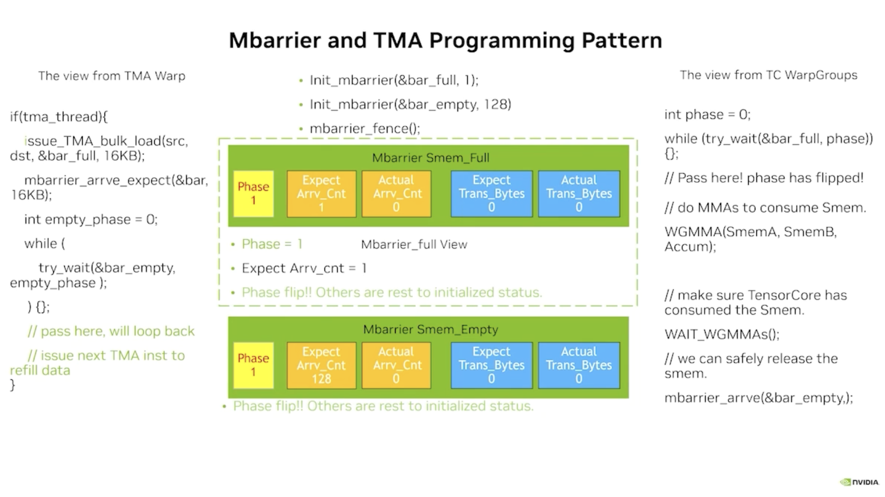

이 Slides는 Hopper 아키텍처에서 이중 배리어 Mbarrier와 TMA 프로그래밍 모드의 핵심 전환 시점을 보여준다. 즉, shared memory 리소스가 성공적으로 해제되고 다음 라운드의 데이터 전송을 준비하는 상태다. 그림에서 가장 중요한 변화는 왼쪽 TMA Warp의 `empty_phase`가 0으로 재설정되어 시스템이 새로운 동기화 주기를 준비 중임을 나타내며, `bar_empty` 배리어가 성공적으로 전환되었다(하단 주석 "Phase flip!"에 표시). 이는 TC WarpGroups가 shared memory 소비를 완료하고 리소스를 해제했음을 의미한다. 왼쪽 코드 주석에는 "pass here, will loop back // issue next TMA inst to refill data"라고 명확히 표시되어 TMA thread가 이제 대기 루프를 빠져나와 다음 TMA 명령어를 발사하여 데이터를 다시 채울 준비가 되었음을 나타낸다. 오른쪽 TC WarpGroups의 phase도 0으로 재설정되어 새로운 라운드의 데이터 준비 신호를 대기한다. 두 배리어의 상태는 이 주기적 전환을 보여준다: Smem_Full 배리어는 Phase=1 상태를 유지하여 새 데이터 도착을 대기하고, Smem_Empty 배리어의 Phase가 1로 전환되어 shared memory가 비워져 사용 가능함을 나타낸다.

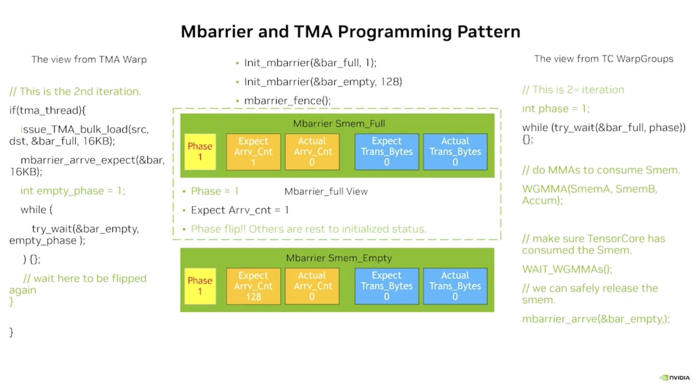

이어서 두 번째 반복에서의 Mbarrier 상태가 나온다. 이전 반복과의 차이는 여기서 FLIP 대기가 1에서 0으로 바뀐다는 것이다.

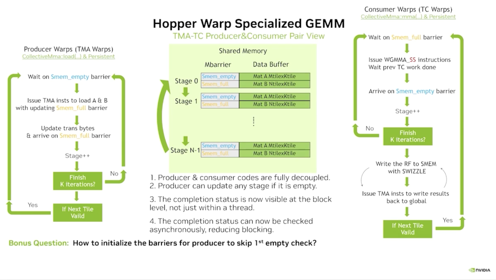

이 Slides는 이미 앞에서 보여준 것인데, 몇 가지 요약이 추가되었다. 여기서는 Hopper 아키텍처에서 Warp Specialized GEMM 구현의 생산자-소비자 모델의 몇 가지 장점을 보여준다. 생산자와 소비자 코드가 완전히 분리되고, 생산자는 임의의 빈 stage를 업데이트할 수 있으며, 완료 상태가 block 수준에서 가시적이고, 비동기 상태 확인을 지원하여 블로킹을 줄인다. 이는 Hopper 아키텍처가 하드웨어 비동기 지원과 세밀한 작업 분업을 통해 GPU 계산 효율과 처리량을 극대화하는 설계 이념을 구현한다.

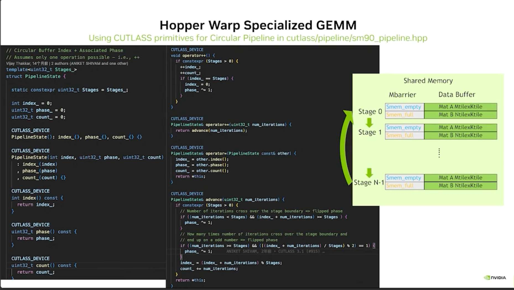

이 Slides는 Hopper 아키텍처에서 Warp 특화 GEMM이 CUTLASS 파이프라인 프리미티브를 사용하여 Ring Buffer를 구현하는 핵심 메커니즘을 보여준다. 왼쪽은 CUTLASS의 `PipelineState` 구조체의 완전한 코드 구현을 보여주는데, index(인덱스), phase(단계), count(카운트) 세 가지 핵심 필드와 `operator++`, `advance` 등의 연산 함수를 포함한다. 특히 phase 전환 로직을 강조하는데, 반복 횟수가 stage 경계를 넘어설 때 phase 전환이 트리거된다(`phase_ ~= 1`). 이것이 비동기 동기화의 핵심 메커니즘이다. 오른쪽의 shared memory 레이아웃 그림은 다중 stage Ring Buffer의 구성 방식을 명확하게 보여준다. 각 Stage에는 독립적인 Mbarrier(Smem_empty와 Smem_full 배리어 포함)와 해당 데이터 버퍼(Mat A MtilexKtile과 Mat B NtilexKtile)가 있어 행렬 데이터의 블록 저장을 지원한다. 중간의 녹색 화살표는 circular pipeline의 핵심 아이디어, 즉 제한된 stage 사이에서 버퍼 리소스를 순환 재사용하는 방법을 시각적으로 표현한다. 정확한 phase 관리와 배리어 동기화를 통해 데이터 로드, 계산 실행, 리소스 해제의 효율적인 파이프라인화를 구현한다. 이 설계는 GPU 메모리 대역폭의 최대 활용과 계산 리소스의 지속적인 활성 상태를 보장한다.

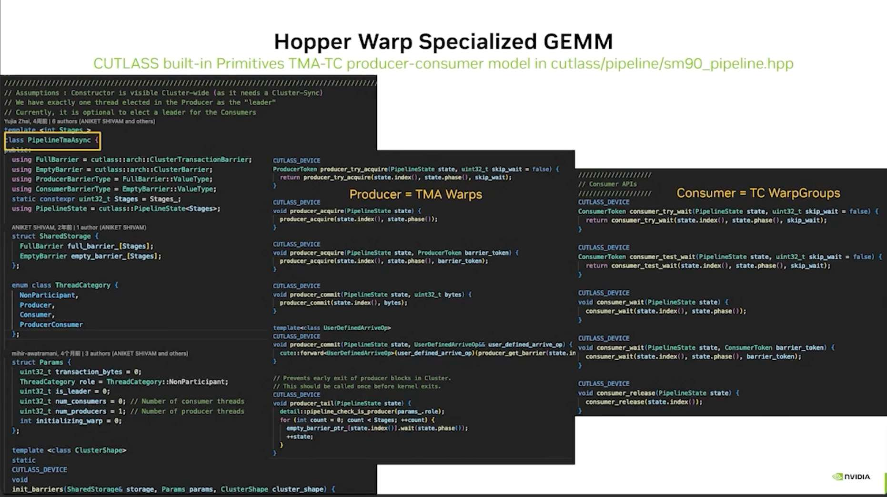

이 Slides는 CUTLASS에서 TMA-TC 생산자-소비자 모델의 예제 코드 구현을 보여준다. 왼쪽은 `PipelineTmaAsync` 클래스의 핵심 정의를 보여주는데, `FullBarrier`와 `EmptyBarrier`의 타입 별칭, `SharedStorage` 공유 저장 구조체(다중 stage 배리어 배열 포함), `ThreadCategory` 열거형(NonParticipant, Producer, Consumer, ProducerConsumer 네 가지 thread 역할 정의), `Params` 파라미터 구조체가 포함된다. 중간 부분은 Producer(TMA Warps)의 완전한 API 집합을 상세히 보여준다. `producer_try_acquire`(리소스 시도 획득), `producer_acquire`(리소스 정식 획득), `producer_commit`(데이터 전송 제출), `producer_tail`(producer block이 조기에 종료되는 것을 방지) 등의 핵심 함수가 포함되며, 각 함수는 PipelineState로 정확한 stage와 phase 관리를 수행한다. 오른쪽은 Consumer(TC WarpGroups)의 API 구현을 보여주는데, `consumer_try_wait`, `consumer_test_wait`, `consumer_wait`, `consumer_release` 등의 함수가 포함되어 데이터 준비 상태 감지와 리소스 해제 제어를 구현한다. 이 설계는 CUTLASS 내장 프리미티브를 통해 Hopper 하드웨어의 비동기 특성을 완벽하게 캡슐화하여 개발자에게 고수준 추상화 인터페이스를 제공한다. 복잡한 TMA-TC 협력 모드를 명확하고 타입 안전한 방식으로 구현할 수 있다.

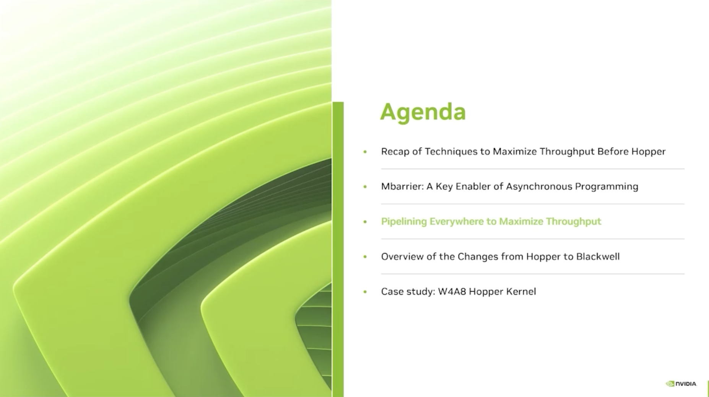

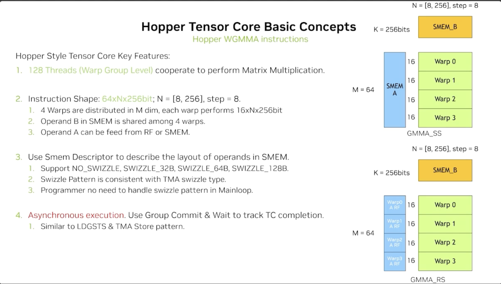

이 Slides는 NVIDIA Hopper 아키텍처에서 Tensor Core의 기본 개념과 WGMMA(Warp Group Matrix Multiply Accumulate) 명령어의 핵심 특성을 소개한다. 첫째, Hopper의 Tensor Core는 128개의 thread(Warp Group 수준)가 협력하여 행렬 곱셈 연산을 실행한다. 둘째, 명령어 형태는 `64xNx256bit`로, N은 `[8,256]` 범위에서 8 단위로 조정 가능하며, 4개의 Warp가 M 차원에 분배되어 각 warp가 `16xNx256bit`의 계산 블록을 처리한다. 피연산자 B는 shared memory(SMEM)에서 모든 warp가 공유하고, 피연산자 A는 레지스터 파일(RF) 또는 SMEM에서 가져올 수 있다. 셋째, 시스템은 SMEM 디스크립터를 사용하여 shared memory에서 피연산자의 레이아웃을 정의하며, NO_SWIZZLE에서 SWIZZLE_128B까지 여러 swizzle 모드를 지원한다. 이러한 모드는 TMA swizzle 유형과 일치하여 주 루프에서 프로그래머의 프로그래밍 복잡도를 단순화한다. 마지막으로 이 아키텍처는 비동기 실행 모드를 지원하며, `Group Commit & Wait` 메커니즘으로 Tensor Core 계산 완료 상태를 추적한다. 이 설계는 LDGSTS와 TMA Store의 실행 모드와 유사하다.

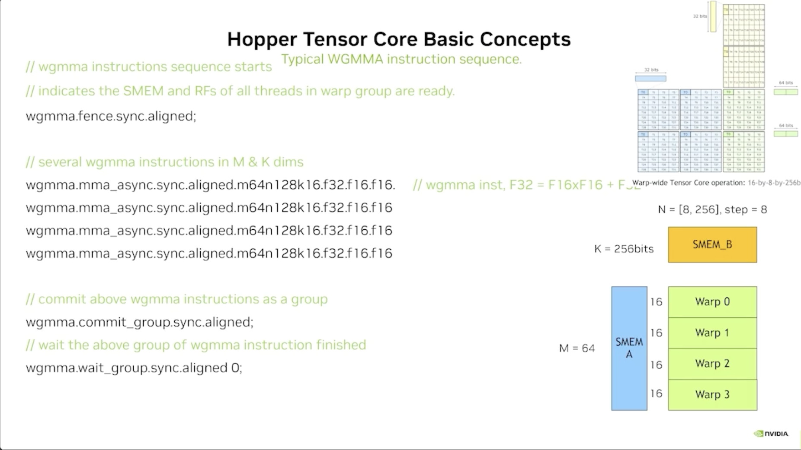

이 Slides는 NVIDIA Hopper 아키텍처에서 Tensor Core의 기본 개념과 WGMMA(Warp Group Matrix Multiply Accumulate) 명령어의 전형적인 실행 시퀀스를 상세히 보여준다. 왼쪽 코드 조각은 WGMMA 명령어의 표준 실행 흐름을 완전히 보여준다. 먼저 `wgmma.fence.sync.aligned`로 동기화 배리어를 설정하여 모든 thread의 shared memory와 레지스터 파일이 준비되었음을 확인한다. 이어서 연속적으로 네 개의 `wgmma.mma_async.sync.aligned.m64n128k16.f32.f16.f16` 비동기 행렬 곱셈 누산 명령어를 실행하며, 각 명령어는 64×128×16 차원의 F16 입력 행렬을 처리하고 F32 결과에 누산한다. 그런 다음 `wgmma.commit_group.sync.aligned`로 위 WGMMA 명령어들을 하나의 그룹으로 제출하고, 마지막으로 `wgmma.wait_group.sync.aligned 0`으로 해당 그룹 명령어가 완료될 때까지 대기한다. 오른쪽 데이터 구성 그림은 Warp 수준 Tensor Core 연산의 복잡한 메모리 레이아웃을 보여준다. 위쪽은 16×8×256비트의 데이터 분포 패턴을 묘사하며, 32비트와 64비트 그리드에는 각각 T0에서 T31의 thread 식별자가 포함되어 128개 thread의 협력 계산 모드를 나타낸다. 중간에는 N 차원 범위 [8,256](단계 8), K 차원 256비트, 관련 SMEM_B shared memory 블록이 정의되어 있다. 아래쪽은 M=64 차원의 SMEM_A 데이터 블록이 16 단위의 네 개 세그먼트로 균등 분할되어 각각 Warp 0에서 Warp 3의 처리 단위에 대응함을 보여준다. 각 Warp는 16×N×256비트의 계산 작업을 담당한다. 이 설계는 데이터의 효율적인 병렬 처리와 메모리 접근 최적화를 구현하며, Hopper 아키텍처의 고성능 행렬 연산의 핵심 메커니즘이다.

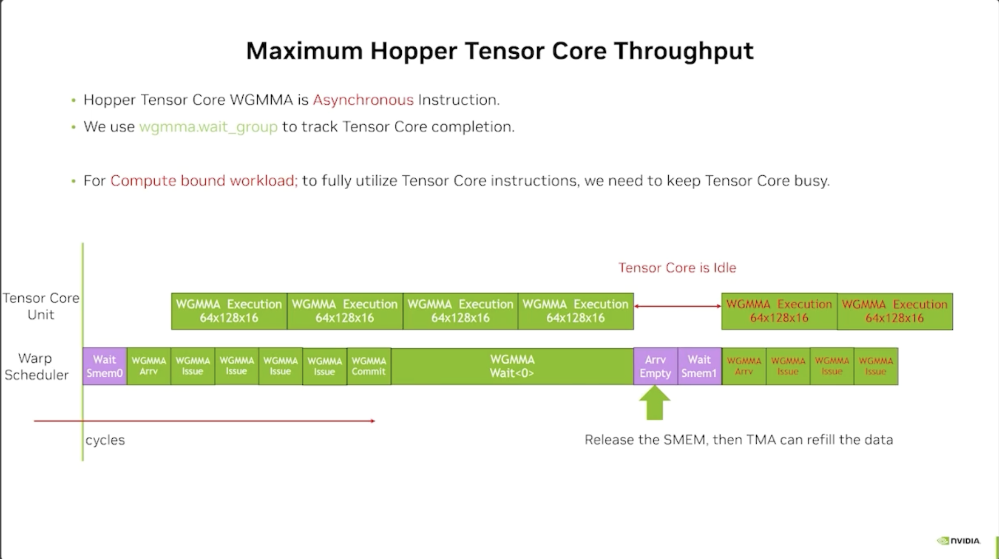

이 Slides는 비동기 명령어 스케줄링 메커니즘을 통해 NVIDIA Hopper 아키텍처에서 Tensor Core의 처리량을 극대화하는 방법을 보여준다. 핵심 관점은 Hopper Tensor Core의 WGMMA(Warp Group Matrix Multiply Accumulate) 명령어가 비동기임을 강조하며, `wgmma.wait_group`을 사용하여 Tensor Core의 완료 상태를 추적해야 하고, 계산 집약적 워크로드에서는 Tensor Core를 계속 바쁜 상태로 유지하여 계산 능력을 충분히 활용해야 한다. 차트는 타임라인으로 "Tensor Core Unit"과 "Warp Scheduler"의 협력 작업 흐름을 명확하게 보여준다. Tensor Core Unit 타임라인은 WGMMA 명령어의 실제 실행 과정을 보여주는데, 초기 단계에서 연속적으로 네 그룹의 "WGMMA Execution 64x128x16" 연산을 실행하여 효율적인 계산을 달성했지만, 이 실행들이 완료된 후 "Tensor Core is Idle"의 유휴 기간이 발생하여 계산 리소스가 충분히 활용되지 못했음을 보여준다. 이후 두 그룹의 WGMMA 연산이 다시 실행된다. Warp Scheduler 타임라인은 명령어 스케줄링과 데이터 준비 과정을 보여준다. 먼저 "Wait Smem0"으로 shared memory 준비를 기다리고, 이어서 "WGMMA Arrv"(명령어 도착), 연속적인 "WGMMA Issue"(명령어 발사), "WGMMA Commit"(명령어 제출) 연산이 수행된다. 이 연산들은 Tensor Core Unit의 첫 네 번의 실행과 대응한다. 제출 후 비교적 긴 "WGMMA Wait<0>" 상태에 들어가는데, 이 기간에 Warp는 이전에 제출한 WGMMA 그룹이 완료되기를 기다린다. 이것이 Tensor Core Unit의 유휴 기간을 직접 초래한다. 대기가 끝나면 "Arrv Empty"를 실행하고 shared memory를 해제하여 TMA가 데이터를 다시 채울 수 있게 한다. 이어서 "Wait Smem1"로 새 shared memory 데이터를 기다리고, 다시 WGMMA 관련 연산을 수행하여 Tensor Core Unit이 후속 작업을 실행하도록 한다.

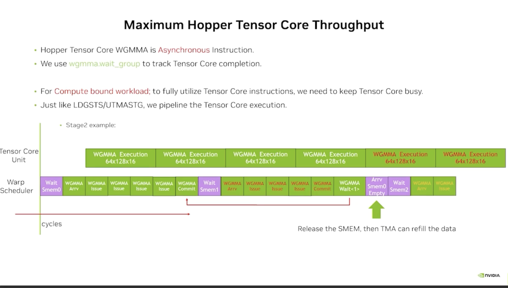

이어서 WGMMA 명령어를 파이프라인화하여 지연을 숨기는 방법을 보여준다. 첫 번째 제출 후, Warp Scheduler는 "Wait Smem1" 상태에 들어가고, 이어서 두 번째 그룹의 WGMMA 명령어(Arrv, Issue x4, Commit)를 스케줄하기 시작하며, 그 후 "WGMMA Wait<1>" 상태에 들어가 해당 그룹 명령어가 완료되기를 기다린다. 하나의 핵심 최적화 포인트는, Warp Scheduler가 WGMMA 명령어 완료를 기다리는 동안 shared memory(Smem0)가 해제되어 TMA(Tensor Memory Accelerator)가 데이터를 다시 채울 수 있다는 것이다. 이는 그림에서 "Arrv Smem0 Empty"로 표시되며 위쪽 화살표로 나타낸다. 파이프라인화된 데이터 로드와 계산으로 지연을 숨기고 Tensor Core가 계속 바쁜 상태를 유지하여 처리량을 극대화하는 것이 목표다.

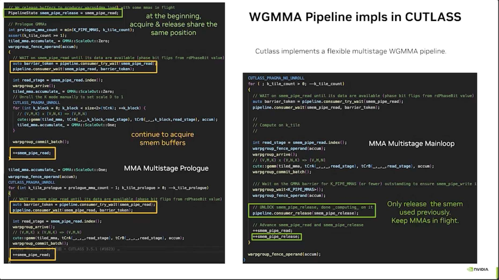

이 Slides는 CUTLASS가 유연한 다중 단계 WGMMA(Warp Group Matrix Multiply Accumulate) 파이프라인을 구현하여 GPU에서 행렬 곱셈 누산 연산을 최적화하는 방법을 보여준다. 왼쪽의 "MMA Multistage Prologue" 코드 조각은 파이프라인의 초기화와 워밍업 단계를 보여준다. 초기화 단계에서 `PipelineState smem_pipe_release = smem_pipe_read;`로 시작 시 shared memory의 획득과 해제 포인터가 같은 위치를 가리킴을 나타낸다. 즉, 초기 상태에서는 해제가 필요한 사용된 smem 버퍼가 없다. 워밍업 루프는 중첩 루프를 통해 계속해서 데이터 대기(`pipeline.consumer_try_wait`와 `pipeline.consumer_wait`로 shared memory 버퍼의 데이터가 사용 가능할 때까지 대기), GMMA 실행(`read_stage` 인덱스 획득, `warpgroup_arrive()` 실행, `cute::gemm`으로 실제 행렬 곱셈 누산 실행), 배치 제출(`warpgroup_commit_batch()`로 현재 배치의 WGMMA 연산 제출), 읽기 포인터 진행(`++smem_pipe_read;`로 계속 읽기 포인터를 진행하여 후속 계산에 데이터 준비)을 수행한다. 오른쪽의 "MMA Multistage Mainloop" 코드 조각은 파이프라인의 주 루프를 보여주며, 계산과 데이터 관리의 병렬화를 구현한다. 주 루프는 `CUTLASS_PRAGMA_NO_UNROLL`로 수정된 `k_tile_count` 루프를 통해 핵심 계산을 지속 실행한다. 각 반복 시작 시 `smem_pipe_read`가 가리키는 shared memory 데이터가 사용 가능할 때까지 기다리고, `cute::gemm` 행렬 곱셈 누산 연산을 실행하고 제출하며, `warpgroup_wait<K_PIPE_MMAS>()`로 일정 수의 WGMMA 연산이 완료되어 계산 진도가 보장되기를 기다린다. 가장 핵심적인 것은 `pipeline.consumer_release(smem_pipe_release)`로 shared memory 버퍼를 잠금 해제하고 해제하는 것이다. "이전에 사용한 smem만 해제하고, in-flight MMAs는 유지한다"는 점을 명확히 한다. 데이터가 소비된 후에야 해당 버퍼가 해제되어 생산자가 계속 새 데이터를 채울 수 있고, 계산과 데이터 로드의 파이프라인화가 구현된다. 마지막으로 `++smem_pipe_read;`와 `++smem_pipe_release;`로 동시에 읽기와 해제 포인터를 진행하여 파이프라인의 동적 균형을 유지한다. 이 설계는 정밀한 shared memory 버퍼 관리와 비동기 연산으로 WGMMA 명령어가 지속적으로 실행될 수 있도록 하여, Tensor Core 이용률을 극대화하고 CUTLASS에서 고성능 행렬 연산을 구현한다.

Slides 왼쪽이 Prologue로 파이프라인을 시작하고, 오른쪽이 Mainloop로 처리량을 극대화하는 계산을 수행한다.

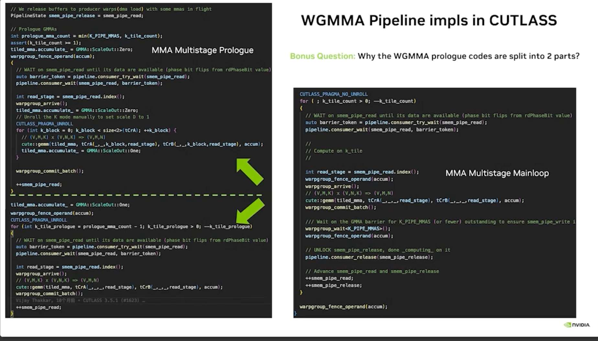

여기서 한 가지 질문이 제기된다. CUTLASS wgmma 구현이 왜 prologue를 두 단계로 나누는가?

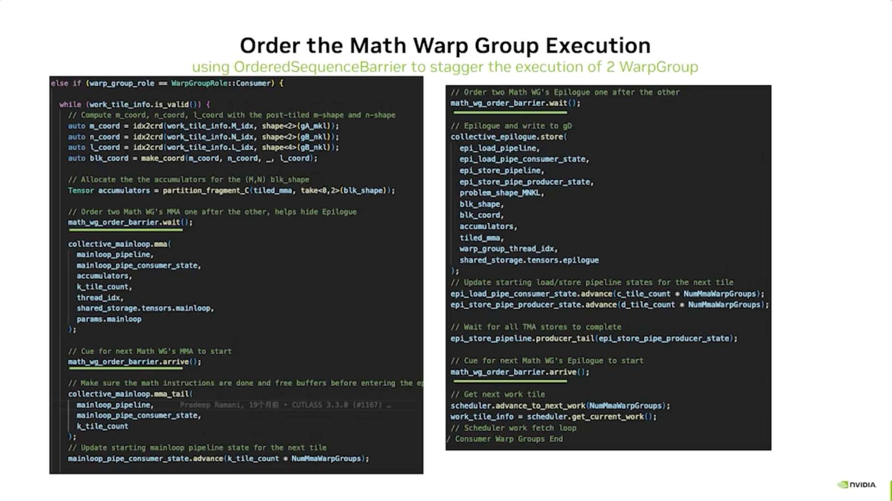

이 Slides는 `OrderedSequenceBarrier` 메커니즘을 활용하여 두 Warp Group의 계산 작업을 인터리브(stagger)하는 방법을 상세히 보여준다. GPU에서 행렬 곱셈 누산(MMA) 연산을 최적화하기 위한 것이다. 왼쪽 코드 조각은 주로 소비자(Consumer) 역할이 주 루프(Mainloop)에서 실행 흐름을 설명한다. `while (work_tile_info.is_valid())` 루프로 유효한 계산 tile을 계속 처리하고, 현재 작업 tile 정보와 전역 행렬 형태에 따라 M, N, L 차원과 블록 좌표를 계산하며, MMA 연산을 위해 텐서 누산기를 할당한다. 그런 다음 `math_wg_order_barrier.wait()`로 이전 Warp Group의 MMA 연산이 완료되기를 기다려 두 Warp Group의 MMA 연산 인터리브를 구현한다. 이는 Epilogue 단계의 지연을 숨기는 데 도움이 된다. 이어서 `collective_mainloop.mma(...)` 핵심 행렬 곱셈 누산 연산을 실행하고, 완료 후 `math_wg_order_barrier.arrive()`로 배리어에 알려 다음 Warp Group이 MMA 연산을 시작할 수 있도록 한다. 이어서 `collective_mainloop.mma_tail(...)`로 수학 명령어가 완료되고 버퍼가 해제되어 Epilogue 단계 진입을 준비한다. 마지막으로 `mainloop_pipe_consumer_state.advance(...)`로 주 루프 파이프라인의 소비자 상태를 업데이트한다. 오른쪽 코드 조각은 Epilogue 단계와 스케줄러 로직에 초점을 맞춘다. `math_wg_order_barrier.wait()`로 이전 Warp Group의 Epilogue 연산이 완료되기를 기다려 Epilogue 단계의 인터리브를 구현하고, `collective_epilogue.store(...)`로 누산기의 결과를 global memory에 저장한다. `epi_load_pipe_consumer_state.advance(...)`와 `epi_store_pipe_producer_state.advance(...)`로 로드와 저장 파이프라인의 상태를 업데이트하고, `epi_store_pipeline.producer_tail(...)`로 TMA를 통한 모든 저장 연산이 완료되었음을 확인한다. `math_wg_order_barrier.arrive()`로 배리어에 알려 다음 Warp Group이 Epilogue 연산을 시작할 수 있도록 하고, 마지막으로 `scheduler.advance_to_next_work(...)`와 `work_tile_info = scheduler.get_current_work()`로 스케줄러에서 다음 처리할 작업 tile을 가져온다. 이 설계는 `OrderedSequenceBarrier`라는 동기화 메커니즘을 통해 두 Warp Group의 MMA 계산과 Epilogue 저장 단계의 실행을 정밀하게 제어하고 인터리브한다. 파이프라인화 처리로 서로 다른 단계의 지연을 숨기고, GPU 계산 리소스(특히 Tensor Core)가 지속적으로 바쁜 상태를 유지하여 전체 처리량을 극대화하는 것을 목표로 한다.
