# GPU 메모리 시스템 발전：대역폭 이용률 극대화와 레이턴시 은닉 기술 경로

> Slides는 BiliBili NVIDIA 영인버다 채널에 업로드된 NVIDIA AI 기술 오픈 데이 2025 초여름 《GPU 메모리 시스템 발전: 대역폭 이용률 극대화와 레이턴시 은닉의 기술 경로》 영상 강연에서 가져왔다. 영상을 참고하여 각 Slides의 요점을 더 자세히 기록하였으며, 학습 자료로 활용한다.

**이 강연은 현대 GPU 메모리 시스템 발전에서 직면한 핵심 도전과 해결책을 심층 분석한다. GPU 아키텍처가 V100에서 H100, H200, B200으로 발전함에 따라 메모리 대역폭이 크게 향상되었지만, SM당 사용 가능한 대역폭이 증가하면서 전통적인 단순 kernel이 하드웨어 성능을 충분히 활용하기 점점 더 어려워지고 있다. 강연은 Little's Law를 기반으로 "in-flight 바이트 수"의 핵심 역할을 설명하고, 세 가지 기술 경로를 체계적으로 소개한다: ILP(명령어 수준 병렬)와 DLP(데이터 수준 병렬)를 통해 in-flight 데이터를 늘리는 방법, cp.async에서 TMA까지의 비동기 로드 기술을 통해 더 효율적인 메모리 접근을 구현하는 방법, 소규모 문제 특유의 kernel 시작 레이턴시 병목에 대해 CUDA Graph, 프로그래밍 의존 시작(PDL) 등 혁신 기술 조합을 제안하는 방법. 이러한 최적화 전략은 새 아키텍처에서 왜 더 복잡한 프로그래밍 기법이 필요한지 설명할 뿐만 아니라, 개발자가 서로 다른 규모의 문제에서 최적의 메모리 최적화 방안을 선택하기 위한 명확한 의사결정 프레임워크와 실천 지침을 제공한다.**

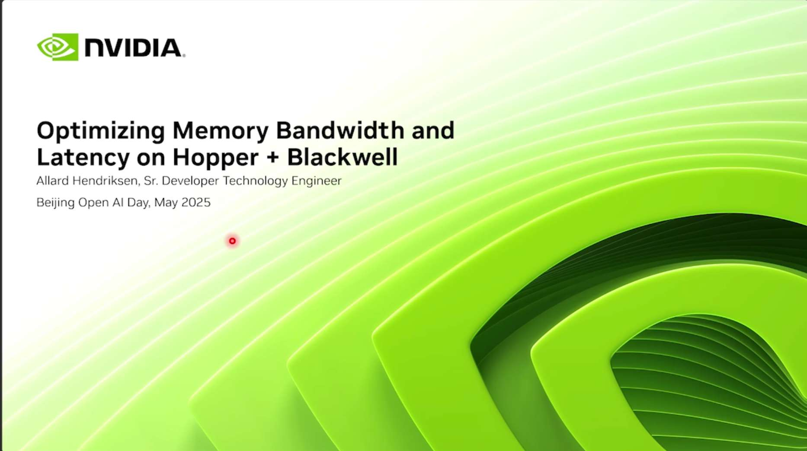

이 그림은 NVIDIA AI 기술 오픈 데이 2025 초여름 활동의 강연 표지를 보여주며, 주제는 "GPU 메모리 시스템 발전: 대역폭 이용률 극대화와 레이턴시 은닉의 기술 경로"다.

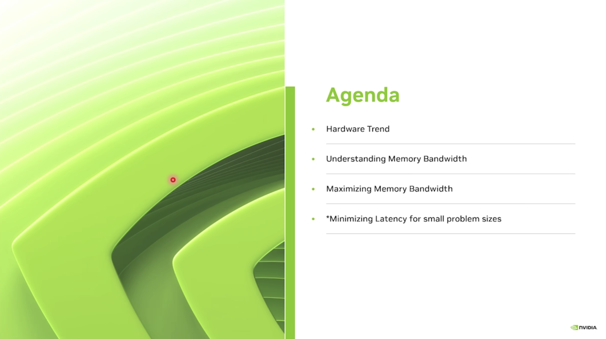

이 그림은 GPU 메모리 시스템의 기술 아키텍처와 발전 경로를 보여주며, 이 강연의 목차다. 하드웨어 발전 추세, 메모리 대역폭 이해, 메모리 대역폭 극대화, 소규모 문제에서의 레이턴시 은닉이 포함된다.

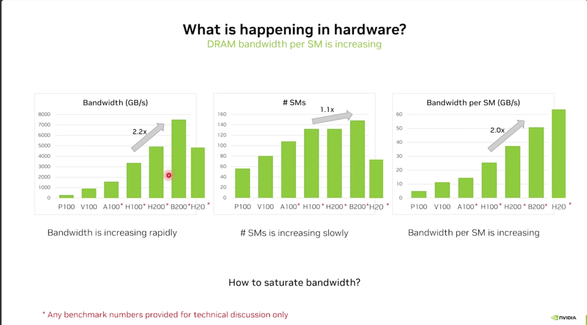

이 그림은 GPU 하드웨어 발전 추세 분석을 보여주며, 서로 다른 세대 GPU 아키텍처의 메모리 대역폭 비교, SM 수 비교, SM당 메모리 대역폭 비교를 포함한다.

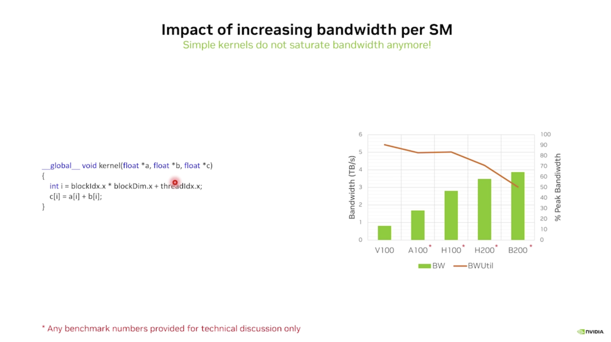

이 그림은 SM당 사용 가능한 대역폭이 지속적으로 증가함에 따라 단순 kernel이 더 이상 대역폭을 포화시키기 어려워진다는 것을 보여준다. 녹색 막대는 세대별 대역폭(V100→A100→H100→H200→B200)이 상승하는 것을 보여주고, 주황색 곡선 "BWUtil"은 이용률이 하락하는 것을 보여준다. 즉, 단순 kernel은 새 아키텍처에서 점점 더 피크 대역폭에 도달하기 어려워진다.

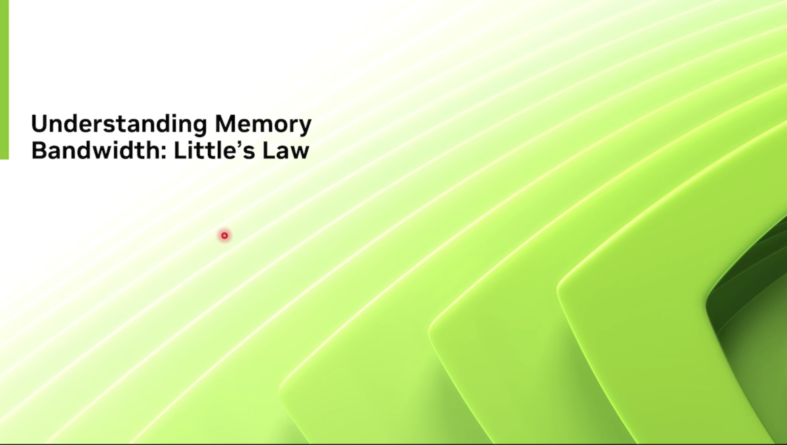

메모리 대역폭 이해를 위해 Little's Law를 살펴본다.

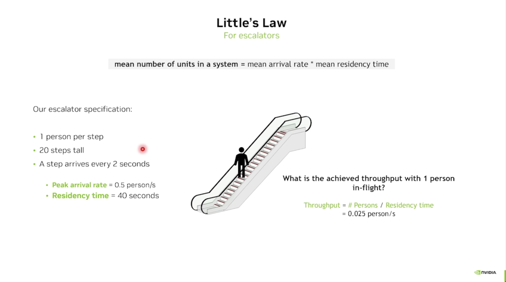

이 Slides는 "Little's Law(소 법칙)"를 사용하여 "in-flight 양"이 처리량을 결정한다고 설명한다. 공식: 시스템 평균 in-flight 수 L = 도착률 λ × 체류 시간 W; 동등하게, 안정적인 처리량 X = L / W.

에스컬레이터 예시:
- 매 2초마다 한 계단 → 피크 도착률 λ_peak = 0.5명/초
- 총 20 계단 → 체류 시간 W = 20×2 = 40초
- 에스컬레이터에 1명만 있다면: X = 1 / 40 = 0.025명/초(피크보다 훨씬 낮다)
- 피크 0.5명/초를 달성하려면 L = W×λ = 40×0.5 = 20명이 동시에 in-flight 상태여야 한다(각 계단마다 사람이 있어야 한다)

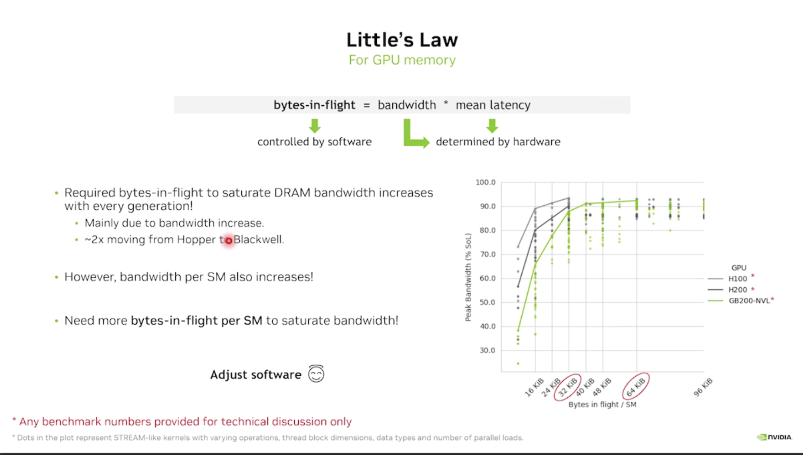

bytes-in-flight = bandwidth × mean latency. 하드웨어는 대역폭과 레이턴시가 정해져 있으며, 소프트웨어는 "in-flight 바이트 수"를 이 수준까지 쌓아야 대역폭을 포화시킬 수 있다. ≈90% 피크 대역폭을 달성하려면 H100의 각 SM은 ≈32KB의 bytes-in-flight가 필요하고, H200/GB200은 ≈64KB/SM이 필요하다. 새 아키텍처에서 메모리 대역폭을 포화시키려면 각 SM에서 더 많은 "in-flight 데이터"를 생성해야 한다.

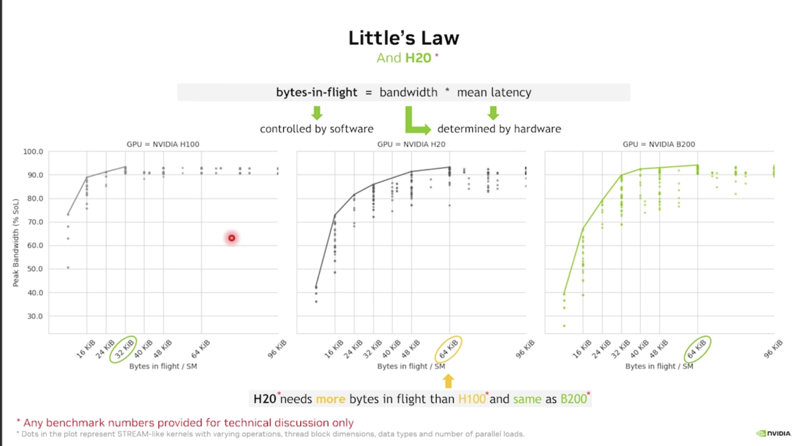

이 그림은 H20의 상황을 특별히 추가하여 보여준다. H100은 약 32KB/SM일 때 포화에 가까워지고(≈90%+), H20은 더 많은 in-flight 바이트가 필요하여 약 64KB/SM일 때 포화에 가까워진다. B200도 H20과 유사하여 약 64KB/SM이다. 전반적으로 H20은 H100보다 더 높은 bytes-in-flight가 있어야 메모리 대역폭을 포화시킬 수 있으며, B200과 거의 동등하다.

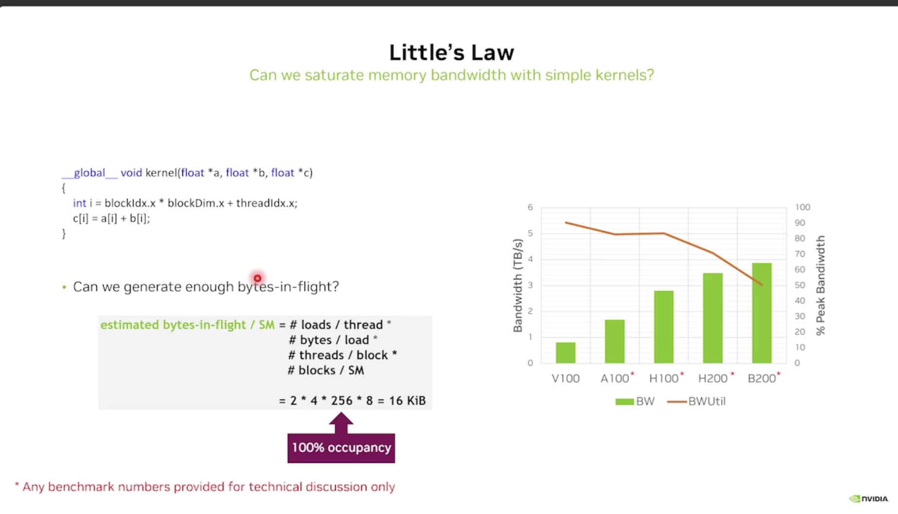

Little's Law를 사용하여 "단순 kernel이 메모리 대역폭을 포화시킬 수 있는가?"를 판단할 수 있는가?

먼저 in-flight 바이트 수/SM을 추정한다. estimated bytes-in-flight/SM = (#loads/thread) × (#bytes/load) × (#threads/block) × (#blocks/SM). 벡터 덧셈의 경우: 2 × 4 × 256 × 8 = 16 KiB/SM(100% 점유율 가정).

새 아키텍처에서 피크에 가까워지려면 ≈32–64 KiB/SM이 필요하다. 16 KiB는 명확히 부족하므로 단순 kernel은 대역폭을 포화시키기 어렵다. 오른쪽 그림은 실제 대역폭이 증가하지만 단순 kernel의 이용률은 하락하는 것을 보여준다.

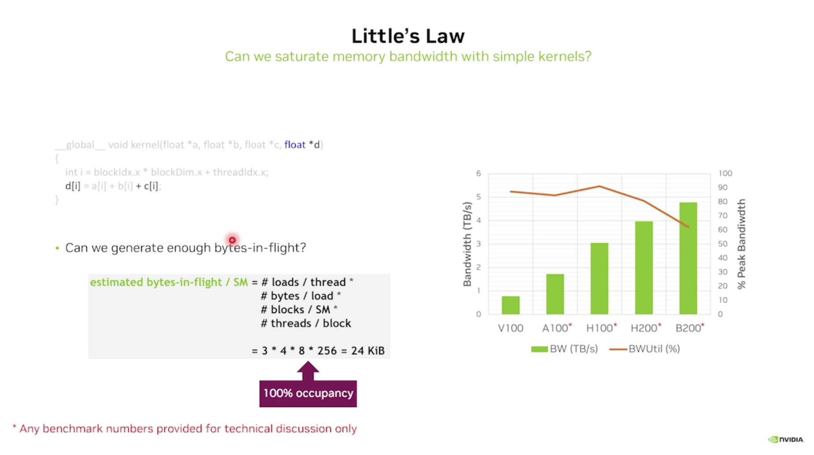

각 스레드의 부하를 2에서 3으로 늘리면 kernel의 대역폭 이용률이 증가하는 것을 볼 수 있다. 그러나 이렇게 하면 문제가 바뀌어 버린다. 이를 범용적으로 해결하려면 어떻게 해야 하는가?

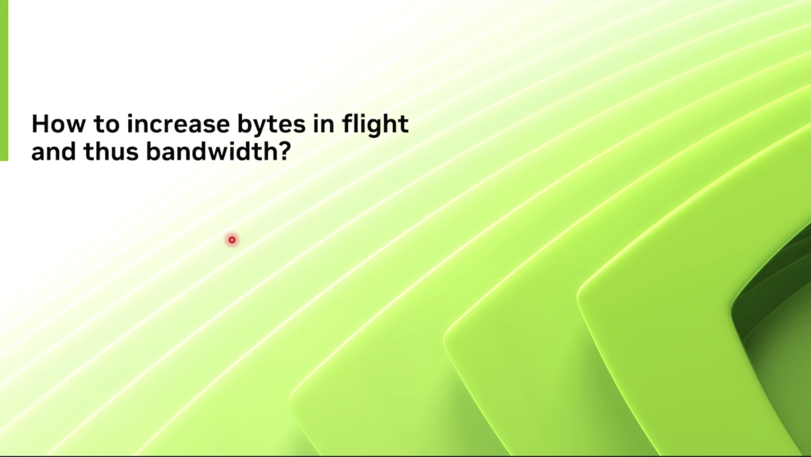

in-flight 데이터와 대역폭을 늘리는 방법은 무엇인가?

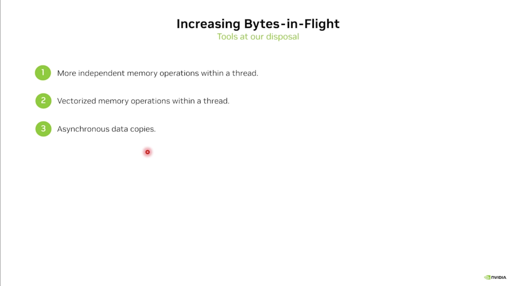

여기서는 in-flight 바이트를 늘려 대역폭을 포화시키는 세 가지 범용 수단을 보여준다.

세 가지 도구:
- 단일 스레드에서 더 많은 독립 메모리 연산: 스레드당 여러 요소 처리, 루프 언롤, 병렬 로드 추가(ILP 향상).
- 벡터화 메모리 연산: float4/uint4 등 사용, 합병 접근, 단일 트랜잭션으로 더 많은 바이트를 옮기고 명령어를 줄인다.
- 비동기 데이터 복사: cp.async/TMA를 사용하여 shared 메모리로 프리페치, 이중/삼중 버퍼링, 로드와 계산을 중첩시킨다.

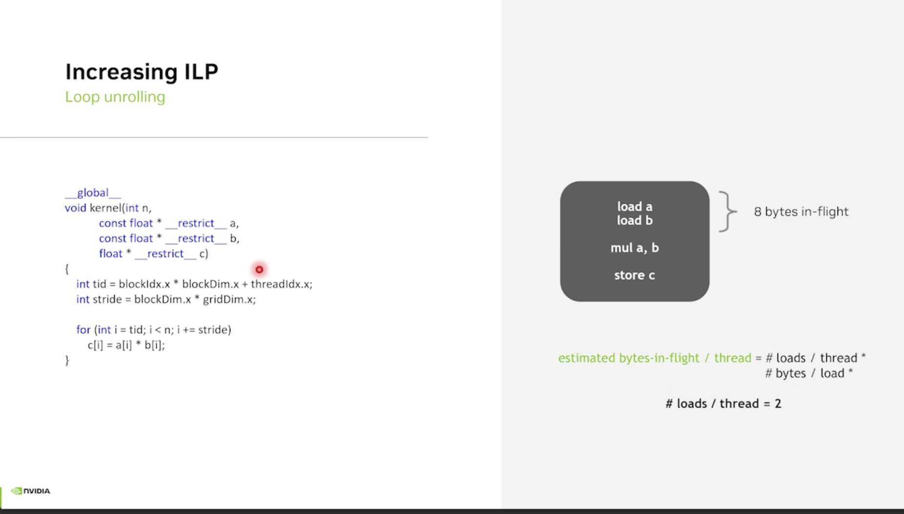

목표는 ILP(명령어 수준 병렬)를 높여 "in-flight 바이트 수"를 늘림으로써 메모리 대역폭 상한에 더 가까이 가는 것이다. 이 kernel은 반복마다 스레드당 두 번의 전역 로드를 시작한다: load a, load b, 그런 다음 mul, store c. 스레드당 in-flight 바이트 수 추정: #loads/thread × bytes/load = 2 × 4B = 8B. ILP가 낮아 메모리 레이턴시를 숨기기 어렵다.

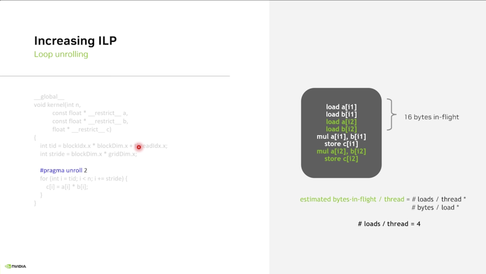

`#pragma unroll 2` 또는 수동 언롤을 통해, 하나의 스레드가 사용 전에 두 쌍의 독립 로드를 먼저 시작하도록 한다: `a[i1], b[i1], a[i2], b[i2]`, 그런 다음 두 번의 계산과 쓰기를 수행한다.
스레드당 in-flight 바이트 수가 두 배로 추정된다: #loads/thread = 4, 4 × 4B = 16B. in-flight 요청이 더 많아 대역폭 이용률이 높아진다.

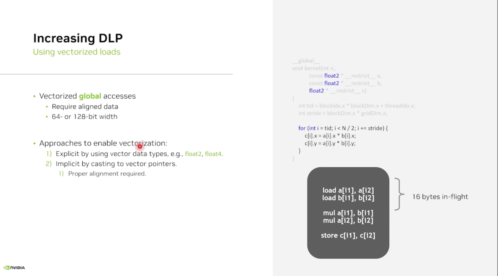

또 다른 기법은 "벡터화 전역 메모리 접근"으로 DLP/bytes-in-flight를 향상시켜 피크 대역폭에 더 가까이 가는 것이다. 이것은 잘 알려진 기법으로, 벡터 타입을 명시적으로 사용할 수 있다: float2, float4(64/128bit 트랜잭션에 해당). 또는 스칼라 포인터를 벡터 포인터로 강제 형 변환할 수 있으며, 이 경우 주소가 8/16B에 정렬되어야 한다. 오른쪽 예시: 스레드당 한 번에 `a[i1],a[i2]`와 `b[i1],b[i2]`를 읽어 두 번 계산하고 두 번 기록 → 한 반복에 16B 데이터가 in-flight 상태이고 명령어/트랜잭션이 적다. 정렬과 경계 처리(`N%2`, `N%4`의 꼬리 부분), 레지스터 압박이 발생할 수 있다는 점을 주의해야 한다. `__restrict__`는 컴파일러 최적화에 도움이 된다.

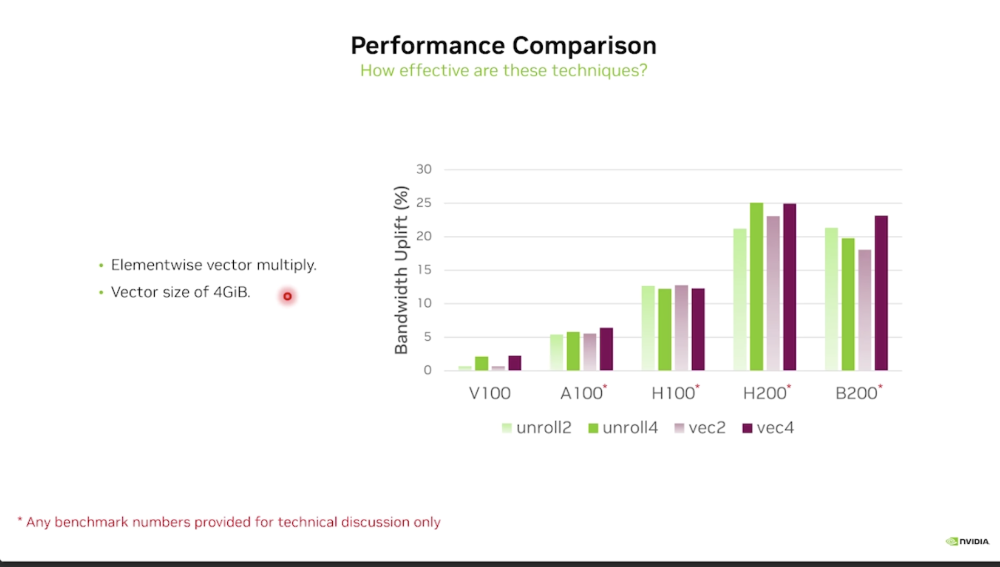

여기서는 unroll과 vectorize 벤치마크 비교를 보여준다. 기준은 요소별 곱셈(elementwise vector multiply)이며, 데이터 양은 4GiB다. 서로 다른 수단이 대역폭을 얼마나 향상시키는지(스칼라, 언롤 없는 기준선 대비) 비교한다. 녹색은 루프 언롤 `unroll2/4`, 분홍/보라는 벡터화 `vec2/vec4`(64/128bit 트랜잭션)다.

세대가 새로울수록 효과가 크다: V100은 ≈1-2%에 불과하고, A100은 ≈5-6%, H100은 ≈12-13%, H200은 ≈21-25%, B200은 ≈18-23%다. H200/B200에서 vec4 ≈ 최적(약 25%/23%), unroll4가 그다음이며, 구형 아키텍처에서는 차이가 작다.

따라서 새 아키텍처에서 대역폭을 포화시키려면 `bytes-in-flight`를 늘리는 것에 더 의존해야 한다. 먼저 128bit 벡터화를 시도하고(정렬 보장), 적당한 unroll을 배합하되 레지스터와 점유율의 트레이드오프에 주의해야 한다.

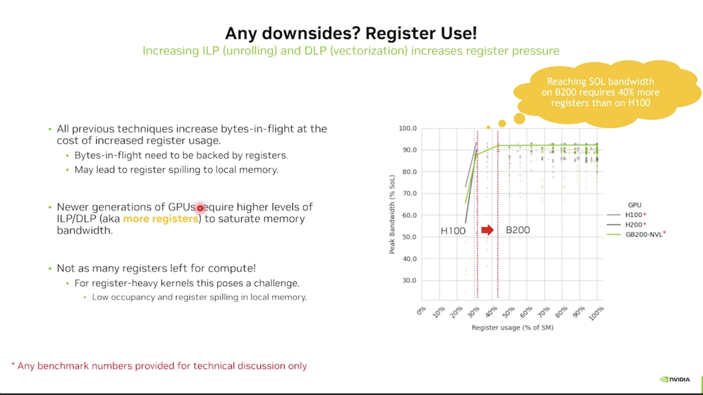

ILP(명령어 수준 병렬/언롤)와 DLP(데이터 수준 병렬/벡터화)를 높이면 레지스터 압박이 증가한다. 오른쪽 차트는 서로 다른 GPU 세대(H100, H200, GB200-NVL)에서 레지스터 사용률과 피크 대역폭 사이의 관계를 보여주며, B200에서 SOL 대역폭에 도달하려면 40%의 레지스터를 사용해야 한다고 명시하고 있다.

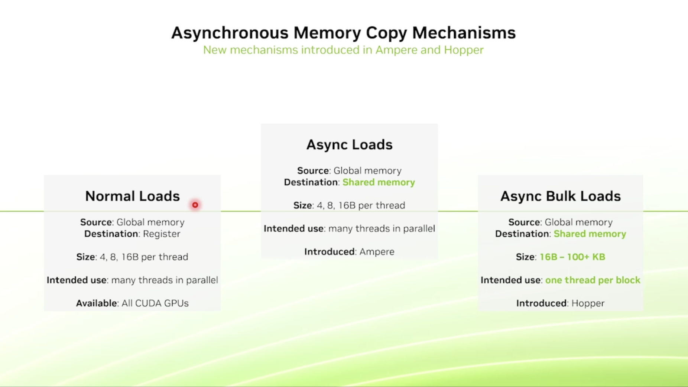

GPU 메모리 복사 메커니즘의 발전을 소개한다. 전통적인 일반 로드(전역 메모리에서 레지스터)에서 Ampere 아키텍처에 도입된 비동기 로드(전역 메모리에서 공유 메모리, 멀티스레드 병렬 지원)로, 다시 Hopper 아키텍처의 비동기 벌크 로드(16B에서 100+KB의 대형 블록 데이터 전송 지원, 블록당 하나의 스레드만 필요)로의 발전을 보여주며, NVIDIA가 메모리 접근 효율성을 높이고 스레드 오버헤드를 줄이는 기술 발전을 나타낸다.

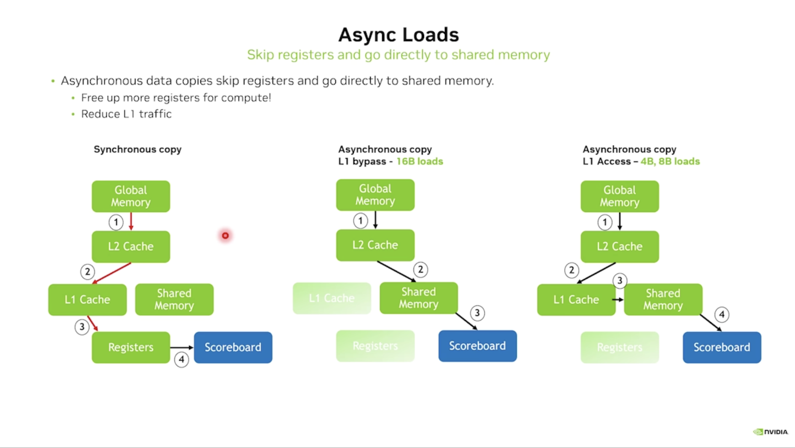

비동기 로드(Async Loads) 기술의 작동 원리와 장점을 계속 설명한다: 레지스터를 건너뛰어 전역 메모리에서 공유 메모리로 직접 데이터를 전송함으로써 계산에 사용할 귀중한 레지스터 리소스를 절약하고 L1 캐시 트래픽 부담을 줄인다. 전통적인 동기 복사(레지스터를 통한 중계)와 비교하여, 비동기 복사는 두 가지 모드를 제공한다: L1 우회 모드와 L1 접근 모드, 더 효율적인 메모리 데이터 전송을 구현한다.

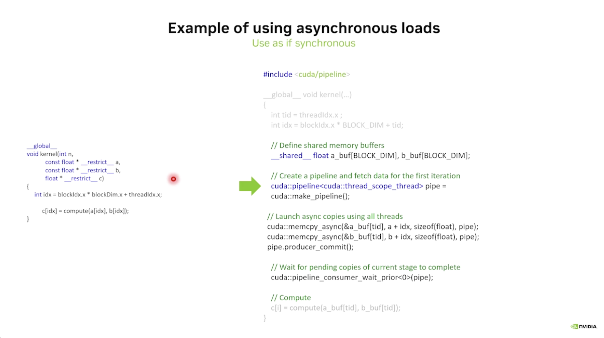

이 Slides는 전통적인 동기 메모리 접근 코드(왼쪽의 단순 kernel)를 비동기 로드 버전(오른쪽)으로 어떻게 재작성하는지 보여준다: CUDA pipeline 메커니즘을 도입하고 `cuda::memcpy_async`를 사용하여 전역 메모리 데이터를 공유 메모리 버퍼로 비동기적으로 복사한다. `producer_commit`과 `consumer_wait_prior`를 통해 동기화를 제어함으로써, 코드 논리의 유사성을 유지하면서 더 효율적인 메모리 접근 패턴을 구현한다.

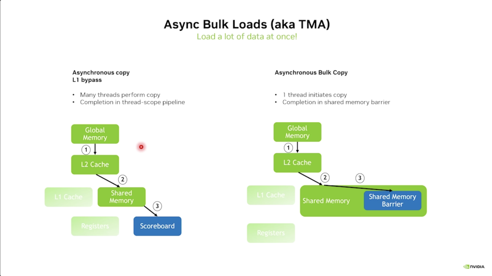

이 Slides는 비동기 벌크 로드(TMA)와 일반 비동기 로드의 차이를 비교한다: 일반 비동기 로드는 여러 스레드가 복사에 참여하고 스레드 범위 pipeline에서 동기화를 완료해야 하지만, TMA는 하나의 스레드만 복사 연산을 시작하면 되고 공유 메모리 배리어를 통해 동기화 제어를 완료하여, 더 효율적인 대형 블록 데이터 전송을 구현하고 스레드 조정 오버헤드를 줄인다.

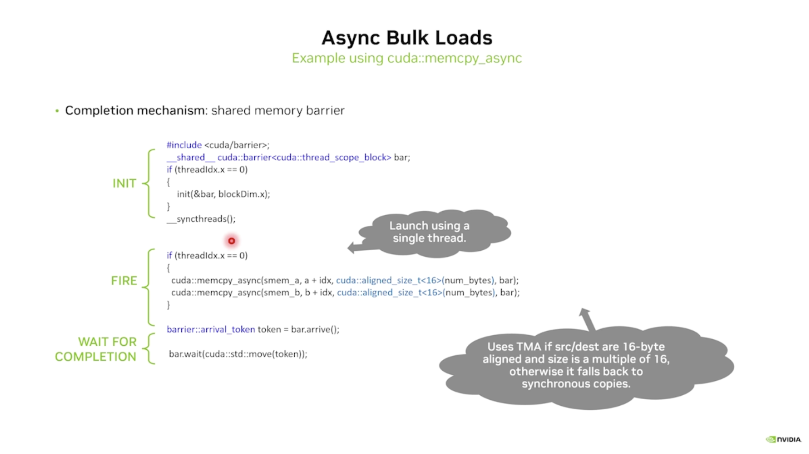

여기서는 Async Bulk Loads의 코드 예시 구현을 보여준다: `cuda::memcpy_async`를 통해 단일 스레드만으로 대형 블록 데이터 복사를 시작할 수 있으며, 공유 메모리 배리어(`cuda::barrier`)를 사용하여 완료 동기화를 제어한다. 소스/대상 주소가 16바이트로 정렬되어 있고 크기가 16의 배수일 때 TMA 하드웨어 가속이 자동으로 사용되며, 그렇지 않으면 동기 복사로 폴백된다.

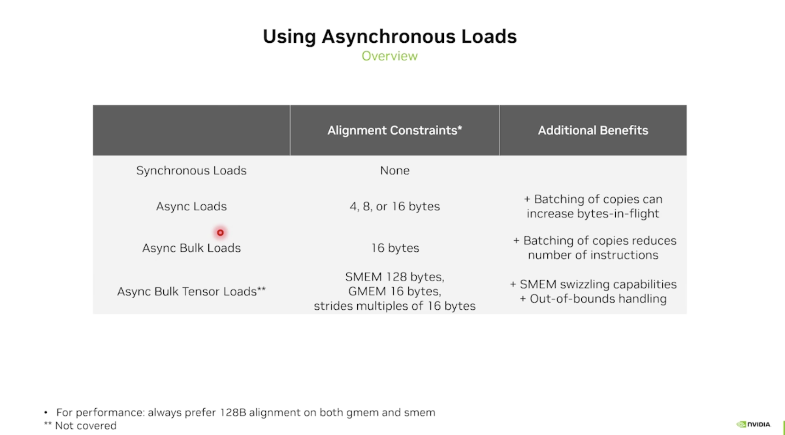

이 Slides는 네 가지 GPU 메모리 로드 방식과 그 특성을 자세히 비교한다:
- 동기 로드(Synchronous Loads): 정렬 제약 없음, 추가 이점 없음, 가장 기본적인 로드 방식.
- 비동기 로드(Async Loads): 4, 8 또는 16바이트 정렬 필요, 추가 이점은 배치 복사로 in-flight 바이트 수를 늘려 메모리 대역폭 이용률을 높인다.
- 비동기 벌크 로드(Async Bulk Loads): 16바이트 정렬 필요, 추가 이점은 배치 복사로 명령어 수를 줄여 명령어 오버헤드를 낮추고 효율성을 높인다.
- 비동기 벌크 텐서 로드(Async Bulk Tensor Loads): 정렬 요건이 가장 엄격하다(SMEM은 128바이트, GMEM은 16바이트, 스트라이드는 반드시 16바이트의 배수). 추가 이점이 가장 풍부하다: SMEM 교환 능력 및 경계 처리, 더 복잡한 메모리 접근 패턴 지원.
- 표 하단에서 특별히 강조한 것: 최상의 성능을 위해 전역 메모리와 공유 메모리 모두 128바이트 정렬된 방안을 항상 우선 선택해야 한다.

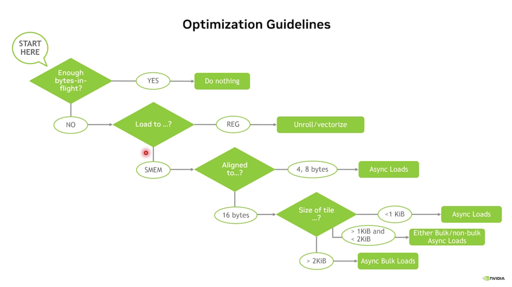

이 Slides는 GPU 메모리 최적화의 의사결정 흐름도를 보여주며, 개발자가 구체적인 상황에 따라 최적의 메모리 접근 전략을 선택하도록 안내한다: "START HERE"에서 시작하여 현재 in-flight 바이트 수가 충분한지 먼저 판단한다. 충분하다면 최적화가 필요 없고, 부족하다면 데이터 로드 대상이 레지스터(REG)인지 공유 메모리(SMEM)인지를 판단한다. 레지스터를 선택하면 언롤/벡터화 최적화를 수행하고, 공유 메모리를 선택하면 정렬 방식과 데이터 블록 크기를 더 고려해야 한다: 4/8바이트 정렬이면 비동기 로드를 사용하고, 16바이트 정렬이면 타일 크기에 따라 전략을 선택한다(1KB 미만이면 일반 비동기 로드, 1-2KB 사이면 벌크 또는 비벌크 비동기 로드를 선택할 수 있고, 2KB 초과이면 비동기 벌크 로드를 사용한다). 이 의사결정 트리는 개발자가 현재 시나리오에 가장 적합한 메모리 최적화 기술을 체계적으로 선택하는 데 도움을 준다.

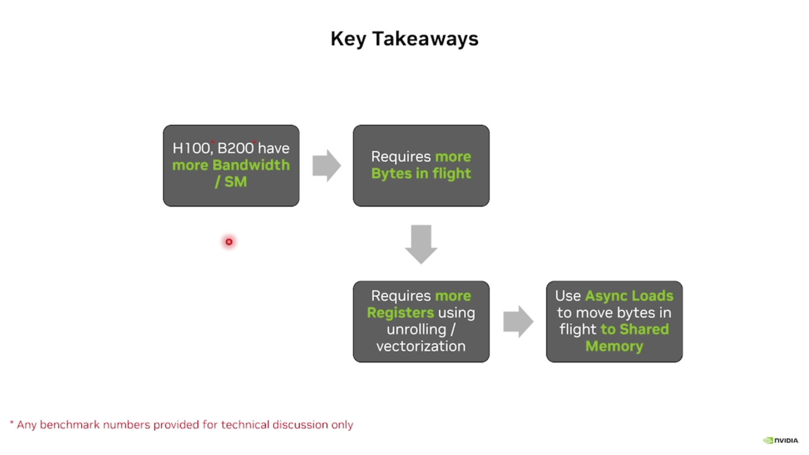

H100, B200 등 신세대 GPU는 더 높은 대역폭 밀도(각 SM당 더 큰 대역폭)를 갖게 되면서, 이 대역폭을 충분히 활용하려면 메모리 레이턴시를 숨기기 위해 더 많은 in-flight 바이트 수가 필요하다. 전통적인 언롤/벡터화 방법으로 in-flight 바이트 수를 늘리면 대량의 레지스터 리소스를 소비하게 되고, 레지스터가 제한된 상황에서 병목이 된다. 따라서 해결책은 비동기 로드 기술을 채택하여 원래 레지스터에 저장된 in-flight 데이터를 공유 메모리로 이전하는 것이다. 이를 통해 메모리 대역폭을 포화시키기에 충분한 in-flight 바이트 수를 유지하면서도 귀중한 레지스터 리소스를 계산에 절약할 수 있다. 이것이 현대 GPU 아키텍처에서 메모리 최적화의 핵심 전략이다.

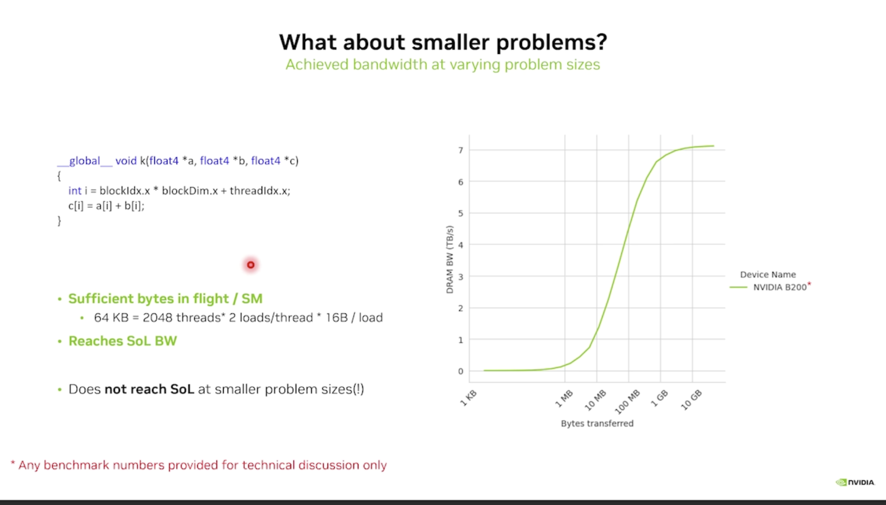

이 Slides는 소규모 문제가 GPU 메모리 최적화에서 직면하는 도전을 탐구한다: 왼쪽은 간단한 벡터 덧셈 kernel을 보여주며, 계산을 통해 각 SM에 충분한 in-flight 바이트 수가 있음을 알 수 있다(64KB = 2048스레드 × 스레드당 2번 로드 × 로드당 16B). 이론적으로는 속도 제한 대역폭(SoL BW)에 도달할 수 있어야 한다. 그러나 오른쪽의 성능 곡선 그림은 문제가 명확하게 드러낸다. 단일 SM 수준의 최적화가 이미 이루어졌다 하더라도 소규모 문제(데이터 전송량 100MB 미만)에서는 전체 시스템이 피크 대역폭에 도달할 수 없다. 문제 규모가 충분히 클 때(1GB 가까이 혹은 이상)만 실제로 DRAM 대역폭을 포화시켜 7TB/s의 피크에 도달할 수 있다. 이는 GPU 아키텍처에서 소규모 문제 특유의 효율성 병목을 드러내며, 메모리 최적화 기술이 중요하지만 문제 규모 자체도 성능에 영향을 미치는 핵심 요소임을 보여준다.

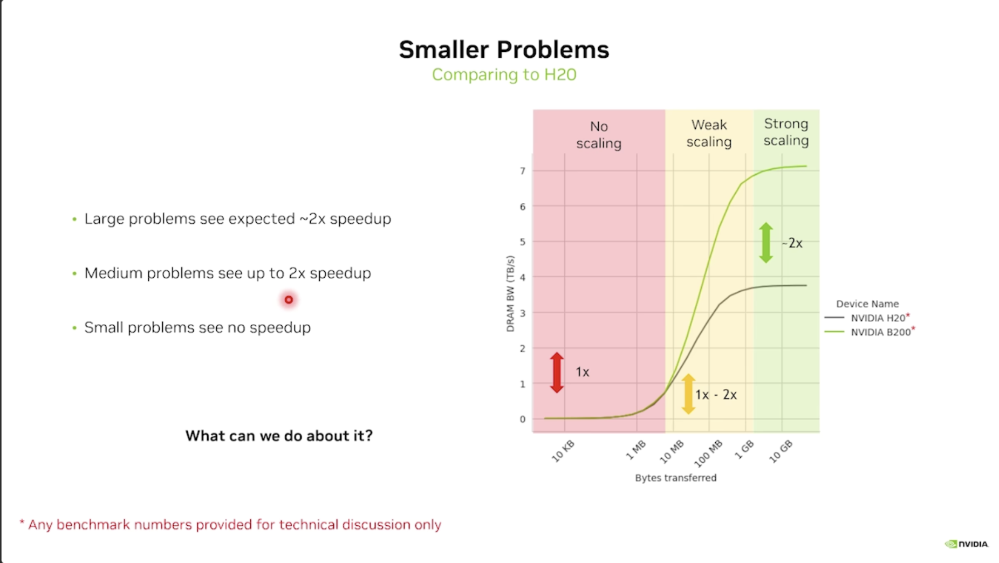

이 Slides는 B200과 H20이 서로 다른 규모의 문제를 처리할 때의 성능 차이를 비교하여, 중요한 확장성 문제를 드러낸다: 그림은 문제 규모를 세 영역으로 나눈다. 소규모 문제(빨간색 영역, 10KB-1MB 범위)는 성능 향상이 전혀 없고 두 세대 GPU 모두 비슷하게 피크 대역폭에 훨씬 미치지 못한다. 중규모 문제(노란색 영역, 1MB-100MB 범위)는 약한 확장 특성을 보이며 B200이 H20 대비 1배에서 2배의 성능 향상을 보인다. 대규모 문제(녹색 영역, 100MB 이상)만이 강한 확장 특성을 보이며 B200이 예상된 약 2배 성능 향상을 달성하여 7TB/s의 피크 대역폭을 충분히 활용한다. 이 분석은 신세대 GPU 하드웨어 능력이 크게 향상되었음에도, 소규모 문제는 GPU의 병렬 컴퓨팅 리소스와 메모리 대역폭 잠재력을 충분히 활성화할 수 없어 하드웨어 업그레이드로 인한 성능 향상이 미미함을 보여준다. 이에 "우리는 무엇을 할 수 있는가?"라는 핵심 질문을 제기하며, 소규모 문제의 성능 병목을 해결하기 위한 새로운 최적화 전략이 필요함을 암시한다.

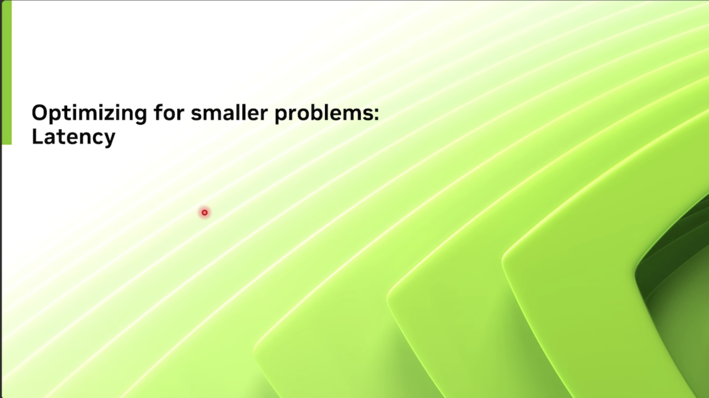

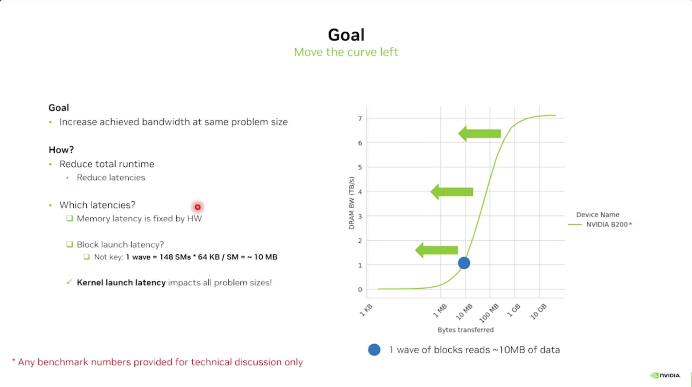

이 Slides는 소규모 문제 성능 최적화의 목표와 전략을 분석한다: 목표는 "곡선을 왼쪽으로 이동시키는 것", 즉 같은 문제 규모에서 실제로 달성하는 대역폭을 높이는 것이다. 총 실행 시간을 줄임으로써 이 목표를 달성하며, 총 실행 시간을 줄이려면 레이턴시를 타겟으로 낮춰야 한다. 레이턴시 분석에서 메모리 레이턴시는 하드웨어가 고정한 것으로 변경할 수 없다. 블록 시작 레이턴시는 존재하지만 핵심 요소가 아니다(단일 웨이브에 148개 SM × SM당 64KB ≈ 10MB 데이터가 필요하기 때문이며, 그림의 파란 점으로 표시된다). 진정한 핵심은 kernel 시작 레이턴시가 모든 문제 규모에 영향을 미친다는 것이다. 이것이 소규모 문제 성능을 제약하는 주요 병목이다. 따라서 최적화의 중점은 kernel 시작 오버헤드를 줄이는 것에 두어야 하며, 이를 통해 더 작은 데이터 전송량에서도 더 높은 대역폭 수준에 도달하는 성능 곡선을 만들어 그림의 녹색 화살표가 나타내는 성능 향상 효과를 실현할 수 있다.

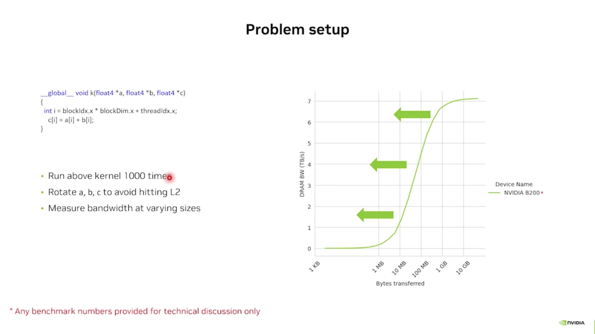

이 Slides는 소규모 문제 성능 병목을 연구하기 위한 실험 설정을 소개한다: 간단한 벡터 덧셈 kernel(왼쪽 코드)을 사용하며, 이 kernel은 세 개의 float4 포인터 파라미터를 받아 기본적인 요소별 덧셈을 수행한다. 실험 방법은 이 kernel을 1000회 실행하여 안정적인 성능 측정을 얻는 것이다. 동시에 a, b, c 배열을 교대로 사용하여 L2 캐시 히트로 인한 성능 간섭을 방지하고, 매번 실제 메모리 접근이 이루어지도록 한다. 그런 다음 서로 다른 데이터 규모에서 실제로 달성하는 대역폭 성능을 측정하여, 이 변수 통제 방법으로 kernel 시작 레이턴시가 서로 다른 문제 규모에 미치는 구체적인 영향을 정량화한다. 오른쪽의 성능 곡선 그림은 이 설정에서 B200 GPU의 대역폭 성능을 보여주며, 녹색 화살표가 가리키는 최적화 목표는 시작 오버헤드를 줄여 전체 성능 곡선을 왼쪽으로 이동시켜, 더 작은 데이터 전송량에서도 더 높은 유효 대역폭에 도달하는 것이다.

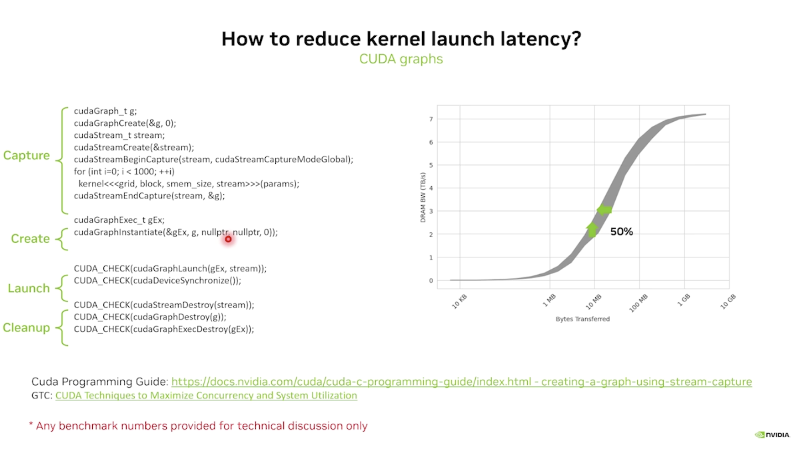

이 Slides는 CUDA Graph 기술을 사용하여 kernel 시작 레이턴시를 줄이는 해결책을 보여준다: 왼쪽 코드는 CUDA Graph의 전체 사용 흐름을 보여주며, 네 가지 핵심 단계를 포함한다. 캡처 단계(Capture)는 cudaStreamBeginCapture와 cudaStreamEndCapture를 통해 1000번의 kernel 호출 시퀀스를 그래프 구조로 기록한다. 생성 단계(Create)는 cudaGraphInstantiate를 사용하여 캡처된 그래프를 실행 가능한 그래프 인스턴스로 변환한다. 시작 단계(Launch)는 cudaGraphLaunch를 통해 전체 워크로드를 한 번에 제출하고 kernel을 하나씩 시작하지 않는다. 마지막 정리 단계(Cleanup)는 관련 리소스를 해제한다. 오른쪽 성능 곡선 비교 그림은 CUDA Graph 기술의 효과를 명확하게 보여주는데, 녹색 영역이 표시하는 50% 성능 향상은 kernel 호출을 일괄 제출하고 CPU-GPU 상호작용 오버헤드를 줄임으로써 실제로 소규모 문제의 대역폭 이용률을 크게 개선할 수 있음을 증명한다. 성능 곡선이 왼쪽으로 이동하여 더 작은 데이터 전송량에서도 더 높은 유효 대역폭에 도달한다. 이것이 소규모 문제 성능 병목을 해결하는 효과적인 기술 수단 중 하나다.

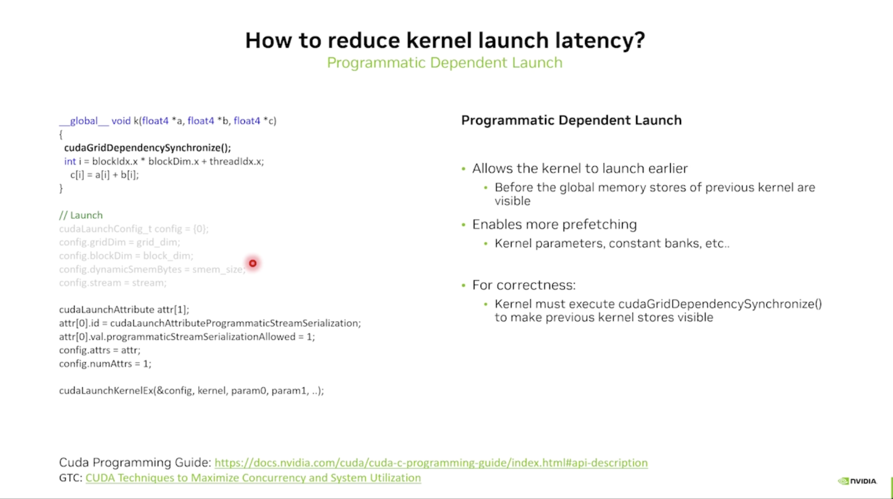

이 Slides는 kernel 시작 레이턴시를 줄이는 또 다른 기술을 소개한다: 프로그래밍 의존 시작(Programmatic Dependent Launch, PDL). 이것은 더 세밀한 최적화 방법이다. 왼쪽 코드는 구체적인 구현을 보여준다. kernel 함수에서 `cudaGridDependencySynchronize()`를 호출하여 이전 kernel의 전역 메모리 쓰기 연산이 현재 kernel에서 가시적이 되도록 해야 한다. 시작 설정에서는 `cudaLaunchAttributeProgrammaticStreamSerialization` 속성과 관련 파라미터를 설정하여 이 기능을 활성화한다. 오른쪽은 이 기술의 핵심 장점을 설명한다. kernel이 미리 시작될 수 있도록 하며, 즉 이전 kernel의 전역 메모리 저장 연산이 완전히 가시적이 되기 전에 실행을 시작할 수 있다. 이를 통해 더 많은 프리페치 연산(예: kernel 파라미터, 상수 저장 등)이 가능해져 시작 레이턴시를 더욱 은닉한다. 그러나 프로그램 정확성을 보장하기 위해 kernel은 이전 kernel이 쓴 데이터에 접근하기 전에 반드시 `cudaGridDependencySynchronize()`를 명시적으로 호출하여 동기화해야 한다. 이 기술은 CUDA Graph에 비해 더 정밀한 제어를 제공하며, 데이터 의존 관계의 정확성을 보장하면서 kernel 시작과 실행을 최대한 중첩시킬 수 있다.

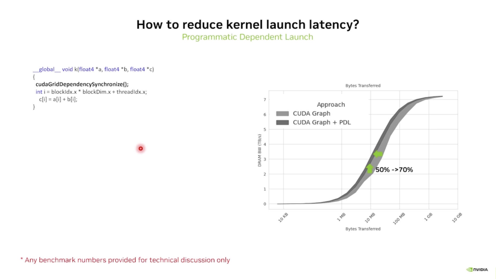

이 Slides는 CUDA Graph와 프로그래밍 의존 시작(PDL) 기술을 결합하여 사용했을 때 누적 성능 향상 효과를 보여준다: 왼쪽의 kernel 코드는 이전의 복잡한 시작 설정을 단순화하여, kernel 내부에서 cudaGridDependencySynchronize()만 호출하면 데이터 의존 관계를 처리할 수 있다. 오른쪽의 성능 비교 그림은 최적화의 점진적 효과를 명확하게 보여준다. 밝은 회색 곡선은 CUDA Graph만 사용한 성능을 나타내고, 진한 회색 곡선은 CUDA Graph+PDL의 조합 효과를 나타낸다. 녹색 영역이 표시하는 성능 향상은 CUDA Graph 단독 사용의 50%에서 50%→70%로 더 향상되었다. 이는 두 기술의 결합이 중첩 최적화 효과를 낸다는 것을 보여준다: CUDA Graph는 일괄 kernel 제출 오버헤드 문제를 해결하고, PDL은 미리 시작과 더 세밀한 의존 관계 관리를 통해 kernel 간 동기화 대기 시간을 더욱 줄인다. 최종적으로 더 현저한 소규모 문제 성능 개선을 달성하며, 시작 레이턴시를 체계적으로 줄임으로써 더 작은 데이터 전송량에서도 더 높은 유효 대역폭에 도달할 수 있음을 증명한다.

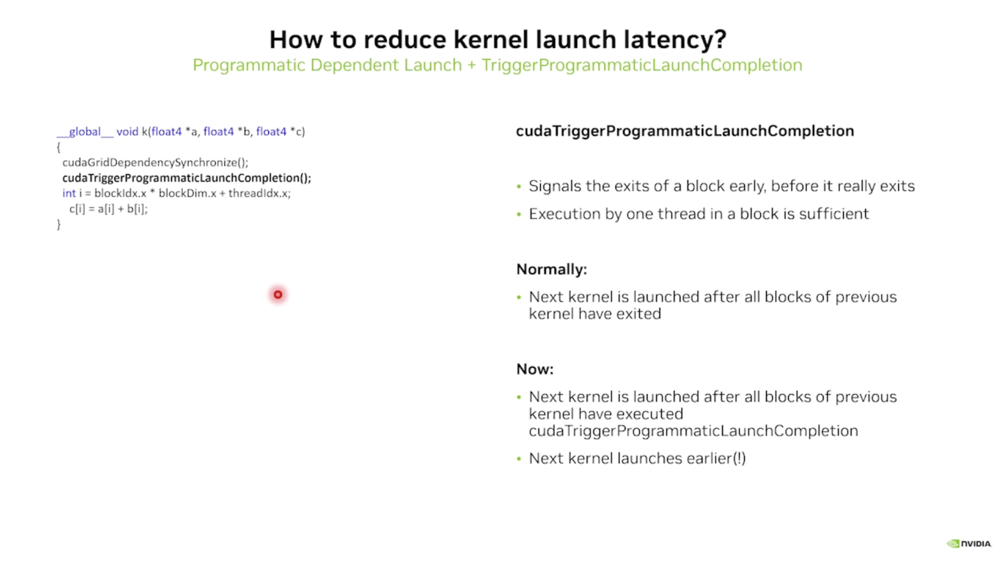

이 Slides는 kernel 시작 레이턴시 최적화의 최신 기술을 소개한다: PDL을 기반으로 `cudaTriggerProgrammaticLaunchCompletion` 함수 호출을 추가하여 더 세밀한 시작 제어를 구현한다. 왼쪽 코드는 kernel에서 먼저 `cudaGridDependencySynchronize()`를 호출하여 데이터 의존 관계를 보장한 다음, 즉시 `cudaTriggerProgrammaticLaunchCompletion()`을 호출하여 "조기 완료" 신호를 보내고, 마지막으로 실제 계산 작업을 수행한다는 것을 보여준다. 오른쪽은 이 기술의 핵심 메커니즘을 설명한다. 이 함수는 블록이 실제로 종료되기 전에 GPU 스케줄러에 완료 신호를 보낼 수 있게 하며, 블록의 스레드 중 하나만 이 호출을 실행하면 된다. 이를 통해 전통적인 kernel 간 동기화 모드를 변경한다: 정상적으로는 다음 kernel이 이전 kernel의 모든 블록이 실제로 종료된 후에야 시작될 수 있었지만, 이제 다음 kernel은 모든 블록이 `cudaTriggerProgrammaticLaunchCompletion()`을 실행하면 미리 시작될 수 있다. 이를 통해 계산과 다음 kernel 시작을 중첩시켜 kernel 간 유휴 대기 시간을 더욱 줄인다. 이것은 PDL 기술의 정밀화 확장이다.

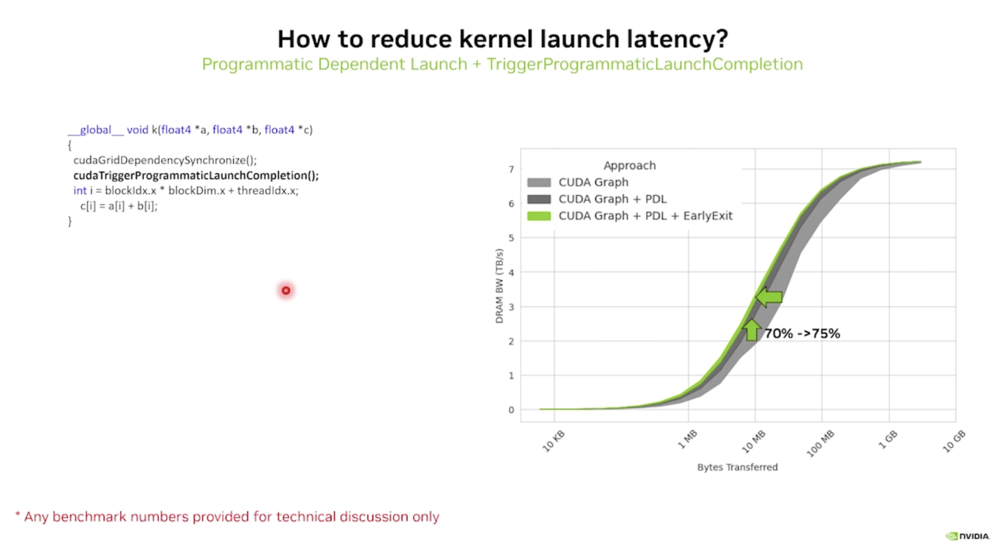

이 Slides는 완전한 kernel 시작 레이턴시 최적화 기술 스택의 최종 성능 효과를 보여준다: 왼쪽 코드는 모든 최적화 기술을 통합하여 `cudaGridDependencySynchronize()`로 데이터 의존 동기화를 처리하고 `cudaTriggerProgrammaticLaunchCompletion()`으로 조기 완료 신호를 보낸다. 오른쪽 성능 비교 그림은 점진적 최적화의 누적 효과를 명확하게 보여준다. 밝은 회색 곡선은 CUDA Graph만 사용한 기준 성능을 나타내고, 진한 회색 곡선은 CUDA Graph+PDL의 조합 효과를 보여주며, 녹색 곡선은 CUDA Graph+PDL+조기 종료(EarlyExit)의 최종 최적화 결과를 보여준다. 녹색 영역이 표시하는 성능 향상이 이전의 70%에서 75%로 더 높아졌다. `cudaTriggerProgrammaticLaunchCompletion()`이 가져오는 추가 5% 향상은 상대적으로 작지만, 이는 여러 시작 레이턴시 최적화 기술을 체계적으로 결합함으로써 현저한 누적 성능 개선을 달성할 수 있음을 보여준다. 최종적으로 소규모 문제에서도 GPU가 더 높은 유효 대역폭 이용률에 도달할 수 있음을 증명하며, 현대 GPU 성능 최적화에서 정밀화된 kernel 시작 제어의 중요한 가치를 보여준다.

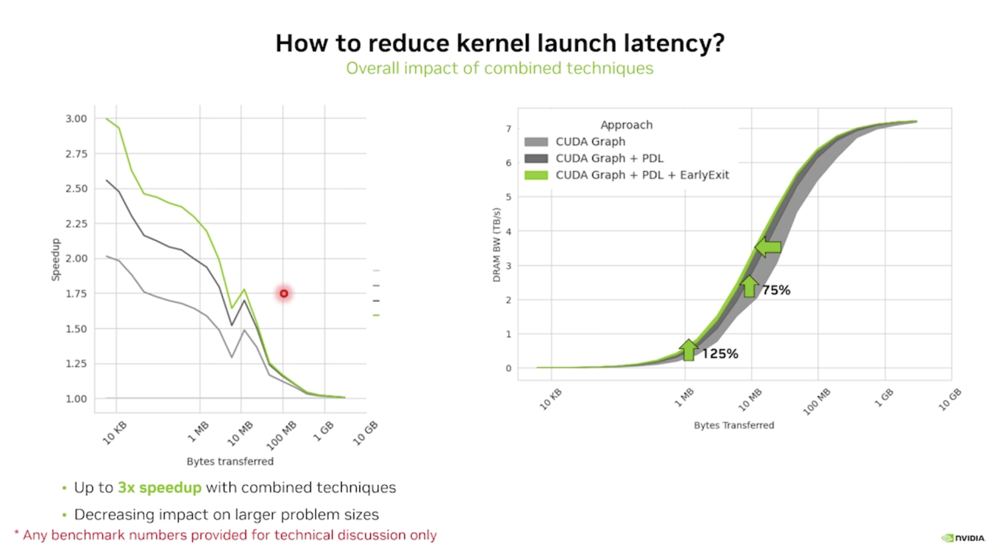

이 Slides는 이중 시각으로 조합 최적화 기술의 전체 효과를 포괄적으로 보여준다: 왼쪽의 가속비 차트는 서로 다른 데이터 전송 규모에서의 성능 향상 효과를 보여주며, 중요한 규칙을 드러낸다. 가장 작은 규모(10KB 정도)에서 세 가지 조합 최적화 기술은 최대 3배의 가속비를 달성할 수 있지만, 데이터 양이 증가할수록 가속 효과가 점차 감소하여 데이터 양이 1GB 이상에 도달하면 가속비가 1배(즉 향상 없음)에 가까워진다. 오른쪽의 DRAM 대역폭 차트는 다른 각도에서 동일한 최적화 효과를 확인한다. 소규모 데이터 전송에서 125%의 성능 향상을, 중규모에서도 75%의 향상을 달성한다. 이 비교는 kernel 시작 레이턴시 최적화 기술의 가치가 주로 소규모 문제에서 나타남을 명확하게 보여준다. 바로 전통적인 GPU 최적화 기술 효과가 제한되는 시나리오에서, CUDA Graph, PDL, 조기 종료의 조합 적용을 통해 소규모 문제의 성능 병목을 성공적으로 해결한다. 대규모 문제는 그 자체로 GPU 리소스를 충분히 활용할 수 있어 이러한 시작 최적화 기술의 한계 효과가 상대적으로 작으며, 이는 타겟 최적화의 중요한 의미를 보여준다.

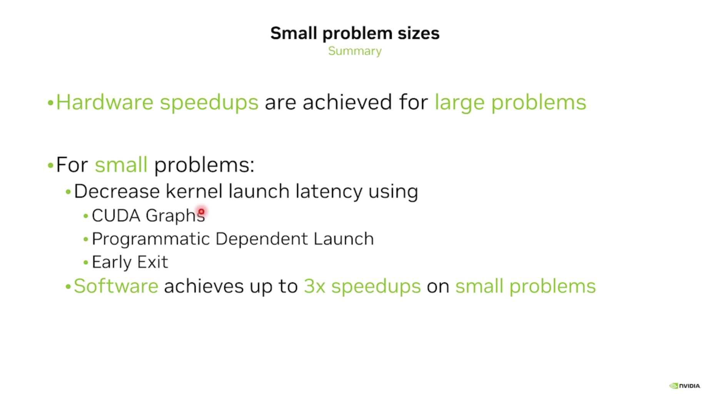

이 Slides는 소규모 문제 최적화 전략의 정제된 요약이다: 먼저 GPU 성능 최적화의 계층적 전략을 명확히 한다. 하드웨어 업그레이드는 대규모 문제에 효과적인데, 대규모 문제는 GPU의 병렬 컴퓨팅 리소스와 메모리 대역폭을 충분히 활성화할 수 있기 때문이다. 그러나 소규모 문제의 경우 핵심은 소프트웨어 기술을 통해 핵심 병목인 kernel 시작 레이턴시를 줄이는 것이다. 구체적으로 세 가지 계층적으로 점진하는 최적화 기술이 포함된다: CUDA Graph(일괄 제출로 CPU-GPU 상호작용 오버헤드 감소), PDL(kernel 간 세밀한 의존 제어와 미리 시작 구현), 그리고 조기 종료(조기 완료 신호를 보내 계산과 다음 kernel 시작의 시간 중첩 구현). 이러한 순수 소프트웨어 수준의 최적화 기술 조합을 통해 소규모 문제에서 최대 3배의 성능 향상을 달성할 수 있다. 이 요약은 중요한 관점을 강조한다: 현대 GPU 아키텍처에서 문제 규모가 자연스럽게 하드웨어 장점을 활용할 수 없을 때 정밀화된 소프트웨어 최적화 기술이 성능 격차를 메우는 핵심 수단이 되며, 특히 타겟 최적화의 가치와 중요성을 보여준다.
