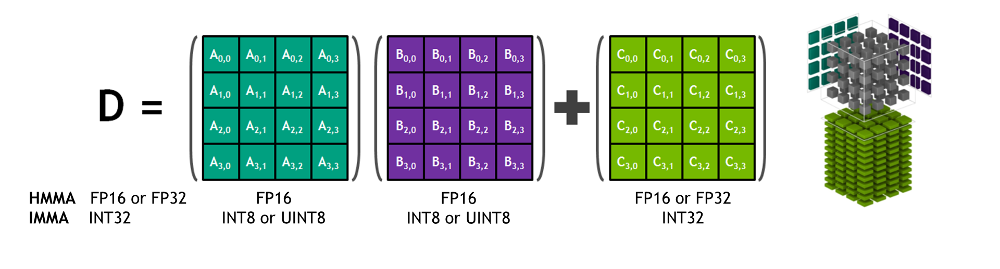
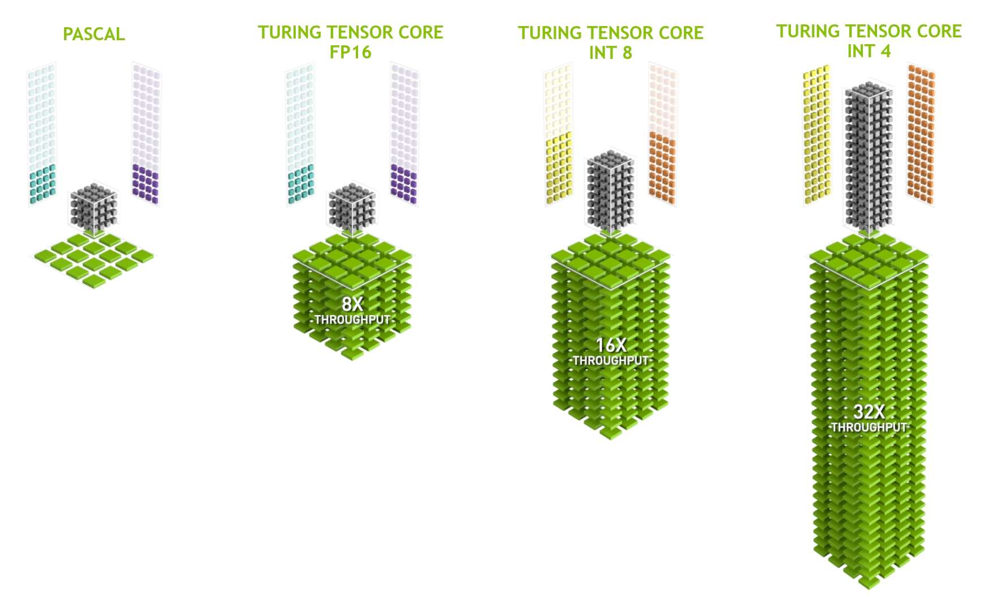
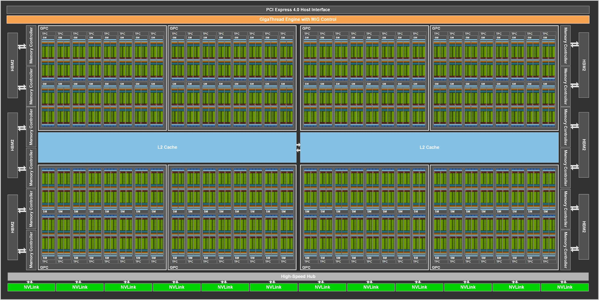
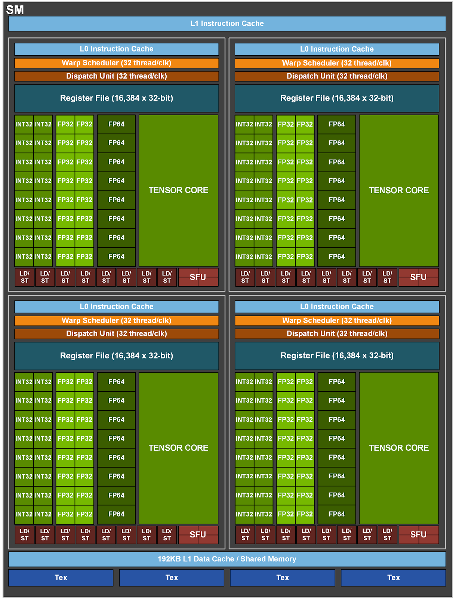

> 블로그 출처: https://leimao.github.io/blog/NVIDIA-Tensor-Core-Programming/ 이 글은 Lei Mao의 글이며, 저자의 전재 허가를 받았다.

# NVIDIA Tensor Core Programming

## 소개

NVIDIA Tensor Core는 Volta architecture 이후 NVIDIA GPU에서 general matrix multiplication(GEMM) operation을 위해 제공되는 dedicated accelerator이다. AI computation은 보통 GEMM operation이 지배하므로 NVIDIA Tensor Core는 AI application 가속에 매우 중요하다.



NVIDIA Tensor Core는 GEMM을 위해 특별히 설계되었기 때문에 NVIDIA Tensor Core를 사용하는 GEMM throughput은 general parallel programming에 더 적합한 NVIDIA CUDA Core로 달성할 수 있는 throughput보다 훨씬 높다.



NVIDIA Ampere architecture에서는 SM마다 4개의 Tensor Core가 있다. 특히 NVIDIA A100 GPU(https://www.nvidia.com/en-us/data-center/a100/)는 108개의 streaming multiprocessor(SM)를 가지며, 총 432개의 Tensor Core를 가진다.





NVIDIA Tensor Core는 완전히 programmable하다. Warp-level Tensor Core programming API는 `nvcuda::wmma` namespace 아래의 `mma.h` header file에 선언되어 있다.

## NVIDIA Tensor Core Programming

### Matrix Multiplication Decomposition

NVIDIA CUDA는 사용자가 warp level에서 Tensor Core GEMM operation을 program할 수 있게 한다. 각 Tensor Core는 data type별로 특정 작은 size의 matrix multiplication만 수행할 수 있지만(https://docs.nvidia.com/cuda/archive/12.0.1/cuda-c-programming-guide/#element-types-and-matrix-sizes), 이전 글 "CUDA Matrix Multiplication"(https://leimao.github.io/blog/CUDA-Matrix-Multiplication/)에서 논의했듯이 큰 GEMM은 여러 작은 GEMM과 accumulation operation으로 분해할 수 있다.

GEMM operation $D = AB + C$가 주어졌고 $D \in \mathbb{R}^{m \times n}$, $A \in \mathbb{R}^{m \times k}$, $B \in \mathbb{R}^{k \times n}$, $C \in \mathbb{R}^{m \times n}$일 때, matrix는 더 작은 matrix로 분해될 수 있다.

$$A = \begin{bmatrix}
A_{1,1}^{d \times d} & A_{1,2}^{d \times d} & \cdots & A_{1,k/d}^{d \times d} \\
A_{2,1}^{d \times d} & A_{2,2}^{d \times d} & \cdots & A_{2,k/d}^{d \times d} \\
\vdots & \vdots & \ddots & \vdots \\
A_{m/d,1}^{d \times d} & A_{m/d,2}^{d \times d} & \cdots & A_{m/d,k/d}^{d \times d}
\end{bmatrix}$$

$$B = \begin{bmatrix}
B_{1,1}^{d \times d} & B_{1,2}^{d \times d} & \cdots & B_{1,n/d}^{d \times d} \\
B_{2,1}^{d \times d} & B_{2,2}^{d \times d} & \cdots & B_{2,n/d}^{d \times d} \\
\vdots & \vdots & \ddots & \vdots \\
B_{k/d,1}^{d \times d} & B_{k/d,2}^{d \times d} & \cdots & B_{k/d,n/d}^{d \times d}
\end{bmatrix}$$

$$C = \begin{bmatrix}
C_{1,1}^{d \times d} & C_{1,2}^{d \times d} & \cdots & C_{1,n/d}^{d \times d} \\
C_{2,1}^{d \times d} & C_{2,2}^{d \times d} & \cdots & C_{2,n/d}^{d \times d} \\
\vdots & \vdots & \ddots & \vdots \\
C_{m/d,1}^{d \times d} & C_{m/d,2}^{d \times d} & \cdots & C_{m/d,n/d}^{d \times d}
\end{bmatrix}$$

$$D = \begin{bmatrix}
D_{1,1}^{d \times d} & D_{1,2}^{d \times d} & \cdots & D_{1,n/d}^{d \times d} \\
D_{2,1}^{d \times d} & D_{2,2}^{d \times d} & \cdots & D_{2,n/d}^{d \times d} \\
\vdots & \vdots & \ddots & \vdots \\
D_{m/d,1}^{d \times d} & D_{m/d,2}^{d \times d} & \cdots & D_{m/d,n/d}^{d \times d}
\end{bmatrix}$$

$D$ 안의 각 small matrix는 여러 small GEMM과 accumulation operation으로 calculate된다.

$$D_{i_m,i_n}^{d \times d} = \sum_{i_k=1}^{k/d} A_{i_m,i_k}^{d \times d} B_{i_k,i_n}^{d \times d}$$

이전 글 "CUDA Matrix Multiplication"에서는 CUDA Core와 CUDA shared memory를 사용해 위 수학 operation을 수행했으며, 각 thread block이 하나의 $D_{i_m,i_n}^{d \times d}$를 calculate했다. 이번에는 Tensor Core를 사용해 완전히 같은 수학 operation을 calculate한다. 여기서 각 warp는 하나의 $D_{i_m,i_n}^{d \times d}$를 calculate한다. 더 구체적으로 각 warp는 $16 \times 16 \times 16$ GEMM 하나를 calculate해 $D$ matrix 안의 $16 \times 16$ tile 하나를 얻으며, 즉 $d = 16$이다.

### NVIDIA Tensor Core를 사용한 Matrix Multiplication implementation

이 implementation에서는 Tensor Core로 GEMM operation을 수행하며 HMMA(half precision matrix multiply-and-accumulate)와 IMMA(integer matrix multiply-and-accumulate) instruction을 사용한다. 또한 transpose matrix multiplication을 포함하는 네 가지 다른 GEMM type을 implementation하고 검증했다.

• $D = AB + C$, 여기서 $D \in \mathbb{R}^{m \times n}$, $A \in \mathbb{R}^{m \times k}$, $B \in \mathbb{R}^{k \times n}$, $C \in \mathbb{R}^{m \times n}$이다.

• $D = A^T B + C$, 여기서 $D \in \mathbb{R}^{m \times n}$, $A \in \mathbb{R}^{k \times m}$, $B \in \mathbb{R}^{k \times n}$, $C \in \mathbb{R}^{m \times n}$이다.

• $D = AB^T + C$, 여기서 $D \in \mathbb{R}^{m \times n}$, $A \in \mathbb{R}^{m \times k}$, $B \in \mathbb{R}^{n \times k}$, $C \in \mathbb{R}^{m \times n}$이다.

• $D = A^T B^T + C$, 여기서 $D \in \mathbb{R}^{m \times n}$, $A \in \mathbb{R}^{k \times m}$, $B \in \mathbb{R}^{n \times k}$, $C \in \mathbb{R}^{m \times n}$이다.

이 implementation에서는 $C = 0$으로 설정하여 GEMM operation의 matrix multiplication 부분에 주로 집중한다.

```c++
#include <cassert>
#include <chrono>
#include <functional>
#include <iomanip>
#include <iostream>
#include <random>
#include <utility>
#include <vector>
// CUDA runtime and MMA library headers
#include <cuda_runtime.h>
#include <mma.h>

// CUDA error check macro definition
#define CHECK_CUDA_ERROR(val) check((val), #val, __FILE__, __LINE__)
template <typename T>
void check(T err, const char* const func, const char* const file,
           int const line)
{
    if (err != cudaSuccess)
    {
        std::cerr << "CUDA Runtime Error at: " << file << ":" << line
                  << std::endl;
        std::cerr << cudaGetErrorString(err) << " " << func << std::endl;
        std::exit(EXIT_FAILURE);
    }
}

// macro definition checking last CUDA error
#define CHECK_LAST_CUDA_ERROR() checkLast(__FILE__, __LINE__)
void checkLast(const char* const file, int const line)
{
    cudaError_t const err{cudaGetLastError()};
    if (err != cudaSuccess)
    {
        std::cerr << "CUDA Runtime Error at: " << file << ":" << line
                  << std::endl;
        std::cerr << cudaGetErrorString(err) << std::endl;
        std::exit(EXIT_FAILURE);
    }
}

// performancemeasurefunctiontemplate
template <class T>
float measure_performance(std::function<T(cudaStream_t)> bound_function,
                          cudaStream_t stream, int num_repeats = 100,
                          int num_warmups = 100)
{
    cudaEvent_t start, stop;
    float time;

    // create CUDA events for timing
    CHECK_CUDA_ERROR(cudaEventCreate(&start));
    CHECK_CUDA_ERROR(cudaEventCreate(&stop));

    // warmup run
    for (int i{0}; i < num_warmups; ++i)
    {
        bound_function(stream);
    }

    CHECK_CUDA_ERROR(cudaStreamSynchronize(stream));

    // start timing
    CHECK_CUDA_ERROR(cudaEventRecord(start, stream));
    for (int i{0}; i < num_repeats; ++i)
    {
        bound_function(stream);
    }
    CHECK_CUDA_ERROR(cudaEventRecord(stop, stream));
    CHECK_CUDA_ERROR(cudaEventSynchronize(stop));
    CHECK_LAST_CUDA_ERROR();
    
    // calculateaverage latency
    CHECK_CUDA_ERROR(cudaEventElapsedTime(&time, start, stop));
    CHECK_CUDA_ERROR(cudaEventDestroy(start));
    CHECK_CUDA_ERROR(cudaEventDestroy(stop));

    float const latency{time / num_repeats};

    return latency;
}

// CUDA kernel function for GEMM using WMMA
// all matrix data is stored column-major，consistent with most cuBLAS GEMM APIs
// for matrix A with shape M x N，leading dimension is M
// for transposed matrix A（shape N x M），leading dimension is N
// matrixA: M x K， or K x N（if transposed）
// matrixB: K x M， or M x K（if transposed）
// matrixC: M x N
// WMMA_FRAG_LAYOUT_A: is if A is transposednvcuda::wmma::row_major，otherwisenvcuda::wmma::col_major
// WMMA_FRAG_LAYOUT_B: is if B is transposednvcuda::wmma::row_major，otherwisenvcuda::wmma::col_major
template <typename T1, typename T2, int WMMA_M, int WMMA_N, int WMMA_K,
          typename WMMA_FRAG_LAYOUT_A, typename WMMA_FRAG_LAYOUT_B>
__global__ void wmma_gemm_a_col_major_b_col_major(
    T1 const* A, T1 const* B, T2* C, uint32_t m, uint32_t n, uint32_t k,
    uint32_t lda, uint32_t ldb, uint32_t ldc, bool is_A_transpose,
    bool is_B_transpose, float alpha, float beta)
{
    // use 2D grid for tiling
    // determine 2D index of warp
    uint32_t const warpM{(blockIdx.x * blockDim.x + threadIdx.x) / warpSize};
    uint32_t const warpN{blockIdx.y * blockDim.y + threadIdx.y};

    // declare WMMA fragments
    nvcuda::wmma::fragment<nvcuda::wmma::matrix_a, WMMA_M, WMMA_N, WMMA_K, T1,
                           WMMA_FRAG_LAYOUT_A>
        a_frag{};
    nvcuda::wmma::fragment<nvcuda::wmma::matrix_b, WMMA_M, WMMA_N, WMMA_K, T1,
                           WMMA_FRAG_LAYOUT_B>
        b_frag{};
    nvcuda::wmma::fragment<nvcuda::wmma::accumulator, WMMA_M, WMMA_N, WMMA_K,
                           T2>
        acc_frag{};
    nvcuda::wmma::fragment<nvcuda::wmma::accumulator, WMMA_M, WMMA_N, WMMA_K,
                           T2>
        c_frag{};

    // ensure accumulator starts from 0
    nvcuda::wmma::fill_fragment(acc_frag, static_cast<T2>(0));

    // loop over K dimension
    for (uint32_t ki{0}; ki < k; ki += WMMA_K)
    {
        // determine first element of MMA matrix in linear memory
        // matrixA MMA matrix
        uint32_t const matrix_mma_a_row_idx{is_A_transpose ? ki
                                                           : warpM * WMMA_M};
        uint32_t const matrix_mma_a_col_idx{is_A_transpose ? warpM * WMMA_M
                                                           : ki};
        // matrixB MMA matrix
        uint32_t const matrix_mma_b_row_idx{is_B_transpose ? warpN * WMMA_N
                                                           : ki};
        uint32_t const matrix_mma_b_col_idx{is_B_transpose ? ki
                                                           : warpN * WMMA_N};

        // bounds check
        if (matrix_mma_a_row_idx < (is_A_transpose ? k : m) &&
            matrix_mma_a_col_idx < (is_A_transpose ? m : k) &&
            matrix_mma_b_row_idx < (is_B_transpose ? n : k) &&
            matrix_mma_b_col_idx < (is_B_transpose ? k : n))
        {
            // determineMMAmatrixfirst element memory address
            // Note that all matrices are assumed to be column-major, so indexing differs from common row-major indexing.
            T1 const* matrix_mma_a_mptr{A + matrix_mma_a_row_idx +
                                        matrix_mma_a_col_idx * lda};
            T1 const* matrix_mma_b_mptr{B + matrix_mma_b_row_idx +
                                        matrix_mma_b_col_idx * ldb};
            // load MMA matrix input
            nvcuda::wmma::load_matrix_sync(a_frag, matrix_mma_a_mptr, lda);
            nvcuda::wmma::load_matrix_sync(b_frag, matrix_mma_b_mptr, ldb);

            // executematrixmultiplication
            nvcuda::wmma::mma_sync(acc_frag, a_frag, b_frag, acc_frag);
        }
    }

    // load current value of C，scale by beta，and add result scaled by alpha
    uint32_t const matrix_mma_c_row_idx{warpM * WMMA_M};
    uint32_t const matrix_mma_c_col_idx{warpN * WMMA_N};

    if (matrix_mma_c_row_idx < m && matrix_mma_c_col_idx < n)
    {
        T2* matrix_mma_c_mptr{C + matrix_mma_c_row_idx +
                              matrix_mma_c_col_idx * ldc};
        nvcuda::wmma::load_matrix_sync(c_frag, matrix_mma_c_mptr, ldc,
                                       nvcuda::wmma::mem_col_major);
        // let compiler decide how to do elementwise operation
        // this elementwise operation can be scaling, accumulation, quantization, etc.
        // https://docs.nvidia.com/cuda/archive/12.0.1/cuda-c-programming-guide/#id40
        // be careful when handling integer types
        for (uint32_t i = 0; i < c_frag.num_elements; i++)
        {
            c_frag.x[i] = alpha * acc_frag.x[i] + beta * c_frag.x[i];
        }
        // store output
        nvcuda::wmma::store_matrix_sync(matrix_mma_c_mptr, c_frag, ldc,
                                        nvcuda::wmma::mem_col_major);
    }
}

// function template launching WMMA matrix multiplication
template <typename T1, typename T2>
void launch_wmma_mm(T1 const* A, T1 const* B, T2* C, uint32_t m, uint32_t n,
                    uint32_t k, bool is_A_transpose, bool is_B_transpose,
                    cudaStream_t stream)
{
    // assume data has no padding
    uint32_t const lda{is_A_transpose ? k : m};
    uint32_t const ldb{is_B_transpose ? n : k};
    uint32_t const ldc{m};
    float const alpha{1.0f};
    float const beta{0.0f};

    // WMMAmatrixblocksizeconstant
    constexpr int WMMA_M{16};
    constexpr int WMMA_N{16};
    constexpr int WMMA_K{16};

    constexpr int WARP_SIZE{32};

    dim3 gridDim;
    dim3 blockDim;

    // blockDim.x must be a multiple of warpSize
    // block size 128x4 means we have 16 (4x4) warps
    // each warp calculates one 16x16 output block
    // one block calculates one 64x64 output block
    // each block has 4x4 warps，total 4x4x32 threads
    int const num_warps_x = 4;
    int const num_warps_y = 4;
    blockDim.x = num_warps_x * WARP_SIZE;
    blockDim.y = num_warps_y;
    // ceiling division
    gridDim.x = (m + (WMMA_M * num_warps_x - 1)) / (WMMA_M * num_warps_x);
    gridDim.y = (n + WMMA_N * num_warps_y - 1) / (WMMA_N * num_warps_y);

    // C = A * B
    if ((!is_A_transpose) && (!is_B_transpose))
    {
        wmma_gemm_a_col_major_b_col_major<T1, T2, WMMA_M, WMMA_N, WMMA_K,
                                          nvcuda::wmma::col_major,
                                          nvcuda::wmma::col_major>
            <<<gridDim, blockDim, 0, stream>>>(A, B, C, m, n, k, lda, ldb, ldc,
                                               is_A_transpose, is_B_transpose,
                                               alpha, beta);
    }
    // C = A^T * B
    else if ((is_A_transpose) && (!is_B_transpose))
    {
        wmma_gemm_a_col_major_b_col_major<T1, T2, WMMA_M, WMMA_N, WMMA_K,
                                          nvcuda::wmma::row_major,
                                          nvcuda::wmma::col_major>
            <<<gridDim, blockDim, 0, stream>>>(A, B, C, m, n, k, lda, ldb, ldc,
                                               is_A_transpose, is_B_transpose,
                                               alpha, beta);
    }
    // C = A * B^T
    else if ((!is_A_transpose) && (is_B_transpose))
    {
        wmma_gemm_a_col_major_b_col_major<T1, T2, WMMA_M, WMMA_N, WMMA_K,
                                          nvcuda::wmma::col_major,
                                          nvcuda::wmma::row_major>
            <<<gridDim, blockDim, 0, stream>>>(A, B, C, m, n, k, lda, ldb, ldc,
                                               is_A_transpose, is_B_transpose,
                                               alpha, beta);
    }
    // C = A^T * B^T
    else
    {
        wmma_gemm_a_col_major_b_col_major<T1, T2, WMMA_M, WMMA_N, WMMA_K,
                                          nvcuda::wmma::row_major,
                                          nvcuda::wmma::row_major>
            <<<gridDim, blockDim, 0, stream>>>(A, B, C, m, n, k, lda, ldb, ldc,
                                               is_A_transpose, is_B_transpose,
                                               alpha, beta);
    }
    CHECK_LAST_CUDA_ERROR();
}

// CPU reference implementation：A and B are column-major matrices
template <typename T1, typename T2>
void mm_a_col_major_b_col_major(T1 const* A, T1 const* B, T2* C, uint32_t m,
                                uint32_t n, uint32_t k, uint32_t lda,
                                uint32_t ldb, uint32_t ldc, bool is_A_transpose,
                                bool is_B_transpose)
{
    for (uint32_t ni{0}; ni < n; ++ni)
    {
        for (uint32_t mi{0}; mi < m; ++mi)
        {
            // calculateC[mi, ni]
            T2 accum{0};
            // C = A * B
            if ((!is_A_transpose) && (!is_B_transpose))
            {
                for (uint32_t ki{0}; ki < k; ++ki)
                {
                    // A[mi, ki] * B[ki, ni]
                    accum += A[ki * lda + mi] * B[ni * ldb + ki];
                }
            }
            // C = A^T * B
            else if ((is_A_transpose) && (!is_B_transpose))
            {
                for (uint32_t ki{0}; ki < k; ++ki)
                {
                    // A[ki, mi] * B[ki, ni]
                    accum += A[mi * lda + ki] * B[ni * ldb + ki];
                }
            }
            // C = A * B^T
            else if ((!is_A_transpose) && (is_B_transpose))
            {
                for (uint32_t ki{0}; ki < k; ++ki)
                {
                    // A[mi, ki] * B[ni, ki]
                    accum += A[ki * lda + mi] * B[ki * ldb + ni];
                }
            }
            // C = A^T * B^T
            else
            {
                for (uint32_t ki{0}; ki < k; ++ki)
                {
                    // A[ki, mi] * B[ni, ki]
                    accum += A[mi * lda + ki] * B[ki * ldb + ni];
                }
            }
            C[ni * ldc + mi] = accum;
        }
    }
}

// function template launching CPU matrix multiplication
template <typename T1, typename T2>
void launch_mm(T1 const* A, T1 const* B, T2* C, uint32_t m, uint32_t n,
               uint32_t k, bool is_A_transpose, bool is_B_transpose)
{
    // assume data has no padding
    uint32_t const lda{is_A_transpose ? k : m};
    uint32_t const ldb{is_B_transpose ? n : k};
    uint32_t const ldc{m};
    mm_a_col_major_b_col_major(A, B, C, m, n, k, lda, ldb, ldc, is_A_transpose,
                               is_B_transpose);
}

// fill random float values
void fill_random_float_values(float* arr, size_t n,
                              std::default_random_engine& e)
{
    std::uniform_real_distribution<float> uniform_dist(-256, 256);
    for (size_t i{0}; i < n; ++i)
    {
        arr[i] = uniform_dist(e);
    }
}

// fill random int8 values
void fill_random_int8_values(int8_t* arr, size_t n,
                             std::default_random_engine& e)
{
    std::uniform_int_distribution<int8_t> uniform_dist(-128, 127);
    for (size_t i{0}; i < n; ++i)
    {
        arr[i] = uniform_dist(e);
    }
}

// fill random int32 values
void fill_random_int32_values(int32_t* arr, size_t n,
                              std::default_random_engine& e)
{
    std::uniform_int_distribution<int32_t> uniform_dist(-128, 127);
    for (size_t i{0}; i < n; ++i)
    {
        arr[i] = uniform_dist(e);
    }
}

// convert float array to half array
void float2half(__half* half_arr, float const* float_arr, size_t n)
{
    for (size_t i{0}; i < n; ++i)
    {
        half_arr[i] = __float2half(float_arr[i]);
    }
}

// calculate average absolute difference ratio of two arrays
template <typename T>
float get_avg_abs_diff_ratio(T const* arr_1, T const* arr_2, size_t n)
{
    float sum_abs_diff_ratio{0};
    for (size_t i{0}; i < n; ++i)
    {
        sum_abs_diff_ratio += std::abs(static_cast<float>(arr_1[i]) -
                                       static_cast<float>(arr_2[i])) /
                              std::abs(static_cast<float>(arr_1[i]) +
                                       static_cast<float>(arr_2[i]));
    }
    return sum_abs_diff_ratio / n;
}

// check whether two arrays are equal
template <typename T>
bool array_equal(T const* arr_1, T const* arr_2, size_t n)
{
    for (size_t i{0}; i < n; ++i)
    {
        if (arr_1[i] != arr_2[i])
        {
            return false;
        }
    }
    return true;
}

// print test header
void print_test_header(bool is_A_transpose, bool is_B_transpose)
{
    // C = A * B
    if ((!is_A_transpose) && (!is_B_transpose))
    {
        std::cout << "C = A * B" << std::endl;
    }
    // C = A^T * B
    else if ((is_A_transpose) && (!is_B_transpose))
    {
        std::cout << "C = A^T * B" << std::endl;
    }
    // C = A * B^T
    else if ((!is_A_transpose) && (is_B_transpose))
    {
        std::cout << "C = A * B^T" << std::endl;
    }
    // C = A^T * B^T
    else
    {
        std::cout << "C = A^T * B^T" << std::endl;
    }
}

int main()
{
    // performance test parameters
    constexpr int num_repeats{10};
    constexpr int num_warmups{10};

    // matrixsizedefine
    uint32_t const matrix_size_m{1024};
    uint32_t const matrix_size_n{1024};
    uint32_t const matrix_size_k{1024};
    std::cout << "Matrix Sizes" << std::endl;
    std::cout << "M: " << matrix_size_m << std::endl;
    std::cout << "N: " << matrix_size_n << std::endl;
    std::cout << "K: " << matrix_size_k << std::endl;

    // random number generator
    std::default_random_engine random_engine(0);

    // create CUDA stream
    cudaStream_t stream;
    CHECK_CUDA_ERROR(cudaStreamCreate(&stream));

    // HMMA test（half precision matrix multiplication and accumulation）
    std::cout << "FP16 HMMA" << std::endl;
    std::vector<float> matrix_a_float(matrix_size_m * matrix_size_k);
    std::vector<float> matrix_b_float(matrix_size_k * matrix_size_n);
    std::vector<__half> matrix_a_half(matrix_size_m * matrix_size_k);
    std::vector<__half> matrix_b_half(matrix_size_k * matrix_size_n);
    std::vector<float> matrix_c_float(matrix_size_m * matrix_size_n);
    std::vector<float> matrix_c_float_reference(matrix_size_m * matrix_size_n);

    // get host memory pointer
    float* h_matrix_a_float{matrix_a_float.data()};
    float* h_matrix_b_float{matrix_b_float.data()};
    __half* h_matrix_a_half{matrix_a_half.data()};
    __half* h_matrix_b_half{matrix_b_half.data()};
    float* h_matrix_c_float{matrix_c_float.data()};
    float* h_matrix_c_float_reference{matrix_c_float_reference.data()};

    // fill random data
    fill_random_float_values(h_matrix_a_float, matrix_a_float.size(),
                             random_engine);
    fill_random_float_values(h_matrix_b_float, matrix_b_float.size(),
                             random_engine);
    fill_random_float_values(h_matrix_c_float, matrix_c_float.size(),
                             random_engine);
    fill_random_float_values(h_matrix_c_float_reference,
                             matrix_c_float_reference.size(), random_engine);
    // convert to half precision
    float2half(h_matrix_a_half, h_matrix_a_float, matrix_a_float.size());
    float2half(h_matrix_b_half, h_matrix_b_float, matrix_b_float.size());

    // allocate device memory
    half *d_matrix_a_half, *d_matrix_b_half;
    float* d_matrix_c_float;

    CHECK_CUDA_ERROR(cudaMalloc(&d_matrix_a_half,
                                matrix_size_m * matrix_size_k * sizeof(half)));
    CHECK_CUDA_ERROR(cudaMalloc(&d_matrix_b_half,
                                matrix_size_k * matrix_size_n * sizeof(half)));
    CHECK_CUDA_ERROR(cudaMalloc(&d_matrix_c_float,
                                matrix_size_m * matrix_size_n * sizeof(float)));

    // copy data from host to device
    CHECK_CUDA_ERROR(cudaMemcpy(d_matrix_a_half, h_matrix_a_half,
                                matrix_a_float.size() * sizeof(__half),
                                cudaMemcpyHostToDevice));
    CHECK_CUDA_ERROR(cudaMemcpy(d_matrix_b_half, h_matrix_b_half,
                                matrix_b_float.size() * sizeof(__half),
                                cudaMemcpyHostToDevice));

    // test all transpose combinations
    for (bool is_A_transpose : {true, false})
    {
        for (bool is_B_transpose : {true, false})
        {
            print_test_header(is_A_transpose, is_B_transpose);
            // use CPUcalculatereferenceoutput
            launch_mm(h_matrix_a_float, h_matrix_b_float,
                      h_matrix_c_float_reference, matrix_size_m, matrix_size_n,
                      matrix_size_k, is_A_transpose, is_B_transpose);
            // useCUDA WMMAcalculateoutput
            launch_wmma_mm(d_matrix_a_half, d_matrix_b_half, d_matrix_c_float,
                           matrix_size_m, matrix_size_n, matrix_size_k,
                           is_A_transpose, is_B_transpose, stream);
            CHECK_CUDA_ERROR(cudaStreamSynchronize(stream));

            // copy result from device to host
            CHECK_CUDA_ERROR(cudaMemcpy(h_matrix_c_float, d_matrix_c_float,
                                        matrix_c_float.size() * sizeof(float),
                                        cudaMemcpyDeviceToHost));

            // verify result accuracy
            float const avg_abs_diff_ratio{get_avg_abs_diff_ratio(
                h_matrix_c_float, h_matrix_c_float_reference,
                matrix_c_float.size())};
            if (avg_abs_diff_ratio > 0.01)
            {
                std::cout << "Got high average absolute diff ratio: "
                          << avg_abs_diff_ratio << std::endl;
            }

            // performancemeasure
            std::function<void(cudaStream_t)> const function_hmma{std::bind(
                launch_wmma_mm<__half, float>, d_matrix_a_half, d_matrix_b_half,
                d_matrix_c_float, matrix_size_m, matrix_size_n, matrix_size_k,
                is_A_transpose, is_B_transpose, std::placeholders::_1)};
            float const latency_hmma{measure_performance(
                function_hmma, stream, num_repeats, num_warmups)};
            std::cout << std::fixed << std::setprecision(3)
                      << "HMMA Latency: " << latency_hmma << " ms" << std::endl;
        }
    }

    // free device memory for HMMA test
    CHECK_CUDA_ERROR(cudaFree(d_matrix_a_half));
    CHECK_CUDA_ERROR(cudaFree(d_matrix_b_half));
    CHECK_CUDA_ERROR(cudaFree(d_matrix_c_float));

    // IMMA test（integer matrix multiplication and accumulation）
    std::cout << "INT8 IMMA" << std::endl;
    std::vector<int8_t> matrix_a_int8(matrix_size_m * matrix_size_k);
    std::vector<int8_t> matrix_b_int8(matrix_size_k * matrix_size_n);
    std::vector<int32_t> matrix_c_int32(matrix_size_m * matrix_size_n);
    std::vector<int32_t> matrix_c_int32_reference(matrix_size_m *
                                                  matrix_size_n);

    // get host memory pointer
    int8_t* h_matrix_a_int8{matrix_a_int8.data()};
    int8_t* h_matrix_b_int8{matrix_b_int8.data()};
    int32_t* h_matrix_c_int32{matrix_c_int32.data()};
    int32_t* h_matrix_c_int32_reference{matrix_c_int32_reference.data()};

    // fill random integer data
    fill_random_int8_values(h_matrix_a_int8, matrix_a_int8.size(),
                            random_engine);
    fill_random_int8_values(h_matrix_b_int8, matrix_b_int8.size(),
                            random_engine);
    fill_random_int32_values(h_matrix_c_int32, matrix_c_int32.size(),
                             random_engine);
    fill_random_int32_values(h_matrix_c_int32_reference,
                             matrix_c_int32_reference.size(), random_engine);

    // allocate device memory for INT8 IMMA test
    int8_t *d_matrix_a_int8, *d_matrix_b_int8;
    int32_t* d_matrix_c_int32;

    CHECK_CUDA_ERROR(cudaMalloc(
        &d_matrix_a_int8, matrix_size_m * matrix_size_k * sizeof(int8_t)));
    CHECK_CUDA_ERROR(cudaMalloc(
        &d_matrix_b_int8, matrix_size_k * matrix_size_n * sizeof(int8_t)));
    CHECK_CUDA_ERROR(cudaMalloc(
        &d_matrix_c_int32, matrix_size_m * matrix_size_n * sizeof(int32_t)));

    // copy data from host to device
    CHECK_CUDA_ERROR(cudaMemcpy(d_matrix_a_int8, h_matrix_a_int8,
                                matrix_a_int8.size() * sizeof(int8_t),
                                cudaMemcpyHostToDevice));
    CHECK_CUDA_ERROR(cudaMemcpy(d_matrix_b_int8, h_matrix_b_int8,
                                matrix_b_int8.size() * sizeof(int8_t),
                                cudaMemcpyHostToDevice));

    // test all transpose combinations
    for (bool is_A_transpose : {true, false})
    {
        for (bool is_B_transpose : {true, false})
        {
            print_test_header(is_A_transpose, is_B_transpose);
            // use CPUcalculatereferenceoutput
            launch_mm(h_matrix_a_int8, h_matrix_b_int8,
                      h_matrix_c_int32_reference, matrix_size_m, matrix_size_n,
                      matrix_size_k, is_A_transpose, is_B_transpose);
            // useCUDA WMMAcalculateoutput
            launch_wmma_mm(d_matrix_a_int8, d_matrix_b_int8, d_matrix_c_int32,
                           matrix_size_m, matrix_size_n, matrix_size_k,
                           is_A_transpose, is_B_transpose, stream);
            CHECK_CUDA_ERROR(cudaStreamSynchronize(stream));
            
            // copy result from device to host
            CHECK_CUDA_ERROR(cudaMemcpy(h_matrix_c_int32, d_matrix_c_int32,
                                        matrix_c_int32.size() * sizeof(int32_t),
                                        cudaMemcpyDeviceToHost));
            // CPU and CUDA results of integer matrix multiplication should be bitwise identical
            assert(array_equal(h_matrix_c_int32, h_matrix_c_int32_reference,
                               matrix_c_int32.size()));

            // performancemeasure
            std::function<void(cudaStream_t)> const function_imma{
                std::bind(launch_wmma_mm<int8_t, int32_t>, d_matrix_a_int8,
                          d_matrix_b_int8, d_matrix_c_int32, matrix_size_m,
                          matrix_size_n, matrix_size_k, is_A_transpose,
                          is_B_transpose, std::placeholders::_1)};
            float const latency_imma{measure_performance(
                function_imma, stream, num_repeats, num_warmups)};
            std::cout << std::fixed << std::setprecision(3)
                      << "IMMA Latency: " << latency_imma << " ms" << std::endl;
        }
    }

    // free device memory for IMMA test
    CHECK_CUDA_ERROR(cudaFree(d_matrix_a_int8));
    CHECK_CUDA_ERROR(cudaFree(d_matrix_b_int8));
    CHECK_CUDA_ERROR(cudaFree(d_matrix_c_int32));

    // destroy CUDA stream
    CHECK_CUDA_ERROR(cudaStreamDestroy(stream));
}
```

모든 transpose matrix multiplication implementation은 실제로 matrix를 transpose하지 않는다. 대신 이전 글 "Row-Major VS Column-Major"(https://leimao.github.io/blog/Row-Major-VS-Column-Major/)에서 소개한 row-major와 column-major trick을 사용했다.

또한 column-major로 저장된 matrix의 matrix multiplication에서 $C = A^T B$가 가장 빠르고 $C = AB^T$가 가장 느리다는 것을 관찰했다. 이는 NVIDIA RTX 3090 GPU에서 HMMA와 IMMA instruction을 사용한 GEMM implementation에서의 결과다.

```shell
$ nvcc mma.cu -o mma --gpu-architecture=compute_86
$ ./mma
Matrix Sizes
M: 1024
N: 1024
K: 1024
FP16 HMMA
C = A^T * B^T
HMMA Latency: 0.177 ms
C = A^T * B
HMMA Latency: 0.169 ms
C = A * B^T
HMMA Latency: 0.189 ms
C = A * B
HMMA Latency: 0.177 ms
INT8 IMMA
C = A^T * B^T
IMMA Latency: 0.129 ms
C = A^T * B
IMMA Latency: 0.090 ms
C = A * B^T
IMMA Latency: 0.170 ms
C = A * B
IMMA Latency: 0.129 ms
```

## 결론

NVIDIA Tensor Core는 programmable하며, GEMM operation이 지배하는 computation을 가속하는 데 사용할 수 있다.

## 참고 문헌

- Programming Tensor Cores in CUDA 9(https://developer.nvidia.com/blog/programming-tensor-cores-cuda-9/)
- CUDA C Programming Guide - Warp Matrix Functions(https://docs.nvidia.com/cuda/archive/12.0.1/cuda-c-programming-guide/#warp-matrix-functions)
- CUDA Matrix Multiplication(https://leimao.github.io/blog/CUDA-Matrix-Multiplication/)
- Row-Major VS Column-Major(https://leimao.github.io/blog/Row-Major-VS-Column-Major/)

